(注1：[发现一个不错的面试题网站](<http://blog.poetries.top/FE-Interview-Questions/?nsukey=Vob4o0G8K8%2FsVICltad6pncGURJVdFFUf1%2F%2Be06JHb9Vz%2BPnmwFijIjHxzbxEMQUHl3PP79bzicBUL0aX5oRvcx5D0TyHFodklAzVzXMVThfJSJdv%2FzXqs5PbNi50wDKdPn0mPpygThRidI%2FqrsjJhDURaMb62k%2FKQElLM5bzM9YrV0EexCobd2xIGs87Q3JAo9z%2FGYYeQv8nDPB1ZECDw%3D%3D>)，我就先从这里面入手吧，把里面的题目看一下，理想情况是一天看5道。我写了5道题后发现这个网站要钱，我先看一下吧。——很多资源github上都有，没必要花这种冤枉钱。)

(注2：现在是2020年3月8日，越学越发现自己不会的太多了，这么搞下去不知道到今年8月份能不能学得完呢，之前还打算5月份辞职转行的呢，看接下来的情况吧)

(注3：现在是2020年7月22日，今年8月份肯定是搞不完了，我现在已经是把时间线推迟到明年3月份了，哈哈。这个已经是最后期限了，到了明年3月份，不管学的怎么样，自己都要辞职转行了，不能畏首畏尾，一直待着温水煮青蛙了。)

(注4：我又找到了一个[面试题网站](https://gitee.com/haizhilin/fe-interview)，这个网站是免费的，不然我就先看这个吧。)

(注5：突然发现如果这样写的话，用不了多久文字数肯定会爆表，然后会变得很卡，所以我决定大概HTML,CSS和JS每个写100道(还是每个写50道就再新建一个博文写吧，主要是怕题目太多看了烦躁)题目就再新建一个博文写，里面的很多东西我现在还是不懂的，所以还要反复去看的)

(注6：这已经不是Javascript面试题了，严格来说这个应该是HTML,CSS和JS三剑客的基础面试题。不包括后面的Vue，后面我肯定还要再新建博文把面试范围进行扩大的。——最终我把博文名称改了)

(注7：现在是2020年8月4日，越写越发觉得自己还有好多东西要学啊，自己现在懂得实在是太少了，这里面的面试题自己有90%是不熟悉和不会的，现阶段我只是单纯的抄一抄题目，囫囵吐枣的看一看答案而已。发现总共有465道题，那我觉得自己每天每个项目起码要抄2道题才行，不然这些面试题一年也看不完啊!)

(注8：现在是2020年8月15日，我花了好长时间摘抄的第41,42题不知道怎么了没有保存上，我想哭。)

# **HTML、HTTP、WEB综合问题**

## **1.前端需要注意哪些SEO**

- **合理的`title`、`description`、`keywords`**：搜索对这三项的**权重逐个减小**，`title`值强调重点即可，重要关键词出现不要超过2次，而且要靠前，不同页面`title`要有所不同；`description`把页面内容高度概括，长度合适，不可过分堆砌关键词，不同页面`description`有所不同；`keywords`列举出重要关键词即可
- **语义化的`HTML`代码，符合W3C规范**：**语义化代码**让搜索引擎容易理解网页
- **重要内容`HTML`代码放在最前**：搜索引擎抓取`HTML`顺序是从上到下，有的搜索引擎对抓取长度有限制，保证重要内容一定会被抓取
- **重要内容不要用`js`输出**：爬虫不会执行js获取内容
- **少用`iframe`**：搜索引擎不会抓取`iframe`中的内容
- **非装饰性图片**必须加`alt`
- **提高网站速度**：**网站速度**是**搜索引擎排序**的一个重要指标

[为什么要少用iframe](https://www.cnblogs.com/wbxjiayou/p/6136296.HTML)

[为什么前端尽量少用iframe](https://www.zhihu.com/question/23683645)

[什么是HTML语义化](https://www.cnblogs.com/lin-qing/p/10365158.HTML)

## 2.< img>的title和alt有什么区别

- `title`通常当鼠标滑动到元素上的时候显示
- `alt`是``的**特有属性**，是**图片内容的等价描述**，用于图片**无法加载时显示**、读屏器阅读图片。可提图片高可访问性，除了纯装饰图片外都**必须设置有意义的值**，搜索引擎会重点分析。

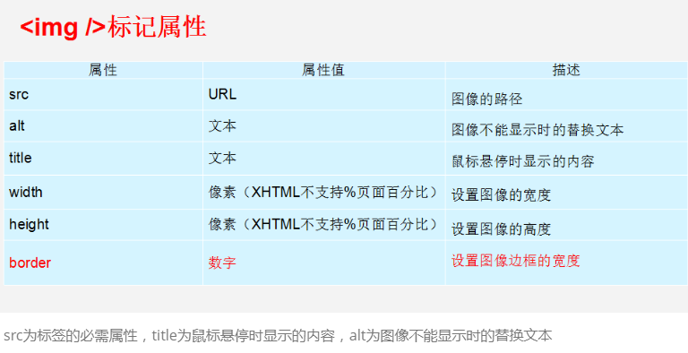

[元素的alt和title有什么区别](https://github.com/haizlin/fe-interview/issues/50)

## 3.HTTP的几种请求方法用途--不熟(AJAX)

- `GET`方法
  - 发送一个请求来取得服务器上的某一资源
- `POST`方法
  - 向`URL`指定的资源提交数据或附加新的数据
- `PUT`方法
  - 跟`POST`方法很像，也是想服务器提交数据。但是，它们之间有不同。`PUT`指定了资源在服务器上的位置，而`POST`没有
- `HEAD`方法
  - 只请求页面的首部
- `DELETE`方法
  - 删除服务器上的某资源
- `OPTIONS`方法
  - 它用于获取当前`URL`所支持的方法。如果请求成功，会有一个`Allow`的头包含类似`“GET,POST”`这样的信息
- `TRACE`方法
  - `TRACE`方法被用于激发一个远程的，应用层的请求消息回路
- `CONNECT`方法
  - 把请求连接转换到透明的`TCP/IP`通道

[了解HTTP基础知识](https://zhuanlan.zhihu.com/p/60450391)

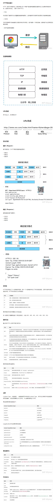

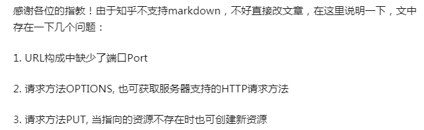

## 4.从浏览器地址栏输入url到显示页面的步骤(讲不出来)

**基础版本**

- 浏览器根据请求的`URL`交给`DNS`域名解析，找到真实`IP`，向服务器发起请求；
- 服务器交给后台处理完成后返回数据，浏览器接收文件（`HTML、JS、CSS`、图象等）；
- 浏览器对加载到的资源（`HTML、JS、CSS`等）进行语法解析，建立相应的内部数据结构（如`HTML`的`DOM`）；
- 载入解析到的资源文件，渲染页面，完成。

**详细简版**

1. 从浏览器接收`url`到开启网络请求线程（这一部分可以展开浏览器的机制以及进程与线程之间的关系）
2. 开启网络线程到发出一个完整的`HTTP`请求（这一部分涉及到dns查询，`TCP/IP`请求，五层因特网协议栈等知识）
3. 从服务器接收到请求到对应后台接收到请求（这一部分可能涉及到负载均衡，安全拦截以及后台内部的处理等等）
4. 后台和前台的`HTTP`交互（这一部分包括`HTTP`头部、响应码、报文结构、`cookie`等知识，可以提下静态资源的`cookie`优化，以及编码解码，如`gzip`压缩等）
5. 单独拎出来的缓存问题，`HTTP`的缓存（这部分包括http缓存头部，`ETag`，`catch-control`等）
6. 浏览器接收到`HTTP`数据包后的解析流程（解析`HTML`-词法分析然后解析成`dom`树、解析`css`生成`css`规则树、合并成`render`树，然后`layout`、`painting`渲染、复合图层的合成、`GPU`绘制、外链资源的处理、`loaded`和`DOMContentLoaded`等）
7. `CSS`的可视化格式模型（元素的渲染规则，如包含块，控制框，`BFC`，`IFC`等概念）
8. `JS`引擎解析过程（`JS`的解释阶段，预处理阶段，执行阶段生成执行上下文，`VO`，作用域链、回收机制等等）
9. 其它（可以拓展不同的知识模块，如跨域，WEB安全，`hybrid`模式等等内容）

**详细版**

1. 在浏览器地址栏输入URL
2. 浏览器查看**缓存**，如果请求资源在缓存中并且新鲜，跳转到转码步骤
   1. 如果资源未缓存，发起新请求
   2. 如果已缓存，检验是否足够新鲜，足够新鲜直接提供给客户端，否则与服务器进行验证。
   3. 检验新鲜通常有两个HTTP头进行控制`Expires`和`Cache-Control`：
      - HTTP1.0提供Expires，值为一个绝对时间表示缓存新鲜日期
      - HTTP1.1增加了Cache-Control: max-age=,值为以秒为单位的最大新鲜时间
3. 浏览器**解析URL**获取协议，主机，端口，path
4. 浏览器**组装一个HTTP（GET）请求报文**
5. 浏览器获取主机ip地址，过程如下：
   1. 浏览器缓存
   2. 本机缓存
   3. hosts文件
   4. 路由器缓存
   5. ISP DNS缓存
   6. DNS递归查询（可能存在负载均衡导致每次IP不一样）
6. 打开一个socket与目标IP地址，端口建立TCP链接，三次握手如下：
   1. 客户端发送一个TCP的**SYN=1，Seq=X**的包到服务器端口
   2. 服务器发回**SYN=1， ACK=X+1， Seq=Y**的响应包
   3. 客户端发送**ACK=Y+1， Seq=Z**
7. TCP链接建立后**发送HTTP请求**
8. 服务器接受请求并解析，将请求转发到服务程序，如虚拟主机使用HTTP Host头部判断请求的服务程序
9. 服务器检查**HTTP请求头是否包含缓存验证信息**如果验证缓存新鲜，返回**304**等对应状态码
10. 处理程序读取完整请求并准备HTTP响应，可能需要查询数据库等操作
11. 服务器将**响应报文通过TCP连接发送回浏览器**
12. 浏览器接收HTTP响应，然后根据情况**选择关闭TCP连接或者保留重用**，关闭TCP连接的四次握手如下
    1. 主动方发送**Fin=1， Ack=Z， Seq= X**报文
    2. 被动方发送**ACK=X+1， Seq=Z**报文
    3. 被动方发送**Fin=1， ACK=X， Seq=Y**报文
    4. 主动方发送**ACK=Y， Seq=X**报文
13. 浏览器检查响应状态吗：是否为1XX，3XX， 4XX， 5XX，这些情况处理与2XX不同
14. 如果资源可缓存，**进行缓存**
15. 对响应进行**解码**（例如gzip压缩）
16. 根据资源类型决定如何处理（假设资源为HTML文档）
17. **解析HTML文档，构件DOM树，下载资源，构造CSSOM树，执行js脚本**，这些操作没有严格的先后顺序，以下分别解释
18. **构建DOM树**
    1. **Tokenizing**：根据HTML规范将字符流解析为标记
    2. **Lexing**：词法分析将标记转换为对象并定义属性和规则
    3. **DOM construction**：根据HTML标记关系将对象组成DOM树
19. 解析过程中遇到图片、样式表、js文件，**启动下载**
20. 构建CSSOM树
    1. **Tokenizing**：字符流转换为标记流
    2. **Node**：根据标记创建节点
    3. **CSSOM**：节点创建CSSOM树
21. [根据DOM树和CSSOM树构建渲染树](https://developers.google.com/WEB/fundamentals/performance/critical-rendering-path/render-tree-construction)
    1. 从DOM树的根节点遍历所有**可见节点**，不可见节点包括：1）`script`,`meta`这样本身不可见的标签。2)被css隐藏的节点，如`display: none`
    2. 对每一个可见节点，找到恰当的CSSOM规则并应用
    3. 发布可视节点的内容和计算样式
22. js解析如下:
    1. 浏览器创建Document对象并解析HTML，将解析到的元素和文本节点添加到文档中，此时**document.readystate为loading**
    2. HTML解析器遇到**没有async和defer的script时**，将他们添加到文档中，然后执行行内或外部脚本。这些脚本会同步执行，并且在脚本下载和执行时解析器会暂停。这样就可以用document.write()把文本插入到输入流中。**同步脚本经常简单定义函数和注册事件处理程序，他们可以遍历和操作script和他们之前的文档内容**
    3. 当解析器遇到设置了**async**属性的script时，开始下载脚本并继续解析文档。脚本会在它**下载完成后尽快执行**，但是**解析器不会停下来等它下载**。异步脚本**禁止使用document.write()**，它们可以访问自己script和之前的文档元素
    4. 当文档完成解析，document.readState变成interactive
    5. 所有**defer**脚本会**按照在文档出现的顺序执行**，延迟脚本**能访问完整文档树**，禁止使用document.write()
    6. 浏览器**在Document对象上触发DOMContentLoaded事件**
    7. 此时文档完全解析完成，浏览器可能还在等待如图片等内容加载，等这些**内容完成载入并且所有异步脚本完成载入和执行**，document.readState变为complete，window触发load事件
23. **显示页面**（HTML解析过程中会逐步显示页面）

## 5.如何进行网站性能优化(不熟)

- `content`方面

  - 减少`HTTP`请求：合并文件、`CSS`精灵、`inline Image`
  - 减少`DNS`查询：`DNS`缓存、将资源分布到恰当数量的主机名
  - 减少`DOM`元素数量

- `Server`方面

  - 使用`CDN`
  - 配置`ETag`
  - 对组件使用`Gzip`压缩

- `Cookie`方面

  - 减小`cookie`大小

- `CSS`方面

  - 将样式表放到页面顶部
  - 不使用`CSS`表达式
  - 使用``不使用`@import`

- `Javascript`方面

  - 将脚本放到页面底部
  - 将`javascript`和`css`从外部引入
  - 压缩`javascript`和`css`
  - 删除不需要的脚本
  - 减少`DOM`访问

- 图片方面

  - 优化图片：根据实际颜色需要选择色深、压缩
- 优化`css`精灵
  - 不要在`HTML`中拉伸图片

  

   **你有用过哪些前端性能优化的方法？**

- 减少http请求次数：CSS Sprites, JS、CSS源码压缩、图片大小控制合适；网页Gzip，CDN托管，data缓存 ，图片服务器。
- 前端模板 JS+数据，减少由于HTML标签导致的带宽浪费，前端用变量保存AJAX请求结果，每次操作本地变量，不用请求，减少请求次数
- 用innerHTML代替DOM操作，减少DOM操作次数，优化javascript性能。
- 当需要设置的样式很多时设置className而不是直接操作style
- 少用全局变量、缓存DOM节点查找的结果。减少IO读取操作
- 避免使用CSS Expression（css表达式)又称Dynamic properties(动态属性)
- 图片预加载，将样式表放在顶部，将脚本放在底部 加上时间戳
- 避免在页面的主体布局中使用table，table要等其中的内容完全下载之后才会显示出来，显示比div+css布局慢


  **谈谈性能优化问题**

- 代码层面：避免使用css表达式，避免使用高级选择器，通配选择器
- 缓存利用：缓存Ajax，使用CDN，使用外部js和css文件以便缓存，添加Expires头，服务端配置Etag，减少DNS查找等
- 请求数量：合并样式和脚本，使用css图片精灵，初始首屏之外的图片资源按需加载，静态资源延迟加载
- 请求带宽：压缩文件，开启GZIP


 **前端性能优化最佳实践？**

- 性能评级工具（PageSpeed 或 YSlow）
- 合理设置 HTTP 缓存：Expires 与 Cache-control
- 静态资源打包，开启 Gzip 压缩（节省响应流量）
- CSS3 模拟图像，图标base64（降低请求数）
- 模块延迟(defer)加载/异步(async)加载
- Cookie 隔离（节省请求流量）
- localStorage（本地存储）
- 使用 CDN 加速（访问最近服务器）
- 启用 HTTP/2（多路复用，并行加载）
- 前端自动化（gulp/WEBpack）

# HTML部分

## 1.页面导入样式时，使用link和@import的区别

> 区别：
>
> ①来源不同：link是HTML提供的语法；@important是CSS提供的语法。
>
> ②功能不同
> ：@important的功能更为广泛。除了可以引入CSS文件，还可以定义 RSS、rel 连接属性。
>
> ③加载顺序不同：link引入的CSS样式在页面加载的同时被加载；而@important引入的CSS样式在页面**加载完成后加载**
>
> ④兼容性不同：link不存在兼容性问题；而@important是CSS2.1以后才有的语法。

[link和@import的区别——博客1](https://www.cnblogs.com/passkey/p/10141553.HTML)

[link与@import的区别——博客2](https://blog.csdn.net/u011394526/article/details/107449726)

## 2.HTML的常见元素有哪些,列举一些(包括H5)

块级元素： < div>、 < h1>~< h6>、< p>、< ul>、< ol>、< li>

行内元素： < span>、< a>、< strong>、< b>、< em>、< i>、< del>、< s>、< ins>、< u>、

行内块元素：  < img />、< input />、< td>

H5新增：  < article>、< header>、< footer>、< main>、< nav> 、< selection>  

[HTML5 新元素](https://www.w3school.com.cn/HTML/HTML5_new_elements.asp)

[HTML5新增元素，标签总结](https://www.cnblogs.com/lanhuo666/p/10723411.HTML)

## 3.HTML全局属性有哪些,列举一些（包含H5）

- id
- class
- name
- title
- data-
- placeholder
- width
- height
- bgcolor
- style
- src
- href
- disabled
- value

## 4.HTML5的文件离线储存怎么使用，工作原理是什么

[有趣的HTML5：离线存储](https://segmentfault.com/a/1190000000732617)

[浅谈如何实现HTML5的离线存储](https://baijiahao.baidu.com/s?id=1598140995266716551&wfr=spider&for=pc)

[HTML5的离线储存怎么使用？](https://segmentfault.com/a/1190000017568211)

## 5.简述超链接target属性的取值和作用(复习完)

< a> 标签的 target 属性规定在何处打开链接文档。

- 语法：`< a target="value">`
- 属性值：

| 值        | 描述                                               |
| --------- | -------------------------------------------------- |
| _blank    | 在新窗口中打开被链接文档。                         |
| _self     | 默认。在相同的框架中打开被链接文档。               |
| _parent   | 在父框架集中打开被链接文档。                       |
| _top      | 在整个窗口中打开被链接文档。                       |
| framename | 在指定的框架中打开被链接文档。                     |
| 任意字符  | 与_blank一致，只是如果打开，就只会刷新已打开的窗口 |

## 6.label都有哪些作用？并举相应的例子说明

### 作用

表示用户界面中某个元素的说明，增加命中区域，屏幕阅读器可以读出标签。使使用辅助技术的用户更容易理解输入 哪些数据

### 用法

单击关联标签激活input，需给**input**一个**id属性**，给**label**一个**for属性**，设为**同一个值**

### 注意事项

一个 input 可以与**多个标签**相关联。
标签本身并不与表单直接相关。它们只通过与它们相关联的控件间接地与表单相关联。
当点击或者触碰（tap）一个与表单控件相关联的 时，关联的控件的 click 事件也会触发。

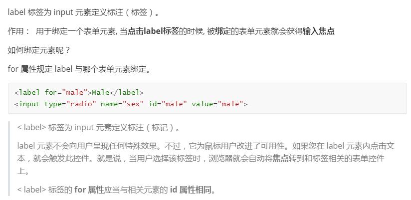

## 7.iframe框架都有哪些优缺点

### 优点：

- 可以实现异步刷新，单个 `iframe` 刷新不影响整体窗口的刷新（可以实现无刷新上传，在 `FormData` 无法使用时）
- 可以实现跨域，每个 `iframe` 的源都可以不相同（方便引入第三方内容）
- 多页面应用时，对于共同的 `header`, `footer` 可以使用 `iframe` 加载，拆分代码（导航栏的应用）

### 缺点：

- 每一个 `iframe` 都对应着一个页面，也就意味着多余的 `css`, `js` 文件的载入，会增加请求的开销
- 如果 `iframe` 内还有滚动条，会严重影响用户体验
- `window.onload` 事件会在所有 `iframe` 加载完成后才触发，因此会造成页面阻塞

## 8.HTML5有哪些新特性、移除了那些元素？

- `HTML5` 现在已经不是 `SGML` 的子集，主要是关于图像，位置，存储，多任务等功能的增加
  - 新增选择器 `document.querySelector`、`document.querySelectorAll`
  - 拖拽释放(`Drag and drop`) API
  - 媒体播放的 `video` 和 `audio`
  - 本地存储 `localStorage` 和 `sessionStorage`
  - 离线应用 `manifest`
  - 桌面通知 `Notifications`
  - 语意化标签 `article`、`footer`、`header`、`nav`、`section`
  - 增强表单控件 `calendar`、`date`、`time`、`email`、`url`、`search`
  - 地理位置 `Geolocation`
  - 多任务 `WEBworker`
  - 全双工通信协议 `WEBsocket`
  - 历史管理 `history`
  - 跨域资源共享(CORS) `Access-Control-Allow-Origin`
  - 页面可见性改变事件 `visibilitychange`
  - 跨窗口通信 `PostMessage`
  - `Form Data` 对象
  - 绘画 `canvas`
- 移除的元素：
  - 纯表现的元素：`basefont`、`big`、`center`、`font`、 `s`、`strike`、`tt`、`u`
  - 对可用性产生负面影响的元素：`frame`、`frameset`、`noframes`
- 支持`HTML5`新标签：
  - `IE8/IE7/IE6`支持通过`document.createElement`方法产生的标签
  - 可以利用这一特性让这些浏览器支持`HTML5`新标签
  - 浏览器支持新标签后，还需要添加标签默认的样式
- 当然也可以直接使用成熟的框架、比如`HTML5shim`

**如何区分 HTML 和 HTML5**

- `DOCTYPE`声明、新增的结构元素、功能元素

## 9.浏览器内多个标签页之间的通信方式有哪些

[网页消息通信是什么](https://xv700.gitee.io/message-communication-for-WEB/#Vue-js-是什么)

* WEBSocket （可跨域）
* postMessage（可跨域）
* Worker之SharedWorker
* Server-Sent Events
* localStorage
* BroadcastChannel
* Cookies

## 10.viewport常见设置都有哪些

在移动端做开发时，必须要搞清楚 `viewport` 这一设置。

`viewport` 就是视区窗口，也就是浏览器中显示网页的部分。PC 端上基本等于设备显示区域，但在移动端上 `viewport` 会超出设备的显示区域（即会有横向滚动条出现）。
设备默认的 `viewport` 在 980 - 1024 之间。

为了让移动端可以很好地显示页面，因此需要对 `viewport` 进行设置。相关的设置值如下：

| 设置          | 解释                                                         |
| ------------- | ------------------------------------------------------------ |
| width         | 设置 layout viewport 的宽度，为一个正整数，或字符串"width-device" |
| initial-scale | 设置页面的初始缩放值，为一个数字，可以带小数                 |
| minimum-scale | 允许用户的最小缩放值，为一个数字，可以带小数                 |
| maximum-scale | 允许用户的最大缩放值，为一个数字，可以带小数                 |
| height        | 设置 layout viewport 的高度，这个属性对我们并不重要，很少使用 |
| user-scalable | 是否允许用户进行缩放，值为"no"或"yes", no 代表不允许，yes 代表允许 |

`viewport` 是在 `meta` 标签内进行控制。

```javascript
// width=device-width, initial-scale=1.0 是为了兼容不同浏览器
<meta
  name="viewport"
  content="width=device-width, initial-scale=1.0, maximum-scale=1.0, user-scalable=0"
/>
```

## 11.你对标签语义化的理解是什么

### 什么是HTML语义化标签

语义化的标签，旨在让标签有自己的含义。

~~~javascript
<p>一行文字</p>
<span>一行文字</span>
~~~

> 如上代码，p 标签与 span 标签都区别之一就是，p 标签的含义是：段落。而 span 标签责没有独特的含义。

### 语义化标签的优势

* 代码结构清晰，方便阅读，有利于团队合作开发。
* 方便其他设备解析（如屏幕阅读器、盲人阅读器、移动设备）以语义的方式来渲染网页。
* 有利于搜索引擎优化（SEO）。

### 常见的语义化标签

- `< title>`：页面主体内容。
- `<hn>`：h1~h6，分级标题，`<h1>` 与 `<title>` 协调有利于搜索引擎优化。
- `<ul>`：无序列表。
- `<ol>`：有序列表。
- `<header>`：页眉通常包括网站标志、主导航、全站链接以及搜索框。
- `<nav>`：标记导航，仅对文档中重要的链接群使用。
- `<main>`：页面主要内容，一个页面只能使用一次。如果是WEB应用，则包围其主要功能。
- `<article>`：定义外部的内容，其中的内容独立于文档的其余部分。
- `<section>`：定义文档中的节（section、区段）。比如章节、页眉、页脚或文档中的其他部分。
- `<aside>`：定义其所处内容之外的内容。如侧栏、文章的一组链接、广告、友情链接、相关产品列表等。
- `<footer>`：页脚，只有当父级是body时，才是整个页面的页脚。
- `<small>`：呈现小号字体效果，指定细则，输入免责声明、注解、署名、版权。
- `<strong>`：和 em 标签一样，用于强调文本，但它强调的程度更强一些。
- `<em>`：将其中的文本表示为强调的内容，表现为斜体。
- `<mark>`：使用黄色突出显示部分文本。
- `<figure>`：规定独立的流内容（图像、图表、照片、代码等等）（默认有40px左右margin）。
- `<figcaption>`：定义 figure 元素的标题，应该被置于 figure 元素的第一个或最后一个子元素的位置。
- `<cite>`：表示所包含的文本对某个参考文献的引用，比如书籍或者杂志的标题。
- `<blockquoto>`：定义块引用，块引用拥有它们自己的空间。
- `<q>`：短的引述（跨浏览器问题，尽量避免使用）。
- `<time>`：datetime属性遵循特定格式，如果忽略此属性，文本内容必须是合法的日期或者时间格式。
- `<abbr>`：简称或缩写。
- `<dfn>`：定义术语元素，与定义必须紧挨着，可以在描述列表dl元素中使用。
- `<address>`：作者、相关人士或组织的联系信息（电子邮件地址、指向联系信息页的链接）。
- `<del>`：移除的内容。
- `<ins>`：添加的内容。
- `<code>`：标记代码。
- `<meter>`：定义已知范围或分数值内的标量测量。（Internet Explorer 不支持 meter 标签）
- `<progress>`：定义运行中的进度（进程）。

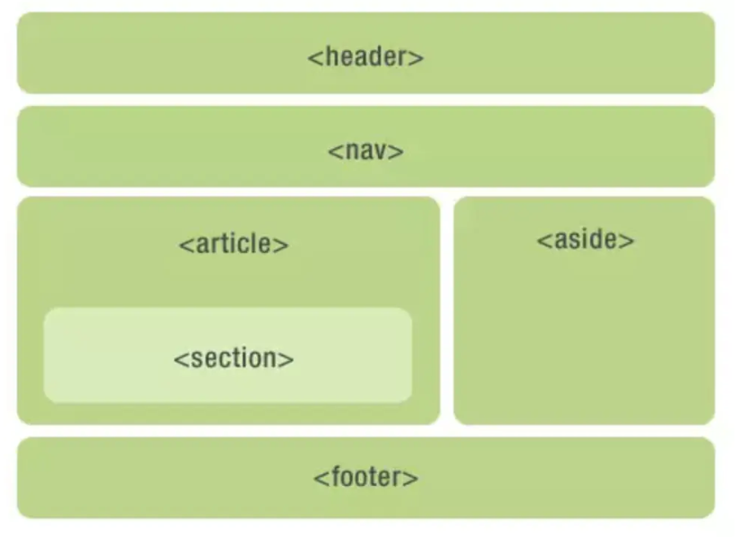

## 12.常见的浏览器内核都有哪些？并介绍下你对内核的理解

浏览器是网页运行的平台，常用的浏览器有**IE、火狐（Firefox）、谷歌（Chrome）、Safari（苹果）和Opera**等。我们平时称为五大浏览器。

浏览器内核又可以分成两部分：**渲染引擎(layout engineer 或者 Rendering Engine)和 JS 引擎**。
渲染引擎 它负责取得网页的内容（HTML、XML、图像等等）、整理讯息（例如加入 CSS 等），以及计算网页的显示方式，然后会输出至显示器或打印机。浏览器的内核的不同对于网页的语法解释会有不同，所以渲染的效果也不相同。
JS 引擎 则是解析 Javascript 语言，执行 javascript语言来实现网页的动态效果。

最开始渲染引擎和 JS 引擎并没有区分的很明确，**后来 JS 引擎越来越独立，内核就倾向于只指渲染引擎。**有一个网页标准计划小组制作了一个 ACID 来测试引擎的兼容性和性能。内核的种类很多，如加上没什么人使用的非商业的免费内核，可能会有10多种，但是常见的浏览器内核可以分这四种：

> Trident：IE内核
>
> Gecko：Firefox 内核
>
> Chromium/Blink：chrome内核(JS引擎为V8引擎)
>
> WEBkit：Safari内核
>
> Opera :Blink内核

## 13.HTML5中的form怎么关闭自动完成

[HTML 5 < form> 标签](https://www.w3school.com.cn/HTML5/tag_form.asp)

[HTML5的form如何关闭自动完成功能](https://blog.csdn.net/shangazhe/article/details/74984282?locationNum=8&fps=1)

form默认是开启的，作用是你之前输入过并且提交过的表单，再次输入时会有会有自动补全的下拉。

~~~
autocomplete="off"
默认是"on" 开启状态
~~~

一般业务下不会调整这个自动完成，因为对产品来说简化用户操作，**建议打开**

~~~javascript
<form action="demo_form.HTML" method="get" autocomplete="off">
  First name:<input type="text" name="fname"><br>
  E-mail: <input type="email" name="email"><br>
  <input type="submit">
</form>
~~~

~~~javascript
<form action="" id="formDom">
        <label for="in1">请输入</label><input id="in1" type="text" >
        <input type="submit" value="提交"  autocomplete='off'>
</form>

let formDom=document.querySelector('#formDom')
    formDom.onclick=function(e){
         e.preventDefault(); //阻止默认事件，防止自动提交
 }
~~~

## 14.为什么HTML5只需要写< !DOCTYPE HTML>就可以

因为 HTML5 与 HTML4 **基于的基准不同**。HTML4 基于 SGML 因此需要除了 `DOCTYPE` 外还需要引入 DTD 来告诉浏览器用什么标准进行渲染。DTD 还分为标准模式、严格模式。如果什么都不写，就完全让浏览器自我发挥，会变成怪异模式。

HTML5 不基于 SGML，因此后面就不要跟 DTD，但是需要 `DOCTYPE` 来规范浏览器的渲染行为。

注：SGML 是通用标记语言的集合。其中有 HTML、XML，因此需要用 DTD 来指定使用那种规范。

## 15.title与h1的区别、b与strong的区别、i与em的区别

* 关于 `title` 和 `h1`，`title` 是网页的标题。主要面向的对象是搜索引擎和通过搜索结果过来的人（面向外人，可以理解为报纸首页的标题）。而 `h1` 是网页内部的标题，是给已经进到页面的人看的（可以理解为报纸某个版面的大标题）。从人类的语境上来理解，两者并没有差别。

* `b` 与 `strong` 的效果人眼上是无法区分的。在语义上，`b` 仅表示加粗既装饰用，我们应该使用 CSS 而不应该使用 `b`；而 `strong` 则表示被包围的内容很重要，是语气上的感觉。对于搜索引擎来说，会把 `b` 和 `strong` 视为同一含义。因此我们在使用上需要注意。

* `i` 与 `em` 的区别类似 `b` 和 `strong` 的区别。`i` 用于斜体展示，我们应该使用 CSS 而不应该使用 `i`；而 `em` 则是对内容的强调，但程度没有 `strong` 那么高。同样，对搜索引擎来说，两者是没有区别的。

## 16.元素的alt和title有什么区别（和第2题重）

[元素的 alt 和 title 有什么区别？](<https://xiangshuo.blog.csdn.net/article/details/89744816>)

### alt属性

最常见用在 `` 标签上，那我们先来看下 `` 标签的 `alt` 属性。

`alt` 属性是一个必需的属性，它规定在图像无法显示时的替代文本。

假设由于下列原因用户无法查看图像，`alt` 属性可以为图像提供替代的信息：

* 网速太慢
* `src` 属性中的错误
* 浏览器禁用图像
* 用户使用的是屏幕阅读器

< img> 标签的 alt 属性指定了替代文本，用于在图像无法显示或者用户禁用图像显示时，代替图像显示在浏览器中的内容。

强烈推荐您在文档的每个图像中都使用这个属性。这样即使图像无法显示，用户还是可以看到关于丢失了什么东西的一些信息。而且对于残疾人来说，`alt` 属性通常是他们了解图像内容的唯一方式。

#### 注释和提示：

注释：`alt` 属性的值是一个最多可以包含 1024 个字符的字符串，其中包括空格和标点。这个字符串必须包含在引号中。这段 `alt` 文本中可以包含对特殊字符的实体引用，但它不允许包含其他类别的标记，尤其是不允许有任何样式标签。

注释：当用户把鼠标移动到 `img` 元素上时，Internet Explorer 会显示出 `alt` 属性的值。这种行为并不正确。所有其他的浏览器正在向规范靠拢，只要当图像无法显示时，才会显示出替代文本。

提示：如果需要为图像创建工具提示，请使用 `title` 属性。

### title属性

#### 定义和用法：

`title` 属性规定关于元素的额外信息。

这些信息通常会在鼠标移到元素上时显示一段工具提示文本（tooltip text）。

提示：`title` 属性常与 `form` 以及 `a` 元素一同使用，以提供关于输入格式和链接目标的信息。同时它也是 `abbr` 和 `acronym` 元素的必需属性。当然 `title` 属性是比较广泛使用的，可以用在除了`base`，`basefont`，`head`，`HTML`，`meta`，`param`，`script` 和 `title` 之外的所有标签。但是并不是必须的。

`title` 属性有一个很好的用途，即为链接添加描述性文字，特别是当连接本身并不是十分清楚的表达了链接的目的。这样就使得访问者知道那些链接将会带他们到什么地方，他们就不会加载一个可能完全不感兴趣的页面。另外一个潜在的应用就是为图像提供额外的说明信息，比如日期或者其他非本质的信息。

## 17.你认为table的作用和优缺点是什么呢

`table` 用于表格数据的展示，并且很符合人们的直观认知。

在 `div`+`css` 布局流行之前，普遍使用 `table` 进行布局。曾经的神器 Dreamweaver 的可视化拖拽也是基于 `table` 布局。

`table` 布局的好处在于样式好控制，特别是居中、对齐。缺点在于会多处非常多的 DOM 节点（想想一个 `td` 里面再来一个 `table`），会导致页面加载变慢、不利于 SEO（`table` 原本就不是用来布局的）。也因此，在 CSS 成熟之后，`table` 布局马上就变成历史了。

## 18.怎样在页面上实现一个圆形的可点击区域

- DOM 元素配合 `border-radius: 50%` 即可实现圆形点击区域。[例子](https://codepen.io/Konata9/pen/zgNJVy?editors=1111)
- 利用 `map` 和 `area` 标签设置圆形点击区域。参考文章:[HTML 标签及在实际开发中的应用](https://www.zhangxinxu.com/wordpress/2017/05/HTML-area-map/)
- 利用 SVG 作出圆形，然后添加点击事件。
- 如果在 `canvas` 上，就需要画出圆形，然后计算鼠标的坐标是否落在圆内。

## 19.说说你对HTML中的置换元素和非置换元素的理解

[置换和非置换元素]([https://blog.doyoe.com/2015/03/15/css/%E7%BD%AE%E6%8D%A2%E5%92%8C%E9%9D%9E%E7%BD%AE%E6%8D%A2%E5%85%83%E7%B4%A0/](https://blog.doyoe.com/2015/03/15/css/置换和非置换元素/))

- 置换元素：一个 内容 不受 CSS 视觉格式化模型控制，CSS 渲染模型并不考虑对此内容的渲染，且元素本身一般拥有固有尺寸（宽度，高度，宽高比）的元素，被称之为置换元素。如img的src，input的type，select的option标签等。

  一般来说 `span` 这种行内非置换元素设置宽高是没有意义的，除非修改 `display: inline-block`。对于行内置换元素，是可以设置宽高的。比如常用的 `img` 标签自适应图片时，我们只需要定义一个宽或者高，剩下的就会自动帮我们计算。

- 非置换元素：非置换元素在w3c没有明确的规定，可以确认的是置换元素之外的就是非置换元素。非置换元素的内容可以直接展示出来

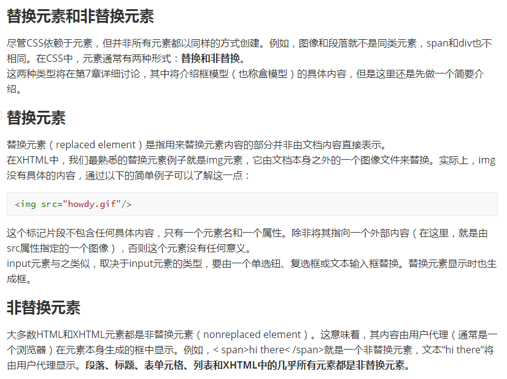

> 这个是《CSS权威指南》里的内容

## 20.请描述HTML元素的显示优先级

[HTML元素的优先级](https://blog.csdn.net/wulex/article/details/76222563)

### 在HTML中，帧元素（frameset）的优先级最高，表单元素比非表单元素的优先级要高。

- 表单元素:
  - 文本输入框，密码输入框，单选框，复选框，文本输入域，列表框等等
- 非表单元素
  - 链接（a），div, table, span 等等

### 有窗口元素比无窗口元素的优先级高

- 有窗口元素
  - select元素，object元素，以及frames元素等等
- 无窗口元素
  - 大部分HTML元素都是无窗口元素

## 21.谈谈你对input元素中readonly和disabled属性的理解

[input标签的readonly属性和disabled属性的区别](<https://blog.csdn.net/sdfujichao/article/details/52101785>)

在表现上 `readonly` 和 `disabled` 都不能让用户对 `input` 进行编辑。但从含义上两者还是有较大的差别的。

`readonly` 直译为 “只读”，一般用于只允许用户填写一次的信息，提交过一次之后，就不允许再次修改了。

`disabled` 直译为 “禁用”，即这个 `input` 就是不允许填写和使用的（可能是因为权限或者其他原因）。

因此在外观上，`readonly` 与普通 `input` 无异，只是点击后无法进行编辑；而 `disabled` 的 `input` 呈灰色，也不允许点击。从这两点其实也可以看出，对于 `input` 的事件，`readonly` 会响应，而 `disabled` 是不响应的。并且在传输数据上，`disabled` 的数据是不会被获取和上传，`readonly` 的数据会被获取和上传。

## 22. JS放在HTML的< body>和< head>有什么区别

[该把JS文件放在HTML文档的那个位置](<https://zhuanlan.zhihu.com/p/26440626>)

js 放在 `<head>` 中，如果不添加 `async` 或者 `defer` 时，当浏览器遇到 `script` 时，会阻塞 DOM 树的构建，进而影响页面的加载。当 js 文件较多时，页面白屏的时间也会变长。

> 在这个过程中，如果解析器遇到了一个脚本(script)，它就会停下来，并且执行这个脚本，然后才会继续解析 HTML。如果遇到了一个引用外部资源的脚本(script)，它就必须停下来等待这个脚本资源的下载，而这个行为会导致一个或者多个的网络往返，并且会延迟页面的首次渲染时间。

把 js 放到 `<body>` 里（一般在 `</body>` 的上面）时，由于 DOM 时顺序解析的，因此 js 不会阻塞 DOM 的解析。对于必须要在 DOM 解析前就要加载的 js，我们需要放在 `<head>` 中。

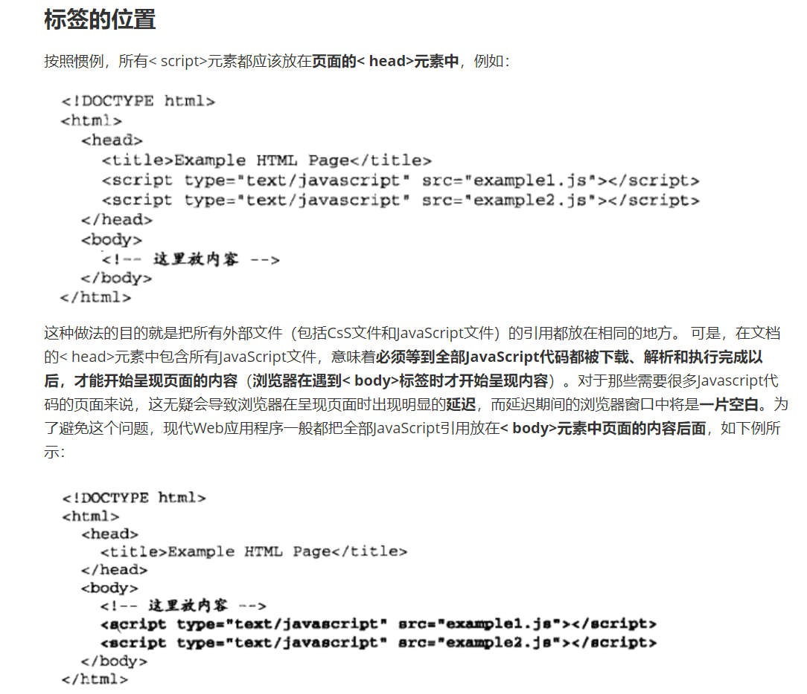

这样，在解析包含的JavaScript代码之前，页面的内容将完全呈现在浏览器中。而用户也会因为测览器窗口显示空白页面的时间缩短而感到打开页面的速度加快了。

## 23.关于< form>标签的enctype属性你有哪些了解

[四种常见的POST请求提交数据方式](<https://blog.csdn.net/bigtree_3721/article/details/82809459>)

`<form>` 标签的 `enctype` 属性，用来控制表单上传的数据的编码格式。其值和 HTTP 请求的 `Content-type` 值一样。在数据提交到服务器之前，会以 `enctype` 的值进行编码。

`enctype` 对应的值如下

| 值                                | 用法                                                         |
| --------------------------------- | ------------------------------------------------------------ |
| application/x-www-form-urlencoded | 默认值，会对所有字符转进行编码 （将空格转换为 "+" 符号，特殊字符转换为 ASCII HEX 值） |
| multipart/form-data               | 不会对字符进行编码，当表单中有文件时必须要此编码             |
| text/plain                        | 将空格转换为 "+" 符号，但不编码特殊字符                      |

## 24.说说你对属性data-的理解

[使用数据属性](<https://developer.mozilla.org/zh-CN/docs/WEB/Guide/HTML/Using_data_attributes>)

原本 HTML 也允许自定义 `attributes` 因此在早期前端，为了将数据塞在标签中，往往会采用自定义属性存放数据的方法。

而 `data-` 便是 HTML 5 中用来存放数据的标签。使用 `data-*` 时，需要注意，`data-` 之后的单词必须是小写的，但是可以用多个 `-` 连接。而在对应的 DOM 方法中，我们可以通过 `ele.dataset[属性名]` 进行访问。在这里的属性名可以使用驼峰（转换规则和 vue 的组件名称转换一样）。

相比之前的自定义属性存放数据，使用 `data-*` 的方法，在数据的获取上会比较方便。

## 25.请说说< script>、< script async>和< script defer>的区别

1. `< script>`立即加载并执行相应的脚本。会阻塞后面的文档加载；
2. `< script async>`异步加载，脚本执行和后续文档代码加载同时进行；
3. `< script defer>`异步加载，脚本的执行需等倒所有文档加载完才执行。

单纯的 `` 会阻塞 DOM 的渲染，如果放在 `` 标签中，对页面的显示会有延迟。如果是用过 `src` 引入外部资源时，浏览器会先停止解析下载外部资源，之后再执行其中的 `javaScript`（即立即加载并渲染）。

在添加 `async` 或者 `defer` 之后，`script` 的下载不会阻塞 DOM 的渲染。两者的区别如下：

- `async` 在脚本下载完成后立即执行（此时会阻塞 DOM 的渲染），并且多个 `async` 脚本存在时，执行的顺序取决于下载完成的顺序。因此对于有前后依赖关系的脚本（比如 jQuery 以及依赖 jQuery 的组件库，就不适合 `async`）
- `defer` 在的脚本执行放在 DOM 渲染之后（对于老的浏览器如果不支持 `defer` 就不行了）。并且多个脚本时，其执行顺序时按照引入顺序执行的。比较符合实际项目众多的需求，但为了兼容老版本浏览器，最佳的实践还是把 `` 放在 `` 前。

三者在浏览器渲染时的区别：

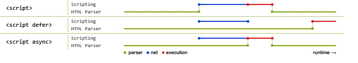

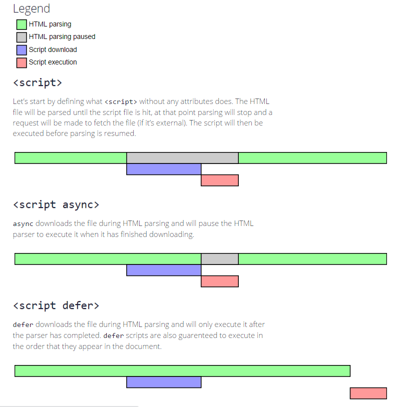

## 26.解释下你对GBK和UTF-8的理解？并说说页面上产生乱码的可能原因

[HTML乱码原因与网页乱码解决方法](http://www.akhtm.com/manual/charset-error.htm)

[网页乱码的产生原因与解决](http://www.akhtm.com/manual/charset-error.htm)

[乱码是怎样形成的？](https://www.zhihu.com/question/22680300)

### GBK和UTF-8的理解

我们这里将以最简单最容易理解的方式来描述GBK和UTF8的区别，以及它们分别是什么。

* GBK编码：是指中国的中文字符，其它它包含了简体中文与繁体中文字符，另外还有一种字符“gb2312”，这种字符仅能存储简体中文字符。

* UTF-8编码：它是一种全国家通过的一种编码，如果你的网站涉及到多个国家的语言，那么建议你选择UTF-8编码。

### GBK和UTF8有什么区别？

UTF8编码格式很强大，支持所有国家的语言，正是因为它的强大，才会导致它占用的空间大小要比GBK大，对于网站打开速度而言，也是有一定影响的。

GBK编码格式，它的功能少，仅限于中文字符，当然它所占用的空间大小会随着它的功能而减少，打开网页的速度比较快。

### 乱码产生的原因

而网页产生乱码往往是因为编码与解码不匹配造成的。一般我们会在 `meta` 标签中的 `content` 设置 `charset` 来决定网页采用的编码。如果引用的文件为其他格式，则会出现无法解释或者解释不对的字符，即乱码问题。

## 27.说说你对影子(Shadow)DOM的了解

[想了解Shadow DOM？看这里](https://www.jianshu.com/p/e47b103f3b60)

[神秘的 shadow-dom 浅析](https://www.cnblogs.com/coco1s/p/5711795.HTML)

顾名思义， `shadow-dom`，直译的话就是 `影子dom` ？我觉得可以理解为潜藏在黑暗中的 DOM 结构，也就是我们无法直接控制操纵的 DOM 结构。前端同学经常用开发者工具的话，查看 DOM 结构的时候，肯定看到过下面这样的结构：

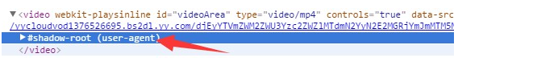

这里的 `#shadow-root` 所包含的内容其实就是所谓的 `shadow-dom` 。

`shadow-dom` 其实是浏览器的一种能力，它允许在浏览器渲染文档（document）的时候向其中的 Dom 结构中插入一棵 DOM 元素子树，但是特殊的是，这棵子树（shadow-dom）并不在主 DOM 树中。

举个栗子，也是最常见的例子， `vedio` 标签，我们创建在页面上创建一个空白的 `video`标签：

~~~javascript
<video id="test"></video>
~~~

查看 DOM 结构如下：

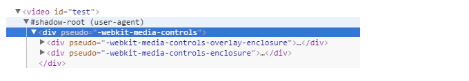

虽然我们创建的是一个空标签，但是在这个空标签内部，存在一个 `shadow-dom` ，点开 `shadow-dom` 可以看到内有乾坤，大有内容。其实这内部的具体内容，就是 `video` 的具体实现。

## 28. 说说你对< meta>标签的理解

[HTML < meta> 标签](https://www.w3school.com.cn/tags/tag_meta.asp)

[HTML之标签全解](https://www.cnblogs.com/lsongyang/p/10071052.HTML)

[前端 Meta 用法大汇总](https://www.jianshu.com/p/850d2a209ba8)

< meta>标签是HTML语言head区的一个辅助性标签，它位于HTML文档头部的head标记和title标记之间，它提供用户不可见的信息。

< meta>：即 **元数据（Metadata）**是数据的基本信息。

元数据可以被使用浏览器（如何显示内容或重新加载页面），搜索引擎（关键词），或其他 WEB 服务调用。

用我们的大白话来说，**它本身是一个没什么用的标签，但是一旦在它内部通过其他属性设置了某些效果，它就起作用了，所以我们称之为“ 元数据 ”。**

它内部可填写的属性如下：

| 属性            | 值                                                         | 描述                                              |
| --------------- | ---------------------------------------------------------- | ------------------------------------------------- |
| charset (HTML5) | character_set                                              | 定义文档的字符编码。                              |
| content         | text                                                       | 定义与 http-equiv 或 name 属性相关的元信息。      |
| http-equiv      | content-type、default-style、refresh                       | 把 content 属性关联到 HTTP 头部。                 |
| name            | application-name、author、description、generator、keywords | 把 content 属性关联到一个名称。                   |
| scheme          | format/URI                                                 | HTML5不支持。 定义用于翻译 content 属性值的格式。 |

## 29.你了解什么是无障碍WEB（WAI）吗？在开发过程中要怎么做呢

[无障碍 WEB](https://mp.weixin.qq.com/s/3QNXBpGB0ZiroV8OGnXCbA)

无障碍设计是指产品, 设备, 服务, 或者环境是为残疾人士设计的。无障碍设计的概念意味着与一个人的辅助技术(例如, 电脑屏幕阅读器)相兼容, 确保直接访问(即独立)和"间接访问"。

无障碍设计可以理解为 "能够访问", 并对一个系统或实体是有利的, 其侧重于使身体残障, 或有特殊需要, 或要依赖辅助技术的人群能够访问 WEB。然后, 研究和开发无障碍设计对每个人都带来了好处。

无障碍设计不应该和可用性混淆。 大多数情况下, 可用性是指产品(如: 设备, 服务, 或者环境)能在特定的环境下被特定的用户使用, 来高效地实现制定目标。

无障碍设计和通用性设计是息息相关的。通用型设计是指产品的创造过程中, 产品对人们是可用的, 并尽可能最大范围覆盖各能力范围内的人群和各种情形下的操作, 即对所有人是可访问的(无论他们访问 WEB 是否有障碍)。

开发中需要做到：

- 语义化标签
- 缩写和简写时，可在title上写出具体意思
- 图片的alt要描述出图片展示的内容

## 30.网页上的验证码是为了解决什么问题？说说你了解的验证码种类有哪些

**解决的问题**

验证码是为了防止脚本恶意注册或者登陆，**增加服务器负担**和**破解密码**等

**验证码种类**

1. 图形验证码
2. 字符验证码 文字+混淆 如早期的7456这种结果的验证码
3. 复杂字符验证码 复杂文字+混淆 如加入中文等本土化的增加识别难度
4. 计算验证码 数字+运算符+混淆 如1+2=? 需要识别表达式增加识别难度
5. 精确识别 文字+混淆文字 如选出 优贝在线 中的 贝字，或者选出所有的筷子，所有的红绿灯（12306）
6. 滑动拼图验证 图像+滑块+图像凹槽 如常见的滑动拼图，提供商有易盾之类的
7. 拼图验证 图像+打乱 需要用户去拼合完成。teamviewer 和 google
8. 物理验证
9. 手机短信验证码
10. 手机语音验证码

## 31.DOM和BOM有什么区别

### DOM

* DOM是**Document Object Model**的缩写，即**文档对象模型**。
* DOM是W3C的标准。
* DOM最根本对象是document（实际上是window.document）。

* DOM 是针对 HTML 的基于树的 API。描述了处理网页内容的方法和接口，是 HTML 的API，DOM 把整个页面规划成由节点层级构成的文档。

### BOM

* BOM是**Browser Object Model**的缩写，即**浏览器对象模型**。
* BOM没有相关标准。
*  BOM的最根本对象是window。

* 提供了独立于内容而与浏览器窗口进行交互的对象。描述了与浏览器进行交互的方法和接口，可以对浏览器窗口进行访问和操作，譬如可以弹出新的窗口，改变状态栏中的文本。

### 二者关系(BOM包含DOM)

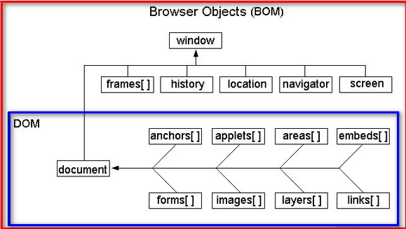

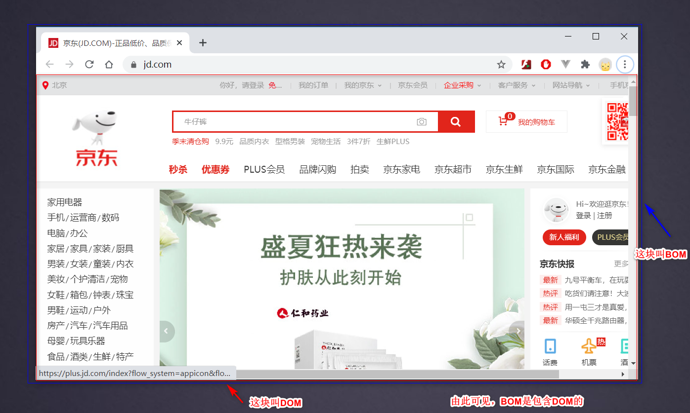

> 因为DOM的顶级对象是document,BOM的顶级对象是window,而BOM又包含DOM,所以document是包含在window里的。

## 32.说说你对HTML元素的显示优先级的理解(重复)

见第20题

## 33.HTML和HTML5有什么区别呢

HTML一般指的是HTML5之前的版本。

[HTML与HTML5有什么区别](https://www.php.cn/div-tutorial-413421.HTML)

* 文档声明区别：在文档声明上，HTML的声明代码很长很复杂，而HTML5的声明更为简单，方便记忆，所以HTML5要比HTML更有利于程序员的快速阅读和开发。
* 结构语义区别：两者结构语义也有所不同。HTML没有结构语义化的标签，通常以`<divid="header"></div>`来命名，HTML5则增加了很多语义化的标签，比如：`<header>` 、`<nav>`、`<article>`、`<aside>`、`<footer>`等，使代码结构清晰，更加具有可读性。
* 绘图区别：HTML5新增了强大的绘图功能，通过绘画功能，加上JS可以实现动画以及图片。而HTML却不行。
* 音频和视频的支持：HTML5还新增了视频标签。这个功能是HTML所不具备的，用HTML插入视频需要很长一段代码，但是用HTML5就只需要`<video>`标签即可。
* 语法的处理:HTML无法处理不准确的语法， 而HTML5能够处理不准确的语法。

## 34.Standards(标准盒)模式和Quirks(怪异盒)模式有什么区别

标准模式宽度就是内容本身，而怪异模式是内容加上padding加上border，但是不加margin。

怪异模式和标准模式最早是为了对旧版本网页进行兼容而设计的，可以通过 `<!DOCTYPE>` 来进行区分。

两者最主要的区别就是在盒子模型上，元素的宽度。
在标准模式下，元素的宽度只是指 width，如果添加了 `padding` 和 `border` 元素实际的宽度需要加上 `padding` 和 `border`。
在怪异模式下，元素的 width 是包含了 `padding` 和 `border`。

通过 CSS 的 `{box-sizing: border-box;}` 来对盒模型进行设置。

虽然标准模式可以算是标准，但实际使用过程中怪异模式反而更符合人的直觉（个人认为）,这样可以减少对 `padding` 和 `border` 的额外计算。

## 35.用一个div模拟textarea的实现

~~~javascript
<!DOCTYPE HTML>
<HTML>
<head>
    <title>用一个div模拟textarea的实现</title>
</head>
<style>
.edit{
    width: 300px;
    height: 200px;
    padding: 5px;
    border: solid 1px #ccc;
    resize: both;
    overflow:auto;
}
</style>
<body>
    <h3>用一个div模拟textarea的实现</h3>
      <div class="edit" contenteditable="true">
        这里是可以编辑的内容，配合容器的 overflow ，多行截断，自定义滚动条，简直好用的不要不要的。
    </div>
</body>
</HTML>
~~~

## 36.HTML与XHTML二者有不同

[XHTML 与 HTML 之间的差异](<https://www.w3school.com.cn/xHTML/xHTML_HTML.asp>)

XHTML 是更严谨更纯净的 HTML 版本。二者的主要不同有：

* XHTML 元素必须被正确地嵌套。
* XHTML 元素必须被关闭。
* 标签名必须用小写字母。
* XHTML 文档必须拥有根元素。

## 37.HTML5哪些标签可以优化SEO

优化 SEO 应该是可以给爬虫有比较明确的含义的标签。尽可能地不要使用 `div` 到底。

* meta:meta 标签中的 keywords 和 description
* title
* alt
* h1~h6

* nav
* header
* main
* article
* section
* aside
* footer

* figure
* picture
* time
* video
* audio

## 38.说说你对cookie和session的理解

由于 http 是无状态的，服务端没法记录客户端的状态。因此 `cookie` 和 `session` 本身就是为了记录客户端的状态，进行会话保持。

只是 `cookie` 是存放在客户端而 `session` 是记录在服务端。`cookie` 可以在客户端生成也可以由服务器生成传给客户端，通过 `name=value` 的形式存储数据。

一般 `cookie` 会记录一个由服务端生成的 token，`session` 同样会记录这个 token。服务端就可以通过 token 来鉴别身份。

`cookie`: 用户通过HTTP第一次访问一个服务器的时候，服务器就会把一个cookie返回给客户端，保存在客户端的内存或者硬盘中，同一个用户下次再访问服务器时，就把cookie带上，这样服务器就认出这个用户了。cookie可以通过客户端, 服务端设置, 容量小, 可以通过设置domain来实现同步登录, 除了name, value, 它还有多个选项, domain, path, secure, expires, 客户端和服务端可以通过cookie来通讯, 传递信息。cookie一般用于存出少量的不太敏感的数据，在不登录的情况下，完成服务器对客户端的身份识别。

`session`: `session`是服务端的会话技术，在一次会话的多次请求间共享数据，`Session`是保存在服务端的，有一个唯一标识，在服务端保存`Session`的方法很多，可以通过内存、数据库、文件都有，集群的时候也要考虑`Session`的转移，在大型的网站，一般会有专门的`Session`服务器集群。

二者区别有：

①安全性：cookie保存在客户端，可在本地查看修改，安全性不高。session的用户信息保存在服务器端，发给客户端的只是一个用户id，相对更安全。

②限制：cookie有大小(4kb)和数量(同一个域名下的总cookie数量最多20个)限制，session没有大小限制，只有时间限制。

## 39.title与h1、b与strong、i与em的区别分别是什么(重复)

（和第15题重复）

* `title`标签写在body里面不会被渲染,只能写在head里面,对网站SEO比较重要
* `h1`标签写在body里面,但是写在head里(不推荐),渲染的时候会自动渲染到body里面去
* `b`标签与`strong`标签在表现上是一样的,都自带`font-weight: bold`属性
* `i`标签与`em`标签在表现上是一样的,都自带`font-style: italic`属性
* `b`标签与`i`标签是物理标记,告诉浏览器以何种格式显示文字
* `strong`标签与`em`标签是逻辑标记,逻辑元素告诉浏览器这些文字有怎么样的重要性

> * **b**: bold ;
> * **strong**: strong ;
> * **i**: Italic ;
> * **em**: emphasize;

## 40.HTML5都有哪些新的特性？移除了哪些元素？(重复)

（和第8题重复）

#### 新增特性

* canvas
* svg
* video
* drag & drop
* localStorage/sessionStorage
* 语义化标签: header/nav/section/article/footer
* input 类型: date/datetime/email/range

#### 移除元素

* applet
* big
* font
* frame/frameset

## 41.WEBSocket怎么做兼容处理

> 我现在连WEBSocket是什么都不知道，先查一下吧。

[WEBSocket](https://baike.baidu.com/item/WEBSocket/1953845?fr=aladdin)

[为什么需要 WEBSocket？](http://www.ruanyifeng.com/blog/2017/05/WEBsocket.HTML)

[WEBSocket 是什么原理？为什么可以实现持久连接？](https://www.zhihu.com/question/20215561)

WEBsocket是一种全双工协议，何谓全双工，即客户端和服务器通信时在同一时刻既可以发送数据又可以接收数据。与之相反的http是半双工，在http通信的过程中，一次只能执行一种操作，发送和接受不能同时进行。半双工功能弱，但简单；全双工功能强，但是复杂。 在项目中我们应该使用WEBsocket还是http，这个需要视需求而定，不经过深思熟虑的随意选择容易产生副作用，虽然这两种协议通常都能实现我们的需求。

## 为什么需要 WEBSocket？

初次接触 WEBSocket 的人，都会问同样的问题：我们已经有了 HTTP 协议，为什么还需要另一个协议？它能带来什么好处？

答案很简单，因为 HTTP 协议有一个缺陷：通信只能由客户端发起。

举例来说，我们想了解今天的天气，只能是客户端向服务器发出请求，服务器返回查询结果。HTTP 协议做不到服务器主动向客户端推送信息。

这种单向请求的特点，注定了如果服务器有连续的状态变化，客户端要获知就非常麻烦。我们只能使用["轮询"](https://www.pubnub.com/blog/2014-12-01-http-long-polling/)：每隔一段时候，就发出一个询问，了解服务器有没有新的信息。最典型的场景就是聊天室。

轮询的效率低，非常浪费资源（因为必须不停连接，或者 HTTP 连接始终打开）。因此，工程师们一直在思考，有没有更好的方法。WEBSocket 就是这样发明的。

### 简介

WEBSocket 协议在2008年诞生，2011年成为国际标准。所有浏览器都已经支持了。

它的最大特点就是，服务器可以主动向客户端推送信息，客户端也可以主动向服务器发送信息，是真正的双向平等对话，属于服务器推送技术的一种。

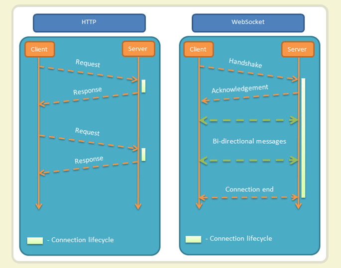

其他特点包括：

（1）建立在 TCP 协议之上，服务器端的实现比较容易。

（2）与 HTTP 协议有着良好的兼容性。默认端口也是80和443，并且握手阶段采用 HTTP 协议，因此握手时不容易屏蔽，能通过各种 HTTP 代理服务器。

（3）数据格式比较轻量，性能开销小，通信高效。

（4）可以发送文本，也可以发送二进制数据。

（5）没有同源限制，客户端可以与任意服务器通信。

（6）协议标识符是`ws`（如果加密，则为`wss`），服务器网址就是 URL。

~~~javascript
ws://example.com:80/some/path
~~~

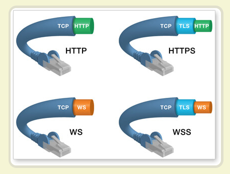

## 42.解释下什么是ISISO8859-2字符集(偏题，不好)

[ASCII](https://baike.baidu.com/item/ASCII/309296?fr=aladdin#6)

ISO/IEC 8859-1，又称Latin-1或“西欧语言”，ISO/IEC 8859-2 Latin-2或“中欧语言”，是国际标准化组织内ISO/IEC 8859的8位字符集。它以ASCII为基础，在空置的0xA0-0xFF的范围内，加入192个字母及符号，藉以供使用变音符号的拉丁字母语言使用。

## 43.如何让元素固定在页面底部？有哪些比较好的实践(★)

[Sticky Footer，完美的绝对底部](https://aotu.io/notes/2017/04/13/Sticky-footer/index.HTML)

所谓 “Sticky Footer”，并不是什么新的前端概念和技术，它指的就是一种网页效果：
如果页面内容不足够长时，页脚固定在浏览器窗口的底部；如果内容足够长时，页脚固定在页面的最底部。
**总而言之，就是页脚一直处于最底**，效果大致如图所示：

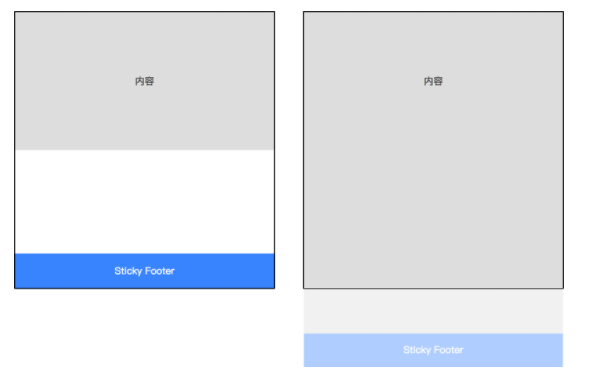

当然，实现这种效果的方法有很多种，其中有通过脚本计算的，有通过 CSS 处理的，脚本计算的方案我们不在本文探讨。
下面我们看看有哪些通过 CSS 可以实现且适用于移动端开发的方案，并分析其中的利弊。

### 实现方案一：absolute

通过绝对定位处理应该是常见的方案，只要使得页脚一直定位在主容器预留占位位置。

~~~html
HTML, body {
    height: 100%;
}
.wrapper {
    position: relative;
    min-height: 100%;
    padding-bottom: 50px;
    box-sizing: border-box;
}
.footer {
    position: absolute;
    bottom: 0;
    height: 50px;
}
~~~

这个方案需指定 HTML、body 100% 的高度，且 content 的 `padding-bottom` 需要与 footer 的 `height` 一致。

### 实现方案二：calc

通过计算函数 calc 计算（视窗高度 - 页脚高度）赋予内容区最小高度，不需要任何额外样式处理，代码量最少、最简单。

~~~html
.content {
    min-height: calc(100vh - 50px);
}
.footer {
    height: 50px;
}
~~~

如果不需考虑 `calc()` 以及 `vh` 单位的兼容情况，这是个很理想的实现方案。
同样的问题是 footer 的高度值需要与 content 其中的计算值一致。

### 实现方案三：Flexbox

Flexbox 是非常适合实现这种效果的，使用 Flexbox 实现不仅不需要任何额外的元素，而且允许页脚的高度是可变的。

虽然大多数 Flexbox 布局常用于水平方向布局，但别忘了实际上它也可用于垂直布局，所以你需要做的是将垂直部分包装在一个 Flex 容器中，并选择要扩展的部分，他们将自动占用其容器中的所有可用空间。

~~~html
HTML {
    height: 100%;
}
body {
    min-height: 100%;
    display: flex;
    flex-direction: column;
}
.content {
    flex: 1;
}
~~~

需要注意的是想要兼容各种系统设备，需要兼顾 `flex` 的兼容写法。

## 44.说说video标签中预加载视频用到的属性是什么

`preload`。

`video`标签属性如下其他属性如下：

| 属性     | 值       | 描述                                                         |
| -------- | -------- | ------------------------------------------------------------ |
| autoplay | autoplay | 如果出现该属性，则视频在就绪后马上播放。                     |
| controls | controls | 如果出现该属性，则向用户显示控件，比如播放按钮。             |
| height   | pixels   | 设置视频播放器的高度。                                       |
| loop     | loop     | 如果出现该属性，则当媒介文件完成播放后再次开始播放。         |
| preload  | preload  | 如果出现该属性，则视频在页面加载时进行加载，并预备播放。如果使用 "autoplay"，则忽略该属性。 |
| src      | url      | 要播放的视频的 URL。                                         |
| width    | pixels   | 设置视频播放器的宽度。                                       |

## 45.HTML与XML有什么区别

[HTML和XML的区别](https://www.cnblogs.com/keyi/p/7131391.HTML)

* HTML(HyperTextMark-upLanguage)：即超文本标记语言，是WWW的描述语言。  

* XML(ExtentsibleMarkup Language)：可扩展标记语言，是用来定义其它语言的一种元语言，其前身是SGML(标准通用标记语言)。它没有标签集(tagset)，也没有语法规则(grammatical rule)，但 是它有句法规则(syntax rule)。任何XML文档对任何类型的应用以及正确的解析都必须是良构的(well-formed)，即每一个打开的标签都必须有匹配的结束标签，不得含有次序颠倒的标签，并且在语句构成上应符合技术规范的要求。XML文档可以是有效的(valid)，但并非一定要求有效。所谓有效文档是指其符合其文档类型定义(DTD)的文档。如果一个文档符合一个模式(schema)的规定，那么这个文档是模式有效的(schema valid)。

### 二者区别

**语法要求不同：**

*  在HTML中不区分大小写，在XML中严格区分。
* 在HTML中，有时不严格，如果上下文清楚地显示出段落或者列表键在何处结尾，那么你可以省略`< /p>`或者`</li>`之类的结束标记。在XML中，是严格的树状结构，绝对不能省略掉结束标记。
* 在XML中，拥有单个标记而没有匹配的结束标记的元素必须用一个/ 字符作为结尾。这样分析器就知道不用查找结束标记了。
*  在XML中，属性值必须分装在引号中。在HTML中，引号是可用可不用的。 
* 在HTML中，可以拥有不带值的属性名。在XML中，所有的属性都必须带有相应的值。 
* 在XML文档中，空白部分不会被解析器自动删除；但是HTML是过滤掉空格的。

**标记不同：**

* HTML使用固有的标记，而XML没有固有的标记。

* HTML标签是预定义的，而XML标签是免费的、自定义的、可扩展的。

**作用不同：**

* HTML是用来显示数据的；XML是用来描述数据、存放数据的，所以可以作为持久化的介质！HTML将数据和显示结合在一起，在页面中把这数据显示出来；XML则将数据和显示分开。 XML被设计用来描述数据，其焦点是数据的内容。HTML被设计用来显示数据，其焦点是数据的外观。

* XML不是HTML的替代品，XML和HTML是两种不同用途的语言。 XML 不是要替换 HTML；实际上XML 可以视作对 HTML 的补充。XML 和HTML 的目标不同HTML 的设计目标是显示数据并集中于数据外观，而XML的设计目标是描述数据并集中于数据的内容。

* 没有任何行为的XML。与HTML 相似，XML 不进行任何操作。（共同点）

* 对于XML最好的形容可能是: XML是一种跨平台的，与软、硬件无关的，处理与传输信息的工具。

* XML未来将会无所不在。XML将成为最普遍的数据处理和数据传输的工具。

> XML已经不行了，现在都用JSON了，并不是“无处不在了”，这已经算是比较老的技术了，被淘汰了。

## 46.页面中怎么嵌入Flash？有哪些方法？写出来

> FLASH都要被淘汰了，谷歌浏览器2021年后都不支持FLASH了，所以这个不是一个好题

~~~html
<object width="550" height="400">
	<param name="movie" value="somefilename.swf">
	<embed src="somefilename.swf" width="550" height="400"></embed>
</object>
~~~

## 47.HTML5如何使用音频和视频

[HTML 5 < video> 标签](https://www.w3school.com.cn/html5/html5_video.asp)

[HTML 5 < audio> 标签](https://www.w3school.com.cn/html5/html5_audio.asp)

HTML5 新标签可以直接用`video`和`audio`标签，但是想要自动播放还有些兼容性问题，在手机上各浏览器需要做兼容处理。

### video标签

< video>标签定义视频，比如电影片段或其他视频流。

~~~html
<video src="movie.ogg" controls="controls">
您的浏览器不支持 video 标签。
</video>
~~~

> 可以在开始标签和结束标签之间放置文本内容，这样老的浏览器就可以显示出不支持该标签的信息。

| 属性                                                         | 值       | 描述                                                         |
| :----------------------------------------------------------- | :------- | :----------------------------------------------------------- |
| [autoplay](https://www.w3school.com.cn/html5/att_video_autoplay.asp) | autoplay | 如果出现该属性，则视频在就绪后马上播放。                     |
| [controls](https://www.w3school.com.cn/html5/att_video_controls.asp) | controls | 如果出现该属性，则向用户显示控件，比如播放按钮。             |
| [height](https://www.w3school.com.cn/html5/att_video_height.asp) | *pixels* | 设置视频播放器的高度。                                       |
| [loop](https://www.w3school.com.cn/html5/att_video_loop.asp) | loop     | 如果出现该属性，则当媒介文件完成播放后再次开始播放。         |
| [preload](https://www.w3school.com.cn/html5/att_video_preload.asp) | preload  | 如果出现该属性，则视频在页面加载时进行加载，并预备播放。如果使用 "autoplay"，则忽略该属性。 |
| [src](https://www.w3school.com.cn/html5/att_video_src.asp)   | *url*    | 要播放的视频的 URL。                                         |
| [width](https://www.w3school.com.cn/html5/att_video_width.asp) | *pixels* | 设置视频播放器的宽度。                                       |

### audio标签

< audio>标签定义声音，比如音乐或其他音频流。

~~~html
<audio src="someaudio.wav">
您的浏览器不支持 audio 标签。
</audio>
~~~

> 可以在开始标签和结束标签之间放置文本内容，这样老的浏览器就可以显示出不支持该标签的信息。

| 属性                                                         | 值       | 描述                                                         |
| :----------------------------------------------------------- | :------- | :----------------------------------------------------------- |
| [autoplay](https://www.w3school.com.cn/html5/att_audio_autoplay.asp) | autoplay | 如果出现该属性，则音频在就绪后马上播放。                     |
| [controls](https://www.w3school.com.cn/html5/att_audio_controls.asp) | controls | 如果出现该属性，则向用户显示控件，比如播放按钮。             |
| [loop](https://www.w3school.com.cn/html5/att_audio_loop.asp) | loop     | 如果出现该属性，则每当音频结束时重新开始播放。               |
| [preload](https://www.w3school.com.cn/html5/att_audio_preload.asp) | preload  | 如果出现该属性，则音频在页面加载时进行加载，并预备播放。如果使用 "autoplay"，则忽略该属性。 |
| [src](https://www.w3school.com.cn/html5/att_audio_src.asp)   | *url*    | 要播放的音频的 URL。                                         |

## 48.说说你对WEB标准和W3C的理解与认识

>  WEB标准指的是要符合ECMA和W3C的规范。
>
> W3C是对CSS、JS、XML、HTML等的规范和标准，为了更方便使用者和开发者

网页主要由三个部分组成，表现、结构和行为。

我理解的就是：

HTML是名词--表现
CSS是形容词--结构

Javascript是动词--行为
以上这三个东西就形成了一个完整的网页，但是js改变时，可以会造成css和html的混乱，让这三个的界限不是那么清晰。

这个时候，WEB标准就出来了，WEB标准一般是将该三部分独立分开，使其更具有模块化。

W3C对WEB标准提出了规范化的要求，也就是在实际编程中的一些代码规范：包含如下几点

1.对于结构要求：（标签规范可以提高搜索引擎对页面的抓取效率，对SEO很有帮助）

标签字母要小写
标签要闭合
标签不允许随意嵌套

2.对于CSS和JS来说

尽量使用外链css样式表和js脚本。是结构、表现和行为分为三块，符合规范。同时提高页面渲染速度，提高用户的体验。
样式尽量少用行间样式表，使结构与表现分离，标签的id和class等属性命名要做到见文知义，标签越少，加载越快，用户体验提高，代码维护简单，便于改版

这里顺便解释下什么是WEB标签语义化，即用正确的标签做正确的事情。

比如：

W3C组织意识到了之前HTML版本的不足，推出的HTML5进一步推进了WEB语义化发展，采用了诸如footer、section等语义化标签，弥补了采用id="footer"或者class="footer"形式的不足，以更好的推动WEB的发展。

## 49.说说你对target="_blank"的理解？有啥安全性问题？如何防范？

[你从未注意的隐藏危险: target = "_blank" 和 "opener"](https://zhuanlan.zhihu.com/p/53132574)

**理解**：在新的空白页, 打开该链接。
**安全性问题**：如果你的网站上有一个使用了 target="_blank" 的 a 标签链接，一旦用户点击了这个链接打开了新的标签页，如果这个标签页跳转的网站内存在的恶意代码，那么你原本页面的网站可能会被转到一个假的页面。也就是说，当用户回到原本的页面时，他看到的可能就是已经被替换过的钓鱼页面了。

**防范**：首先，你可以添加 rel="noopener" 到网站的 a 标签上（也推荐使用 rel="noreferrer"）, 如果算上 target="_blank"，那么看起来大概是这样：

~~~javascript
<a href="https://an.evil.site" target="_blank"
   rel="noopener noreferrer">
  Enter an "evil" website
</a>
~~~

当然，当你要跳转到第三方网站的时候，就推荐添加 rel="nofollow" 来调整 SEO 权重。这看起来像：

~~~javascript
<a href="https://an.evil.site" target="_blank" 
   rel="noopener noreferrer nofollow">
  Enter an "evil" website
</a>
~~~

## 50.Ajax与Flash的优缺点分别是什么

Ajax 只是一套异步发网络请求然后更新页面的实践方案，Flash 是一个浏览器插件，但提供的是相对完整的运行时平台。Flash 被移动端抛弃了，连亲娘都不要它了。

> Chrome在2020年底就不支持flash了。

# CSS部分

## 1.圣杯布局和双飞翼布局的理解和区别，并用代码实现(未完)

圣杯布局和双飞翼布局是前端工程师需要日常掌握的重要布局方式。两者的功能相同，都是为了实现一个**两侧宽度固定，中间宽度自适应的三栏布局**。

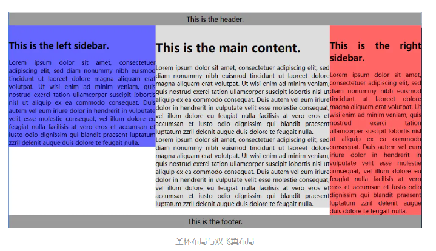

圣杯布局来源于文章[In Search of the Holy Grail](https://alistapart.com/article/holygrail)，而双飞翼布局来源于淘宝UED。虽然两者的实现方法略有差异，不过都遵循了以下要点：

- **两侧宽度固定**，**中间宽度自适应**
- 中间部分在DOM结构上优先，以便先行渲染
- 允许三列中的任意一列成为最高列
- 只需要使用一个额外的`<div>`标签

### 圣杯布局

[圣杯布局和双飞翼布局的理解与思考](https://www.jianshu.com/p/81ef7e7094e8)

[圣杯布局与双飞翼布局全解](https://www.cnblogs.com/pink-chen/p/10582741.HTML)

## 2.CSS3有哪些新增的特性

[CSS3新增了哪些特性](https://blog.csdn.net/weixin_42561383/article/details/100086169)

[CSS3有哪些新的特性?(十大类)](https://blog.csdn.net/mrhuanhuan/article/details/82846056)

## 3.在页面上隐藏元素的方法有哪些

### 占位(停职留薪):

- `visibility: hidden;`
- `margin-left: -100%;`
- `opacity: 0;`
- `transform: scale(0);`

### 不占位(不保留原来的位置):

- `display: none;`
- `width: 0; height: 0; overflow: hidden;`

仅对块内文本元素:

- `text-indent: -9999px;`
- `font-size: 0;`

## 4.CSS选择器有哪些？哪些属性可以继承

**选择器**

- 通配符
- id
- class
- 标签
- 后代选择器
- 子选择器
- 兄弟选择器
- 属性选择器
- 伪类选择器
- 伪元素选择器

**可以继承的属性**

- font-size
- font-weight
- font-style
- font-family
- color

> 属性继承好像只要有inherit属性都可以继承，详情自查

[具有继承inherit的CSS属性汇总](https://www.cnblogs.com/caijf/articles/2834203.HTML)

[关于CSS属性继承](https://www.jianshu.com/p/1e7c552f28bd)

## 5.CSS3新增伪类有哪些并简要描述

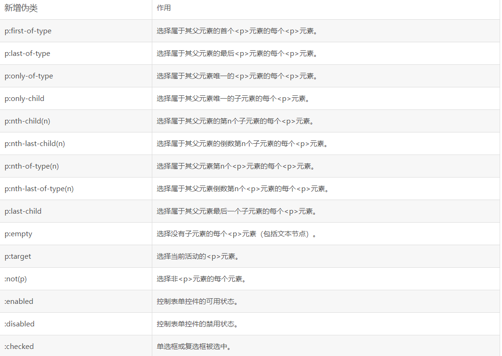

## **6.用CSS创建一个三角形，并简述原理**

[CSS绘制三角形—border法](https://www.jianshu.com/p/9a463d50e441)

~~~css
<div class='rect'></div>
<style>
    .rect {
      width: 0;
      height: 0;
      background-color: #fff;
      border-right: 100px solid rgb(34, 230, 220);
      border-left: 100px solid rgb(202, 146, 25);
      border-top: 100px solid rgb(29, 156, 194);
      border-bottom: 100px solid rgb(16, 204, 101);
    }
  </style>
~~~


创建一个div，宽高都为0，实现效果如下，发现border的四个边都是一个三角形，要实现三角形只需将其中几个边`background`设置为`transparent`，即可得到三角形。

~~~javascript
 <style>
    .rect {
      width: 0;
      height: 0;
      background-color: #fff;
      border-right: 100px solid transparent;
      border-left: 100px solid transparent;
      border-top: 100px solid rgb(29, 156, 194);
      border-bottom: 100px solid transparent;
    }
  </style>
~~~

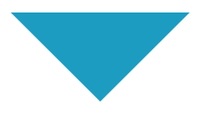

## 7.简述你对BFC规范的理解

[BFC 深入理解](https://juejin.im/entry/6844903456851886093)

[大白话讲解什么是BFC](https://zhuanlan.zhihu.com/p/98125329)

[10 分钟理解 BFC 原理](https://zhuanlan.zhihu.com/p/25321647)

### 概念

BFC 全称“**块级格式化上下文**”(Block Formatting Context)，是CSS中的一个**渲染机制**(对应的还有 IFC)。BFC 类似一个“**结界**”，**如果一个 DOM 元素具有 BFC，则内部的元素与外界的元素互不干扰**。**它不会影响外部的布局，外部的布局也不会影响到它**。

最常见的例子就是清除 `float` 的 `overflow: hidden;` 属性。`overflow: hidden;` 会触发元素的 BFC，因此其内部的 `float` 元素不会影响到外部元素的布局。

### 可视化格式模型

在分享BFC之前，有必要谈谈另外一个概念。也就是**可视化格式模型**。

我们知道，CSS元素可分为两种，块级元素和行内元素。块级元素显示为块内容，对应着CSS元素框的‘块框’。行内元素显示在一行中，对应着CSS元素框的‘行内框’。

块框在DOM中从上到下一个接一个地垂直排列，每一个块框之间地垂直距离由框的垂直外边距决定。如果在某个div内定义了一段纯文本，此时这段纯文本会被包含在匿名块框内。

行内框在DOM中从左到右一个接一个地水平排列，由一行形成的水平框称为行框，行框的高度总是足以容纳它包含的所有行内框。行内框（行内元素）可以通过水平`padding`、`border`、`margin`来改变两两行内框的水平间距。但是，垂直`border`、`padding`、`margin`不影响两两行内框的垂直间距，同时垂直方向不占据任何空间。如果想要改变行内框（行内元素）的高度，可以使用`line-height`来改变。

line-heignt主要用于控制行框的高度。

看个图示。上为水平，下为垂直。

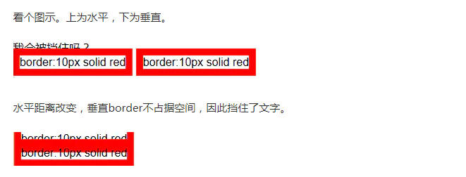

W3school中指出，`display`属性可以规定某个元素生成框的类型。比如说，将某个行内元素设置`display:block`，此时，行内元素对应的行内框因为display属性的影响，行内框变成了块框，即行内元素可以拥有像块级元素一样的特性。

### BFC（Block Formatting Context，块级格式化上下文）

知道可视化格式模型之后，我们来谈谈BFC。

我理解的BFC，其实就像一个隐藏技能，这种隐藏的技能是被动的，需要通过其他技能的使用才能发挥它的作用。在CSS中，BFC其实就是一个隐藏属性，这种隐藏属性需要其他特定的CSS属性定义之后才会被触发。当触发了BFC这个隐藏属性之后，就可以解决一系列的问题。

从可视化格式模型上来说，每一个块框都可以看成是一个拥有隐藏的BFC属性，在DOM中从上到下垂直排列，块框之间的距离由外边距决定。

普通文档流的父级块框就是自带隐藏BFC属性的，不同的块框可能会在内部产生块级格式化上下文。

#### 触发BFC的条件：

* 父级块框自带隐藏BFC属性
* 浮动元素
* 绝对定位元素（包括`absolute`和`fixed`）

- `overflow`属性为`hidden|auto|scroll`
- 框类型`display` 的值为 `table-cell`, `table-caption`,`inline-block` ,`flex`,`inline-flex`中任何一个

#### BFC可以解决的问题：

* (BFC与margin)同一个父级块框下，兄弟元素和父子元素的margin会发生重叠问题

* (BFC与float)父元素高度塌陷问题、兄弟元素覆盖问题

### BFC与margin

margin重叠的解决方法：让元素处于不同的BFC属性环境下。

#### 兄弟元素

在同一个父级块框下，兄弟元素和父子元素的margin会发生重叠，并且这种重叠会遵循一定得规则：同号取大，异号相加。具体可以看看关于margin的介绍。传送门：[CSS margin](http://www.cnblogs.com/Uncle-Keith/p/5786458.html)

兄弟元素的margin重叠的解决方法：**任一个兄弟元素**的属性设置如下：

`float:left|right`或者`position:absolute|fixed`或者`display:inline-block|table-cell|table-caption|flex|inline-flex`

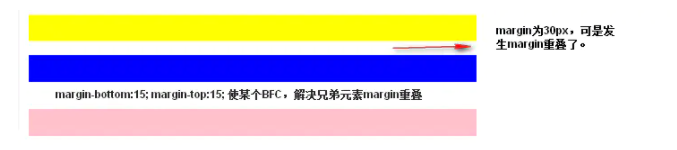

#### 父子元素

父子元素的margin重叠解决方法：父元素设置以下任意属性：`overflow:hidden|auto|scroll`，或者给父元素设置`padding`或`border`属性。

如果元素没有垂直`border`或者`padding`，那么父元素的高度就是它包含的子元素的顶部和底部边框边缘之间的距离。因此，包含的子元素的顶部和底部外边距就突出到容器元素的外边。因此，可以通过添加垂直`border`或者`padding`，外边距就不会叠加了，而且父元素的高度就是它包含的子元素的顶部和底部外边距边缘之间的距离。

~~~css
.father { 
    backgrund:blue;
    width:500px;
    height:50px;
    margin-top:15px;
    overflow:hidden; //padding:1px;  //border:1px solid green;
}
.child {
    height:30px;
    width:500px;
    background:pink;
    margin-top:15px;    
}
~~~

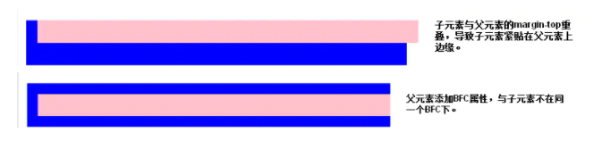

### BFC与浮动

#### 兄弟元素

在两个兄弟元素a和b中，如果a元素设置了float属性，b元素的布局会受到影响，此时a元素会覆盖在b元素上，如果b元素存在文字，那么文字会环绕a元素显示。

* 没有设置`overflow:hidden|auto|scroll`时

  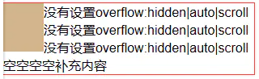

* 设置`overflow:hidden|auto|scroll`时

  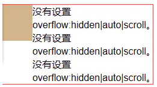

使其中一个兄弟元素触发BFC之后就不会被其浮动元素覆盖，使用这种float+overflow的方式可以实现一侧固定，一侧自适应的布局效果。

#### 父子元素

BFC与浮动如果针对父子元素，当然是解决父元素高度塌陷的问题了。

在W3C中指出` 'Auto' heights for block formatting context roots`，也就是BFC会根据子元素的情况自动适应高度，即使其子元素中包括浮动元素。

给父元素设置以下任意属性，触发BFC隐藏属性： `overflow:hidden|auto|scroll` 、 `position:absolute`、`float:left|right`、`display:inline-block`

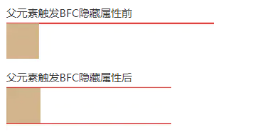

### 特性

- 内部的盒子会在垂直方向上一个接一个的放置
- 对于同一个BFC的俩个相邻的盒子的margin会发生重叠，与方向无关。
- 每个元素的左外边距与包含块的左边界相接触（从左到右），即使浮动元素也是如此
- BFC的区域不会与float的元素区域重叠
- 计算BFC的高度时，浮动子元素也参与计算
- BFC就是页面上的一个隔离的独立容器，容器里面的子元素不会影响到外面的元素，反之亦然

## 8.清除浮动的方式有哪些及优缺点

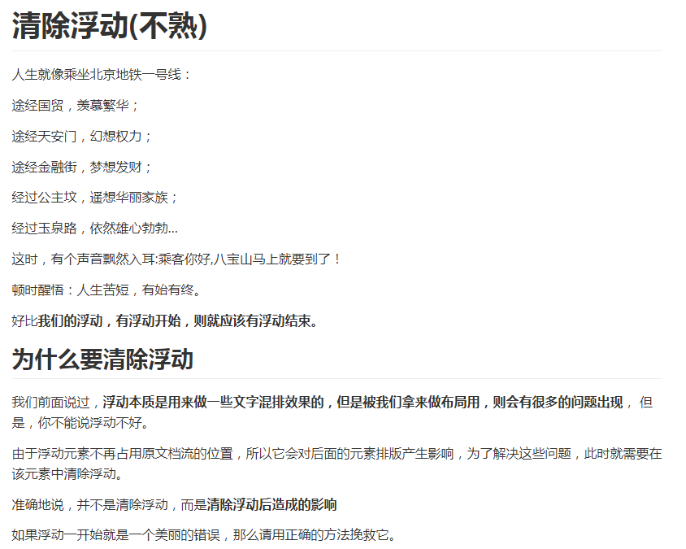

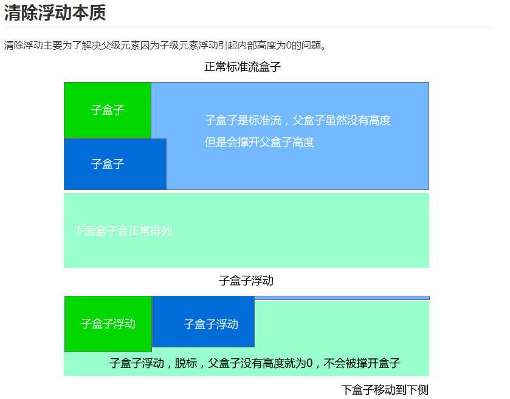

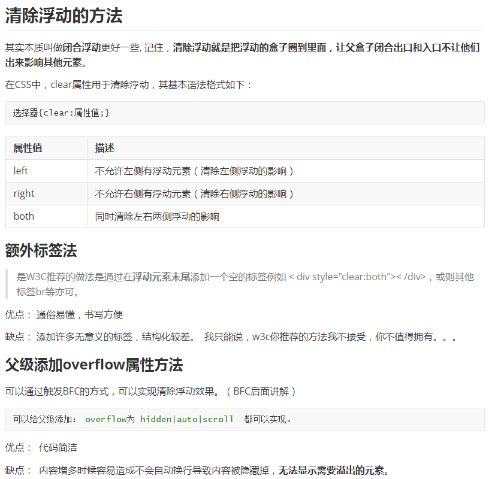

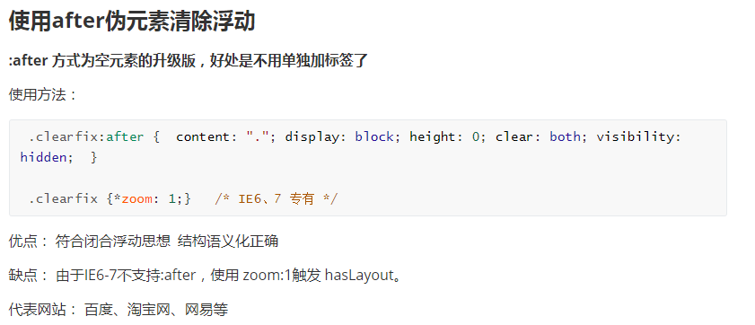

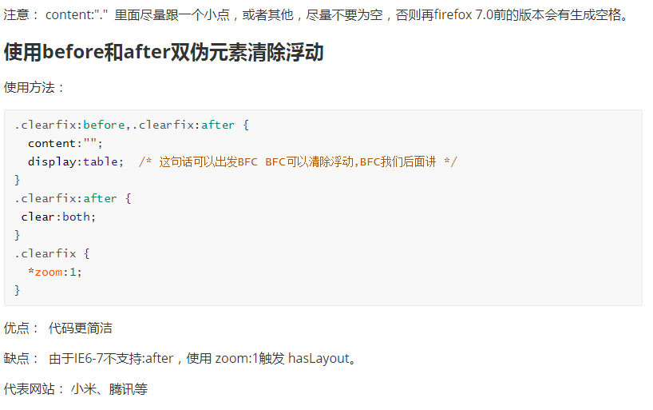

## 9.简述下你理解的优雅降级和渐进增强


渐进增强和优雅降级这两个概念是在 **CSS3 出现之后火起来的**。由于低级浏览器不支持 CSS3，但是 CSS3 特效太优秀不忍放弃，所以在高级浏览器中使用 CSS3，而在低级浏览器只保证最基本的功能。

### 优雅降级

先不考虑兼容，优先最新版本浏览器效果，之后再逐渐兼容低版本浏览器。

### 渐进增强

考虑兼容，以较低（多）浏览器效果为主，之后再逐渐增加对新版本浏览器的支持，以内容为主。也是多数公司所采用的方法。

## 10.对比下px、em、rem有什么不同

* px: 绝对固定的值，无论页面放大或者缩小都不会改变。
* em: 相对父元素字体大小的倍数。如果父元素的字体为 `12px`，那么子元素 `1em` 就是 `24px`。由于是相对父级的倍数，所以多层嵌套时，倍数关系的计算会很头痛。
* rem: 相对根元素字体大小的倍数。相对于 `HTML` 的字体大小，如果不做任何修改，浏览器默认字体大小为 `16px`。

### 小技巧

如果为了方便计算 `rem`，可以设置 `font-size= 62.5%` 这样一来默认的字体就变成 `10px` 了。之后的 `rem` 就是以 `10` 为基准了。

[px、em、rem区别](<https://zhuanlan.zhihu.com/p/24502908>)

## 11.CSS常用的布局方式有哪些

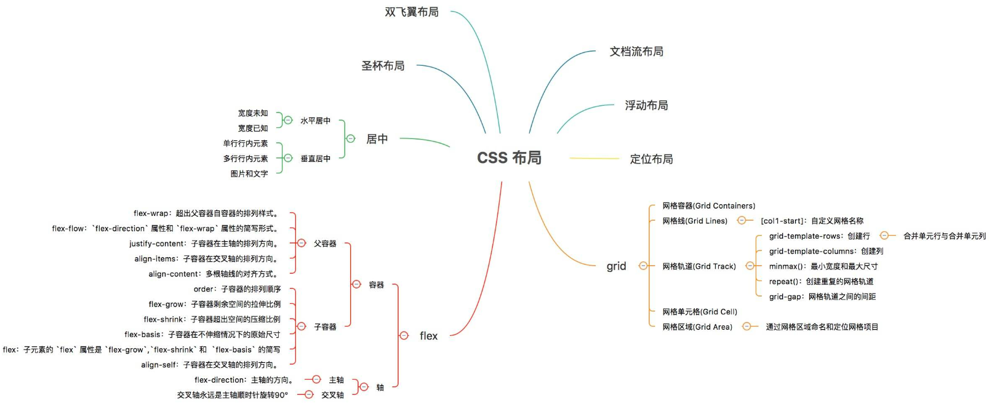

[CSS 常见布局方式](https://juejin.im/post/6844903491891118087)

## 12.说说你对CSS盒子模型的理解

* css盒模型由两个盒子组成，外在的控制是否换行的盒子，以及内在的控制元素内容的盒子。比如：display: inline-block, 则它的外在的盒子就是inline也就是不占据一行，而block则表示内部的元素具有块状特性。所以，display: inline其实就是display: inline-inline的缩写，display: block就是display: block-block的缩写。

* 每一个内在的盒子有: width/height, padding, border, margin这几个控制盒子大小的属性。其中 width/height控制元素内容大小，padding则控制元素内容到border线内侧距离，border则是元素外围边框大小，而margin则是控制与其他元素的间距，它的背景透明。

* 对于早期，计算一个元素的占据大小，需要通过width +2* padding + 2*border来计算，css3中提出了box-sizing：border-box，通过这样设置，就可以使元素最终的宽高就是设定的width/height, 浏览器会根据width/height, padding, border的大小来自动调整内部元素的大小。

> 所谓盒子模型就是把HTML页面中的元素看作是一个矩形的盒子，也就是一个盛装内容的容器。每个矩形都由**元素的内容**、**内边距（padding）**、**边框（border）**和**外边距（margin）**组成。

### 盒子模型分为IE盒子模型和标准盒子模型

标准盒子模型：包括margin,border,padding,content,并且content部分不包括其他部分
IE盒子模型：包括margin,border,padding,content，content包含了border和padding

### CSS如何设置这两种模式

~~~
标准盒模型：box-sizing:content-box
IE盒模型：box-sizing:border-box
~~~

## 13. ::before和:after单冒号和双冒号的区别是什么，这两个伪元素有什么作用

[css伪元素:after和 :before 存在的意义？](https://www.zhihu.com/question/27818548)

[伪类和伪元素的区别, 总结的很好, 直接看结论](https://www.cnblogs.com/andy-lehhaxm/p/9561776.HTML)

[属性content有什么作用呢？有哪些场景可以用到](https://xiangshuo.blog.csdn.net/article/details/89843456)

CSS中引入伪类和伪元素概念是为了格式化文档树以外的信息。也就是说，伪类和伪元素是用来修饰不在文档树中的部分，比如，一句话中的第一个字母，或者是列表中的第一个元素。

**伪类**用于当已有元素处于的某个状态时，为其添加对应的样式，这个状态是根据用户行为而动态变化的。比如说，当用户悬停在指定的元素时，我们可以通过:hover来描述这个元素的状态。虽然它和普通的css类相似，可以为已有的元素添加样式，但是它只有处于dom树无法描述的状态下才能为元素添加样式，所以将其称为伪类。

**伪元素**用于创建一些不在文档树中的元素，并为其添加样式。比如说，我们可以通过:before来在一个元素前增加一些文本，并为这些文本添加样式。虽然用户可以看到这些文本，但是这些文本实际上不在文档树中。

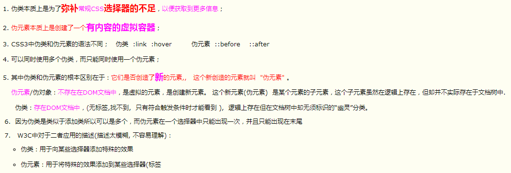

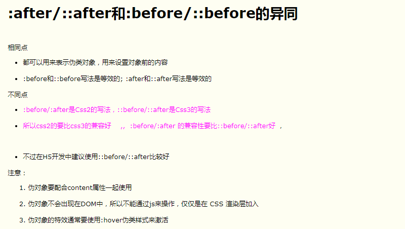

### 认识 `:before` 和 `:after`

- 默认 `display: inline`；
- 必须设置 `content` 属性，否则一切都是无用功， `content` 属性也只能应用在 `:before` 和 `:after` 伪元素上；
- 默认user-select: none，就是 `:before` 和 `:after` 的内容无法被用户选中；
- 伪元素可以和伪类结合使用形如：`.target:hover:after`。
- `:before` 和 `:after` 是在CSS2中提出来的，所以兼容IE8；
- `::before` 和 `::after` 是CSS3中的写法，为了将伪类和伪元素区分开；
- CSS 中其他的伪元素有：`::before`、`::after`、`::first-letter`、`::first-line`、`::selection` 等；
- 不可通过DOM使用，它只是纯粹的表象。在特殊情况下，从一个访问的角度来看，当前屏幕阅读不支持生成的内容。

### `content` 定义用法

`content` 属性与 `:before` 及 `:after` 伪元素配合使用，在元素头或尾部来插入生成内容。

**说明：** 该属性用于定义元素之前或之后放置的生成内容。默认地，这往往是行内内容，不过该内容创建的盒子类型可以用属性 display 控制。

## 14. position:fixed;在IOS下无效该怎么办

[WEB移动端Fixed布局的解决方案](https://efe.baidu.com/blog/mobile-fixed-layout/)

 软键盘唤起后，页面的 fixed 元素将失效（即无法浮动，也可以理解为变成了 absolute 定位），所以当页面超过一屏且滚动时，失效的 fixed 元素就会跟随滚动了。

这便是 iOS 上 fixed 元素和输入框的 bug 。其中不仅限于 `type=text` 的输入框，凡是软键盘（比如时间日期选择、select 选择等等）被唤起，都会遇到同样地问题。

可以用第三方库`isScroll.js` 很好的解决 fixed 定位滚动的问题

## 15.style标签写在body前和body后的区别是什么

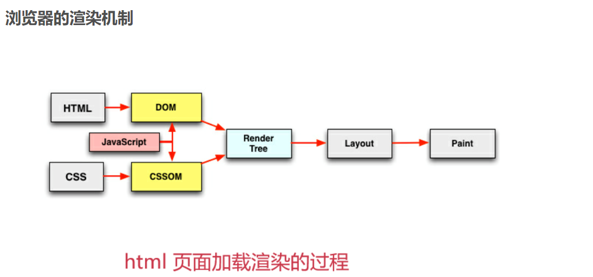

[性能优化——CSS和JS的加载和执行](<https://blog.csdn.net/qq_35534823/article/details/79356317>)

在 HTML4 的时候，不应该把 `style` 放到 `body` 中间。

浏览器在渲染页面时 DOM 和 CSSOM 是并行的，然后两者结合形成 Render Tree 显示页面。从直觉上来说，`style` 写在 `body` 前不会对 DOM 的渲染进行阻塞；而写在 `body` 内会对 DOM 渲染进行阻塞。会产生 FOUC（Flash of Unstyled Content) 的现象，既一瞬间的白屏或者样式的突然变化（原因是 Render Tree 重新生成了）。

不过 W3C 在 HTML5.2 的定义中对于 `style` 标签的使用的定义中是允许将 `style` 放到 `body` 中的。

> **渲染机制**的区别，在**body前**是已经把样式浏览一遍，到了对应标签直接，渲染样式。显示快。
>
> 在**body后**，是浏览器已经把标签浏览了，但基于没有样式，显示的不完全，再把body后的样式表，扫描后，再成为真正的样式，会慢。遇到大型网站，效果更差，这都基于浏览器从上到下的浏览机制导致的。

## 16.请描述margin边界叠加是什么及解决方案

若是相邻块元素垂直外边距的合并，合并之后会取两者中的**最大值**
。

若是嵌套块元素垂直外边距的合并，合并会形成一个外边距，合并到父元素的外边距并取其中的最大值(外边距塌陷）

解决方案：

1.为父元素定义1px的上边框或上边距

2.为父元素添加`oveflow:hidden;`
## 17.解释下 CSS sprites(精灵图)的原理和优缺点分别是什么

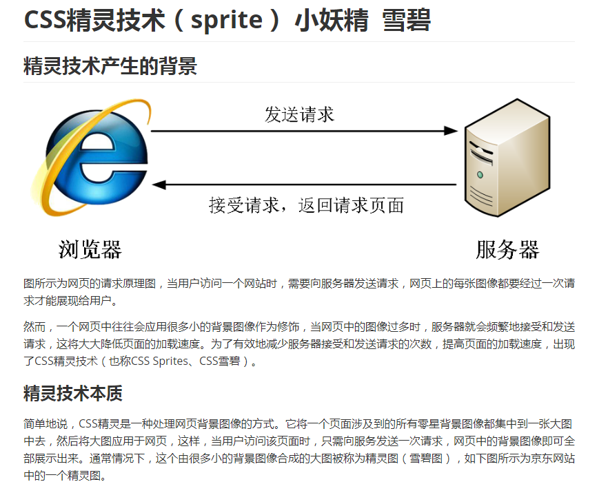

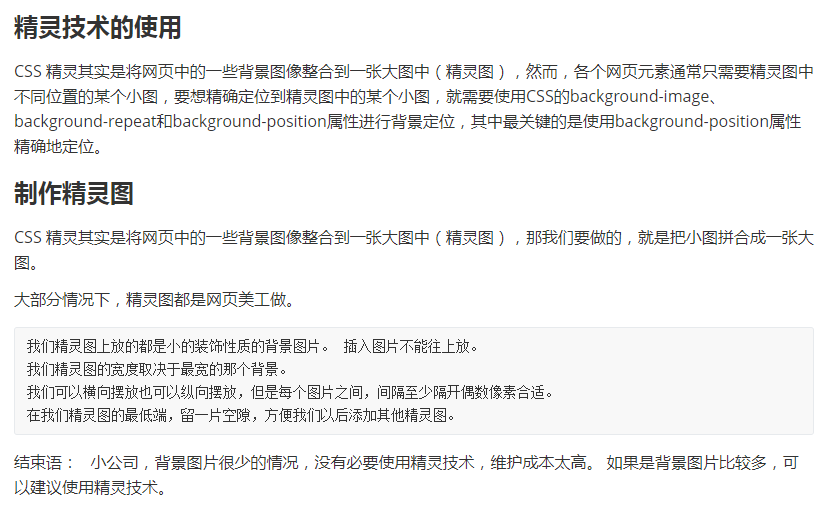

* 简介

  CSS Sprites在国内很多人叫CSS精灵图，是一种网页图片应用处理方式。它允许将一个页面涉及到的所有零星图片都包含到一张大图中， 利用CSS的“background-image”，“background- repeat”，“background-position”的组合进行背景定位， 访问页面时避免图片载入缓慢的现象。

* 原理：多张小图标合并成一张图片，利用`background-position`\+ 固定的宽高来显示相对应的图片

* 优点：

  ~~~
  （1）CSS Sprites能很好地减少网页的http请求，从而大大的提高页面的性能，这是CSS Sprites最大的优点，也是其被广泛传播和应用的主要原因；
  （2）CSS Sprites能减少图片的字节；
  （3）CSS Sprites解决了网页设计师在图片命名上的困扰，只需对一张集合的图片命名，不需要对每一个小图片进行命名，从而提高了网页制作效率。
  （4）CSS Sprites只需要修改一张或少张图片的颜色或样式来改变整个网页的风格。
  ~~~

* 缺点：难管理，资源大

  ~~~
  （1）图片合并麻烦：图片合并时，需要把多张图片有序的合理的合并成一张图片，并留好足够的空间防止版块出现不必要的背景。
  （2）图片适应性差：在高分辨的屏幕下自适应页面，若图片不够宽会出现背景断裂。
  （3）图片定位繁琐：开发时需要通过工具测量计算每个背景单元的精确位置。
  （4）可维护性差：页面背景需要少许改动，可能要修改部分或整张已合并的图片，进而要改动CSS。在避免改动图片的前提下，又只能（最好）往下追加图片，但这样增加了图片字节。
  ~~~

## 18.什么是FOUC？你是如何避免FOUC的

**什么叫做 FOUC 浏览器样式闪烁**

如果使用import方法对CSS进行导入,会导致某些页面在Windows 下的Internet Explorer出现一些奇怪的现象: 

  以无样式显示页面内容的瞬间闪烁

这种现象称之为文档样式短暂失效(Flash of Unstyled Content),简称为FOUC。

**原因大致为：**

* 使用import方法导入样式表。

* 将样式表放在页面底部

* 有几个样式表，放在HTML结构的不同位置。

其实原理很清楚：当样式表晚于结构性HTML 加载，当加载到此样式表时，页面将停止之前的渲染。

此样式表被下载和解析后，将重新渲染页面，也就出现了短暂的花屏现象。

**解决方法**：使用link标签将样式表放在文档head中

## 19.CSS的属性content有什么作用呢？有哪些场景可以用到

[属性content有什么作用呢？有哪些场景可以用到](https://xiangshuo.blog.csdn.net/article/details/89843456)

[CSS中伪类与伪元素，你弄懂了吗？ 这个写的好，通俗易懂](https://zhuanlan.zhihu.com/p/46909886)

[CSS content内容生成技术以及应用]([https://www.zhangxinxu.com/wordpress/2010/04/css-content%E5%86%85%E5%AE%B9%E7%94%9F%E6%88%90%E6%8A%80%E6%9C%AF%E4%BB%A5%E5%8F%8A%E5%BA%94%E7%94%A8/](https://www.zhangxinxu.com/wordpress/2010/04/css-content内容生成技术以及应用/))

- content属性与 ::before 及 ::after 伪元素配合使用生成文本内容
- 通过attr()将选择器对象的属性作为字符串进行显示，如：
  `a::after{content: attr(href)} [a标签的href的值是：](http://www.baidu.com) 结果：a标签的href的值是：http://www.baidu.com`

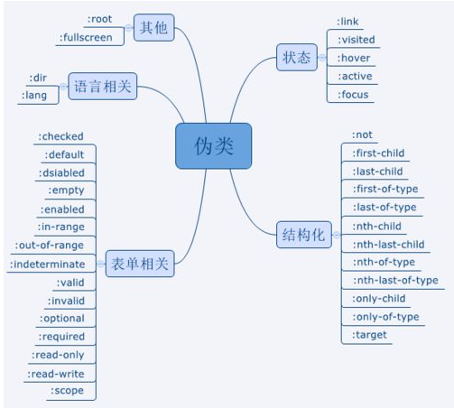

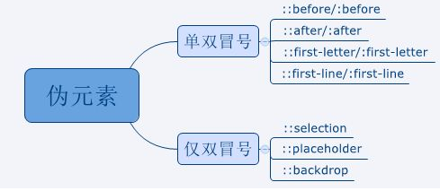

## 20.要让Chrome支持小于12px的文字怎么做

Chrome 中有最小字号的限制，一般为 12px。原因是 Chrome 认为小于这个字号会影响阅读。

当需要小于 12px 字体的时候，有以下几个方法可以使用。

- `-WEBkit-text-size-adjust:none; `这个属性在高版本(chrome 27.0以上版本)的 Chrome 中已经被废除。
- 使用`transform: scale(0.5, 0.5)`但使用transform需要注意下面几点：
  - `transform` 对行内元素无效，因此要么使用 `display: block;` 要么使用 `display: inline-block;`
  - `transform` 即使进行了缩放，原来元素还是会占据对应的位置。因此需要做调整，最好是在外面再包一层元素，以免影响其他元素。
- 作为图片。

最好的办法还是进行切图，或者就不要使用小于 12px 的字体。

## 21.说说你对line-height是如何理解的

[CSS深入理解vertical-align和line-height的基友关系](<https://www.zhangxinxu.com/wordpress/2015/08/css-deep-understand-vertical-align-and-line-height/>)

[CSS深入理解之line-height](https://www.cnblogs.com/yerenyuan/p/5350948.HTML)

ine-height属性用于设置行间距，就是**行与行之间的距离**，即字符的垂直间距，一般称为行高。line-height常用的属性值单位有三种，分别为**像素px，相对值em和百分比%**，实际工作中使用最多的是**像素px**

一般情况下，行距比字号大7.8像素左右就可以了。

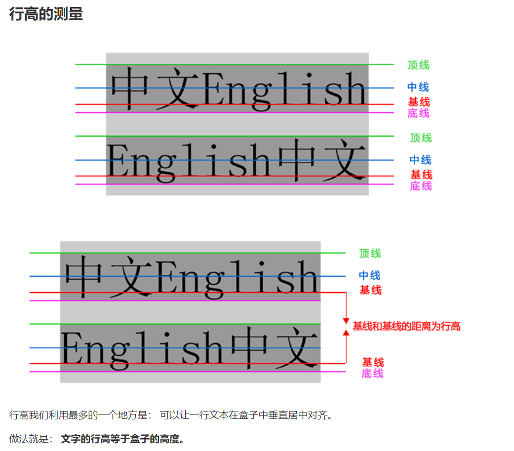

## 22.说说浏览器解析CSS选择器的过程

从上到下，从右到左解析。

因为从左到右，首先浏览器会遍历你最左边的选择器，可能是div，可能是span，我需要在整个页面去把匹配成功的dom找出来，可以说是海底捞针，但是从右到左不一样了，它通过具体的遍历条件去寻找一个最匹配的值，查找之后在向上查询，是否符合自己的选择器规则，才最后匹配成功；

前者会浪费大量的遍历时间，造成大量错误的匹配结果

[CSS选择器从右向左的匹配规则](https://www.cnblogs.com/zhaodongyu/p/3341080.HTML)

## 23.说说CSS的优先级是如何计算的

[CSS选择器优先级](<https://xiangshuo.blog.csdn.net/article/details/52749250>)

[CSS优先级计算规则](https://www.cnblogs.com/wangmeijian/p/4207433.HTML)

定义CSS样式时，经常出现两个或更多规则应用在同一元素上，这时就会出现优先级的问题。

在考虑权重时，初学者还需要注意一些特殊的情况，具体如下：

~~~
1.继承样式的权重为0。即在嵌套结构中，不管父元素样式的权重多大，被子元素继承时，他的权重都为0，也就是说子元素定义的样式会覆盖继承来的样式。

2.行内样式优先。应用style属性的元素，其行内样式的权重非常高，可以理解为远大于100。总之，他拥有比上面提高的选择器都大的优先级。

3.权重相同时，CSS遵循就近原则。也就是说靠近元素的样式具有最大的优先级，或者说排在最后的样式优先级最大。

CSS定义了一个!important命令，该命令被赋予最大的优先级。也就是说不管权重如何以及样式位置的远近，!important都具有最大优先级。
~~~

关于CSS权重，我们需要一套计算公式来去计算，这个就是 CSS Specificity，我们称为CSS 特性或称非凡性，它是一个衡量CSS值优先级的一个标准 具体规范入如下：

specificity用一个四位的数 字串(CSS2是三位)来表示，更像四个级别，值从左到右，左面的最大，一级大于一级，数位之间没有进制，级别之间不可超越。 

| 继承或者* 的贡献值           | 0,0,0,0  |
| ---------------------------- | -------- |
| 每个元素（标签）贡献值为     | 0,0,0,1  |
| 每个类，伪类贡献值为         | 0,0,1,0  |
| 每个ID贡献值为               | 0,1,0,0  |
| 每个行内样式贡献值           | 1,0,0,0  |
| 每个!important贡献值  重要的 | ∞ 无穷大 |

权重是可以叠加的

 比如的例子：

~~~javascript
div ul  li   ------>      0,0,0,3

.nav ul li   ------>      0,0,1,2

a:hover      -----—>      0,0,1,1

.nav a       ------>      0,0,1,1   

#nav p       ----->       0,1,0,1
~~~

  注意： 

数位之间没有进制 比如说： 0,0,0,5 + 0,0,0,5 =0,0,0,10 而不是 0,0, 1, 0， 所以不会存在10个div能赶上一个类选择器的情况。

总结优先级：

1. 使用了 !important声明的规则。
2. 内嵌在 HTML 元素的 style属性里面的声明。
3. 使用了 ID 选择器的规则。
4. 使用了类选择器、属性选择器、伪元素和伪类选择器的规则。
5. 使用了元素选择器的规则。
6. 只包含一个通用选择器的规则。
7. 同一类选择器则遵循就近原则。
8. 继承的权重是0

~~~
总结：权重是优先级的算法，层叠是优先级的表现
~~~

## 24.你有用过CSS预处理器吗？喜欢用哪个？原理是什么?

>  这个我要以后学一下。

[CSS的几款流行预处理器](https://www.cnblogs.com/sexintercourse/p/12564024.HTML)

[该使用SASS还是LESS?](<https://www.zhihu.com/question/24375983/answer/27584825>)

用过SASS、Less，比较喜欢SASS吧。

> 面试官应该不会问太过细节的东西。这道题能说出AST（抽象语法树）并能知道大概AST的原理就OK了

## 25.在页面中的应该使用奇数还是偶数的字体？为什么呢?

- 常用偶数号字体,但奇数号字体也没关系,例如 知乎正文使用15px字体,豆瓣电影使用13px字体
- UI设计师导出的设计稿一般都是偶数号字体
- 偶数字号容易和页面其他标签的其他属性形成比例关系
- Windows 自带的点阵宋体（中易宋体）从 Vista 开始只提供 12、14、16 px 这三个大小的点阵，
  而 13、15、17 px 时用的是小一号的点阵（即每个字占的空间大了 1 px，但点阵没变），于是略显稀
  疏。(没试过)

## 26.说说你对z-index的理解

[关于z-index 那些你不知道的事](https://WEBdesign.tutsplus.com/zh-hans/articles/what-you-may-not-know-about-the-z-index-property--WEBdesign-16892)

[深入理解CSS中的层叠上下文和层叠顺序](https://www.zhangxinxu.com/wordpress/2016/01/understand-css-stacking-context-order-z-index/)

当网页上出现多个由绝对定位（position:absolute）或固定定位（position:fixed）所产生的浮动层时，必然就会产生一个问题，就是当这些层的位置产生重合时，谁在谁的上面呢？或者说谁看得见、谁看不见呢？这时候就可以通过设置`z-index`的值来解决，这个值较大的就在上面，较小的在下面。

> `z-index`的意思就是在z轴的顺序，如果说网页是由x轴和y轴所决定的一个平面，那么z轴就是垂直于屏幕的一条虚拟坐标轴，浮动层就在这个坐标轴上，那么它们的顺序号就决定了谁上谁下了。

## 27.怎样修改chrome记住密码后自动填充表单的黄色背景

`-WEBkit-text-fill-color` 设置文本颜色

`-WEBkit-box-shadow` inset设置填充

~~~javascript
input{
    &:-WEBkit-autofill {
      box-shadow: 0 0 0px 1000px rgba(255, 255, 255, 0) inset !important;
      -WEBkit-text-fill-color: #000 !important;
      transition: background-color 5000s ease-in-out 0s;
      font-size: 14px;
    }
  }
~~~

## 28.rgba()和opacity这两个的透明效果有什么区别呢

[rgba()和opacity这两个的透明效果有什么区别呢？](https://www.jianshu.com/p/1f166eea0b43)

* `opacity` 是属性，`rgba()`是函数，`rgba()`计算之后是个属性值；

* `opacity` 的透明效果是作用整个元素以及其子元素上的，取值0—1；
* `rgba()` 一般作为背景色 `background-color` 或者颜色 `color` 的属性值，不会影响元素中的其他内容以及子元素内容。透明度由其中的 `alpha` 值生效，取值0—1；

## 29.请描述CSS的权重计算规则(重复)

[CSS中选择器的权重值的计算](https://www.jb51.net/css/597210.HTML)

| 选择器                         | 案例          | 权重值   |
| ------------------------------ | ------------- | -------- |
| !important                     | !important    | Infinity |
| 内联样式                       | style=".."    | 1000     |
| ID                             | #id           | 100      |
| class                          | .class        | 10       |
| 属性                           | [type='text'] | 10       |
| 伪类                           | :hover        | 10       |
| 标签                           | p             | 1        |
| 伪元素                         | ::first-line  | 1        |
| 相邻选择器、子代选择器、通配符 | +  > *        | 0        |

> !important(内联) > !importan(外联) > 内联 > ID(100) > Class(10) > tag(1) > *

### 比较规则

- 1000>100。也就是说从左往右逐个等级比较，前一等级相等才往后比。
- 在权重相同的情况下，后面的样式会覆盖掉前面的样式。
- 继承属性没有权重值
- 通配符、子选择器、相邻选择器等的。虽然权值为0，但是也比继承的样式优先。
- ie6以上才支持`!important`，并且尽量少用它。

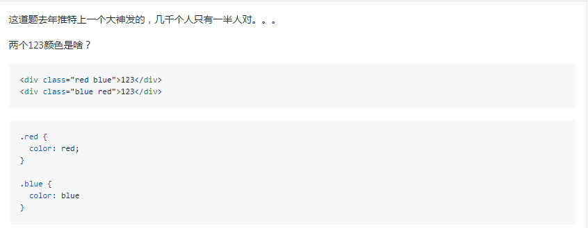

> 都是蓝色，这个是障眼法
> CSS计算规则和class先后顺序无关

## 30.描述下你所了解的图片格式及使用场景

通常网页在显示的图片（图形）的时候，有以下几种格式：GIF、PNG、JPG、SVG，还有个比较新的WEBP格式。

| 格式 | 优点                                                         | 缺点                                                         | 适用场景                                                     |
| ---- | ------------------------------------------------------------ | ------------------------------------------------------------ | ------------------------------------------------------------ |
| GIF  | GIF是动态的；支持无损耗压缩和透明度。                        | 详细的图片和写实摄影图像会丢失颜色信息；在大多数情况下，无损耗压缩效果不如 JPEG 格式或 PNG 格式；GIF 支持有限的透明度，没有半透明效果或褪色效果，只支持256种颜色 | 主要用于比较小的动态图标。                                   |
| JPG  | 占用内存小，网页加载速度快。                                 | 有损压缩，反复保存图片质量下降明显，即JPG会在压缩图片时降低品质。 | 由于这种格式图片对色彩表现比较好，所以适用于色彩丰富的图片。主要用于摄影作品或者大的背景图等。不合适文字比较多的图片。 |
| PNG  | 无损压缩，图片质量高，支持透明效果，提供锋利的线条和边缘，做出的logo等小图标效果会更好；更好地展示文字、颜色相近的图片。 | 占内存大,会导致网页加载速度慢；对于需要高保真的较复杂的图像，PNG虽然能无损压缩，但图片文件较大，不适合应用在Web页面上。 | 主要用于小图标或颜色简单对比强烈的小的背景图。               |
| SVG  | 矢量图形，不受像素影响，在不同平台上都表现良好；可以通过JS控制实现动画效果。 | DOM比正常的图形慢，而且如果其结点多而杂，就更慢；不能与HTML内容集成。 | 主要用于设计模型的展示等。                                   |
| WebP | 谷歌（google）开发的一种旨在加快图片加载速度的图片格式。图片压缩体积大约只有JPEG的2/3，并能节省大量的服务器宽带资源和数据空间。 | 相较编码JPEG文件，编码同样质量的WebP文件需要占用更多的计算资源。 | WebP既支持有损压缩也支持无损压缩。将来可能是JPEG的代替品。   |

## 31.让网页的字体变得清晰，变细用CSS怎么做

[CSS让文字变细](http://levy.work/2016-09-30-css-make-font-weight-lighter/)

影响文字的粗细的其实有三个因素:

- font-weight
- font-family
- -WEBkit-font-smoothing

要理解CSS能通过font-weight设置字体的粗细, 首先要明白CSS字体的基本设定. 以字体*Times*字体为例, *Times*实际是一个字体系列, 它由多种字体变形组合而成, 包括 *TimesRegular*, *TimesBold*, *TimesItalic*等. 每种变形都是一种具体的字体风格(font face).

当font-weight变小时, 浏览器会在指定字体系列中, 找到更细的字体变种. 因而如果使用的字体系列中, 只有一种变种, 则无论font-weight怎么变化, 字体的粗细都不会有变化的

因此文字的粗细还跟font-family有关

但就算设置了以上两项, 我在Mac的Chrome浏览网页时, 还是觉得文字有点”粗”. 这种”粗”用专业的话来说就是, “字体存在半个像素的锯齿，浏览器渲染的时却直接显示一个像素”, 则此时需要对文字进行”抗锯齿处理”. 也即设置为

~~~javascript
-WEBkit-font-smoothing: antialiased;
~~~

> 注意到这是个带-WEBkit前缀的属性, 因此Firefox/IE以及基于IE改造的国产浏览器是没有效果的。

## 32.说下line-height三种设置方式有何区别

[line-height 3种设置方式的区别](https://juejin.im/post/6844903556739235848)

`line-height` 可以有带单位及不带单位的写法（感觉其实是两种）。

~~~javascript
div{
	line-height: 24px;
	line-height: 1.5;
	line-height: 1.5em;
	line-height: 150%;
}
~~~

对于应用在单个元素上，这几种写法的效果都是一样的（除了 px 需要一些计算）。但由于 `line-height` 是可以被继承的，因此会影响内部子元素的 `line-height`。简单的可以总结为：

- 带有单位的 `line-height` 会被计算成 `px` 后继承。子元素的 `line-height` = 父元素的 `line-height` * `font-size` （如果是 px 了就直接继承）
- 而不带单位的 `line-height` 被继承的是倍数，子元素的 `line-height` = 子元素的 `font-size` * 继承的倍数

## 33.用CSS绘制一个三角形(重复)

见第6题

https://www.17sucai.com/pins/24662.HTML)

## 34.浏览器是怎样判断元素是否和某个CSS选择器匹配

先产生一个元素集合，然后从后往前判断；

> 浏览器先产生一个元素集合，这个集合往往由最后一个部分的索引产生（如果没有索引就是所有元素的集合）。然后向上匹配，如果不符合上一个部分，就把元素从集合中删除，直到真个选择器都匹配完，还在集合中的元素就匹配这个选择器了。

**举个例子**:

有选择器：
`div.ready #wrapper > .bg-red`

先把所有元素 `class` 中有 `bg-red` 的元素拿出来组成一个集合，然后上一层，对每一个集合中的元素，如果元素的 `parent id `不为 `#wrapper `则把元素从集合中删去。 再向上，从这个元素的父元素开始向上找，没有找到一个 `tagName` 为 `div` 且 `class` 中有 `ready` 的元素，就把原来的元素从集合中删去。
至此这个选择器匹配结束，所有还在集合中的元素满足。大体就是这样，不过浏览器还会有一些奇怪的优化。
如图：

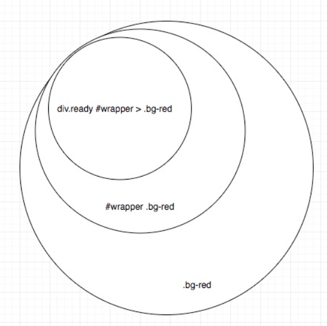

**注意：**

1、为什么从后往前匹配因为效率和文档流的解析方向。效率不必说，找元素的父亲和之前的兄弟比遍历所有儿子快而且方便。关于文档流的解析方向，是因为现在的` CSS`，一个元素只要确定了这个元素在文档流之前出现过的所有元素，就能确定他的匹配情况；应用在即使 `HTML` 没有载入完成，浏览器也能根据已经载入的这一部分信息完全确定出现过的元素的属性。

2、为什么是用集合主要也还是效率。基于` CSS Rule` 数量远远小于元素数量的假设和索引的运用，遍历每一条 `CSS Rule` 通过集合筛选，比遍历每一个元素再遍历每一条 `Rule` 匹配要快得多。

> 简单来说就是浏览器对于 CSS 的匹配规则是从右往左进行匹配，这样的的话浏览器的寻找效率会比较高。

## 35.使用flex实现三栏布局，两边固定，中间自适应(重复)

见第1题

~~~javascript
<div class="container">
  <section class="left red"></section>
  <section class="middle blue"></section>
  <section class="right red"></section>
</div>
~~~

~~~css
.container {
  width: 100%;
  height: 100%;
  display: flex;
}

.left,
.right {
  flex: 0 0 auto;
  width: 50px;
  height: 100%;
}

.middle {
  flex: 1 1 auto;
  height: 100%;
}

.red {
  background-color: red;
}

.blue {
  background-color: blue;
}
~~~

## 36.写出主流浏览器内核私有属性的CSS前缀

[浏览器引擎前缀](<https://developer.mozilla.org/zh-CN/docs/Glossary/Vendor_Prefix>)

| 浏览器  | 内核             | CSS前缀  |
| ------- | ---------------- | -------- |
| Chrome  | Blink内核（新）  | -webkit- |
| Firefox | Gecko内核        | -moz-    |
| Safari  | Webkit内核       | -webkit- |
| Opera   | Webkit内核（新） | -o-      |
| IE/Edge | Trident内核      | -ms-     |

> 谷歌(新的内核为Blink)、Safari，新版Opera浏览器，以及几乎所有IOS系统中的浏览器(包括IOS中的火狐浏览器)，简单的说，所有基于`WEBKit`内核的浏览器的前缀都采用`-WEBkit-`

示例:

~~~javascript
-WEBkit-transition: all 4s ease;
-moz-transition: all 4s ease;
-ms-transition: all 4s ease;
-o-transition: all 4s ease;
transition: all 4s ease; 
~~~

## 37.不使用border画出1px高的线，在不同浏览器的标准和怪异模式下都能保持效果一样

既然是CSS面试题目那么就用CSS的方法啊！

~~~css
.box::after{ content: ""; display: block; width: 100px; height: 1px; background-color: black; }
~~~

## 38.单行居中显示文字，多行居左显示，最多两行超过用省略号结尾

[谈谈一些有趣的CSS题目](<https://github.com/chokcoco/iCSS/issues/50>)

[可能是最全的 “文本溢出截断省略” 方案合集](<https://juejin.im/post/6844903988081475591>)

效果如下：

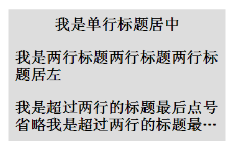

**首先是单行居中，多行居左**

居中需要用到 `text-align:center`，居左是默认值也就是`text-align:left`。如合让两者结合起来达到单行居中，多行居左呢？这就需要多一个标签，假设一开始我们定义如下：

~~~html
<h2>单行居中，多行居左</h2>
~~~

现在，我们在 `h2` 中间，嵌套多一层标签 `p`：

~~~javascript
<h2><p>单行居中，多行居左</p></h2>
~~~

我们让内层 `p` 居左 `text-align:left`，外层 `h2` 居中 `text-align:center`，并且将 `p` 设置为 `display:inline-block` ，利用 `inline-block` 元素可以被父级 `text-align:center` 居中的特性，这样就可以实现单行居中，多行居左，CSS 如下：

~~~javascript
p {
    display: inline-block;
    text-align: left;
}

h2{
    text-align: center;
}
~~~

**超出两行省略**

完成了第一步，接下来要实现的是超出两行显示省略符号。

多行省略是有专门的新 CSS 属性可以实现的，但是有些兼容性不大好。主要用到如下几个：

* display: -WEBkit-box; // 设置display，将对象作为弹性伸缩盒子模型显示
* -WEBkit-line-clamp: 2; // 限制在一个块元素显示的文本的行数
* -WEBkit-box-orient: vertical; // 规定框的子元素应该被水平或垂直排列

上述 3 条样式配合 `overflow : hidden` 和 `text-overflow: ellipsis` 即可实现 `WEBkit` 内核下的多行省略。好，我们将上述说的一共 5 条样式添加给 `p` 元素

~~~javascript
p {
    display: inline-block;
    text-align: left;
    overflow : hidden;
    text-overflow: ellipsis;
    display: -WEBkit-box;
    -WEBkit-line-clamp: 2;
    -WEBkit-box-orient: vertical;
}

h2{
    text-align: center;
}
~~~

（在 -WEBkit- 内核浏览器下）发现，虽然超出两行的是被省略了，但是第一行也变回了居左，而没有居中。

看回上面的 CSS 中的 `p` 元素，原因在于我们第一个设置的 `display: inline-block` ，被接下来设置的 `display: -WEBkit-box` 给覆盖掉了，所以不再是 `inline-block` 特性的内部 `p` 元素占据了一整行，也就自然而然的不再居中，而变成了正常的居左展示。

记得上面我们解决**单行居中，多行居左**时的方法吗？上面我们添加多了一层标签解决了问题，这里我们再添加多一层标签，如下：

~~~javascript
<h2><p><em>单行居中，多行居左<em></p></h2>
~~~

这里，我们再添加一层 `em` 标签，接下来，

* 设置 `em` 为 `display: -WEBkit-box`
* 设置 `p` 为 `inline-block`
* 设置 `h2` 为 `text-align: center`

嘿！通过再设置多一层标签，解决 display 的问题，完美解决问题。

方法2：

* 单行文本居中。在 `WEBkit` 内核中适用。非 `WEBkit` 内核，可以是用 js 或者用 `::after` 模拟。

~~~css
 .single-text{
 	width: 500px;
 	font-size: 18px;
 	font-weight: bold;
 	text-align: center;
 	color: white;
 	background: lightblue;
 	display: box;
 	white-space: nowrap;
 	overflow:hidden;
 	text-overflow: ellipsis;
 }
~~~

* 多行文本左对齐。多行文本没有很好的解决方法，只能依赖 js 或者 css 的相对定位。

~~~css
 .multi-text{
 	width: 50%;
 	height: 4.5rem;
 	line-height: 1.5;
 	padding: 20px;
 	background: lightblue;
 	overflow: hidden;
 	position: relative;
 	box-sizing: border-box;
 	
 	&::after{
 		content: '...';
 		height: 1.5rem;
 		position: absolute;
 		bottom: 5px;
 		right: 5px;
 	}
 }
~~~

## 39.写出你知道的CSS水平和垂直居中的方法

[如何居中一个元素(终结版)](<https://juejin.im/post/6844903693142196238#comment>)

[还不会CSS水平垂直居中？这里有12种方案](<https://xiangshuo.blog.csdn.net/article/details/86539582>)

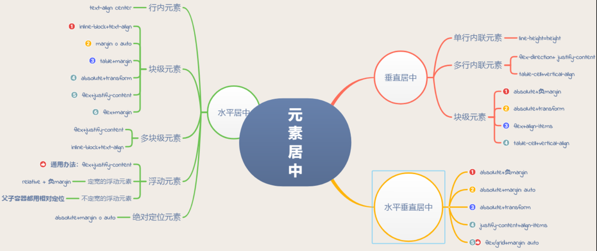

## 40.怎么才能让图文不可复制

[禁止用户打开浏览器控制台](<https://www.jianshu.com/p/1c171cb86dbb>)

~~~css
-WEBkit-user-select: none;
-ms-user-select: none;
-moz-user-select: none;
-kHTML-user-select: none;
user-select: none;
~~~

## 41.怎么让英文单词的首字母大写

~~~css
.demo {
  text-transform: capitalize;
}
~~~

`text-transform `属性控制文本的大小写，是CSS2.1的属性，兼容性问题不大。
属性值是关键字，有4+1种，这个1是实验性属性值。

~~~javascript
/* Keyword values */
text-transform: capitalize;
text-transform: uppercase;
text-transform: lowercase;
text-transform: none;
text-transform: full-width;
~~~

`capitalize`
这个关键字强制每个单词的首字母转换为大写。

`uppercase`
这个关键字强制所有字符被转换为大写。

`lowercase`
这个关键字强制所有字符被转换为小写。

`none`
这个关键字阻止所有字符的大小写被转换。

`full-width` （实验性属性值）
这个关键字强制字符 — 主要是表意字符和拉丁文字 — 书写进一个方形里，并允许它们按照一般的东亚文字（比如中文或日文）对齐。

## 42.重置（初始化）CSS的作用是什么

清除不同浏览器默认的样式，让元素的样式统一。

不过完全重置样式不利于开发和维护，推荐使用 normalize.css 在消除不同浏览器的样式差异的同时，保留元素的默认样式。

## 43.span与span之间有看不见的空白间隔是什么原因引起的？有什么解决办法?

[幽灵空白节点](https://www.zhangxinxu.com/wordpress/2015/08/css-deep-understand-vertical-align-and-line-height/)

**在HTML5文档声明下，块状元素内部的内联元素的行为表现，就好像块状元素内部还有一个（更有可能两个-前后）看不见摸不着没有宽度没有实体的空白节点，这个假想又似乎存在的空白节点，我称之为“幽灵空白节点”。**

产生空白的原因：元素被当成行内元素排版的时候，元素之间的空白符（空格、回车换行等）都会被浏览器转换成一个空白字符，这个字符的大小受font-size影响。

~~~css
<style>
    .wrap>span {
      background: red;
    }
</style>
<div class="wrap">
  <span>hello</span>
  <span>world</span>
</div>
~~~

上面代码中的span可以明显地看到有间隔，解这几种决办法：

- 去掉换行，将 span 写成一行 `helloworld`
- 父元素使用 flex 布局：`.wrap {display: flex; flex-direction: row;}`
- 父元素设置 `font-size: 0;`，span 子元素再设置字体大小 `font-size: 16px;`
- span 子元素设置 `float: left`

## 44.手写一个满屏品字布局的方案

~~~html
<!DOCTYPE HTML>
<HTML>
    <head>
        <meta name="viewport" content="width=device-width, initial-scale=1.0">
        <meta charset="UTF-8">
        <link rel="stylesheet" href="style.css">
    </head>
    <body>
        <article class="container">
            <div class="firstRow">
                <div class="item"></div>
            </div>
            <div class="secondRow">
                <div class="item"></div>
                <div class="item"></div>
            </div>
        </article>
    </body>
</HTML>
~~~

~~~css
//style.css
HTML, body{
    height: 100%;
    margin: 0;
    padding: 0;
}
 
.container {
    display: flex;
    flex-direction: column;
    flex-wrap: wrap;
    width: 100%;
    height: 100%;
}

.firstRow, .secondRow {
    width: 100%;
    height: 30%;
    display: flex;
    flex-direction: row;
    justify-content: center;
    margin: 10px 0;
}

.item {
    background-color: red;
    width: 40%;
    height: 100%;
    margin: 0 auto;
    border-radius: 10%;
}
~~~

## 45.你知道的等高布局有多少种？写出来

* 使用浮动：padding-bottom 9999px margin-bottom -9999px互相抵消，父级清除浮动，即子元素最高的高度就是父盒子最高的高度
* 使用flex：默认的flex的align配置就是自动填充满父级盒子，设置子元素高度即父元素高度
* 使用定位：top和bottom都是0，然后撑开父元素的高度；

## 46.说说你对媒体查询的理解

[响应式 WEB 设计 - 媒体查询](https://www.runoob.com/css/css-rwd-mediaqueries.html)

[CSS Media媒体查询使用大全，完整媒体查询总结](https://www.cnblogs.com/lguow/p/9316598.html)

一个媒体查询由一个可选的媒体类型和零个或多个使用媒体功能的限制了样式表范围的表达式组成，例如宽度、高度和颜色。媒体查询，添加自CSS3，允许内容的呈现针对一个特定范围的输出设备而进行裁剪，而不必改变内容本身。

>  是用来适配各个尺寸设备的一个手段，最好还是写两套比较好。

## 47.你是怎样抽离样式模块的

[CSS规范 - 分类方法](http://nec.netease.com/standard/css-sort.html)

CSS文件的分类和引用顺序

通常，一个项目我们只引用一个CSS，但是对于较大的项目，我们需要把CSS文件进行分类。

我们按照CSS的性质和用途，将CSS文件分成“公共型样式”、“特殊型样式”、“皮肤型样式”，并以此顺序引用（按需求决定是否添加版本号）。

* 公共型样式：包括了以下几个部分：“标签的重置和设置默认值”、“统一调用背景图和清除浮动或其他需统一处理的长样式”、“网站通用布局”、“通用模块和其扩展”、“元件和其扩展”、“功能类样式”、“皮肤类样式”。

* 特殊型样式：当某个栏目或页面的样式与网站整体差异较大或者维护率较高时，可以独立引用一个样式：“特殊的布局、模块和元件及扩展”、“特殊的功能、颜色和背景”，也可以是某个大型控件或模块的独立样式。

* 皮肤型样式：如果产品需要换肤功能，那么我们需要将颜色、背景等抽离出来放在这里。

回答1：我的理解是把常用的css样式单独做成css文件……通用的和业务相关的分离出来，通用的做成样式模块儿共享，业务相关的，放进业务相关的库里面做成对应功能的模块儿。

回答2：说的是 WEBpack + extract-text-WEBpack-plugin插件吧？ 把样式文件单独打包出来。
WEBpack4 升级了插件为 mini-css-extract-plugin。

## 48.你知道全屏滚动的原理是什么吗？它用到了CSS的哪些属性

全屏滚动和轮播图类似，都是通过改变元素位置或者显示与隐藏来实现，配合JS的一些交互距离判断，实现类似原生滚动捕获的效果。这里全屏的话就需要将宽高都设置为窗口的大小，可以通过百分百实现。

关键CSS属性是父容器 `overflow: hidden;` 

实现全屏滚动还可以简单的通过插件来实现，比如fullpage，很多大公司的页面都是用这个实现的，比如小米一些产品的官网。

### 知识点

- JS 滚动监听事件
- JS 移动端touch监听事件
- 函数节流
- DOM操作

### 代码分析

#### 1.CSS

html, body设置 overflow 为 hidden, 让视图中只包括一个分页;设置滑动分页的长宽都是 100%; 外部容器设置 transition 过渡效果, 并设置为相对定位, 滚动是修改外部容器的 Top 值, 实现滚动效果.

~~~css
html,
body {
  padding: 0;
  margin: 0;
  overflow: hidden;
}
.page-container {
  position: relative;
  top: 0;
  transition: all 1000ms ease;
  touch-action: none;
}
.page-item {
  display: flex;
  justify-content: center;
  align-items: center;
  width: 100%;
  height: 100%;
  border: 1px solid #ddd;
}
~~~

#### 2.HTML

初始三个分页

~~~html
<div class="page-container">
  <div class="page-item">1</div>
  <div class="page-item">2</div>
  <div class="page-item">3</div>
</div>
~~~

#### 3.JavaScript

1.初始化值
容器高度设置为窗口高度

~~~javascript
var container = document.querySelector('.page-container')
// 获取根元素高度, 页面可视高度
var viewHeight = document.documentElement.clientHeight
// 获取滚动的页数
var pageNum = document.querySelectorAll('.page-item').length
// 初始化当前位置, 距离原始顶部距离
var currentPosition = 0
// 设置页面高度
container.style.height = viewHeight + 'px'
~~~

2.初始化滚动事件
向下滚动时, 当 `currentPosition` 比 `-整体分页高度` 大的时候(绝对值相比小的时候), 向下滚动;向上滚动时, 当 `currentPosition` 大于 `0` 的时候, 向上滚动.

~~~javascript
// 向下滚动页面
function goDown () {
  if (currentPosition > - viewHeight * (pageNum - 1)) {
    currentPosition = currentPosition - viewHeight
    container.style.top = currentPosition + 'px'
  }
}

// 向上滚动页面
function goUp () {
  if (currentPosition < 0) {
    currentPosition = currentPosition + viewHeight
    container.style.top = currentPosition + 'px'
  }
}
~~~

3.节流函数
即在规定时间内只会触发一次指定方法, 用于滚动时防止多次触发

~~~javascript
function throttle (fn, delay) {
  let baseTime = 0
  return function () {
    const currentTime = Date.now()
    if (baseTime + delay < currentTime) {
      fn.apply(this, arguments)
      baseTime = currentTime
    }
  }
}
~~~

4.监听鼠标滚动
滚动事件`firefox`与其他浏览器的事件不同, 所以需要进行判断. `deltaY`大于`0`的时候, 想下滚动; 反之, 向上滚动.

~~~javascript
var handlerWheel = throttle(scrollMove, 1000)
// https://developer.mozilla.org/en-US/docs/Web/API/Element/mousewheel_event#The_detail_property
// firefox的页面滚动事件其他浏览器不一样
if (navigator.userAgent.toLowerCase().indexOf('firefox') === -1) {
  document.addEventListener('mousewheel', handlerWheel)
} else {
  document.addEventListener('DOMMouseScroll', handlerWheel)
}
function scrollMove (e) {
  if (e.deltaY > 0) {
    goDown()
  } else {
    goUp()
  }
}
~~~

5.5.监听移动端touch操作
当 touch 的最终位置大于起始位置时, 则页面向上滚动; 反之, 向下滚动.

~~~javascript
var touchStartY = 0
document.addEventListener('touchstart', event => {
  touchStartY = event.touches[0].pageY
})
var handleTouchEnd = throttle(touchEnd, 500)
document.addEventListener('touchend', handleTouchEnd)
function touchEnd (e) {
  var touchEndY = e.changedTouches[0].pageY
  if (touchEndY - touchStartY < 0) { // 向上滑动, 页面向下滚动
    goDown()
  } else {
    goUp()
  }
}
~~~

## 49.假如设计稿使用了非标准的字体，你该如何去实现它？

设计的职责是美观，前端的职责是尽可能还原，设计之所以会使用非标准的字体、甚至侵权的字体是因为不了解技术实现和版权意识。

所以先沟通，告知设计实际的情况，然后在综合考量的情况下应该尽可能去实现，通常采用载入字体和图片化的方式。

## 50.列举CSS优化、提高性能的方法

### 加载性能

1. 压缩CSS
2. 通过link方式加载，而不是[@import](https://github.com/import)
3. 复合属性其实分开写，执行效率更高，因为CSS最终也还是要去解析如 `margin-left: left;`

### 选择器性能

1. 尽量少的使用嵌套，可以采用BEM的方式来解决命名冲突
2. 尽量少甚至是不使用标签选择器，这个性能实在是差，同样的还有`*`选择器
3. 利用继承，减少代码量

### 渲染性能

1. 慎重使用高性能属性：浮动、定位；
2. 尽量减少页面重排、重绘；
3. css雪碧图
4. 自定义web字体，尽量少用
5. 尽量减少使用昂贵属性，如box-shadow/border-radius/filter/透明度/:nth-child等
6. 使用`transform`来变换而不是宽高等会造成重绘的属性

# JS部分

## 1.用递归算法实现，数组长度为5且元素的随机数在2-32间不重复的值(未完)

>描述：
>
>这是一道大题目，把考点拆成了4个小项；需要侯选人用递归算法实现（限制15行代码以内实现；限制时间10分钟内完成）：
>a) 生成一个长度为5的空数组arr。
>b) 生成一个（2－32）之间的随机整数rand。
>c) 把随机数rand插入到数组arr内，如果数组arr内已存在与rand相同的数字，则重新生成随机数rand并插入到arr内[需要使用递归实现，不能使用for/while等循环]
>d) 最终输出一个长度为5，且内容不重复的数组arr。

~~~javascript
var arr = new Array(5);
var num = randomNumber();
var i = 0;
randomArr(arr,num);
function randomArr(arr,num) {
    if (arr.indexOf(num)< 0){
         arr[i] = num;
         i++;
     }else{
         num = randomNumber();
     }
     if (i>=arr.length){
          console.log(arr);
          return;
      }else{
          randomArr(arr,num)
      }
}

function randomNumber() {
      return Math.floor(Math.random()*31 + 2)
}
~~~

[数组长度为5且元素的随机数在2-32间不重复的值](https://blog.csdn.net/weixin_36270908/article/details/98636113)

[js递归算法实现，数组长度为5且元素的随机数在2-32间不重复的值](https://www.pipipi.net/2634.HTML)

## 2.写一个方法去掉字符串中的空格（正则）

> 描述：要求传入不同的类型分别能去掉前、后、前后、中间的空格

~~~javascript
var trim = function(str){
	return str.replace(/\s*/g,"");
}
str.replace(/\s*/g,""); //去除字符串内所有的空格
str.replace(/^\s*|\s*$/g,""); //去除字符串内两头的空格
str.replace(/^\s*/,""); //去除字符串内左侧的空格
str.replace(/(\s*$)/g,""); //去除字符串内右侧的空格
~~~

~~~javascript
function deleSpac(str,direction) { // 1 串的模板 2 清除哪边空格
            let Reg = '';
            switch(direction) {
                case 'left' : // 去除左边
                    Reg = /^[\s]+/g;
                    break;
                case 'right' : // 去除右边
                    Reg = /([\s]*)$/g;
                    break;
                case 'both' : // 去除两边
                    Reg = /(^\s*)|(\s*$)/g
                    break;
                default :   // 没传默认全部，且为下去除中间空格做铺垫
                    Reg = /[\s]+/g;
                    break;
            }
            let newStr = str.replace(Reg,'');
            if ( direction == 'middle' ){
                let RegLeft = str.match(/(^\s*)/g)[0]; // 保存右边空格
                let RegRight = str.match(/(\s*$)/g)[0]; // 保存左边空格
                newStr = RegLeft + newStr + RegRight; // 将空格加给清完全部空格后的字符串
            }
            return newStr;
        }
~~~

[怎么用JS去掉字符串中间空格？(方法总结)](https://www.php.cn/js-tutorial-411509.HTML)

## 3.去除字符串中最后一个指定的字符（正则）

方法1：

~~~javascript
function delLast(str,target) {
  let reg =new RegExp(`${target}(?=([^${target}]*)$)`)
  return str.replace(reg,'')
}
~~~

方法2：

~~~javascript
function delLast (str,del) {
	if (tpeof str !== 'string') {
		alert('请确认要删除的对象为字符串！');
		retrun false;
	} else {
		let index = str.lastIndexOf(del);
		str.substring(0,index ) + str.substring(index+1,str.length);
	}
}
~~~

方法3：

~~~javascript
function trim(str) { 
    if(typeof str === 'string'){ 
        var trimStr = str.substring(0,str.length-1) 
    } 
    return trimStr; 
}
~~~

## 4.写一个方法把下划线命名转成大驼峰命名（正则）

~~~javascript
function strToCamel(str){
    return str.replace(/(^|_)(\w)/g,(m,$1,$2)=>$2.toUpperCase());
}
console.log(strToCame('aa_bb_cc_d_e_f'))     //  AaBbCcDEF
~~~

[js基础 写一个方法把下划线命名转化为大驼峰命名](https://my.oschina.net/u/3237686/blog/3131061)

## 5.写一个把字符串大小写切换的方法(正则)

方法1：

~~~javascript
function caseConvert(str) {
  return str.split('').map(s => {
    const code = s.charCodeAt();
    if (code < 65 || code > 122 || code > 90 && code < 97) return s;
    
    if (code <= 90) {
      return String.fromCharCode(code + 32)
    } else {
      return String.fromCharCode(code - 32)
    }
  }).join('')
}

console.log(caseConvert('AbCdE')) // aBcDe 

function caseConvertEasy(str) {
  return str.split('').map(s => {
    if (s.charCodeAt() <= 90) {
      return s.toLowerCase()
    }
    return s.toUpperCase()
  }).join('')
}

console.log(caseConvertEasy('AbCxYz')) // aBcXyZ 
~~~

方法2：

~~~javascript
function caseConvert(str){
    return str.replace(/([a-z]*)([A-Z]*)/g, (m, s1, s2)=>{
	return `${s1.toUpperCase()}${s2.toLowerCase()}`
    })
}
caseConvert('AsA33322A2aa') //aSa33322a2AA
~~~

## 6.写一个去除制表符和换行符的方法(正则)

~~~javascript
/**
 * \n 换行符 new line
 * \r 回车符 return
 * \t 制表符 tab
 * \b 退格符 backspace
 * \f 换页符 form feed
 * @param {*} str
 */
function fn(str) {
  return str.replace(/[\t\n]/g, '')
}
~~~

## 7.统计某一字符或字符串在另一个字符串中出现的次数

方法1：

~~~javascript
function substrCount(str, target) {
	if(Object.prototype.toString.call(str).slice(8,-1) === 'String' && !str){
        alert("请填写字符串")；
    }else{
		return (str.match(new RegExp(target, 'g')).length);
    }
}
~~~

方法2：

~~~javascript
var childInNums = parent.split(child).length - 1;
~~~

方法3：

~~~javascript
const countAppears = (str, target) => {
  let count = 0;

  if (!str || !target) {
    return count;
  }

  const keyIndex = target.indexOf(str);
  if (keyIndex > -1) {
    count = 1 + countAppears(str, target.slice(keyIndex + 1));
  }

  return count;
};

const str = "abcaaadefg2333333333334abcddddea";

console.log(countAppears("2", str));
console.log(countAppears("b", str));
console.log(countAppears("d", str));
console.log(countAppears("a", str));
console.log(countAppears("f", str));
~~~

## 8.写一个加密字符串的方法

方法1：仅支持浏览器端（源自阮一峰《JavaScript 标准教程》）

~~~javascript
function encode (str) {
	return btoa(encodeURIComponent(str));
}

function decode (str) {
	return decodeURIComponent(atob(str));
}
~~~

方法2：

~~~javascript
// 利用 base64, 浏览器环境自带 btoa / atob 方法
// Node.js 需要引入相关库
const str = "abcdefg";

console.log(btoa(str));
console.log(atob(btoa(str)));

// 凯撒密码
const encodeCaesar = ({str = "", padding = 3}) =>
  !str
    ? str
    : str
        .split("")
        .map((s) => String.fromCharCode(s.charCodeAt() + padding))
        .join("");

const decodeCaesar = ({str = "", padding = 3}) =>
  !str
    ? str
    : str
        .split("")
        .map((s) => String.fromCharCode(s.charCodeAt() - padding))
        .join("");

console.log(encodeCaesar({str: "hello world"}));
console.log(decodeCaesar({str: "khoor#zruog"}));
~~~

## 9.写一个判断数据类型的方法

~~~javascript
function type (obj) {
	return Object.prototype.toString.call(obj).replace(/\[object\s|\]/g,'');
}

console.log(type([]))  //"Array"
console.log(type(1))  //"Number"
~~~

## 10.简要描述下什么是回调函数并写一个例子出来

[关于js中的回调函数callback，通俗易懂](https://www.cnblogs.com/moxiaowohuwei/p/8438236.HTML)

回调是把一个函数作为参数传递给另一个函数，当该函数满足某个条件时触发该参数函数。
主要用于异步操作 例如网络请求 防止页面同步代码阻塞导致渲染线程停止。

~~~javascript
dom.addEventerlisten('click',function(){
  // do something
})
~~~

## 11.简要描述下JS有哪些内置的对象

[JavaScript 标准内置对象](https://developer.mozilla.org/zh-CN/docs/WEB/JavaScript/Reference/Global_Objects)

* 基础对象Object
* 数组对象Array

- 时间对象Date
- 正则表达式对象RegExp
- 函数对象Function
- 布尔对象Boolean
- 数值对象Number
- 字符串对象String
- 全局对象Global
- 数学对象Math
- 错误对象Error
- 函数参数集合arguments

## 12.写一个获取当前url查询字符串中的参数的方法

方法1：

~~~javascript
function urlParam(){
    const param = {};
    location.search.replace(/([^&=?]+)=([^&]+)/g,(m,$1,$2)=> param[$1] = $2);
    return param;
}
~~~

方法2：

~~~javascript
function params() {
  const search = window.location.search;
  search = search.substr(1, search.length);
  const res = {};
  if (!search) return res;
  search.split('&').map(item => {
    const [key, value] = item.split('=');
    res[key] = decodeURIComponent(value);
  });
  return res;
}
~~~

## 13.说说你对javascript的作用域的理解

- 全局作用域 (哪哪都能访问到)
- 函数作用域（函数内）
- 块级作用域（es2015）

函数作用域内可以访问全局作用域的变量，全局作用域不能访问函数作用域的变量。
函数也不能访问函数内的函数的作用域（闭包）。

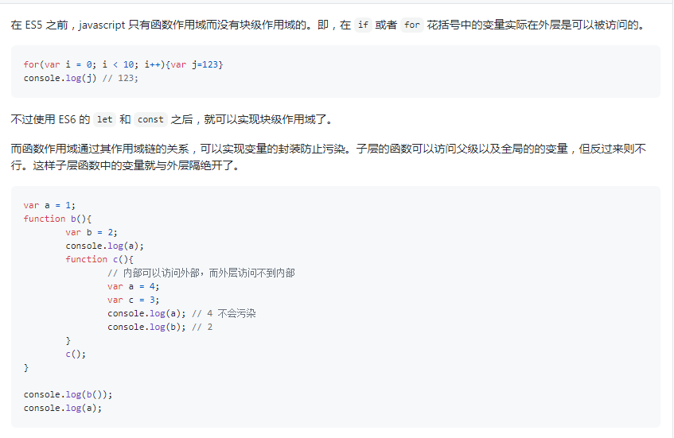

## 14.什么是闭包？优缺点分别是什么(★)

[关于闭包](https://cnodejs.org/topic/5d39c5259969a529571d73a8)

闭包是可以访问另一个函数作用域的函数。由于 `javascript` 的特性，外层的函数无法访问内部函数的变量；而内部函数可以访问外部函数的变量（即作用域链）。

~~~javascript
function a(){
	var b = 1;
	var c = 2;
	// 这个函数就是个闭包，可以访问外层 a 函数的变量
	return function(){
		var d = 3;
		return b + c + d;
	}
}

var e = a();
console.log(e());
~~~

因此，使用闭包可以隐藏变量以及防止变量被篡改和作用域的污染，从而实现封装。
而缺点就是由于保留了作用域链，会增加内存的开销。因此需要注意内存的使用，并且**防止内存泄露**的问题。

## 15.写一个数组去重的方法（支持多维数组）

方法1：

~~~javascript
function flat(arr, target) {
  arr.forEach(item => {
    if (Array.isArray(item)) {
      flat(item, target)
    } else {
      target.push(item)
    }
  })
}

function flatArr(arr) {
  let result = []
  
  flat(arr, result)
  
  return result
}

function uniqueArr(arr) {
  return [...new Set(flatArr(arr))]
}

const result = uniqueArr([1, 2, 3, 4, [3, 4, [4, 6]]])

console.log(result) // 1,2,3,4,6
~~~

有一个兼容性不太好的写法：

~~~javascript
function uniqueArr(arr) {
  return [...new Set(arr.flat(Infinity))]
}
~~~

方法2：

~~~javascript
// 将数组降维
function resetArray(arr, newArr){
    arr.forEach(item => {
        if (toString.call(item) === "[object Array]") {
		resetArray(item, newArr);
        } else {
		newArr.push(item);
	}
    })
}
// 将数组去重
function uniArr(arr) {
    var newArr = [];
    resetArray(arr, newArr);
    console.log([...new Set(newArr)]);
}
arr = [1, 2, 3, [1, 2, [3, 4]], [1]]
uniArr(arr);
~~~

## 16.返回到顶部的方法有哪些？把其中一个方法出来

1.通过锚点链接

~~~javascript
锚点链接是当初学HTML的时候老师教的，挺简单的就不写了
~~~

2.通过JavaScript的scroll回到顶部

~~~javascript
window.scrollTo(0,0); //ie不支持，但好用
~~~

## 17.`typeof('abc')`和`typeof 'abc'`都是string, 那么typeof是操作符还是函数

`typeof` 是**操作符**，不是函数。可以添加括号，但是括号的作用是进行分组而非函数的调用。

## 18.你理解的"use strict";是什么?使用它有什么优缺点

[Javascript 严格模式详解](http://www.ruanyifeng.com/blog/2013/01/javascript_strict_mode.HTML)

[严格模式](https://developer.mozilla.org/zh-CN/docs/WEB/JavaScript/Reference/Strict_mode)

除了正常运行模式，ECMAscript 5添加了第二种运行模式："严格模式"（strict mode）。顾名思义，这种模式使得Javascript在更严格的条件下运行。

设立"严格模式"的目的，主要有以下几个：

~~~
1.消除Javascript语法的一些不合理、不严谨之处，减少一些怪异行为;
2.消除代码运行的一些不安全之处，保证代码运行的安全；
3.提高编译器效率，增加运行速度；
4.为未来新版本的Javascript做好铺垫。
~~~

常见用法：

~~~
1. 禁止this关键字指向全局对象
2. 禁止在函数内部遍历调用栈
3. 全局变量必须显式声明
4. arguments不再追踪参数的变化
~~~

## 19."attribute"和"property"有什么不同

在操作 DOM 时，我们经常会操作 `attribute` 和 `property`。不过从两者的所属关系上来说： `property` 属于 DOM Object，而 `atrribute` 属于 HTML。

`property` 通常比较容易获取，并且有固定的值（当然，类似 JavaScript 的对象，我们可以添加自定义的值，只是这些不会被 DOM 所认识）。比如 `el.id`、`el.value`、`el.style` 都是 `property` 而设置也只需要 `el.id=newId` 即可。`attribute` 的值不是固定的，我们可以自己为 DOM 添加需要的属性（以前常常用来存放数据或者标志位，在 HTML5 有了 `data-*` 的属性后，一般就利用 `data-*` 来存放数据了）。对于 `attribute` 的设定和获取我们使用 `setAttribute` 和 `getAttribute` 两个方法。

在书写方面 `property` 对于大小写敏感；而 `attribute` 对于大小写不敏感。

总的来看 `property` 的值更偏向于标准而 `attribute` 的值更偏向于自定义和非标准。

### property

1. 是DOM中的属性，是JavaScript里的对象
2. 可以读取标签自带属性，包括没有写出来的
3. 不能读取attribute设置的属性
4. 获取方式：读：element.property;      如：p.className;
5. 设置方式：element.property = 'xxx';    如：p.className = 'xiao';
6. 是元素（对象）的属性

### attribute

1. 是HTML标签的属性,即直接在HTML标签添加的都是attribute属性
2. 不能读取property设置的属性
3. 读取方式：element.getAttribute('属性名','属性值'); 如：a.getAttribute('href');
4. 设置方式：element.setAttribute('属性名','属性值'); 如：a.getAttribute('href','xiaowan.jpg');
5. 直接在HTML标签上添加的和使用setAttribute添加的情况一致

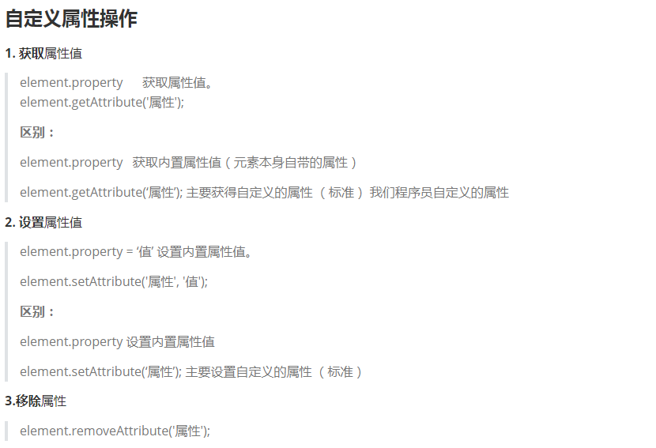

## 20.写一个验证身份证号的方法

分析：身份证号码的组成：地址码6位+年份码4位+月份码2位+日期码2位+顺序码3位+校验码1位

~~~javascript
function check(val){
    var reg=/^[1-9]\d{5}(19|20)\d{2}((0[1-9])|(1[0-2]))(([0-2][1-9])|(10|20|30|31))\d{3}			[0-9Xx]$/;
     	return reg.test(val);
}
~~~

~~~javascript
//检测省份码
function checkProvice(val)
{
    var patten=/^[1-9][0-9]/;
    if(patten.test(val))
    {
        var prov={11:"北京",12:"天津",13:"河北",14:"山西",15:"内蒙古",21:"辽宁",22:"吉林",23:"黑龙江",31:"上海",32:"江苏",33:"浙江",34:"安徽",35:"福建",36:"江西",37:"山东",41:"河南",42:"湖北",43:"湖南",44:"广东",45:"广西",46:"海南",51:"四川",52:"贵州",53:"云南",54:"西藏",50:"重庆",61:"陕西",62:"甘肃",63:"青海",64:"宁夏",65:"新疆",81:"香港",82:"澳门",83:"台湾"};
        if(prov[val])
        {
            return true;
        };
    }


   return false;
}


//检测出生日期
function checkBirthDay(val)
{
    var patten=/^(19|20)\d{2}((0[1-9])|1[0-2])(([0-2][1-9])|(10|20|30|31))/;
    if(patten.test(val))
    {
        var year=val.substring(0,4);
        var month=val.substring(4,6);
        var day=val.substring(6,8);
         
        var date=new Date(year+"-"+month+"-"+day);
        if(date&&date.getMonth()==(parseInt(month)-1))
        {
            return true;
        }
 
    }
    return false;
}

//检测校验码
function checkVerifyCode(val)
{
    var patten=/^[1-9]\d{5}(19|20)\d{2}((0[1-9])|(1[0-2]))(([0-2][1-9])|(10|20|30|31))\d{3}[0-9X]$/;
    var ratio=[7,9,10,5,8,4,2,1,6,3,7,9,10,5,8,4,2];
    var codeArr=[1,0,"X",9,8,7,6,5,4,3,2];
    var code=val.substring(17);
    if(patten.test(val))
    {
        var sum=0;
        for(var i=0;i<17;i++)
        {
            sum+=val[i]*ratio[i];
        }
        console.log(sum)
        var remainder=sum%11;
        if(codeArr[remainder]==code)
        {
            return true;
        }
    }
    return false;
}

function checkIndetityCardNo(val){
    var province=val.substring(0,2);
    if(checkProvice(province))
    {
         var date=val.substring(6,14);
         if(checkBirthDay(date))
         { 
             return checkVerifyCode(val);
         }
    }
    return false;
}
~~~

## 21.写一个方法验证是否为中文

~~~javascript
function isChinese(str) {
  const re = /^[\u4e00-\u9fa5]+$/;
  return re.test(str);
}
~~~

> 使用的`Unicode `编码 `4e00 `和 `9fa5` 分别表示第一个汉字和最后一个汉字的编码

## 22.你对new操作符的理解是什么？手动实现一个new方法

### new 的理解

new 运算符创建一个用户定义的对象类型的实例或具有构造函数的内置对象类型之一

### new步骤

（1）创建一个空对象，将它的引用赋给 this，继承函数的原型。

（2）通过 this 将属性和方法添加至这个对象

（3）最后返回 this 指向的新对象，也就是实例（如果没有手动返回其他的对象）

~~~javascript
let Parent = function (name, age) {
    //1.创建一个新对象，赋予this，这一步是隐性的，
    // let this = {};
    //2.给this指向的对象赋予构造属性
    this.name = name;
    this.age = age;
    //3.如果没有手动返回对象，则默认返回this指向的这个对象，也是隐性的
    // return this;
};
const child = new Parent();
~~~

## 23.请问0.1 + 0.2、0.1 + 0.3和0.1 * 0.2分别等于多少？并解释下为什么

分别等于0.30000000000000004、0.4、0.020000000000000004

JS中采用的IEEE 754的双精度标准，计算机内部存储数据的编码的时候，导致精度变化。不是所有浮点数都有舍入误差。二进制能精确地表示位数有限且分母是2的倍数的小数（这种情况的小数像乘法0.1*0.2的出五十分之一就不能精确）。

## 24.如何快速让一个数组乱序，写出来

~~~javascript
function shuffle(array) {
  for (let i = array.length - 1; i > 0; i--) {
    let j = Math.floor(Math.random() * (i + 1))
    [array[i], array[j]] = [array[j], array[i]]
  }
}
~~~

> 洗牌算法：思路就是从后往前遍历，然后随机(0, i+1)，交换

## 25.写一个判断设备来源的方法

~~~javascript
let ua = navigator.userAgent;
  // 移动端
  isMobile: ("ontouchstart" in window || navigator.msMaxTouchPoints) ? true : false,
  // 微信
  isWechat: /micromessenger/gi.test(ua),
  // qq
  isQQ: /qq/gi.test(ua),
  // VV音乐
  isvvmusic: /vvmusic/gi.test(ua),
  // 安卓
  isAndroid: /android/gi.test(ua),
  // iOS
  isIOS: /iphone|ipad|ipod|itouch/gi.test(ua), // IOS
~~~

其实想说的只有判断移动端，有时候ua并不正确。所以我们会使用一些移动端的 api 来判断是不是移动端。

## 26.说说call、apply、bind的区别？并手写实现一个bind的方法

[JavaScript 中 call()、apply()、bind() 的用法](https://www.runoob.com/w3cnote/js-call-apply-bind.HTML)

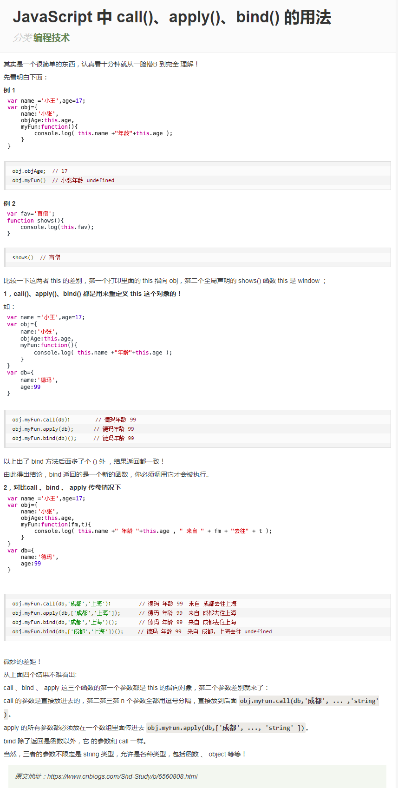

`call`和`apply`都是为了解决改变`this`的指向。作用都是相同的，只是传参的方式不同。

除了第一个参数外，`call`可以接收一个参数列表，`apply`只接受一个参数数组。 

`bind`绑定完之后返回一个新的函数，不执行。

~~~javascript
Function.prototype.myCall = function (context = window) {
  context.fn = this;

  var args = [...arguments].slice(1);

  var result = context.fn(...args);
  // 执行完后干掉
  delete context.fn;
  return result;
}
~~~

~~~javascript
Function.prototype.myApply = function (context = window) {
  context.fn = this;

  var result
  // 判断 arguments[1] 是不是 undefined
  if (arguments[1]) {
    result = context.fn(...arguments[1])
  } else {
    result = context.fn()
  }

  delete context.fn
  return result;
~~~

~~~javascript
Function.prototype.myBind = function (context) {
  if (typeof this !== 'function') {
    throw new TypeError('Error')
  }
  var _this = this
  var args = [...arguments].slice(1)
  // 返回一个函数
  return function F() {
    // 因为返回了一个函数，我们可以 new F()，所以需要判断
    if (this instanceof F) {
      return new _this(...args, ...arguments)
    }
    return _this.apply(context, args.concat(...arguments))
  }
}
~~~

另一个回答：

`bind`, `call`, `apply` 三者都可以改变 `this` 的指向。

其中 `call` 和 `apply` 为立即执行，两者效果等价，只有在传參形式上有所区别。`call` 需要把参数一个一个传入 `fun.call(obj, arg1, arg2, arg3,...)` 而 `apply` 接受一个数组作为参数 `fun.apply(obj, [arg1, arg2, arg3, ...])`。

`bind` 则是延时执行。`const fb = fun.bind(obj) fb(arg1, arg2, ...)` 在使用 `bind` 之后，只会返回一个修改了作用域的函数，等再次调用时才会执行。

手写实现bind的方法如下：

~~~javascript
Function.prototype.myBind(context,...args){
 return function(){
   return this.apply(context,args)
 }
}
~~~

## 27.说说你对arguments的理解，它是数组吗

[在js中arguments对象的理解](https://www.cnblogs.com/huangwenjietk/p/10850307.HTML)

### 在函数调用的时候，浏览器每次都会传递进两个隐式参数

* 函数的上下文对象this

* 封装实参的对象arguments

### arguments 对象

* arguments 对象实际上是所在函数的一个**内置伪数组对象**

* 每个函数都有一个arguments属性，表示函数的实参集合，这里的实参是重点，就是执行函数时实际传入的参数的集合。arguments不是数组而是一个对象，但它和数组很相似，所以通常称为类数组对象，以后看到类数组其实就表示arguments。arguments对象不能显式的创建，它只有在函数开始时才可用。

* arguments还有属性callee，length和迭代器Symbol。

* arguments同样具有length属性，arguments.length 为函数实参个数，可以用arguments[length]显示调用参数

* arguments对象可以检测参数个数，模拟函数重载

ECMAScript函数的参数与大多数其他语言中函数的参数有所不同。ECMAScript函数**不介意传递进来多少个参数，也不在乎传进来参数是什么数据类型**。也就是说，**即使你定义的函数只接收两个参数，在调用这个函数时也未必一定要传递两个参数。可以传递一个、三个甚至不传递参数，而解析器永远不会有什么怨言。**

之所以会这样，原因是ECMAScript中的参数在内部是用一个<strong style="color:red">数组</strong>来表示的。**函数接收到的始终都是这个数组，而不关系数组中包含哪些参数（如果有参数的话）。**

**如果这个数组中不包含任意元素，无所谓；如果包含多个元素**，**也没有问题**。实际上，在**函数体内**可以通过**arguments对象**来**访问这个参数数组**，从而获取传递给函数的每一个参数。

其实，**arguments对象只是与数组类似**（它并不是Array的实例，它实际上是一个**伪数组**），因为可以使用**方括号语法**访问它的每一个元素（即第一个元素是arguments[0]，第二个元素是argumetns[1]，以此类推），使用**length属性**来**确定传递进来多少个参数**。在前面的例子中，sayHi()函数的第一个参数的名字叫name，而该参数的**值**也可以通过访问**arguments[0]**来获取。因此，那个函数也可以像下面这样重写，即**不显式地**使用命名参数：

> 严格模式禁用arguments.callee

## 28.解释下这段代码的意思

[从一行代码里面学点JavaScript](https://my.oschina.net/l3ve/blog/330358)

~~~javascript
[].forEach.call($$("*"),function(a){
  a.style.outline="1px solid #"+(~~(Math.random()*(1<<24))).toString(16)})
~~~

### 作用

在你的Chrome浏览器的控制台中输入这段代码，你会发现不同HTML层都被使用不同的颜色添加了一个高亮的边框。是不是非常酷？但是，简单来说，这段代码只是首先获取了所有的页面元素，然后使用一个不同的颜色为它们添加了一个1px的边框。

### 解析

- `[].forEach.call() `=> 调用引用数组的forEach方法
- `$$('*') `=> `document.querySelectorAll('*')`
- `~~a` => `parseInt(a)`
- `1<<24` => 对二进数1小数点右移24位
- `(parseInt(Math.random()*(1<<24)).toString(16))` => 获得了一个位于`0-16777216`之间的随机整数，也就是随机颜色，再使用`toString(16)`将它转化为十六进制数。

### 手写简版

~~~javascript
[].forEach.call(
        document.querySelectorAll('*'),
        function(a){
            a.style.outline="1px solid #" + 
            (parseInt(Math.random()*(1<<24)).toString(16))
        }
    )
~~~

## 29.写一个获取数组的最大值、最小值的方法

方法1：

~~~javascript
Math.max.apply(Array,[25,62,91,78,34,62]) //  91
Math.min.apply(Array,[27,64,90,78,34,62]) // 27
~~~

方法2;

~~~javascript
Array.prototype.max = function() {
    return Math.max.apply(null, this)
}
~~~

方法3：

~~~javascript
Array.prototype.max = function(){
	return /^\d*$/g.test(a.join('')) ? Math.max(...a) : '请输入正确格式的数组';
};

var arrFirst = [1,'3',4];
var arrSecond = [1,'3','a'];
arrFirst.max();
arrSecond.max();
~~~

## 30.写一个方法判断字符串是否为回文字符串

~~~javascript
var isPalindrome = function(s) {
  if (s.length === 1) return true
  const str = s.replace(/[^a-zA-Z0-9]/g, "").toLowerCase()
  const strReverse = str.split('').reverse().join('')
  return str === strReverse
};
~~~

## 31.写一个方法把0和1互转（0置1，1置0）

方法1：

~~~javascript
var a；
!a && 1 || 0 ;
~a+2
~~~

方法2：

~~~javascript
~x + 2
~~~

方法3：直接异或操作就行了

~~~javascript
const convert = num => num^1;
convert(0); // 1
convert(1); // 0
~~~

## 32.造成内存泄漏的操作有哪些

内存泄露是指一块被分配的内存既不能使用，又不能回收，直到浏览器进程结束。在C++中，因为是手动管理内存，内存泄露是经常出现的事情。而现在流行的C#和Java等语言采用了自动垃圾回收方法管理内存，正常使用的情况下几乎不会发生内存泄露。浏览器中也是采用自动垃圾回收方法管理内存，但由于浏览器垃圾回收方法有bug，会产生内存泄露。

常见的内存泄露的操作有：

* 意外的全局变量
* 被遗忘的计时器或回调函数
* DOM清空或删除时，事件未清除导致的内存泄漏
* 闭包
* 子元素存在引用引起的内存泄漏

[造成内存泄漏的操作有哪些](https://www.cnblogs.com/xxm980617/p/10885178.HTML)

## 33.说说你对this的理解 (及其重要！！！)

[JavaScript 的 this 原理](http://www.ruanyifeng.com/blog/2018/06/javascript-this.HTML)

[前端基础进阶（七）：全方位解读this](https://www.jianshu.com/p/d647aa6d1ae6)

比如对于this指向的理解中，有这样一种说法：**谁调用它，this就指向谁**。在我刚开始学习this的时候，我非常相信这句话。因为在一些情况下，这样理解也还算说得通。可是我常常会在开发中遇到一些不一样的情况，一个由于this的错误调用，可以让我懵逼一整天。

在理解this之前，我们先了解一下执行上下文，它的生命周期如下：

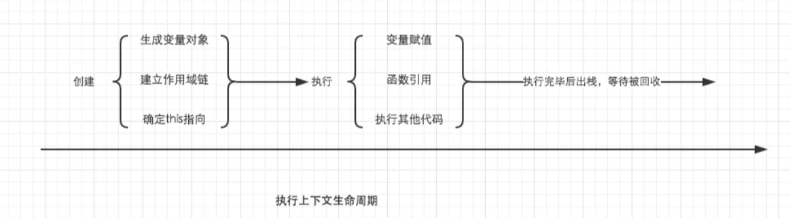

执行上下文的创建阶段，会分别生成变量对象，建立作用域链，确定this指向。其中变量对象与作用域链我们都已经明白了。本文的关键，就是确定this指向。

首先，我们需要得出一个非常重要的，并且一定要牢记于心的结论，**this的指向，是在函数被调用的时候确定的。**也就是执行上下文被创建时确定的。

因此，一个函数中的this指向，可以非常灵活。比如下面的例子中，同一个函数由于调用方式的不同，this指向了不一样的对象。

~~~javascript
var a = 10;
var obj = {
  a: 20
}

function fn() {
  console.log(this.a);
}

fn(); // 10
fn.call(obj); // 20
~~~

除此之外，**在函数执行过程中，this一旦被确定，就不可更改了。**

~~~javascript
var a = 10;
var obj = {
  a: 20
}

function fn() {
  this = obj; // 这句话试图修改this，运行后会报错
  console.log(this.a);
}

fn();
~~~


基本上可以归为四类：

### 一、全局对象中的this

关于全局对象的this，我之前在总结变量对象的时候提到过，它是一个比较特殊的存在。全局环境中的this，指向它本身。因此，这也相对简单，没有那么多复杂的情况需要考虑。

~~~javascript
// 通过this绑定到全局对象
this.a2 = 20;

// 通过声明绑定到变量对象，但在全局环境中，变量对象就是它自身
var a1 = 10;

// 仅仅只有赋值操作，标识符会隐式绑定到全局对象
a3 = 30;

// 输出结果会全部符合预期
console.log(a1);
console.log(a2);
console.log(a3);
~~~

### 二、函数中的this

在总结函数中this指向之前，我想我们有必要通过一些奇怪的例子，来感受一下函数中this的捉摸不定。

~~~javascript
// demo01
var a = 20;
function fn() {
  console.log(this.a);
}
fn();
~~~

~~~javascript
// demo02
var a = 20;
function fn() {
  function foo() {
    console.log(this.a);
  }
  foo();
}
fn();
~~~

~~~javascript
// demo03
var a = 20;
var obj = {
  a: 10,
  c: this.a + 20,
  fn: function () {
    return this.a;
  }
}

console.log(obj.c);
console.log(obj.fn());
~~~

这几个例子需要花点时间仔细感受一下，如果你暂时没想明白怎么回事，也不用着急，我们一点一点来分析。

分析之前，我们直接了当抛出结论。

在一个函数上下文中，this由调用者提供，由调用函数的方式来决定。**如果调用者函数，被某一个对象所拥有，那么该函数在调用时，内部的this指向该对象。如果函数独立调用，那么该函数内部的this，则指向undefined**。但是在非严格模式中，当this指向undefined时，它会被自动指向全局对象。

从结论中我们可以看出，想要准确确定this指向，找到函数的调用者以及区分他是否是独立调用十分关键。

~~~javascript
// 为了能够准确判断，我们在函数内部使用严格模式，因为非严格模式会自动指向全局
function fn() {
  'use strict';
  console.log(this);
}

fn();  // fn是调用者，独立调用
window.fn();  // fn是调用者，被window所拥有
~~~

在上面的简单例子中，`fn()`作为独立调用者，按照定义的理解，它内部的this指向就为undefined。而`window.fn()`则因为fn被window所拥有，内部的this就指向了window对象。

掌握了这个规则，现在回过头去看看上面的三个例子，通过添加/去除严格模式，你就会发现，原来this已经变得不那么虚无缥缈，已经有迹可循了。

但是我们需要特别注意的是demo03。在demo03中，对象obj中的c属性使用`this.a + 20`来计算。这里我们需要明确的一点是，单独的`{}`不会形成新的作用域，因此这里的`this.a`，由于并没有作用域的限制，它仍然处于全局作用域之中。所以这里的this其实是指向的window对象。

那么我们修改一下demo03的代码，大家可以思考一下会发生什么变化。

~~~javascript
'use strict';
var a = 20;
function foo() {
  var a = 1;
  var obj = {
    a: 10,
    c: this.a + 20,
    fn: function () {
      return this.a;
    }
  }
  return obj.c;
}
console.log(foo());    // ？
console.log(window.foo());  // ?
~~~

> 实际开发中，并不推荐这样使用this；
>
> 上面多次提到的严格模式，需要大家认真对待，因为在实际开发中，现在基本已经全部采用严格模式了，而最新的ES6，也是默认支持严格模式。

再来看一些容易理解错误的例子，加深一下对调用者与是否独立运行的理解。

~~~javascript
var a = 20;
var foo = {
  a: 10,
  getA: function () {
    return this.a;
  }
}
console.log(foo.getA()); // 10

var test = foo.getA;
console.log(test());  // 20
~~~

`foo.getA()`中，getA是调用者，他不是独立调用，被对象foo所拥有，因此它的this指向了foo。而`test()`作为调用者，尽管他与foo.getA的引用相同，但是它是独立调用的，因此this指向undefined，在非严格模式，自动转向全局window。

稍微修改一下代码，大家自行理解。

~~~javascript
var a = 20;
function getA() {
  return this.a;
}
var foo = {
  a: 10,
  getA: getA
}
console.log(foo.getA());  // 10
~~~

灵机一动，再来一个。如下例子。

~~~javascript
function foo() {
  console.log(this.a)
}

function active(fn) {
  fn(); // 真实调用者，为独立调用
}

var a = 20;
var obj = {
  a: 10,
  getA: foo
}

active(obj.getA);
~~~

### 三、使用call，apply显示指定this

JavaScript内部提供了一种机制，让我们可以自行手动设置this的指向。它们就是call与apply。所有的函数都具有这两个方法。它们除了参数略有不同之外，其功能完全一样。它们的第一个参数都为this将要指向的对象。

如下例子所示。fn并非属于对象obj的方法，但是通过call，我们将fn内部的this绑定为obj，因此就可以使用this.a访问obj的a属性了。这就是call/apply的用法。

~~~javascript
function fn() {
  console.log(this.a);
}
var obj = {
  a: 20
}

fn.call(obj);
~~~

call与applay后面的参数，都是向将要执行的函数传递参数。其中call以一个一个的形式传递，apply以数组的形式传递。这是他们唯一的不同。

~~~javascript
function fn(num1, num2) {
  console.log(this.a + num1 + num2);
}
var obj = {
  a: 20
}

fn.call(obj, 100, 10); // 130
fn.apply(obj, [20, 10]); // 50
~~~

因为call/apply的存在，JavaScript变得更加灵活。
也因此他们的使用场景就多种多样。简单总结几点，也欢迎大家补充。

#### **将类数组对象转换为数组**

~~~javascript
function exam(a, b, c, d, e) {

  // 先看看函数的自带属性 arguments 什么是样子的
  console.log(arguments);

  // 使用call/apply将arguments转换为数组, 返回结果为数组，arguments自身不会改变
  var arg = [].slice.call(arguments);

  console.log(arg);
}

exam(2, 8, 9, 10, 3);

// result:
// { '0': 2, '1': 8, '2': 9, '3': 10, '4': 3 }
// [ 2, 8, 9, 10, 3 ]
//
// 也常常使用该方法将DOM中的nodelist转换为数组
// [].slice.call( document.getElementsByTagName('li') );
~~~

#### **根据自己的需要灵活修改this指向**

~~~javascript
var foo = {
  name: 'joker',
  showName: function () {
    console.log(this.name);
  }
}
var bar = {
  name: 'rose'
}
foo.showName.call(bar);
~~~

#### **实现继承**

~~~javascript
// 定义父级的构造函数
var Person = function (name, age) {
  this.name = name;
  this.age = age;
  this.gender = ['man', 'woman'];
}

// 定义子类的构造函数
var Student = function (name, age, high) {

  // use call
  Person.call(this, name, age);
  this.high = high;
}
Student.prototype.message = function () {
  console.log('name:' + this.name + ', age:' + this.age + ', high:' + this.high + ', gender:' + this.gender[0] + ';');
}

new Student('xiaom', 12, '150cm').message();

// result
// ----------
// name:xiaom, age:12, high:150cm, gender:man;
~~~

简单给有面向对象基础的朋友解释一下。在Student的构造函数中，借助call方法，将父级的构造函数执行了一次，相当于将Person中的代码，在Sudent中复制了一份，其中的this指向为从Student中new出来的实例对象。call方法保证了this的指向正确，因此就相当于实现了继承。Student的构造函数等同于下。

~~~javascript
var Student = function (name, age, high) {
  this.name = name;
  this.age = age;
  this.gender = ['man', 'woman'];
  // Person.call(this, name, age); 这一句话，相当于上面三句话，因此实现了继承
  this.high = high;
}
~~~

#### **在向其他执行上下文的传递中，确保this的指向保持不变**

如下面的例子中，我们期待的是getA被obj调用时，this指向obj，但是由于匿名函数的存在导致了this指向的丢失，在这个匿名函数中this指向了全局，因此我们需要想一些办法找回正确的this指向。

~~~javascript
var obj = {
  a: 20,
  getA: function () {
    setTimeout(function () {
      console.log(this.a)
    }, 1000)
  }
}

obj.getA();
~~~

常规的解决办法很简单，就是使用一个变量，将this的引用保存起来。我们常常会用到这方法，但是我们也要借助上面讲到过的知识，来判断this是否在传递中被修改了，如果没有被修改，就没有必要这样使用了。

~~~javascript
var obj = {
  a: 20,
  getA: function () {
    var self = this;
    setTimeout(function () {
      console.log(self.a)
    }, 1000)
  }
}
~~~

另外就是借助闭包与apply方法，封装一个bind方法。

~~~javascript
function bind(fn, obj) {
  return function () {
    return fn.apply(obj, arguments);
  }
}

var obj = {
  a: 20,
  getA: function () {
    setTimeout(bind(function () {
      console.log(this.a)
    }, this), 1000)
  }
}

obj.getA();
~~~

当然，也可以使用ES5中已经自带的bind方法。它与我上面封装的bind方法是一样的效果。

~~~javascript
var obj = {
  a: 20,
  getA: function () {
    setTimeout(function () {
      console.log(this.a)
    }.bind(this), 1000)
  }
}
~~~

> ES6中也常常使用箭头函数的方式来替代这种方案

### 四、构造函数与原型方法上的this

在封装对象的时候，我们几乎都会用到this，但是，只有少数人搞明白了在这个过程中的this指向，就算我们理解了原型，也不一定理解到了this。所以这一部分，我认为将会为这篇文章最重要最核心的部分。理解了这里，将会对你学习JS面向对象产生巨大的帮助。

结合下面的例子，我抛出几个问题大家思考一下。

~~~javascript
function Person(name, age) {

    // 这里的this指向了谁?
    this.name = name;
    this.age = age;   
}

Person.prototype.getName = function() {

    // 这里的this又指向了谁？
    return this.name;
}

// 上面的2个this，是同一个吗，他们是否指向了原型对象？

var p1 = new Person('Nick', 20);
p1.getName();
~~~

我们已经知道，this，是在函数调用过程中确定，因此，搞明白new的过程中到底发生了什么就变得十分重要。

通过new操作符调用构造函数，会经历以下4个阶段。

- 创建一个新的对象；
- 将构造函数的this指向这个新对象；
- 指向构造函数的代码，为这个对象添加属性，方法等；
- 返回新对象。

因此，当new操作符调用构造函数时，this其实指向的是这个新创建的对象，最后又将新的对象返回出来，被实例对象p1接收。因此，我们可以说，这个时候，构造函数的this，指向了新的实例对象：p1。

而原型方法上的this就好理解多了，根据上边对函数中this的定义，`p1.getName()`中的getName为调用者，他被p1所拥有，因此getName中的this，也是指向了p1。

## 34.请用canvas写一个关于520浪漫表白的代码

~~~html
<HTML>
<head>
<meta http-equiv="Content-Type" content="text/HTML; charset=UTF-8">
<title>I Love You Forever</title>
<meta name="author" content="Mike">

<link rel="stylesheet" href="css/style.css" type="text/css" media="all">
<!--导库-->
<script type="text/javascript" src="js/jquery.js"></script>
<!-- 图片幻灯片效果-->
<script type="text/javascript" src="js/roundabout.js"></script>
<script type="text/javascript" src="js/roundabout_shapes.js"></script>
<script type="text/javascript" src="js/gallery_init.js"></script>
<!-- 下雪-->
<script type="text/javascript" src="js/snowstorm.js"></script>
<!-- 打字机效果-->		
<script type="text/javascript" src="js/text.js"></script>
<!-- 画爱心-->
<script type="text/javascript" src="js/ga.js" async=""></script>
<script type="text/javascript" src="js/heart.js"></script>
<!-- 移动div-->
<script type="text/javascript" src="js/move.js"></script>
<!-- 显示时间 -->
<script type="text/javascript" src="js/time.js"></script>
<!-- 设置文字跟随鼠标 -->
<script type="text/javascript" src="js/makesnake.js"></script></head><body>
<!-- thanks for watching! -->
<span id="span0" class="spanstyle">T</span><span id="span1" class="spanstyle">h</span>
<span id="span2" class="spanstyle">a</span><span id="span3" class="spanstyle">n</span>
<span id="span4" class="spanstyle">k</span><span id="span5" class="spanstyle">s</span><span id="span6" class="spanstyle">
 </span><span id="span7" class="spanstyle">f</span><span id="span8" class="spanstyle">o</span><span id="span9" class="spanstyle">r</span>
 <span id="span10" class="spanstyle"> </span><span id="span11" class="spanstyle">w</span>
 <span id="span12" class="spanstyle">a</span><span id="span13" class="spanstyle">t</span><span id="span14" class="spanstyle">c</span><span id="span15" class="spanstyle">h</span>
 <span id="span16" class="spanstyle">i</span><span id="span17" class="spanstyle">n</span><span id="span18" class="spanstyle">g</span><span id="span19" class="spanstyle">!</span>


<script type="text/javascript">
	setTimeout(makesnake, 42000);
</script>
<!--#Header-->
<div id="header" style="opacity:0.85">
	<div id="title">
		I Love You Forever
	</div>
</div>

<!-- #myContent -->
<div id="myContent">
		<span id="blink" style="display: none;">_</span></div>
<div id="contentToWrite" style="display:none">
	一时间不知道从哪说起,         <br>
		真爱来了，我们要好好把    <br>
		一时间不知道从哪说起,         <br>
		真爱来了，我们要好好把握。不管面临多大的压力，<br>
		不管前面的路如何崎岖.<br>
		不管经历过什么,我仍坚信最浪漫的事就是和<br>
		你一起慢慢变老.<br>
		还记得否,曾经的点点滴滴，从相识到现在，<br>
		从冷漠到关心,从谢绝到依赖，从生疏到相爱,<br>
		一切似乎都是那么遥远,又似乎那么触手可及.<br>
		正如某人说的那样,但求岁月静好,现世安稳.<br>
		一生守候不是一句简单而苍白的山盟海誓，<br>
		而是无数个平淡的日子同舟共济，相濡以沫.<br>
		相信右下角的计时器,将永远继续下去,直至数据溢出.<br>
		<br>
		-----------------------Just for You, YaRu<br>
</div>
<script type="text/javascript">
	writeContent(true);
</script>


<!-- #container -->
<div id="container">
	<ul id="myRoundabout" class="roundabout-holder" style="padding: 0px; position: relative; z-index: 100;">
	<li class="roundabout-moveable-item roundabout-in-focus" current-scale="1.0000" style="position: absolute; left: 122px; top: 87px; width: 350px; height: 222px; opacity: 1; z-index: 400; font-size: 16px;"></li>
	<li class="roundabout-moveable-item" current-scale="0.7927" style="position: absolute; left: -0.4px; top: 110px; width: 277.445px; height: 175.9794px; opacity: 1; z-index: 296; font-size: 12.68px;"></li>
	<li class="roundabout-moveable-item" current-scale="0.4573" style="position: absolute; left: 473.8px; top: 147.2px; width: 160.055px; height: 101.5206px; opacity: 1; z-index: 129; font-size: 7.32px;"></li>
	<li class="roundabout-moveable-item" current-scale="0.4573" style="position: absolute; left: -39.8px; top: 147.2px; width: 160.055px; height: 101.5206px; opacity: 1; z-index: 129; font-size: 7.32px;"></li>
	<li class="roundabout-moveable-item" current-scale="0.7927" style="position: absolute; left: 317px; top: 110px; width: 277.445px; height: 175.9794px; opacity: 1; z-index: 296; font-size: 12.68px;"></li>
  </ul>
</div>
<script type="text/javascript">
	setTimeout(move, 15000);
</script>

<!-- #bg -->
<div id="bg">
	<canvas id="garden" width="1583" height="709"><c style="color: #FFF; text-shadow:2px 3px 3px #222; font-family:Microsoft YaHei; font-size:50px">你的浏览器过时了,试试火狐吧!</c></canvas>
</div>

<!-- #time -->
<div id="time">
	<span id="show"></span>
	<script type="text/javascript">
		setTimeout("showTime()", 40000);
	</script>
</div>

</body>
~~~

~~~javascript

/* Global properties ======================================================== */
body { 
	background:#6f599c;
	background-image:url(../images/bg.jpg) ;
	text-align:left;
}

/* Global Structure ============================================================= */
/* Header */
#header{
	position:absolute;
	left:0px;
	top:5px;
	overflow:hidden;
	height:70px;
	font-family:Microsoft YaHei;
	font-weight: 900;
	font-size:40px;
	padding-bottom:5px;
	width: 100%;
	filter:alpha(opacity=70);
	-moz-opacity:0.7;
	opacity:0.7;
}
	
#myContent{
	position:absolute;
	left:80px;
	top:130px;
	overflow:hidden;
	text-shadow: 2px 3px 3px #000; 
	font-family:Microsoft YaHei;
	font-style:italic;
	font-weight:500;
	font-size:20px;
	color:#CCCCCC;
}

#container{
	overflow:hidden;
	position:absolute;
	left:630px;
	top:220px;
	width:650px;
	opacity:0;
	filter:alpha(opacity=0.7)
}

#title{
	position:absolute;
	left:28%;
	top:0px;
	padding:10px;
	overflow:hidden;
	text-shadow: 2px 3px 3px #222; 
	color:#CCCCCC;
}

#footer {
	position:absolute;
	left:32%;
	top:91%;
	overflow:hidden;
	text-shadow: 2px 3px 3px #222; 
	font-family:Microsoft YaHei;
	font-style:italic;
	font-size:20px;
	color:#CCCCCC;
}


#time{
	position:absolute;
	left:750px;
	top:400px;
	overflow:hidden;
}

#show{
	color:#CCCCCC;
	text-shadow: 2px 3px 3px #222; 
	font-family:Microsoft YaHei;
	font-style:italic;
	font-size:20px;
}


#bg{
	overflow:hidden;
}

.roundabout-holder  { 
	width:600px;
	height:400px;
	margin:0 auto;
}
.roundabout-moveable-item {
	width: 350px;
	height: 222px;
	cursor: pointer;
	border:3px solid #ccc;
	border:3px solid rgba(0, 0, 0, 0.08);
    border-radius:4px;
	-moz-border-radius:4px;
	-WEBkit-border-radius:4px;
}
.roundabout-moveable-item img{
	width:100%;
}
.roundabout-in-focus {
	border:3px solid rgba(0, 0, 0, 0.2);
}

ol, ul {
	list-style: none;
}

img {
	vertical-align:top; 
}

.spanstyle{
	color:#CCFF99;
	font-family:courier;
	text-shadow: 2px 2px 1px #222; 
	font-style:italic;
	font-weight:600;
	font-size:20px;
	position:absolute;		/* 绝对定位 */
	top:-50px;
	overflow:hidden;
}
~~~


## 35.请你解释一个为什么10.toFixed(10)会报错?

之所以会报错，是因为在这里的 `.` 发生了歧义，它既可以理解为小数点，也可以理解为对方法的调用。
因为这个点紧跟于一个数字之后，按照规范，解释器就把它判断为一个小数点。

所以我们可以这样修改下：

```
(10).toFixed(10)
10..toFixed(10)
10 .toFixed(10)
10.0.toFixed(10)
```

## 36.请用CSS手写一个幻灯片的效果

[css写的一个简单的幻灯片效果页面](<https://blog.csdn.net/kuaileweixiao9898/article/details/83007666>)

制作幻灯片，第一反应是用CSS3的Animation，那我就简单介绍一下Animation。

* CSS3属性中有关于制作动画的三个属性：Transform,Transition,Animation。

* transform属性向元素应用2D或3D转换。该属性允许我们对元素进行旋转、缩放、移动或倾斜。transition是令一个或多个可以用数值表示的css属性值发生变化时产生过渡效果（详情请看[CSS3 transform 属性]( <http://www.w3school.com.cn/cssref/pr_transform.asp>))

* Animation字面的意思就是“动画”  属性：`animation: name`（绑定到选择器的 keyframe 名称） `duration`（延长的时间） `timing-function`（动画的速度曲线：linear（速度相同）  ease（先低速后加速）  ease-in （低速开始） ease-out （低速结束） ease-in-out  （低速开始和结束） cubic-bezier(*n*,*n*,*n*,*n*)（从 0 到 1 的数值）） `delay`（动画开始前的延迟）  `iteration-count `（播放的次数（*n（播放次数）*|infinite（无限循环）））direction （是否循环播放（normal（正常播放）|alternate（轮流反向播放）））fill-mode play-state;

​        例子：

~~~css
animation:marginLeft 10s linear 2s infinite 100 reverse  paused
~~~

*  keyframes（关键帧） 

  书写格式为：@keyframes "动画名字"｛｝

  内根据设置内容从“0%”到“100%”依次编写，注意“0%”一定不能把百分号省略！

  可以使用“fromt”“to”来代表一个动画是从哪开始，到哪结束（from"就相当于"0%"而"to"相当于"100%",）

  为了兼容浏览器，记得加各浏览器前缀（“chrome和safira：-WEBkit-”、“firefox:-moz-”、“opera:-o-”）

~~~css

<template>
  <div class="myDiv"></div>
</template>
 
<style>
.myDiv{
  width: 600px;
  height: 400px;
  margin: 20px auto;
  background-size: over;
  background-position: center;
  animation-name:'loop';
  animation-duration: 20s;
  animation-iteration-count: infinite;
}
@keyframes loop{
 
    0% {background: url('http://img5.duitang.com/uploads/blog/201408/12/20140812150016_8NMUU.jpeg') no-repeat;}
    25% {background: url('http://pic29.nipic.com/20130518/9908282_142904524164_2.jpg') no-repeat;}
    50% {background: url('http://uploadfile.huiyi8.com/2014/0605/20140605114503719.jpg') no-repeat;}
    75% {background: url('http://img3.redocn.com/20100322/Redocn_2010032112222793.jpg') no-repeat;}
    100% {background: url('http://uploadfile.huiyi8.com/2014/0605/20140605114447934.jpg') no-repeat;}
}
</style>
~~~

## 37.找到字符串中最长的单词，并返回它的长度 

思路还是以空格进行分割，然后对数组进行操作，多了一个对分割符的拓展。

~~~javascript
const getLongestWord = (str, sperator = " ") => {
  if (!str) {
    return str;
  }

  let longestWord = {
    len: 0,
    word: ""
  };

  str
    .replace(/[,\.;]/g, "")
    .split(sperator)
    .forEach(word => {
      const { len } = longestWord;
      if (word.length > len) {
        longestWord = {
          len: word.length,
          word
        };
      }
    });
  return longestWord;
};

console.log(getLongestWord("I have an apple."));
console.log(getLongestWord("I have a pen."));
~~~

## 38.说说你对eval的理解

`eval()` 相当于一个小型的JS解析器，接受一个字符串，可以把字符串解析成js代码并执行，所以有很有大的安全隐患，并且写进去的代码都是字符串，不利于维护，使用它执行代码性能也会大大折扣，所以正常情况下不建议使用。

`eval` 确实能不用就不用，不过在某些业务场景下，eval 比其他方法要简单很多，可以认为是一种hack，但是说到底还是不推荐使用。

* 不安全的,
* 容易出错, 因为你不知道你传入的参数是什么鬼
* 性能底下.
* 某种情况下跟new Function(), setTimeout, setInterval类似
* 不利于代码可维护性, 可拓展性
* 不是在无可奈何的情况下, 请不要使用

## 39.说说你对模块化的理解

[前端中的模块化](<https://blog.csdn.net/dadadeganhuo/article/details/86777249>)

[CommonJS规范](<https://javascript.ruanyifeng.com/nodejs/module.HTML>)

[Javascript模块化编程（二）：AMD规范](<http://www.ruanyifeng.com/blog/2012/10/asynchronous_module_definition.HTML>)

当我们要完成一个应用的时候，会根据对应的功能划分为许多不同的模块，就像一个论坛，有发帖的模块，评论的模块，js 中的模块也正是如此，一个具体功能的代码抽成一个文件，当你做一个东西的时候需要用到这个功能的时，可以直接使用这个文件，实现功能的分离，并能在多个需要的地方使用。就像是螺丝钉、螺丝帽、垫片一样的，通过组合使用实现出你的产品。

通过直白的描述，我们可以知道，模块化的好处就是，抽离代码，重复使用，如现在很直观的代表 npm 包。

模块化解决了代码污染的问题。提高了代码的重复率以及让多人合作编程了可能。

模块化分为

* AMD: require.js 为代表，依赖前置，一律先加载再使用。
* CMD: sea.js 为代表，依赖就近原则。
* UMD: 同时支持 AMD 和 CMD 方法。
* ES6 import/export

## 40.为什么会有跨域问题？怎么解决跨域

[跨域资源共享 CORS 详解](<http://www.ruanyifeng.com/blog/2016/04/cors.HTML>)

[关于跨域，你想知道的全在这里](<https://zhuanlan.zhihu.com/p/25778815>)

在使用Vue搭建的一个后端管理系统中，我使用axios请求本地的Node环境下的接口，但是请求失败，然后我错误信息是：

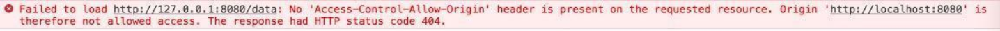

大概意思就是不能访问`http://localhost:8080`

我的Vue项目端口是`http://localhost:8081`，Node服务端运行在`http://localhost:8080`端口上，也就是说因为请求端口和响应端口不一致，所以请求失败。

我也在网上查看了一些关于跨域出现的原因及解决的方法，并记录下来。

### 为什么会有跨域

跨域一句话的理解就是：服务端和请求端的地址不一样。

Ajax 的便利性大家都清楚，可以在不向服务器提交完整的页面的情况下，实现局部更新页面。但是浏览器处于对安全方面的考虑，不允许跨域调用其他页面的对象。

其实这个也不能怪浏览器，假设谁都可以随随便便向你发送请求，那样有很大的安全隐患。

根据浏览器的同源策略, 只有当协议，域名，端口相同的时候才算是同源, 反之则均视为是一个跨域的请求。

也就是说我刚刚的Vue端口是`8081`，服务端端口是`8080`，端口不一样，因为同源策略的存在 ，所有我的请求会失败。

### 怎么解决跨域

下面就先介绍三种跨全域的方法：

* JSONP

  JSONP应该是最常见解决跨域的方法了，
  他为什么能解决跨域呢，是因为WEB 页面上调用 js 文件不受浏览器同源策略的影响，所以通过 Script 便签可以进行跨域的请求：

  1. 首先前端先设置好回调函数，并将其作为 url 的参数。
  2. 服务端接收到请求后，通过该参数获得回调函数名，并将数据放在参数中将其返回
  3. 收到结果后因为是 script 标签，所以浏览器会当做是脚本进行运行，从而达到跨域获取数据的目的。

* CORS

  CORS 是一个 W3C 标准，全称是"跨域资源共享"（Cross-origin resource sharing）它允许浏览器向跨源服务器，发出 XMLHttpRequest 请求，从而克服了 ajax 只能同源使用的限制。

  CORS 需要浏览器和服务器同时支持才可以生效，对于开发者来说，CORS 通信与同源的 ajax 通信没有差别，代码完全一样。浏览器一旦发现 ajax 请求跨源，就会自动添加一些附加的头信息，有时还会多出一次附加的请求，但用户不会有感觉。

  因此，实现 CORS 通信的关键是服务器。只要服务器实现了 CORS 接口，就可以跨源通信。

* Server Proxy

  服务器代理，顾名思义，当你需要有跨域的请求操作时发送请求给后端，让后端帮你代为请求，然后最后将获取的结果发送给你。

### 总结

常用的跨域方式基本就是这三种：

1. JSONP
   优点是可以兼容老浏览器，缺点是只能发送GET请求
2. CORS
   优点简单方便，支持post请求，缺点是需要后端的配合,不支持老版浏览器。。
3. Server Proxy
   优点是前端正常发送ajax请求，缺点是后端会二次请求。

其他的跨域方式还有：`location.hash`、`window.name`、`postMessage`等方式，有时间也可以了解一下。

## 41.说说你对IIFE的理解

[什么是立即执行函数，它有什么作用？](https://www.jianshu.com/p/b10b6e93ddec)

[JavaScript中的立即执行函数](https://segmentfault.com/a/1190000003902899)

[深入理解JavaScript系列（4）：立即调用的函数表达式](https://www.cnblogs.com/TomXu/archive/2011/12/31/2289423.HTML)

[函数](https://javascript.ruanyifeng.com/grammar/function.HTML#toc23)

[闭包与立即调用函数表达式IIFE](https://zhuanlan.zhihu.com/p/25210574)

IIFE(Immediately Invoked Function Expression)：立即调用的函数表达式(不准确的翻译叫立即执行函数)

### 什么是立即执行函数？

声明一个函数，并马上调用这个匿名函数就叫做立即执行函数；也可以说立即执行函数是一种语法，让你的函数在定义以后立即执行；

立即执行函数的创建步骤，看下图：

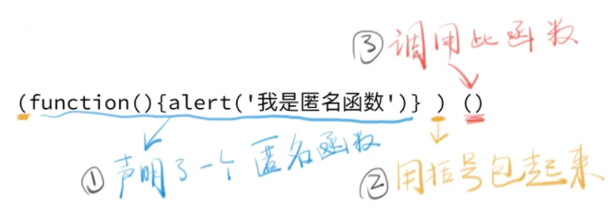

### 立即执行函数的写法(2种)

有时，我们定义函数之后，立即调用该函数，这时不能在函数的定义后面直接加圆括号，这会产生语法错误。产生语法错误的原因是，function 这个关键字，既可以当做语句，也可以当做表达式，比如下边：

~~~javascript
//语句
function fn() {};

//表达式
var fn = function (){};
~~~

为了避免解析上的歧义，JS引擎规定，如果function出现在行首，一律解析成语句。因此JS引擎看到行首是function关键字以后，认为这一段都是函数定义，不应该以原括号结尾，所以就报错了。

 解决方法就是不要让function出现在行首，让JS引擎将其理解为一个表达式，最简单的处理就是将其放在一个圆括号里，比如下边：

~~~javascript
(function(){
//...
}());
~~~

~~~javascript
(function (){
//...
})();
~~~

上边的两种写法，都是以圆括号开头，引擎会意味后面跟的是表达式，而不是一个函数定义语句，所以就避免了错误，这就叫做"立即调用的函数表达式"。
 立即执行函数，还有一些其他的写法（加一些小东西，不让解析成语句就可以）,比如下边：

~~~javascript
(function () {alert("我是匿名函数")}())   //用括号把整个表达式包起来
(function () {alert("我是匿名函数")})()  //用括号把函数包起来
!function () {alert("我是匿名函数")}()  //求反，我们不在意值是多少，只想通过语法检查
+function () {alert("我是匿名函数")}() 
-function () {alert("我是匿名函数")}() 
~function () {alert("我是匿名函数")}() 
void function () {alert("我是匿名函数")}() 
new function () {alert("我是匿名函数")}() 
~~~

### 立即执行函数的作用

1. 不必为函数命名，避免了污染全局变量
2. 立即执行函数内部形成了一个单独的作用域，可以封装一些外部无法读取的私有变量
3. 封装变量

**总而言之：立即执行函数会形成一个单独的作用域，我们可以封装一些临时变量或者局部变量，避免污染全局变量**

## 42.window对象和document对象有什么区别

### window对象(爹)

代表浏览器中的一个打开的窗口或者框架，window对象会在或者每次出现时被自动创建，在客户端JavaScript中，Window对象是全局对象global，所有的表达式都在当前的环境中计算，要引用当前的窗口不需要特殊的语法，可以把那个窗口属性作为全局变量使用，例如：可以只写`document`，而不必写`window.document`。同样可以把窗口的对象方法当做函数来使用，如：只写`alert()`，而不必写`window.alert`。

window对象实现了核心JavaScript所定义的全局属性和方法。

### document对象(儿子)

代表整个HTML文档，可以用来访问页面中的所有元素 。

每一个载入浏览器的HTML文档都会成为document对象。document对象使我们可以使用脚本(js)中对HTML页面中的所有元素进行访问。

**document对象是window对象的一部分**，可以通过window.document属性对其进行访问HTMLDocument接口进行了扩展，定义HTML专用的属性和方法，很多属性和方法都是HTMLCollection对象，其中保存了对锚、表单、链接以及其他可脚本元素的引用。

## 43.JQuery的源码看过吗？能不能简单概括一下它的实现原理

[jQuery 的源码大体分析](https://www.axihe.com/focus/jquery/17.HTML)

### 闭包机制

~~~javascript
 // 以下截取自 jquery 源码片段
 (function( window, undefined ) {
    /*    源码内容    */
 })( window );
~~~

上面这一小段代码来自于 1.9.0 当中 jquery 的源码，它是一个无污染的 JS 插件的标准写法，专业名词叫闭包。可以把它简单的看做是一个函数，与普通函数不同的是，这个函数没有名字，而且会立即执行

我们将里面的变量变成了局域变量，这不仅可以提高运行速度，更重要的是我们在引用 jquery 的 JS 文件时，不会因为 jquery 当中的变量太多，而与其它的 JS 框架的变量命名产生冲突；闭包中的变量声明没有污染到外面的全局变量；

### 作为全局的一个属性

~~~javascript
window.jQuery = window.$ = jQuery;
~~~

这一句话将我们在闭包当中定义的 jQuery 对象导出为全局变量 jQuery 和\$，因此我们才可以在外部直接使用 jQuery 和$。

window 是默认的 JS 上下文环境，因此将对象绑定到 window 上面，就相当于变成了传统意义上的全局变量。

### 最核心的功能，就是选择器

首先我们进入 jquery 源码中，可以很容易的找到 jquery 对象的声明，看过以后会发现，原来我们的 jquery 对象就是 init 对象。

~~~javascript
jQuery = function( selector, context ) {
	return new jQuery.fn.init( selector, context, rootjQuery );
}
~~~

这里出现了 jQuery.fn 这样一个东西，它的由来可以在 jquery 的源码中找到，它其实代表的就是 jQuery 对象的原型。

~~~javascript
jQuery.fn = jQuery.prototype;
jQuery.fn.init.prototype = jQuery.fn;
~~~

这两句话，第一句把 jQuery 对象的原型赋给了 fn 属性，第二句把 jQuery 对象的原型又赋给了 init 对象的原型。也就是说，init 对象和 jQuery 具有相同的原型，因此我们在上面返回的 init 对象，就与 jQuery 对象有一样的属性和方法。

我们不打算深究 init 这个方法的逻辑以及实现，但是我们需要知道的是，jQuery 其实就是将 DOM 对象加了一层包裹，而寻找某个或者若干个 DOM 对象是由 sizzle 选择器负责的。

## 44.深度克隆对象的方法有哪些，并把你认为最好的写出来

[JavaScript中如何实现深度克隆——不错的博文](https://www.jianshu.com/p/2a3728cded4c?utm_campaign=maleskine&utm_content=note&utm_medium=reader_share&utm_source=weixin)

[JS对象的深度克隆](https://www.cnblogs.com/momo798/p/9235128.HTML)

我比较喜欢使用原生的方法，足够简单，而且可以解决大多数的深拷贝。

~~~javascript
var  obj1={
    name: '张三',
    age:14,
    friend:['小红','小白'],
    parents:{
        mother:{name: '李岚',age:34},
        father:{name: '张武',age:35}
    }
}
var obj2 = JSON.parse(JSON.stringify(obj1))
obj1.mother === obj2.parents.mother//false
~~~

> 递归调用拷贝。json.parse可以解决一般的对象深拷贝，但是函数类型的对象就不行了

### JavaScript中的内存管理

JS内存管理，往深了挖很复杂，这里只做简单的介绍，帮助理解js的基本类型和引用类型，为了后面讲解深度克隆做铺垫，我们知道JS拥有自动的垃圾回收机制，这样就使得很多前端开发人员不是很重视内存管理这一块。但是其实这一部分的内容对于理解JS中原型与原型链，闭包，递归都是非常有帮助的。

在JS中，每一个数据都需要一个内存空间。内存空间又被分为两种：

~~~javascript
栈内存(stock)
堆内存(heap)
~~~

* 基础数据类型和栈内存

JS中的基础数据类型，我们也称之为原始数据类型，这些值都有固定的大小，往往都保存在栈内存中，由系统自动分配存储空间。我们可以直接操作保存在栈内存空间的值，因此基础数据类型都是按值访问。也就是说，它们的值直接存储在变量访问的位置。

数据在栈内存中的存储与使用方式类似于数据结构中的堆栈数据结构，遵循后进先出的原则。

~~~javascript
基础数据类型： 
Number String Null Undefined Boolean Symbol(ES6新增)
~~~

要简单理解栈内存空间的存储方式，我们可以通过类比乒乓球盒子来分析。

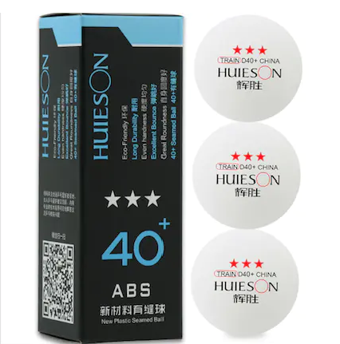

乒乓球的存放方式与栈内存中存储数据的方式如出一辙。处于盒子中最顶层的乒乓球，它一定是最后被放进去的，但可以最先被使用。而我们想要使用底层的乒乓球，就必须将上面的两个乒乓球取出来，让最底层的乒乓球处于盒子顶层。这就是栈空间 “先进后出，后进先出” 的特点。

* 引用数据类型与堆内存

与java等其他语言不同，JS的引用数据类型，比如数组Array，它们值的大小是不固定的，可以再不声明长度的情况下，动态填充。引用数据类型的值是保存在堆内存中的对象。

JavaScript不允许直接访问堆内存中的位置，因此我们不能直接操作对象的堆内存空间。

在操作对象时，实际上是在操作对象的引用而不是实际的对象。因此，引用类型的值都是按引用访问的。

这里的引用，我们可以粗浅地理解为保存在栈内存中的一个地址，该地址与堆内存的实际值相关联。

为了更好的搞懂栈内存与堆内存，我们可以结合以下例子与图解进行理解。

~~~javascript
```
var a1 = 0;   // 栈 
var a2 = 'this is string'; // 栈
var a3 = null; // 栈

var b = { m: 20 }; // 变量b存在于栈中，{m: 20} 作为对象存在于堆内存中
var c = [1, 2, 3]; // 变量c存在于栈中，[1, 2, 3] 作为对象存在于堆内存中
```
~~~

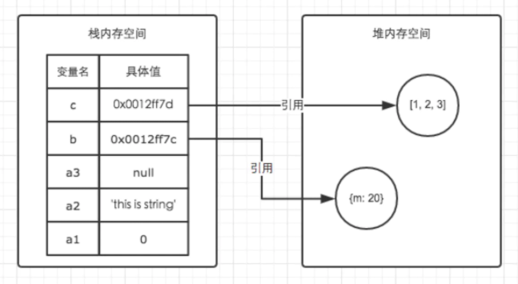

上例变量的内存分配情况图解

因此当我们要访问堆内存中的引用数据类型时，实际上我们首先是从栈中获取了该对象的地址引用（或者地址指针），然后再从堆内存中取得我们需要的数据。

### JavaScript浅克隆和深度克隆

既然已经理解了JS中基础类型和引用类型的特点，下面就开始真正探讨关于深度克隆问题了。

#### 浅克隆

浅克隆之所以被称为浅克隆，是因为对象只会被克隆最外部的一层,至于更深层的对象,则依然是通过引用指向同一块堆内存。

~~~javascript
// 浅克隆函数
function shallowClone(o) {
  const obj = {};
  for ( let i in o) {
    obj[i] = o[i];
  }
  return obj;
}
// 被克隆对象
const oldObj = {
  a: 1,
  b: [ 'e', 'f', 'g' ],
  c: { h: { i: 2 } }
};

const newObj = shallowClone(oldObj);
console.log(newObj.c.h, oldObj.c.h); // { i: 2 } { i: 2 }
console.log(oldObj.c.h === newObj.c.h); // true
~~~

我们可以很明显地看到,虽然`oldObj.c.h`被克隆了,但是它还与`oldObj.c.h`相等,这表明他们依然指向同一段堆内存,我们上面讨论过了引用类型的特点，这就造成了如果对`newObj.c.h`进行修改,也会影响`oldObj.c.h`。这本身不是我们想要的，因此就不算是一版好的克隆。

~~~javascript
newObj.c.h.i = '我们两个都变了';
console.log(newObj.c.h, oldObj.c.h); // { i: '我们两个都变了' } { i: '我们两个都变了' }
~~~

我们改变了`newObj.c.h.i`的值,`oldObj.c.h.i`也被改变了,这就是浅克隆的问题所在。

#### 深克隆

##### JSON.parse方法

JSON对象parse方法可以将JSON字符串反序列化成JS对象，stringify方法可以将JS对象序列化成JSON字符串,这两个方法结合起来就能产生一个便捷的深克隆。

~~~javascript
const newObj = JSON.parse(JSON.stringify(oldObj));
~~~

我们依然使用上述中的那个例子做演示。

~~~javascript
const oldObj = {
  a: 1,
  b: [ 'e', 'f', 'g' ],
  c: { h: { i: 2 } }
};

const newObj = JSON.parse(JSON.stringify(oldObj)); // 将oldObj先序列化再反序列化。
console.log(newObj.c.h, oldObj.c.h); // { i: 2 } { i: 2 }
console.log(oldObj.c.h === newObj.c.h); // false 这时候就已经不一样了
newObj.c.h.i = '我和oldObj相互独立';
console.log(newObj.c.h, oldObj.c.h); // { i: '我和oldObj相互独立' } { i: 2 }
~~~

果然,这是一个实现深克隆的好方法,但是这个解决办法是不是太过简单了.

确实,这个方法虽然可以解决绝大部分是使用场景,但是却有很多坑.

- 1.他无法实现对函数 、RegExp等特殊对象的克隆;
- 2.会抛弃对象的constructor,所有的构造函数会指向Object;
- 3.对象有循环引用,会报错;

针对以上的情况，我们可以测试一下：

~~~javascript
// 构造函数
function person(pname) {
  this.name = pname;
}

const Messi = new person('Messi');

// 函数
function say() {
  console.log('hi');
};

const oldObj = {
  a: say,
  b: new Array(1),
  c: new RegExp('ab+c', 'i'),
  d: Messi
};

const newObj = JSON.parse(JSON.stringify(oldObj));

// 无法复制函数
console.log(newObj.a, oldObj.a); // undefined [Function: say]
// 稀疏数组 复制错误
console.log(newObj.b[0], oldObj.b[0]); // null undefined
// 无法复制正则对象
console.log(newObj.c, oldObj.c); // {} /ab+c/i
// 构造函数指向错误
console.log(newObj.d.constructor, oldObj.d.constructor); // [Function: Object] [Function: person]
~~~

我们可以看到在对函数、正则对象、稀疏数组等对象克隆时会发生意外，构造函数指向也会发生错误。

~~~javascript
const oldObj = {};

oldObj.a = oldObj;

const newObj = JSON.parse(JSON.stringify(oldObj));
console.log(newObj.a, oldObj.a); // TypeError: Converting circular structure to JSON
~~~

对象的循环引用会抛出错误。

##### 构造一个深度克隆函数

由于要面对不同的对象(正则、数组、Date等)要采用不同的处理方式，我们需要实现一个对象类型判断函数。

~~~javascript
const isType = (obj, type) => {
  if (typeof obj !== 'object') return false;
  // 判断数据类型的经典方法：
  const typeString = Object.prototype.toString.call(obj);
  let flag;
  switch (type) {
    case 'Array':
      flag = typeString === '[object Array]';
      break;
    case 'Date':
      flag = typeString === '[object Date]';
      break;
    case 'RegExp':
      flag = typeString === '[object RegExp]';
      break;
    default:
      flag = false;
  }
  return flag;
};
~~~

这样我们就可以对特殊对象进行类型判断了,从而采用针对性的克隆策略。

~~~javascript
const arr = Array.of(3, 4, 5, 2);
console.log(isType(arr, 'Array')); // true
~~~

对于正则对象,我们在处理之前要先补充一点新知识，
我们需要通过正则的扩展了解到flags属性等等,因此我们需要实现一个提取flags的函数。

```javascript
const getRegExp = re => {
  var flags = '';
  if (re.global) flags += 'g';
  if (re.ignoreCase) flags += 'i';
  if (re.multiline) flags += 'm';
  return flags;
};
```

做好了这些准备工作,我们就可以进行深克隆的实现了。

~~~javascript
/**
* deep clone
* @param  {[type]} parent object 需要进行克隆的对象
* @return {[type]}        深克隆后的对象
*/
const clone = parent => {
  // 维护两个储存循环引用的数组
  const parents = [];
  const children = [];

  const _clone = parent => {
    if (parent === null) return null;
    if (typeof parent !== 'object') return parent;

    let child, proto;

    if (isType(parent, 'Array')) {
      // 对数组做特殊处理
      child = [];
    } else if (isType(parent, 'RegExp')) {
      // 对正则对象做特殊处理
      child = new RegExp(parent.source, getRegExp(parent));
      if (parent.lastIndex) child.lastIndex = parent.lastIndex;
    } else if (isType(parent, 'Date')) {
      // 对Date对象做特殊处理
      child = new Date(parent.getTime());
    } else {
      // 处理对象原型
      proto = Object.getPrototypeOf(parent);
      // 利用Object.create切断原型链
      child = Object.create(proto);
    }

    // 处理循环引用
    const index = parents.indexOf(parent);

    if (index != -1) {
      // 如果父数组存在本对象,说明之前已经被引用过,直接返回此对象
      return children[index];
    }
    parents.push(parent);
    children.push(child);

    for (let i in parent) {
      // 递归
      child[i] = _clone(parent[i]);
    }

    return child;
  };
  return _clone(parent);
};
~~~

我们做一下测试：

~~~javascript
function person(pname) {
  this.name = pname;
}

const Messi = new person('Messi');

function say() {
  console.log('hi');
}

const oldObj = {
  a: say,
  c: new RegExp('ab+c', 'i'),
  d: Messi,
};

oldObj.b = oldObj;

const newObj = clone(oldObj);
console.log(newObj.a, oldObj.a); // [Function: say] [Function: say]
console.log(newObj.b, oldObj.b); 
// { a: [Function: say], c: /ab+c/i, d: person { name: 'Messi' }, b: [Circular] } { a: [Function: say], c: /ab+c/i, d: person { name: 'Messi' }, b: [Circular] }
console.log(newObj.c, oldObj.c); // /ab+c/i /ab+c/i
console.log(newObj.d.constructor, oldObj.d.constructor); 
// [Function: person] [Function: person]
~~~

当然,我们这个深克隆还不算完美,例如Buffer对象、Promise、Set、Map可能都需要我们做特殊处理，另外对于确保没有循环引用的对象，我们可以省去对循环引用的特殊处理，因为这很消耗时间，不过一个基本的深克隆函数我们已经实现了。

实现一个完整的深克隆是由许多坑要踩的,npm上一些库的实现也不够完整,在生产环境中最好用lodash的深克隆实现。

## 45.写出几种创建对象的方式，并说说他们的区别是什么

###  new Object()

直接通过构造函数创建一个新对象。

~~~javascript
var obj = new Object()
//等同于 var obj = {}
~~~

使用字面量的方式更简单，其实他俩是一样的。
优点是足够简单，缺点是每个对象都是独立的。

### 工厂模式

~~~javascript
function createObj(name,age){
    var obj = {};
    obj.name=name;
    obj.age=age;
    return obj
}
var Anson = createObj('Anson', 18)
console.log(Anson)
//{name: "Anson", age: 18}
~~~

优点是 可以解决创建多个相似对象的问题，缺点是 无法识别对象的类型。

### 构造函数

~~~javascript
function Person(name,age){
    this.name =name;
    this.age=age;
    this.sayName =function (){ alert(this.name) }
}
var person = new Person('小明',13);
console.log(person);
//Person {name: "小明", age: 13, sayName: ƒ}
~~~

优点是 可以创建特定类型的对象，缺点是 多个实例重复创建方法。

### (构造函数+原型)组合模式

~~~javascript
function Person(name, age){
    this.name = name;
    this.age = age;
    Person.prototype.sayName = function (){ alert(this.name) }
 }
var person = new Person('小白',18)
console.log(person);
//Person {name: "小白", age: 18} __proto__ -> sayName: ƒ ()
~~~

优点 多个实例引用一个原型上的方法 比较常用。

### 动态原型

~~~javascript
function Person(name,age){
    this.name=name
    this.age =age
    if(typeof this.sayName != 'function'){
        Person.prototype.sayName = function(){ alert(this.name) }
  }
}
var person = new Person('小红',15)
console.log(person);
//Person {name: "小红", age: 15} 动态创建sayName: ƒ ()
~~~

优点 可以判断某个方法是否有效，来决定是否需要初始化原型，if只会在仅在碰到第一个实例调用方法
时会执行，此后所有实例共享此方法，需要注意的一点是，不能重新原型对象。

### 寄生构造函数模式

~~~javascript
function Person(name,age,job){
    var o=new Object();
    o.name=name;
    o.age=age;
    o.job=job;
    o.sayName=function(){
        console.log(this.name)
    }
    return o;
}
var friend=new Person("her",18,"Front-end Engineer");
friend.sayName();
//her
~~~

除了使用`new`操作符，其他的和工厂函数一样，可以为对象创建构造函数。

### 稳妥模式

~~~javascript
function Person(name, age){
    var o={};
    o.sayName=function(){ alert(name) }
    return o;
}
var person = ('小亮'，24);
person.sayName();	//’小亮‘
~~~

除了使用`person.sayName()`之外 ，没有办法在访问到name的值，适合在某些安全执行环景下使用。

### Object.create()

~~~javascript
const person = {
  isHuman: false,
  printIntroduction: function () {
    console.log(`My name is ${this.name}. Am I human? ${this.isHuman}`);
  }
};

const me = Object.create(person);

me.name = "Matthew"; // "name" is a property set on "me", but not on "person"
me.isHuman = true; // inherited properties can be overwritten

me.printIntroduction();
// expected output: "My name is Matthew. Am I human? true"
~~~

传入一个原型对象，创建一个新对象，使用现有的对象来提供新创建的对象的__proto__，实现继承。

## 46.写一个使两个整数进行交换的方法（不能使用临时变量）

**ES6**

~~~javascript
let a = 1, b= 2
[a, b] = [b, a]
~~~

**ES5**

~~~javascript
var a = 1,b = 2;
a = b+a;
b = a-b;
a = a-b;
~~~

## 47.请说说你对事件冒泡机制的理解

按照W3C事件模型，事件流按照次序依次为`捕获阶段`， `目标阶段`，`冒泡阶段`。如果事件绑定时候，禁止了冒泡，则事件流会停止在目标阶段。

先说两个有关DOM事件流的概念`事件冒泡`和`事件捕获`。

- 事件冒泡： 事件沿着DOM树向上通知
- 事件捕获：和事件冒泡相反，事件沿着DOM数向下通知

开发者可以自己决定事件处理注册到捕获阶段，或者是冒泡阶段。
`element1.addEventListener('click',doSomething2,true)` 如果最后一个参数为true，则注册到捕获阶段。

**事件委托(事件代理)**
介绍完上面的，事件委托是时候登场了。事件委托简单说起来就是利用事件冒泡，只指定一个事件处理程序，就可以管理某一类型的所有事件。

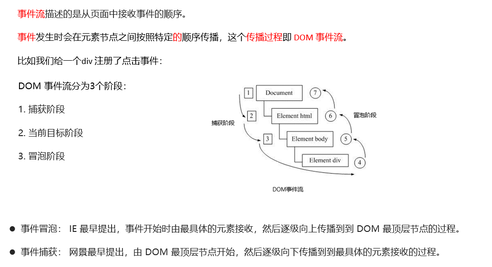

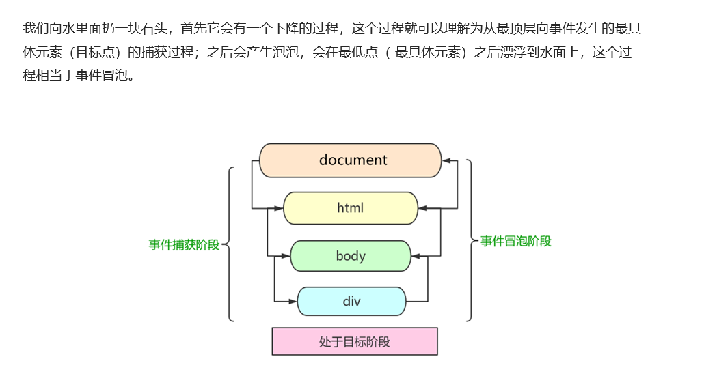

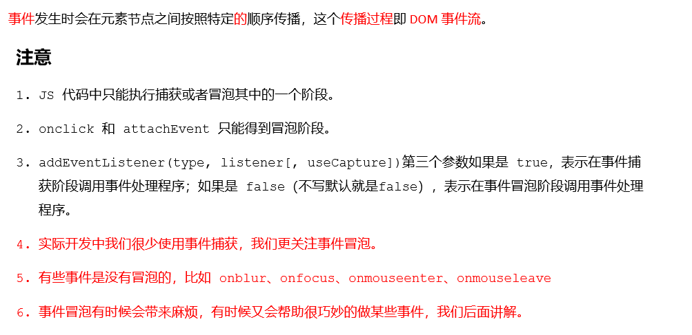

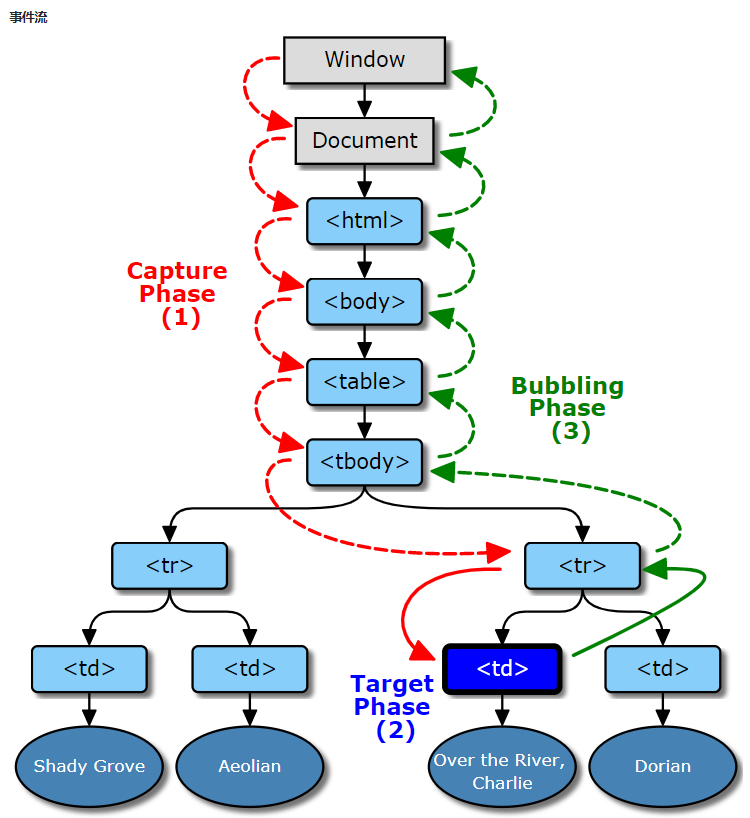

## 48.你对事件循环有了解吗？说说看

[浅谈JS的事件循环](https://www.yinzhuoei.com/index.php/archives/112/)

### 单线程模型

JS 引擎有多个线程，但引擎同时只执行一个任务，其他任务都必须在后面排队，即引擎只在一个线程上运行。这个线程称为主线程。

### 事件循环机制

JS 本身并不慢，慢的是读写外部数据，比如等待 Ajax 请求返回结果。如果等着 Ajax 返回结果出来，再往下执行，就会耗费很长的时间。所以 JS 设计了一种机制，CPU 可以不管 IO 操作，而是挂起该任务，先执行后面的任务，等到 IO 操作返回了结果，再继续执行挂起的任务。

同步任务执行完后，引擎一遍又一遍检查那些挂起来的异步任务是否满足进入主线程的条件。这种循环检查的机制，就叫做事件循环机制。

### 任务队列

JS 引擎运行时，除了一个正在运行的主线程，还提供一个或多个任务队列，里面是各种被挂起的异步任务。首先，主线程会去执行所有的同步任务，等到同步任务全部执行完，就会去看任务队列里面的异步任务，如果满足条件，那么异步任务就重新进入主线程开始执行，这时它就会变成同步任务。等到执行完，下一个异步任务再进入主线程开始执行。一旦任务队列清空，程序就结束执行。

### 同步任务和异步任务

程序里面所有的任务可以分成两类：

- 同步任务：没有被引擎挂起，在主线程上排队执行的任务。只有前一个任务执行完毕，才能执行后一个任务。
- 异步任务：被引擎挂起，不进入主线程，而进入任务队列的任务。只有引擎认为某个异步任务可以执行了，该任务才会进入主线程执行。排在异步任务后面的代码，不用等待异步任务结束会马上运行。

浏览器事件循环分为 `微任务` `宏任务`

1. 微任务 Promise
2. 宏任务 同步任务
   每一次event loop会先执行所有微任务 然后再执行宏任务
   settimeout或者ajax这些浏览器api会在其他线程进行 当完成时会将回调任务插入event loop的调用栈，当下一次event loop被执行时 就会执行到该函数

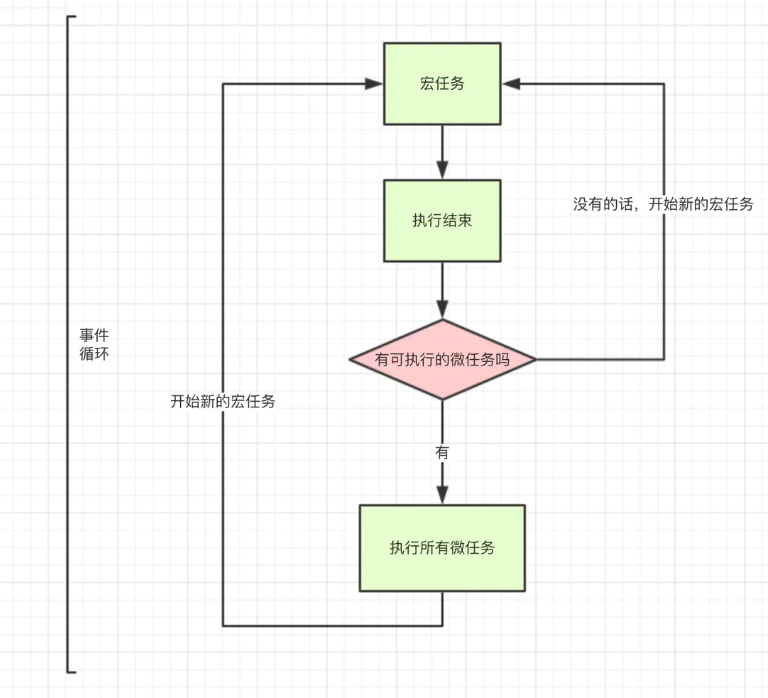

## 49.写个还剩下多少天过年的倒计时

方法1：

~~~javascript
const day =  Math.floor((new Date('2019-12-31 23:59:59:999') - new Date()) / 864e5)
// 210
~~~

方法2：西历新年好算，顺带增加了小时、周、月的维度。农历就懵了……等大佬答案

~~~javascript
const countDown = (range = "day") => {
  const nowDate = new Date();
  const currentYear = nowDate.getFullYear();
  const nextYear = new Date(currentYear + 1, 1, 1);

  const rangeBase = {
    minute: 1000 * 60,
    hour: 1000 * 60 * 60,
    day: 1000 * 60 * 60 * 24,
    week: 1000 * 60 * 60 * 24 * 7,
    month: 1000 * 60 * 60 * 24 * 30
  };

  return Math.floor(
    (nextYear.valueOf() - nowDate.valueOf()) /
      (rangeBase[range] || rangeBase.day)
  );
};

console.log(countDown("hour"));
console.log(countDown());
console.log(countDown("week"));
console.log(countDown("month"));
~~~

> 抬个杠，`new Date()`的第二个参数是monthIndex，取值是0-11

## 50.请写出一个函数求出N的阶乘（即N!）

~~~javascript
function factorial(n) {
      if (n > 1)  return n*factorial(n-1);
      return 1;
}
~~~

## ?.null是对象吗？为什么？

结论: **null不是对象**。

解释: 虽然 typeof null 会输出 object，但是这只是 JS 存在的一个悠久 **Bug**。在 JS 的最初版本中使用的是 32 位系统，为了性能考虑使用低位存储变量的类型信息，000 开头代表是对象然而 null 表示为全零，所以将它错误的判断为 object 。

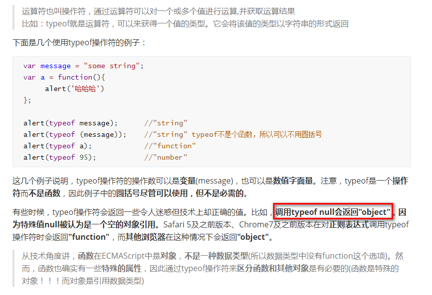

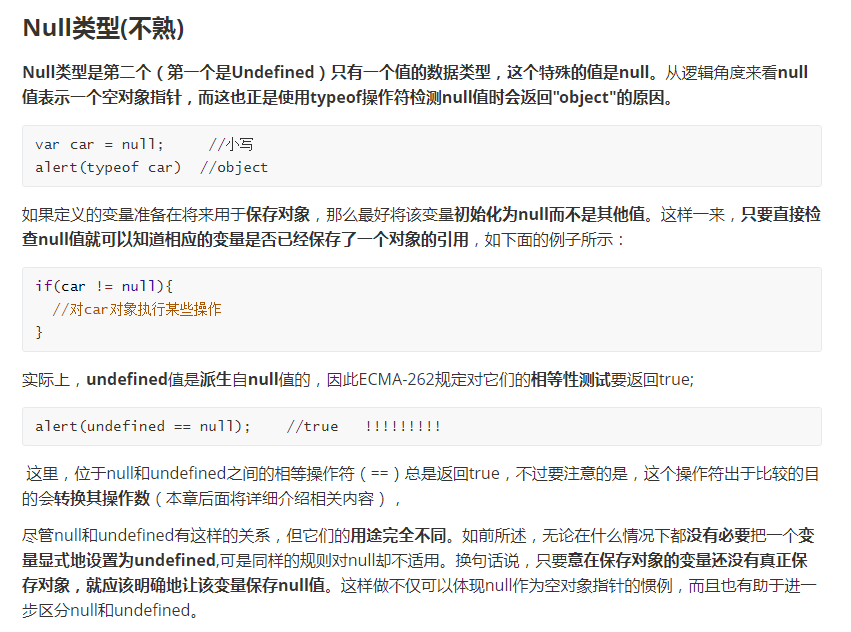

## ?typeof和instanceof的区别

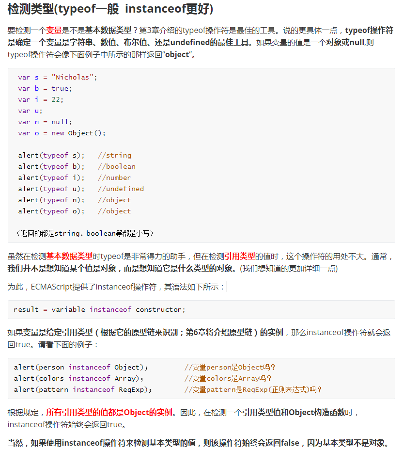

## ?.toString()、toLocaleString()、valueOf()三个方法的区别

所有对象都具有 <strong style="color:red">toLocaleString()、toString()和 valueOf()</strong>方法。其中，**调用数组的toString()方法会返回由数组中每个值的字符串形式拼接而成的一个以逗号分隔的字符串**。而**调用valueOf()返回的还是数组**。实际上，**为了创建这个字符串会调用数组每一项的toString()方法**。

- valueOf：返回数组本身
- toString()：把数组转换为字符串，并返回结果，每一项以逗号分割。
- toLocalString()：把数组转换为本地数组，并返回结果。

[toString()、toLocaleString()、valueOf()三个方法的区别](https://www.cnblogs.com/niulina/p/5699031.HTML)

[toString()和valueof()方法的区别01](https://blog.csdn.net/qq_37548296/article/details/107631786)

## ?.JavaScript用来new一个对象的过程

以下面一段代码作为示范：

~~~javascript
function Mother(lastName){
		this.lastName = lastName;
}

var son = new Mother('Da');
~~~

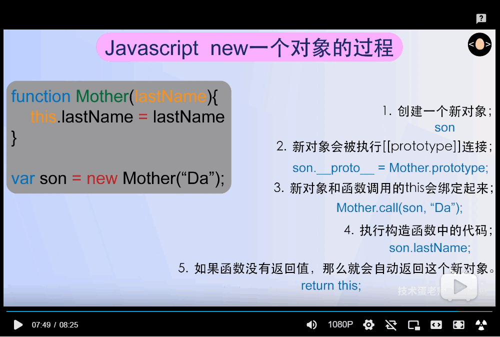

> 解释一下第5点

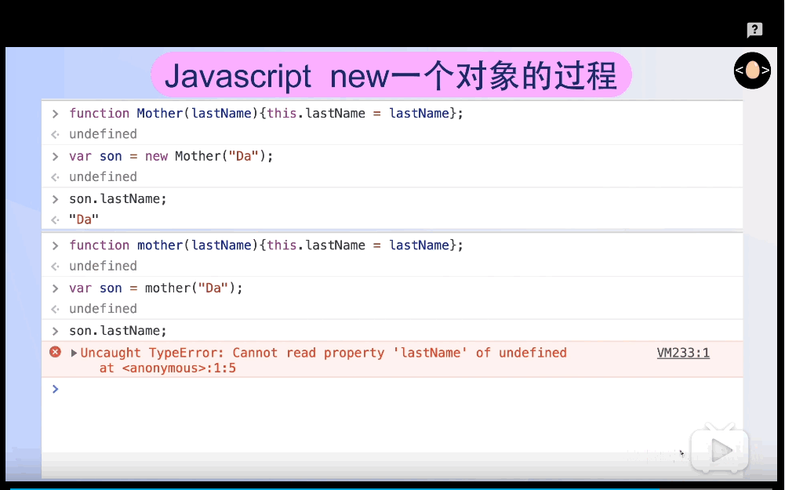

> 第2段代码加上return this后就没有问题了

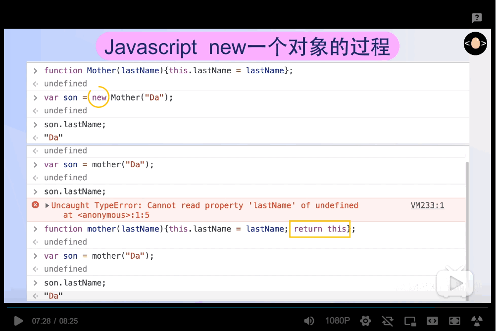

## **?JS中执行环境和作用域的关系和区别**

[浅谈JS执行环境及作用域](https://www.cnblogs.com/formercoding/p/5881304.HTML)

[JavaScript作用域、作用域链和执行环境](https://zhuanlan.zhihu.com/p/46526645)

[让你一分钟就看懂的作用域和作用域链](https://zhuanlan.zhihu.com/p/136067197)

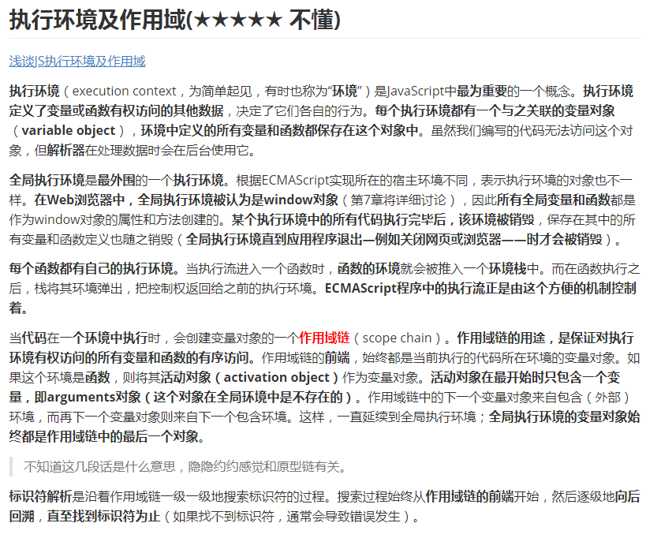

首先，相关的概念定义如下：

**1. 执行环境**： 所有 JavaScript 代码都是在一个执行环境中被执行的。执行环境是一个概念，一种机制，用来完成JavaScript运行时在作用域、生存期等方面的处理，它定义了变量或函数有权访问的其他数据（包含了外部数据），决定他们各自的行为。包括以下分类：

* 全局执行环境： 全局环境是最外围的一个执行环境，根据ECMAScript实现所在的宿主环境不同，表示执行环境的对象也不一样，在WEB中，全局执行环境被认为是window对象。

* 函数执行环境: 每个函数都有自己的执行环境。

**2. 变量对象**： 每个执行环境都有一个变量对象与之关联，执行环境中定义的所有变量及函数（只包含在当前函数内定义的函数，局部变量）都保存在这个对象中，我们编写的代码无法直接访问这个对象，但解析器在处理数据时会在后台使用它。（参考下面的作用域，变量对象就是作用域为该执行环境的函数，变量的集合对象）

**3. 作用域**： 变量或方法有访问权限的代码空间，即变量或函数起作用的区域。（作用域包括全局作用域与函数作用域，没有块级块作用域，即一个变量的作用域不可能是一个块级域，至少包括最临近的整个函数空间。）

**4. 作用域链**： 由当前环境栈中对应的变量对象组成。作用域的用途，是保证对执行环境有权访问的所有变量和函数的有序访问，作用域前端，始终是当前执行的代码所在的环境对应的变量对象，下一变量对象来自包含（外部）环境，而再下一变量对象则来自下一包含环境，一直延续到全局执行环境。

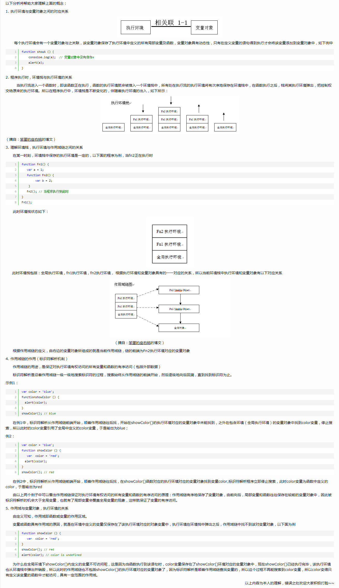

## ?什么是闭包及使用闭包应该注意的地方

[什么是闭包及使用闭包应该注意的地方](https://www.cnblogs.com/formercoding/p/5884735.HTML)

## ?节流阀技术

## ?函数中apply()、call()和bind()的作用和区别

## ?什么是模板引擎？你用过什么样的模版引擎?

artTemplate：https://aui.github.io/art-template/

# 软技能

## 1.网页应用从服务器主动推送到客户端有那些方式(不会)

[WEB应用从服务器主动推送数据到客户端有哪些方式？](https://blog.csdn.net/shuo1992/article/details/59477055/)

## 2.http都有哪些状态码

- 200 成功
- 301 重定向
- 304 (未修改) 自从上次请求后，请求的网页未修改过。 服务器返回此响应时，不会返回网页内容。
- 400 (错误请求) 服务器不理解请求的语法。
- 403 (禁止) 服务器拒绝请求。
- 404 (未找到) 服务器找不到请求的网页。
- 500 (服务器内部错误) 服务器遇到错误，无法完成请求。
- 501 (尚未实施) 服务器不具备完成请求的功能。 例如，服务器无法识别请求方法时可能会返回此代码。
- 502 (错误网关) 服务器作为网关或代理，从上游服务器收到无效响应。
- 503 (服务不可用) 服务器目前无法使用(由于超载或停机维护)。 通常，这只是暂时状态。
- 504 (网关超时) 服务器作为网关或代理，但是没有及时从上游服务器收到请求。
- 505 (HTTP 版本不受支持) 服务器不支持请求中所用的 HTTP 协议版本。

## 3.你最喜欢用哪些编辑器？喜欢它的理由是什么

VSCode。可以灵活安装不同插件，真正做到了一个编辑器，适配所有的编程语言。它和virtual stuido理念不同，vs是想把所有的都集成到一起，导致它的安装包越来越庞大，臃肿，而vscode凭借插件运行机制，即插即用，非常灵活。有点类似于编程中的面向切片的理念。

我个人比较喜欢用sublime,初入前端应该学习用的就是这个(期间还用过HBuilder，但是感觉很不好用，就没用过了)，当然了，我感觉以后进入公司，应该VSCode用得比较多吧，感觉功能也更加齐全，更加专业。

## 4.对于加班你是怎么看的

回答1：

~~~
加班就像借钱，救急不救穷——说的挺好的，哈哈
~~~

回答2：

~~~
1.首先，始终要以工作效率为首要目标，不能出现为了加班而故意降低白天的工作效率。

2.其次，在保证了白天的工作效率以后，如果确实需要加班，则可以适度的加班，但不能超过10点，不然肯定影响第二天的效率。
~~~

## 5.你在的公司有没有做代码审查（CodeReview）？如果有是怎么做的？如果没有你觉得应该怎么做才更好？

回答1：

~~~
不知道您说的是哪一种codereview
1.提交代码会把代码link发群里，全员都可以进行codereview（大佬一定会过一遍）有不合理代码直接提comment改好了再合并
2.每周一次的codereview全员参加，指定两位至三位小伙伴将本周开发的内容拿出来全部过一遍，全员现场提问现场解答，时间大概1~3h
~~~

回答2：

~~~
1.有独立的代码审查部门，定期发送邮件给相关人员，里面有本部门全部项目的代码质量统计，在代码过差时依次向上级发通知
2.依据每个组内风格，有的组在每次合并生产环境都会review
3.总的来说代码审查是好事，但如果出现咸鱼池塘以及产品流程不规范导致迭代需求过多而不合理，会造成很多困扰，自身也可能流于形式，一定要结合实际情况来看
~~~

## 6.说说你对SVN和GIT的理解和区别

1. svn是集中式的，允许单次下载单文件修改，因为对每个文件都有对应的.svn文件控制
2. git是分布式的，每次clone都是获得一个完整的代码版本，可以不依赖服务器本地独立运行项目
3. 个人感觉SVN除了集中带来的权限管理优势之外，其它被完爆，而且现在人们不缺少那点硬盘空间，来换取独立的自由

## 7.你如何看待团建的？你们团建一般都怎么实施

公司希望团建加强团队的凝聚力，大家可能在想：怎么可能能加强，吃喝玩乐，玩几个游戏就可以加强了？其实公司加强的是对公司有认可度的那群人的凝聚力，而不是那群打酱油，每天骂公司、摸鱼的那群人的凝聚力。
团建人太多了确实没太大的意义，更多就是完成公司的政治任务，对外宣传。我经常是参加团建的时候去认识公司的那些高级领导，和他们聊聊天，混个脸熟。后面我更多就带着小组的人一起出去浪，或者带着其他想和我们一起出去浪的同事出去浪，很多时候都是 AA 或者公司出一小部分，因为只要走公司账，他们经常玩不尽兴，总想着钱太少，玩的没意思，并且又有占便宜的心理，总之会玩的不舒服，所以很多时候我们都是自费出去玩。大家都是在外面打工的一群人，周末有很大一部分人想出去玩但是一个人不知道干啥，所以有一群人出去玩就会玩的比较好。

## 8.最近都流行些什么？你经常会浏览哪些网站

github、stackoverflow/segmentfault、Google、相关技术官网文档

## 9.你会手写原生js代码吗

手写确实不多了，但是原生 js 代码倒是一直在用。比如在 code pen 上写点 demo 之类的。而且如楼主所说，平时如果自己写点公共函数的话，也都是用原生上的。

我都是用脚写的——哈哈

## 10.来说说你对重绘和重排的理解，以及如何优化

浏览器加载网页时会生成DOM树和CSSOM树。

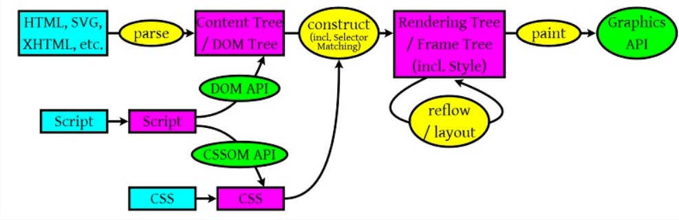

### 重绘：

当盒子的位置、大小以及其他属性，例如颜色、字体大小等都确定下来之后，浏览器便把这些原色都按照各自的特性绘制一遍，将内容呈现在页面上。重绘是指一个元素外观的改变所触发的浏览器行为，浏览器会根据元素的新属性重新绘制，使元素呈现新的外观。
触发重绘的条件：改变元素外观属性。如：color，background-color，font-size等。

### 重排(回流)：

当渲染树中的一部分(或全部)因为元素的规模尺寸，布局，隐藏等改变而需要重新构建, 这就称为回流(reflow)。每个页面至少需要一次回流，就是在页面第一次加载的时候。
重绘和重排的关系：在回流的时候，浏览器会使渲染树中受到影响的部分失效，并重新构造这部分渲染树，完成回流后，浏览器会重新绘制受影响的部分到屏幕中，该过程称为重绘。
所以，**重排必定会引发重绘，但重绘不一定会引发重排**。
　　触发重排的条件：任何页面布局和几何属性的改变都会触发重排，
比如：
　　1、页面渲染初始化；(无法避免)
　　2、添加或删除可见的DOM元素；
　　3、元素位置的改变，或者使用动画；
　　4、元素尺寸的改变——大小，外边距，边框；
　　5、浏览器窗口尺寸的变化（resize事件发生时）；
　　6、填充内容的改变，比如文本的改变或图片大小改变而引起的计算值宽度和高度的改变；
触发重排的条件：改变元素的大小 位置 等如：width、height、pading、margin、position等，　添加删除DOM操作等
**重绘重排的代价：耗时，导致浏览器卡慢。**

### 优化

1、浏览器自己的优化：浏览器会维护1个队列，把所有会引起回流、重绘的操作放入这个队列，等队列中的操作到了一定的数量或者到了一定的时间间隔，浏览器就会flush队列，进行一个批处理。这样就会让多次的回流、重绘变成一次回流重绘。
2、我们要注意的优化：我们要减少重绘和重排就是要减少对渲染树的操作，则我们可以合并多次的DOM和样式的修改。并减少对style样式的请求。
（1）直接改变元素的className
（2）display：none；先设置元素为display：none；然后进行页面布局等操作；设置完成后将元素设置为display：block；这样的话就只引发两次重绘和重排；
（3）不要经常访问浏览器的flush队列属性；如果一定要访问，可以利用缓存。将访问的值存储起来，接下来使用就不会再引发回流；
（4）使用cloneNode(true or false) 和 replaceChild 技术，引发一次回流和重绘；
（5）将需要多次重排的元素，position属性设为absolute或fixed，元素脱离了文档流，它的变化不会影响到其他元素；
（6）如果需要创建多个DOM节点，可以使用DocumentFragment创建完后一次性的加入document；

## 11.前端工程师这个职位你是怎么样理解的？聊聊它的前景

通过各种终端来向用户展示数据，或者给用户提供一些和后台的交互接口。

前景：首先，在我看来，一切和用户交互的终端都可以属于前端。并且随着现在跨端开发框架的兴起，比如Electron框架等，也使得前端的那套开发技术栈以及开发流程可以复制到桌面端来，使得前端的范畴越来越广泛。

并且，随着AR，VR技术的兴起，手机app中应用了大量的3维场景来提高用户体验，比如手机app上看房，看车，甚至是看一个城市的街景，都已经有了3D的场景，并且用户还能进行简单的操作。而这些都对前端提出了更高的要求。

## 12.说说一件或几件（介绍下除了工作外）你觉得能为你面试加分的事

我觉暂时除了有胜任工作的业务能力，hr会觉得加分的项是自觉996、自觉加班、家住的近（方便加班）、廉价（工资低）和业务能力超强（相当于全栈，可以减少公司成本，基于小公司）

PS:大厂的不清楚，最近面试遇到的情况是这种。

## 13.你经历过老板要求兼容IE吗？IE几？有什么感悟

IE6，7一年，IE8半年，IE9一直以来的最低标准。

近半年PC项目直接Chrome，移动端项目直接-WEBkit-

总结就是最近没有兼容问题，爽。

感受就是兼容确实没啥大问题，你知道了IE的兼容问题之后尽量避开和熟练掌握对应的hack方法，其实也没有特别恐怖，怎么说呢，就是解决问题吧。

稳住，我们能赢！

## 14.说说你工作中遇到过比较难的技术问题是什么？是如何解决的？

这是在面试中经常被问到的一个问题，目的是查看面试者解决问题的能力。这里不做详细的某个技术难点来讲，因为可能你认为很难得问题，在别人那里根本不是事，就讲一下回答这个问题的思路吧。
这里的问题代表某个bug或某个难搞的需求。
回答思路：

1. 问题出现的背景，比如说：‘在使用Vue开发xxx功能时中遇到xxx...’
2. 问题出现的原因在哪里，如果定位到的。比如：'在使用xx调试发现的问题出现在xx..'
3. 查找问题解决方法，比如：‘在xx论坛看到解决方法，在某某交流群内提问，询问身边(网上)的技术大佬’
4. 问题解决后达到了什么效果，比如：‘加载速度提升了约4倍，受到领导同事的一致好评..’
5. 问题解决后有什么感悟或收获，比如：‘原来使用xx方法就能xx，记录到我的bug-log中..’

> 要 star模型叙述，背景-任务-行动-结果

## 15.你对Git的branch及工作流的理解是什么

[Git 工作流程 阮一峰](http://www.ruanyifeng.com/blog/2015/12/git-workflow.HTML)

Git 作为一个源码管理系统，不可避免涉及到多人协作。

协作必须有一个规范的工作流程，让大家有效地合作，使得项目井井有条地发展下去。"工作流程"在英语里，叫做"workflow"或者"flow"，原意是水流，比喻项目像水流那样，顺畅、自然地向前流动，不会发生冲击、对撞、甚至漩涡。

## 16.你为什么离职呢

钱少事多离家远，主要还是没发展。照着说就行，但是要记住一点就是千万不要说前公司的坏话。

## 17.在浏览器中输入url到页面显示出来的过程发生了什么(重复)

[HTTP集锦系列之——输入url到页面渲染发生了什么?]([https://blog.yyge.top/blog/2019/03/18/HTTP%E9%9B%86%E9%94%A6%E7%B3%BB%E5%88%97%E4%B9%8B%E2%80%94%E2%80%94%E8%BE%93%E5%85%A5url%E5%88%B0%E9%A1%B5%E9%9D%A2%E6%B8%B2%E6%9F%93%E5%8F%91%E7%94%9F%E4%BA%86%E4%BB%80%E4%B9%88/](https://blog.yyge.top/blog/2019/03/18/HTTP集锦系列之——输入url到页面渲染发生了什么/))

[DNS原理及其解析过程【精彩剖析】](https://blog.51cto.com/369369/812889)

## 18.在工作中能让你最有成就感的是什么？并介绍下你最得意的作品吧

* 能够探索到原理的问题，能够在生产环境运用，产生比较好绩效。 没有真正遇到过。
* 目前的工作主要是基础库维护和编写、UI组件制作、一个基于Vue的框架的维护。主要偏向基础设施而非业务编写。使我最有成就感的是：这些基础设施被同事使用并称赞的时候。就像自己的儿子考上了清华北大一样的。

## 19.解释下CRLF是什么

[CRLF -- Carriage-Return Line-Feed 回车换行](https://blog.csdn.net/leopardaa521/article/details/6657943)

CRLF 是carriagereturnlinefeed的缩写。中文意思是回车换行。

CR和LF是在计算机终端还是电传打印机的时候遗留下来的东西。电传打字机就像普通打字机一样工作。在每一行的末端，CR命令让打印头回到左边。LF命令让纸前进一行。虽然使用卷纸的终端时代已经过去了，但是，CR和LF命令依然存在，许多应用程序和网络协议仍使用这些命令作为分隔符。

 CR用符号`\r`表示, 十进制ASCII代码是13, 十六进制代码为0x0D; 
 LF用符号`\n`符号表示, ASCII代码是10, 十六制为0x0A。

## 20.对于有压力时，你是怎么抗压的

现代人有点压力的正常的，我觉得抗压也是每一个成年人都要掌握的。
或者说排解压力比较准确吧，每个人都不一样，这里我就分享自己的解压方式吧。
解压方式：

1. 听歌，压力大的时候在网易云上听会自己喜欢的歌。
2. 运动，如果有时间就去运动吧，有时间就去打球、跑步，运动完之后一天的压力和疲惫都会减轻了很多。
3. 找朋友倾诉，记住要找知心朋友，尽量不要找家人，不要让家人担心。

**其实我觉得最重要的一点是：提高自己的能力，让那些对你有压力的事情变得简单，你自然就不会有压力的。**

## 21.你在上一家公司工作流程是怎么样的?如何与其他人协作的?是怎样跨部门合作的?

### 前端开发工作流程

#### 项目描述

公司开发的项目是类似钉钉的TO B企业管理软件，后端是PHP，只负责提供接口API等，前端采用单页面模式开发，不做服务端渲染，其中产品有小程序，公众号，PC后台管理，使用的技术主要有：vue element taro

#### 产品或功能研讨阶段

每当开发一个新功能或新产品，首先产品经理会开一个简单的交底会议，讨论功能模块的可行性及开发难度，开发周期等。

#### UI设计阶段

这个阶段一般没开发什么事

#### 开发阶段

- 文档
  比较重要的两样东西“UI设计稿” 和 “产品说明文档” 我们统一放在[蓝湖](https://lanhuapp.com/)
- 代码托管
  代码直接托管在[gitlab](https://gitlab.com/)
- 协作开发
  多人协作的话则会采用 gitflow 工作流，一般如果是新项目则会组件拆分，优先开始组件开发。

#### 软件测试阶段

开发完成后将代码上传到svn仓库（其实当FTP用了），由运维人员进行部署及版本管理。
这里补充说明下后端是PHP，在上传代码的时候是和PHP代码一起给运维的，虽然不同仓库。
BUG管理采用[TAPD](https://www.tapd.cn/)

#### 软件发布阶段

这也是由运维直接管控，除非特殊环境问题需要协同解决。

## 22.你对全栈工程师的理解是什么

首先，我对于全栈工程师的要求很高。

1. 独立完成页面
2. 独立完成接口
3. 超强学习能力

说说，目前我看到的全栈工程师

1. 会写页面
2. 会写接口
3. 广度有，深度没有

最后我想说，会点后台其实挺好的，对于开发理解工程项目是有帮助的。尤其是**定位问题的时候**

## 23.你了解什么是技术债务吗

### 1.什么是技术债？

> 代码写好就提交，意味着欠债的开始。稍微欠点儿技术债的确可以加速开发速度，但前提是事后及时重写代码。如果只借不还，后果很危险。在不准确的代码上所花的每一分钟，都算是技术债的应付利息。不稳固、脆弱的代码实现所引发的债务负担，会使整个工程组织陷入裹足不前的艰难境地！

### 2.技术债的类型

不合适的设计，比如过度设计、业务发现大变化、抽象能力不足等
缺陷，不说了八阿哥...
手工测试过多
集成和版本管理不善
缺乏平台经验
...

### 3.技术债的后果

爆发点不可逾期，哪天来个p0，就可以回家了
交付时间延长
缺陷数量可观
开发和支持成本持续上升
产品萎缩
可预测性较低
表现越来越差
挫败感四处弥漫
客户满意度降低
...

### 4.技术债的起源

如期完工的压力，不说了，每周996都开发不完的任务
试图以错误的方式提高效率，
试图减少测试提高效率，比如单元测试、集成测试、系统测试、白盒测试、黑盒测试不足
债累债
人员技术水平不足
业务不熟悉，设计错误
...

### 5.技术债必须加以管理

让技术债在业务层面可见
让技术债在技术层面可见
统计技术债所偿还的利息，NO DATA NO BB
向团队成员普及技术债的危害
...

### 6.偿还技术债

并非所有的技术债都应该偿还，比如：行将就木的产品、一次性原型、短命产品
应用有债就还原则
分期偿还技术债
先偿还高息技术债
一边做有客户价值的工作，一边偿还技术债

### 7.手段

1.熟悉系统的业务
2.熟悉系统的代码
3.挖掘系统存在的技术债
4.找到技术债后，做汇总，做评估，做测试
5.向上级反馈技术债，争取资源去消灭技术债
6.上线新方案，统计新方案与旧方案的对比，使得个人的价值得到更多的认可
7.一边做日常工作，一边做技术债的工作，千万不能忘了日常的工作重心陷入天天抱怨系统的技术债中

### 8.解决的技术债越多，收获越多

在工作中，认识了很多风格迥异的同事，有热衷技术的技术宅，有打酱油的A员工，有热衷架构的大牛，从个人的实践来看，解决的技术债越多，个人的架构能力、抽象能力、发现问题的能力越强，自己也从技术债中受益良多...

## 24.谈一谈你知道的前端性能优化方案有哪些

[前端优化-雅虎军规35条](<https://github.com/yingnian/Yahoo-35>)

这个优化的范围挺大，但是总归可以分为服务端优化和客户端优化。

### 整理如下

### 客户端优化

* 减少http请求次数：CSS Sprites, JS、CSS源码压缩、图片大小控制合适；网页Gzip，CDN托管，data缓存 ，图片服务器。
* 使用CSS雪碧图（CSS Sprites）CSS Sprites一句话：将多个图片合并到一张单独的图片，这样就大大减少了页面中图片的HTTP请求。
* 减少DOM操作次数，优化javascript性能。
* 少用全局变量、减少DOM操作、缓存DOM节点查找的结果。减少IO读取操作。
* 延迟加载 | 延迟渲染
* 图片预加载，将样式表放在顶部，将脚本放在底部 加上时间戳。
* 避免在页面的主体布局中使用table，table要等其中的内容完全下载之后才会显示出来，显示比div+css布局慢。

### 服务端优化

* 尽量减少响应的体积，比如用 gzip 压缩，优化图片字节数，压缩 css 和 js；或加快文件读取速度，优化服务端的缓存策略。
* 客户端优化 dom、css 和 js 的代码和加载顺序；或进行服务器端渲染，减轻客户端渲染的压力。
* 优化网络路由，比如增加 CDN 缓存；或增加并发处理能力，比如服务端设置多个域名，客户端使用多个域名同时请求资源，增加并发量。

### 最后

　　对普通的网站有一个统一的思路，就是尽量向前端优化、减少数据库操作、减少磁盘IO。向前端优化指的是，在不影响功能和体验的情况下，能在浏览器执行的不要在服务端执行，能在缓存服务器上直接返回的不要到应用服务器，程序能直接取得的结果不要到外部取得，本机内能取得的数据不要到远程取，内存能取到的不要到磁盘取，缓存中有的不要去数据库查询。
　　减少数据库操作指减少更新次数、缓存结果减少查询次数、将数据库执行的操作尽可能的让你的程序完成（例如join查询），减少磁盘IO指尽量不使用文件系统作为缓存、减少读写文件次数等。程序优化永远要优化慢的部分，换语言是无法“优化”的。

涉及的知识点太多，从客户端浏览器、渲染机制、缓存、 网络请求、代码压缩合并、图片格式、服务器代理、数据库的查询.....
暂时只能想到这么多，觉得自己答得并不是很好，希望有大佬回答一下这个问题。

## 25.对于前端安全，你了解多少？说说你对XSS和CSRF的理解

[XSS攻击](<https://baike.baidu.com/item/XSS%E6%94%BB%E5%87%BB/954065?fr=aladdin>)

[CSRF攻击](<https://baike.baidu.com/item/%E8%B7%A8%E7%AB%99%E8%AF%B7%E6%B1%82%E4%BC%AA%E9%80%A0?fromtitle=CSRF&fromid=2735433>)

* XSS攻击

  人们经常将**跨站脚本攻击**（Cross Site Scripting）缩写为CSS，但这会与层叠样式表（Cascading Style Sheets，CSS）的缩写混淆。因此，有人将跨站脚本攻击缩写为XSS。

   XSS攻击通常指的是通过利用网页开发时留下的漏洞，通过巧妙的方法注入恶意指令代码到网页，使用户加载并执行攻击者恶意制造的网页程序。这些恶意网页程序通常是JavaScript，但实际上也可以包括Java、 VBScript、ActiveX、 Flash 或者甚至是普通的HTML。攻击成功后，攻击者可能得到包括但不限于更高的权限（如执行一些操作）、私密网页内容、会话和cookie等各种内容。

* CSRF攻击

  **跨站请求伪造**（英语：Cross-site request forgery），也被称为 **one-click attack** 或者 **session riding**，通常缩写为 **CSRF** 或者 **XSRF**， 是一种挟制用户在当前已登录的WEB应用程序上执行非本意的操作的攻击方法。跟跨网站脚本（XSS）相比，**XSS 利用的是用户对指定网站的信任，CSRF 利用的是网站对用户网页浏览器的信任**。

  跨站请求攻击，简单地说，是攻击者通过一些技术手段欺骗用户的浏览器去访问一个自己曾经认证过的网站并运行一些操作（如发邮件，发消息，甚至财产操作如转账和购买商品）。由于浏览器曾经认证过，所以被访问的网站会认为是真正的用户操作而去运行。这利用了WEB中用户身份验证的一个漏洞：**简单的身份验证只能保证请求发自某个用户的浏览器，却不能保证请求本身是用户自愿发出的**。

## 26.如果让你快速使用一门你不熟悉的新技术，你该怎么办

暂时就假设因为需求的原因让我快速掌握一门**新的语言或者新的框架**，首先我觉得一个搞前端的，老板最多让学一下流行的框架..其他语言(java python)..服务器..数据库等等之类的相关的知识点，肯定不会让我去学习怎么炒菜吧？？如果真的是那样的话 那我马上就可以拍桌子去辞职了，而且我觉得学习是一件很快乐的事情，多学一点东西就多一门生存技能，老板给我钱还让我学习 应该开心才对哈哈，自己也查了下相关资料，总结出几点：

* 这门技术(编程语言)解决了什么问题
* 这门技术和你现有的知识何共同之处
* 寻找学习资料，开始学习（网上学习资料太多了）。

在此之前，你应该时刻关注自己的基础知识比如：**计算机基础、网络知识、数据结构算法**，因为不管你学习任何新的知识（仅限WEB开发），这些都是需要掌握的，并且是越牢固越好。
就拿前端来说吧，新的框架层出不穷，但是归根结底也离不开**HTML css javascript**，与其追求那些框架，不如塌下心来好好学习基础，甚至学到一定程度，自己开发一个框架都不是问题。

## 27.你知道网页三剑客指的是什么吗？你有用过Dreamwear吗

我就不查资料了, 盲答一下:

Dreamweaver, Firework, Flash。

以上三个软件我都用过. 我12年出来工作, 那时候什么都玩。

> 当年很火的三剑客，现在很少使用了。

## 28.公钥加密和私钥加密是什么

[理解公钥与私钥](<https://zhuanlan.zhihu.com/p/113522792>)

**私钥加密**，也称对称加密，使用一个密钥对内容进行加密和解密，加密算法可以是公开的，但密钥必须保密，常见的私钥加密算法有：DES、AES、RC5。

**公钥加密**，也称非对称加密，使用两个密钥，一个公开密钥用来加密，另一个私有密钥用来解密，基于其特性，可以用作**数字签名**的功能（如 HTTPS），常见的公钥加密算法有：RSA。

* 公钥和私钥成对出现
* 公开的密钥叫公钥，只有自己知道的叫私钥
* 用公钥加密的数据只有对应的私钥可以解密
* 用私钥加密的数据只有对应的公钥可以解密
* 如果可以用公钥解密，则必然是对应的私钥加的密
* 如果可以用私钥解密，则必然是对应的公钥加的密

公钥和私钥是相对的，两者本身并没有规定哪一个必须是公钥或私钥。

要实现数据的安全传输，当然就要对数据进行加密了。

如果使用对称加密算法，加解密使用同一个密钥，除了自己保存外，对方也要知道这个密钥，才能对数据进行解密。如果你把密钥也一起传过去，就存在密码泄漏的可能。所以我们使用**非对称算法**，过程如下：

1. 首先 接收方 生成一对密钥，即私钥和公钥；
2. 然后，接收方 将公钥发送给 发送方；
3. 发送方用收到的公钥对数据加密，再发送给接收方；
4. 接收方收到数据后，使用自己的私钥解密。

由于在非对称算法中，公钥加密的数据必须用对应的私钥才能解密，而私钥又只有接收方自己知道，这样就保证了数据传输的安全性。


  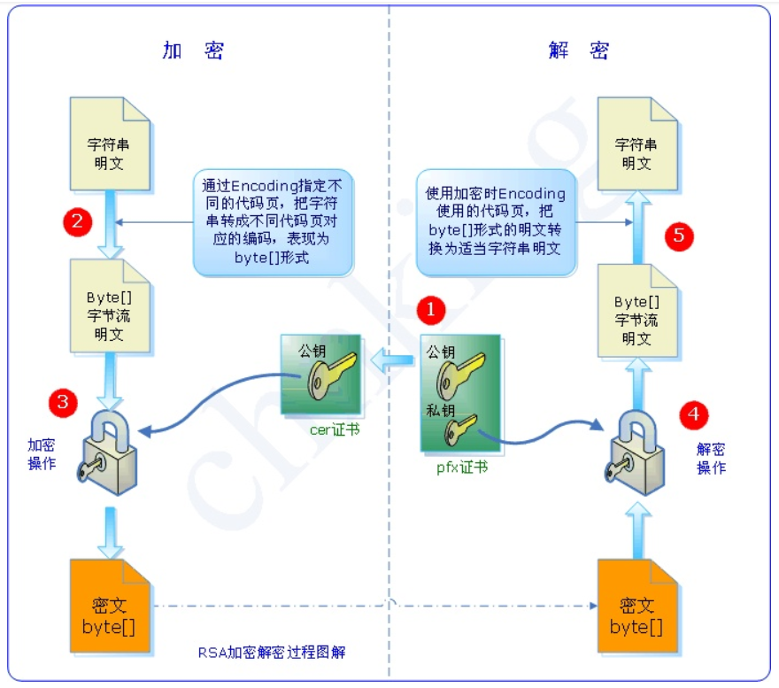

## 29.你有自己的博客吗？平时自己有写一些技术文章吗

平时会写一些技术文章，主要用来记录平时遇到的问题，和进行知识体系的梳理总结。
最后还会写一些总结性的思考，比如每年写个学习总结，自己对职业规划的思考等。

平时有积累，到需要输出的时候就很快了，记得到现在的公司，试用期让我做一次分享，好在之前对移动端开发有过系统的整理，PPT完成很快，思路超级清晰，最后分享也得到了大家的好评。

## 30.说说你对Node.js的理解及用途

[Node.js是用来做什么的？](https://www.zhihu.com/question/33578075)

浏览器给网站发请求的过程一直没怎么变过。当浏览器给网站发了请求。服务器收到了请求，然后开始搜寻被请求的资源。如果有需要，服务器还会查询一下数据库，最后把响应结果传回浏览器。不过，在传统的WEB服务器中（比如Apache），每一个请求都会让服务器创建一个新的进程来处理这个请求。

后来有了Ajax。有了Ajax，我们就不用每次都请求一个完整的新页面了，取而代之的是，每次只请求需要的部分页面信息就可以了。这显然是一个进步。但是比如你要建一个FriendFeed这样的社交网站（类似人人网那样的刷朋友新鲜事的网站），你的好友会随时的推送新的状态，然后你的新鲜事会实时自动刷新。要达成这个需求，我们需要让用户一直与服务器保持一个有效连接。目前最简单的实现方法，就是让用户和服务器之间保持长轮询（long polling）。

HTTP请求不是持续的连接，你请求一次，服务器响应一次，然后就完了。长轮训是一种利用HTTP模拟持续连接的技巧。具体来说，只要页面载入了，不管你需不需要服务器给你响应信息，你都会给服务器发一个Ajax请求。这个请求不同于一般的Ajax请求，服务器不会直接给你返回信息，而是它要等着，直到服务器觉得该给你发信息了，它才会响应。比如，你的好友发了一条新鲜事，服务器就会把这个新鲜事当做响应发给你的浏览器，然后你的浏览器就刷新页面了。浏览器收到响应刷新完之后，再发送一条新的请求给服务器，这个请求依然不会立即被响应。于是就开始重复以上步骤。利用这个方法，可以让浏览器始终保持等待响应的状态。虽然以上过程依然只有非持续的Http参与，但是我们模拟出了一个看似持续的连接状态

我们再看传统的服务器（比如Apache）。每次一个新用户连到你的网站上，你的服务器就得开一个连接。每个连接都需要占一个进程，这些进程大部分时间都是闲着的（比如等着你好友发新鲜事，等好友发完才给用户响应信息。或者等着数据库返回查询结果什么的）。虽然这些进程闲着，但是照样占用内存。这意味着，如果用户连接数的增长到一定规模，你服务器没准就要耗光内存直接瘫了。

这种情况怎么解决？解决方法就是刚才上边说的：**非阻塞**和**事件驱动**。这些概念在我们谈的这个情景里面其实没那么难理解。你把非阻塞的服务器想象成一个loop循环，这个loop会一直跑下去。一个新请求来了，这个loop就接了这个请求，把这个请求传给其他的进程（比如传给一个搞数据库查询的进程），然后响应一个回调（callback）。完事了这loop就接着跑，接其他的请求。这样下来。服务器就不会像之前那样傻等着数据库返回结果了。

如果数据库把结果返回来了，loop就把结果传回用户的浏览器，接着继续跑。在这种方式下，你的服务器的进程就不会闲着等着。从而在理论上说，同一时刻的数据库查询数量，以及用户的请求数量就没有限制了。服务器只在用户那边有事件发生的时候才响应，这就是**事件驱动。**

FriendFeed是用基于Python的**非阻塞**框架Tornado (知乎也用了这个框架) 来实现上面说的新鲜事功能的。不过，Node.js就比前者更妙了。Node.js的应用是通过javascript开发的，然后直接在Google的变态V8引擎上跑。用了Node.js，你就不用担心用户端的请求会在服务器里跑了一段能够造成阻塞的代码了。因为javascript本身就是事件驱动的脚本语言。你回想一下，在给前端写javascript的时候，更多时候你都是在搞事件处理和回调函数。javascript本身就是给事件处理量身定制的语言。

Nod.js还是处于初期阶段。如果你想开发一个基于Node.js的应用，你应该会需要写一些很底层代码。但是下一代浏览器很快就要采用WEBSocket技术了，从而长轮询也会消失。在WEB开发里，Node.js这种类型的技术只会变得越来越重要。

## 31.你现在在团队是什么角色，有起到了什么显著的作用吗

前端小工，偏UI开发，交互体验。显著作用就是拉低大家水平。

## 32.最近在学什么？能谈谈你未来3，5年给自己的规划吗

最近学前端基础，三年做到前端自信，可以cover各种业务需求。。。等
基本上这道题还是考察面试者对自己的认识及规划，面试官也想借机会看看你的规划与公司的发展能不能同步以及有没有足够的空间给到你，总之，公司希望你是一个有目标的人，并且这个目标最好能帮助公司更好的发展。

## 33.说说你对http、https、http2的理解 

* http: 重复拨号的单对单电话
* https: 安全点重复拨号的单对单电话
* http2: 不需要重复拨号的单对多电话

## 34.从你的角度上来讲，你觉得如何管理前端团队

1.业务职责清晰（团队和个人）
2.流程规范有序（开发流程和上下游合作流程）
3.团队技术氛围好，能发现每个人的闪光点，帮助其找到在团队中的价值和定位
4.活跃和有归属感的团队氛围

## 35.说说你对本项目的看法及建议

提升很多，初级前端突破基础知识的瓶颈，应该能顺利进入到中级前端的水平，这个项目确实nice，但是希望能多一些分类，比如说WEBpack要快快上噢。

## 36.如果HR说要做背调，还要你给出近三个月的银行流水，你该怎么办？

确实都有，遇到过一次面试让提供流水，最后也是面试通过了，但是薪资不满意，基本上是看着上一家薪资调整的。不管怎么样，要对自己有比较清楚的认识，知道自己的定位，每次跳槽要达到自己预期才好。

## 37.最近996一词很火，谈谈你对996的看法

其实, 我不介意996, 我介意的是, 不必要的996, 无偿的996, 耍流氓的996, 强迫式的996。

## 38.你有遇到过字体侵权的事吗？如何解决

我关注的一个up主(角角)遇到过这个字体侵权事件，他拍的视频的字幕用的字体侵权了。因为这个up主粉丝很多（百万以上），于是设计师就把他告了发了律师函，最终支付了大约十万的版权费达成和解。

现在是知识付费时代，包括音乐、电影、书籍、软件等慢慢也开始收费，设计师的原创字体要收费也是合情合理，对好的设计我赞成收费。

当然免费的字体也很多，可以选择符合自己整体风格的免费字体，只是在使用之前看清楚各方面条款和协议，达成共识就行。

## 39.说说你对http、https的理解(重复)

(和第33题重复)

1. 从是否需要证书方面来看：https协议需要到ca申请证书，一般免费证书很少，需要交费。
2. 从是否安全方面来看：http是超文本传输协议，信息是明文传输（无法加密），https则是具有安全性的ssl加密传输协议。
3. 从写法、端口号来看：http和https使用的是完全不同的连接方式，用的端口也不一样，前者是80，后者是443。
4. 从OSI网络模型中来看：http的连接很简单，是无状态的(HTTP工作于应用层)；https协议是由SSL+HTTP协议构建的可进行加密传输、身份认证的网络协议、比http协议安全(HTTPS的安全传输机制工作在传输层)

