(注1：面试题目来源依旧是[前端面试每日3+1](<https://github.com/haizlin/fe-intervIEw/issues/198>)，因为我是每50题就另外写一篇博文，所以本文第一题算是第总题库的第51题)

# HTML

## 1.Form表单是怎么上传文件的？你了解它的原理吗

[你真的知道网页上传文件背后的原理吗？](<https://juejin.im/entry/6844903687458914318>)

[表单，FormData 对象](<https://wangdoc.com/javascript/bom/form.html#%E6%96%87%E4%BB%B6%E4%B8%8A%E4%BC%A0>)

简单来说就是把文件转化成字节流，然后使用http进行传输，后端接受后在把二进制转化成原先的文件格式。

### 表单概述

表单（`<form>`）用来收集用户提交的数据，发送到服务器。比如，用户提交用户名和密码，让服务器验证，就要通过表单。表单提供多种控件，让开发者使用，具体的控件种类和用法请参考 HTML 语言的教程。本章主要介绍 JavaScript 与表单的交互。

~~~html
<form action="/handling-page" method="post">
  <div>
    <label for="name">用户名：</label>
    <input type="text" id="name" name="user_name" />
  </div>
  <div>
    <label for="passwd">密码：</label>
    <input type="password" id="passwd" name="user_passwd" />
  </div>
  <div>
    <input type="submit" id="submit" name="submit_button" value="提交" />
  </div>
</form>
~~~

上面代码就是一个简单的表单，包含三个控件：用户名输入框、密码输入框和提交按钮。

用户点击“提交”按钮，每一个控件都会生成一个键值对，键名是控件的`name`属性，键值是控件的`value`属性，键名和键值之间由等号连接。比如，用户名输入框的`name`属性是`user_name`，`value`属性是用户输入的值，假定是“张三”，提交到服务器的时候，就会生成一个键值对`user_name=张三`。

所有的键值对都会提交到服务器。但是，提交的数据格式跟`<form>`元素的`method`属性有关。该属性指定了提交数据的 HTTP 方法。如果是 GET 方法，所有键值对会以 URL 的查询字符串形式，提交到服务器，比如`/handling-page?user_name=张三&user_passwd=123&submit_button=提交`。下面就是 GET 请求的 HTTP 头信息。

~~~http
GET /handling-page?user_name=张三&user_passwd=123&submit_button=提交
Host: example.com
~~~

如果是 POST 方法，所有键值对会连接成一行，作为 HTTP 请求的数据体发送到服务器，比如`user_name=张三&user_passwd=123&submit_button=提交`。下面就是 POST 请求的头信息。

~~~http
POST /handling-page HTTP/1.1
Host: example.com
Content-Type: application/x-www-form-urlencoded
Content-Length: 74

user_name=张三&user_passwd=123&submit_button=提交
~~~

注意，实际提交的时候，只要键值不是 URL 的合法字符（比如汉字“张三”和“提交”），浏览器会自动对其进行编码。

点击`submit`控件，就可以提交表单。

~~~html
<form>
  <input type="submit" value="提交">
</form>
~~~

上面表单就包含一个`submit`控件，点击这个控件，浏览器就会把表单数据向服务器提交。

注意，表单里面的`<button>`元素如果没有用`type`属性指定类型，那么默认就是`submit`控件。

```html
<form>
  <button>提交</button>
</form>
```

上面表单的`<button>`元素，点击以后也会提交表单。

（未完，下文略，详情请访问链接）

## 2.From表单提交时为什么会刷新页面？怎么预防刷新

因为早期网页交互模型只能是浏览器提交数据给服务器，服务器做出响应重新返回一个页面，浏览器加载这个页面进行显示。早期前端没有编程式发送网络请求的 API，更没有前端路由管理的概念，所以表单提交跳转页面是广泛接受的方案。

不想刷新可以使用 JS 拦截 form 的 onsubmit 事件，阻止掉浏览器的默认行为，然后用 ajax/fetch 和后台交互。另一个偏方是使用 iframe 作为 form 的 target，不过 JS 处理方面不如让浏览器别管自己全手动发请求来得简单。

## 3.Web Worker有用过吗？能帮我们解决哪些问题

[Web Worker 使用教程](<http://www.ruanyifeng.com/blog/2018/07/web-worker.html>)

提供协程能力，如果有一个比较密集的计算任务，可以放到另一个进程中处理，等处理好了再把结果传回主程，这样主要进程就不会阻塞，页面可以正常渲染和响应。

JavaScript 语言采用的是单线程模型，也就是说，所有任务只能在一个线程上完成，一次只能做一件事。前面的任务没做完，后面的任务只能等着。随着电脑计算能力的增强，尤其是多核 CPU 的出现，单线程带来很大的不便，无法充分发挥计算机的计算能力。

Web Worker 的作用，就是为 JavaScript 创造多线程环境，允许主线程创建 Worker 线程，将一些任务分配给后者运行。在主线程运行的同时，Worker 线程在后台运行，两者互不干扰。等到 Worker 线程完成计算任务，再把结果返回给主线程。这样的好处是，一些计算密集型或高延迟的任务，被 Worker 线程负担了，主线程（通常负责 UI 交互）就会很流畅，不会被阻塞或拖慢。

Worker 线程一旦新建成功，就会始终运行，不会被主线程上的活动（比如用户点击按钮、提交表单）打断。这样有利于随时响应主线程的通信。但是，这也造成了 Worker 比较耗费资源，不应该过度使用，而且一旦使用完毕，就应该关闭。

Web Worker 有以下几个使用注意点。

（1）**同源限制**

分配给 Worker 线程运行的脚本文件，必须与主线程的脚本文件同源。

（2）**DOM 限制**

Worker 线程所在的全局对象，与主线程不一样，无法读取主线程所在网页的 DOM 对象，也无法使用`document`、`window`、`parent`这些对象。但是，Worker 线程可以`navigator`对象和`location`对象。

（3）**通信联系**

Worker 线程和主线程不在同一个上下文环境，它们不能直接通信，必须通过消息完成。

（4）**脚本限制**

Worker 线程不能执行`alert()`方法和`confirm()`方法，但可以使用 XMLHttpRequest 对象发出 AJAX 请求。

（5）**文件限制**

Worker 线程无法读取本地文件，即不能打开本机的文件系统（`file://`），它所加载的脚本，必须来自网络。

## 4.你有了解HTML5的地理定位吗？怎么使用

[HTML5 Geolocation（地理定位）](https://www.runoob.com/html/html5-geolocation.html)

HTML5 Geolocation API（地理定位）用于定位用户的位置。

鉴于该特性可能侵犯用户的隐私，除非用户同意，否则用户位置信息是不可用的。

> Geolocation（地理定位）对于拥有 GPS 的设备，比如 iPhone，地理定位更加精确。
>
> IE9+浏览器才支持地理定位。

~~~javascript
var x=document.getElementById("demo");
function getLocation()
{
    if (navigator.geolocation)
    {
        navigator.geolocation.getCurrentPosition(showPosition);
    }
    else
    {
        x.innerHTML="该浏览器不支持获取地理位置。";
    }
}
 
function showPosition(position)
{
    x.innerHTML="纬度: " + position.coords.latitude + 
    "<br>经度: " + position.coords.longitude;    
}
~~~

实例解析:

- 检测是否支持地理定位
- 如果支持，则运行 getCurrentPosition() 方法。如果不支持，则向用户显示一段消息。
- 如果 getCurrentPosition() 运行成功，则向参数showPosition中规定的函数返回一个 coordinates 对象
- showPosition() 函数获得并显示经度和纬度

## 5.HTML5中新添加的表单属性有哪些

[HTML5 表单属性](https://www.w3school.com.cn/html5/html_5_form_attributes.asp)

### 新的 form 属性

- autocomplete
- novalidate

### 新的 input 属性

- autocomplete
- autofocus
- form
- form overrides (formaction, formenctype, formmethod, formnovalidate, formtarget)
- height 和 width
- list
- min, max 和 step
- multiple
- pattern (regexp)
- placeholder
- required

## 6.渐进式渲染是什么

[渐进式渲染]([https://sonya1.github.io/2018/07/11/%E6%B8%90%E8%BF%9B%E5%BC%8F%E6%B8%B2%E6%9F%93.html](https://sonya1.github.io/2018/07/11/渐进式渲染.html))

指浏览器不用等待所有页面资源都渲染好之后再呈现给用户看，而是边下载边渲染，所以用户打开一个网页的时候往往不能第一时间看到所有的内容，但是能够看到一个大概的样子，后续的内容浏览器会慢慢补上形成一个完整的页面。

其实就是为了解决js加载时间的问题。

渐进式渲染是用来提高网页性能，以尽快呈现页面的技术.
比如：图片懒加载、确定显示内容的优先级等。

## 7.你了解HTML5的download属性吗

[了解HTML/HTML5中的download属性](https://www.zhangxinxu.com/wordpress/2016/04/know-about-html-download-attribute/)

download 属性规定被下载的超链接目标，该属性也可以设置一个值来规定下载文件的名称。兼容性各异，Chrome和Firefox仅支持加载同源链接。

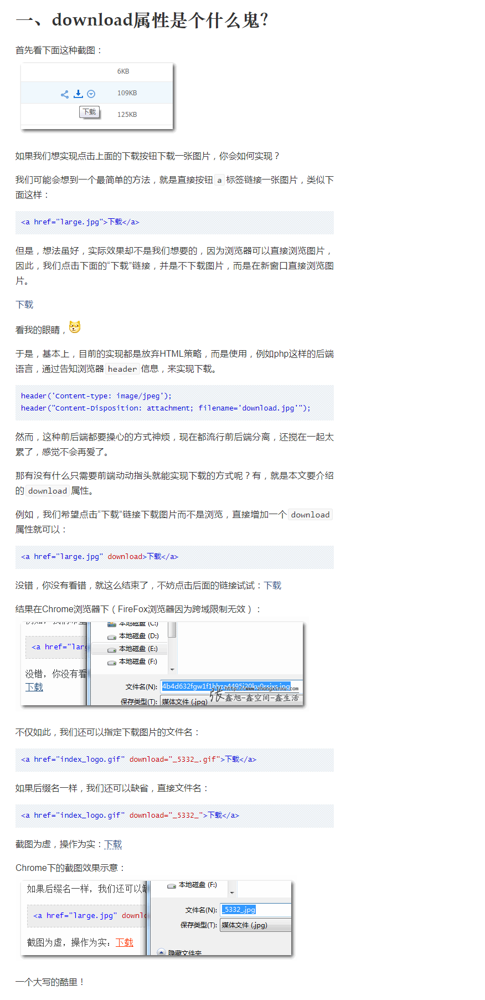

## 8. HTML5相对于HTML4有哪些优势

更简洁-文档声明
更语义-语义标签
功能更强-各种表单属性及自定义属性等

### web应用更容易开发

- HTML5的规范都是基于用户优先准则来编写的，贴合开发者的编码习惯，语法限制不严，代码也更为精简，更易于阅读。

### 功能强大，用户体验佳

- HTML5视频播放起来更流畅清晰，也更省电；HTML5游戏小巧流畅，画面质量高，操作易上手；HTML5广告摆脱了以前网页广告的悬浮、滚动和弹出，广告更容易让用户接受。

### 搜索引擎友好，网站流量大

- HTML5的代码是贴合用户有明确释义的，不仅对开发者有利，搜索引擎也更容易识别到网页上的内容，让网站获得更多流量。

### 摆脱平台依赖，兼容性好

- 对开发者来说，HTML5可以做到跨平台，多数核心代码不用重写，能应用于包括移动应用、移动网站、PC网站、各种浏览器插件。对用户来说，不用下载APP，直接打开浏览器就能访问你的应用，避开了了各类应用商店的审核程序。

### 实时更新，维护更简单

- 游戏客户端每次都要更新，很麻烦。可是更新HTML5游戏就好像更新页面一样，是马上的、即时的更新。

### 使用门槛低，容易推广

- HTML5应用导流入口很多，超级 App (如微信朋友圈)、搜索引擎、应用市场、浏览器……而原生 App 的流量入口只有应用市场。一些风靡朋友圈的小游戏，无需下载，点开就玩，如果换成APP，推广效果就没那么好了。

### 更精美的动画效果，更低的开发成本

- 应用HTML5技术做出来的网页能给人眼前一亮的感觉，这些动画是基于HTML5标签和CSS3样式共同实现的效果，HTML5技术还支持自适应，能做到“一次设计，普遍适用。”不用单独开发手机网站，为企业降低了开发成本。

## 9.有用过WebGL吗？说说你对它的理解 

[WebGL](https://developer.mozilla.org/zh-CN/docs/Web/API/WebGL_API)

WebGL（Web图形库）是一个JavaScript API，可在任何兼容的Web浏览器中渲染高性能的交互式3D和2D图形，而无需使用插件。WebGL通过引入一个与OpenGL ES 2.0非常一致的API来做到这一点，该API可以在HTML5 [``](https://developer.mozilla.org/zh-CN/docs/Web/HTML/Element/canvas)元素中使用。 这种一致性使API可以利用用户设备提供的硬件图形加速。

目前支持 WebGL 的浏览器有：[Firefox](https://developer.mozilla.org/zh-CN/Firefox) 4+, [Google Chrome](http://www.google.com/chrome/) 9+, [Opera](http://www.opera.com/) 12+, [Safari ](http://www.apple.com/safari/)5.1+, [Internet Explorer](http://windows.microsoft.com/en-us/internet-explorer/browser-IE) 11+和[Microsoft Edge](https://www.microsoft.com/en-us/edge) build 10240+；然而, WebGL一些特性也需要用户的硬件设备支持。

[WebGL 2](https://developer.mozilla.org/zh-CN/docs/Web/API/WebGL_API#WebGL_2) API引入了对大部分的OpenGL ES 3.0功能集的支持; 它是通过[`WebGL2RenderingContext`](https://developer.mozilla.org/zh-CN/docs/Web/API/WebGL2RenderingContext)界面提供的。

 [`<canvas>`](https://developer.mozilla.org/zh-CN/docs/Web/HTML/Element/canvas) 元素也被 [Canvas API](https://wiki.developer.mozilla.org/en-US/docs/Web/API/Canvas_API) 用于在网页上进行2D图形处理。

## 10. src、href、link的区别是什么

[三种角度解释href/src/link/import区别](https://www.cnblogs.com/bbcfive/p/10065035.html)

网上查到的几种不同但比较容易理解的解释

**解释一**：

href是Hypertext Reference的缩写，表示超文本引用。用来建立当前元素和文档之间的链接。常用的有：`link`、`a`。例如：

~~~html
<link href="reset.css" rel=”stylesheet“/>
~~~

浏览器会识别该文档为css文档，并行下载该文档，并且不会停止对当前文档的处理。这也是建议使用link，而不采用@import加载css的原因。

src是source的缩写，src的内容是页面必不可少的一部分，是引入。src指向的内容会嵌入到文档中当前标签所在的位置。常用的有：`img、script、iframe`。例如

~~~javascript
<script src="script.js"></script>
~~~

当浏览器解析到该元素时，会暂停浏览器的渲染，直到该资源加载完毕。这也是将js脚本放在底部而不是头部得原因。

**解释二**：

href标识超文本引用，用在link和a等元素上，href是引用和页面关联，是在当前元素和引用资源之间建立联系

src表示引用资源，表示替换当前元素，用在`img，script，iframe上`，src是页面内容不可缺少的一部分。src是source的缩写，是指向外部资源的位置，指向的内部会迁入到文档中当前标签所在的位置；在请求src资源时会将其指向的资源下载并应用到当前文档中，例如js脚本，img图片和frame等元素。

**补充：link和@import的区别**

两者都是外部引用CSS的方式，但是存在一定的区别：

区别1：link是XHTML标签，除了加载CSS外，还可以定义RSS等其他事务；@import属于CSS范畴，只能加载CSS。

区别2：link引用CSS时，在页面载入时同时加载；@import需要页面网页完全载入以后加载。

区别3：link是XHTML标签，无兼容问题；@import是在CSS2.1提出的，低版本的浏览器不支持。

区别4：ink支持使用Javascript控制DOM去改变样式；而@import不支持。

**解释三**：

href 表示超文本引用（hypertext reference），在 link和a 等元素上使用。src 表示来源地址，在 `img、script、iframe `等元素上。

src 的内容，是页面必不可少的一部分，是引入。href 的内容，是与该页面有关联，是引用。区别就是，引用和引入。

## 11.有用过HTML5的webSQL和IndexedDB吗？说说你对它们的理解

[浏览器数据库 IndexedDB 入门教程](http://www.ruanyifeng.com/blog/2018/07/indexeddb.html)

[HTML5 进阶系列：indexedDB 数据库](https://zhuanlan.zhihu.com/p/26639553)

> webSQL 和 IndexedDB 都是一种客户端的数据存储方案，webSQL已经废弃。IndexedDB 的特点是：存储空间大，使用异步存储数据模式，存放键值对型数据，支持数据库事务等，同时还可以存储多种类型数据，包括 js 对象类型。可以用在前端缓存大量数据。

随着浏览器的功能不断增强，越来越多的网站开始考虑，将大量数据储存在客户端，这样可以减少从服务器获取数据，直接从本地获取数据。

现有的浏览器数据储存方案，都不适合储存大量数据：CookIE 的大小不超过4KB，且每次请求都会发送回服务器；LocalStorage 在 2.5MB 到 10MB 之间（各家浏览器不同），而且不提供搜索功能，不能建立自定义的索引。所以，需要一种新的解决方案，这就是 IndexedDB 诞生的背景。

通俗地说，IndexedDB 就是浏览器提供的本地数据库，它可以被网页脚本创建和操作。IndexedDB 允许储存大量数据，提供查找接口，还能建立索引。这些都是 LocalStorage 所不具备的。就数据库类型而言，IndexedDB 不属于关系型数据库（不支持 SQL 查询语句），更接近 NoSQL 数据库。

IndexedDB 具有以下特点。

**（1）键值对储存。** IndexedDB 内部采用对象仓库（object store）存放数据。所有类型的数据都可以直接存入，包括 JavaScript 对象。对象仓库中，数据以"键值对"的形式保存，每一个数据记录都有对应的主键，主键是独一无二的，不能有重复，否则会抛出一个错误。

**（2）异步。** IndexedDB 操作时不会锁死浏览器，用户依然可以进行其他操作，这与 LocalStorage 形成对比，后者的操作是同步的。异步设计是为了防止大量数据的读写，拖慢网页的表现。

**（3）支持事务。** IndexedDB 支持事务（transaction），这意味着一系列操作步骤之中，只要有一步失败，整个事务就都取消，数据库回滚到事务发生之前的状态，不存在只改写一部分数据的情况。

**（4）同源限制** IndexedDB 受到同源限制，每一个数据库对应创建它的域名。网页只能访问自身域名下的数据库，而不能访问跨域的数据库。

**（5）储存空间大** IndexedDB 的储存空间比 LocalStorage 大得多，一般来说不少于 250MB，甚至没有上限。

**（6）支持二进制储存。** IndexedDB 不仅可以储存字符串，还可以储存二进制数据（ArrayBuffer 对象和 Blob 对象）。

## 12.有使用过HTML5的拖放API吗？说说你对它的理解

- 图片默认自带拖拽功能，非图片元素设置draggable属性为true即可拖拽。
- 被拖拽元素的事件：

1. ondragstart 拖拽的一瞬间触发
2. ondrag 拖拽期间连续触发
3. ondragend 拖拽结束触发

- 目标元素事件（将拖拽元素释放的地方）：

1. ondragenter 进入目标元素触发（鼠标光标进入）
2. ondragover 进入离开目标元素连续触发
3. ondragleave 离开目标元素触发
4. ondrop 在目标元素上释放鼠标触发

- 默认状态下，一个元素不能放在另一个元素上面，需要在ondragover上阻止默认事件。

## 13.什么是HTML的字符实体？版权符号代码怎么写

[网页特殊符号(HTML字符实体)大全](https://xiangshuo.blog.csdn.net/article/details/53177042)

[HTML ISO-8859-1 参考手册](https://www.w3school.com.cn/tags/html_ref_entitIEs.html)

- 在HTML中，某些字符是预留的，这些预留字符必须被替换为字符实体.。 如： `< >`(这是因为浏览器会误认为它们是标签。)
- 版权符号： `©`

**HTML常用特殊字符**

| HTML 原代码 | 显示结果 | 描述                   |
| ----------- | -------- | ---------------------- |
| \&lt;       | <        | 小于号或显示标记       |
| \&gt;       | >        | 大于号或显示标记       |
| \&amp;      | &        | 可用于显示其它特殊字符 |
| \&quot;     | “        | 引号                   |
| \&reg;      | ®        | 已注册                 |
| \&copy;     | ©        | 版权                   |
| \&trade;    | ™        | 商标                   |
| \&ensp;     |          | 半个空白位&emsp;       |
| \&emsp;     |          | 一个空白位             |
| \&nbsp;     |          | 不断行的空白           |

## 14.写出HTML提供的几种空格实体（5种以上）

`&nbsp;`

它叫不换行空格，全称No-Break Space，它是最常见和我们使用最多的空格，大多数的人可能只接触了 ，它是按下space键产生的空格。在HTML中，如果你用空格键产生此空格，空格是不会累加的（只算1个）。要使用html实体表示才可累加，该空格占据宽度受字体影响明显而强烈。

`&ensp;`

它叫“半角空格”，全称是En Space，en是字体排印学的计量单位，为em宽度的一半。根据定义，它等同于字体度的一半（如16px字体中就是8px）。名义上是小写字母n的宽度。此空格传承空格家族一贯的特性：透明的，此空格有个相当稳健的特性，就是其**占据的宽度正好是1/2个中文宽度**，而且基本上不受字体影响。

`&emsp;`

它叫“全角空格”，全称是Em Space，em是字体排印学的计量单位，相当于当前指定的点数。例如，1 em在16px的字体中就是16px。此空格也传承空格家族一贯的特性：透明的，此空格也有个相当稳健的特性，就是其**占据的宽度正好是1个中文宽度**，而且基本上不受字体影响。

`&thinsp;`

它叫窄空格，全称是Thin Space。我们不妨称之为“瘦弱空格”，就是该空格长得比较瘦弱，身体单薄，占据的宽度比较小。它是em之六分之一宽。

`&zwnj;`

它叫零宽不连字，全称是Zero Width Non Joiner，简称“ZWNJ”，是一个不打印字符，放在电子文本的两个字符之间，抑制本来会发生的连字，而是以这两个字符原本的字形来绘制。Unicode中的零宽不连字字符映射为“”（zero width non-joiner，U+200C），HTML字符值引用为： `&#8204`；

`&zwj;`

它叫零宽连字，全称是Zero Width Joiner，简称“ZWJ”，是一个不打印字符，放在某些需要复杂排版语言（如阿拉伯语、印地语）的两个字符之间，使得这两个本不会发生连字的字符产生了连字效果。零宽连字符的Unicode码位是U+200D (HTML: `&#8205`; ‍`&zwj`;）。

此外，浏览器还会把以下字符当作空白进行解析：空格（`&#x0020;`）、制表位（`&#x0009;`）、换行（` &#x000A;`）和回车（` &#x000D;`）还有（`　&#12288;`）等等。

## 15.HTML直接输入多个空格为什么只能显示一个空格

该行为由 CSS `white-space` 控制，其默认值 normal 的表现即为多个空格压缩成一个。

> 设置为pre-wrap，pre等属性值，是可以解决这个问题的。

## 16.HTML5如果不写`<! DOCTYPE html>` ，页面还会正常工作么

页面添加了<! DOCTYPE html>说明该页面采用了W3C标准，如果不加则页面会根据浏览器自身的解析标准来解析，这可能会导致页面在不同的浏览器呈现出不同的效果。

> 会啊! 只是有时候不是按照你想的那种情况来工作, 不过浏览器认为那是正常的
> `doctype`就是声明文档类型, 它的影响范围包括HTML, CSS, DOM, 等
> 如果不声明文档类型, 浏览器就会按照自己的理解(规则)默认帮你声明一种类型. 具体看浏览器行为

## 17.请写出唤醒拔打电话、发送邮件、发送短信的例子

~~~html
<a href="tel:139xxxxxxxx">一键拨打号码</a>
<a href="mailto:yuojian@163.com">一键发送邮件</a>
<a href="sms:139xxxxxxx">一键发送短信</a>
~~~

## 18. 写个例子说明HTML5在移动端如何打开APP

用 a 标签就可以，原理是使用 deeplink 。

~~~html
<a href="yourapp://page/xxx" />
~~~

`Android` 是利用 `deeplink`， `iOS` 是利用 `URL Schemes`

> 以上 a标签 触发的 在微信内置浏览器中是无效的，可以使用 微信的开发标签实现 唤起app

## 19.怎样禁止表单记住密码自动填充

[如何关闭表单自动填充](<https://developer.mozilla.org/zh-CN/docs/Web/Security/Securing_your_site/Turning_off_form_autocompletion>)

[web安全：防止浏览器记住或自动填写用户名和密码(表单)的终极解决方案](https://www.cnblogs.com/chenqingbin/p/11051192.html)

默认情况下，浏览器会记录用户网页上提交的[输入](https://developer.mozilla.org/en-US/docs/Web/HTML/Element/input)框的信息。这使得浏览器能够提供自动补全（在用户开始输入的时候给用户提供可能的内容）和自动填充（在加载的时候预先填充某些字段）功能。

这些功能通常是默认启用的，但可能涉及用户的隐私，因此浏览器允许用户禁用这些功能。然而，一些数据可能会在将来失效（例如一次性密码）或包含敏感信息（例如唯一的政府身份识别码或信用卡安全码）。作为网站作者，你可能更希望浏览器不去记住这些字段的值，即使浏览器的自动填充功能已开启。

重要的是，如果你关闭了自动填充，你就违反了这一条规则，[1.3.5: Identify Input Purpose in WCAG 2.1](https://www.w3.org/WAI/WCAG21/Understanding/identify-input-purpose.html)。如果你制作的网站应该遵守WCAG，你就应该使用自动填充和自动补全。

### 禁用自动填充

要禁用的表单自动填充，你可以将 `autocomplete` 的属性设置为 "off"：

~~~html
要禁用的表单自动填充，你可以将 autocomplete 的属性设置为 "off"：
~~~

可以为整个表单设置或为表单中某个输入元素单独设置：

~~~html
<form method="post" action="/form" autocomplete="off">
[…]
</form>
~~~

~~~html
<form method="post" action="/form">
  […]
  <div>
    <label for="cc">信用卡：</label>
    <input type="text" id="cc" name="cc" autocomplete="off">
  </div>
</form>
~~~

设置 `autocomplete="off"` 会有两种效果：

* 这会告诉浏览器，不要为了以后在类似表单上自动填充而保存用户输入的数据。但浏览器不一定遵守。
* 这会阻止浏览器缓存会话历史记录中的数据。若表单数据缓存于会话历史记录，用户提交表单后，再点击返回按钮返回之前的表单页面，则会显示用户之前输入的数据。

如果即使在 autocomplete 已经设置为 off 时，浏览器仍继续提供输入建议，那么你需要更改输入元素的 name 属性。

### 自动填充属性和登录

现代浏览器实现了内建的密码管理功能：当用户在一个网站上输入了用户名和密码，浏览器会为用户提供记忆功能。当用户再次访问这个网站时，浏览器使用保存的值自动填写登录字段。

另外，浏览器可让用户指定一个主密码用来加密存储的登录信息。

即使没有主密码，浏览器内置的密码管理对安全也有益无害。由于用户不需要记住已被浏览器存储的密码，因此他们可以放心选择更强的密码。

由于这个原因，许多现代浏览器都不支持在登录字段中设置 `autocomplete="off"` ：

* 如果一个网站为[表单](https://developer.mozilla.org/en-US/docs/Web/HTML/Element/form)设置了`autocomplete="off"`，表单中包含用户名和密码字段，浏览器仍会为这次登录提供记忆功能，并且如果用户同意，用户在下一次访问网站时，浏览器会自动填写这些字段。
* 如果网站给用户名和密码的[输入](https://developer.mozilla.org/en-US/docs/Web/HTML/Element/input)框设置了 `autocomplete="off"`，浏览器仍会为这次登录提供记忆功能，并且如果用户同意，用户在下一次访问网站时，浏览器会自动填写这些字段。

这是 Firefox（38+）、Google Chrome（34+）、Internet Explorer（11+）上的表现。

### 使用` autocomplete="new-password" `阻止自动填充

如果你定义了一个用户管理页面，其中用户可以为其他人指定新的密码，因此你想阻止密码字段的自动填充，你可以使用 `autocomplete="new-password"`。

这只是一个提示，浏览器不一定要遵守。但现代浏览器都已停止在设置了 `autocomplete="new-password"` 的 `<input>` 元素上使用自动填充。例如，Firefox 67 版（见 [bug 1119063](https://bugzilla.mozilla.org/show_bug.cgi?id=1119063)）在这种情况下会停止自动填充；而 Firefox 70版（见 [bug 1565407](https://bugzilla.mozilla.org/show_bug.cgi?id=1565407)）则可以建议一个安全生成的密码，而不自动填充已保存的密码。更多细节参见  [`autocomplete` compat table](https://wiki.developer.mozilla.org/en-US/docs/Web/HTML/Attributes/autocomplete#Browser_compatibility)。

## 20.HTML的a标签属性`rel='nofollow'`有什么作用

nofollow有两种用法：

* 用于meta元标签：
  `<meta name="robots" content="nofollow" />`
  告诉爬虫该页面上所有链接都无需追踪。
* 用于a标签：
  `<a href="login.aspx" rel="nofollow">登录</a>`
  告诉爬虫该页面无需追踪

>  告诉爬虫，别往下走了，防止爬虫跳出自己的站点。
> 爬虫默认遇见链接，会继续爬取链接的内容。

## 21.怎么在IE8及以下实现HTML5的兼容

IE9**有选择的**支持HTML5，会将新标签认为是行内元素，到时候在新标签里添加`display:block`就可以正常显示了。

IE8及以下则是完全不支持HTML5,完全不认识这些标签，此时有2个方法可以解决兼容性问题：

* 使用` document.createElement()`手动创建标签，再分别加`display:block`;
* 使用第三方插件[html5shiv](<https://github.com/aFarkas/html5shiv>)

## 22.video和audio分别支持哪些格式

- **video**: MP4、WebM、Ogg
- **audio**: MP3、Wav、Ogg

> 补充一下，上面说的并不完全正确。MP4只是容器格式，而不是真正的编码格式。MPEG-4、H264、H265这些编码都可以放入 `*.MP4`，但是就以H265为例，因为较新，部分较旧的浏览器就不支持。所以并不是说只要是MP4格式就一定能播放的。

## 23.favicon.ico有什么作用？怎么在页面中引用？常用尺寸有哪些？可以修改后缀名吗

[favicon 不只是个图标](https://segmentfault.com/a/1190000007764284)

### favicon 的概念

favicon 中文译名是收藏夹图标，不仅是网站的头像，也是其可以让浏览器的收藏夹中除了显示相应的标题外，还以图标的方式区分不同的网站。

### 浏览器的支持

FF 浏览器还支持动态的 favicon，让你的网站更有个性

### 一个冷知识

favicon 在一定程度上减轻服务器的流量带宽占用，一般为了提高网站的可用性，我们都会为自己的网站创建一个自定义的404错误文件，在这种情况下，如果网站没有相应的favicon.ico文件，每当有用户收藏网站/网页时， Web服务器都会调用这个自定义的404文件，并在网站的错误日志中记录。这显然是应该予以避免的。

### 偶尔设置了 favicon 发现没有显示

- 首先检查格式是否正确：

```
<link rel="shortcut icon" type="image/x-icon" href="/favicon.ico">
```

现在格式已经没有那么严格了， 没有 type 也是可以的

- 格式没错的话， **ctrl + F5** 强制清除缓存，就可以看到标签页的图标了。

### webpack 怎么打包 favicon ？

如果你是用 html-webpack-plugins 来处理 html的话，这个插件已经提供了 favicon ，你只要写好 favicon 所在的路径就可以了， 如：

```
const htmlPlugin = new HtmlWebpackPlugin({
    favicon: path.resolve(publicDir, './imgs/favicon.ico')
});
pluginsConfig.push(htmlPlugin);
```

插件就会自动帮你打包到 html 的 head 里面;
不是的话需要自己处理这个图标，再引用

> 尺寸：16\*16 和 32\*32

## 24.在a标签上的四个伪类执行顺序是什么

### love hate

- link
- visited
- hover
- active

> 简称 LV HAO -- lv 好 这个我还是看Pink老师视频学到的。

## 25.移动web页面如何自动探测电话号码

[`<head>标签`](https://github.com/Amery2010/HEAD)

在`head`里加上这么一个`meta`信息：

~~~html
<meta name="format-detection" content="telephone=yes">
~~~

> 这个在浏览器上有兼容性，目前自测安卓QQ浏览器可用，苹果QQ浏览器不可用，自带浏览器可用

### 最小推荐

以下是构成任何 Web 页面（网站/应用程序）的基本要素：

```
<meta charset="utf-8">
<meta name="vIEwport" content="width=device-width, initial-scale=1">
<!--
  以上 2 个 meta 标签 *必须* 放在 <head> 标签内 最前面，以确保正确的文档呈现；
  其他任何 head 元素 *必须* 在这些标签之后。
-->
<title>页面标题</title>
```

**meta charset** - 定义网站的编码格式，默认为 `utf-8`。

**meta name="vIEwport"** - 与移动端设备响应式有关的视口设置。

**width=device-width** 表示它将使用设备的物理宽度（而不是缩放），这对于移动设备友好的页面来说是很有帮助。

**initial-scale=1** 默认缩放，1 表示不缩放

### 网页元素

有效的 `` 元素包括 `meta`、`link`、`title`、`style`、`script`、`noscript` 和 `base`。

这些元素提供了如何通过如浏览器，搜索引擎，网络爬虫等网络技术来感知和呈现文档的信息。

```html
<!-- 设置此文档的字符编码，以便 UTF-8 范围中的所有字符（如 emoji）都能正确显示 -->
<meta charset="utf-8">

<!-- 设置文档标题 -->
<title>页面标题</title>

<!-- 设置文档中所有相对链接的基础链接 -->
<base href="https://example.com/page.html">

<!-- 链接一个外部 CSS 文件 -->
<link rel="stylesheet" href="styles.css">

<!-- 用于文档内的 CSS -->
<style>
  /* ... */
</style>

<!-- JavaScript & No-JavaScript 标签 -->
<script>
  // function(s) go here
</script>
<noscript>
  <!--无 JS 时显示-->
</noscript>
```

### Meta 标签

```html
<!--
  以上 2 个 meta 标签 *必须* 放在 head 之前，以确保正确的文档呈现；
  其他任何 head 元素 *必须* 在这些标签之后。
  † 如果你的项目需要支持 Internet Explorer 11 之前的版本，请使用 content="IE-edge" 标签。
-->
<meta charset="utf-8">
<meta name="vIEwport" content="width=device-width, initial-scale=1">

<!-- 允许控制资源从何处加载。在 <head> 中尽可能地靠前放置，因为该标签仅适用于在其之后声明的资源。-->
<meta http-equiv="Content-Security-Policy" content="default-src 'self'">

<!-- Web 应用的名称（仅当网站被用作为一个应用时才使用）-->
<meta name="application-name" content="应用名称">

<!-- Chrome、Firefox OS 和 Opera 的主题颜色 -->
<meta name="theme-color" content="#4285f4">

<!-- 针对页面的简短描述（限制 150 字符）-->
<!-- 此内容*可能*被用作搜索引擎结果的一部分。 -->
<meta name="description" content="一个页面描述">

<!-- 控制搜索引擎的抓取和索引行为 -->
<meta name="robots" content="index,follow"><!-- 所有搜索引擎 -->
<meta name="googlebot" content="index,follow"><!-- 仅对 Google 有效 -->

<!-- 告诉 Google 不显示网站链接的搜索框 -->
<meta name="google" content="nositelinkssearchbox">

<!-- 告诉 Google 不提供此页面的翻译 -->
<meta name="google" content="notranslate">

<!-- 验证网址所有权 -->
<meta name="google-site-verification" content="verification_token"><!-- Google Search Console -->
<meta name="yandex-verification" content="verification_token"><!-- Yandex Webmasters -->
<meta name="msvalidate.01" content="verification_token"><!-- Bing Webmaster Center -->
<meta name="alexaVerifyID" content="verification_token"><!-- Alexa Console -->
<meta name="p:domain_verify" content="code from pinterest"><!-- Pinterest Console -->
<meta name="norton-safeweb-site-verification" content="norton code"><!-- Norton Safe Web -->

<!-- 确定用于构建页面的软件（如 - WordPress、Dreamweaver）-->
<meta name="generator" content="program">

<!-- 关于你的网站主题的简短描述 -->
<meta name="subject" content="你的网站主题">

<!-- 基于网站内容给出一般的年龄分级 -->
<meta name="rating" content="General">

<!-- 允许控制 referrer 信息如何传递 -->
<meta name="referrer" content="no-referrer">

<!-- 禁用自动检测和格式化可能的电话号码 -->
<meta name="format-detection" content="telephone=no">

<!-- 通过设置为 "off" 完全退出 DNS 预取 -->
<meta http-equiv="x-dns-prefetch-control" content="off">

<!-- 指定要显示在一个特定框架中的页面 -->
<meta http-equiv="Window-Target" content="_value">

<!-- 地理标签 -->
<meta name="ICBM" content="latitude, longitude">
<meta name="geo.position" content="latitude;longitude">
<meta name="geo.region" content="country[-state]"><!-- 国家代码 (ISO 3166-1): 强制性, 州代码 (ISO 3166-2): 可选; 如 content="US" / content="US-NY" -->
<meta name="geo.placename" content="city/town"><!-- 如 content="New York City" -->
```

## 26. HTML5如何识别语音读出的内容和朗读指定的内容

[Web Speech API](https://developer.mozilla.org/zh-CN/docs/Web/API/Web_Speech_API)

[mdn](https://github.com/mdn)/**[web-speech-api](https://github.com/mdn/web-speech-api)**

* Web Speech API
* Speech Synthesis API

## 27.说说你对HTML5的img标签属性srcset和sizes的理解？都有哪些应用场景

[响应式图片的几种解决方案](https://blog.csdn.net/qq_35534823/article/details/69388430)

- `srcset`：规定了图片的`src`候选集。
- `sizes`：规定了图片在不同条件下的尺寸取值，根据尺寸取值从`srcset`中找到对应的图片`src`；配合`srcset`属性才能使用(`sizes`依赖`srcset`属性；)；

> 如果没有设置srcset属性，或者没值，那么sizes属性也将不起作用。——MDN

**应用场景**：多用于响应式图片或不同像素密度设备的图片适配；

**参考文档**：[响应式图片srcset全新释义sizes属性w描述符](https://www.zhangxinxu.com/wordpress/2014/10/responsive-images-srcset-size-w-descriptor/)

- sizes 属性规定被链接资源的尺寸，只有当被链接资源是图标时 (rel="icon")，才能使用该属性。
- srcset 属性用于浏览器根据宽、高和像素密度来加载相应的图片资源。可以适应不同屏幕，加载不同大小的图片。

> 在类似七牛这样的图像存储服务都有缩放裁切功能的情况下，这两个属性就是渣。

## 28.你有用过HTML5中的datalist标签吗？说说你对它的理解

datalist是HTML5新增的标签，用于在用户输入时给出一批建议数据 。

如果需要用到datalist，请给对应的input的list属性和datalist的ID属性设置成一样的属性值 。

datalist给出的选项用option包裹，选项值用option的value属性给出。

datalist支持全局属性和事件属性。

标签规定了 标签中可能的选项列表；
标签中的id要与标签中的list相对应；
实例：

~~~html
<input list="browsers">
<datalist id="browsers">
  <option value="Internet Explorer">
  <option value="Firefox">
  <option value="Chrome">
  <option value="Opera">
  <option value="Safari">
</datalist>
~~~

## 29.HTML5的应用程序缓存与浏览器缓存有什么不同

应用程序缓存是 HTML5 的重要特性之一，提供了离线使用的功能，让应用程序可以获取本地的网站内容，例如 HTML、CSS、图片以及 JavaScript。这个特性可以提高网站性能，它的实现借助于 manifest 文件，与传统浏览器缓存相比，它不强制用户访问的网站内容被缓存。

1. 浏览器缓存针对单个文件,H5离线缓存针对整个应用
2. H5缓存断网还能用,浏览器缓存断网就用不了
3. H5缓存核心是applicationCache对象,浏览器缓存核心是cache-control

> `application cache`这个标准居然被废弃了；被`Service Workers`标准给替代了；

## 30.简述下HTML的快捷键属性是哪个？并举例说明有什么用

[HTML accesskey属性与web自定义键盘快捷访问 « 张鑫旭-鑫空间-鑫生活](https://www.zhangxinxu.com/wordpress/2017/05/html-accesskey/)

`accesskey`属性目前是`h5`标准中的一个全局快捷键访问属性，通过在任意元素上注入`accesskey`属性值，在浏览器中触发相应的快捷键，即可实现对相应元素的`focus`或`click`；

~~~html
<a href="https://developer.mozilla.org/zh-CN/docs/Web/HTML/Global_attributes/accesskey" target="_blank" accesskey="x">快捷键x：accesskey</a>
<div accesskey="z" onclick="this.style.color = 'red';">快捷键z：变红</div>
~~~

### HTML accesskey属性基本知识

在HTML4.0.1的时候，HTML `accesskey`属性请可以作用在以下元素上：``, ``, ``, ``, ``, ``以及``元素。然后到了HTML5规范的时候，`accesskey`属性可以作用在任意的元素上，变成了“全局属性”。

例如作用在``元素上：

```html
<div accesskey="1">自定义快捷访问</div>
```

这里的属性值`'1'`对应的就是键盘上的数字`1`，如果是`accesskey="a"`则`'a'`对应的就是键盘上的字母`a`。

需要注意的是，虽然说`accesskey`属性值和键盘相对应，但并不是说直接按下这个键，就能快捷访问。浏览器是通过快捷键组合访问的形式进行页面元素的快速访问的。具体的组合方式参见下表（参考自[MDN文档](https://developer.mozilla.org/en-US/docs/Web/HTML/Global_attributes/accesskey)，有调整）：

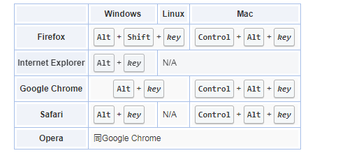

## 31.你有用过HTML5的Device API吗？说说它都有哪些应用场景

* dial: 拨打电话
* beep: 发出蜂鸣声
* vibrate: 设备振动
* setWakelock: 设置应用是否保持唤醒（屏幕常亮）状态
* isWakelock: 获取程序是否一直保持唤醒（屏幕常亮）状态
* setVolume: 设置设备的系统音量
* getVolume: 获取设备的系统音量

## 32.用HTML5实现手机摇一摇功能你有做过吗？你知道它的原理吗

[HTML5实现摇一摇的功能（实测后）](https://blog.csdn.net/david1030/article/details/8229008)

通过重力感应实现的,但在添加声音的时候,在iOS12版本以上会有兼容问题不好使,得手动开启好多权限。

利用HTML5实现类似微信的手机摇一摇功能，并播放音乐。

* deviceOrIEntation：封装了方向传感器数据的事件，可以获取手机静止状态下的方向数据，例如手机所处角度、方位、朝向等。

* deviceMotion：封装了运动传感器数据的事件，可以获取手机运动状态下的运动加速度等数据。

~~~html
<!DOCTYPE html>
<html lang="en">
<head>
    <meta charset="utf-8" />
    <meta name="vIEwport" content="width=device-width, initial-scale=1.0" />
    <title>摇一摇功能</title>
    <script type="text/javascript">
        //Javascript
    </script>
</head>
<body οnlοad="init()">
<p>用力摇一摇你手机</p>
<audio style="display:hiden" id="musicBox" preload="metadata" controls src="http://211.148.5.228:8002/Pages/test/Kalimba.mp3" autoplay="false">
</audio>
</body>
</html>
~~~

~~~javascript

var SHAKE_THRESHOLD = 3000;
        var last_update = 0;
        var x = y = z = last_x = last_y = last_z = 0;
        function init() {
            if (window.DeviceMotionEvent) {
                window.addEventListener('devicemotion', deviceMotionHandler, false);
            } else {
                alert('not support mobile event');
            }
        }
        function deviceMotionHandler(eventData) {
            var acceleration = eventData.accelerationIncludingGravity;
            var curTime = new Date().getTime();
            if ((curTime - last_update) > 100) {
                var diffTime = curTime - last_update;
                last_update = curTime;
                x = acceleration.x;
                y = acceleration.y;
                z = acceleration.z;
                var speed = Math.abs(x + y + z - last_x - last_y - last_z) / diffTime * 10000;
 
                if (speed > SHAKE_THRESHOLD) {
                    alert("摇动了");
                    media.setAttribute("src", "http://211.148.5.228:8002/Pages/test/Kalimba.mp3");
                    media.load();
                    media.play();  
                }
                last_x = x;
                last_y = y;
                last_z = z;
            }

~~~

> IOS 测试：Safari 弹框\不播放音乐, Chroma 弹框\不播放音乐,UC弹框\不播放音乐
>
> Andriod 测试：UC弹框\播放音乐,Chroma 弹框\播放音乐,内置浏览器 弹框\播放音乐

## 33.在新窗口打开链接的方法是什么？那怎么设置全站链接都在新窗口打开

* a标签的target属性

  ~~~html
  <a href="#" target="_blank"></a>
  ~~~

* 在head标签下 加上

  ~~~html
  <head>
      <base target="_blank">
  </head>
  ~~~

## 34.a标签下的`href="javascript:void(0)"`起到了什么作用？说说你对`javascript:void(0)`的理解

[javascript:void(0) 含义](https://www.runoob.com/js/js-void.html)

javascript:是伪协议，表示url的内容通过javascript执行。void(0)表示不作任何操作，这样会防止链接跳转到其他页面。这么做往往是为了保留链接的样式，但不让链接执行实际操作。

点击a标签的时候,执行js函数,void(0)实际什么也不执行,避免了点击跳转,还可以写成 `javascript:;`

## 35. iframe的使用场景有哪些

* 典型系统结构，左侧是功能树，右侧就是一些常见的table或者表单之类的。为了每一个功能，单独分离出来，采用iframe。
* ajax上传文件。 
* 加载别的网站内容，例如google广告，网站流量分析。
*  在上传图片时，不用flash实现无刷新。
*  跨域访问的时候可以用到iframe，使用iframe请求不同域名下的资源。

>  不喜欢iframe，iframe布局都是给懒人准备的，而且使用iframe不利于seo

## 36.举例说明你对HTML5的ruby标签的理解，都有哪些应用场景

ruby 包含多个rt,rp标签构成,用以表示注释。

[HTML5 注释标签](https://www.cnblogs.com/kumayato/p/6431295.html)

~~~html
<section>
  <ruby class="spz">
    <rb>茕</rb>
    <rt>qióng</rt>
    <rb>茕</rb>
    <rt>qióng</rt>
    <rb>孑</rb>
    <rt>jié</rt>
    <rb>立</rb>
    <rt>lì</rt>
    <rb>沆</rb>
    <rt>hàng</rt>
    <rb>瀣</rb>
    <rt>xiè</rt>
    <rb>一</rb>
    <rt>yī</rt>
    <rb>气</rb>
    <rt>qì</rt>
  </ruby>
  <ruby class="spz">
    <rb>踽</rb>
    <rt>jǔ</rt>
    <rb>踽</rb>
    <rt>jǔ</rt>
    <rb>独</rb>
    <rt>dú</rt>
    <rb>行</rb>
    <rt>xíng</rt>
    <rb>醍</rb>
    <rt>tí</rt>
    <rb>醐</rb>
    <rt>hú</rt>
    <rb>灌</rb>
    <rt>guàn</rt>
    <rb>顶</rb>
    <rt>dǐng</rt>
  </ruby>
  <ruby class="spz">
    <rb>绵</rb>
    <rt>mián</rt>
    <rb>绵</rb>
    <rt>mián</rt>
    <rb>瓜</rb>
    <rt>guā</rt>
    <rb>瓞</rb>
    <rt>dié</rt>
    <rb>奉</rb>
    <rt>fèng</rt>
    <rb>为</rb>
    <rt>wéi</rt>
    <rb>圭</rb>
    <rt>guī</rt>
    <rb>臬</rb>
    <rt>niè</rt>
  </ruby>
  <ruby class="spz">
    <rb>龙</rb>
    <rt>lóng</rt>
    <rb>行</rb>
    <rt>xíng</rt>
    <rb>龘</rb>
    <rt>dá</rt>
    <rb>龘</rb>
    <rt>dá</rt>
    <rb>犄</rb>
    <rt>jī</rt>
    <rb>角</rb>
    <rt>jiǎo</rt>
    <rb>旮</rb>
    <rt>gā</rt>
    <rb>旯</rb>
    <rt>lá</rt>
  </ruby>
</section>
~~~

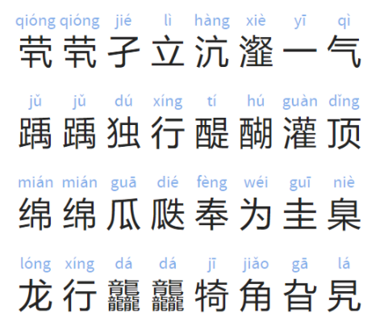

## 37.举例说明如何原样输出HTML代码，不被浏览器解析

* 使用pre标签

* 转义

## 38.怎么使用HTML5来获取定位？定位不准怎么解决

[使用地理位置定位](https://developer.mozilla.org/zh-CN/docs/Web/API/Geolocation/Using_geolocation)

不准的话调用获取定位接口吧

## 39. a标签的href和onclick属性同时存在时哪个先触发

应该是`onclick`属性先触发，判断依据是在`onclik`中使用`preventDefault`方法可以阻止`a`标签的跳转，说明`a`标签的跳转行为是一个默认行为；如下：

~~~html
<a href="https://developer.mozilla.org/zh-CN/docs/Web/HTML/Element/a" onclick="event.preventDefault()">test</a>
~~~

`onclick`事件先触发， 如果函数执行返回`false`(全等), 则`href`不会被触发。
只在`chrome` 和 `firefox` 中试过。

~~~html
<a href="javascript:alert(1)" onclick="alert(2)">点一下试试，看谁先触发</a>
<a href="javascript:alert(1)" onclick="alert(2);return false;">点一下试试</a>
~~~

## 40.举例说明你对ol和ul标签的区别？它们的运用场景分别是什么呢

ul为无序列表，ol为有序列表，还有个dl自定义列表。
ul,ol均可用于列表布局,如资讯列表,会员列表,商品列表灯。

* 当你无排序,不需要其中的数字排序意义时可以用ul

* 当想要用序号表示列表内的次序时,可以用ol

## 41.请描述下元素的href和src有什么区别

* 概念不同
  href用于在当前文档和引用资源之间确立联系
  src用于将资源替换当前元素
* 解析方式不同
  href解析时，会并行下载资源且不会停止当前文档处理
  src解析时，会暂停当前文档处理

`href` 只是建立一个与目标地址的关系。比如 `link`,`a`。浏览器读到 `href` 的时候不会暂停解析（`link` 中由于是 CSS 相关，在生成 Render Tree 的时候可能需要等待）。

`src` 相当于把指定的资源潜入到标签中。因此需要有下载、编译、执行这个过程。在这个过程走完前，浏览器的页面加载和渲染会被暂停。因此才会有把 `script` 标签放到 `body` 最后、`img` 标签的 `src` 等页面加载后在替换成真正的 `src`（懒加载）等操作。

[url、href、src 详解](https://segmentfault.com/a/1190000002877022)

## 42.请说说你对ISISO8859-2字符集的认识(偏题)

ISO8859是一系列的字符标准,ISO8859-2在1的基础之上收集了东欧字符。

当今开发环境下，对于一个字符集，通常情况下，我们只需要有两个认识：

> - 它是 UTF-8 吗？
> - 如果不是，那它兼容 UTF-8 吗？

对于 ISO-8859，回答是：

> 它不是 UTF-8，但它兼容 UTF-8。它是 UTF-8 的子集。

当然，知道了也没用。你还是用 UTF-8。

> 注：你如果接手一个遗留项目，可能会接触到和 UTF-8 不同的其他字符集。你的开发体验通常会很差，因为其他工具都用 UTF-8。所以，最好的方法是：不要接手非 UTF-8 的遗留项目。

## 43.有使用过svg吗？请用svg画一个圆

~~~html
<svg width="50" height="50">
    <circle cx="25" cy="25" r="10" fill="black" />
</svg>
~~~

## 44.使用HTML5需要遵守哪些设计原则

避免不必要的复杂性

支持已有内容

解决现实的问题

内容模型

平稳退化(向下兼容)

语义化标签

## 45.HTML5标准提供了哪些新的API？你有用过哪些

- 两个选择器API
  - `document.querySelector()`
  - `document.querySelectAll()`
- 地理定位API
  - `getCurrrentPosition()`
- 多媒体API
  - `<video></video>`
  - `<audio></audio>`
- 拖放

```javascript
<div ondrop="drop(event)" ondragover="allowDrop(event)"></div>
<div draggable="true" ondragstart="drag(event)"></div>
```

- 文件
  `window.requestFileSystem()`
- XHR2

```javascript
var xhr = new XMLHttpRequest();
xhr.open("POST", "@Url.Action("Upload")")
```

- 本地存储API
  - `localStorage`
  - `sessionStorage`
- canvas

```javascript
<canvas id="myCanvas" width="200" height="100">
```

- svg

```javascript
<svg xmlns="http://www.w3.org/2000/svg" version="1.1">
   <circle cx="100" cy="50" r="40" stroke="black" stroke-width="2" fill="red" />
</svg>
```

## 46.写出以下几个HTML标签：字体、居中、文字加粗、下标

字体：`<font>`
居中：`<center>`
文字加粗：`<b>` 文字强调：`<strong>`
下标：`<sub>`
字体和居中的是自己刚开始按照CSS直接猜的，后来一查还真是这样。而且手册不建议使用这两种标签。

> ``和``都被废除了，推荐用CSS实现

现在这些标签都有相应的CSS属性进行设置了吧

字体：`font`
居中：`text-align: center`
文字加粗：`font-weight: bold`
下标：`vertical-align:sub`

## 47.Doctype有什么作用？你知道有多少种Doctype文档类型吗

1、 Doctype的作用 
​    文档类型声明，作用是防止浏览器在渲染html文档时，切换到我们称之为怪异模式（兼容模式）的渲染模式。
2、Doctype文档类型的种类
   （1）在 HTML 4.01和XML  中有三种<!DOCTYPE> 声明
​       Strict是不包括展示性和废弃的属性 以及框架集framset
​       transitional 包括展示性和废弃属性 不包含框架集
​       framset 在transitional 基础上包括框架集
   （2）在 HTML5 中只有一种： `<!DOCTYPE html>`
​       在 HTML5中，DOCTYPE 唯一的作用是启用标准模式。更早期的 HTML 标准会附加其他意义，但没有任何浏览器会将 DOCTYPE 用于怪异模式和标准模式之间互换以外的用途。
3、注意！
   （1）位置必须放在文档顶端，任何放在 DOCTYPE 前面的东西，比如批注或 XML 声明，会令 IE9 或更早期的浏览器触发怪异模式。
   （2）DOCTYPE不是HTML标签，它是一个它是浏览器模式渲染的指令，更没有结束标签。
   （3）<!DOCTYPE> 声明对大小写不敏感。

## 48.列举出你最常用的meta标签的写法和作用

<meta>用来描述网页的元信息；诸如字符编码，浏览器引擎编译，文档信息等等；
* charset：声明当前文档的字符编码，用于浏览器解析文档；如：

<meta charset="UTF-8">

* name：声明当前文档的元信息；常用的有viewport，keywords，description等；
  * viewport：文档视口设置，如初始视口大小（initial-scale），是否允许用户缩放（user-scalable）等；
  * keywords：网页的关键字，常用于搜索引擎对于该网页的搜索关键字；
  * description：网页的描述信息；
* http-equiv：可以用来设定一些属性改变服务器或浏览器引擎对文档的编译行为；我只用过`X-UA-Compatible`这个属性，该属性只支持IE8+的浏览器，可以设定IE浏览器的渲染引擎；如：

```
告诉IE浏览器，IE8/9及以后的版本都会以最高版本IE来渲染页面
<meta http-equiv="X-UA-Compatible" content="IE=edge">
```

注：http-equiv和name的属性，属性值通过`<meta>`标签的content属性来设置；

参考文档：

1. [ < meta>-HTML（超文本标记语言） | MDN](https://developer.mozilla.org/zh-CN/docs/Web/HTML/Element/meta)
2. [[FE\] IE兼容性模式X-UA-Compatible - 简书](https://www.jianshu.com/p/11adc0ef158e)

- 指定页面的兼容模式

```
<meta http-equiv="X-UA-Comptible"/>
```

- 指定浏览器的渲染内核

```
<meta name="Render" content="webkit"/>
```

- 指定当前页面的字符集

```
<meta charset="UTF-8">
```

## 49. HTML5的页面可见性（Page Visibility）有哪些应用场景

### document.visibilityState属性

- 产生的原因: 不能触发unload,pageHide事件的时候
  - 手机端切换到最近任务界面,点击另一个APP,
  - 手机端直接按home键返回主屏幕;
  - PC端最小化,
- 使用的场景:
  - 停止与服务器的轮询
  - 停止页面音视频

触发的事件:`document.onvisibilitychange`

## 50. HTML5怎么为输入框添加语音输入的功能呢

x-webkit-speech input 在 chrome 中已经废除了（没查到从哪个版本开始），不过本来这个也只是 chrome 的私有功能，不算 HTML5 规范。目前 chrome 中可以使用 JS 版的语音识别 API： [https://caniuse.com/#search=speech%20recognition](https://caniuse.com/#search=speech recognition)

这个 API 目前还在草案阶段： https://w3c.github.io/speech-api/

# CSS

## 1.有用过Flex吗？简要说下你对它的了解

flex 可以很方便对多栏布局，垂直水平居中。

> 我马上就要开始学Flex了，到时候再把这道题详细回答一下。

## 2.要是position跟display、overflow、float这些特性相互叠加后会怎么样？

[position跟display、margin collapse、overflow、float这些特性相互叠加后会怎么样？](https://www.cnblogs.com/jiangtuzi/p/4128962.html)

这是寒冬大神提出的一个题目，刚开始看到这题的时候完全不知道从什么地方回答起好，题目内容比较广泛，找不到针对点。后来我觉得这个题目应该能拆成几个点来回答：1、`display`、`position'`和 `float`  的相互关系；2、`position`跟`display`、`overflow`、`float`下的margin collapse。

### `display`、`position'`和 `float` 的相互关系

首先我们先来看下这3个属性。

display 属性规定元素应该生成的框的类型。 block 像块类型元素一样显示，none 缺省值。像行内元素类型一样显示， inline-block 像行内元素一样显示，但其内容象块类型元素一样显示，list-item 像块类型元素一样显示，并添加样式列表标记（display 还有很多其他值设置，读者自行查找）。

 position 属性规定元素的定位类型。 absolute表示生成绝对定位的元素，相对于 static 定位以外的第一个父元素进行定位；fixed（老IE不支持）生成绝对定位的元素，相对于浏览器窗口进行定位；relative生成相对定位的元素，相对于其正常位置进行定位；static  默认值。没有定位，元素出现在正常的流中（忽略 top, bottom, left, right z-index 声明）。

 Float也是是一种布局方式，它定义元素在哪个方向浮动。以往这个属性总应用于图像，使文本围绕在图像周围，不过在 CSS 中，任何元素都可以浮动。浮动元素会生成一个块级框，而不论它本身是何种元素。 在布局过程中也经常会使用它来达到左右并排布局的效果。

那么这三种布局和框形成的关键特性( display )之间有什么关系呢，请看下面流程图：

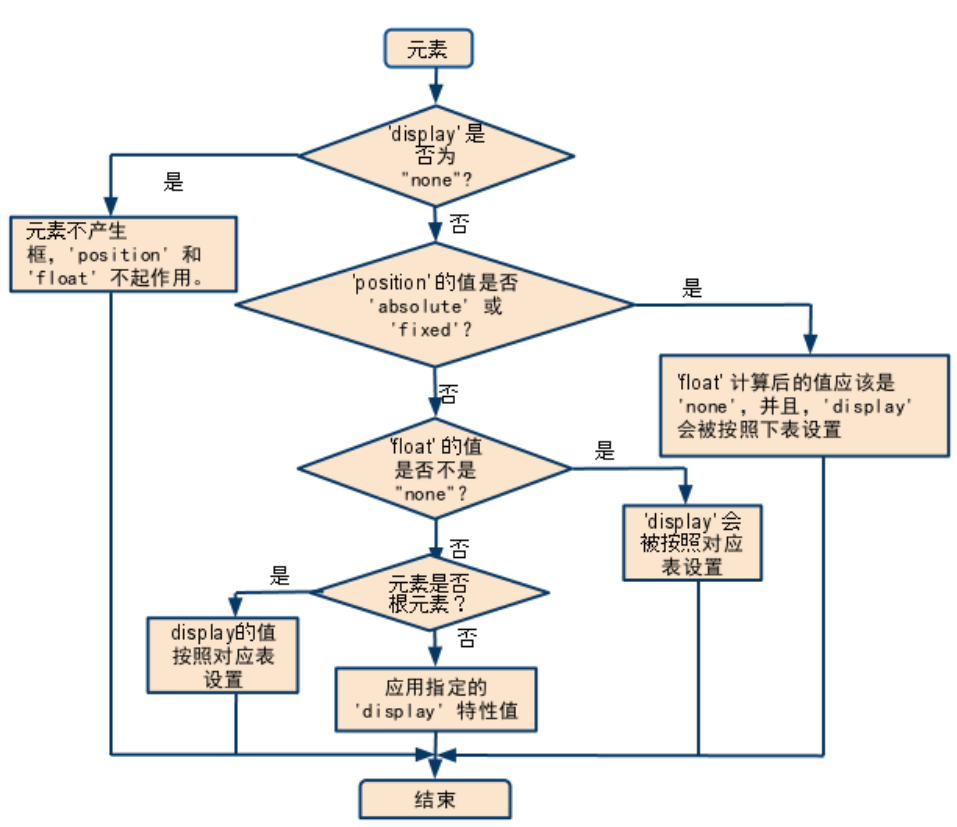

总的来说，可以把它看作是一个类似优先级的机制， `position:absolute`和 `position:fixed`优先级最高，有它存在的时候，浮动不起作用，`display`的值也需要调整； 其次，元素的 `float'`特性的值不是 `none`的时候或者它是根元素的时候，调整 `display`的值； 最后，非根元素，并且非浮动元素，并且非绝对定位的元素，`display`特性值同设置值。

这从另一个侧面说明了一个问题：浮动或绝对定位的元素，只能是块元素或表格。

## 3.怎么使用自定义字体？有什么注意事项

~~~css
@font-face {
font-family: '自定义字体名称';
src: url('字体文件名.eot'); /* IE9 Compat Modes /
src: url('字体文件名.eot?#IEfix') format('embedded-opentype'), / IE6-IE8 /
url('字体文件名.woff') format('woff'), / Modern Browsers /
url('字体文件名.ttf') format('truetype'), / Safari, Android, iOS /
url('字体文件名.svg#字体文件名') format('svg'); / Legacy iOS */
font-style: normal;
font-weight: normal;
}
~~~

> 这个方案对西文比较友好，因为西文字体体积较小，而中文基本都是10mb以上的，极度不友好。
> 故中文最好使用标准字体。或者根据用到的文字按需编写字库文件。

## 4.CSS3中的`:nth-child`和`:nth-of-type`的区别是什么？

[:nth-child](https://developer.mozilla.org/zh-CN/docs/Web/CSS/:nth-child)

[:nth-of-type](https://developer.mozilla.org/zh-CN/docs/Web/CSS/:nth-of-type)

**`:nth-child(an+b)`** 这个 [CSS 伪类](https://developer.mozilla.org/en-US/docs/CSS/Pseudo-classes)首先找到所有当前元素的兄弟元素，然后按照位置先后顺序从1开始排序，选择的结果为CSS伪类:nth-child括号中表达式（an+b）匹配到的元素集合（n=0，1，2，3...）。示例：

- `0n+3` 或简单的 `3` 匹配第三个元素。
- `1n+0` 或简单的 `n` 匹配每个元素。（兼容性提醒：在 Android 浏览器 4.3 以下的版本 `n` 和 `1n` 的匹配方式不一致。`1n` 和 `1n+0` 是一致的，可根据喜好任选其一来使用。）
- `2n+0` 或简单的 `2n` 匹配位置为 2、4、6、8...的元素（n=0时，2n+0=0，第0个元素不存在，因为是从1开始排序)。你可以使用关键字 **`even`** 来替换此表达式。
- `2n+1` 匹配位置为 1、3、5、7...的元素。你可以使用关键字 **`odd`** 来替换此表达式。
- `3n+4` 匹配位置为 4、7、10、13...的元素。

`a` 和 `b` 都必须为整数，并且元素的第一个子元素的下标为 1。换言之就是，该伪类匹配所有下标在集合 { an + b; n = 0, 1, 2, ...} 中的子元素。另外需要特别注意的是，`an` 必须写在 `b` 的前面，不能写成 `b+an` 的形式。

**`:nth-of-type()`** 这个 [CSS 伪类](https://developer.mozilla.org/en-US/docs/CSS/Pseudo-classes)是针对具有一组兄弟节点的标签, 用 n 来筛选出在一组兄弟节点的位置。

~~~css
/* 在每组兄弟元素中选择第四个 <p> 元素 */
p:nth-of-type(4n) {
  color: lime;
}
~~~

`:nth-child(n) `选择器匹配属于其父元素的第 N 个子元素，不论元素的类型。
`:nth-of-type(n) `选择器匹配属于父元素的特定类型的第 N 个子元素。
n 可以是数字、关键词或公式。

## 5.什么是视差滚动？如何实现视差滚动的效果

[小tip: 纯CSS实现视差滚动效果](https://www.zhangxinxu.com/wordpress/2015/03/css-only-parallax-effect/)

**什么是视差滚动**：
就是在同一视角下，鼠标或者页面滚动时，不同元素以不同的速率跟随滚动，产生生动的效果。
**如何实现视差滚动**：
根据页面滚动高度的变化，JS相应调整不同元素的不同位移，常见的插件有[parallax.js](https://pixelcog.github.io/parallax.js/)，以及更多的推荐[《10个优秀视差滚动插件》](https://www.w3cplus.com/source/10-best-Parallax-Scrolling-plugin.html)

**CSS实现的原理**：

~~~css
.container {
    /* 滚动容器 */
    perspective: 1px; 
    padding: 0; height: calc(100vh - 300px); overflow: auto;
}
.box {
    /* 视差元素的父级需要3D视角 */
    height: 1280px;
    transform-style: preserve-3d;
    position: relative;
}
.background {
    /* 滚动比较慢的背景元素 */
    position: absolute; left: 50%;
    transform: translate3D(-50%, -120px, -1px) scale(2);
}
~~~

## 6.margin和padding使用的场景有哪些

**margin**:

   需要在border外侧添加空白时；

   空白处不需要背景（色）时；

  上下相连的两个盒子之间的空白，需要相互抵消时。

**padding**：

  需要在border内测添加空白时；

  空白处需要背景（色）时；

  上下相连的两个盒子之间的空白，希望等于两者之和时。

## 7. inline、block、inline-block这三个属性值有什么区别

**inline**： 行内元素，元素不独占一行，不可以修改宽高
**block**： 块级元素，元素独占一行，可以修改宽高
**inline-block**： 行内块级元素，元素不独占一行，并且可以修改宽高

CSS显示模块分为内部显示类型和外部显示类型，内部显示类型是定义子元素如何参与内部布局，外部显示类型定义了父元素如何参与外部整个文档流的布局，所以
inline-> inline-inline
block-> block-block
inline-block-> inline-block

他们的区别是分两块的，也就是内外部显示类型，参与文档布局的内外区别。

## 8.box-sizing常用的属性有哪些？分别有什么作用

- box-sizing常用的属性有 content-box 和 border-box。
- content-box 盒子的宽度不包含 border和padding，border-box盒子的宽度包含border 和padding。

## 9.你有用过哪些CSS框架？说说它们的特点

bootstrap 不够全，所以后来基本都是借鉴思路取长补短自己写的 css 类库或原子类库。
animate.css 用起来很爽，主要用于滚动和小动效。过渡动画当然还是 clip.js 来弄的。
Tent CSS，WeUI，amazeUI 我个人用起来很不舒服，改起来麻烦，除非设计直接选用该风格。

至于 elementUI，antDesign，vantUI，mintUI 这些就是组件库了，需要集成 vue 或 react，
基本采用该库那多半 UI 风格就已经定下了，而且真正来讲更讲究组件功能性，布局影响并不很大。

------

首先我观念中的 UI 库可以拆为 初始化类库、原子类库、常见布局类库、组件类库。

初始化类库，好像现在都不怎么讲究了，
一方面是 select 都在用 UI去做了，那基本没啥样式差异，
另一方面是做兼容的需求没以往那么多了，比如 input[type="range"] 样式就那样也说得过去。
其次，初始化也有一定的个人色彩，比如 p 要不要加 margin 、img 要 block 等问题。

原子类库，在使用 less 等 css 编译项目中非常非常爽，
配色呀、单位与间距呀、文本超出呀、禁用呀、滚动呀等等。

常见布局类库，多数情况是多个 dom 元素搭配的结果，
比如 .flex-col 往往会有个 .flex-grow 与其相随，.modal 总会有个 .modal-wrap 等。

组件类库，和常见布局类库是十分相似的，但有更棒的拆分规则而已。

## 10.用CSS画一个太阳

画法1：

~~~html
<!-- html -->
  <div class="sun">
    <div class="sun-light sl1"></div>
    <div class="sun-light sl2"></div>
    <div class="sun-light sl3"></div>
    <div class="sun-light sl4"></div>
    <div class="sun-light sl5"></div>
    <div class="sun-light sl6"></div>
    <div class="sun-light sl7"></div>
    <div class="sun-light sl8"></div>
  </div>
~~~


~~~CSS
// css
    .sun {
      margin: 200px;
      width: 200px;
      height: 200px;
      border-radius: 50%;
      background: red;
      box-shadow: 0 0 21px #fe9e9e;
      position: relative;
    }
  // ::before & ::after  辅助
    .sun::before {
      width: 0;
      height: 500px;
      content: '';
      border-left: 1px solid blue;
      position: absolute;
      top: -150px;
      left: 100px;
      z-index: 100;
      transform: rotate(45deg);
    }
    .sun::after {
      width: 500px;
      height: 0;
      content: '';
      border-top: 1px solid blue;
      position: absolute;
      top: 100px;
      left: -150px;
      z-index: 100;
      transform: rotate(45deg);
    }
  // 光线的宽高据 sun-body 而动
    .sun-light {
      width: 100px;
      height: 6px;
      background: yellow;
      position: absolute;
      left: 0;
      top: 0;
    }
    .sl1 {
      left: 50px;
      top: -58px;
      transform: rotate(90deg);
    }
    .sl2 {
      top: -14px;
      left: 160px;
      transform: rotate(-45deg);
    }
    .sl3 {
      top: 97px;
      left: 205px;
    }
    .sl4 {
      top: 206px;
      left: 160px;
      transform: rotate(45deg);
    }
    .sl5 {
      top: 252px;
      left: 50px;
      transform: rotate(90deg);
    }
    .sl6 {
      top: 206px;
      left: -60px;
      transform: rotate(-45deg);
    }
    .sl7 {
      top: 97px;
      left: -105px;
    }
    .sl8 {
      top: -14px;
      left: -60px;
      transform: rotate(45deg);
    }
~~~

画法2：

~~~html
 <section class="c-sun">
      <div class="c-sun__circle"></div>
      <div class="c-sun__arrow" v-for="i in 10" :key="i"></div>
 </section>
~~~

~~~css
  .c-sun {
      display: inline-block;
      position: relative;
      &__circle {
        width: 60px;
        height: 60px;
        border-radius: 50%;
        background: yellow;
      }
      &__arrow {
        width: 100%;
        position: absolute;
        top: 50%;
        left: 50%;
        @for $i from 1 to 12 {
          &:nth-child(#{$i}) {
            transform: translate(-50%, -50%) rotateZ($i * 36deg);
          }
        }
        &:after {
          position: absolute;
          right: -25px;
          content: "";
          display: block;
          border: 10px solid transparent;
          border-left-color: #ffdc18;
          animation: flashing 1s ease-in-out alternate-reverse infinite;
        }
      }
      @keyframes flashing {
        from {
          opacity: .5;
          transform: translate(10%, 10%);
        }
      }
    }
~~~

画法3：

~~~javascript
<!DOCTYPE html>
<html lang="en">

<head>
  <meta charset="UTF-8">
  <meta name="vIEwport" content="width=device-width, initial-scale=1.0">
  <meta http-equiv="X-UA-Compatible" content="IE=edge">
  <title>Document</title>
  <style>
    .sun {
      position: absolute;
      right: 200px;
      top: 50px;
      width: 150px;
      height: 150px;
      border-radius: 50%;
      background: #f8e353;
    }

    .sun::before {
      content: "";
      position: absolute;
      top: 50%;
      left: 50%;
      transform: translate(-50%, -50%);
      width: 130px;
      height: 130px;
      border-radius: 50%;
      background: #ffd21f;
      filter: blur(10px);
      z-index: 1;
      animation: inlineSun 5s ease infinite;
    }

    .sun::after {
      content: "";
      position: absolute;
      top: 50%;
      left: 50%;
      transform: translate(-50%, -50%);
      width: 180px;
      height: 180px;
      border-radius: 50%;
      background: #fcf17c;
      z-index: -1;
      box-shadow: 0 0 40px #ffd21f;
      animation: sun 5s ease-in infinite;
    }

    @keyframes inlineSun {
      0% {
        opacity: 1;
      }

      50% {
        opacity: 0.5;
        width: 70px;
        height: 70px;
      }

      100% {
        opacity: 1;
      }
    }

    @keyframes sun {
      0% {
        box-shadow: 0 0 90px #ffd21f;
      }

      50% {
        box-shadow: 0 0 30px #ffd21f;
      }

      100% {
        box-shadow: 0 0 90px #ffd21f;
      }
    }
  </style>
</head>

<body>
  <div class="sun"></div>
</body>

</html>
~~~

## 11.怎样把一个div居中？怎样把一个浮动元素居中？怎样把绝对定位的div居中

假定是水平居中：
**div居中**：
`margin:0 auto;`

**浮动元素居中**(div居中也可以用)：
`margin-left: 50%; transform: translate(-50%);`

**绝对定位的div居中**：
`{ top:0; left:0; bottom:0; right:0; margin: auto; }`

## 12.手动写动画最小时间间隔是多少，为什么

一般浏览器的刷新频率为每秒60次，所以最小事件间隔为 1/60*1000 约 16.667ms。

手写动画推荐使用 [requestAnimationFrame API](https://developer.mozilla.org/zh-CN/docs/Web/API/Window/requestAnimationFrame)，他会根据浏览器性能自动使用合理的间隔，而且时间远远比自己写时间间隔要准确（如果对动画精确度要求很高，setInterval 是不准的）。

## 13.说说position的absolute和fixed共同与不同点分别是什么

相同点：

* 都是用来给元素定位的属性，具有定位元素的一切特点（例如脱离文本流、不占据空间等等）
* 改变元素的呈现方式为`display：block`
* 他们都能触发BFC，与外界布局互不影响
* 设置`z-index`属性能够产生层叠上下文

不同点：

* fixed的父元素永远是浏览器窗口，不会根据页面滚动而改变位置；absolute的父元素是可以设置的，他会永远跟随父元素的位置的改变而改变。

## 14.举例说明CSS中颜色的表示方法有几种 

* 颜色单词: blue / lightblue / skyblue / transparent(透明)

* rgb(0-255, 0-255, 0-255) / rgba(0-255, 0-255, 0-255, 0-1)
* 十六进制: #000000- #FFFFFF ( #000 - #fff ) ( 0-9 a-f | [A-F] )

* hsl色相: hsl(色调，饱和度，明度) hsla( 色调，饱和度，亮度，不透明度 ) (兼容性)

## 15.用CSS绘制一个红色的爱心

~~~css
 .heart {
      position: relative;
      width: 100px;
      height: 90px;
    }
    .heart:before,
    .heart:after {
      position: absolute;
      content: "";
      left: 50px;
      top: 0;
      width: 50px;
      height: 80px;
      background: red;
      border-radius: 50px 50px 0 0;
      transform: rotate(-45deg);
      transform-origin: 0 100%;
    }
    .heart:after {
      left: 0;
      transform: rotate(45deg);
      transform-origin: 100% 100%;
    }
~~~

## 16.元素竖向的百分比设置是相对容器的高度吗

不是，一般是根据**宽度**来的，像padding-top,padding-bottom

因为高度百分比的话CSS没办法处理，比如子元素的高度设置为200%，那父元素是不是被撑开了，然后父元素变化了，子元素的200%是不是相对又变化了，所以会造成一个死循环，在CSS里面是没办法处理高度百分比的，高度都是auto。

如果想要实现等比例的盒子模型，可以通过上面的padding-top,padding-bottom属性来实现。

> 元素竖向的百分比设置高度是相对父级的高度，但是margin 和padding 是参照父级的**宽度**来设置的。

## 17.如何消除transition闪屏

transition闪屏发生的情况，是在IOS的Safari浏览器下，使用transition来进行动画变换时候就会出现

~~~css
.css { 
    -webkit-transform-style: preserve-3d; 
    -webkit-backface-visibility: hidden; 
    -webkit-perspective: 1000; 
} 
~~~

## 18.说说你对jpg、png、gif的理解，分别在什么场景下使用？有使用过webp吗

* jpg： 色彩复杂图片
* png： 色彩简单图片
* gif： 动图, 或者色彩极简的icon等
* webP： 判断能使用webP的浏览器就是用webP

[探究WebP一些事儿](https://aotu.io/notes/2016/06/23/explore-something-of-webp/)

不管是PC还是移动端，图片一直是流量大头。不管是在京东首页还是频道页，商品图片以及广告图片占据了大部分的流量。

评价网站性能好坏的一个主要指标就是页面响应时间，也就是说用户打开完整页面的时间。基于JPEG还有PNG图片格式的网页，其图片资源加载往往都占据了页面耗时的主要部分，那么如何保证图片质量的前提下缩小图片体积，成为了一件有价值的事情。

而如今，对JPEG、PNG以及GIF这些格式的图片已经没有太大的优化空间。但是，Google推出的WebP图片格式给图片优化提供了另一种可能。

WebP是一种支持有损压缩和无损压缩的图片文件格式，根据Google的测试，无损压缩后的WebP比PNG文件少了26％的体积，有损压缩后的WebP图片相比于等效质量指标的JPEG图片减少了25％~34%的体积。

通过研究WebP图片格式，尽可能全面地了解WebP图片的优劣势以及应用WebP图片给我们带来的收益以及风险，最终提升用户体验。

## 19.请说说`*{box-sizing: border-box;}`的作用及好处有哪些

* 作用: 将padding和border包括在width内

* 好处: 更符合我们通常对一个「盒子」尺寸的认知,省掉一些计算

> 还是喜欢用默认的content-box 不考虑老版IE 比较通配符的性能较差 第三方的UI库的盒模型也都是标准盒模型

> 很多网站和样式都是 `boder-box` , 包括淘宝h5版本5和饿了么。 `boder-box` 对元素设定固定尺寸之后js获取到的值是固定的。

## 20.你有使用过哪些栅格系统？都有什么区别呢

bootstrap 12份

element-ui 24份

bootstrap3：float完成的栅格

bootstrap4：flex完成的栅格

## 21. 你对响应式设计的理解是什么？知道它基本的原理是吗？要想兼容低版本的IE怎么做呢

* 理解：在不同系统，不同设备，不同尺寸的界面，有良好的用户体验，舒适的阅读体验，交互体验。
* 原理：根据不同设备尺寸，浏览器自动调整或通过样式调整，来保证用户体验。
* 兼容：Respond.js

## 22.怎么改变选中文本的文字颜色和背景色

~~~css
::selection {
background-color: #222;
color: white;
}
~~~

## 23.在实际编写CSS中你有遇到过哪些浏览器兼容性的问题？怎么解决的

做手机端Hybrid的时候, android4.3-跟android4.4+特别多flexbox兼容问题, 如果遇到android4.3-的有问题, 一般是另外想办法。

必用的三个工具

- [PostCSS](https://www.npmjs.com/package/postcss)
- [Autoprefixer](https://github.com/postcss/autoprefixer)
- [Browserslist](https://github.com/browserslist/browserslist)

## 24.说说你对!important的理解，一般在哪些场景使用

!important 可以让样式的特指度最高，覆盖任何样式，而且本身不可被覆盖。
一般场景就是用来强制覆盖其他样式，用的比较少，不建议使用，因为别人没法覆盖这个样式，维护性比较高。

> 使用场景好像几乎没有，还是调整权重比较好。

## 25.请你解释下什么是浮动和它的工作原理是什么？同时浮动会引起什么问题

- 什么是浮动：我们在做布局的时候用到的一种技术，通过浮动可以让元素左右浮动，然后通过margin调整位置
- 工作原理：使元素脱离文档流，让元素可以左右浮动，直到遇到另一个浮动元素的边缘才停止。
- 带来的问题：浮动元素会造成父级元素无法自动获取高度，导致父级塌陷，布局错乱。

## 26.用CSS画出一个任意角度的扇形，可以写多种实现的方法

方法1：四个半圆叠加，过半调整z-index：

~~~html
<div class="container">
  <div class="semi-1"></div>
  <div class="semi-2"></div>
  <div class="semi-3"></div>
  <div class="semi-4"></div>
</div>
~~~

~~~css
.container {
  width: 200px;
  height: 200px;
  position: relative;
  border-radius: 100%;

  div {
    width: 50%;
    height: 100%;
    position: absolute;
    left: 0;
    top: 0;
  }
  
  .semi-1, .semi-3 {
    background: red;
  }
  
  .semi-2, .semi-4 {
    background: white;
  }
  
  .semi-1, .semi-2 {
    border-radius: 100px 0 0 100px;
    transform-origin: 100% 50%;
    z-index: 2;
  }
  
  .semi-3, .semi-4 {
    z-index: 1;
    left: 50%;
    border-radius: 0 100px 100px 0;
    transform-origin: 0% 50%;
  }
  
  .semi-4{
    animation: rotate-2 2s linear both infinite;
  }
  
  .semi-2{
    animation: rotate-1 2s linear both infinite;
  }
  
  .semi-3 {
    animation: zIndex 2s linear both infinite;
  }
  
  @keyframes zIndex{
    from{z-index: 1;}
    50%{z-index: 1;}
    50.000001%{z-index: 2;}
    to{z-index: 2;}
  }
 
  @keyframes rotate-1 {
    from{ transform: rotate(0);}
    50%{transform: rotate(0);}
    to{transform: rotate(180deg);}
  }
  
  @keyframes rotate-2 {
    from{ transform: rotate(0);}
    50%{transform: rotate(180deg);}
    to{transform: rotate(180deg);}
  }
}
~~~

方法2：先画一个圆,外加两个绝对定位的半圆，扇形可以通过两个半圆作为遮罩旋转来露出相应的角度实现
这只能切出180°以内的扇形，超过180°的扇形,就把圆作为底色,两个遮罩作为扇形的组成部分

~~~html
<div class="contain">
	<div class="main"></div>
	<div class="mask1 common"></div>
	<div class="mask2 common"></div>
</div>
~~~

~~~css
    .contain {
			position: relative;
			width: 200px;
			height: 200px;
		}
		.main {
			height: 100%;
			background: lightgreen;
			border-radius: 100px;
		}
		.common {
			position: absolute;
			top: 0;
			width: 50%;
			height: 100%;
		}
		.mask1 {
			transform: rotate(83deg);
			border-radius: 100px 0 0 100px;
			left: 0;
			transform-origin: right center;
			background: red;
		}
		.mask2 {
			transform: rotate(-76deg);
			transform-origin: left center;
			left: 100px;
			border-radius: 0 100px 100px 0;
			background: blue;
		}
~~~

方法3：想到一个更加简单的方法，直接用 clip-path 切多边形，然后 border-radius 一裁剪就是扇形了！

~~~html
<div class="sector"></div>
<div class="sector" style="border-radius: 0;"></div>
~~~

~~~css
.sector {
  display: inline-block;
  margin: 20px;
  background: red;
  width: 100px;
  height: 100px;
  border-radius: 100%;
  animation: sector 4s linear both infinite;
  transform: rotate(45deg);
}

@keyframes sector{
  from {
    clip-path: polygon(50% 50%, 0% 0%, 0% 0%);
  }
  25% {
    clip-path: polygon(50% 50%, 0% 0%, 100% 0%);
  }
  25.000001% {
    clip-path: polygon(50% 50%, 0% 0%, 100% 0%, 100% 0%);
  }
  50%{
    clip-path: polygon(50% 50%, 0% 0%, 100% 0%, 100% 100%);
  }
  50.000001%{
    clip-path: polygon(50% 50%, 0% 0%, 100% 0%, 100% 100%, 100% 100%);
  }
  75%{
    clip-path: polygon(50% 50%, 0% 0%, 100% 0%, 100% 100%, 0% 100%);
  }
  75.000001%{
    clip-path: polygon(50% 50%, 0% 0%, 100% 0%, 100% 100%, 0% 100%, 0% 100%);
  }
  to{
    clip-path: polygon(50% 50%, 0% 0%, 100% 0%, 100% 100%, 0% 100%, 0% 0%);
  }
}
~~~

## 27.请问`display:inline-block`在什么时候会显示间隙

- display: inline-block 在IE67下会产生4px的空白间隙，原因是换行或空格会占据一定的位置。
- 解决办法： 设置父元素的font-size: 0; letter-spaceing: -4px;
- 解决办法：全局font-size设置成0
- 解决办法：取消两个div之间的空格并且在div上加上 vertical-align:bottom，消除底部间隙

## 28.遇到overflow: scroll不能平滑滚动怎么解决

`-webkit-overflow-scrolling: touch;` ：一般滚动是可以解决的，想要做的更加彻底只能使用滚动的事件了。

如果加上`transform: translate3d(0, 0, 0) `会更好，
但会出现层叠上下文造成部分元素覆盖关系的差异。

> 这个会启动硬件加速，会更流畅。

## 29.说说你对BEM规范的理解，同时举例说明常见的CSS规范有哪些

[CSS代码重构与优化之路](http://luopq.com/2016/01/05/css-optimize/)

BEM：block（块）、element（元素）、modifIEr（修饰符），一种命名约定，可以让代码更易理解
如：
.card
.card__body
.card__button--primary

1 .团队开发更规范
2 .通过CSS的命名就知道各个元素之间的关系

## 30.写例子说明如何强制（自动）中、英文换行与不换行

[CSS 单词换行and断词，你真的完全了解吗](http://www.alloyteam.com/2016/05/css-word-for-word-breaker-do-you-really-understand/)

* `word-break:break-all;`只对英文起作用，以字母作为换行依据

* `word-wrap:break-word; `只对英文起作用，以单词作为换行依据

* `white-space:pre-wrap; `只对中文起作用，强制换行

* `white-space:nowrap;` 强制不换行，都起作用

* `white-space:nowrap; overflow:hidden; text-overflow:ellipsis;`不换行，超出部分隐藏且以省略号形式出现（部分浏览器支持）

## 31.举例说明CSS的基本语句构成是什么呢

[CSS的基本语句构成是什么？](https://www.html.cn/qa/css3/13782.html)

一个选择器（例如：body，p等）和写在花括号里的声明，这些声明通常是由几组用分号分隔的属性和值组成。

~~~css
body{
	color:red;
}
~~~

## 32.写出你遇到过IE6/7/8/9的BUG及解决方法

兼容性问题

* IE6margin双边距问题
* IE67 li间隙问题
* 图片间隙问题——vertical-align：top
* IE6下高度小于19px处理成19px；font-size:0;或者overflow：hidden
* IE8以下滤镜问题，filter:alpha(opacity=50)
* IE6 position:fixed 不兼容，fixed定位IE6兼容，js处理，通过获取滚动高度，赋值给需要固定的元素，设置绝对定位，设置top
* IE6下父级的overflow：hidden是保不住子级的相对定位的（relative）-解决，给父级加定位
* IE6下，绝对定位的父级，宽高是奇数的话，定位偏移会出现1px的偏差
* IE6下，内容会撑开设置好的宽度
* IE6，7 3px问题
* `<p><h3></h3></p>`会把p元素分割成两个，原因，嵌套的规范性，p需要嵌套inline元素
* 在IE6下，1px dotted #000 不兼容。精度问题，可以用背景平铺
* IE6下margin传递需要触发haslayout，父级有边框时，子元素margin值消失，解决办法，触发父级haslayout
* IE6下当一行子元素占有的宽度之和与父级的宽度相差超过3px或者有不满行状态的时候，最后一行子元素的下margin就会失效
* IE6下的文字溢出bug 条件1，子元素的宽度和父级的宽度相差小于3px的时候，2，两个浮动元素中间有注释或内联元素——解决办法：用div吧注释或内联元素包裹起来
* IE6下，当浮动元素和绝对定位元素是并列关系的时候，绝对定位会消失，解决办法：给定位元素外面包裹div
* IE6，7下，输入类型的表单控件上下各有1px的间隙——解决办法：给input加浮动
* IE6，7下，输入类型的表单控件加border：none无效，还是会出现边框——解决办法：1，给border：0；2，重置input的背景
* IE6，7下，输入类型的表单控件输入文字的时候，背景图片会跟随移动——解决办法：把背景加给父级
* 处理IE6 png图片兼容问题js插件，DD_belatedPNG.js,也可以用CSS滤镜处理
  * css处理
  * 微软behavior扩展，下载IEpngfix.htc
  * JS插件
* CSS hack \9——IE10之前的浏览器解析，+，*——IE7包括IE7之前的浏览器解析， _ ——IE6包括IE6之前的IE浏览器
* important兼容问题，在IE6下，在important后面加一条同样的样式，会破坏important优先级作用，按照默认的优先级顺序来走
* IE6 margin负值不兼容，处理，只要position：relative；这个解决方案在圣杯布局中有出现。圣杯布局，可以用position：absolute；来定位

## 33.IE(6/7/8/9/10/11/Edge)下的hack写法分别有哪些

* IE9以及<IE9: \9;
* IE8以及>IE8: \0;
* IE7以及<IE7: \*;
* IE6:\*或_;
* Edge不清楚;

## 34.font-style的属性有Italic和oblique，两者有什么区别呢

italic和oblique都是向右倾斜的文字, 但区别在于Italic是指斜体字，而Oblique是倾斜的文字，对于没有斜体的字体应该使用Oblique属性值来实现倾斜的文字效果。

## 35.怎么让body高度自适应屏幕？为什么

~~~css
html,body{height:100%}
~~~

> html,body同时设置成100%才有效，html百分比是相对于浏览器而言的，其他元素相对于父元素。

~~~css
body{
height: 100vh;
}
~~~

> height：100%是相对于父元素来说的，如果只设置body的高度属性，由于其父元素是html高度未设置，且并非浏览器窗口高度，所以只设置body为100%是不能达到效果的，必须html，body都设置100%。而body{height: 100vh}直接把高度设置成了视口高度，与html大小无关，所以只在body设置vh是可行的。

DOM 元素的 `height` 当设为百分比时，只有当父元素有一个定高的值时才会生效，否则不起作用。
因此要让 `body` 高度自适应就必须要在 `html` 上设置定高。而 `html` 的父级就是浏览器，`html` 的宽高由浏览器决定。浏览器的宽高是定值，因此需要给 `html` 和 `body` 同时设置 `100%`。

另外也可以给 `body` 设置一个 `min-height: 100vh;` 让 `body`在高度不够时可以撑满整个屏幕。（做验证可以使用 `border`，`background` 即便是高度不足时，浏览器也会填满颜色。

## 36.display有哪些值？分别说明他们的作用是什么

元素盒模型分为 **外部显示模型** 和 **内部显示模型**

~~~css
/* <display-outside> values */
display: block;
display: inline;
display: run-in;

/* <display-inside> values */
display: flow;
display: flow-root;
display: table;
display: flex;
display: grid;
display: ruby;

/* <display-outside> plus <display-inside> values */
display: block flow;
display: inline table;
display: flex run-in;

/* <display-listitem> values */
display: list-item;
display: list-item block;
display: list-item inline;
display: list-item flow;
display: list-item flow-root;
display: list-item block flow;
display: list-item block flow-root;
display: flow list-item block;

/* <display-internal> values */
display: table-row-group;
display: table-header-group;
display: table-footer-group;
display: table-row;
display: table-cell;
display: table-column-group;
display: table-column;
display: table-caption;
display: ruby-base;
display: ruby-text;
display: ruby-base-container;
display: ruby-text-container;

/* <display-box> values */
display: contents;
display: none;

/* <display-legacy> values */
display: inline-block;
display: inline-table;
display: inline-flex;
display: inline-grid;

/* Global values */
display: inherit;
display: initial;
display: unset;
~~~

## 37.写出几个初始化CSS的样式，并解释说明为什么要这样写

引用css初始化库，如；[normalize.css](https://necolas.github.io/normalize.css/latest/normalize.css)

* 因为浏览器的兼容问题，不同浏览器对有些标签的默认值是不同的，如果没对CSS初始化往往会出现浏览器之间的页面显示差异。
* 初始化CSS样式可以提高编码质量，保持代码的统一性，如果不初始化，重复的CSS样式很多。

## 38. 说说你对CSS样式覆盖规则的理解

属性的覆盖，标签的覆盖，类名的覆盖，类名叠加的覆盖，书写顺序的覆盖，ID或者`!important`的覆盖。
最终都是CSS选择器**特指度**的大小产生的覆盖问题。

* 首先看权重，权重高的样式会覆盖权重低大的样式。
  `!important > #id > .class > tag > `

* 同等权重时，css 靠后的覆盖靠前的（就近原则），只与 CSS书写的顺序有关，与 class 引用的顺序无关

* 行内样式 > 内联样式 > 外联样式

## 39.外层有一个自适应高度的div，里面有两个div，一个高度固定300px，另一个怎么填满剩余的高度

可以设置外层自适应高度的容器为`flex`布局，利用`flex-basis`属性即可实现自动填满剩余高度。代码如下：

~~~html
<section class="container">
	<div class="area1">300px</div>
	<div class="area2">other</div>
</section>
~~~

~~~css
.container{
	display: flex;
	flex-flow: column nowrap;
	height: 500px;
	border: 2px dashed orange;
}
.area1 {
	flex-basis: 300px;
	background-color: lightblue
}
.area2 {
	flex: 1;
	background-color: darkcyan;
}
~~~

## 40.CSS的overflow属性定义溢出元素内容区的内容会如何处理呢

- `visible`（默认值）：溢出的内容会照常显示在元素内容区之外；
- `hidden`：溢出的内容会被裁剪；
- `scroll`：溢出的内容会出现在滚动区，通过滚动条滚动可以看到；
- `auto`：当内容溢出时表现同`scroll`；

参考文档：[overflow - CSS（层叠样式表） | MDN](https://developer.mozilla.org/zh-CN/docs/Web/CSS/overflow)

## 41.CSS的伪类和伪元素有什么不同

- 伪类：我们常用的比如，hover，focus等，我认为伪类是为了弥补选择器的不足。还有伪类选择器，比如first-child,nth-child.
- 伪元素 : `::before 、::after` 是为了创建一个dom元素，使用content属性指定要插入的内容。content必须有值（空值也行）。还有 伪元素选择器，比如 `first-line 、first-letter`

## 42.移动端的布局用过媒体查询吗？写出例子看看

~~~css
  body{
      height: 60vh;
    }
    @media(max-width:500px) {
      body{
        background-color: #000;
      }
    }
    @media(min-width:501px) and (max-width:900px) {
      body{
        background-color: #f00;
      }
    }
    @media(min-width:901px){
      body{
        background-color: #0f0;
      }
    }
~~~

在做 `responsive` 开发的时候有用到过 `media query` 来进行不同分辨率下适配。
在使用 `bootstrap` 栅格布局时，对于栅格范围外的情况就可能会需要微调。
平时对于屏幕大小的 `media query` 使用的频率最高。

```css
@media(max-width: 768px){}
@media(min-width: 960px){}
@media(min-width: 768px) and (max-width: 960px){}
```

## 43.写出div在不固定高度的情况下水平垂直居中的方法

方法1：

自从用了弹性布局，我的居中对齐只有弹性布局。

~~~css
<style>
	.box{
        css: display:flex;
        flex-flow: row nowarp;
        justify-content: center; 
        align-items: center;}
</style>
<div class="box">
	<div></div>
</div>
~~~

方法2：我知道的有两种方法

~~~html
<!DOCTYPE html>
<html>
 <head>
  <meta charset="utf-8">
  <title></title>
 </head>
 <style>
  * {
    padding: 0;
    margin: 0;
  }
  /* flex居中 */
  .tith1 {
    display: flex;
    justify-content: center;
    align-items: center;
    background: red;
  }

  /* table居中 */
  .tith2 {
   text-align: center;
   width: 100%;
   display: table;
   background: blue;
  }
  .tith2 > span {
    display: table-cell;
    vertical-align: middle;
  }
 </style>
 <body>
  <p class="tith1">
    <span>123</span>
  </p>
  <p class="tith2">
    <span>123</span>
  </p>
 </body>
</html>
~~~

## 44.为什么会出现浮动？在什么时候需要清除浮动呢

因为在 `div + css` 代替 `table` 布局之后，利用 `float` 很容易进行一些自适应的布局，比如双飞燕和圣杯布局。当然，`float` 原本的用途就是用来进行文字环绕图片的，当有此需求时，应该使用 `float`

但是使用 `float` 之后，由于内部的元素脱离了文档流导致外层包裹元素高度塌陷。此时就需要清除 `float` 造成的影响。一般使用 `clear:both` 或者外层触发 BFC。

## 45.当一个元素被设置为浮动后，它的display值变为什么呢

一个元素被设为绝对定位或者浮动后，其display计算值就变为了**block**，尽管其表现形式和inline-block类似——包裹内部元素且不超出包含块的特性。

如 `div` 本身 `display` 为 `block` 的元素在 `float` 后，`disaplay` 仍然为 `block`。
如 `span` 本身 `display` 为 `inline` 的元素在 `float` 后，`display` 也为 `block`。

可以使用 `window.getgetComputedStyle` 方法来获取元素的样式。

## 46.行内CSS和!important哪个优先级高

！important ：最高级

## 47.如何更改placeholder的字体颜色和大小

~~~css
  <style>
    /* Chrome浏览器 */
    input::-webkit-input-placeholder {
      color: red;
    }

    /* 火狐浏览器 */
    input::-moz-placeholder {
      color: red;
    }

    /* IE */
    input:-ms-input-placeholder {
      color: red;
    }
  </style>
<body>
  <input type="text" placeholder="你好">
</body>
~~~

## 48.移动端微信页面有哪些兼容性问题及解决方案是什么

* rem方案：通过reset js进行适配
* vw 方案：搭配px to viewport进行适配

## 49.你对视网膜(Retina)分辨率有了解吗？有没有在实际中使用过

回答1：

- `Retina`分辨率指的是屏幕的物理分辨率达到了使得人眼难以看到单个物理像素；
- 具体应用应该就是`dpr > 1`的屏幕适配，需要根据不同`dpr`给出合适尺寸的图片；

回答2：

实际前端用的最多的还是在手机上展示1px线的问题吧,
retina屏都是像素密度(PPI)高，用多个物理像素去渲染一个逻辑像素
那么1px在手机上实际不是一个物理像素,根据不同像素比 可能是用2或3个像素去绘制的
那么要实际实现1像素的细线,我常用处理就是伪类边框1px,宽高为依附元素的2倍，然后transform:scale(0.5)去实现细线

## 50.如何让大小不同的图片等比缩放不变形显示在固定大小的div里？写个例子 

回答1：

* 图片等比缩放 `img{ object-fit: cover/contain;}`

* div宽高比例固定，跟随屏幕变化而变化，利用padding垂直方向的属性来实现

回答2：

`<div></div>`

* 用定位的方式

~~~css
div{width:100px;height:100px;position:relative;}

img{position:absolute;top:0;left:0;right:0;bottom:0;margin:auto;max-width:100px;max-height:100px}
~~~

* 用弹性布局

~~~css
div{display:flex;justify-content:center;align-items:center;width:100px;height:100px;}

img{max-width:100px;max-height:100px;}
~~~

# JavaScript

## 1.字符串相连有哪些方式？哪种最好？为什么？

~~~javascript
var a = "aaaa"
var b = "bbbbb"

// 方法一： “+”
var c = a + b
console.log("c:", c)

// 方法二： “join("")”
var d = []
d.push(a,b)
console.log("d:", d.join(""))

// 方法三：模版字符串 `${}`
var e = `${a}${b}`
console.log("e:", e)
~~~

> 最好应该是 模板字符串``，虽性能不是最佳，但很多时候更需要考虑的可读性。
> 函数式编程就是追求的可读性而不是性能。

## 2.什么是事件委托？它有什么好处？能简单的写一个例子吗

### 事件委托

即利用事件冒泡机制处理指定一个事件处理程序，来管理某一类型的所有事件

### 事件委托的作用

1. 利用冒泡的原理，将事件加到父级身上，触发执行效果，这样只在内存中开辟一块空间，既节省资源又减少DOM操作，提高性能
2. 可以为动态添加的元素绑定事件

### JS实现事件委托的三大步骤：

第一步：给父元素绑定事件

给元素ul添加绑定事件，通过addEventListener为父元素绑定事件

第二步：监听子元素的冒泡事件

这里默认是冒泡，点击子元素li会向上冒泡

第三步：找到是哪个子元素的事件

通过匿名回调函数的参数e用来接收事件对象，通过target获取触发事件的目标


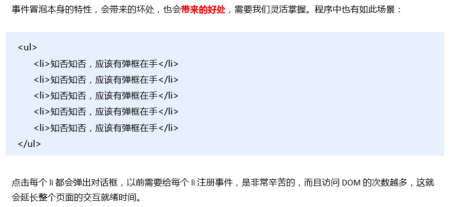


~~~javascript
<!DOCTYPE html>
<html lang="en">

<head>
    <meta charset="UTF-8">
    <title>Document</title>
</head>

<body>
    <ul>
        <li>知否知否，点我应有弹框在手！</li>
        <li>知否知否，点我应有弹框在手！</li>
        <li>知否知否，点我应有弹框在手！</li>
        <li>知否知否，点我应有弹框在手！</li>
        <li>知否知否，点我应有弹框在手！</li>
    </ul>
    <script>
        // 事件委托的核心原理：给父节点添加侦听器， 利用事件冒泡影响每一个子节点
        var ul =  document.querySelector('ul');
        ul.addEventListener('click',function(e){
            //点击的是li,li会冒泡，传给ul，于是触发ul的事件
            //alert('知否知否，点我应有弹框在手!');
            
            //e.target这个可以得到我们点击的对象
            //console.log(e.target);
            //pink外面要加引号！！！！！
            e.target.style.backgroundColor = 'pink';
        })
    </script>
</body>
</html>
~~~

## 3.document的load 和ready有什么区别

`document ready`
语法

~~~javascript
$(document).ready(function(){})
// 或者简写
$(function(){})
~~~

`document load == window.onload
`语法

~~~javascript
$(document).load(function(){})
// 原生js
window.onload = function() {}
~~~

dom文档执行顺序：

1. 解析HTML结构
2. 加载外部脚本和样式表文件
3. 解析并执行脚本代码
4. 构建html dom模型      // ready
5. 加载图片等外部文件
6. 页面加载完毕               // load

## 4.写一个函数找出给定数组中的最大差值 

> 先排序再减

方法1：

~~~javascript
function maxStep (arr) {
      return Math.max.applay(null, arr) - Math.min.apply(null, arr);
}
~~~

方法2：

~~~javascript
function difference(arr) {
	return Math.max(...arr) - Math.min(...arr)
}

var arr = [1,2,3,4,5,6];
console.log(difference(arr));
~~~

## 5.写出4个使用this的典型例子

* 构造函数

~~~javascript
function Contructor(name){
  this.name = name
}
~~~

* 模版解析渲染(例子略)
* call bind apply 使用this

~~~javascript
  setTimeout(function(){}.bind(this),1000)
~~~

* 补充调用上下文

~~~javascript
const ctx = {
  a:1,
  test(){
    console.log(this.a);
  }
};
ctx.test();
~~~

## 6.JSONP的原理是什么？解决什么问题

**原理：**

动态插入script标签，执行callback回调函数，将回调函数中的参数输出

**解决：**

解决跨越问题

**缺点：**

不支持post

**解决跨域方案：**

- 方向代理 webpack 配置 nginx 配置
- 设置cors http header 

## 7.写一个方法，使得sum(x)(y)和sum(x,y)返回的结果相同

~~~javascript
var sum= function(x){
    if(arguments[1]){
        return x + arguments[1];
    }else{
        return function (y){
            return x + y
        }
    }
}
console.log(sum(1)(2))//3
console.log(sum(1,2))//3
~~~

## 8.请说下你对`__proto__`和prototype的理解

- 只有函数对象才有prototype属性；prototype对象上存放共用的方法和属性
- 对象都有`__proto__`属性，`__proto__`是指向该对象构造函数的原型属性（即prototype）

~~~javascript
function Parent(name){
  this.name = name
}
Parent.prototype = {
  contructor:Parent,
  speak:function(){
    console.log(`我是${this.name}`)
  }
}
var children = new Parent('xiaoming')
children.name  // xiaoming
children.speak() // 我是xiaoming
children.__proto__ ===Parent.prototype  // true       
Parent.prototype.__proto__ === Object.prototype  // true  
children.toString()  // "[object Object]"
~~~

上面可以看出通过`__proto__`属性我们可以拿到Object原型对象上的属性和方法，原型对象上的`__proto__`又指向该构造函数的prototype，从而形成了一条原型链。上面children能够使用toString方法的原因。

## 9.写一个格式化金额的方法

[Intl.NumberFormat](https://developer.mozilla.org/en-US/docs/Web/JavaScript/Reference/Global_Objects/Intl/NumberFormat)

如果是格式成三位一逗的话：

~~~javascript
var number = 123456.789;
new Intl.NumberFormat('en-GB', { style: 'currency', currency: 'USD' }).format(number)
// expected output: "US$123,456.79"
~~~

其他方法还包括 `toLocalString` 或者使用正则匹配 `/[0-9](?=(?:[0-9]{3})+(?![0-9]))/g`

题目需要你自己审下，正如我们实际工作中，产品经理不可能所有的情况都给你列出来。其实格式化金额的细节还不少，这道题也在于考查分析题的能力，要不然返工的情况就会很多。
例如：

1. 用逗号分隔
2. 前面有0时，如：03
3. 前端有“.”时，如：.3
4. 输入的是非数字和.时
5. 要保留的不一定是2位，还有可能是1位，或者不要小数点
6. 如果要保留两位，如果位数不足是否要补0
7. 要四舍五入吗？还是向上取整？还是向下取整？还是……
8. 是否要加金额符号¥
9. ……
   当然你有可能会说这样开发效率会很慢，而且问题很多，不可能全部想全，但是以往的经验告诉我们，如果需求捋得很清楚，编码只不过仅仅是个体力活而已，而且返工率很少，质量就变得很高了。也可以早点下班了！很多的时候我们在修改bug的时间比写代码的时间还多的多，不是吗？

## 10.请实现一个flattenDeep函数，把多维数组扁平化

[数组扁平化]([https://my729.github.io/blog/algorithm/%E6%95%B0%E7%BB%84%E6%89%81%E5%B9%B3%E5%8C%96.html#%E6%8B%93%E5%B1%95%E8%BF%90%E7%AE%97%E7%AC%A6](https://my729.github.io/blog/algorithm/数组扁平化.html#拓展运算符))

> 概念
>
> 将一个多维数组变为一维数组
> [1, [2, 3, [4, 5]]] ------> [1, 2, 3, 4, 5]

### reduce方法实现

遍历数组每一项，若值为数组则递归遍历，否则concat

~~~javascript
function flatten(arr) {
  return arr.reduce((result, item) => {
    return result.concat(Array.isArray(item) ? flatten(item) : item)
  }, [])
}
~~~

reduce是数组的一种方法，它接收一个函数作为累加器，数组中的每个值（从左到右）开始缩减，最终计算为一个值

上面的reduce包含两个参数：回调函数，传给total的初始值。

### 数组的 toString方法结合 split方法

调用数组的toString方法，将数组变为字符串然后再用split分割还原为数组。

~~~javascript
function flatten(arr) {
  return arr.toString().split(',').map(item => {
    return Number(item)
  })
}
~~~

因为split分割后形成的数组的每一项值为字符串，所以需要用一个map方法遍历数组将其每一项转换为数值型。

### join方法和 split方法

和上面toString方法类似，join方法也可以将数组分割为字符串。

~~~javascript
function flatten(arr) {
  return arr.join(',').split(',').map(function(item) {
    return parseInt(item)
  })
}
~~~

###  递归

递归的遍历每一项，若为数组则继续遍历，否则concat。

~~~javascript
function flatten(arr) {
  var res = []
  arr.map(item => {
    if (Array.isArray(item)) {
      res = res.concat(flatten(item))
    } else {
      res.push(item)
    }
  })
}
~~~

### 拓展运算符

ES6的扩展运算符能将二维数组变为一维。

```js
[].concat(...[1, 2, 3, [4, 5]]);  // [1, 2, 3, 4, 5]
```

但是扩展运算符一次只能展开一层数组,所以做一个遍历，若arr中含有数组则使用一次扩展运算符，直至没有为止

```js
function flatten(arr) {
  while (arr.some(item => Array.isArray(item))) {
    arr = [].concat(...arr)
  }
  return arr
}
```

### ES10的flat方法

[参考地址](https://developer.mozilla.org/zh-CN/docs/Web/JavaScript/Reference/Global_Objects/Array/flat)

参数【可选】：指定嵌套数组中的结构深度，默认值为1, Infinity展开所有

~~~javascript
var arr1 = [1, 2, [3, 4]];
arr1.flat(); 
// [1, 2, 3, 4]

var arr2 = [1, 2, [3, 4, [5, 6]]];
arr2.flat();
// [1, 2, 3, 4, [5, 6]]

var arr3 = [1, 2, [3, 4, [5, 6]]];
arr3.flat(2);
// [1, 2, 3, 4, 5, 6]

//Infinity展开所有嵌套数组
arr3.flat(Infinity); 
// [1, 2, 3, 4, 5, 6]
~~~

## 11.写一个方法获取图片的原始宽高

~~~javascript
    function loadImageAsync(url) {
        return new Promise(function(resolve, reject) {
            var image = new Image();

            image.onload = function() {
                var obj = {
                    w: image.naturalWidth,
                    h: image.naturalHeight
                }
                resolve(obj);
            };

            image.onerror = function() {
                reject(new Error('Could not load image at ' + url));
            };
            image.src = url;
        });
    }
~~~

> H5中img标签新增了两个属性naturalWidth和naturalHeight可以获取图片的原始尺寸

## 12.有用过HTML5的WebWork吗？它主要解决了什么问题

[HTML5学习之WebWork多线程处理](https://www.cnblogs.com/ccnNL/p/9911248.html)

[WebWork深入浅出](https://blog.csdn.net/u010955843/article/details/48317587)

多线程技术在服务端技术中已经发展的很成熟了，而在Web端的应用中却一直是鸡肋

在新的标准中，提供的新的WebWork API，让前端的异步工作变得异常简单。

使用：创建一个Worker对象，指向一个js文件，然后通过Worker对象往js文件发送消息，js文件内部的处理逻辑，处理完毕后，再发送消息回到当前页面，纯异步方式，不影响当前主页面渲染。

~~~html
<!DOCTYPE html>
<html xmlns="http://www.w3.org/1999/xhtml">
<head>
<meta http-equiv="Content-Type" content="text/html; charset=utf-8"/>
    <title></title>
    <script type="text/javascript">
        //创建线程 work对象
        var work = new Worker("work.js");      //work文件中不要存在跟ui代码
        //发送消息
        work.postMessage("100");
        // 监听消息
        work.onmessage = function(event) {
            alert(event.data);
        };
    </script>
</head>
<body>

</body>
</html>
~~~

~~~javascript
onmessage = function (event) {
    //从1加到num
    var num = event.data;
    var result = 0;
    for (var i = 1; i <= num; i++) {
        result += i;
    }
    postMessage(result);
}
~~~

> 主要解决了单线程的问题 由于js执行环境是单线程 所以当处理cpu密集型问题时就没办法了 这时候就可以使用webwork开启一个子线程进行处理

## 13.举例子说明Javascript的变量声明提升和函数声明提升

~~~javascript
var getName = function(){
  console.log(4);
}

function getName() {
  console.log(5);
}

getName(); // 4 函数声明优先级高于var声明,  故 4 覆盖了 5
~~~

### 变量声明

```javascript
console.log(a);		//undefinded
var a = "hello world";
console.log(a);		//"hello world"
```

## 函数声明

```javascript
f();
function f(){
    console.log('hello world');		//"hello world"
}
```

**变量声明只提升声明 不提升赋值操作，函数声明 函数体整体被提升。**

## 14.如何让(`a==1 && a==2 && a==3`)的值为true，把"`=="换成"===`"后还能为true吗

[参考连接](https://juejin.im/post/6844903725442531341)

方法1：

~~~javascript
var val = 0;

Object.defineProperty(global, 'a', {
  get: function(){
    return ++val;
  }
})
~~~

方法2：

~~~javascript
const a = { value : 0 };
a.valueOf = function() {
    return this.value += 1;
};

console.log(a==1 && a==2 && a==3); //true
~~~

~~~javascript
var value = 0; //window.value
Object.defineProperty(window, 'a', {
    get: function() {
        return this.value += 1;
    }
});

console.log(a===1 && a===2 && a===3) // true
~~~

## 15.说说你对数据类型转换的理解是什么？类型转换的方法有哪些

[JS 数据类型方面的蹊跷](https://github.com/forever-z-133/blogs/issues/13)

* 数据类型的转换有显式转换和隐式转换

* 显示转化：Boolean，Number，String， parseInt,parseFloat, toString, JSON.stringify
* 隐式转换：运算符号, 流程控制（if,while）

## 16.请解释下什么是cookIE隔离？为什么要隔离？如何隔离

如果静态文件放在后台（前后端不分离时候），那静态文件请求的时候都带有的cookIE的数据提交给server的，非常浪费流量， 所以不如隔离开。

cookIE有域的限制，因此不能跨域提交请求，故使用非主要域名的时候，请求头中就不会带有cookIE数据，
这样可以降低请求头的大小，降低请求时间，从而达到降低整体请求延时的目的。

同时这种方式不会将cookIE传入Web Server，也减少了Web Server对cookIE的处理分析环节，提高了webserver的http请求的解析速度。

## 17.举例子说说你对JS隐式类型转换的理解

JS在做运算的时候遇到两边的数据类型不统一就会尝试着转换成统一的类型做运算，这个过程称为隐式转换。

JS中双等号比较的时候也会产生隐式类型转换，所以才推荐采用三个等号进行比较是否相等。另外比如`let a=1;b=''+a;`b就会变成字符串的1，这种隐式类型转换。

## 18.formData主要是用来做什么的？它的操作方法有哪些

用于后端参数处理为`multipart/form-data`的情况下 ，现在通常用于上传文件。

利用 FormData 对象，可以通过 JavaScript 键值对来模拟一系列表单控件，还可以使用 XMLHttpRequest的 `send()` 方法来异步提交表单。

## 19.说说你对Base64的理解，它的使用场景有哪些

[彻底弄懂Base64编码原理](<https://www.bilibili.com/video/BV1DJ411t7j2?from=search&seid=3208865271036458803>)

[base64](<https://baike.baidu.com/item/base64/8545775?fr=aladdin>)

[让你完全理解base64是怎么回事](https://www.cnblogs.com/sweeeper/p/8462077.html)

### Base64到底能干什么

* 转码
* 图片
* 装逼
* 加、解密
* 编、解码
* 向浏览器以字符串输出

Base64是网络上最常见的用于传输8Bit字节码的编码方式之一，Base64就是一种基于64个可打印字符来表示二进制数据的方法。可查看RFC2045～RFC2049，上面有MIME的详细规范。

Base64编码是从二进制到字符的过程，可用于在HTTP环境下传递较长的标识信息。采用Base64编码具有不可读性，需要解码后才能阅读。

Base64由于以上优点被广泛应用于计算机的各个领域，然而由于输出内容中包括两个以上“符号类”字符（+, /, =)，不同的应用场景又分别研制了Base64的各种“变种”。为统一和规范化Base64的输出，Base62x被视为无符号化的改进版本。

base64不会发起网络请求，所以，很多以前需要雪碧图解决的问题，用base64解决也挺好的。

* 上传图片时 先将图片转化为base64 然后上传
* 对于小质量的图片 我们可以转化为base64 在页面展示
* url 通过base64加密

## 20.Ajax请求中get和post方式有什么区别呢？分别在哪些场景下使用

### get

* GET请求会将参数跟在URL后进行传递，也就是会在url中显示
* GET请求有数据长度限制，一般在2000个字符，而POST没有。
* GET方式请求的数据会被浏览器缓存起来，POST没有
* GET在某些情况下会有安全问题，POST没有。
* 在客户端使用GET请求时,服务器端使用Request.QueryString来获取参数
* GET请求参数会在url中显示，容易被他人窃取，POST在请求体中，不会被窃取

### POST

* POST请求是作为HTTP消息的实体内容发送给WEB服务器。
* 客户端使用POST请求时,服务器端使用Request.Form来获取参数。 
* POST一般用于修改服务器上的资源，对所发送的信息没有限制。
* POST比GET更加安全
* POST需要设置请求头

> GET用于资源可被缓存的请求 一般用于查
>
> POST用于提交操作 一般用于增删改

## 21.说说你对深浅拷贝的理解？并实现一个对数组和对象深拷贝的方法

[Object.assign()](https://developer.mozilla.org/zh-CN/docs/Web/JavaScript/Reference/Global_Objects/Object/assign)

### 为什么要进行拷贝

~~~javascript
var obj1={
    value: 'a'
};
var obj2 = obj1;
obj2.value='b';
console.log(obj1);	//{ value: 'b' }
~~~

因为**对象是引用类型**，所以赋值时的操作仅是赋予相同的地址，当对其中一个对象进行操作时，就会影响其他的对象。解决这个问题就需要拷贝了。

### 浅拷贝

使用原生的`Object.assign() `方法就可以实现浅拷贝。

~~~javascript
var obj1={
    value: 'a'
};
var obj2 = Object.assign({},obj1);
obj2.value='b';
console.log(obj1);	//{ value: 'a' }
~~~

但是如果拷贝的源对象当中包含对象时，`OBject.assign()`方法只会拷贝对象的引用地址。

~~~javascript
var obj1={
    value: 'a',
    obj3:{
        value2: 'c'
    }
};
var obj2 = Object.assign({},obj1);
obj2.obj3.value2='b';
console.log(obj1);	//{ value: 'a', obj3:{ value2: 'b' }}
~~~

### 深拷贝

如果要拷贝的对象中包含对象，就需要深拷贝了，一般使用原生的方法`JSON.parse(JSON.stringify(obj))`。

~~~javascript
j1={
    value: 'a',
    obj3:{
        value2: 'c'
    },
    arr:[1,2,3]
}
var obj2 = JSON.parse(JSON.stringify(obj1));
obj2.obj3.value2='b';
obj2.arr[0]= "a";
console.log(obj2);//{ value: 'a', obj3:{ value2: 'b' }, arr:['a',2,3] }
console.log(obj1);//{ value: 'a', obj3:{ value2: 'c' }, arr:[1,2,3] } 没有发生改变
~~~

### 实现一个对数组和对象的深拷贝的方法

~~~javascript
var obj={
    name: 'znl',
    age: 18,
    frIEnd:{
        name: 'borys',
        age: 20
    },
    arr:[1,2,[3,4]]
}

function copy(obj){
    var type=Object.prototype.toString.call(obj);
    if(!(type == '[object Array]' || type == '[object Object]')){
        return 'Type Error!';
    }
    return JSON.parse(JSON.stringify(obj));
}

var obj2= copy(obj);
console.log(obj.frIEnd === obj2.frIEnd);	//false
console.log(obj.arr === obj2.arr);	//false
~~~

## 22.写一个字符串重复的repeat函数

方法1：

~~~javascript
var str='abcd';
function repeat(str,n){
    var type = typeof(str) === 'string';
    var result='';
    if(!type){
        return 'Type Error';
    }
    for(var i=0;i<n;i++){
        result += str;
    }
    return result;
}
repeat(str,2);//'abcdabcd'
~~~

方法2：

~~~javascript
const repeat = (str, n)=>str.repeat(n)
~~~

## 23.移动端点击事件为什么会有延迟？有哪些方法可以解决

原因：等待300ms看用户是点击还是双击缩放
解决办法：禁止缩放、设置默认视口宽度为设备宽度、设置`css touch-action:none`、使用`fastclick.js`插件

> 现在你只要设置了, vIEwpoint, 手机浏览器就会默认禁止300ms延迟了。

视口延迟判断，300ms之内会不会有下一次点击操作，如果有就是放大缩小，没有就是点击事件。
fastclick主要的原理就是，创建了一个div，并且执行了这个div的点击事件并且取消默认事件，再隐藏这个div。

## 24.写一个方法随机生成指定位数的字符串

~~~javascript
function getRandomString (length) {
  let str = Math.random().toString(36).substr(2)
  if (str.length >= length) {
	return str.substr(0, length)
  }
  str += getRandomString(length - str.length)
  return str
}
~~~

## 25. js中`=、==、===`三个的区别是什么？并说明它们各自的工作过程

- `=`是赋值运算符
  - 它遵循右结合律
  - 它返回 lhs （但在声明语句（`var`, `let`, `const`）中返回 `undefined`）
  - 若 rhs 是 primitive value （`number`, `string`, `symbol`, `undefined`, `boolean`) 则 lhs 被赋值为该值
  - 若 rhs 是 object 则 lhs 被赋值为指向该 object 的 reference
  - `const` 声明的不变量不能被再次赋值，否则会 throw `ReferenceError`
  - 如果在局部作用域不使用声明语句就给一个既未声明于局部作用域，也未声明于任何上层作用域的变量赋值，那它将会被创建为一个全局变量。不应该如此使用。
- `==`是带有 implicit type conversion 的判等运算符
  - 它遵循左结合律
  - 它返回 `boolean`
  - 个人认为背诵它的规则没有意义，实际开发时也不会使用
- `===`是严格的判等运算符
  - 它遵循左结合律
  - 它返回 `boolean`
  - 若两侧是 primitive value 则判断两侧值是否相等
  - 若两侧是 object 则判断两侧 reference 是否指向同一块内存

## 26.说说instanceof和typeof的实现原理并自己模拟实现一个instanceof

[JS instanceof 疑惑?](https://www.zhihu.com/question/51919771)

题主 instanceof 人类 -> true
人类 instanceof 物种 -> true
题主 instanceof 物种 -> false

instanceof 不是集合概念里的包含关系，不具有传递性。

> 不具备传递性的原因是Array在左边时比较的是__proto__，在右边时比较的是prototype

- `instanceof`：利用原型链判断“父级”的原型（`prototype`）对象是否在“实例”的原型链上；
- `typeof`：直接根据变量值得内存标识符进行判断；

- `instanceof`

  - 返回 `boolean`

  - 通过调用 class 的 `[Symbol.hasInstance]` static method 来判断一个 object 是否是一个 class 的 instance

  - 缺省行为：判断 object 的 prototype chain 中是否有任意一个 prototype 与 class 的 prototype 相等

  - 案例1:

    ```javascript
    interface IConstructor<T> {
      new(...args: any[]): T
    }
    
    function isObject(o: any) {
      return (typeof o === 'object' || typeof o === 'function') && o !== null
    }
    
    function instanceOf<T>(obj: any, cls: IConstructor<T>): obj is T {
      if (isObject(cls)) {
        if (typeof cls[Symbol.hasInstance] === 'function')
          return cls[Symbol.hasInstance](obj)
        else if (typeof cls === 'function') {
          if (isObject(cls.prototype))
            return cls.prototype.isPrototypeOf(obj)
          else return false
        } else throw new TypeError('cls is not callable')
      } else throw new TypeError('cls is not an object')
    }
    ```

  - 案例2

    ~~~javascript
    function new_instance_of(leftVaule, rightVaule) { 
        let rightProto = rightVaule.prototype; // 取右表达式的 prototype 值
        leftVaule = leftVaule.__proto__; // 取左表达式的__proto__值
        while (true) {
        	if (leftVaule === null) {
                return false;	
            }
            if (leftVaule === rightProto) {
                return true;	
            } 
            leftVaule = leftVaule.__proto__; 
        }
    }
    ~~~

  - 案例3：

    ~~~javascript
    function instanceOf(object, constructor) {
    	if (typeof object !== "object" || object === null) {
    		return false;
    	}
    
    	// 原答案 if (object.constructor === constructor) {
            if (object === constructor.prototype) {
    		return true;
    	} else {
    		return instanceOf(object.__proto__, constructor);
    	}
    }
    ~~~

- `typeof`

  - 返回 `'string', 'number', 'undefined', 'boolean', 'object', 'function', 'symbol'`
  - 获取数据底层的类型标签。

## 27.请快速答出此题的答案并解释：`var x, y = 1; x + y = ?`

var x, y=1 是赋值操作。x 没有给值仅给出了定义，那么 x = undefined，而 y=1。

`undefined+1 = NaN`

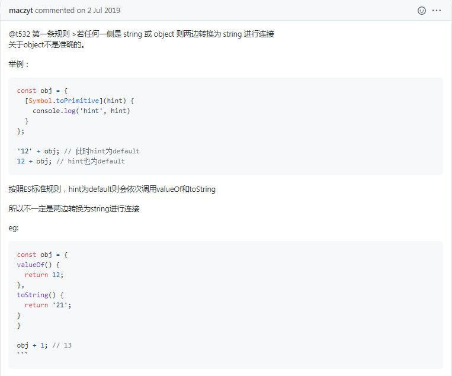

## 28.举例说明数组和对象的迭代方法分别有哪些

ES5中为数组定义了5个迭代方法。每个方法都要接收两个参数：要在每一项上面运行的函数和（可选的）运行该函数的作用域对象——影响this的值。

迭代数组：

* every()和some();
  every()：对数组中的每一项运行给定函数，如果每一项都返回true，则返回true，否则false；
  some()：对数组中的每一项运行给定函数，如果至少有一项返回true，则返回true，否则false；
* map()和filter();
  filter()：对数组中的每一项给定函数，返回值为true的项重新组成新的数组；
  map()：岁数组中的每一项给定函数，返回每一项调用这个函数的结果；
* forEach();
  forEach()：对方法中的每一项运行给定函数。这个方法没有返回值；

迭代对象:

* 用for-in遍历对象
* 用for-of遍历类数组对象（ES6）
* 用Object.keys()获取对象属性名的集合

## 29.举例说明什么是IIFEs？它有什么好处

**I**nstantly **I**nvoked **F**unction **E**xpression 即时调用函数表达式。

### 示例

```javascript
;(function () {
    // ... statements
    return ...
)()
```

- 最好在 IIFE 前追加分号 `;` 来避免解析时与前一个表达式合并出现问题

### 好处

- 创建一个局部作用域隔离变量；但在 ES6 拥有了块级作用域后变得没有必要，可以用语句块 `{ ... }` 配合 `let`/`const` 替代

- 将运行逻辑转化为可求值的表达式，弥补 JavaScript 基本逻辑语句不是表达式的缺陷

  - e.g.

    ```javascript
    const a = (() => {
        if (...) return 1
        else return 0
    })()
    ```

    基本等价于

    ```javascript
    let a
    if (...) a = 1
    else a = 0
    ```

> 在v8引擎架构里，对于top-level 的代码会做 pre-parsing 来检测是否有语法错误。然而这是一种性能浪费，应为在full-parsing 的时候遇到语法错误自然会抛错。 所以V8 提供了一种hack方式就是IIFE，绕过对top-level代码的 pre-parsing

## 30.举例说明什么是decodeURI()和encodeURI()是什么

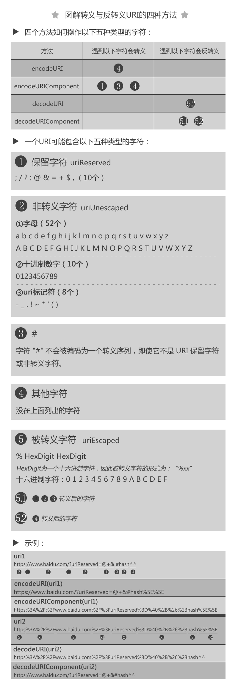

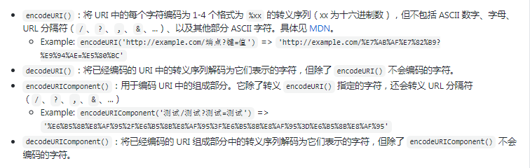

## 31.在JS中怎么捕获异常？写出来看看？应该在哪些场景下采用呢

~~~javascript
try {
    ...
    throw ...
    ...
} catch (err) {
    ...
} finally {
    ...
}
~~~

- 通过 throw 语句抛出错误；理论上可以抛一切值，但实际上建议只抛 Error 对象；
- try 块内 throw 的错误会导致停止执行，并将抛出的对象传给 catch 块；
  - 从 ES2017 开始，如果不需要获取抛出的对象，则 catch 块 可以直接写为 `catch { ... }`
- catch 块一般用于对错误进行处理；
- finally 块中的语句不论是否抛出错误，都会执行。

该在什么场景下用？所有你不想让用户接手的错误处理都应该用。

## 32.用JS实现一个九九乘法口诀表

方法1：

~~~javascript
const MAX_WIDTH = 7
let table = ''
for (let rhs = 1; rhs <= 9; rhs++) {
    for (let lhs = 1; lhs <= 9; lhs++) {
        if (lhs <= rhs) table += `${lhs}*${rhs}=${lhs * rhs}`.padEnd(MAX_WIDTH)
    }
    table += '\n'
}
console.log(table)
~~~

方法2：

~~~javascript
function row(num) {
	const numMap = {
		1: '一',
		2: '二',
		3: '三',
		4: '四',
		5: '五',
		6: '六',
		7: '七',
		8: '八',
		9: '九'
	}

	return new Array(num).fill(0).map((val, idx) => {
		const n = idx + 1
		const res = n * num
		const resStr = res > 9 ? numMap[String(res)[0]] + '十' + (numMap[String(res)[1]] || '') : numMap[res]
		return `${numMap[n]}${numMap[num]}${res < 10 ? '得' : ''}${resStr}`
	}).join('\t')
}


const table = new Array(9).fill(0).map((val, idx) => row(idx + 1)).join('\n')

console.log(table)
~~~

## 33.举例说明JS如何实现继承

JS常采用寄生组合式继承,每个对象特有的属性在构造函数重新创建,每个对象共用的属性方法写在原型对象上,利用每个对象的_proto_属性沿着原型链往原型找与键对应的属性,找到则返回对应的属性;
ES6中增加class语法糖,本质上没什么区别,但是统一了ES6之前五花八门的继承写法。

~~~javascript
  class Person{
    constructor(name){
      this.name = name;
    }
    sayHi(){
      console.log(`my name is ${this.name}`);
    }
  }

  class Man extends Person{
    constructor(name,age){
      super(name);
      this.age = age;
    }
    sayAge(){
      console.log(`I am ${this.name}, I am ${this.age} years old`);
    }
  }

  let p_man = new Man('tom',19);
  p_man.sayAge(); // I am tom, I am 19 years old
  p_man.sayHi(); // my name is tom
~~~

## 34.请描述你对浏览器同源策略的理解

同源策略（Same origin policy）是一种约定，它是浏览器最核心也最基本的安全功能，如果缺少了同源策略，则浏览器的正常功能可能都会受到影响。 可以说Web是构建在同源策略基础之上的，浏览器只是针对同源策略的一种实现。 同源策略，它是由Netscape提出的一个著名的安全策略。

同源的三个要素：

* 协议相同
* 端口相同
* 域名相同

跨域的方式包括：后端设置header、JSONP、正向代理、CORS、WebSocket等。

## 35.JS延迟加载的方式有哪些

* defer 属性
* async 属性
* 动态创建DOM方式
* 使用jQuery的getScript方法
* 使用setTimeout延迟方法
* 让JS最后加载

## 36.把Script标签放在页面最底部的`</body>`之前和之后有什么区别？浏览器会如何解析它们

因为js 可以操作DOM ，所以浏览器在渲染HTML代码时，遇到`<script>`标签会先解析所有的js，解析完成之后继续向下解析。所以`<script>`放在底部最后加载比较好，大多数都是这样的。
但是如果你的JS会改变全局的样式，比如一个JS文件会改变所有的字体，那就应该放在前了，让它优先解析。

> 前面：先解析完JS再渲染界面
> 后面：渲染完界面再解析JS

HTML 2.0起放在“body标签闭合之后”就是不合标准的。之所以但是浏览器却不会报错，是因为如果在“body标签闭合之后”后再出现script或任何元素的开始标签，都是parse error，浏览器会忽略之前的，即视作仍旧在body内。所以实际效果和写在“body标签闭合之前”之前是没有区别的。所以要么放head标签里，要么放 `<body>` 之前。

> 放在之前,解析到script标签的时候,解析中断,并且阻断其他HTML解析(因为HTML并不知道js里面会不会有什么改变DOM结构,故在此中断);
> 放在之后,DOM渲染完成,不过,用户操作页面的时候,有可能JS还没响应。

## 37.请写一个sleep（暂停）函数

- 不要写同步的暂停函数。它会让你的程序卡死。
- 写一个异步的暂停函数，这样可以在任何 `async function` 中暂停，且只暂停这一部分代码。

~~~javascript
function sleep(milliseconds: number) {
    return new Promise<void>(resolve =>
        setTimeout(resolve, milliseconds))
}
void async function main() {
    // … do something …
    await sleep(5000)
    // … do something else …
}()
~~~

## 38.判断instanceof的结果并解释原因 [代码]

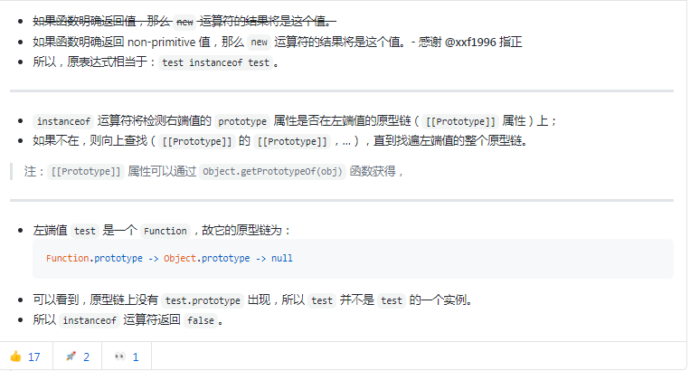

## 39.JS异步加载有哪些方案(重复)

(和第35题重复)

* 使用defer属性

  ~~~html
  <html>
  <head>
      <script defer type='text/javascript'></script>
  </head>
  <body >.....</body>
  </html>
  ~~~

  > 这种方案会**并行**加载DOM树和下载JS脚本，JS脚本下载后会**等DOM树解析完再执行**

* 使用async属性

  ~~~html
  <html>
  <head>
      <script async type='text/javascript'></script>
  </head>
  <body >.....</body>
  </html>
  ~~~

  > 这种方案也会并行加载DOM树和下载JS脚本，JS脚本下载完后立刻并行执行

* 将script标签放在body结束标签之前

  ~~~html
  <html>
  <head></head>
  <body>
   .....
  <script type="text/javascript" src='...'></script>
  </body>
  </html>
  ~~~

  > 这种方案会先加载DOM树，然后再加载JS脚本

* 在onload方法中给DOM树动态添加script标签

  ~~~html
  <html>
  <head></head>
  <body onload="() => {
    var element = document.creatElement('script');
    element.type = 'text/javascript';
    element.src = '...';
    var headTag = document.getElementsByTagName('head')[0];
    headTag.insertBefore(element, headTag.firstChild);
  }">
  .....
  </body>
  </html>
  ~~~

  > 这种方案也是先加载DOM树，然后触发onload方法添加script标签加载JS脚本

* 9012 年不得不提` <script type="module">`（自带 defer 效果） 和 动态加载模块的 import() 函数，配合 async/await 我忍不住说真香！

## 40.写个方法随机打乱一个数组

* 随机交换

  ~~~javascript
  function shuffle(arr) {
      arr.forEach((_, idx) => {
          const targetIdx = Math.floor(Math.random() * arr.length)
          ;[arr[idx], arr[targetIdx]] = [arr[targetIdx], arr[idx]]
      })
      return arr
  }
  shuffle([1, 2, 3, 4, 5, 6, 7, 8, 9, 10])
  // => [6, 4, 1, 8, 5, 2, 10, 9, 3, 7] or else
  ~~~

* 打乱下标（慢了 300-1000 倍左右）

  ~~~javascript
  function shuffleSubscript(n) {
      const arr = new Array(n)
      for (let i = 0; i < n; i++) {
          let val
          do val = Math.floor(Math.random() * n)
          while (arr.includes(val))
          arr[i] = val
      }
      return arr
  }
  
  function shuffle(arr) {
      return shuffleSubscript(arr.length).map(s => arr[s])
  }
  
  shuffle([1, 2, 3, 4, 5, 6, 7, 8, 9, 10])
  // => [7, 4, 5, 8, 6, 3, 1, 2, 10, 9] or else
  ~~~

* 懒人版

  ~~~html
  [1, 2, 3, 4, 5, 6, 7, 8, 9, 10].sort(() => Math.random() - 0.5)
  ~~~

  > 这个方法并不是一个很好的打乱实现，它导致每个元素仍有很大的可能在原位附近。
  > [分析链接](https://blog.oldj.net/2017/01/23/shuffle-an-array-in-javascript/#comment-1466)

## 41.请描述下null和undefined的区别是什么？这两者分别运用在什么场景

null 是“空值”，表示某个对象/资源并不存在；undefined 是指一个属性或变量还未赋值。

当一个变量本该存储一个对象，或一个函数应该返回一个对象，但这个对象却并不存在时，使用 null 来表示这种情况；

当一个属性或变量没有赋值，又或是一个函数没有返回值（如 C++ 里的 void），则它是 undefined；但通常我们不会将一个变量主动地赋为 undefined。

## 42.解释下为什么`{} + [] === 0`为true

那个 `{}` 是空语句块而非空对象

~~~javascript
{} + [] === 0
+[] === 0
0 === 0
true
~~~

> 因为 +[] 为0，而{}是空的，所以 0 === 0;

## 43. JS的函数有哪几种调用形式

`function fn(){}`

- 正常的函数调用
  `fn()`
- 作为对象方法调用
  `let obj = {fn:function(){}};`
  `obj.fn()`
- 使用构造函数调用
  `new fn()`
- 使用call或apply调用
  `fn.call() || fn.apply()`

## 44. 用JS写出死循环的方法有哪些

* `while`

```javascript
while (true) {

}
```

* `for`

```javascript
for (;;) {

}
```

## 45.分别写出数组的交集、并集、差集、补集这四个方法

方法1：

~~~javascript
const intersect = (a, b) => a.filter(i => b.includes(i)) // 交
const exclude = (a, b) => a.filter(i => !b.includes(i)) // 差
const union = (a, b) => exclude(a, b).concat(b) // 并
const unionAll = (a, b) => a.concat(b) // 重复并
const xor = (a, b) => exclude(a, b).concat(exclude(b, a)) // 补
~~~

这几个方法全是 O(n^2^) 的复杂度…性能很差。

方法2：

~~~javascript
/**
 * 分别写出数组的交集、并集、差集、补集这四个方法
 */

// 交集
const getIntersection = (arr1, arr2) => {
  if (!Array.isArray(arr1) || !Array.isArray(arr2)) {
    return "Params must be array.";
  }

  // 将 arr1 与 arr2 每项都 stringify 化，可以进行对象的比较
  const arr1Formatted = arr1.map((item) => JSON.stringify(item));
  const arr2Formatted = arr2.map((item) => JSON.stringify(item));

  return arr1Formatted
    .filter((item) => arr2Formatted.includes(item))
    .map((item) => JSON.parse(item));
};

// 并集
const getUnion = (arr1, arr2) => {
  if (!Array.isArray(arr1) || !Array.isArray(arr2)) {
    return "Params must be array.";
  }

  // 将 arr1 与 arr2 每项都 stringify 化，可以进行对象的比较
  const arr1Formatted = arr1.map((item) => JSON.stringify(item));
  const arr2Formatted = arr2.map((item) => JSON.stringify(item));
  return arr1Formatted
    .filter((item) => !arr2Formatted.includes(item))
    .concat(arr2Formatted)
    .map((item) => JSON.parse(item));
};

// 差集
const getDiff = (arr1, arr2) => {
  if (!Array.isArray(arr1) || !Array.isArray(arr2)) {
    return "Params must be array.";
  }

  // 将 arr1 与 arr2 每项都 stringify 化，可以进行对象的比较
  const arr1Formatted = arr1.map((item) => JSON.stringify(item));
  const arr2Formatted = arr2.map((item) => JSON.stringify(item));

  return arr1Formatted
    .filter((item) => !arr2Formatted.includes(item))
    .map((item) => JSON.parse(item));
};

// 补集
const getComplement = (arr1, arr2) => {
  if (!Array.isArray(arr1) || !Array.isArray(arr2)) {
    return "Params must be array.";
  }

  return getUnion(getDiff(arr1, arr2), getDiff(arr2, arr1));
};

const arr1 = [1, 2, 3, 4, 5, 6];
const arr2 = ["a", "b", 3, 4, 6, 7, 8];
getIntersection(arr1, arr2);
getUnion(arr1, arr2);
getDiff(arr1, arr2);
getComplement(arr1, arr2);

const brr1 = [1, {a: 1, b: 2}, 3, 4, [2, 3, 3], 6];
const brr2 = [{a: 1}, {a: 1, b: 2}, 3, 4, 6, [2, 3, 3], 8];
getIntersection(brr1, brr2);
getUnion(brr1, brr2);
getDiff(brr1, brr2);
getComplement(brr1, brr2);
~~~

## 46.要实现一个JS的持续动画，你有什么比较好的方法

`requestAnimationFrame`：浏览器专门为JS动画提供的API。

## 47.写例子说明如何给li绑定事件（ul下有1000+个li）

回答1：

首选事件代理

```javascript
  <ul>
    <li>1111111111111</li>
    <li>2222222222222</li>
    <li>3333333333333</li>
    <p>44444444444</p>
  </ul>
  <script>
    document.querySelector('ul').addEventListener('click', function (e) {
      if (e.target.tagName === 'li') {
        // ...
      }
    })
  </script>
```

> 用事件委托直接将事件绑定在父元素上，通过`target`属性判断是否为子元素触发事件；

回答2：

在不考虑任何情况时，直接使用 `$('li').addEventListener(event, fun)` 就可以对 `li` 进行事件绑定。

当子元素过多时，可以利用“事件冒泡”在 `ul` 上进行绑定，实现事件委托。可以利用 `event.target` 对被触发的子元素进行操作。

```javascript
document.getElementsByTag('ul')[0].addEventListener('event', (e) => {
	// 利用 e.target 对冒泡上来的元素做区分
	// e.target.nodeName, e.target.id 等
})
```

参考文章：[实例分析JavaScript中的事件委托和事件绑定](https://www.diguage.com/archives/71.html)

## 48.说说你理解的同步和异步的区别是什么

* 同步就是上一个任务结束下一个任务再开始，比如alert弹窗，你不点击确定他就会阻塞后边代码的执行；
* 异步就是按顺序开始（不可能同时开始）但是不一定按顺序结束，比如图片的加载就是走的异步。

## 49.不用第三方库，说说纯js怎么实现读取和导出excel

回单1：

目前只知道将后端给的二进制数据包装成`Blob`对象，然后进行导出：

~~~javascript
const blob = new Blob([res], { type: 'application/msexcel;charset=UTF-8' })
const url = URL.createObjectURL(blob)
const a = document.createElement('a')
a.href = url
a.click()
~~~

回答2：

~~~javascript
 let blob = new Blob([res.data],{type: "application/vnd.openxmlformats-officedocument.spreadsheetml.sheet"});
 let a = document.createElement('a')
 a.download = 'XXX.xlsx'
 a.href =URL.createObjectURL(blob) 
 document.body.appendChild(a)
 a.click();
~~~

## 50.分别封装精确运算的加减乘除四个方法 

[ESNext BigInt 提案](https://github.com/tc39/proposal-bigint)已经进入 Stage 3，哪天通过了就也不用写这些东西了

回答1：有瑕疵

刚好最近有写过，用来处理小数计算时的精度问题。

~~~javascript
function isObject(obj) {
  return Object.prototype.toString.call(obj) === '[object Object]';
}

/**
 * 专门处理数字运算
 * 并解决，1. 非数字型数字的运算 2. 小数计算的精度问题
 * count('+', 0.1, '0.2'); // 0.3
 */
function count(type, options) {
    var nums = [].slice.call(arguments, 2);
    var _startConfig = { '+': 0, '-': 0, '*': 1, '/': 1 };
    if (!(type in _startConfig)) return new Error('首位入参有误');

    // 可能往后会加入些配置，但如果不是对象则不是配置
    if (!isObject(options)) {
        nums.splice(0, 0, options);
    }

    // 小数点后面最长字符长度，比如 0.1 和 0.234 则返回 3
    var maxDotLength = nums.reduce(function(max, num) {
        return Math.max(max, ([num].toString().split('.')[1] || '').length);
    }, 0);

    // 改造成整数，并计算出结果，比如 0.1 + 0.2 改为 1+2
    var startNum = _startConfig[type];
    var pow = Math.pow(10, maxDotLength);
    var result = nums.reduce(function(re, num, index) {
        num = Number(num) * pow;
        if (type === '-' && index === 0) return num;
        switch (type) {
            case '-': return re - num;
            case '*': return re * num;
            case '/': return re / num;
            case '+': default: return re + num;
        }
    }, startNum);

    // 回退到原小数形态，比如 3 转为 0.3
    var _divideConfig = { '+': pow, '-': pow, '*': pow * pow, '/': 1 };
    result = result / _divideConfig[type];

    return result;
}
~~~

> 你的写法可以处理小数的不精确问题，但是无法处理大整数导致的 `Number.MAX_SAFE_INTEGER` 溢出问题。对于这个问题，解决方案通常是拆成多段计算。

回答2：这里贴上一段最近写的处理大整数加法的 C++ 代码，抛砖引玉。

~~~javascript
struct bigint {
    static const int limit = 10;
    
    int num[100003] { 0 };
    size_t size = 0;
    
    bigint() { bigint(0); }
    explicit bigint(unsigned long long i) {
        int pos = 0;
        while (i) {
            num[pos] = i % limit;
            pos++;
            size++;
            i /= 10;
        }
    }
    explicit bigint(const string &s) {
        size = s.size();
        for (int i = 0; i < s.size(); i++) {
            num[i] = s[size - i - 1];
        }
    }
    
    int &operator [](size_t rhs) {
        bigint &lhs = *this;
        return lhs.num[rhs];
    }
    int operator [](size_t rhs) const {
        const bigint &lhs = *this;
        return lhs.num[rhs];
    }
    
    bigint operator +(const bigint &rhs) const {
        const bigint &lhs = *this;
        size_t mlen = max(lhs.size, rhs.size);
        bigint result;
        for (size_t i = 0; i < mlen || result[i] >= limit; i++) {
            if (i < mlen)
                result[i] += lhs[i] + rhs[i];
            result.size = i + 1;
            if (lhs[i] + rhs[i] >= limit) {
                result.size++;
                result[i + 1] += result[i] / 10;
                result[i] = result[i] % 10;
            }
        }
        return result;
    }
};
~~~


# 软技能

## 1.你写文档一般用什么工具？Markdown有用过吗

我用的最多的是Typora,我的所有博文都是用Typora些的，用过Markdown，Typora用的就是Markdown语法。

## 2.说说你对CDN的理解，使用过程中有没有遇到过问题

[CDN是什么](<https://www.php.cn/faq/418857.html>)

  CDN的全称是Content Delivery Network，即内容分发网络。CDN是构建在网络之上的内容分发网络，依靠部署在各地的边缘服务器，通过中心平台的负载均衡、内容分发、调度等功能模块，使用户就近获取所需内容，降低网络拥塞，提高用户访问响应速度和命中率。CDN的关键技术主要有内容存储和分发技术。

采用CDN技术，最大的好处，就是加速了网站的访问——用户与内容之间的物理距离缩短，用户的等待时间也得以缩短

此外，CDN还有安全方面的好处。内容进行分发后，源服务器的IP被隐藏，受到攻击的概率会大幅下降。而且，当某个服务器故障时，系统会调用临近的健康服务器，进行服务，避免对用户造成影响。

项目中使用过CDN，我们的图片和脚本都放在CDN上，这样用户访问这些资源会更快，因为这些资源在不同的域名下，会一定程度避免http1.1的队头堵塞。有的CDN采用http2，速度更快。

有点不好就是：

1. 大部分CDN是单独收费的。
2. CDN更新资源麻烦，可能需要手动来刷新CDN来刷新资源的缓存。
3. 如果CDN出了故障，需要联系CDN提供商来解决，中间增加了沟通耗时。
4. 可能对SEO有影响，CDN ip的多样性，部分ip可能对爬虫并不友好。

## 3.有用过本地存储吗？有什么限制？有没有考虑过超出了限制怎么办

[localStorage、sessionStorage 、cookIE](https://blog.csdn.net/chenxi_li/article/details/101222770)

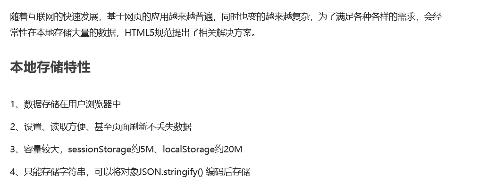

### window.sessionStorage

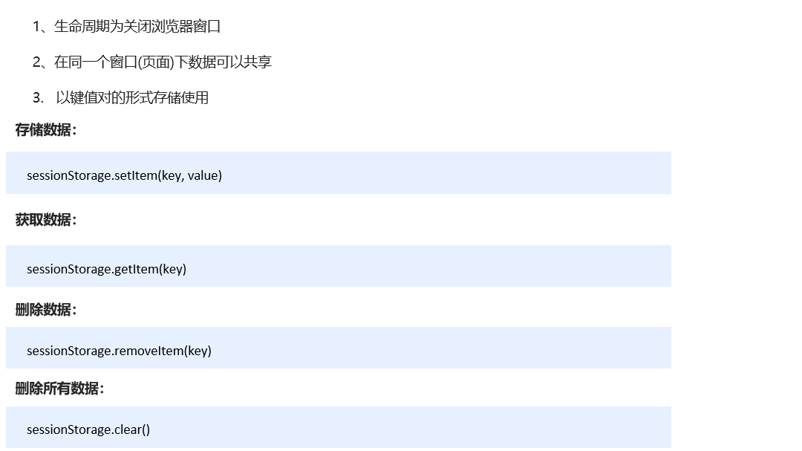

~~~javascript
<!DOCTYPE html>
<html lang="en">

<head>
    <meta charset="UTF-8">
    <title>Document</title>
</head>

<body>
    <input type="text">
    <button class="set">存储数据</button>
    <button class="get">获取数据</button>
    <button class="remove">删除数据</button>
    <button class="del">清空所有数据</button>
    <script>
        console.log(localStorage.getItem('username'));

        var ipt = document.querySelector('input');
        var set = document.querySelector('.set');
        var get = document.querySelector('.get');
        var remove = document.querySelector('.remove');
        var del = document.querySelector('.del');
        set.addEventListener('click', function() {
            // 当我们点击了之后，就可以把表单里面的值存储起来
            var val = ipt.value;
            sessionStorage.setItem('uname', val);
            sessionStorage.setItem('pwd', val);
        });
        get.addEventListener('click', function() {
            // 当我们点击了之后，就可以把表单里面的值获取过来
            console.log(sessionStorage.getItem('uname'));

        });
        remove.addEventListener('click', function() {
            // 
            sessionStorage.removeItem('uname');

        });
        del.addEventListener('click', function() {
            // 当我们点击了之后，清除所有的
            sessionStorage.clear();

        });
    </script>
</body>
</html>
~~~

### window.localStorage

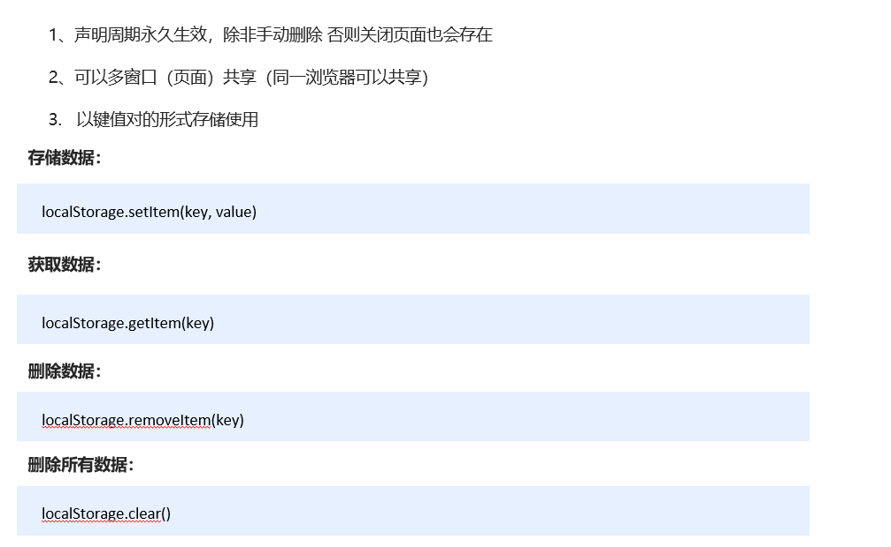

~~~javascript
<!DOCTYPE html>
<html lang="en">

<head>
    <meta charset="UTF-8">
    <title>Document</title>
</head>

<body>
    <input type="text">
    <button class="set">存储数据</button>
    <button class="get">获取数据</button>
    <button class="remove">删除数据</button>
    <button class="del">清空所有数据</button>
    <script>
        var ipt = document.querySelector('input');
        var set = document.querySelector('.set');
        var get = document.querySelector('.get');
        var remove = document.querySelector('.remove');
        var del = document.querySelector('.del');
        set.addEventListener('click', function() {
            var val = ipt.value;
            localStorage.setItem('username', val);
        })
        get.addEventListener('click', function() {
            console.log(localStorage.getItem('username'));

        })
        remove.addEventListener('click', function() {
            localStorage.removeItem('username');

        })
        del.addEventListener('click', function() {
            localStorage.clear();

        })
    </script>
</body>
</html>
~~~

|              | More ActionslocalStorage                                     | sessionStorage                                               |
| ------------ | ------------------------------------------------------------ | ------------------------------------------------------------ |
| 语法         | myStorage = localStorage;                                    | myStorage =sessionStorage                                    |
| 值           | 一个可被用于访问当前源（ origin ）的本地存储空间的 Storage 对象。 |                                                              |
| 保存数据语法 | localStorage.setItem(“key”, “value”);                        | sessionStorage.setItem(“key”, “value”);                      |
| 读取数据语法 | var lastname = localStorage.getItem(“key”);                  | var lastname = sessionStorage.getItem(“key”);                |
| 删除数据语法 | localStorage.removeItem(“key”);                              | sessionStorage.removeItem(“key”); (删除指定数据的key)。sessionStorage.clear();(删除所有数据) |
| 返回值:      | 一个存储对象                                                 | 一个 Storage 对象。                                          |

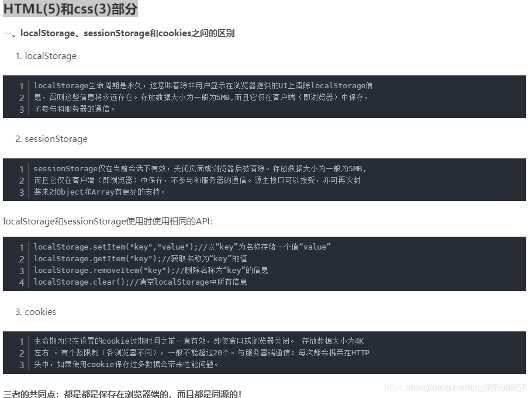

LocalStorage 的限制一般为 [10MB](https://stackoverflow.com/a/2989317)(我学的视频老师说是20MB)

超出限制可以使用 [File System API](https://developer.mozilla.org/en/DOM/File_API/File_System_API)，MEGA 网盘就使用了 [fileSystem API](https://webapps.stackexchange.com/a/41138)。 该特性是非标准的，尽量不要在生产环境中使用！

## 4.和你的上级领导意见不一致时你该怎么办

听话能干>听话不能干>不听话能干>不听话不能干

## 5.网站被劫持植入广告该怎么办？如何防止

这个是运营商做的http响应注入了，因为http是明文传递的，换成https这种加密的。

## 6. 说说你对域名收敛和域名发散的理解？分别在什么场景下使用

**域名发散**

域名发散就是为了突破浏览器对于同一域名并发请求数的限制，chrome浏览器同一时刻只能发送6个http请求，而且一个http1.1还有对头堵塞链，使用域名发散为同一个服务申请多个域名，从而可以一定程度上提高并发量。对于淘宝这种多图网站有很大提升。

由于上古时代，服务器的负载能力较差，为了避免服务器过载，浏览器限制网站并发地对同一域名请求资源，于是为了解决这些问题，采用域名发散策略，将静态资源分布到不同的地方，减轻了服务器的负载压力。

**域名收敛**

域名收敛就是将静态资源放在一个域名下不进行发散，这主要是为了适应移动端的发展需求；通常DNS是一个开销较大的操作，而移动端由于网络带宽和实时性、资源等的限制，这些开销对移动端的用户体验是致命的，因此需要进行域名收敛；
而且 后面的http2 多路复用可以解决域名发散的问题。

以后http2普及之后，域名发散没有太大优势。

进入http1.1时代，由于长连接特性的出现和服务器能力的增强，资源发散策略在某些情况下不再具有优势，对同一服务器进行多次请求，后发起的请求可以继续使用之前打开的tcp连接，而对于分散的资源进行请求则必须重新进行tcp连接，带来额外的消耗，所以，采用域名收敛的策略，可以有效提升客户端的性能。

## 7.说说你对浏览器的关键渲染路径的理解

[关键渲染路径](https://developers.google.com/web/fundamentals/performance/critical-rendering-path/)

**优化关键渲染路径**是指优先显示与当前用户操作有关的内容。

要提供快速的网络体验，浏览器需要做许多工作。这类工作大多数是我们这些网络开发者看不到的：我们编写标记，屏幕上就会显示出漂亮的页面。

但浏览器到底是如何使用我们的 HTML、CSS 和 JavaScript 在屏幕上渲染像素的呢？

从收到 HTML、CSS 和 JavaScript 字节到对其进行必需的处理，从而将它们转变成渲染的像素这一过程中有一些中间步骤，优化性能其实就是了解这些步骤中发生了什么 ——即**关键渲染路径**。

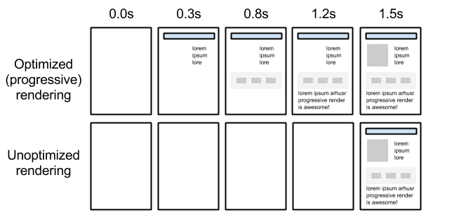

通过优化关键渲染路径，我们可以显著缩短首次渲染页面的时间。 此外，了解关键渲染路径还可以为构建高性能交互式应用打下基础。

处理交互式更新的过程是相同的，只是在连续循环中完成，理想情况下每秒可以处理 60 帧！不过，我们先来看一下浏览器如何显示简单的网页。

## 8. 对于5G的到来，你是怎么看的？说说你的想法

首先速度快肯定只是 5G 的表象，就像 4G 快于 3G 十倍一样，
短视频、移动支付、直播这些的爆发才是 4G 真正有趣的事情。
所以 5G 高速下能带给我们更多的玩法才是我们应该思考和幻想的事情。

我曾幻想过这些画面：

- 带着 VR 不出门就能和所有小伙伴轻松互动
- 租用超高性能电脑，我只用出网费就能玩自己电脑带不动的超清游戏
- 极低延迟的 GPS 无人驾驶，或者无人机通信（比如送外卖）

5G到来，我觉得是前端的一次大发展的机会，更快的网速表明前端可以做更多的事情了。

## 9.对于让你接手一个你觉得很烂的老项目，你该怎么办

接手一个项目，无论多老多烂，第一点肯定是熟悉它的架构，以及使用的技术栈，分析其架构，如果时间允许，最好重新设计架构，选择新技术，出项目维护文档，这也是为以后做准备，如果时间不允许，我还是建议，主动加加班，重新设计，这是为以后的事情考虑，现在加把劲儿把项目做好，以后再加新需求就轻松、舒服多了，不然每次时间都很紧张，每次做的都很烂，只会越来越烂，每天面对一个烂项目，简直要疯掉。

这个问题好难回答呀，个人认为还是先明确需求痛点吧。
比如分为以下几类，统一代码规范、功能优化、功能重构拆分、更新技术栈、架构重构。

比如普通项目转为 cmd 模块化，统一命名规范，js 中的长字符串转 template 等，
这类对功能影响也不大，改起来应该不会很久，就看代码会爽很多。只是不宜一次性改太多。

比如部分页面加载时间过长，图片使用太多，接口出入参混乱等，
都是非常有针对性又可能无法预估耗时的改动，这样的优化相对需要更加谨慎。
但这个用来搞绩效会很有效果，非常容易得到赞许，看个人吧。

比如拆分 Date/金钱/对象数组的处理，统一类型与默认值判断等，
这类非常公用又能装逼的，也能一定程度上考验自己的代码理解能力和功能抽象能力。
排期上可能调研时间会更长些，但基本不会影响功能甚至能有一定优化。

比如 jquery 转 vue，react 升 16，iframe 转 jquery 等，
都更应该是递进式修改，先改不常用的页面，一步步地替换原页面。
注意，这里是不太适合使用 cli 框架的，直接引入 vue.js 文件开发要更好，
等一切结束了，再转为 cli 框架会轻松很多很多。

架构重构基本就很难讲了，如何存储如何通信如何复用可能都与现在情况不同咯。

所以，接手垃圾的老项目，一次性改完重构是不太现实的，按需求痛点一步步更新要更好些。

## 10.如何预防掉头发

肝藏血，发为血之余，血亏则发枯。肾为先天之本，精血之源，其华在发。——老中医

## 11.知道IPv6是什么吗？说说它和IPv4的区别是什么

IPv6是新一代IP协议，它增加了海量的网络地址，使物联网成为可能。IPv4提供的2的32次方的地址根本不够无数的家用设备使用。而2的128次方的地址可为飞速增加的物联网设备提供足够的地址。如今到来的5G时代，IPv6在底层上可谓功不可没。

## 12.说说你对同构和SSR的理解

Isomorphism, 同构，指一套代码既可以在server端工作，也可以在web客户端运行，可以无缝在server端和clIEnt端渲染两种模式间切换。这个概念由airbnb的Rendr发扬光大。
所以一楼说的其实指的并不是同构JS，而是Universal Javascript.

在PWA 大行其道的环境下，因为爬虫需要和框架初始化容易白屏等等问题，服务端渲染的呼声又物论沸腾。SSR其实就是在server端把需要的页面和数据组装起来发给客户端而已。

SSR的好处

- SEO友好
- 首页加载更快
- 减少请求

什么是同构即是一个程序多个平台
按照我的理解就是响应式, 这里可以, 那里也可以, 但不可避免的, 这里也不是最优, 那里也不是最优, 很多雷点, 这个不能共用, 这个那里不行等. 优点就是一套东西多个平台

SSR, SPA是一种相对概念
以前的php, javaWeb, asp.net, 等等都是SSR, 只是现在更多意义上是表示通过NodeJs把仅在前端编译运行的SPA在serve就渲染完成, 直接把html和state下发到clIEnt

## 13.说说什么是设计模式，你最常用的设计模式有哪些

**设计模式** 是一种让代码可重用/可拓展/可解偶的拟物化思维，比如接口不同就用适配器之类的。

### 创建型设计模式

简单工厂模式、工厂方法模式、抽象工厂模式、建造者模式、原型模式、单例模式

### 结构型设计模式

外观模式、适配器模式、代理模式、装饰者模式、桥接模式、组合模式、享元模式

### 行为型设计模式

模板方法模式、观察者模式、状态模式、策略模式、职责链模式、命令模式、访问者模式、中介者模式、备忘录模式、迭代器模式、解释器模式

### 技巧型设计模式

链模式、委托模式、数据访问对象模式、节流模式、简单模板方式、惰性模式、参与者模式、等待者模式

### 架构型设计

同步模块模式、异步模块模式、Widget模式、MVC模式、MVP模式、MVVM模式

## 14.如果面试官让你先自我介绍下，然后说下你的工作经历，你该怎么说

臣本布衣，躬耕于南阳。

我是xxx，毕业于 xxx，专业是 xxx，在 xxx 开始工作，期间负责 xxx，做过 xxx 项目，在 xxx 年换了工作，期间负责 xxx，做过了 xxx 项目，在工作经历中，涉及了 xxx 技术，xxx 端，好，我的介绍完毕。

## 15.最后如果技术面和HR面问你：你还有什么问题吗？你分别会问些什么

### 技术面

技术面提问的话我会比较关注团队情况，技术栈和方向，以及目前的业务方向
团队人数，团队里面的工作、学习、生活氛围等。
目前的技术栈是什么，以及接下来的技术方向是怎样的，比如是否拓展多端能力等
业务方向，因为很多公司会有很多业务，有些甚至是跨行业的，比如一家教育公司可能有金融业务等，所以了解清楚业务对我来说也比较重要。

### HR面

HR面提问的话我会比较关注切身的利益，毕竟你都到HR面了，谈谈待遇也无伤大雅的。

1. 五险一金是否缴纳，社保公积金缴纳比例，这块其实差别还蛮大的，按基础交和全额交，差距挺大。
2. 公司有哪些福利待遇？
3. 公司对新人会有培训吗？
4. 公司有完善的绩效考核系统和职级晋升体系吗？
5. 公司发薪日

以上是我目前会比较关注的，当然不同时期可能关注的点会不一样，比如大佬级别后期根本不关注待遇，人家就是去当合伙人的，那也没话说。

一般我会问对我本次面试的评价，有没有什么值得提升的地方？因为面试也是一种技术交流的过程，及时发现自己的不足可以让我找到以后的学习方向。

## 16.如果面试官让你说说下你的家庭？你会从哪些方面说呢

一般出这道的意图是想了解家庭关系，比如是否已结婚，是否有小孩等。因为一个家庭和睦对于个人的工作来说也是非常关键的，这样在工作也会比较专心，不会分心！

中间内容在另一个电脑里

## 17.你觉得你自己最大的优点和缺点分别是什么？能否举例说明一下

正确的认识自己，该说什么说什么，但有些缺点就不必明说，比如固执己见，不好沟通，这是大忌。

这种题基本上就是先说一两个优点，然后再说一个两个缺点，但是，关键是后面要把缺点说成优点，怎么说呢，
比如你说自己的缺点是太执拗，举例，因为有的时候自己做需求前，总喜欢把需求原委弄清楚，各种准备工作做好了才开始做需求，做的过程中又喜欢把注释和文档都写的整整齐齐，但是这样偶尔会造成让自己需要加班才能完成需求。
基本上这样说就把一个缺点说成了几个优点：

1. 弄清楚需求，准备工作做好，说明做事有方法
2. 注释文档写清楚，说明代码风格好
3. 加班解决问题，说明能吃苦，愿意付出，对需求质量要求高

是不是套路。

## 18.JS动画和CSS动画有什么区别

### JS动画

1. 会进入函数调用栈，走完事件循环才会走渲染，如果过程中还有频繁获取 dom 状态恐怕是药丸。
2. 但相比 css 动画（不考虑 css 变量），js 动画可配置目标值或速率等，搭配 transition 挺不错。
3. 且 js 动画做暂停、反向和复杂的节奏都要更棒。
4. 再比如弧形运动轨迹，对 css 动画而言恐怕就比较难搞了。

### CSS动画

1. 非常简易的 hover active checked 等动效用 css 来写真是太方便了。
2. 对循环播放的动画，多数情况下也是 css 动画更佳。
3. css 动画库的复用感觉会相较高很多。
4. 至于所谓的 gpu 加速或 will-change 很难讲哟，真的有效，但却不是很懂。

> 能用CSS实现的动画 就用CSS实现

## 19.为什么浏览器会有兼容的问题呢

[浏览器为什么会有兼容性问题](https://www.cnblogs.com/fengdong/p/4842282.html)

简单的来说就是个大浏览器使用的内核版本是不一样的，有着具有自己的内核。

其中不得不说IE6、7了。作为我们前端人员来说IE无疑成为我们前端开发人员的一大阻碍，有人就说IE是垃圾浏览器，是奇葩浏览器。而为什么还会用它呢，那是它在市场上占据着重要地位。

其实在很早以前IE就占据了绝大部分的浏览器市场拥有者霸主地位，以谷歌，火狐为代表的浏览器商家为了争夺市场，重新瓜分浏览器市场这块大的蛋糕，于是就组织起来制定了w3cschool的这样的一套规范来与IE来进行抗衡。

就是这样IE浏览器和w3C下的各大浏览器才会有这么多的兼容性问题。

说到这里其实浏览器兼容性原因很简单那是因为IE先于为w3C诞生。在w3C诞生之前IE就有着自己的的一套执行的标准。

之所以以谷歌，火狐为代表的浏览器商家会指定一套属于自己的标准，究其根源是为了争夺市场的占有力。两个字“利益”。

其实IE并没有错，我们不能只看到事物的一面，还要看到实物的本质。

用哲学的话来说，我们要从感性认识上升到理性认识透过事物的表象抓住事物的本质。可以看到在后来的IE8以后，IE为了在市场上生存下去，只有向w3C妥协。慢慢接近于为w3c的标准。

## 20.本地git与远程仓库连接的方式有哪些

第一种，`本地新建文件夹 -> git init -> git add . -> git commit -m 'xxx' -> git remote add origin xxx -> git push -u origin master`

第二种，直接`git clone xxx（ssh链接）-> git add . -> git commit -m 'xxx' -> git push`

## 21.做了这么多年开发，说说你最大的感悟是什么

那时候年轻，开发的时候，感觉这块代码可能会出问题，觉得无所谓，不会有问题的，可后面都是这些觉得会出现问题的，最终都出现问题了！

慢慢地，有一定经验了，知道了，哦，原来这叫 **技术债务**，所以在第34天的时候，我以自身的经验问了个问题（你了解什么是技术债务吗？）： [#125](https://github.com/haizlin/fe-intervIEw/issues/125)

再后来，变得成熟了，阅读了很多知识，然后我又发现，哦，原来我这曾经的思虑早有人总结出来了，这就是著名的：**墨菲定律**。它是这么定义的：

- 凡事只要有可能出错，那就一定会出错

它的主要内容有4个方面：

- 任何事情都没有表面看起来那么简单
- 所有的事情都会比你预计的时间长
- 会出错的事总会出错
- 如果你担心某种情况发生，那么它就更会发生

> 所以在工作上：
> 因为知道了这个道理，所以我就严格要求自己，细心，多思考边界，倒推着我去反思很多问题和去学习了很多知识，比如说程序加监控，代码加单元测试等。如果时间来得及就要把可能会发生的问题解决掉，如果时间来不及那就一定要记录下来，所以我的工作日记里记录着大量的问题，也给这些问题加了个预估解决的时间，一个个去解决，后来发现这代码的质量提高了，返工率大大降低，所以我也要求团队成员，觉得有问题的地方一定要记下来，然后找时间去解决它。

> 所以在生活上：
> 一些不该说的话就不一能说，比如说有些人，天天把“分手、离婚”4字当口头禅，慢慢地也有些是实现了的他们的愿望。刚认识时我就对我老婆说过，什么话都可以说，唯独这4个字“分手、离婚”坚决不能说，到现在，11年过去了，无论是小吵还是拌嘴，从来都不会说这些话，也造就了我们的感情……因为我们懂得珍惜！

以上就是我最大的感悟！！！

* 持续学习。
  这里想说的其实很多，这个感悟其实来源不是工作，而是——小说！国内主流的小说，无论起点高低，目的如何，遇到的困难都不会少，也会有各种奇遇存在，不论过程，结果都是实力提升，才能迈过一个个坎，走上人(魔，仙，兽。。滑稽)生巅峰。我想表达的是爱好没有高下之分(从小看，遭到无数的diss)，看你自己能吸收什么，上班之后的经历无非是持续强化这个感悟而已

* 保持理性，平常心。
  有个词，叫做无能狂怒。代码是没有情绪的，任务和其他人也不会永远保持耐心。只有把理性养成性格，才能更稳定的编程，沟通，以及更好的生活，成长。

* 坚持最难。
  至今，没有找到适合自己的，运用自如的坚持任意一件有意义的计划的方法。或者说不够稳定有效，比作程序的话就是个随机结果，而且还大部分是差的。。目前的结论是，最好从小培养，多给正反馈，如果有好方法各位多多指教

* 互联网知识体系庞杂
  互联网提供了很多的知识，碎片。大家在开始阶段难免有很多困难，但是直接查找粘贴的方式有利有弊，主要对长期成长不利。希望这个项目可以持续下去，配合一些成体系的技术博客，个人的学习，最终帮助大家构建脉络清晰的知识网络，甚至可以逐渐延伸到后端知识！

## 22.第72天 你知道二维码的原理是什么吗？要把android和ios的下载地址合成一个二维码怎么做呢

[二维码原理详解](https://blog.csdn.net/a22222259/article/details/98173091)

[识别二维码的原理是什么？](https://www.zhihu.com/question/35871708)

1. 根据不同的编码方式有不同的编码规则
2. 进入页面判断UA执行二次跳转；

## 23.说说你对RESTful的理解

[理解RESTful架构](http://www.ruanyifeng.com/blog/2011/09/restful.html)

RESTful是一套web api的风格（注意是风格而不是标准）， 指的是 Representational State Transfer。

显而易见，这套风格是面向资源的，所有的接口都是基于对资源进行描述，借助`HTTP Methods`（`GET`,`PUT`,`DELETE`,`POST`）表示资源回到客服端的转化动作

举例：对于文章的操作

| 传统接口         | RESTful        | 操作     |
| ---------------- | -------------- | -------- |
| GET getPost?id=1 | GET /post/1    | 获取推文 |
| POST editPost    | PUT /post/1    | 修改推文 |
| POST deletePost  | DELETE /post/1 | 删除推文 |
| POST addPost     | POST post/     | 新增推文 |

总结来说，RESTful是一种客户端与服务端交互时的WEB API的风格，面向资源，url不包含动词。

## 24.说下你对互联网行业及前端技术发展趋势的看法

互联网已经很久没有全民皆知的新鲜事了，上一个可能还是拼多多吧，ofo 赔款这种负面的不算哈。
所以才会吹什么流量红利到头了，其实如果有个新产品出来其实依旧会流量爆炸好嘛。
那么怎样的新产品会出来冒头呢，我觉得可能是什么联盟或者什么浏览器的出现。

比如国内各家的小程序和快应用太多了，这样发展下去并不美妙，
但它的生态又蛮不错的，所以我在想，会不会有不基于某软件或系统、又如小程序这样易于开发的新浏览器出现，又会是一波替代 app 和 h5 的争吵吧。
或者有诸如 w3c 联盟之类的技术标准化的组织出现，来综合促进小程序的未来和制定 api 开发规范。

## 25.说说你做过让你觉得最满意的项目是什么？为什么

永远都是下一个项目，每一个项目要拿出100%的信心和实力去完成，每做一个项目都会自我提升，所以是下一个项目就是最满意的。

## 26.你对web服务器软件有了解吗？都使用过哪些？各有哪些优缺点呢

最主流的三个Web服务器是 Apache、 Nginx 、IIS 吧，
很显然都没用过，最多玩玩 phpstudy 和 xampp 这类傻瓜式可视化的软件。

所以暂时面对的需求，除了配端口指向不同文件夹外暂时还没啥别的尝试。

那么，直接在服务器上跑 npm 的 anywhere 或 http-server 好像也阔以。
如果没有服务器，那用 now-cli 直接随机放在云端，
或结合 git 用 netlify.com 也阔以直接部署静态网站。

当然，这么玩就只是 web 容器了，不算是 web 服务器，就像 nginx 还能配置好多东西。

用过nginx和apache，使用上其实没什么区别，nginx比apache的优点可能是反向代理吗？有时候遇到跨域问题可以本也启一个nginx代理转发挺方便的。还是就是nginx的配置很简单。

## 27.你会抓包吗？都有用过哪些抓包工具

用过`Fiddler`，可以用来拦截请求头和响应头，然后对请求头或响应头进行伪造，解决跨域等问题；

我还用过Wireshark,只是用过，不熟悉。

## 28.你有使用过JWT吗？说说你对它的理解

JSON Web Token（缩写 JWT）是目前最流行的跨域认证解决方案。服务器认证以后，生成一个 JSON 对象，由客户端保存，每次服务端通信只要但是这个json对象就可以。方便服务器拓展。
JWT 由三部分组成Header（头部），Payload（负载），Signature（签名）。Header（头部），Payload（负载）都是json对象。Signature 部分是对前两部分的签名。
首先，需要指定一个密钥（secret）。这个密钥只有服务器才知道，不能泄露给用户。
然后，使用 Header 里面指定的签名算法（默认是 HMAC SHA256），按照下面的公式产生签名。

~~~json
HMACSHA256(
base64UrlEncode(header) + "." +
base64UrlEncode(payload),
secret)
~~~

算出签名以后，把 Header、Payload、Signature 三个部分拼成一个字符串，每个部分之间用"点"（.）分隔，就可以返回给用户。

## 29.一个项目写很多的纯静态页面，有公共的部分（例如头和尾）你是怎么提取公用的

所有公用部分模块化，模板化，组件化，我是按 vue 那样的。

> 这个问题其实看看各种静态网站生成的lib就好办了， 就行hexo， hugo， 里面的处理都很棒。只要想到的地方都可以模块化

1. iframe：我最开始用的就是这种，方便省事
2. wekpack引入公共模块：`${require('html-loader!../../components/header/header.html')}`
   以上两种都是纯前端的。
   另外现在写静态表面也可以用webapck打包呀。只处理sass和引入公共模块就行了，爽的一比

## 30.你知道什么是WebSocket吗？它有什么应用场景

相对于HTTP这种非持久的协议来说WebSocket是一个持久化的协议，允许服务端主动向客户端推送数据。

### 应用场景

1.社交订阅
2.多玩家游戏
3.协同合作
4.点击流数据
5.股票基金等实时报价
6.体育实况更新
7.基于位置的应用
8.在线教育
9.多媒体聊天
[参考链接](https://blog.csdn.net/lldouble/article/details/80742082)

## 31.你申请的这个职位，你觉得你还欠缺什么呢

自己运维方面的能力还欠缺一些深度（本身前端，运维方面本来就是加分项，说是自己的欠缺也无伤大雅，除非你是高级工程师级别）

同时你要乘机表现自己的优点啊，比如说自己对产品有比较多的思考，会在平时工作中给产品意见，用技术推动产品优化，会给产品提供技术角度的建议等。

## 32.说下你平时是怎么自学的？怎么安排时间的

有空就在自学。。。

## 33.你会抓https和移动端的包吗？分别描述下这两种包要怎么抓

* 电脑开代理->手机wifi连电脑代理->手机访问开发环境->手机数据线连接电脑->访问：chrome://inspect/#devices，跟普通网页一样了。

* Fiddler 抓取 http 和 https 的包， 抓https的包要从fidder上导出证书信任安装。如果要抓取手机上的包，需要在同一局域网下，然后手机安装fiddler的证书，开启http代理到抓包的ip上。
* charles 挺好用的，抓取https需要手机安装证书

## 34.刷新和强制刷新有什么区别？说说你对两者的理解

* 刷新(f5): 若页面之前访问过,可以读取缓存的内容
* 强制刷新(Ctrl+F5): 当前页面不读取缓存的内容,所有的内容必须从服务器获取

F5 和 Ctrl+R 都是普通刷新，若页面之前访问过，就会发一个空请求到服务器，服务器返回 302 ，表示资源未更新，可以使用浏览器缓存。

强制刷新 (ctrl+F5) 则不管浏览器是否缓存，都要重新去源站服务器请求资源，成功则返回 200。

## 35.你平时开发是用mac还是windows系统？至少举三个例子说明两者的区别

没用过mac，一直用windows和lcentos双系统。

## 36.Git的reset和revert有什么区别？它们分别适用于什么场景

* git reset的作用是修改HEAD的位置，即将HEAD指向的位置改变为之前存在的某个版本
  如果想恢复到之前某个提交的版本，且那个版本之后提交的版本我们都不要了，就可以用这种方法

* git revert的作用通过反做创建一个新的版本
  如果我们想恢复之前的某一版本（该版本不是merge类型），但是又想保留该目标版本后面的版本，记录下这整个版本变动流程，就可以用这种方法。

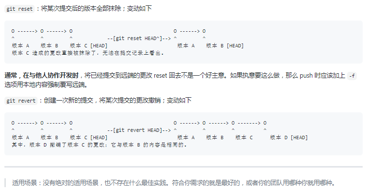

## 37.你平常都看哪些方面的书？你看书的方法是怎样的

技术书籍；记笔记

## 38.说说你对hosts文件的理解，它都有哪些作用

`hosts` 文件可以将名称映射到 IP 地址。在本机上所有对这个名称的访问相当于对它被映射到的 IP 地址的访问。可以说它起到了简易的本地 DNS 的作用。

* 加快域名解析。 匹配后不再去DNS服务器查询。
* 自定义域名解析。 可以根据自己的需要来配置。

## 39.说说你对robots文件的理解，它有什么作用

 `robots.txt`文件对抓取工具（如爬虫）在访问路径等方面做出了规定，用于阻止或引导抓取工具对网站下特定内容的抓取。

参考文档：[Robots.txt 规范  | 搜索 | Google Developers](https://developers.google.com/search/reference/robots_txt)

## 40.当项目准备上线前，你有做过哪些性能优化吗

* 单页面应用首屏优化
* 第三方包CDN
* 路由懒加载，按需加载

## 41.你所在的团队有规范吗？举例说明都定义了哪些规范

- 命名规范
- 编码规范
- 开发上线部署规范
- 需求流程规范

比如：

1. 文件名使用小驼峰命名。
2. html 标签、属性名应全部 **小写**，不要大写。属性值全部使用 `""` 双引号，不要使用 `''` 单引号。
3. `class` 属性值一律使用 **小写英文字母** 和 **-** 命名。
4. 变量命名：js 中的变量和函数一律使用 **小驼峰命名法**。
5. `import` 引入模块命名一律使用 **大驼峰命名法**，首字母大写。
6. js 中字符串使用 **' '** 单引号；有变量或需要换行的时候，使用 **``** 反单引号。

## 42.浏览器在什么情况下会出现“已拦截弹窗式窗口”？怎么解决

在我浏览成人网站的时候会出现。

已拦截弹窗式窗口出现的原因是你想打开一个页面，但是这个页面并不是通过你的点击事件实现，而是已其他方式出现的。

解决方法：使用模拟点击事件。

你这么写就被拦截了

```javascript
<script>
    setTimeout(function() {
       window.open('https://www.baidu.com');
    }, 300);
</script>
```

但是你这么写是不会被拦截

```javascript
<script>
    function opens() {
        window.open('https://www.baidu.com');
    }
    document.body.addEventListener('click',opens); // 主动点击不被拦截
   // 模拟点击被拦截
   setTimeout(function () {
        document.body.dispatchEvent(new Event('click'));
    }, 500);
</script>
```

如果不是手动触发的会被拦截掉的， 模拟触发也被拦截掉。

## 43.简要描述下什么是DNS？它有什么用

**D**omain **N**ame **S**ystem 域名系统：它将域名映射到 IP 地址。

## 44.说说你对emoji表情的理解，前端如何处理emoji表情？它的运用场景有哪些

`emoji`表情实际上就是`Unicode`字符，通过各个系统的底层将其转化为对应的表情图像；因此，每个系统的`emoji`表情实现都可以各不相同。

至于应用场景，虽然是字符，但由于图像化，所以表达的意思更加丰富，多用于聊天或网络社交，言简意赅。

- 理解：它是一种跨语言的用于表达情感的符号；它可以用标准的 UTF-8 编码表示。
- 要展示 emoji，前端应该使用 UTF-8 编码；同时后端也应该使用它存储数据。
- 运用场景：这个问题没啥意义，几个字符还要特殊的应用场景？

说一个使用`emoji`遇到的问题吧，如果前端使用`emoji`保存入库，服务器使用`mysql`的情况下需要设置对应的字符集为`utf8mb4`支持该表情 。

> 从MySQL 5.5开始，可以支持4个字节UTF编码 utf8mb4 ，一个字符能够支持更多的字符集，也能够支持更多表情符号。
> utf8mb4兼容utf8，且比utf8能表示更多的字符，是utf8字符集的超集。所以现在一些新的业务，比如IOS中的emoji表情，会将MySQL数据库的字符集设置为utf8mb4。

## 45.你知道什么是图片防盗链吗？防盗链怎么实现呢？说说你的方法

`盗链` 是指在自己的页面上展示一些并不在自己服务器上的内容。通常的做法是通过技术手段获得它人服务器上的资源地址，绕过别人的资源展示页面，直接在自己的页面上向最终用户提供此内容。

`防盗链` 就是防止盗链。

在 http 协议中，如果从一个页面跳到另一个页面，`header` 字段里面会带个 `Referer`。图片服务器通过检测 Referer 是否来自规定域名，来进行防盗链。

## 46. 说说你对Git的branch, diff, merge的理解

* branch： git分支相关操作，可用于查看、新建、删除分支以及分支的重命名操作
* diff ：用于对比两次修改的差异 可以通过自定义参数来指定对比哪两次修改
* merge ：用于合并分支或者某次提交 一般用于将分支或修改的内容合并到master上

> 三者都是git的基本操作指令 

## 47.你认为前端工程师应该分为哪些级别呢？说说你的看法

切图仔，页面仔，X架构，CTO.

以前html4，很多东西都是table布局，毕竟那时候万维网91年才出来。那时候，我们叫网页设计师。

大部分情况下有：

1. 纯纯切图仔（就是只会切图，但是设计师还达不到）
2. 网页设计师和切图仔混合 （小公司居多，极不规范，P图后用Dreamweaver拉，甚者还用上世纪table布局）
3. 前端静态CSS仔 （不用javascript，只需要写前端HTML,CSS UI，CSS写得溜溜的，做出页面就好了）
4. 前端切图，静态CSS，酷炫效果成熟技工 （融合以上技能，js还写得很溜，基本是Jquery一把嗦，上时代流行产物）
5. 动态框架仔（新时代的产物，只会用nodejs数据渲染Vue等框架，忘却前端本质，不如上面仨，既做不到后端，又做不到大前端，只能在黑箱子里搬运代码，多半是半路出家，培训班）
6. 大前端初级工程师（相对专业，融合1234，系统规范的学习，只要有需求，能用最先进的动态框架和库，写出溜得一逼的UI，仍然在黑箱子里，只不过熟能生巧）
7. 大前端中级工程师（能自己造轮子，讲各种前端头头是道，但只是会说，做可能和5差不多）
8. 大前端高级工程师（只是年龄到了，这时可能会很多东西，包括可能连后端的一部分都做了，这时候开始是小组长，带两三人）
9. 大前端资深高级工程师（熬出头了，有一整套前端的开发方案和流程，可喜可贺）
10. 技术总监（谁见到前端做技术总监的？）
11. 大前端大神（写几个库出名，然后出书，演讲，培训，有钱还写什么代码，不写代码后的日子真好）

我觉得分为：

* 学徒
* 能干活的人
* 干活溜的人
* 指挥家
* 精神领袖

入行时，都是学徒，干不了活，只能模拟，练习，拿公司工资在公司学习。三个月-六个月过去了，能干活了，可以完成工作，但工作很糟糕，就是能干，但不可维护，效率拉脱。两年后，干活很溜。四五年后，指挥能干活的和干活溜的干活，十年后成为精神领袖，叱咤风云。

## 48.不查资料，你会手写正则吗

简单的还是可以写出来的，不过有时候写复杂的话 规则考虑的不全面 会有遗漏。

## 49.你有用过单例模式吗？主要运用场景有哪些

mysql数据库连接就是单例模式，好控制，快速响应。

一个类只能初始化一个实例， 例如jqeury的$，vuex里的store的实现都是单例模式，保证对象的唯一性。
符合单一职责原则，只能实例化唯一的对象。

## 50.你有画过流程图吗？用过什么软件？开始和判定分别用什么图形表示

没画过，如果让我画的话我会考虑用XMind或者百度脑图。

