(注1：面试题目来源依旧是[前端面试每日3+1](<https://github.com/haizlin/fe-intervIEw/issues/198>)，因为我是每50题就另外写一篇博文，所以本文第一题算是总题库的第151题)

# HTML

## 1.举例说明如何在页面中添加数学公式

[完美渲染之数学公式](http://jartto.wang/2018/07/08/perfect-math/)

基于mathtype 在里面编辑好后导出为html/gif格式，然后粘贴到想要显示的位置即可

## 2.说说你对small标签的认识，有哪些应用场景

HTML 中的元素將使文本的字体变小一号。(例如从大变成中等，从中等变成小，从小变成超小)。在HTML5中，除了它的样式含义，这个元素被重新定义为表示边注释和附属细则，包括版权和法律文本
[MDN](https://developer.mozilla.org/zh-CN/docs/Web/HTML/Element/small)

## 3.使用标签怎样对一个单词标志缩写呢

`abbr`标签可以用于来展示缩写字符；

~~~html
<abbr title="People's Republic of China">PRC</abbr>
~~~

## 4.不用`<h1-h6>`标签、CSS和JS怎么实现多个字的字体连续放大的效果

可以使用em单位实现相对于父级标签的字体放大或缩小(大于1即放大，小于1即缩小)

```css
<div style="font-size:16px;">parent<div style="font-size: 2em;">children</div></div>
```

可以使用`<big>`标签来不断的加大字体，但是这个标签现在已经被废弃使用了。

## 5.HTML5有哪些存储类型？它们之间有什么区别

- **cookie**: 最大 4k, 基本无兼容问题, 所有同源tab 共享, 每次请求都携带, key-value 存储, value 只存字符串
- **sessionStorage** 无大小限制, 只在当前 tab 有效, tab 关闭即失效, key-value 存储, value 只存字符串
- **localStorage** 最大 5M-10M, 所有同源 tab 共享, 能持久化存储, key-value 存储, value 只存字符串
- **indexDB** key-value 存储,value 可以任意类型, 同源, 支持事务, 最大 250M, 兼容 ie10
- **webSQL** 支持版本,事务,支持 sql 语句, 不兼容 ie

## 6.HTML5的video在有的移动端设备无法自动播放？怎么解决

避免自动播放浪费流量，手机网页访问带有audio的页面不能自动播放。
1.利用微信的JSAPI的创建页面监听`WeixinJSBridgeReady()`时实现：

~~~javascript
<audio autoplay="autopaly" loop="loop" id="audios"> 
 <source src="music/bng.mp3" type="audio/mp3" /> 
</audio>

<script type="text/javascript" src="https://res.wx.qq.com/open/js/jweixin-1.2.0.js"></script>

<script> document.addEventListener('WeixinJSBridgeReady', function() { document.getElementById('audios').play() }) 
</script>
~~~

2.添加控制属性（controls），让用户手动触发

~~~javascript
<audio autopaly ="autoplay" loop="loop" id="audios" controls="controls"> <source src=".mp3音乐路径" type="audio/mp3"/> <audio>
~~~

3.添加触摸监听，当用户打开浏览出，触摸屏幕事件来监听播放

~~~javascript
document.addEventLinstener('touchstart',function{ document.getEmlementById(“audios").play } )
~~~

## 7.你有用过`<bdo>`标签吗？举例说明它的作用是什么

这个标签是将内部的文字**反序输出**，需要的属性是`dir`，默认是`ltr`，需要倒叙就改成`rtl` 例如

* 含义：覆盖标签内文本的显示方向
* 是一个行内元素
* 有一个属性dir，两个值：
  * `rtl`: right to left（默认从左到右）
  * `ltr`: left to right（从右到左）

~~~html
  <!DOCTYPE html>
    <html lang="en">
    <head>
        <meta charset="UTF-8">
        <title>Document</title>
        <link rel="stylesheet" href="css/style.css">
    </head>
    <body>
        <bdo dir="rtl">abcd</bdo>
        <bdo dir="rtl">一二三四</bdo>
    </body>
    </html>
~~~

> 会显示四三ニー dcba

## 8.你有使用过figure标签吗？说说你对它的认识，有哪些应用场景？

标签规定独立的流内容（图像、图表、照片、代码等等）。

figure 元素的内容应该与主内容相关，但如果被删除，则不应对文档流产生影响。

* 语义化标签，表示一段独立的内容，是独立于主文档流的独立单元
* 表示插入的内容，如插图、表格、代码片段等等
* 经常与`<figcaption>`结合使用，`<figcaption>`表示片段的描述

## 9.举例说明如何使用纯HTML怎么实现下拉提示的功能

利用纯 `html` 需要使用 `datalist` 标签。`input` 的 `list` 与 `datalist` 的 `id` 进行绑定后，在输入时可以选择下拉选项，在输入到匹配的关键字时也能自动提示。

~~~html
<!DOCTYPE html>
<html lang="en">

<head>
  <meta charset="UTF-8">
  <meta name="viewport" content="width=device-width, initial-scale=1.0">
  <title>Document</title>
</head>

<body>
  <form action="">
    <!-- 专业：<select name="" id="">
      <option value="1">语文</option>
      <option value="2">数学</option>
      <option value="3">英语</option>
      <option value="4">物理</option>
      <option value="5">化学</option>
      <option value="6">生物</option>
      <option value="7">政治</option>
      <option value="8">历史</option>
      <option value="9">地理</option>
    </select> -->
    
    <!-- 需求：不仅可以选择，还应该可以输入 -->
    <!-- 建立输入框和datalist的关联  list="datalist的id号" -->
    <!-- 火狐浏览器支持不好，所以不常用 -->
    专业：<input type="text" list="subjects">
    <!-- 通过datalist创建选择列表 -->
    <datalist id="subjects">
      <!-- 创建选项值：value:具体的值 label:提示信息，辅助值 -->
      <!-- option可以是双标签，也可以是单标签 -->
      <option value="体育" label="锻炼身体">
      <option value="语文" label="都要好好学"></option>
      <option value="数学" label="都要好好学"></option>
      <option value="英语" label="都要好好学"></option>
      <option value="物理" label="都要好好学"></option>
      <option value="化学" label="都要好好学"></option>
      <option value="生物" label="都要好好学"></option>
      <option value="政治" label="都要好好学"></option>
      <option value="历史" label="都要好好学"></option>
      <option value="地理" label="都要好好学"></option>
    </datalist>

    网址：<input type="url" list="urls">
    <datalist id="urls">
      <!-- 如果input的输入框type类型为url，则value值则必须添加http:// -->
      <option value="http://www.baidu.com" label="百度"></option>
      <option value="http://www.sohu.com"></option>
      <option value="http://www.xinlang.com"></option>
    </datalist>
  </form>
</body>
</html>
~~~

## 10.怎么检测浏览器是否支持HTML5特性

- 检测window中是否拥有HTML5特有的属性

```javascript
'localStorage' in window;
```

- 创建一个HTML5特有的元素，检测是否存在该元素的特有属性

```javascript
function supportCanvas() {
    return !!document.createElement('canvas').getContext;
}
```

- 创建一个元素，然后检测这个元素的DOM对象是否拥有特定方法，同时调用这个方法并检查这个返回值

```javascript
function supportVideoType() {
    return document.createElement("video").canPlayType('video/mp4;codecs="avc1.42E01E,mp4a.40.2"');
}
```

- 创建一个元素，然后检测该元素的DOM对象设定的属性值，然后检查浏览器是否保留了该属性值

```javascript
function supportColorType () {
    var i = document.createElement("input")
    // HTML支持`color`
    i.setAttribute("type", "color");
    console.log(i.type)
    return i.type !== "text"//text为默认的type
}
```

## 11. HTML5如何调用摄像头

* `navigator.getUserMedia`(已废弃，不建议使用)

~~~javascript
var constraints = {
    video: true,
    audio: false
};
var media = navigator.getUserMedia(constraints, function (stream) {
    var v = document.getElementById('v');
    var url = window.URL || window.webkitURL;
    v.src = url ? url.createObjectURL(stream) : stream;
    v.play();
}, function (error) {
    console.log("ERROR");
    console.log(error);
});
~~~

* `navigator.mediaDevices.getUserMedia`

~~~javascript
const constraints = {
    video: true,
    audio: false
};
let promise = navigator.mediaDevices.getUserMedia(constraints);
promise.then(stream => {
    let v = document.getElementById('v');
    // 旧的浏览器可能没有srcObject
    if ("srcObject" in v) {
        v.srcObject = stream;
    } else {
        // 防止在新的浏览器里使用它，因为它已经不再支持了
        v.src = window.URL.createObjectURL(stream);
    }
    v.onloadedmetadata = function (e) {
        v.play();
    };
}).catch(err => {
    console.error(err.name + ": " + err.message);
})
~~~

## 12.你有使用过HTML5的output吗？说说它的作用是什么

- 定义表单输出
- 它有以下属性
  - for: <element_id> 定义输出域相关的一个或多个元素
  - form: <form_id> 定义输入字段所属的一个或多个表单
  - name: 定义对象的唯一名称。（表单提交时使用）
- Demo

```css
<form id="form" oninput="x.value=parseInt(a.value)+parseInt(b.value)">
    0<input type="range" id="a" value="50">100
    +<input type="number" id="b" value="50">
</form>
=<output form="form" name="x" for="a b"></output>
```

## 13.XPath和DOM有什么区别

[学爬虫利器XPath,看这一篇就够了](https://zhuanlan.zhihu.com/p/29436838)

- xpath是一门在XML文档中查找信息的语言
- DOM是文档对象类型。
  ---W3C 文档对象模型 （DOM） 是中立于平台和语言的接口，它允许程序和脚本动态地访问和更新文档的内容、结构和样式。

W3C DOM 标准被分为 3 个不同的部分：

* 核心 DOM - 针对任何结构化文档的标准模型
* XML DOM - 针对 XML 文档的标准模型
* HTML DOM - 针对 HTML 文档的标准模型

## 14.前端路由指的是什么？它有什么好处？它有哪些方式可以实现呢

### 前端路由指的是什么？

- 前端路由一般用在单页应用(SPA),是利用地址栏URL的变化，动态的替换页面中的DOM

### 它有什么好处？

- 后端路由需要刷新页面，SPA模式下的前端路由不需要刷新页面
- 除了Ajax外，完全的本地加载，提高响应速度
- 前后端代码更好的解耦

### 它有哪些方式可以实现呢？

- hash
  - 利用url HASH值的变化，监听`hashchange`事件，来替换DOM节点
  - 支持老旧的IE浏览器
- History API
  - 监听`popstate`事件，利用`pushState`API，同时进行DOM替换，实现前端路由
  - 需要服务器的特殊配置(一般配置除了接口之外的get请求都指向`index.html`),不然会请求到服务器定向的资源

## 15.为什么HTML5里面我们不需要DTD

- HTML5 不基于 SGML，因此不需要对DTD进行引用，但是需要doctype来规范浏览器的行为（让浏览器按照它们应该的方式来运行）；而HTML4.01基于SGML,所以需要对DTD进行引用，才能告知浏览器文档所使用的文档类型。
- XML是可扩展标记语言是未来网页语言的发展方向，可能会替代HTML，他和HTML都是由SGML延伸转变而来的，你可以理解SGML是最早的版本，但现在已经淘汰不用了

## 16.meta的属性有哪些组成？说说它们的分别有什么作用

- 基本概念
  - content属性是必要的，还有3个非必要属性:`http-equiv/name/scheme`(不常用)
- 添加服务器发送到浏览器的http头部内容

```html
<!-- 浏览器的头部就会包括这些: charset:iso-8859-1 expires:31 Dec 2008 -->
<meta http-equiv="charset" content="iso-8859-1">
<meta http-equiv="expires" content="31 Dec 2008">
<!-- 5s后重定向到Google -->
<meta http-equiv="Refresh" content="5;url=https://www.google.com" />
```

- 解析方式定义

```html
<!-- 用webkit内核进行解析 -->
<meta name="renderer" content="webkit">

* 常用的meta标签
<!-- 声明文档使用的字符编码，一定要写第一行(有以下两种写法) -->
<meta charset="utf-8">
<meta http-equiv="Content-Type" content="text/html; charset=utf-8">

<!-- 禁止百度转码 -->
<meta http-equiv="Cache-Control" content="no-siteapp" />

<!-- SEO优化部分 -->
<!-- 页面标题<title>标签(head 头部必须) -->
<title>your title</title>
<!-- 页面关键词 keywords -->
<meta name="keywords" content="your keywords">
<!-- 页面描述内容 description -->
<meta name="description" content="your description">
<!-- 定义网页作者 author -->
<meta name="author" content="author,email address">
<!-- 定义网页搜索引擎索引方式，robotterms 是一组使用英文逗号「,」分割的值，通常有如下几种取值：none，noindex，nofollow，all，index和follow。 -->
<meta name="robots" content="index,follow">

<!-- viewport主要是影响移动端页面布局的 -->
<meta name="viewport" content="width=device-width, initial-scale=1.0">

- content 参数：
    - width viewport 宽度(数值/device-width)
    - height viewport 高度(数值/device-height)
    - initial-scale 初始缩放比例
    - maximum-scale 最大缩放比例
    - minimum-scale 最小缩放比例
    - user-scalable 是否允许用户缩放(yes/no)

<!-- 移动端常用 -->
<meta name="viewport" content="width=device-width, initial-scale=1, user-scalable=no" />
<meta name="apple-mobile-web-app-capable" content="yes" />
<meta name="apple-mobile-web-app-status-bar-style" content="black" />
<meta name="format-detection"content="telephone=no, email=no" />
<meta name="viewport" content="width=device-width, initial-scale=1, user-scalable=no" />
<meta name="apple-mobile-web-app-capable" content="yes" /><!-- 删除苹果默认的工具栏和菜单栏 -->
<meta name="apple-mobile-web-app-status-bar-style" content="black" /><!-- 设置苹果工具栏颜色 -->
<meta name="format-detection" content="telphone=no, email=no" /><!-- 忽略页面中的数字识别为电话，忽略email识别 -->
<!-- 启用360浏览器的极速模式(webkit) -->
<meta name="renderer" content="webkit">
<!-- 避免IE使用兼容模式 -->
<meta http-equiv="X-UA-Compatible" content="IE=edge">
<!-- 针对手持设备优化，主要是针对一些老的不识别viewport的浏览器，比如黑莓 -->
<meta name="HandheldFriendly" content="true">
<!-- 微软的老式浏览器 -->
<meta name="MobileOptimized" content="320">
<!-- uc强制竖屏 -->
<meta name="screen-orientation" content="portrait">
<!-- QQ强制竖屏 -->
<meta name="x5-orientation" content="portrait">
<!-- UC强制全屏 -->
<meta name="full-screen" content="yes">
<!-- QQ强制全屏 -->
<meta name="x5-fullscreen" content="true">
<!-- UC应用模式 -->
<meta name="browsermode" content="application">
<!-- QQ应用模式 -->
<meta name="x5-page-mode" content="app">
<!-- windows phone 点击无高光 -->
<meta name="msapplication-tap-highlight" content="no">
<!-- 适应移动端end -->
```

## 17. Shadow DOM和Virtual DOM有什么区别

**Shadow DOM**

Shadow DOM是浏览器提供的一个可以允许将隐藏的DOM树添加到常规的DOM树中——它以shadow root为起始根节点，在这个根节点的下方，可以是任意元素，和普通的DOM元素一样。

**Virtual DOM**

虚拟DOM是由js实现的避免DOM树频繁更新，通过js的对象模拟DOM中的节点，然后通过特定的render方法将它渲染成真实的节点，数据更新时，渲染得到新的 Virtual DOM，与上一次得到的 Virtual DOM 进行 diff，得到所有需要在 DOM 上进行的变更，然后在 patch 过程中应用到 DOM 上实现UI的同步更新。

- Shadow DOM 是Web Components标准，为Web组件提供了封装，Shadow DOM使得这些东西与主文档的DOM保持分离
- Virtual DOM 是 Rect/Vue等框架实现的虚拟DOM，其本质上是JavaScript对象，用于模拟DOM对象，在需要操作DOM的地方，先操作Virtual DOM，在render到真实DOM上，以达到更好的性能

## 18.你知道有哪些常见的视频（音频）编码格式和视频（音频）格式吗？

- 视频编码格式：Xvid、H264、MPEG1、MPEG2
- 音频编码格式：WAV、MP3、AAC、Ogg、APE、FLAC
- 封装标准：AVI、RMVB、MKV、ASF、WMV、MP4、3GP、FLV
- 制作视频的三个步骤：
  - 设置需要的视频编码
  - 设置需要的音频编码
  - 选择需要的容器封装

## 19. 什么是Data URI

- 概念：把小文件直接嵌入文档的方案
- 格式：data:[][;charset=][;base64],
- 注意：使用base64的Data URI比直接使用外链的图片，性能会大大降低，所以在比较在乎性能的情况下要谨慎使用

## 20.你知道HTML什么是单闭合标签和双闭合标签吗？为何要分为这两种呢

- 单标签如``，只需将标签名申明一遍的，按照标准，结尾应该有`/`
- 双标签如``,标签名需在首位各写一遍
- 区别：单标签与双标签都有属性，但是双标签有内容，也就是`innerHTML`
- 补充,常见的单标签：

```css
<br />
<hr />
<area />
<base />

<input />
<link />
<meta />
<basefont />
<param />
<col />
<frame />
<embed />
```

## 21.怎样给radio分组呢

- 给`input[type=radio]`设置相同的name值，即可实现radio的分组

```css
<div id="wrap">
    <label for="f">
        <input id="f" name="gender" type="radio" value="female">
        <span>女性</span>
    </label>
    |
    <label for="m">
        <input id="m" name="gender" type="radio" value="male">
        <span>男性</span>
    </label>
</div>
```

## 22.HTML的注释有几种写法？有什么规范吗？

~~~html
<!-- 这是一段注释 -->
<!--[if IE 8]>
    .... some HTML here ....
<![endif]-->
~~~

必须以4个有序字符开始：编码为 U+003C LESS-THAN SIGN 的小于号, 编码为 U+0021 EXCLAMATION MARK 的感叹号, 编码为 U+002D HYPHEN-MINUS 横线, 编码为 U+002D HYPHEN-MINUS横线 ，即 “<!—”
在此之后是注释内容，注释的内容有以下限制：
不能以单个 “>” (U+003E) 字符开始
不能以由 “-“（U+002D HYPHEN-MINUS）和 ”>” (U+003E) 组合的字符开始，即 “->”
不能包含两个连续的 U+002D HYPHEN-MINUS 字符，即 “—”
不能以一个 U+002D HYPHEN-MINUS 字符结束，即 “-”
必须以3个有序字符结束：U+002D HYPHEN-MINUS, U+002D HYPHEN-MINUS, U+003E GREATER-THAN SIGN，即 “—>”

## 23. HTML的标签区分大小写吗？属性名区分大小写吗

标签不区分大小写，属性名也不区分大小写。

## 24.`img、input`标签它们是行内元素还是块级元素

[为何img、input等行内元素可以设置宽高](https://blog.csdn.net/zhouzuoluo/article/details/81064168)

[80%的前端会答错的问题：< img>是什么元素？](https://juejin.im/post/6844904051809714184)

**结论**：属于行内元素，也是替换元素（行内块元素）
**详说**：

1. 简单的说行内元素也就是display:inline的元素，行内块元素就是display:inline-block的元素，典型的有input
2. 它们的关系我觉得行内块元素是行内元素的一个特殊的子集，这样子一个存在。
3. 行内元素，只有设置左右的margin和padding，不能设置高宽，它的高度取决于内部文字的行高。宽度取决于内部文字的多少。
4. 行内块元素和块级元素的属性基本一致。可以设高宽、边距。不同在于它允许左右存在元素。而块级元素就算只有1px也不允许有元素和它共享一行。
5. 比如：button、input、 textarea、select、 img
6. 可以自己尝试一下给它们设置高宽，边距，自己感觉一下

## 25.HTML5的哪些新特性是令你最兴奋的

* input新类型

* svg与canvas

* webStorage

* websocket

## 26. 做好的页面都有在哪些浏览器上测过

这个要**根据业务需求**来做，如果是公司自用的后台管理系统，那么只需要测试Chrome就行了，如果要推广到用户使用，那么就需要根据市场需要测试浏览器，常见的Chrome、Firefox、QQ浏览器、360安全浏览器、IE浏览器、360极速浏览器、UC浏览器等。

对于移动端来说，iOS9+的Safari，小米/华为/vivo/oppo自带浏览器，还有微信和QQ的webView都要进行测试。

## 27.网站首页有大量的图片，加载很慢，要是你，你该怎么去优化呢

- base64(性能差)
- 雪碧图
- 懒加载
- 缩略图
- 骨架图

## 28.你有用过HTML5的requestAnimationFrame吗？它运用的场景有哪些呢

为什么要使用`requestAnimation`呢？

由于屏幕种类，分辨率，屏幕尺寸的不同，屏幕自动刷新的频率不同，使用requestAnimationFrame可以自动适配屏幕刷新频率。避免丢帧。

与`setTimeout`相比，`requestAnimationFrame`最大的优势是由系统来决定回调函数的执行时机。除此以外，还可以节省CPU，函数节流。

`requestAnimationFrame` 会把每一帧中的所有 DOM 操作集中起来，在一次重绘或回流中就完成，并且重绘或回流的时间间隔紧紧跟随浏览器的刷新频率。

运用场景：

* JS动画：`requestAnimationFrame` 是由浏览器专门为动画提供的 API，在运行时浏览器会自动优化方法的调用，并且如果页面不是激活状态下的话，动画会自动暂停，有效节省了 CPU 开销
* 大数据渲染：在大数据渲染过程中，比如将后台返回的十万条记录插入到表格中，如果一次性在循环中生成 DOM 元素，会导致页面卡顿，用户体验差。这时候就可以用 `requestAnimationFrame` 进行分步渲染，确定最好的时间间隔，使得页面加载过程中很流畅。

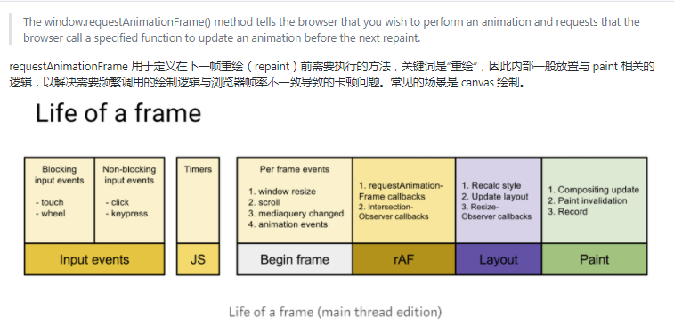

扩展阅读：[requestIdleCallback](https://developer.mozilla.org/en-US/docs/Web/API/Window/requestIdleCallback)，用于把一个任务打碎，在每一帧的“空闲时间”完成，

## 29. HTM、HTML、SHTML三者有什么区别呢

[shtml](https://baike.baidu.com/item/shtml/594921?fr=aladdin)

HTM和 HTML没有区别，SHTML可以放入SSI

## 30.你有用过HTML5的track标签吗？说说它的运用场景有哪些

track元素可以为使用video元素播放的视频或使用audio元素播放的音频添加字幕。写在video或audio元素内部。

如果使用标记描述媒体文件，则标记必须被书写在标记之后。track元素是一个空元素，其开始标记与结束标记之间不包含任何内容。

**属性**
default：默认轨道。（值：default）。default属性用于通知浏览器在用户没有选择使用其他字幕文件的时候可以使用当前 track文件

kind：文本轨道的文本类型（值：captions、chapters、descriptions、metadata、subtitles）。kind属性用于指定字幕文件(即用于存放字幕、章节标题、说明文字或元数据的文件) 的种类。可以对kind属性指定的属性值为subtitles、captions、descriptions、chapters与metadata

label：文本轨道的标签和标题（值：text）。

src：轨道文件的URL，必选属性（值：URL）。src属性用于指定字幕文件的存放路径，该属性是一个必须使用的属性。src属性的属性值可以是一个绝对URL路径，也可以是一个相对URL路径。

srclang：轨道文本数据的语言。（值：language_code ）。srclang属性用于指定字幕文件的语言。例如，srclang="en" 和srclang="zh-cn"分别表示字幕文件为英语和汉语。

**浏览器支持**（这里提一下是因为W3C说目前主流浏览器不支持）
Internet Explorer 10, Chrome 以及 Opera 支持 标签。

[参考文档](https://www.yjro.com/305638.html)

## 31. 请使用纯HTML制作一个进度条

progress是HTML5的一个新元素，表示定义一个进度条，用途很广泛，可以用在文件上传的进度显示，文件下载的进度显示，也可以作为一种loading的加载状态条使用。

> max属性表示进度条的进度最大值，如果有此值，必须是大于0的有效浮点数。max的默认值是1.
> value属性表示进度条完成的进度之，value值的范围为0-max之间。如果没有设置max属性，那么value属性值的范围要在0-1之间。

~~~html
<!DOCTYPE html>
<html lang="en">

<head>
  <meta charset="UTF-8">
  <meta name="viewport" content="width=device-width, initial-scale=1.0">
  <title>Document</title>
</head>

<body>
  <!-- progress:进度条-->
  <!-- 属性1.max:最大值 -->
  <!-- 属性2.value:当前进度值  -->
  <progress max="100" value="60"></progress>

  <!-- 度量器：衡量当前进度值-->
  <!-- 属性1.high:规定的较高的值 -->
  <!-- 属性2.low:规定的较低的值 -->
  <!-- 属性3.max:规定的最大的值 -->
  <!-- 属性4.min:规定的最小的值 -->
  <!-- 属性5.value:当前度量值 -->
  <meter max="100" min="0" high="80" low="40" value="30"></meter>
  <meter max="100" min="0" high="80" low="40" value="60"></meter>
  <meter max="100" min="0" high="80" low="40" value="90"></meter>
</body>
</html>
~~~

> 因各个浏览器UI表现不统一，实际业务中极少用原生progress

## 32.举例说明HTML5的标签meter的用法

作用：定义已知范围或分数值内的标量测量。

说明： 标签不应用于指示进度（在进度条中）。如果标记进度条，请使用`<progress>`标签。

注释： 标签是 HTML 5 中的新标签。

```
<p>显示度量值：</p>
<meter value="3" min="0" max="10">3/10</meter><br>
<meter value="0.6">60%</meter>
<p><b>注释：</b>Internet Explorer 不支持 meter 标签。</p>
```

## 33.HTML5的output是非常棒的一个标签，你对它有了解吗

**output** 与 **input**对应，一个是输入,一个是输出.

~~~javascript
<form oninput="result.value=parseInt(a.value)+parseInt(b.value)">
    <input type="range" name="b" value="50" /> +
    <input type="number" name="a" value="10" /> =
    <output name="result"></output>
</form>
~~~

既然觉得好用那就用起来呗，结果发现有点坑，
绑的是 oninput 事件，初始时是没结果的，那怎么 js 触发呢，但 dispatchEvent 不了；
后来异步想改公式怎么办，好像又回到了 addEventListener 上，拓展成问题；
冗长的 oninput 字符串；oninput 只能接收全局变量的函数。
嵌套 form 取的还是父级 form 的数据；

```javascript
<form onsubmit="return false" oninput="add(result, b, a)">
  <input type="range" name="b" value="50" max="20" /> +
  <input type="number" name="a" value="10" /> =
  <output name="result"></output>
</form>

function add(output, ...doms) {
  output.value = doms.reduce((re, dom) => re + parseFloat(dom.value), 0);
}
```

但撇开这些，它依旧是很棒的概念，
自己用 vue 等写个 output 组件也有了依据标杆。

## 34.如何给一个下拉选项进行分组

~~~html
<select name="" id="">
    <optgroup label="四川">
            <option value="">绵阳</option>
            <option value="">广汉</option>
    </optgroup>
    <optgroup label="江苏">
            <option value="">苏州</option>
            <option value="">南京</option>
    </optgroup>
</select>
~~~

## 35. HTML5如何唤醒APP

- 有以下几种方式
  - URL Scheme：最常见
  - Intent: // ：Android
  - Universal Link ： iOS， 通过传统的 HTTP 链接即可打开 APP
- 唤醒途径
  - iframe的src
  - a标签的src
  - window.location
- 参考资料: [链接](https://juejin.im/post/5b7efb2ee51d45388b6af96c)
- 附一个[URL Scheme大全](https://blog.csdn.net/dkq972958298/article/details/52954195)

## 36.举例说明如何实现浏览器桌面通知

websocket加以 Desktop Notification

```javascript
Notification.requestPermission(function (perm) {  
        if (perm == "granted") {  
            var notification = new Notification("这是一个通知撒:", {  
                dir: "auto",  
                lang: "hi",  
                tag: "testTag",  
                icon: "https://static.cnblogs.com/images/adminlogo.gif",  
                body: "通知content"  
            });  
        }  
})
```

## 37.placeholder如何在兼容IE

[兼容IE浏览器的placeholder的几种方法](https://www.cnblogs.com/maxiaodan/p/5337213.html)

> 根据我的经验，兼容placeholder尽量不要跟input的value打交道，你做验证的时候你就明白了。舍你半条命都不夸张，建议使用背景图。使用canvas生成，最完美的了。

## 38.png8和png24有什么区别呢

* PNG 8：PNG 8中的8，其实指的是8bits，相当于用2^8^大小来存储一张图片的颜色种类，2^8^等于256，也就是说**PNG 8能存储256种颜色**，一张图片如果**颜色种类**很少，将它设置成PNG 8得图片类型是非常适合的。

* PNG 24：PNG 24中的24，相当于3乘以8 等于 24，就是用**三个8bits**分别去表示 R（红）、G（绿）、B（蓝）。R(0 ~ 255),G(0 ~ 255),B(0 ~ 255)，可以表达256*256*256=16777216种颜色的图片，这样PNG 24就能比PNG 8表示色彩更丰富的图片。但是所占用的空间相对就更大了。

[链接](https://juejin.im/post/5c8e4feb6fb9a070aa5ce200)

## 39.有哪些方法可以将图片和文字显示在同一行上呢

~~~html
  <style>
     /* 第一种 */
    img {
       vertical-align: middle; 
    }
    /* 第二种 */
    div {
      display: flex;
      align-items: center;
    }
  </style>
  <div class="box">
    
    前端
  </div>
~~~

## 40.主框架如何与iframe通信？如何解决跨域

* 主域相同，子域不同，可以设置在两个页面都设置`document.domain = ‘xxx.com’`然后,两个文档就可以进行交互。
* 主域和子域都不同，则可以使用CDM(cross document messaging)进行跨域消息的传递。
  * 发送消息: 使用`postmessage`方法
  * 接受消息: 监听`message`事件

## 41.怎么使用HTML5实现录音的功能

最主要的关键点: 使用`navigatior.getUserMedia()`获取设备的摄像头和麦克风能力。

使用` navigator.mediaDevices.getUserMedia()`接口

## 42.HTML的a标签属性`rel="noopener"`有什么作用

当我们使用`targer=_blank`打开一个新的标签页时, 新页面的window对象上有一个属性 opener, 它指向的是前一个页面的 window 对象。因此, 后一个页面就获得了前一个页面的控制权，甚至在跨域的情况下也可以生效, 你可以使用 `window.opener.location.replace`更改前一个页面的url。

使用 `rel=noopener`可以把`window.opener`置为空, 老一些的浏览器可以使用 `rel=noreferer`。

## 43.举例说明ul、dl、ol三个标签的区别

- `ul`：无序列表。
- `dl`：定义列表。
- `ol`：有序列表。

```css
<ul>
    <li>ul 1</li>
    <li>ul 2</li>
    <li>ul 3</li>
  </ul>

  <dl>
    <dt>dl 1</dt>
    <dd>dl 1.1</dd>
    <dd>dl 1.2</dd>
    <dt>dl 2</dt>
    <dd>dl 2.1</dd>
    <dd>dl 2.2</dd>
  </dl>

  <ol>
    <li>ol 1</li>
    <li>ol 2</li>
    <li>ol 3</li>
  </ol>
```

## 44.html的标签属性bgcolor支持简写吗？如`bgcolor="#F00"`

废弃啦

支持简写

只是适用于表格背景色

## 45.请举例说明HTML支持的数学符号有哪些

[HTML 符号实体参考手册](https://www.runoob.com/tags/html-symbols.html)

## 46.请举例说明关于HTML的引用标签有哪些

- `blockquote`标签
  - 引用
  - cite属性，没有浏览器支持，规定引用来源
  - `margin-start` `margin-end` 有边距
- `q`标签
  - 短引用
  - 会自动加上`after``before`伪元素，自动加上引号

## 47.举例说明a标签的作用都有哪些

- 打开链接

  - 当前页面打开

  ```css
  <a href="https://www.github.com">test</a>
  ```

  - 新标签页打开

  ```css
  <a target="_blank" href="https://www.github.com">test</a>
  ```

- 文件下载

  ```css
  <a href="https://codeload.github.com/vkboo/vue-svg-board/zip/master" download="vue-board-svg-name">vue-board-svg</a>
  ```

- 利用URL Scheme打开app

  ```css
  <a href="imeituan://xxx.xxx.xxx"></a>
  ```

- 锚点

  ```css
  <a href="#content">go to content</a>
  <section id="content"></section>
  ```

## 48.说下cookie都有哪些缺点

- 存储量小:不同浏览器的限制不同，[>4KB](https://www.ietf.org/rfc/rfc2965.txt)，[<5MB](https://developer.mozilla.org/en-US/docs/Web/API/Web_Storage_API)
- 明文传输，可篡改，不安全，比如XSRF(Cross-site request forgery)攻击：在用户不知情的情况下发起请求，比如有人在论坛上有人加入图片标签 ``，其他用户加载页面时，会自动向bank.com发起请求。如果bank.com是基于cookie的验证方式，那么这个请求就可能会被通过，实现向攻击者转账。
- 同域的每个请求都会请求，耗费带宽
- 不能跨域：无法和子域名共享cookie。比如 example.com有子域名 static.example.com，在example.com页面产生的向stactic.example.com的请求无法使用exmaple.com页面下的cookie。
- 客户端没有getCookie/setCookie的api，存取复杂。API操作不便：`document.cookie = "name=oeschger"`;

## 49.如何在页面中插入TAB符号（制表符）

```css
<pre>
    &#x0009;test test test 
</pre>
```

## 50.你知道p标签和br标签两者的区别是什么吗

- p是块级元素，br是行内元素
- p是双标签，内部可以嵌入内容使用，br是单标签
- p 标签是段落与段落之间的换行，相当于` line-height `的两倍。br 标签是行与行之间的换行
- block 块级元素，br 内联元素；
- block 能被 css 修改，br 不能；
- block 非单标签元素，br 是；
- block 换行靠的是块级元素特性，br 换行靠的可能是类似 \n 的渲染规则

# CSS

## 1.请说说CSS3实现文本效果的属性有哪些

文本阴影：`<text-shadow>`

换行设置:`<word-wrap>`

## 2.如何使用CSS的多列布局

[何时使用CSS多列布局](https://juejin.im/post/6844903861858091021)

**当我们把注意力都放在 `CSS Grid` 布局和 `CSS Flexbox` 布局的时候，经常忽略了另一种布局方法。**在本文中，我将介绍**多列布局** - 通常称为 `multicol` 或者 **“CSS Columns”** 。

`multicol` 的基本思想是，你可以把一大块内容带到多个列中，就像报纸一样。您可以使用两个属性中的其中一个来完成此操作。您可以使用 `cloumn-count` 属性来指定内容的列数。还可以使用 `column-width` 属性来指定理想的列宽，让浏览器来决定合适的列数。

不论你的内容包含什么样的元素，当你将它转换为多列布局时，一切都将保持正常的内容流，但是将以列的形式展现。这使得 `multicol` 布局与如今在浏览器中常见的其他布局会有所不同。例如 `Flexbox` 和 `Grid`，获取容器元素中子元素，让这些子元素参与到 `flex` 和 `grid` 的布局中来。使用 `multicol` ，在每一列的内部，您还可以获得正常的内容流。

## 3.举例说明在CSS3中怎么实现背景裁剪

[background-clip](https://developer.mozilla.org/zh-CN/docs/Web/CSS/background-clip)

`border-box`:默认值，背景延伸至边框外沿（但是在边框下层）。

`padding-box`:背景延伸至内边距（`padding`）外沿。不会绘制到边框处。

`content-box`：背景被裁剪至内容区（content box）外沿。

`text`:背景被裁剪成文字的前景色。

> 再拓展开来，假如让背景变为椭圆，又该如何来做。
> 那就得用伪元素来作为背景，用层叠上下文让伪元素位于其他元素之下和边框之上了。
> 如果背景形状还要再复杂一些就需要用上 `-webkit-mask` 或者 `svg` 了。

## 4.如何做图片预览，如何放大一个图片

[通过鼠标在某个图像上盘旋，实现大图浏览](https://blog.csdn.net/Bule_daze/article/details/79543690)

> 这个我在学京东静态页面的时候做过，到时候看一下。

方法1：请求两个不同资源路径。

方法2：图片放大可以用`transform: scale(>1)`属性

方法3：图片不跨域的话用 canvas 来 drawImage 放大裁剪也可以。

## 5.如何写高效的CSS

[CSS大全](https://cssguidelin.es/#the-importance-of-a-styleguide)

唔，自动补全、预编译这些辅助手段确实能提升一定的效率，
但我觉得真正能提升效率的是，**不看预览就敢上手的理论知识**。
见过太多加几行就要预览下效果的开发了，哪怕给他双屏其实也还是会拖慢节奏。

比如这个横排该怎么写，子级是否留隙/等宽/限宽，后期有其他元素加入怎么办，等等......
虽然有了 flex 后我们要考虑的少了很多，但依旧还是有布局规律可循。
这个过程很吃经验，类似于将样式/布局进行抽象理解，
等到能写出非常完善的抽象类也熟悉其优劣长短后，那不看预览也可以快速编写了。

另一方面，直接使用调试面板进行调试编写，也比改下保存下再看眼要快一些。

## 6.CSS中的`border:none`和`border:0px`有什么区别

在于浏览器解析与否

* border为0的情况下虽然看不见,但是浏览器会对border进行渲染,还是占据内存的。而border为none时浏览器不会对其渲染,所以不会占据内存

* border为none的兼容差 在老IE浏览器上还是会有边框，而border为0的时候是可以隐藏的

## 7.外边距重叠是什么？重叠的结果是什么？怎么防止外边距重叠

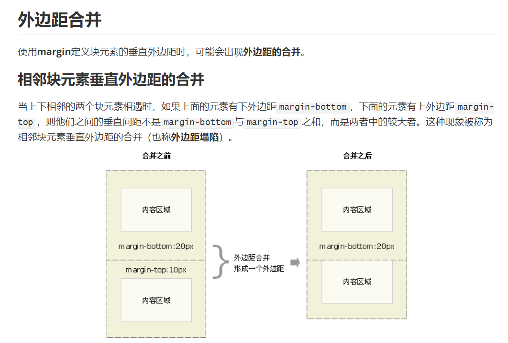

* 什么是外边距重叠？
  * 块级元素的上外边距和下外边距有时会合并（或折叠）为一个外边距，其大小取其中的最大者。
* 重叠的结果是什么？
  * 兄弟元素： 毗邻的两个元素之间的外边距会折叠
  * 父子元素：如果在父元素与其第一个子元素之间不存在边框、内边距、行内内容，也没有创建块格式化上下文、或者清除浮动将两者的 margin-top 分开；或者在父元素与其最后一个子元素之间不存在边框、内边距、行内内容、height、min-height、max-height将两者的 margin-bottom 分开，那么这两对外边距之间会产生折叠。此时子元素的外边距会“溢出”到父元素的外面(表现是marign像是作用在了父元素上)。
  * 空的块级元素：如果一个块级元素中不包含任何内容，并且在其 margin-top 与 margin-bottom 之间没有边框、内边距、行内内容、height、min-height 将两者分开，则该元素的上下外边距会折叠。(这一条没明白)
* 怎样防止外边距重叠？
  * 底部元素脱离文档流(float: left/right || position: absolute/fixed)
  * 给兄弟元素设置垂直边界的时候，统一设置一边(margin-top或margin-bottom)

## 8.你有用过弹性布局吗？说说你对它的理解

按我的经验在样式规律上大致分下类吧，

1. 等宽弹性布局
2. 单元素弹性布局
3. 多元素定比弹性布局
4. 等隙布局

用 flex 或 grid 能非常轻松的完成以上效果，而 css2 时代多半还需要更多元素嵌套才能完成了。

所谓弹性，即父级宽度变化子级宽度也会相应变化，
最基本的当然是百分比啦，
但当存在有定宽兄弟元素时，事情变得稍复杂了一点，便有了上述 2 3 的分类，
当间隙不为定值也要自动变化时，那便是第 4 分类了。

## 9.用CSS怎么实现两端对齐

* 对于文字，利用 `text-align-last:justify;` 实现文字的两端对齐
* 对于元素，利用 `flex` 和 `float` 实现元素的两端对齐

>  之前网上是说这个对单行不生效，因此要`text-align-last`，但是今天试了一下`text-align:justify`，发现是生效的，并且chrome浏览器也有效

## 10.判断第一行和第二行的颜色分别是什么？并解释为什么

~~~css
<style>
.red {color:red;}
.green {color:green;}
</style>

<div class="red green">第一行：颜色是什么？</div>
<div class="green red">第二行：颜色是什么？</div>
~~~

- 都是`green`
- CSS的生效规则与标签中class值的声明先后完全没有关系，而是取决于权重
- 如题，`.green`后定义，把`.red`覆盖了，所以显示`green`

## 11.举例说明你知道的CSS技巧有哪些

~~~css
/*文本模糊*/
.blurry {
  color: transparent;
  text-shadow: 0 0 5px rgba(0,0,0,0.5);
}
~~~

~~~css
/*页面顶部阴影*/
body:before {
          content: "";
          position: fixed;
          top: -10px;
          left: 0;
          width: 100%;
          height: 10px;   

          -webkit-box-shadow: 0px 0px 10px rgba(0,0,0,.8);
          -moz-box-shadow: 0px 0px 10px rgba(0,0,0,.8);
          box-shadow: 0px 0px 10px rgba(0,0,0,.8);   

          z-index: 100;
}
~~~

## 12.移动端的布局用过媒体查询吗？写一个试试

[媒体查询](https://zhuanlan.zhihu.com/p/109731849)

### 什么是媒体查询

**媒体查询**可以让我们根据设备显示器的特性（如视口宽度、屏幕比例、设备方向：横向或纵向）为其设定CSS样式，媒体查询由媒体类型和一个或多个检测媒体特性的条件表达式组成。媒体查询中可用于检测的媒体特性有 width 、 height 和 color （等）。使用媒体查询，可以在不改变页面内容的情况下，为特定的一些输出设备定制显示效果。

### **语法**

~~~css
@media all and (min-width:320px) { 
    body { background-color:blue;}
}
~~~

### **设备类型(默认值为all)**


### **关键字**

> screen 是媒体类型里的一种，CSS2.1定义了10种媒体类型
> and 被称为关键字，其他关键字还包括 not(排除某种设备)，only(限定某种设备)
> (min-width: 400px) 就是媒体特性，其被放置在一对圆括号中。

### **常见适配范围**

~~~css
设备范围
    默认样式    注意：默认样式要写在最前面
    /* 打印样式 */
        @media print {}
    /* 手机等小屏幕手持设备 */
        @media screen and (min-width: 320px) and (max-width: 480px) {}
    /* 平板之类的宽度 1024 以下设备 */
        @media only screen and (min-width: 321px) and (max-width: 1024px) {}
    /* PC客户端或大屏幕设备: 1028px 至更大 */
        @media only screen and (min-width: 1029px) {}
    /* 竖屏 */
        @media screen and (orientation:portrait) {对应样式}
    /* 横屏 */
        @media screen and (orientation:landscape){对应样式}
~~~

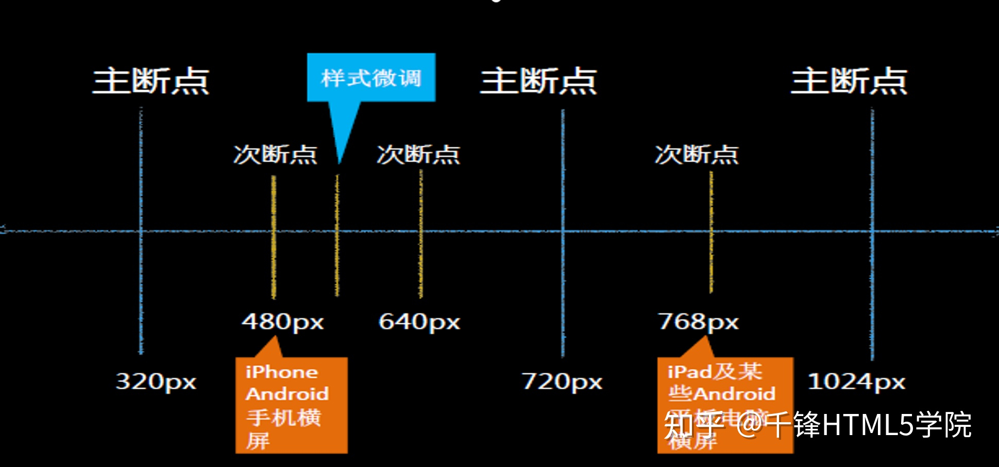

## 13.position跟margin collapse这些特性相互叠加后会怎么样

[position跟display、margin collapse、overflow、float这些特性相互叠加后会怎么样？](https://www.cnblogs.com/jackyWHJ/p/3756087.html)

## 14.你是怎么选择Reset.css和normalize.css的？为什么？

两者都是统一不同浏览器默认样式

* Reset 是减法
* normalize是加法

我选**加法**

减法意味没有浏览器默认样式，全部样式自己写

加法抹平差异，只有你一些用到的要自己写，其他默认样式比如行高还是有必要的

- 一般选择normalize
- Reset: 比较粗暴的处理方式，不管有用没有统统处理成一种方式，如果是临时页面会采用。

```css
* {
    margin: 0;
    padding: 0;
    box-sizing: border-box;
}
*::after,
*::before {
    box-sizing: border-box;
}
```

- Normalize: Normalize注重通用的方案，重置掉该重置的样式，保留有用的 user agent 样式，同时进行一些 bug 的修复，这点是 reset 所缺乏的。

## 15.你有用过`<clip-path>`吗？说说你对它的理解和它都有哪些运用场景

[CSS3 clip-path 用法介绍](https://juejin.im/post/6844903568315514894)

裁剪嘛，比三角更酷炫的内凹三角，菱形或蜂巢形列表，带背景图的三角，等等，都能更容易实现了。

有个很不错的[clip-path网站](https://bennettfeely.com/clippy/)，我一般直接用这个来做clip-path。

`clip-path>`属性可以创建一个只有元素的部分区域可以显示的剪切区域。区域内的部分显示，区域外的隐藏。剪切区域是被引用内嵌的URL定义的路径或者外部svg的路径，或者作为一个形状例如circle().。clip-path属性代替了现在已经弃用的剪切 clip属性。

clip-path 的含义就是裁剪路径，通过指定的闭合路径或者形状，甚至是 SVG 中 clipPath 标签定义的形状，裁剪出部分需要保留的区域，这样网页中的布局实现可以是多种多样的。

## 16.CSS的`linear-gradient`有什么作用呢

### 线性渐变

[linear-gradient](https://developer.mozilla.org/zh-CN/docs/Web/CSS/linear-gradient)

线性渐变(`inear-gradient`)：指**沿着某条直线**，**朝一个方向产生渐变效果**。这条直线可以从左侧到右侧、从右侧到左右、从顶部到底部、从底部到顶部、从左上角到右下角等等，简单来说**渐变方向是一条直线，此直线可以沿着任意轴**。

CSS `linear-gradient()` 函数用于创建一个表示两种或多种颜色线性渐变的图片。其结果属于`<gradient>`数据类型，是一种特别的`<image>`数据类型。

#### 语法

~~~css
background-image: linear-gradient(direction, color-start, ..., color-end);
~~~

即，`linear-gradient`包含如下几个基本参数，

* 第一个参数为**渐变方向**
* 第二个参数为**渐变起点的颜色**
* 第三个参数为**渐变终点的颜色**

同时，你还可以在渐变起点和渐变终点中间插入任意多个色标来达到多重颜色渐变的目的。

#### 渐变方向

关于**渐变方向**，我们可以设置为一些常用关键词，比如top、right、bottom、left，以及这四个基本关键词的任意相邻方向的**两两组合**，比如`top left`、`top right`等等。

渐变方向除了可以设置为常用关键词之外，我们还可以设置一个角度值，即`0deg`～`360deg`。这个角度值也可以为负值。正负值的区别在于渐变方向相对于默认值的方向是不同的。

**⚠️注意**，此参数可以省略。当渐变方向省略时，W3C规定的渐变方向默认值为**top**，即渐变方向**从上到下**。


#### 具体示例

~~~html
<!DOCTYPE html>
<html lang="en">

<head>
    <meta charset="UTF-8">
    <title>Document</title>
    <style>
        div {
            width: 300px;
            height: 300px;
            /* 添加渐变：既然是渐变，那就不是一个单一色了。 */
            /* 产生的是图像，所以需要使用background来添加，而不是background-color来添加 */
            /*linear-gradient(方向，开始颜色 位置,颜色2，位置，颜色3，位置...);*/
            /* 方向：
             * to top 0deg
             * to right :90deg
             * to bottom：180deg(默认值)
             * to left:270deg
             */
            /* background: linear-gradient(red, blue); */
            /* background: linear-gradient(to right, red, blue); */
            background: linear-gradient(to right, red 0%, red 50%, blue 50%, blue 100%);
            /* div宽度是300px,我让红色从0到50%(300px*0.5),我让蓝色从50%到100%，这样的过渡效果就很清晰了 */
        }
    </style>
</head>

<body>
    <div></div>
</body>
</html>
~~~

## 17.会引起Reflow(回流)和Repaint(重绘)的操作有哪些

[浏览器的回流与重绘 (Reflow & Repaint)](https://juejin.im/post/6844903569087266823)

[前端性能优化关键词：Render tree](https://zhuanlan.zhihu.com/p/23621575)

### 写在前面

在讨论回流与重绘之前，我们要知道：

1. 浏览器使用流式布局模型 (Flow Based Layout)。
2. 浏览器会把`HTML`解析成`DOM`，把`CSS`解析成`CSSOM`，`DOM`和`CSSOM`合并就产生了`Render Tree`。
3. 有了`RenderTree`，我们就知道了所有节点的样式，然后计算他们在页面上的大小和位置，最后把节点绘制到页面上。
4. 由于浏览器使用流式布局，对`Render Tree`的计算通常只需要遍历一次就可以完成，但`table`及其内部元素除外，他们可能需要多次计算，通常要花3倍于同等元素的时间，这也是为什么要避免使用`table`布局的原因之一。

**一句话：回流必将引起重绘，重绘不一定会引起回流。**

### 回流 (Reflow)

当`Render Tree`中部分或全部元素的尺寸、结构、或某些属性发生改变时，浏览器重新渲染部分或全部文档的过程称为回流。

会导致回流的操作：

- 页面首次渲染
- 浏览器窗口大小发生改变
- 元素尺寸或位置发生改变
- 元素内容变化（文字数量或图片大小等等）
- 元素字体大小变化
- 添加或者删除**可见**的`DOM`元素
- 激活`CSS`伪类（例如：`:hover`）
- 查询某些属性或调用某些方法

一些常用且会导致回流的属性和方法：

- `clientWidth`、`clientHeight`、`clientTop`、`clientLeft`
- `offsetWidth`、`offsetHeight`、`offsetTop`、`offsetLeft`
- `scrollWidth`、`scrollHeight`、`scrollTop`、`scrollLeft`
- `scrollIntoView()`、`scrollIntoViewIfNeeded()`
- `getComputedStyle()`
- `getBoundingClientRect()`
- `scrollTo()`

### 重绘 (Repaint)

当页面中元素样式的改变并不影响它在文档流中的位置时（例如：`color`、`background-color`、`visibility`等），浏览器会将新样式赋予给元素并重新绘制它，这个过程称为重绘。

### 性能影响

**回流比重绘的代价要更高。**

有时即使仅仅回流一个单一的元素，它的父元素以及任何跟随它的元素也会产生回流。

现代浏览器会对频繁的回流或重绘操作进行优化：

浏览器会维护一个队列，把所有引起回流和重绘的操作放入队列中，如果队列中的任务数量或者时间间隔达到一个阈值的，浏览器就会将队列清空，进行一次批处理，这样可以把多次回流和重绘变成一次。

当你访问以下属性或方法时，浏览器会立刻清空队列：

- `clientWidth`、`clientHeight`、`clientTop`、`clientLeft`
- `offsetWidth`、`offsetHeight`、`offsetTop`、`offsetLeft`
- `scrollWidth`、`scrollHeight`、`scrollTop`、`scrollLeft`
- `width`、`height`
- `getComputedStyle()`
- `getBoundingClientRect()`

因为队列中可能会有影响到这些属性或方法返回值的操作，即使你希望获取的信息与队列中操作引发的改变无关，浏览器也会强行清空队列，确保你拿到的值是最精确的。

### 如何避免

#### CSS

- 避免使用`table`布局。
- 尽可能在`DOM`树的最末端改变`class`。
- 避免设置多层内联样式。
- 将动画效果应用到`position`属性为`absolute`或`fixed`的元素上。
- 避免使用`CSS`表达式（例如：`calc()`）。

#### JavaScript

避免频繁操作样式，最好一次性重写`style`属性，或者将样式列表定义为`class`并一次性更改`class`属性。

避免频繁操作`DOM`，创建一个`documentFragment`，在它上面应用所有`DOM操作`，最后再把它添加到文档中。

也可以先为元素设置`display: none`，操作结束后再把它显示出来。因为在`display`属性为`none`的元素上进行的`DOM`操作不会引发回流和重绘。

避免频繁读取会引发回流/重绘的属性，如果确实需要多次使用，就用一个变量缓存起来。

对具有复杂动画的元素使用绝对定位，使它脱离文档流，否则会引起父元素及后续元素频繁回流。

## 18.怎么去掉点击a链接或者图片出现的边框

~~~css
a{text-decoration:none}
img{border:0 none}
~~~

## 19. 你了解CSS3的currentColor吗？举例说明它的作用是什么

- 概念：当前文字颜色
- 应用场景：`background-color` | `gradient` | `box-shadow`
- 实际应用场景参考张鑫旭老师的博客：[currentColor-CSS3超高校级好用CSS变量](https://www.zhangxinxu.com/wordpress/2014/10/currentcolor-css3-powerful-css-keyword/)

## 20.CSS怎么更改表单的单选框或下拉框的默认样式

- 下拉框
  - select可以通过`appearance:none`去除默认样式，然后进行自定义，但是option标签不能通过CSS自定义，所以最佳方案是自定义标签重写select
- 单选框
  - 隐藏input标签，自定义标签通过checked伪类进行实现

## 21. 请说说你对vh、vw的理解以及它们的运用场景是什么

- vw: 100vw为视窗的宽度，即1vw是视窗宽度的1%
- vh: 100vh为视窗的高度，即1vh是视窗高度的1%
- 运用场景
  - 图片查看大图：`img { max-height: 90vh; }`
  - 代替rem实现移动端布局

## 22.你知道什么是流体排版吗？说说它的原理是什么

[流体排版简介](https://www.giuem.com/a-brief-introduction-to-fluid-typography/)

在传统网页排版中，字体大小一般是固定不变的，例如 16px 在桌面端和移动端都能有不错的显示效果。但是，随着显示器分辨率越来越多样，从 4k 到 5k 甚至 8k，固定字号似乎行不通了。不可能存在一个完美的字体大小覆盖所有的分辨率！好在我们可以采用媒体查询（Media queries）设置断点，然后根据不同的可视宽度设置不同字号。但这种方法并不完美，当处于断点之间时，整个页面会发生突变!

幸好，这一切可以通过流体排版解决。

### 什么是流体排版

流体排版指的是根据浏览器的视口（viewport）大小，响应式地改变字体大小。这和开头说的通过媒体查询方式实现的“伪”响应式不同，它的变化是连续的，不会出现突变。

在网页开发中，我们可以利用视口单位（Viewport units）实现流体排版：

- `vw`：视口宽度的 1/100
- `vh`：视口高度的 1/100
- `vmin`：视口宽度和高度较小者的 1/100
- `vmax`：视口宽度和高度较大者的 1/100

通过使用视口单位，我们可以很容易实现流体排版，

```css
html {
    font-size: 1.5vw;
}
```

但是单纯使用视口单位实现流体排版其实并不完美：我们无法限制最大最小字体大小。

### 更好的方式

单纯使用视口单位不能限制最大最小字体大小，但结合前面提到的媒体查询，分别在最小和最大视口宽度处设置断点就可以了。

这个问题可以变为已知坐标轴（x 轴为视口宽度；y 轴为字体大小）上两点，给定任意一个 x，求经过这两点构成直线上的 y 值。

比如我们的字体大小变化访问为 16px - 24px，对应视口宽度为 320px - 2560px，那么，

- font-size 初始为 16px；
- 当 `min-witdh = 240px` 时，font-size 为 `(16 + (24 - 16) * ([当前视口宽度] - 320) / (2560 - 320))px`，其中涉及计算，需要使用 `calc()`。翻译成 CSS 就是 `calc(16px + 8 * (100vw - 320px) / 2240)`；
- 当 `min-witdh = 2560px` 时，font-size 为 24px。

最终的 CSS 长这样，

```
html {
    font-size: 16px;
}

@media screen and (min-width: 320px) {
    html {
        font-size: calc(16px + 8 * (100vw - 320px) / 2240);
    }
}

@media screen and (min-width: 2560px) {
    html {
        font-size: 24px;
    }
}
```

同时，为了更好的阅读体验，我们希望在桌面设备上不同标题字体尽可能区分，而在移动端不同标题的差距应该缩小，对于` h1 - h6 `也要设置不同的缩放比例。

这种方式在现在浏览器上能完美工作，如果要兼容 IE 等其他过气浏览器，我推荐使用 [Textblock](https://github.com/glyphic-co/textblock)。

## 23.你有使用过字体图标吗？它有什么好处

代替图片，可以减少http请求次数，提高页面加载性能。

font-awesome 好看是一点，其次也省的加载图片和自己找图片

可以很方便的修改颜色，大小等，节省空间，不需要请求图片资源

## 24. CSS3和CSS2的区别是什么

CSS3增加了更多特性：动画、过渡效果，圆角、文字特效等

## 25.如果CSS文件过大时，如何异步加载它

[异步加载CSS的解决方案](https://blog.csdn.net/weixin_45073034/article/details/109113952)

* 动态插入css 也就是自己创建一个link 标签 并赋予src等属性
* 在link标签中 设置media为不适合的格式，待加载完毕后改回来

* 同样用2的方式改变rel 
* 还有一种添加preload属性 这种方式能比其他三种更早的加载CSS,但兼容性不强

## 26. 你是怎样对CSS文件进行压缩合并的

- 使用在线网站进行压缩，如http://tool.lu/css
- 如使用Gulp，可使用`gulp-minify-css`进行压缩
- 如使用WebPack，可使用`optimize-css-assets-webpack-plugin`进行压缩

## 27.你有使用过preload、preconnect、prefetch这些属性吗？说说它们都有什么作用

- **Preload**: 当我们在 link 标签中使用 preload 时，它会提前请求资源。主要用于获取当前路由中使用的高优先级资源。
- **Preconnect**: 解决 DNS 和 TCP 握手问题
- **Prefetch:** 提前获取资源将其置于缓存中，使用资源时从缓存中获取而不是发出另一个请求。

补充下：

- dns-prefetch: 提前解析DNS，使用资源时省去DNS的解析时间

```javascript
<!-- Prefetch DNS for external assets -->
 <link rel="dns-prefetch" href="//fonts.googleapis.com">
 <link rel="dns-prefetch" href="//www.google-analytics.com"> 
 <link rel="dns-prefetch" href="//opensource.keycdn.com">
 <link rel="dns-prefetch" href="//cdn.domain.com">
```

- prerender:Prerendering 和 prefetching 非常相似，它们都优化了可能导航到的下一页上的资源的加载，区别是 prerendering 在后台渲染了整个页面，整个页面所有的资源

```javascript
<link rel="prerender" href="https://www.keycdn.com">
```

[参考链接](https://github.com/fi3ework/blog/issues/32)

## 28.请举例说明CSS有哪些不可继承的属性

* display：规定元素应该生成的框的类型

* 文本属性：

  * `vertical-align`：垂直文本对齐
  * `text-decoration`：规定添加到文本的装饰

  * `text-shadow`：文本阴影效果
  * `white-space`：空白符的处理
  * `unicode-bidi`：设置文本的方向

* 盒子模型的属性：`width、height、margin 、margin-top、margin-right、margin-bottom、margin-left、border、border-style、border-top-style、border-right-style、border-bottom-style、border-left-style、border-width、border-top-width、border-right-right、border-bottom-width、border-left-width、border-color、border-top-color、border-right-color、border-bottom-color、border-left-color、border-top、border-right、border-bottom、border-left、padding、padding-top、padding-right、padding-bottom、padding-left`

* 背景属性：`background、background-color、background-image、background-repeat、background-position、background-attachment`

* 定位属性：`float、clear、position、top、right、bottom、left、min-width、min-height、max-width、max-height、overflow、clip、z-index`

* 生成内容属性：`content、counter-reset、counter-increment`

* 轮廓样式属性：`outline-style、outline-width、outline-color、outline`

* 页面样式属性：`size、page-break-before、page-break-after`

* 声音样式属性：`pause-before、pause-after、pause、cue-before、cue-after、cue、play-during`

[来自CSDN](https://blog.csdn.net/hyMiss/article/details/78337734)

## 29.CSS中最常用的字体有哪些？你是怎么选择字体的

Sans-serif见过的最多了。

微软雅黑是好东西，但要慎用，注意**版权**。

Windows 内嵌字体微软雅黑，可不是免费的哟。 在微软进入中国时，委托北大方正创作了微软雅黑，但版权仍归方正所有。个人在 Windows 操作系统中可免费使用微软雅黑，但若以「**商业发布**」为目的，例如线上线下的品牌宣传，则需支付版权费。

[一些免费字体](https://www.lizhi.io/blog/47013121)

## 30.请使用CSS画一个圆，方法可以多种

[clip-path](https://developer.mozilla.org/zh-CN/docs/Web/CSS/clip-path)

```
<div class="circle"></div>
```

* border-radius

```css
.cirlce{
 width:10vw; height:10vw; background:gray;
 border-radius:50%;
}
```

* clip-path

```css
.circle{
 width:10vw; height:10vw; background:gray;
 clip-path: circle();
}
```

* svg background

```css
.circle{
width:10vw; height:10vw; 
 background:url("data:image/svg+xml,%3Csvg xmlns='http://www.w3.org/2000/svg'%3E%3Ccircle cx='50%25' cy='50%25' r='50%25' fill='gray'/%3E%3C/svg%3E");
}
```

* radial-gradient

```
.circle{
 width:10vw; height:10vw; 
 background:radial-gradient(gray 70%, transparent 70%);
}
```

* font

```css
.circle::after {
    content: "●";
    font-size: 10vw;//字体实际大小
    line-height: 1;
}
```

* mix-blend-mode

```css
.circle{
 width: 10vw;height: 10vw;background: gray;
}
.circle::after {
    content: "";display: block;width: 10vw;height: 10vw;
    mix-blend-mode: lighten;
    background: radial-gradient(#000 70%, #fff 70%);
}
```

## 31.你知道CSS的预处理器和后处理器都有哪些吗？它们有什么区别呢

[CSS预处理器和后处理器](https://blog.csdn.net/yushuangyushuang/article/details/79209752)

CSS预处理器定义了一种新的语言，其基本思想是，用一种专门的编程语言，为CSS增加了一些编程的特性，将CSS作为目标生成文件，然后开发者就只要使用这种语言进行编码工作。通俗的说，CSS预处理器用一种专门的编程语言，进行Web页面样式设计，然后再编译成正常的CSS文件

目前最主流的 CSS 预处理器：`Sass`、`LESS`、`Stylus` 。代码更加简洁，复用程度比较高，可以嵌套，可读性比较高，也方便维护。最终编译为CSS。
优点：语言级逻辑处理，动态特性，改善项目结构
缺点：采用特殊语法，框架耦合度高，复杂度高

后处理器：`Rework` 、`PostCSS`。对CSS进行处理，有的可以对CSS进行压缩，有的可以自动处理兼容性问题。
优点：使用 CSS 语法，容易进行模块化，贴近 CSS 的未来标准
缺点：逻辑处理能力有限.

## 32.让你手写一个reset的文件，你应该怎么写？要考虑哪些方面呢

CSS reset，又叫做 CSS 重写或者 CSS 重置，用于**改写HTML标签的默认样式**。

reset主要是用来尽量抹平个浏览器的样式差异，以及重置一些日常使用的样式(如`li`)，所以在写的时候，各种常用的标签都要考虑到，同时也要考虑到性能，不要去使用`*`选择器等。

肯定首先考虑的是浏览器本身的样式，还有浏览器兼容。

- margin，padding ==>0
- ul,ol list style:none
- a,text-decoration:none
- font-size:100%
- 上标，下标。表格等

~~~css
/* http://meyerweb.com/eric/tools/css/reset/
   v4.0 | 20180602
   License: none (public domain)
*/

html, body, div, span, applet, object, iframe,
h1, h2, h3, h4, h5, h6, p, blockquote, pre,
a, abbr, acronym, address, big, cite, code,
del, dfn, em, img, ins, kbd, q, s, samp,
small, strike, strong, sub, sup, tt, var,
b, u, i, center,
dl, dt, dd, menu, ol, ul, li,
fieldset, form, label, legend,
table, caption, tbody, tfoot, thead, tr, th, td,
article, aside, canvas, details, embed,
figure, figcaption, footer, header, hgroup,
main, menu, nav, output, ruby, section, summary,
time, mark, audio, video {
	margin: 0;
	padding: 0;
	border: 0;
	font-size: 100%;
	font: inherit;
	vertical-align: baseline;
}
/* HTML5 display-role reset for older browsers */
article, aside, details, figcaption, figure,
footer, header, hgroup, main, menu, nav, section {
	display: block;
}
/* HTML5 hidden-attribute fix for newer browsers */
*[hidden] {
    display: none;
}
body {
	line-height: 1;
}
menu, ol, ul {
	list-style: none;
}
blockquote, q {
	quotes: none;
}
blockquote:before, blockquote:after,
q:before, q:after {
	content: '';
	content: none;
}
table {
	border-collapse: collapse;
	border-spacing: 0;
}
~~~

## 33.怎样去除图片自带的边距

图片以及所有`inline-block`元素之间都会有4px的间距，直接在父元素`font-size: 0`即可去除。

空隙产生的原因，换行符，空格符，制表符等你空白符，字体不为0的情况下，都会产生一个字符的空隙，空格符好会占据一定宽度，使用inline-block会产生元素间的空隙。

解决方法：

* 父元素设置：`font-size:0`
* 使用flexbox

不清楚图片去除自带边距的方法是应该，应该差不多吧。

## 34.请描述下你对translate()方法的理解

[位移translate()方法](http://www.lvyestudy.com/css3/css3_9.2.aspx)

在CSS3中，我们可以使用translate()方法将元素沿着水平方向（X轴）和垂直方向（Y轴）移动。

对于位移translate()方法，我们分为3种情况：

（1）translateX(x)：元素仅在水平方向移动（X轴移动）；

（2）translateY(y)：元素仅在垂直方向移动（Y轴移动）；

（3）transklate(x,y)：元素在水平方向和垂直方向同时移动（X轴和Y轴同时移动）；

> 在CSS3中，所有变形方法都是属于transform属性，因此所有关于变形的方法前面都要加上“tranform:”，以表示“变形”处理。这一点大家一定要记住。

`transform: translate(x,y,z)`控制元素往三个轴方向平移

* x是屏幕左上角往右的方向
* y是屏幕左上角往下的方向
* z是屏幕到人眼的方向

> 有z值得情况是translate3D方法吧

## 35.你是怎么设计css sprites（精灵图）的？有哪些技巧

方法1：原始方法

css sprites 一般用于局部布局小图标背景
用PS测量出精确的坐标将图片拼在一起 再利用CSS的`background-position`属性进行定位

* 横坐标定位时
  Y轴保持不变 每个元素的坐标等于前面元素的横坐标值加上宽度
* 纵坐标定位时
  X轴不变 每个元素的坐标等于前面元素的纵坐标值加上高度

方法2：使用插件

首先肯定不会去用PS量，那太费时间了~
没有webpack以前，用Gulp的gulp.spritesmith插件，这里附上配置源码

```javascript
/* gulpfile.js */
const gulp = require('gulp');
const gulpLoadPlugins = require('gulp-load-plugins');
const $ = gulpLoadPlugins();

/**
 * @desc 雪碧图自动合成
 */
gulp.task('sprite', function () {
    return gulp.src('src/assets/sprite/*.png')//需要合并的图片地址
        .pipe(spritesmith({
            imgName: 'assets/sprite.png',
            // cssName: 'css/_sprite.scss',
            cssName: 'scss/_sprite.scss',
            padding: 5,
            algorithm: 'binary-tree',
            cssTemplate: function (data) {
                var arr = [];
                data.sprites.forEach(function (sprite) {
                    arr.push(".icon-" + sprite.name + "{" +
                        "background-image: url('" + sprite.escaped_image + "');" +
                        "background-position: " + sprite.px.offset_x + " " + sprite.px.offset_y + ";" +
                        "width:" + sprite.px.width + ";" +
                        "height:" + sprite.px.height + ";" +
                        "display: inline-block;" +
                        "vertical-align: middle;" +
                        "}\n");
                });
                return arr.join("");
            }
        }))
        .pipe(gulp.dest('dist/'))
        .pipe(gulp.dest('src/'));
});
```

把图放入对应的文件夹中，然后根据文件名对应的类名引用就行了
webpack的话可以使用webpack-spritesmith，安装了webpack-spritesmith之后

```javascript
var SpritesmithPlugin = require('webpack-spritesmith');
//module.exports = {//代码}
plugins: [
    new SpritesmithPlugin({
        // 目标小图标
        src: {
            cwd: path.resolve(__dirname, './src/assets/imgs/icons'),
            glob: '*.png'
        },
        // 输出雪碧图文件及样式文件
        target: {
            image: path.resolve(__dirname, './dist/sprites/sprite.png'),
            css: path.resolve(__dirname, './dist/sprites/sprite.css')
        },
        // 样式文件中调用雪碧图地址写法
        apiOptions: {
            cssImageRef: '../sprites/sprite.png'
        },
        spritesmithOptions: {
            algorithm: 'top-down'
        }
    })
]
```

在index.html中引入css

```javascript
<link rel="stylesheet" type="text/css" href="./dist/sprites/sprite.css" />
```

最后通过class引入小图标即可

## 36.举例说明你对相邻兄弟选择器的理解

[CSS选择器之兄弟选择器（~和+）](https://www.cnblogs.com/jf-67/p/8987341.html)

~~~css
<!DOCTYPE html>
<html lang="en">
<head>
    <meta charset="UTF-8">
    <meta name="viewport" content="width=device-width, initial-scale=1.0">
    <meta http-equiv="X-UA-Compatible" content="ie=edge">
    <title>Document</title>

    <style>
        .first{
            color: red;
        }

        /* 兄弟伪类
        +：获取当前元素的相邻的满足条件的元素(2个条件：相邻且同类)
        ~：获取当前元素的满足条件的兄弟元素(1个条件：只要是兄弟就行)
         */

     	/* 查找添加了.first样式的标签的相邻的li元素；*/
      /* 两个条件：一是必须相邻，二是必须是指定类型的元素 */
        .first + li{
            color: blue;
        }

        /* 查找添加了.first样式的所有的元素的所有兄弟li元素 */
        .first ~ li{
            color: green;
        }
    </style>
</head>
<body>
    <ul>
        <li class="first">前端与移动开发</li>
      	/*span和li不是同一个类型，所以不会变成蓝色*/
        <span>能不能变成蓝色？</span>
        <li>HTML5</li>
        <li>CSS</li>
        <li>JavaScript</li>
    </ul>
</body>
</html>
~~~

## 37. 相邻兄弟选择器、后代选择器和子选择器三者有什么区别

后代选择器与子选择的关系：后代选择器>子选择器。

* 后代选择器：包括父元素的子元素以及孙子元素（代表符号：**空格**）

* 子选择器：包括父元素的子元素（仅仅是子元素）（代表符号：`>`）

相邻兄弟选择器与后续兄弟选择的关系：后续兄弟选择>相邻兄弟选择器

* 相邻兄弟选择器：紧跟在目标元素后面的第一个兄弟元素（代表符号：`+`）

* 后续兄弟选择器：紧跟在目标元素后的所有兄弟元素（代表符号：`~`）

## 38.用CSS给一个元素加边框有哪些方法

```css
:scope {
  border: 3px solid black;

  box-shadow: 0 0 0 1px black; /*不影响布局,无限叠加*/

  outline: 1px solid black; /*不支持圆角*/

  background-image: url("data:image/svg+xml,%3Csvg xmlns='http://www.w3.org/2000/svg'%3E%3Crect width='100%25' height='100%25' stroke='%23000' fill='transparent'/%3E%3C/svg%3E");

  background-clip: content-box; /*形成透明边框*/
  padding: 1px;

  border-image: linear-gradient(red, black) 1;
  border: 1px solid;
}
```

## 39.请使用CSS写一个多级的下拉菜单(好题)

~~~html
<!DOCTYPE html>
<html lang="en">

<head>
    <meta charset="UTF-8">
    <meta name="viewport" content="width=device-width, initial-scale=1.0">
    <meta http-equiv="X-UA-Compatible" content="ie=edge">
    <title>Document</title>
    <style>
        * {
            padding: 0;
            margin: 0;
        }

        a {
            text-decoration: none;
        }

        ul li {
            float: left;
            position: relative;
            list-style: none;
            margin: 3px;

        }

        ul li a {
            width: 100px;
            display: block;
            text-align: center;
            padding: 10px 20px;
            background-color: #e8e8e8;
        }

        ul li ul {
            display: none;
            position: absolute;
            left: 0;
            top: 100%;
        }

        ul li:hover>ul {
            display: block;
         
        }

        ul li:hover>a {
            background-color: bisque;
        }

         ul li ul li {
            clear: both;
            position: relative;
        }

         ul li ul li a {
            width: 150px;
            border-top: 1px solid white;
        }

         ul li ul li ul {
            display: none;
            position: absolute;
            left: 100%;
            top: 0;
        }
    </style>
</head>

<body>
    <ul>
        <li>
            <a href="">11111111</a>
        </li>
        <li>
            <a href="">11111111</a>
            <ul>
                <li><a href="">2222</a></li>
                <li><a href="">222</a>
                    <ul>
                        <li><a href="">2222</a></li>
                        <li><a href="">222</a>
                    </ul>
                </li>
            </ul>
        </li>
    </ul>
</body>

</html>
~~~

## 40.请说说颜色中#F00的每一位分别表示什么？为什么会有三位和六位的表示呢

`#F00`代表`#FF0000`，六位是规范的写法，三位只是一个缩写（如果六位两两对应相同的就可以缩写成一个三位）

颜色可以使用**红-绿-蓝**（red-green-blue (RGB)）模式的两种方式被定义：

十六进制符号 #RRGGBB 和 #RGB

"#" 后跟6位十六进制字符（0-9, A-F）。

"#" 后跟3位十六进制字符（0-9, A-F）。

三位数的 RGB 符号（#RGB）和六位数的形式（#RRGGBB）是相等的。

例如， #f03 和 `#ff0033 `代表同样的颜色。

函数符 rgb(R,G,B)
"rgb" 后跟3个 或3个 值。

整数 255 相当于 100%，和十六进制符号里的 F 或 FF 。

## 41.举例说明CSS有哪些简写的属性和属性值

几个常用的：

```css
border: solid 1px red;

border-style: solid;
border-width: 1px;
border-color: red;
```

------

```javascript
animation: fadeIn .5s forward ease-in .2s infinite;

animation-name: fadeIn;
animation-duration: 0.5s;
animation-fill-mode: forward;
animation-timing-function: ease-in;
animation-delay: 0.2s;
animation-iteration-count: infinite;
```

------

```javascript
background: url(images/foo.png) center top/cover no-repeat;

background-image: url(images/foo.png);
background-position-x: center;
background-position-y: top;
background-size: cover;
background-repeat: no-repeat;
```

------

```javascript
flex: 1;
flex: 1 1 0;

flex-grow: 1;
flex-shrink: 1;
flex-basis: 0;
```

## 42.为什么说不提倡用1px的小尺寸图片做背景平铺

因为明明可以用`background-color`就能搞定的事情为什么要用图片？

## 43.解释下为什么css的reset不建议直接这么写：`*{ margin:0; padding:0;}`

* *为通配符，使用通配符，即全局范围遍历，耗费浏览器效率，增大负荷；
* 会影响后面的设置的部分属性无效，例如：table设置的`cellpadding`，`cellspacing`。

## 44. 你最希望CSS拥有什么样的特性？（目前没有的）

自定义CSS变量的`animation`和`transition`支持

父类选择器吧，:focus-within 在 focus 时能修改父类样式，
如果默认就能修改父类样式那就太棒了。

## 45.你知道CSS的标准发布流程吗

[CSS 标准发布流程](https://www.cnblogs.com/JuFoFu/p/5101948.html)

## 46. 你有去看过或者了解过CSS的标准文档吗

当然，CSS 中可以研究的太多了，比如 CSS2 的层叠上下文极其诡异，比如 body 的默认值与普通 dom 的不同，`flex-shrink`的计算规则等等，虽然看得很吃力，但对研究很有帮助。

没有。一般都是在mdn上面看的，兼容性的话，无论CSS还是JS都是在[caniuse.com](https://github.com/haizlin/fe-interview/issues/caniuse.com)查看

## 47.如何给段落的首行缩进

`text-indent`，它的规定如下

- 适用于块元素
- 直至单位如下
  - 长度值：px em rem
  - 百分比：取决于包含块的width
  - 关键字： each-line：文本缩进会影响第一行，以及使用
    强制断行后的第一行；hanging：该值会对所有的行进行反转缩进：除了第一行之外的所有的行都会被缩进，看起来就像第一行设置了一个负的缩进值。
  - 全局值：`inherit initial unset`

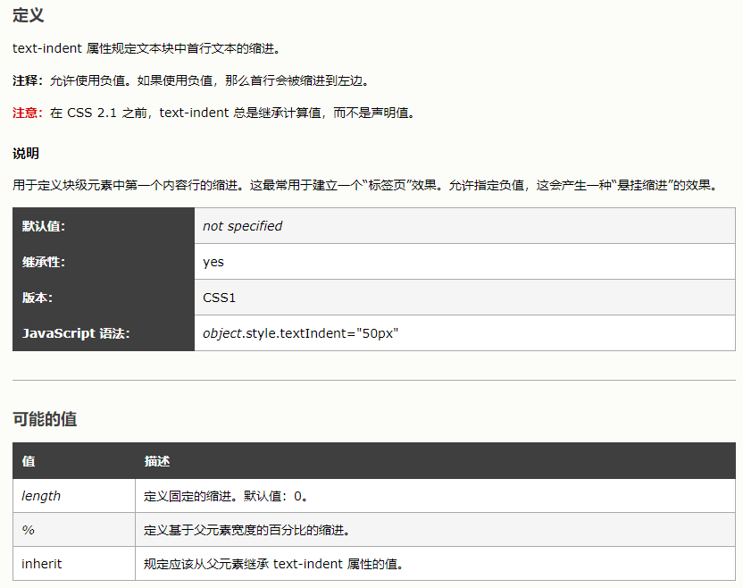

## 48.如何使用CSS实现段落首字母或首字放大效果

方法1：使用`::first-letter` 伪元素选择器

```css
p::first-letter {
  font-size: 2em;
  font-weight: bold;
}
```

方法2：

~~~css
div {
	text-transform: capitalize;
}

<div>
i come from China
</div>
~~~

## 49.`border-radius:50%`和`border-radius:100%`有什么区别

这个实际上可以仔细区分一下，楼上的两个图具体来说应该是 border-top-left-radius 的50%和100%的区别，

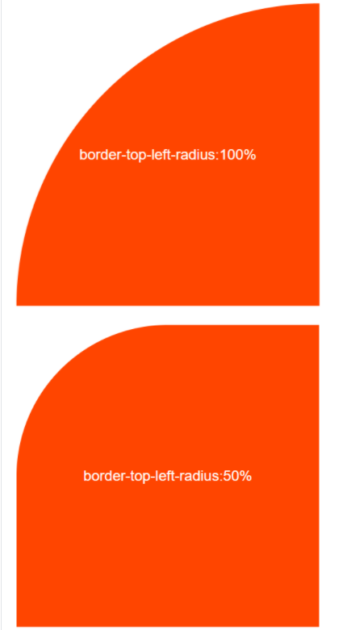

假如我们直接设置`border-radius: 100%;` 或者为50%

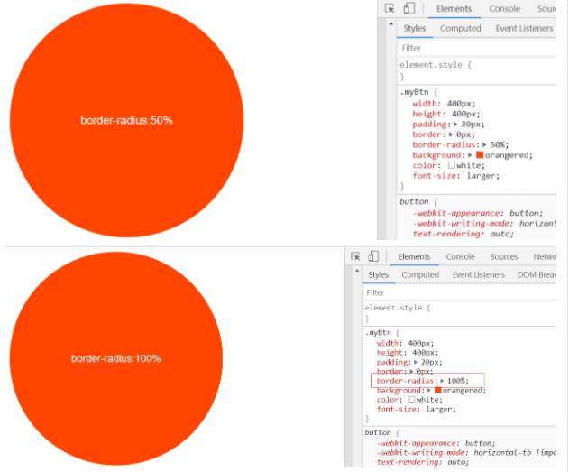

我们会发现这两个图实际上没有区别（长方形也一样），所以我们需要了解一下`border-radius`值真正的含义，
它的值如果是百分比的话，就相当于盒子的宽度和高度的百分比，所以`border-radius为50%`时，对应的是边长的一半，所以正方形会显示圆形，当我们再增加至100%这个过程中他的显示结果都不会改变，这是因为W3c有对于’曲线重合‘这样的规范，当两个邻角的 半径和超出了总边长，浏览器会重新计算保证不会重合，所以建议使用`border-radius:50%`来避免浏览器进行不必要的计算。

这里附一个[说明](https://zhuanlan.zhihu.com/p/20128284)

## 50.如何用CSS自定义滚动条？能做到所有浏览器兼容吗？想要做兼容怎么办呢

[CSS3或CSS+JS实现改变滚动条样式(兼容所有浏览器)](https://www.cnblogs.com/yclblog/p/6806496.html)

~~~css
/*定义滚动条高宽及背景 高宽分别对应横竖滚动条的尺寸*/  
::-webkit-scrollbar  
{  
    width: 16px;  /*滚动条宽度*/
    height: 16px;  /*滚动条高度*/
}  
  
/*定义滚动条轨道 内阴影+圆角*/  
::-webkit-scrollbar-track  
{  
    -webkit-box-shadow: inset 0 0 6px rgba(0,0,0,0.3);  
    border-radius: 10px;  /*滚动条的背景区域的圆角*/
    background-color: red;/*滚动条的背景颜色*/  
}  
  
/*定义滑块 内阴影+圆角*/  
::-webkit-scrollbar-thumb  
{  
    border-radius: 10px;  /*滚动条的圆角*/
    -webkit-box-shadow: inset 0 0 6px rgba(0,0,0,.3);  
    background-color: green;  /*滚动条的背景颜色*/
}  
~~~

# JS

## 1. 实现异步编程有哪些方式？推荐用哪种

- 回调函数: 最传统的异步处理，下一步的操作交给前一步来控制。当要处理的内容较多时，会出现回调地狱。代码会比较难维护和处理。
- 事件监听:事件执行顺序取决于某个事件是否触发
- Generator: 通过迭代器来实现异步操作。
- Promise: ES6 新增特性。通过 `resolve` 和 `reject` 来实现异步操作。
- async/await: 在 JavaScript 中为 Generator 的语法糖，在书写上和同步一样，比较直观易懂。但是需要注意的是 `await` 会阻塞后面的代码。因此当没有关联关系的程序先后执行时，要注意不要让 `await` 堵塞。

推荐使用async/await配合promise

## 2.说说CORS为何要区分预检请求和简单请求呢

[CORS 简单请求+预检请求（彻底理解跨域）](https://github.com/amandakelake/blog/issues/62)

[不要再问我跨域的问题了](https://segmentfault.com/a/1190000015597029)

### 概述

当一个资源从与该资源本身所在的服务器不同的`域、协议、端口`请求一个资源时，资源会发起一个跨域 HTTP 请求。同源策略参考[浏览器的同源策略 | MDN](https://developer.mozilla.org/zh-CN/docs/Web/Security/Same-origin_policy)

出于安全原因，浏览器限制从脚本内发起的跨源HTTP请求，XMLHttpRequest和Fetch API，只能从加载应用程序的同一个域请求HTTP资源，除非使用`CORS头文件`

对于**浏览器限制**这个词，要着重解释一下：不一定是浏览器限制了发起跨站请求，也可能是跨站请求可以正常发起，但是返回结果被浏览器拦截了

### CORS概述

跨域资源共享标准新增了一组 HTTP 首部字段，允许服务器声明哪些源站通过浏览器有权限访问哪些资源。

另外，规范要求，对那些可能对服务器数据产生副作用的 HTTP 请求方法（特别是 GET 以外的 HTTP 请求，或者搭配某些 MIME 类型的 POST 请求），**浏览器必须首先使用 OPTIONS 方法发起一个预检请求（preflight request），从而获知服务端是否允许该跨域请求。**

**服务器确认允许之后，才发起实际的 HTTP 请求**。在预检请求的返回中，服务器端也可以通知客户端，是否需要携带身份凭证（包括 Cookies 和 HTTP 认证相关数据）。


### 简单请求

不会触发CORS预检的请求称为简单请求，满足以下**所有条件**的才会被视为简单请求，基本上我们日常开发只会关注前面两点

1. 使用`GET、POST、HEAD`其中一种方法
2. 只使用了如下的安全首部字段，不得人为设置其他首部字段
   - `Accept`
   - `Accept-Language`
   - `Content-Language`
   - `Content-Type`仅限以下三种
     - `text/plain`
     - `multipart/form-data`
     - `application/x-www-form-urlencoded`
   - HTML头部header field字段：`DPR、Download、Save-Data、Viewport-Width、WIdth`
3. 请求中的任意`XMLHttpRequestUpload` 对象均没有注册任何事件监听器；XMLHttpRequestUpload 对象可以使用 XMLHttpRequest.upload 属性访问
4. 请求中没有使用 ReadableStream 对象

### 预检请求

需预检的请求要求必须首先使用 `OPTIONS` 方法发起一个预检请求到服务器，以获知服务器是否允许该实际请求。"预检请求“的使用，可以避免跨域请求对服务器的用户数据产生未预期的影响

下面的请求会触发预检请求，其实非简单请求之外的就会触发预检，就不用记那么多了

1. 使用了`PUT、DELETE、CONNECT、OPTIONS、TRACE、PATCH`方法
2. 人为设置了非规定内的其他首部字段，参考上面简单请求的安全字段集合，还要特别注意`Content-Type`的类型
3. `XMLHttpRequestUpload` 对象注册了任何事件监听器
4. 请求中使用了`ReadableStream`对象

以下是一个发起预检请求的例子
发起请求的`origin`与请求的服务器的`host`不同，而且根据上面的条件判断，触发了预检

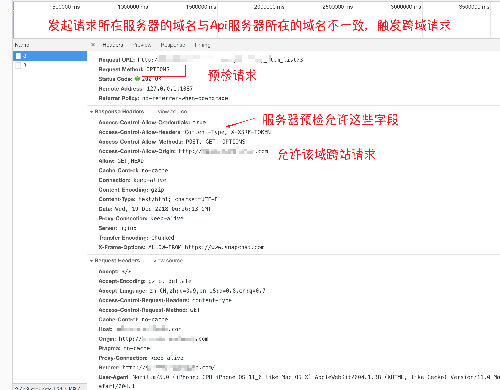

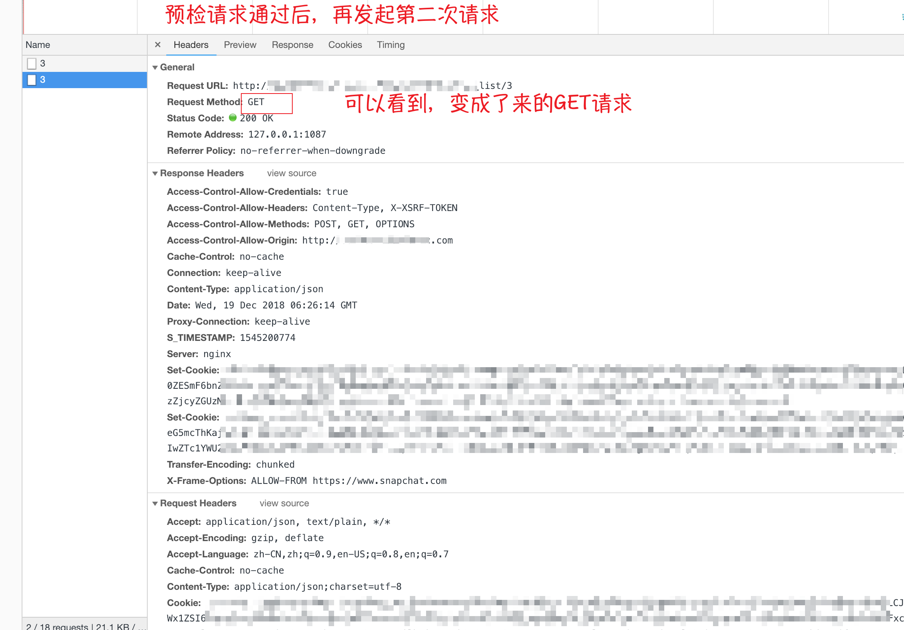

### 请求附带身份凭证 -> cookies

如果发起请求时设置`withCredentials` 标志设置为 `true`，从而向服务器发送cookie， 但是如果服务器端的响应中未携带`Access-Control-Allow-Credentials: true`，浏览器将不会把响应内容返回给请求的发送者

对于附带身份凭证的请求，服务器不得设置 `Access-Control-Allow-Origin` 的值为`*`， 必须是某个具体的域名

注意，简单 GET 请求不会被预检；如果对此类带有身份凭证请求的响应中不包含该字段，这个响应将被忽略掉，并且浏览器也不会将相应内容返回给网页

### 完整请求流程


参考

[HTTP访问控制（CORS） | MDN](https://developer.mozilla.org/zh-CN/docs/Web/HTTP/Access_control_CORS)
[Server-Side Access Control | MDN](https://developer.mozilla.org/zh-CN/docs/Web/HTTP/Server-Side_Access_Control)
[Using CORS - HTML5 Rocks](https://www.html5rocks.com/en/tutorials/cors/)
[浏览器的同源策略 | MDN](https://developer.mozilla.org/zh-CN/docs/Web/Security/Same-origin_policy)

## 3.你知道1和Number(1)的区别是什么吗

~~~javascript
var a = 1
var b = Number(1)
a === b
// true
typeof a
// "number"
typeof b
// "number"
var c = Number(1)
b === c
// true
~~~

`1.length`会出错是语法层面的，解释器会默认把这个`.`号认成为小数点，所以`1.length`你可以理解为`(1.)length`，当然语法错误啦。而你写成`1..length`或`(1).length`就不会出错了。[这里也有解释](https://github.com/haizlin/fe-interview/issues/130)

无论是`1`还是`Number(1)` 本质就是一个东西，其结果都是[字面量](https://developer.mozilla.org/zh-CN/docs/Web/JavaScript/Guide/Grammar_and_types#字面量_(Literals))，在你尝试将字面量当成对象并调用其方法时会自动装箱并以这样的形式调用：`new Number(1).length`

## 4.如何实现锁定网页、密码解锁的效果？说说你的方法和步骤是什么

监听用户鼠标移动事件，键盘按键事件。写一个定时器，开始计时，指定5分钟锁定的网页的时间。
若无操作，则隐藏当前页面，切换为输入密码页面。若有操作，则清空定时器，重新开始计时。

一般需要处理的是鼠标点击/鼠标滑动/鼠标滚动/键盘输入这四个事件，
分别处理比如 `pointer-events: none;`/蒙层/`overflow: hidden;`/`tabindex="-1"` 还是复杂了点，
最最简单的还是 `display: none` 然后放壁纸动画了。
判断何时锁屏也是监听上述四个事件咯。

## 5.用JS模拟实现微信抢红包的算法，并说明你的思路 

[微信红包算法(JS)](https://www.jianshu.com/p/11494478a7e9)

思路：

* 设置最小金额为0.01，最大金额为剩余金额/剩余红包数量的2倍
* 在最大最小金额之间取一个随机数作为红包的金额
* 储存该金额到moneyList同时红包数量减一，剩余总金额减去该金额
* 循环1,2,3步骤直到红包数量只剩1个
* 将最后一个红包数量添加到moneyList，返回moneyList就是红包的分配结果

~~~javascript
function getRandomMoney(remainMoney,remainSize){
let moneyList=[];
  const min=0.01;
  let max,money;
  while (remainSize>1){
    max=remainMoney/remainSize*2;
    money=Math.random()*max;
    money=money<0.01 ? 0.01 : money;
    money=Math.round(money*100)/100;
    moneyList.push(money);
    remainSize--;
    remainMoney-=money;
  }
  
  moneyList.push(Math.round(remainMoney*100)/100);
  return moneyList;
}
const testCount=2000;   //测试次数
const maxMoney=100;   //红包总金额
const maxSize=20;    //红包个数
let result=[];  //结果集
for(let i=0; i<testCount; i++){
  result.push(getRandomMoney(maxMoney,maxSize));
}
console.log("这2000次模拟的结果是："+result);
~~~

## 6.用原生JS封装插件的方式有哪些

一般的插件封装

~~~javascript
;(function (global) { 
  "use strict";
  function MyPlugin(el, options) {
    //some cod
  };
  MyPlugin.prototype = {
    //定义方法
    show: function () {
      //some code
    }
 };
  if (typeof module !== 'undefined' && module.exports) {    //兼容CommonJs规范 
    module.exports = MyPlugin;
  } else if (typeof define === 'function') {   //兼容AMD/CMD规范
    define(function () {
      return MyPlugin
    })
  } else {    //注册全局变量，兼容直接使用script标签引入插件
    global.MyPlugin = MyPlugin;
  }
})(this);
~~~

## 7.举例说明JS拖拽用到的事件有哪些

* 传统方式
  * PC：`mousedown`、 `mousemove`、 `mouseup`
  * 移动端：`touchstart` 、`touchmove`  、`touchend`
  * 原理：通过计算坐标的方式来实现元素的可视化移动。
* HTML5原生拖拽
  * `dragstart` 、`drag` 、`dragenter` 、`dragover` 、`dragleave` 、`drop` 、`dragend`
  * 原理：通过对被拖动元素和拖动目标元素进行事件监听，实现拖动效果
* 区别
  * 传统方式是实现元素的实时移动，HTML5原生拖拽事件是体现元素的拖拽结果，需要确定拖拽的目标区域，如应用于拖拽上传。


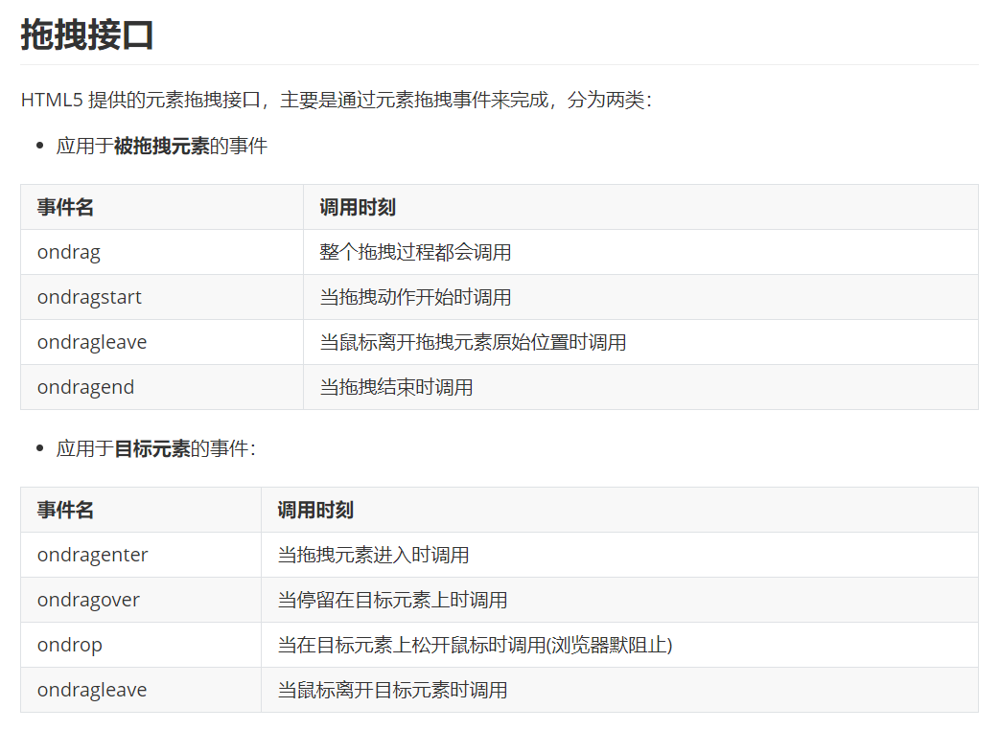


## 8.举例说明数组的排序方法有哪些

* `reverse()` 直接颠倒数组中的元素

```javascript
// 颠倒排序
var a = [1,2,3];
var b = a.reverse();
console.log(a); // [3,2,1]
console.log(b); // [3,2,1]
```

* `sort()` 自定义排序,基础是按照字符编码(Unicode->UTF-16)进行排序(数组在原数组上进行排序，不生成副本)

```javascript
// 颠倒排序
var x = [1,3,2];
var y = x.sort((a,b) => {
    // if (a < b ) {
    //     return -1;
    //   }
    //   if (a > b ) {
    //     return 1;
    //   }
    //   // a must be equal to b
    //   return 0;

    // 以上可以简写如下
    return a - b;
});
console.log(y) // [1, 2, 3]
```

* `for`循环

  * 冒泡排序

  ```javascript
  function bubbleSort(arr) {
      var i = arr.length,
          j;
      var tempExchangVal;
      while (i > 0) {
          for (j = 0; j < i - 1; j++) {
              if (arr[j] > arr[j + 1]) {
                  tempExchangVal = arr[j];
                  arr[j] = arr[j + 1];
                  arr[j + 1] = tempExchangVal;
              }
          }
          i--;
      }
      return arr;
  }
  
  var arr = [3, 2, 4, 9, 1, 5, 7, 6, 8];
  var arrSorted = bubbleSort(arr);
  console.log(arrSorted);
  ```

  * 快速排序

  ```javascript
  const quickSort = (array) => {
      const sort = (arr, left = 0, right = arr.length - 1) => {
          if (left >= right) {//如果左边的索引大于等于右边的索引说明整理完毕
              return
          }
          let i = left
          let j = right
          const baseVal = arr[j] // 取无序数组最后一个数为基准值
          while (i < j) {//把所有比基准值小的数放在左边大的数放在右边
              while (i < j && arr[i] <= baseVal) { //找到一个比基准值大的数交换
                  i++
              }
              arr[j] = arr[i] // 将较大的值放在右边如果没有比基准值大的数就是将自己赋值给自己（i 等于 j）
              while (j > i && arr[j] >= baseVal) { //找到一个比基准值小的数交换
                  j--
              }
              arr[i] = arr[j] // 将较小的值放在左边如果没有找到比基准值小的数就是将自己赋值给自己（i 等于 j）
          }
          arr[j] = baseVal // 将基准值放至中央位置完成一次循环（这时候 j 等于 i ）
          sort(arr, left, j - 1) // 将左边的无序数组重复上面的操作
          sort(arr, j + 1, right) // 将右边的无序数组重复上面的操作
      }
      const newArr = array.concat() // 为了保证这个函数是纯函数拷贝一次数组
      sort(newArr)
      return newArr
  }
  
  console.log(quickSort([6,1,1,3,4]))
  ```

## 9.在JS中attribute和property的区别是什么(好题)

[详解 HTML attribute 和 DOM property](https://zhuanlan.zhihu.com/p/70671215)

在大多数的文章中，attribute 一般被翻译为“特性”，property 被译为“属性”。

### 概述

当我们书写 HTML 代码的时候，我们为 HTML 元素设置特性 ，例如：

```html
<input id="name" value="justjavac" />
```

我们写了一个 `input` 标签，并给他定义了 2 个特性 (`id` 和 `value`)。当浏览器解析这段代码的时候，会把 html 源码解析为 DOM 对象，确切的说是解析为 `HTMLInputElement` 对象。`HTMLInputElement` 的继承关系是：

```text
HTMLInputElement
  ↓
HTMLElement
  ↓
Element
  ↓
Node
  ↓
EventTarget
  ↓
Object
```

通过查看文档会发现，`HTMLInputElement` 的原型上定义了很多属性和方法，例如 `form`, `name`, `type`, `alt`, `checked`, `src`, `value` 等等，还有从 `HTMLElement` 继承来的 `id`, `title`, `clientTop` 等等。

如果仔细找找，就不难发现其中就有我们为 `input` 标签定义的特性：`id` 和 `value`。**当浏览器解析网页时，将 HTML 特性映射为了 DOM 属性**。

而 `Element` 类还有一个 `attributes` 属性，里面包含了所有的特性。

但是，**HTML attribute 和 DOM property 并不总是一对一的关系**。

### DOM 属性

当浏览器解析完 HTML 后，生成的 DOM 是一个继承自 Object 的常规 JavaScript 对象，因此我们可以像操作任何 JS 对象那样来操作 DOM 对象。

```js
const el = document.getElementById('name')
el.foo = 'bar'
el.user = { name: 'jjc', age: '18'}
```

也可以为其添加方法。如果你想给每个 html 元素都添加属性或方法，甚至可以直接修改 `Element.prototype`，不过我们不推荐这么做。

HTML 特性

和 DOM 属性类似，除了那些规范里定义的标准特性外，HTML 也可以添加非标准的属性，例如：

```html
<input id="name" value="justjavac" foo="bar" />
```

当 HTML 特性映射为 DOM 属性时，只映射标准属性，**访问非标准属性将得到 undefined**。

```js
const el = document.getElementById('name')
el.foo === undefined
```

好在 DOM 对象也提供了操作特性的 API：

* `Element.hasAttribute(name)` – 判断某个特性是否存在
* `elem.getAttribute(name`) – 获取指定特性的值
* `elem.setAttribute(name, value)` – 设置指定特性的值
* `elem.removeAttribute(name)` – 移除指定特性

以上 API 定义在 `Element` 上。

根据 HTML 规范，标签以及特性名是不区分大小写的，因此以下代码是一样的：

```js
el.getAttribute('id')
el.getAttribute('ID')
el.getAttribute('iD')
```

并且，**特性永远都是字符串或 null**。如果我们为特性设置非字符串的值，则引擎会将此值转换为字符串。属性是具有类型的：

```js
el.getAttribute('checked') === '' // 特性是字符串
el.checked === false              // 属性是 boolean 类型的值

el.getAttribute('style') === 'color:blue' // 特性是字符串
typeof el.style === 'object'                 // 属性是 CSSStyleDeclaration 对象
```

即使都是字符串，属性和特性也可能不同，有一个例外就是 `href`：

```js
el.getAttribute('href') === '#tag' // 特性原样返回 html 设置的值
el.href === 'http://jjc.fun#tag'   // 属性返回解析后的完整 uri
```

### 特性和属性的同步

当标准的特性更新时，对应的属性也会更新；反之亦然。

但是 `input.value` 的同步是单向的，只是 `attribute --> property`。当修改特性时，属性也会更新；但是修改属性后，特性却还是原值。

```js
el.setAttribute('value', 'jjc');  // 修改特性
el.value === 'jjc'                // 属性也更新了  

el.value = 'newValue';            // 修改属性 
el.getAttribute('value')) === 'jjc' // 特性没有更新
```

### 非标准特性

非标准 HTML 特性并不会自动映射为 DOM 属性。当我们使用 `data-` 开头的特性时，会映射到 DOM 的 dataset 属性。中划线格式会变成驼峰格式：

```js
el.setAttribute('data-my-name', 'jjc');
el.dataset.myName === 'jjc'

el.setAttribute('data-my-AGE', 18);
el.dataset.myAge === '18'
```

### 自定义特性 VS 非规范特性

HTML 允许我们自定义标签，也可以扩展标签的特性，但是我们推荐使用已经进入 HTML5 规范的自定义特性 `data-*`。比如我们想为`div` 标签增加一个 `age` 特性，我们可以有 2 种选择：

```html
<div age="18">justjavac</div>
<div data-age="18">justjavac</div>
```

虽然第一种代码更短，但是却有一个潜在的风险。因为 HTML 规范是一直发展变化的，也许在未来的某个版本中，`age` 被添加进了标准特性里面，这将会引起潜在的 bug。


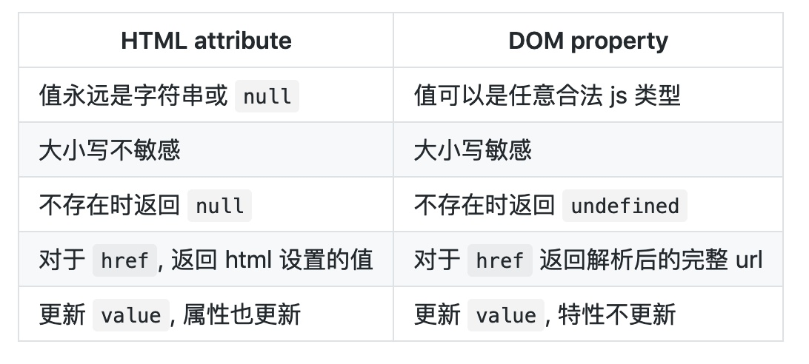

## 10.有些JS库习惯在代码开头处添加分号有什么作用呢？除了分号还可以换成别的吗？

JS文件结束处是没有分号的。若几个JS连在一起时，2个JS连接处会发生**语法上的混淆**。
开头加 分号`(;)`用于分隔， 可以避免多文件压缩 在一起时引起的错误。分号和分号放在一起也没问题，相当于 “空语句”。

## 11.说说你对执行上下文的理解(好题)

- 上下文是JS的运行栈，js在进出作用域时，就会形成不同的上下文环境
- 上下文环境的作用是存储当前作用域的值
- 与作用域不同，上下文环境是在代码运行时形成的
- 闭包时，出栈时，上下文并不会消失

```javascript
var a = 1; // 全局作用域
function foo () {
    // foo作用域
    const innerFuc = x => {
        // innerFuc作用域
        x++;
        return x;
    }
    return innerFuc() + a;
}
foo();
```

[理解 JavaScript 中的执行上下文和执行栈](https://juejin.im/post/6844903682283143181)

如果你是或者想成为一名 JavaScript 开发者，你必须知道 JavaScript 程序内部是如何执行的。理解执行上下文和执行栈对于理解其他 JavaScript 概念（如变量声明提升，作用域和闭包）至关重要。

正确理解执行上下文和执行栈的概念将使您成为更出色的 JavaScript 开发者。

### 什么是执行上下文？

简而言之，执行上下文是评估和执行 JavaScript 代码的环境的抽象概念。每当 Javascript 代码在运行的时候，它都是在执行上下文中运行。

### 执行上下文的类型

JavaScript 中有三种执行上下文类型。

- **全局执行上下文** — 这是默认或者说基础的上下文，任何不在函数内部的代码都在全局上下文中。它会执行两件事：创建一个全局的 window 对象（浏览器的情况下），并且设置 `this` 的值等于这个全局对象。一个程序中只会有一个全局执行上下文。
- **函数执行上下文** — 每当一个函数被调用时, 都会为该函数创建一个新的上下文。每个函数都有它自己的执行上下文，不过是在函数被调用时创建的。函数上下文可以有任意多个。每当一个新的执行上下文被创建，它会按定义的顺序（将在后文讨论）执行一系列步骤。
- **Eval 函数执行上下文** — 执行在 `eval` 函数内部的代码也会有它属于自己的执行上下文，但由于 JavaScript 开发者并不经常使用 `eval`，所以在这里我不会讨论它。

### 执行栈

执行栈，也就是在其它编程语言中所说的“调用栈”，是一种拥有 LIFO（后进先出）数据结构的栈，被用来存储代码运行时创建的所有执行上下文。

当 JavaScript 引擎第一次遇到你的脚本时，它会创建一个全局的执行上下文并且压入当前执行栈。每当引擎遇到一个函数调用，它会为该函数创建一个新的执行上下文并压入栈的顶部。

引擎会执行那些执行上下文位于栈顶的函数。当该函数执行结束时，执行上下文从栈中弹出，控制流程到达当前栈中的下一个上下文。

让我们通过下面的代码示例来理解：

~~~javascript
let a = 'Hello World!';

function first() {
  console.log('Inside first function');
  second();
  console.log('Again inside first function');
}

function second() {
  console.log('Inside second function');
}

first();
console.log('Inside Global Execution Context');
~~~


上述代码的执行上下文栈。

当上述代码在浏览器加载时，JavaScript 引擎创建了一个全局执行上下文并把它压入当前执行栈。当遇到 `first()` 函数调用时，JavaScript 引擎为该函数创建一个新的执行上下文并把它压入当前执行栈的顶部。

当从 `first()` 函数内部调用 `second()` 函数时，JavaScript 引擎为 `second()` 函数创建了一个新的执行上下文并把它压入当前执行栈的顶部。当 `second()` 函数执行完毕，它的执行上下文会从当前栈弹出，并且控制流程到达下一个执行上下文，即 `first()` 函数的执行上下文。

当 `first()` 执行完毕，它的执行上下文从栈弹出，控制流程到达全局执行上下文。一旦所有代码执行完毕，JavaScript 引擎从当前栈中移除全局执行上下文。

### 怎么创建执行上下文？

到现在，我们已经看过 JavaScript 怎样管理执行上下文了，现在让我们了解 JavaScript 引擎是怎样创建执行上下文的。

创建执行上下文有两个阶段：**1) 创建阶段** 和 **2) 执行阶段**。

#### 创建阶段

在 JavaScript 代码执行前，执行上下文将经历创建阶段。在创建阶段会发生三件事：

1. **this** 值的决定，即我们所熟知的 **This 绑定**。
2. 创建**词法环境**组件。
3. 创建**变量环境**组件。

所以执行上下文在概念上表示如下：

~~~javascript
ExecutionContext = {
  ThisBinding = <this value>,
  LexicalEnvironment = { ... },
  VariableEnvironment = { ... },
}
~~~

##### This 绑定：

在全局执行上下文中，`this` 的值指向全局对象。(在浏览器中，`this`引用 Window 对象)。

在函数执行上下文中，`this` 的值取决于该函数是如何被调用的。如果它被一个引用对象调用，那么 `this` 会被设置成那个对象，否则 `this` 的值被设置为全局对象或者 `undefined`（在严格模式下）。例如：

~~~javascript
let foo = {
  baz: function() {
  console.log(this);
  }
}

foo.baz();   // 'this' 引用 'foo', 因为 'baz' 被对象 'foo' 调用 

let bar = foo.baz;

bar();       // 'this' 指向全局 window 对象，因为没有指定引用对象
~~~

##### 词法环境

官方的 ES6 文档把词法环境定义为

> **词法环境**是一种规范类型，基于 ECMAScript 代码的词法嵌套结构来定义**标识符**和具体变量和函数的关联。一个词法环境由环境记录器和一个可能的引用**外部**词法环境的空值组成。

简单来说**词法环境**是一种持有**标识符—变量映射**的结构。（这里的**标识符**指的是变量/函数的名字，而**变量**是对实际对象[包含函数类型对象]或原始数据的引用）。

现在，在词法环境的**内部**有两个组件：(1) **环境记录器**和 (2) 一个**外部环境的引用**。

1. **环境记录器**是存储变量和函数声明的实际位置。
2. **外部环境的引用**意味着它可以访问其父级词法环境（作用域）。

**词法环境**有两种类型：

- **全局环境**（在全局执行上下文中）是没有外部环境引用的词法环境。全局环境的外部环境引用是 **null**。它拥有内建的 Object/Array/等、在环境记录器内的原型函数（关联全局对象，比如 window 对象）还有任何用户定义的全局变量，并且 `this`的值指向全局对象。
- 在**函数环境**中，函数内部用户定义的变量存储在**环境记录器**中。并且引用的外部环境可能是全局环境，或者任何包含此内部函数的外部函数。

**环境记录器**也有两种类型（如上！）：

1. **声明式环境记录器**存储变量、函数和参数。
2. **对象环境记录器**用来定义出现在**全局上下文**中的变量和函数的关系。

简而言之，

- 在**全局环境**中，环境记录器是对象环境记录器。
- 在**函数环境**中，环境记录器是声明式环境记录器。

**注意： **对于**函数环境**，**声明式环境记录器**还包含了一个传递给函数的 `arguments` 对象（此对象存储索引和参数的映射）和传递给函数的参数的 **length**。

抽象地讲，词法环境在伪代码中看起来像这样：

~~~javascript
GlobalExectionContext = {
  LexicalEnvironment: {
    EnvironmentRecord: {
      Type: "Object",
      // 在这里绑定标识符
    }
    outer: <null>
  }
}

FunctionExectionContext = {
  LexicalEnvironment: {
    EnvironmentRecord: {
      Type: "Declarative",
      // 在这里绑定标识符
    }
    outer: <Global or outer function environment reference>
  }
}
~~~

##### 变量环境：

它同样是一个词法环境，其环境记录器持有**变量声明语句**在执行上下文中创建的绑定关系。

如上所述，变量环境也是一个词法环境，所以它有着上面定义的词法环境的所有属性。

在 ES6 中，**词法环境**组件和**变量环境**的一个不同就是前者被用来存储函数声明和变量（`let` 和 `const`）绑定，而后者只用来存储 `var` 变量绑定。

我们看点样例代码来理解上面的概念：

~~~javascript
let a = 20;
const b = 30;
var c;

function multiply(e, f) {
 var g = 20;
 return e * f * g;
}

c = multiply(20, 30);
~~~

执行上下文看起来像这样：

~~~javascript
GlobalExectionContext = {

  ThisBinding: <Global Object>,

  LexicalEnvironment: {
    EnvironmentRecord: {
      Type: "Object",
      // 在这里绑定标识符
      a: < uninitialized >,
      b: < uninitialized >,
      multiply: < func >
    }
    outer: <null>
  },

  VariableEnvironment: {
    EnvironmentRecord: {
      Type: "Object",
      // 在这里绑定标识符
      c: undefined,
    }
    outer: <null>
  }
}

FunctionExectionContext = {
  ThisBinding: <Global Object>,

  LexicalEnvironment: {
    EnvironmentRecord: {
      Type: "Declarative",
      // 在这里绑定标识符
      Arguments: {0: 20, 1: 30, length: 2},
    },
    outer: <GlobalLexicalEnvironment>
  },

VariableEnvironment: {
    EnvironmentRecord: {
      Type: "Declarative",
      // 在这里绑定标识符
      g: undefined
    },
    outer: <GlobalLexicalEnvironment>
  }
}
~~~

**注意** — 只有遇到调用函数 `multiply` 时，函数执行上下文才会被创建。

可能你已经注意到 `let` 和 `const` 定义的变量并没有关联任何值，但 `var` 定义的变量被设成了 `undefined`。

这是因为在创建阶段时，引擎检查代码找出变量和函数声明，虽然函数声明完全存储在环境中，但是变量最初设置为 `undefined`（`var` 情况下），或者未初始化（`let` 和 `const` 情况下）。

这就是为什么你可以在声明之前访问 `var` 定义的变量（虽然是 `undefined`），但是在声明之前访问 `let` 和 `const` 的变量会得到一个引用错误。

这就是我们说的变量声明提升。

#### 执行阶段

这是整篇文章中最简单的部分。在此阶段，完成对所有这些变量的分配，最后执行代码。

**注意** — 在执行阶段，如果 JavaScript 引擎不能在源码中声明的实际位置找到 `let` 变量的值，它会被赋值为 `undefined`。

### 结论

我们已经讨论过 JavaScript 程序内部是如何执行的。虽然要成为一名卓越的 JavaScript 开发者并不需要学会全部这些概念，但是如果对上面概念能有不错的理解将有助于你更轻松，更深入地理解其他概念，如变量声明提升，作用域和闭包。

## 12.写个给图片加水印的方法

[使用canvas在前端实现图片水印合成](https://www.zhangxinxu.com/wordpress/2017/05/canvas-picture-watermark-synthesis/#comment)

方法1：

~~~javascript
/**
 *
 * @param {*} image 图片 img对象
 * @param {*} words 水印内容
 */
export default function(image, words) {
  const { canvas, context } = getCanvas()
  let width = image.width
  let height = image.height
  canvas.width = width
  canvas.height = height
  canvas.style.width = image.style.width
  canvas.style.height = image.style.height

  context.drawImage(image, 0, 0)

  // 重复绘制内容贴图
  const mark = getMark(words)
  for (let i = 0; i < width; i += 250) {
    for (let j = 0; j < height; j += 250) {
      context.drawImage(mark, i, j)
    }
  }
  return toImage(canvas)
}

function toImage(canvas) {
  var image = new Image()
  image.src = canvas.toDataURL('image/png')
  return image
}

// 构造内容
function getMark(content = '') {
  const { canvas, context } = getCanvas()
  canvas.width = 200
  canvas.height = 200
  context.translate(100, 100)
  context.rotate((45 * Math.PI) / 180)
  context.font = '30px 微软雅黑'
  context.textAlign = 'center'
  // 隐形水印, 肉眼不可见,图片被人下载后可用ps查看
 // content 一般是登录的信息，用以内部截图外泄后查清截图人身份用
  context.fillStyle = 'rgba(220,20,60, 0.005)' 

  const words = content.split('\n') // 以\n为换行
  const lines = words.length
  const fontHeight = context.measureText('田').width * 1.1
  const wordsHeight = fontHeight * lines
  const start = -wordsHeight / 2
  for (let i = 0; i < lines; i++) {
    context.fillText(words[i], 0, start + i * fontHeight)
  }
  return canvas
}

function getCanvas() {
  const canvas = document.createElement('canvas')
  return {
    canvas,
    context: canvas.getContext('2d')
  }
}
~~~

方法2：

- 都用Canvas的方案解决
- 情况一：水印是图片（两张图片canvas.drawImage两次重叠即可）

```javascript
<input type="file" id="uploadFile" class="clip" accept="image/*">
<label class="ui-button ui-button-primary" for="uploadFile">选择图片</label>

<p id="imgUploadX"></p>
var eleUploadFile = document.getElementById('uploadFile');
var eleImgCover = document.getElementById('imgCover');
var eleImgUploadX = document.getElementById('imgUploadX');

if (history.pushState) {
    eleUploadFile.addEventListener('change', function (event) {
        var reader = new FileReader();
        var file = event.target.files[0] || event.dataTransfer.files[0];

        reader.onload = function (e) {
            var base64 = e.target.result;
            if (base64.length > 1024 * 500) {
                alert('图片尺寸请小于500K');
                return;
            } else {
                // 使用canvas合成图片，并base64化
                imgTogether(base64, function (url) {
                    // 尺寸
                    var size = 180 / (window.devicePixelRatio || 1);
                    // 预览
                    eleImgUploadX.innerHTML = '';
                });
            }
        };

        reader.readAsDataURL(file);
    });

    // canvas图片合成
    var imgTogether = function (url, callback) {
        var canvas = document.createElement('canvas');
        var size = 180;
        canvas.width = size;
        canvas.height = size;

        var context = canvas.getContext('2d');

        // 这是上传图像
        var imgUpload = new Image();
        imgUpload.onload = function () {
            // 绘制
            context.drawImage(imgUpload, 0, 0, size, size, 0, 0, size, size);
            // 再次绘制
            context.drawImage(eleImgCover, 0, 0, size, size, 0, 0, size, size);
            // 回调
            callback(canvas.toDataURL('image/png'));
        };
        imgUpload.src = url;
    };
    
} else if (eleImgUploadX) {
    eleImgUploadX.className = 'remind';
    eleImgUploadX.innerHTML = '本演示IE10+下才有效果';
}
```

- 情况二：水印是纯文字

```javascript
#wrap {
    display: inline-block;
}
<div id="wrap">
    
</div>
<script src="js/app.js"></script>
(function () {
    // canvas 实现 watermark
    function __canvasWM({
        // 使用 ES6 的函数默认值方式设置参数的默认取值
        // 具体参见 https://developer.mozilla.org/zh-CN/docs/Web/JavaScript/Reference/Functions/Default_parameters
        container = document.body,
        image,
        width = '200px',
        height = '150px',
        textAlign = 'center',
        textBaseline = 'middle',
        font = "20px microsoft yahei",
        fillStyle = 'rgba(184, 184, 184, 0.8)',
        content = '请勿外传',
        rotate = '30',
        zIndex = 1000
    } = {}) {
        var args = arguments[0];
        var canvas = document.createElement('canvas');

        canvas.setAttribute('width', image.width);
        canvas.setAttribute('height', image.height);
        var ctx = canvas.getContext("2d");

        ctx.textAlign = textAlign;
        ctx.textBaseline = textBaseline;
        ctx.font = font;
        ctx.fillStyle = fillStyle;
        ctx.rotate(Math.PI / 180 * rotate);
        ctx.fillText(content, parseFloat(image.width) / 2, parseFloat(image.height) / 2);

        var base64Url = canvas.toDataURL();
        const watermarkDiv = document.createElement("div");
        watermarkDiv.setAttribute('style', `
        position:absolute;
        top:0;
        left:0;
        width:100%;
        height:100%;
        z-index:${zIndex};
        pointer-events:none;
        background-repeat:repeat;
        background-image:url('${base64Url}')`);
        container.style.position = 'relative';
        container.insertBefore(watermarkDiv, container.firstChild);
    }

    window.__canvasWM = __canvasWM;
})();

let imgEl = document.querySelector('#xxx');

imgEl.onload = function() {
    __canvasWM({
        container: document.querySelector('#wrap'),
        image: imgEl,
        content: 'fuck'
    })
}
```

## 13. 怎样在JavaScript中创建一个worker线程

[Web Worker 使用教程](http://www.ruanyifeng.com/blog/2018/07/web-worker.html)

webworker基本流程，新建一个worker，然后postMessage来传递数据，onmessage接收数据并执行函数。

~~~javascript
var worker = new Worker('a.js');
worker.postMessage('Hello World');
worker.onmessage = function (e) {
  console.log(e.data);
}
~~~

## 14. 举例说明JS如何拖拽排序

拆分功能，定义2个组件:

1. dragArea 拖拽区组件，就是根据数组遍历生成列表项，做drag事件代理
2. dragItem 单个列表成员渲染，绑定一些必要参数在DOM上
   每个item元素 打上h5 draggable 属性，并记下所在数组中的序号位置, 如 data-index = "0"
   记下在dragArea的dragStart事件中元素序号A，dragEnd事件中的元素序号B
   在数组里调整2个序号对应的对象的位置，更新渲染即可

~~~javascript
const $box = document.querySelector('.box');
let data = ['A', 'B', 'C', 'D'];

let fragment = document.createDocumentFragment();
let $li = document.createElement('li');
const render = () => {
    while ($box.children.length > 0) {
        $box.removeChild($box.firstChild)
    }
    data.forEach((e, i) => {
        let $cloneLi = $li.cloneNode();
        $cloneLi.innerHTML = e;
        $cloneLi.setAttribute('draggable', true);
        fragment.appendChild($cloneLi);
        $box.appendChild(fragment);
    });
}

const changeData = (fromValue, toValue) => {
    // fromIndex 原数据索引
    let fromIndex = data.indexOf(fromValue);
    // 删除fromIndex
    data.splice(fromIndex, 1);
    // toIndex(注意在删除之后取)
    let toIndex = data.indexOf(toValue);
    // 在toIndex后插入源数据
    data.splice(toIndex + 1, 0, fromValue);
}

render();

$box.setAttribute('draggable', false);

$box.addEventListener('dragstart', e => {
    let $currentLi = e.target;
    e.dataTransfer.setData('content', $currentLi.innerHTML);
})

$box.addEventListener('dragenter', e => { e.preventDefault(); })

$box.addEventListener('dragover', e => { e.preventDefault(); })

$box.addEventListener('drop', e => {
    let fromValue = e.dataTransfer.getData('content');
    let toValue = e.target.innerHTML;
    changeData(fromValue, toValue)
    render();
})
~~~

## 15. 举例说明如何使用WebSQL

举例1：

~~~javascript
var db = openDatabase('mydb', '1.0', 'Test DB', 2 * 1024 * 1024);
var msg;
 
db.transaction(function (tx) {
    tx.executeSql('CREATE TABLE IF NOT EXISTS LOGS (id unique, log)');
    tx.executeSql('INSERT INTO LOGS (id, log) VALUES (1, "菜鸟教程")');
    tx.executeSql('INSERT INTO LOGS (id, log) VALUES (2, "www.runoob.com")');
    msg = '<p>数据表已创建，且插入了两条数据。</p>';
    document.querySelector('#status').innerHTML =  msg;
});
 
db.transaction(function (tx) {
tx.executeSql('SELECT * FROM LOGS', [], function (tx, results) {
    var len = results.rows.length, i;
    msg = "<p>查询记录条数: " + len + "</p>";
    document.querySelector('#status').innerHTML +=  msg;
 
    for (i = 0; i < len; i++){
        msg = "<p><b>" + results.rows.item(i).log + "</b></p>";
        document.querySelector('#status').innerHTML +=  msg;
    }
}, null);
});
~~~

举例2：

~~~javascript
  var dbName = 'project';
    // 版本
    var version = 1;
    // 数据库数据结果
    var db;
    // 打开数据库
    var DBOpenRequest = window.indexedDB.open(dbName, version);
    // 如果数据库打开失败
    DBOpenRequest.onerror = function(event) {
        console.warn('数据库打开失败');
    };
    DBOpenRequest.onsuccess = function(event) {        
        // 存储数据结果
        db = DBOpenRequest.result;
    };
    
    // 下面事情执行于：数据库首次创建版本，或者window.indexedDB.open传递的新版本（版本数值要比现在的高）
    DBOpenRequest.onupgradeneeded = function(event) {
        var db = event.target.result;
     
        db.onerror = function(event) {
          console.warn('数据库打开失败');
        };
    
        // 创建一个数据库存储对象
        var objectStore = db.createObjectStore(dbName, { 
            keyPath: 'id',
            autoIncrement: true
        });
    
        // 定义存储对象的数据项
        objectStore.createIndex('id', 'id', {
            unique: true    
        });
        objectStore.createIndex('name', 'name');
        objectStore.createIndex('begin', 'begin');
        objectStore.createIndex('end', 'end');
        objectStore.createIndex('remark', 'remark');
    };
    
    var method = {
        add: function (newItem) {
            var transaction = db.transaction([dbName], "readwrite");
            // 打开已经存储的数据对象
            var objectStore = transaction.objectStore(dbName);
            // 添加到数据对象中
            var objectStoreRequest = objectStore.add(newItem);        
            objectStoreRequest.onsuccess = function(event) {
                console.log('插入成功')
            };
        },
        edit: function (id, data) {
            // 编辑数据
            var transaction = db.transaction([dbName], "readwrite");
            // 打开已经存储的数据对象
            var objectStore = transaction.objectStore(dbName);
            // 获取存储的对应键的存储对象
            var objectStoreRequest = objectStore.get(id);
            // 获取成功后替换当前数据
            objectStoreRequest.onsuccess = function(event) {
                // 当前数据
                var myRecord = objectStoreRequest.result;
                // 遍历替换
                for (var key in data) {
                    if (typeof myRecord[key] != 'undefined') {
                        myRecord[key] = data[key];
                    }
                }
                // 更新数据库存储数据                
                objectStore.put(myRecord);
            };
        },
        del: function (id) {
            // 打开已经存储的数据对象
            var objectStore = db.transaction([dbName], "readwrite").objectStore(dbName);            
            // 直接删除            
            var objectStoreRequest = objectStore.delete(id);
            // 删除成功后
            objectStoreRequest.onsuccess = function() {
              console.log('删除成功')
            };
        }
    };
~~~

## 16.怎么下载一个zip文件

- a标签加`download`属性

```css
<!-- download:指定下载文件的文件名 -->
<a href="http://somehost/somefile.zip" download="filename.zip">Download file</a>
```

- 文件流的方式

```javascript
var a = document.createElement('a');
var url = window.URL.createObjectURL(blob);
var filename = 'what-you-want.txt';
a.href = url;
a.download = filename;
a.click();
window.URL.revokeObjectURL(url);
```

- 注意：Bolb的方式构建完 blob 对象后才会转换成文件，所以尽量使用a标签的形式进行下载

## 17.你了解什么是AOP吗？它的作用是什么？举个例子

[面向切面编程（AOP），那我们说的切面到底是什么？](https://www.zhihu.com/question/57741911)

- 概念：AOP(面向切面编程)的主要作用是把一些跟核心业务逻辑模块无关的功能抽离出来，这些跟业务逻辑无关的功能通常包括日志统计、安全控制、异常处理等。把这些功能抽离出来之后， 再通过“动态织入”的方式掺入业务逻辑模块中。
- 好处:AOP的好处首先是可以保持业务逻辑模块的纯净和高内聚性，其次是可以很方便地复用日志统计等功能模块。
- demo

```
Function.prototype.before = function (beforefn) {
    var _self = this;    //保存原函数引用
    return function () { //返回包含了原函数和新函数的"代理函数"
        beforefn.apply(this, arguments); //执行新函数，修正this
        return _self.apply(this, arguments); //执行原函数
    }
};

Function.prototype.after = function (afterfn) {
    var _self = this;
    return function () {
        var ret = _self.apply(this, arguments);
        afterfn.apply(this, arguments);
        return ret;
    }
};

var func = function () {
    console.log("2")
}

func = func.before(function () {
    console.log("1");
}).after(function () {
    console.log("3");
} )

func();
```

## 18.如何解决在手机上长时间点击会选中图片

- 用事件穿透即可

```css
img {
    pointer-events: none; 
}
```

- CSS 禁止选中`user-select:none`,并不能解决长按选中图片的问题

* 长按不会出发`contextmenu`事件，长按并没有暴露出原生的事件

## 19. 说说你对ArrayBuffer的理解！它和Array有什么区别

- ArrayBuffer: 表示通用的、固定长度的原始二进制数据缓冲区。ArrayBuffer 不能直接操作，而是要通过类型数组对象或 DataView 对象来操作
- Array: 是JavaScript数组，可直接修改

## 20.用JS实现一个复制粘贴的功能

核心代码应该就是:

```javascript
obj.select();//通过选中对象再执行复制命令
document.execCommand("Copy")
```

实例：

~~~javascript
; (function () {
    const createInput = html => {
        let inputEl = document.createElement('input');
        inputEl.setAttribute('type', 'input');
        inputEl.value = html;
        return inputEl;
    }
    var key = '￥5uA302Tea83￥';
    var inputEl = createInput(key);
    document.body.appendChild(inputEl)
    inputEl.select();
    document.execCommand('copy')
})();
~~~

> 注意测试时不要focus在控制台，不然不生效

## 21.写一个根据xpath获取元素的方法

```javascript
function _x(STR_XPATH) {
    var xresult = document.evaluate(STR_XPATH, document, null, XPathResult.ANY_TYPE, null);
    var xnodes = [];
    var xres;
    while (xres = xresult.iterateNext()) {
        xnodes.push(xres);
    }
    return xnodes;
}
```

## 22.ES5和ES6、ES7有什么区别

首先就是版本不同（显而易见），每个版本都有新特性也可以说是这几个版本的区别吧

**ES5**

- 严格模式
- JSON API
- object API
- Array API

**ES6**

- class 类
- 模块化 import export
- 箭头函数
- 模板字符串
- Promise
- async/await
- 解构赋值
- let和const
- 函数参数默认值

**ES7**

- Array.prototype.includes
- 指数运算符

## 23.清空一个数组的方式有哪些？它们有什么区别

### 方法1

这是完美的，因为这实际上创建了一个全新的(空)数组
仅当您仅通过数组的原始变量A引用数组时才使用此选项。

```
let arr1 = [1,2,3]
let arr2 = arr1
arr1 = []
console.log(arr1,arr2) // [] [1,2,3]
```

### 方法2

通过将现有数组的长度设置为 0 来清除该数组
会影响元数组

```
const arr1 = [1,2,3]
const arr2 = arr1
arr1.length = 0
console.log(arr1,arr2) // [] []
```

### 方法3

.splice()函数将返回一个包含所有已删除项的数组，因此它实际上将返回原始数组的副本

```
const arr1 = [1,2,3]
const arr2 = arr1
arr1.splice(0,arr1.length)
console.log(arr1,arr2) // [] []
```

### 方法4

最慢的方法

```
const arr1 = [1,2,3]
const arr2 = arr1
while (arr1.length > 0) {
  arr1.pop()
}
console.log(arr1,arr2) // [] []
```

## 24.你知道断点续传的原理吗？用JS怎么实现

主要依赖http协议的206返回码。前提条件是通信双方使用http1.1以上协议。
客户端使用请求头Range告知自己需要的数据范围；服务器使用响应头Content-Range说明返回的数据范围和数据长度。

可以参考[HTTP请求范围](https://developer.mozilla.org/zh-CN/docs/Web/HTTP/Range_requests)

## 25.请说说你对promise的理解

[谈谈我对Promise的理解(一)](https://www.jianshu.com/p/002003a38e89)

可以从两个角度理解Promise:

* 一种角度是“Promise是对未来值 的封装”。
* 另一种角度是“可以把Promise看作完成事件”。

同时，Promise支持链式调用，也可以作为异步操作的流程控制。

## 26.请用JS实现一个promise的方法(好题)

[「中高级前端面试」JavaScript手写代码无敌秘籍](https://juejin.im/post/6844903809206976520#heading-16)

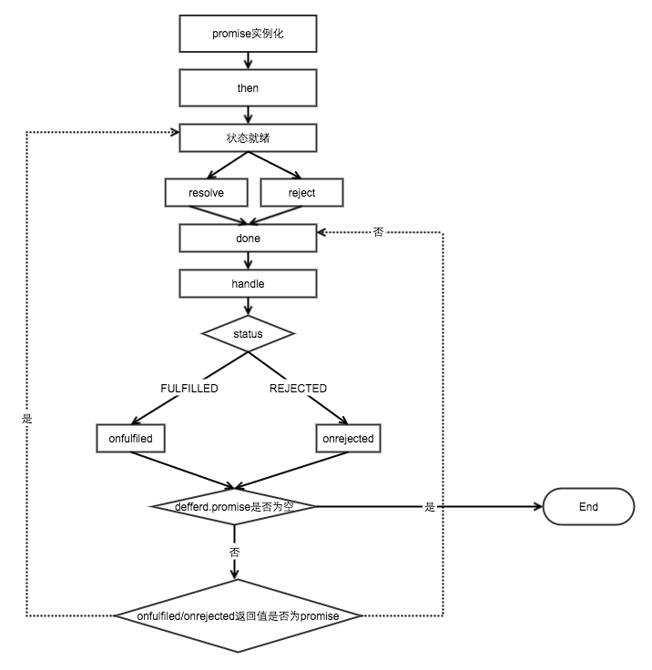

### 面试够用版

```javascript
function myPromise(constructor){
    let self=this;
    self.status="pending" //定义状态改变前的初始状态
    self.value=undefined;//定义状态为resolved的时候的状态
    self.reason=undefined;//定义状态为rejected的时候的状态
    function resolve(value){
        //两个==="pending"，保证了状态的改变是不可逆的
       if(self.status==="pending"){
          self.value=value;
          self.status="resolved";
       }
    }
    function reject(reason){
        //两个==="pending"，保证了状态的改变是不可逆的
       if(self.status==="pending"){
          self.reason=reason;
          self.status="rejected";
       }
    }
    //捕获构造异常
    try{
       constructor(resolve,reject);
    }catch(e){
       reject(e);
    }
}
myPromise.prototype.then=function(onFullfilled,onRejected){
   let self=this;
   switch(self.status){
      case "resolved":
        onFullfilled(self.value);
        break;
      case "rejected":
        onRejected(self.reason);
        break;
      default:       
   }
}
// 测试代码
var p=new myPromise(function(resolve,reject){resolve(1)});
p.then(function(x){console.log(x)})
//输出1
```

### 大厂专供版

```javascript
const PENDING = "pending";
const FULFILLED = "fulfilled";
const REJECTED = "rejected";

function Promise(excutor) {
    let that = this; // 缓存当前promise实例对象
    that.status = PENDING; // 初始状态
    that.value = undefined; // fulfilled状态时 返回的信息
    that.reason = undefined; // rejected状态时 拒绝的原因
    that.onFulfilledCallbacks = []; // 存储fulfilled状态对应的onFulfilled函数
    that.onRejectedCallbacks = []; // 存储rejected状态对应的onRejected函数

    function resolve(value) { // value成功态时接收的终值
        if(value instanceof Promise) {
            return value.then(resolve, reject);
        }
        // 实践中要确保 onFulfilled 和 onRejected 方法异步执行，且应该在 then 方法被调用的那一轮事件循环之后的新执行栈中执行。
        setTimeout(() => {
            // 调用resolve 回调对应onFulfilled函数
            if (that.status === PENDING) {
                // 只能由pending状态 => fulfilled状态 (避免调用多次resolve reject)
                that.status = FULFILLED;
                that.value = value;
                that.onFulfilledCallbacks.forEach(cb => cb(that.value));
            }
        });
    }
    function reject(reason) { // reason失败态时接收的拒因
        setTimeout(() => {
            // 调用reject 回调对应onRejected函数
            if (that.status === PENDING) {
                // 只能由pending状态 => rejected状态 (避免调用多次resolve reject)
                that.status = REJECTED;
                that.reason = reason;
                that.onRejectedCallbacks.forEach(cb => cb(that.reason));
            }
        });
    }

    // 捕获在excutor执行器中抛出的异常
    // new Promise((resolve, reject) => {
    //     throw new Error('error in excutor')
    // })
    try {
        excutor(resolve, reject);
    } catch (e) {
        reject(e);
    }
}

Promise.prototype.then = function(onFulfilled, onRejected) {
    const that = this;
    let newPromise;
    // 处理参数默认值 保证参数后续能够继续执行
    onFulfilled =
        typeof onFulfilled === "function" ? onFulfilled : value => value;
    onRejected =
        typeof onRejected === "function" ? onRejected : reason => {
            throw reason;
        };
    if (that.status === FULFILLED) { // 成功态
        return newPromise = new Promise((resolve, reject) => {
            setTimeout(() => {
                try{
                    let x = onFulfilled(that.value);
                    resolvePromise(newPromise, x, resolve, reject); // 新的promise resolve 上一个onFulfilled的返回值
                } catch(e) {
                    reject(e); // 捕获前面onFulfilled中抛出的异常 then(onFulfilled, onRejected);
                }
            });
        })
    }

    if (that.status === REJECTED) { // 失败态
        return newPromise = new Promise((resolve, reject) => {
            setTimeout(() => {
                try {
                    let x = onRejected(that.reason);
                    resolvePromise(newPromise, x, resolve, reject);
                } catch(e) {
                    reject(e);
                }
            });
        });
    }

    if (that.status === PENDING) { // 等待态
        // 当异步调用resolve/rejected时 将onFulfilled/onRejected收集暂存到集合中
        return newPromise = new Promise((resolve, reject) => {
            that.onFulfilledCallbacks.push((value) => {
                try {
                    let x = onFulfilled(value);
                    resolvePromise(newPromise, x, resolve, reject);
                } catch(e) {
                    reject(e);
                }
            });
            that.onRejectedCallbacks.push((reason) => {
                try {
                    let x = onRejected(reason);
                    resolvePromise(newPromise, x, resolve, reject);
                } catch(e) {
                    reject(e);
                }
            });
        });
    }
};
```

## 27. 说下你对函数的形参与实参的理解

我理解实参就是一个个变量，形参就是接这些变量的容器。

**形参**声明函数时，设置的参数。
**实参**函数调用时，代入的参数。

形参（形式参数）
在函数定义中出现的参数可以看做是一个占位符，它没有数据，只能等到函数被调用时接收传递进来的数据，所以称为形式参数，简称形参。
实参（实际参数）
函数被调用时给出的参数包含了实实在在的数据，会被函数内部的代码使用，所以称为实际参数，简称实参。
形参和实参的功能是传递数据，发生函数调用时，实参的值会传递给形参。

形参和实参的区别和联系

* 形参变量只有在函数被调用时才会分配内存，调用结束后，立刻释放内存，所以形参变量只有在函数内部有效，不能在函数外部使用。

* 实参可以是常量、变量、表达式、函数等，无论实参是何种类型的数据，在进行函数调用时，它们都必须有确定的值，以便把这些值传送给形参，所以应该提前用赋值、输入等办法使实参获得确定值。

* 函数调用中发生的数据传递是单向的，只能把实参的值传递给形参，而不能把形参的值反向地传递给实参；换句话说，一旦完成数据的传递，实参和形参就再也没有瓜葛了，所以，在函数调用过程中，形参的值发生改变并不会影响实参。

```javascript
function add(a,b){
  return a+b
}
add(1,2)
```

在以上代码中a,b就是**形参**，1和2就是**实参**

## 28.你知道什么是三元表达式吗？“三元” 表示什么意思？使用三元表达式应该注意些什么问题

* 顾名思义，三元表达式就是三个元素组成的表达式
* 三元： `条件？真结果 ：假结果`
* 注意的问题：避免嵌套三元表达式(首先容易出错，其次不符合编码规范，不利于他人阅读/理解。（代码不仅仅是写给机器跑的，还是写给人看的）)

## 29. JS如何把网页加入收藏夹功能

IE下使用addFavorite，firefox使用bookmarks；Opera，Google Chrome和Safari不提供此功能；

## 30.有什么方案可以提高无限滚动列表的性能

* 防抖和节流

* 减少 dom 数，减少可见元素。即，让超出屏幕的行隐藏或删除，在下一屏中显示或新建行。

* 虚拟列表

[浅说虚拟列表的实现原理](https://segmentfault.com/a/1190000016734597)

## 31.写一个密码生成器，并同时写一个密码强度校验的方法 

~~~javascript
/**
/*方法说明
 *@createPassword 密码范围 {0-9，A-Z, a-z}
 *@param
 * num {num} 生成密码长度
 *  b {num} 密码生成类型，1: 数字， 2:数字+小写，3.数字+大小写
 *@return {str} 
*/
**/
let createPassword = function (num, b) {
    let n = 0 //循环次数
    let arr = new Array // 随机数保存
    let Capitalization = () => Math.floor(Math.random() * b)// 随机取数0-2/0-1
    let randomNumber = [() => Math.floor(Math.random() * (57 - 48 + 1) + 48), () => Math.floor(Math.random() * (122 - 97 + 1) + 97), () => Math.floor(Math.random() * (90 - 65 + 1) + 65)] // 去随机值
    for (let i = 0; i < num; i++) {
        arr.push(randomNumber[Capitalization()]())
    }
    return arr.map(e => String.fromCharCode(e)).join('')
}

/*方法说明
 *@method passwordStrength 密码强度校验
 *@for 所属类名
 *@param 
 *        num{str} 密码
 *        len {num} 密码长度
 *@return {str} 返回密码等级

      str    ASCII
      0-9    48-57
      A-Z    65-90
      a-z    97-122

 */
let passwordStrength = function (num, len) {
    if(num.length<len) return '密码长度不够'
    let passwordLevel = ['弱', '普通', '较强', '强']
    let arr = new Array(4) // 记录密码等级
    num.split('').map(e => e.charCodeAt()).forEach(e => {
        if (e >= 48 && e <= 57) { arr[0] = 1 }
        else if (e >= 65 && e <= 90) { arr[1] = 1 }
        else if (e >= 91 && e <= 122) { arr[2] = 1 }
        else { arr[3] = 1 }
    })
    return passwordLevel[arr.reduce((a, b) => a + b) - 1]
}
~~~

## 32.为什么说JS是弱类型语言，它的优缺点分别是什么

这个题目可以让我们进行充分的思考，通过`弱类型语言`这几个字，我们可以进行如下拓展：

> `静态语言`：我们把在使用之前就需要确认其变量数据类型的称为静态语言。
>
> `动态语言`：我们把在运行过程中需要检查数据类型的语言称为动态语言。
>
> 通常把偷偷进行类型转换的操作成为`隐式类型转换`：
>
> 支持因此类型转换的语言称为`弱类型语言`，不支持隐式类型转换的语言称为`强类型语言`。
>
> `编译型语言`：通常都会对源代码进行编译，生成可以执行的二进制代码，执行的是编译后的结果。（C语言，C++、Object-C、swift）
>
> `解释型语言`:通常不用对源代码进行编译，一般是通过解释器载入脚本后运行。由于每个语句都是执行的时候才进行解释翻译，这样解释性语言每次执行就要翻译一次，效率相对要低。（JavaScript、Python、Erlang、PHP、Perl、Ruby）

> 由此我们知道，JS属于弱类型、动态、解释型语言。

[弱(强)类型语言、静(动)态语言、编译(解释)型语言概念总览](https://www.liugezhou.online/2019/10/15/弱(强)类型语言、静(动)态语言、编译(解释)型语言概念总览/)

弱类型语言：表现在定义变量的时候不用说明变量的类型，能够类型推断。

* 优点在于书写方便
* 缺点：在于不知道数据类型，可读性不高，不便与维护。在Typescript中做了优化，增加了泛型，接口，等强类型语言的概念。

## 33.在JS中函数返回多个值有哪些方法

[在JS方法中返回多个值的方法汇总](https://www.jb51.net/article/66414.htm)

函数`return expression`, 这个表达式应该是一个具体的值,这个具体的值可以是一个承载多个值的复杂值, 诸如Array,Object, Map,Set等方式来实现。

* 使用数组的方式

~~~javascript
<html>
<head>
  <title>JS函数返回多个值</title>
</head>
<body>
  <input type="button" onclick="getNames()" value="test" />
      
  <script>
	function getData(){
  		var names=new Array("oec2003","oec2004");
  		return names;
}
	function getNames(){
  		var names=getData();
  		alert(getData()[0]); //返回oec2003
}
</script>

</body>
</html>
~~~

* 将数据封装到JSON里面

~~~javascript
<html>
<head>
<title>JS函数返回多个值</title>
</head>
<body>
<input type="button" onclick="getInfo()" value="test"/>
    
<script>
function getData(){
  	var info={"name":"oec2003","age":"25"};
  	return info;
}

function getInfo(){
  	var info=getData();
  	var name=info["name"];
  	var age=info["age"];
  	alert("姓名："+name+" 年龄："+age);
}
</script>

</body>
</html>
~~~

* return取下标(最简单)

~~~javascript
<html>
<head>
<title>JS函数返回多个值</title>
</head>
<body>
<input type="button" onclick="getInfo()" value="test"/>
    
<script>
  function getData(){
    return ["oec2003", 25]
  }

  function getInfo(){
    var info = getData();
    alert("姓名：" + info[0] + "年龄：" + info[1]);
  }
</script>

</body>
</html>
~~~

## 34.说下你对面向对象的理解

[新手如何理解JS面向对象开发？](https://www.cnblogs.com/10ve/p/10660650.html)

说说我的理解吧：面向对象思想，就是将万事万物中具有相关的属性，相关的方法的东西，归纳成一个类。

当我们想做某一件事情的时候，先找到能解决这件事情的一个类，然后创建这个类的一个实例，用实例去完成这件事情。

由于一个类中的属性和方法联系非常紧密，并且与另一个类中的属性和方法并不相关，所以能够实现高内聚，低耦合的目的。

说点边缘的，现在普遍的观点是在组件化的东西其实并不推荐用面向对象(Class)来做，就如React也推出了hooks，其实extends/implements这些OO的东西并不适用与前端组件化的编程，就像Vue3，也是用函数表示组件，而非很早之前传言的Class。面向对象更适合后端的业务，而非Web前端的UI编程，前端更适合用函数式的编程方式。(小白的一点愚见，欢迎指教，轻喷~)

## 35. onload事件和DOMContentLoaded哪个先执行呢

DomContentLoaded先执行,它在DOM内容加载完毕,就可以执行,而不必等待img,css加载完成。

onload需要所有资源全都加载完成才可以;

~~~javascript
window.onload=function (){
    console.log('onload');
   }

document.addEventListener('DOMContentLoaded',()=>{
    console.log('domcontentloaded');
 })
~~~

> domcontentloaded先打印

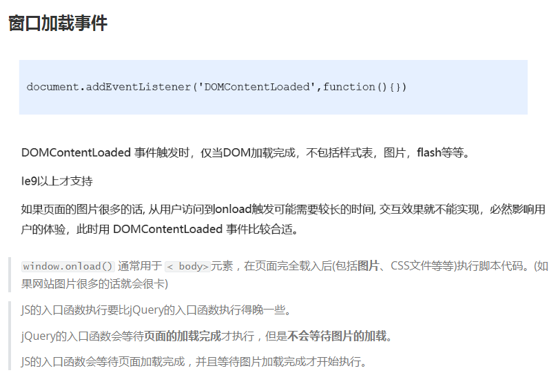

~~~javascript
<!DOCTYPE html>
<html lang="en">
<head>
    <meta charset="UTF-8">
    <title>Document</title>
    <script>
        //script在上面,button在下面，这样写是不行的，代码不会显示
        // var btn = document.querySelector('button');
        // btn.addEventListener('click',function(){
        //     alert('点击了');
        // })
			
       //window.onload很谦虚，它等图像，标签元素，JS,CSS等全部加载完了它才执行。
 			//window.onload也很专一，如果同时写多个window.onload,则只会显示最后一个。
        	//上面的window.onload不会有效果了
            // window.onload = function(){
            //     var btn = document.querySelector('button');
            //     btn.addEventListener('click',function(){
            //         alert('11点击了');
            //     })
            // }

            //  window.onload = function(){
            //        alert('22点击了');
            // }
            
			//window.addEventListener()很花心，不管写多少个，都可以正常显示
            window.addEventListener('load',function(){
                var btn = document.querySelector('button');
                btn.addEventListener('click',function(){
                    alert('11点击了');
                })
            })

            window.addEventListener('load',function(){
                var btn = document.querySelector('button');
                btn.addEventListener('click',function(){
                    alert('22点击了');
                })
            })

            //使用addEventListener则不会有冲突的问题，都可以显示
            
            // load 等页面内容全部加载完毕，包含页面DOM元素 图片 flash  CSS 等等
            document.addEventListener('DOMContentLoaded',function(){
                alert(33);

            })
            //先弹出了33，再显示按钮，再弹出11，最后弹出22
            // DOMContentLoaded 是DOM 加载完毕，不包含图片 falsh CSS 等就可以执行 
        	//加载速度比load更快一些
    </script>
</head>

<body>
    <button>点击</button>
    <!-- 代码是从上往下执行的，你必须要有button这个DOM元素，后面才能写JS，调用JS-->
    <!-- 如果script标签里的JS代码要放在上面，以前的做法是不行的 -->
    <!-- 如果非得要把script放在其他的地方,就用window.onload窗口加载事件-->
     <!-- <script>
        var btn = document.querySelector('button');
        btn.addEventListener('click',function(){
            alert('点击我');
        })
    </script> -->
</body>
</html>
~~~

## 36.当用户刷新网页时，JS的请求有哪些地方会有缓存处理呢

请求大多会缓存到这几个地方：

- Service Worker
- Memory Cache
- Disk Cache
- Push Cache

1、Service Worker

Service Worker 是运行在浏览器背后的独立线程，一般可以用来实现缓存功能。使用 Service Worker 的话，传输协议必须为 HTTPS。因为 Service Worker 中涉及到请求拦截，所以必须使用 HTTPS 协议来保障安全。Service Worker 的缓存与浏览器其他内建的缓存机制不同，它可以让我们自由控制缓存哪些文件、如何匹配缓存、如何读取缓存，并且缓存是持续性的。

- 自由控制缓存文件
- 可持续性缓存

2、Memory Cache

Memory Cache 也就是内存中的缓存，主要包含的是当前中页面中已经抓取到的资源，例如页面上已经下载的样式、脚本、图片等。读取内存中的数据肯定比磁盘快，内存缓存虽然读取高效，可是缓存持续性很短，会随着进程的释放而释放。一旦我们关闭 Tab 页面，内存中的缓存也就被释放了。

- 容量小
- 读取快
- 缓存时间短

3、Disk Cache

Disk Cache 也就是存储在硬盘中的缓存，读取速度慢点，但是什么都能存储到磁盘中，比之 Memory Cache 胜在容量和存储时效性上。
在所有浏览器缓存中，Disk Cache 覆盖面基本是最大的。它会根据 HTTP Header 中的字段判断哪些资源需要缓存，哪些资源可以不请求直接使用，哪些资源已经过期需要重新请求。并且即使在跨站点的情况下，相同地址的资源一旦被硬盘缓存下来，就不会再次去请求数据。

- 读取慢
- 容量大
- 缓存时间长

浏览器会把哪些文件丢进内存中？哪些丢进硬盘中？

- 对于大文件来说，大概率是不存储在内存中的，存在硬盘中。
- 当前系统内存使用率高的话，文件优先存储进硬盘。

4、Push Cache

Push Cache（推送缓存）是 HTTP/2 中的内容，当以上三种缓存都没有命中时，它才会被使用。它只在会话中存在，一旦会话结束就被释放，并且缓存时间也很短暂，在 Chrome 浏览器中只有 5 分钟左右，同时它也并非严格执行 HTTP 头中的缓存指令。Push Cache 在国内能够查到的资料很少，也是因为 HTTP/2 在国内不够普及。

- 只在会话中存在
- 会话结束后就被释放
- 缓存时间短

## 37.你有使用过FileReader吗？说说它有哪些应用场景

HTML5文件API，可以用于文件断点续传。

~~~javascript
<!DOCTYPE html>
<html lang="en">
<head>
    <meta charset="UTF-8">
    <meta name="viewport" content="width=device-width, initial-scale=1.0">
    <meta http-equiv="X-UA-Compatible" content="ie=edge">
    <title>Document</title>
</head>
<body>
    <!-- 展示图片 -->
    <!-- src:指定路径(资源定位--url):src请求的是外部文件，一般来说是服务器的资源，意味着它需要
    向服务器发送请求，它占用服务器资源 -->
    <!--  -->

    <!-- 需求：即时预览
     即时：当用户选择完图片之后立刻进行预览处理
     预览：通过文件读取对象的readAsDataURL() -->
    <form action="">
        <input type="file" name="myFile" id="myFile" multiple onchange="getFileContent();"><br>

        <p>读取txt文件</p>
        <input type="file" name="myFile" id="myTxtFile" multiple onchange="getTxtFileContent();"><br>

        <p>读取任意类型文件</p>
        <input type="file" name="myFile" id="myAnyFile" multiple onchange="getAnyFileContent();"><br>
        <input type="submit">
    </form>
    
    <script>
    /* FileReader:读取文件内容
     1.readAsText()：读取文本文件(可以使用txt打开的文件)，返回文本字符串值，默认编码是UTF-8；
     2.resadAsBinaryString()：读取任意类型的文件(因为任何文件的本质都是二进制)，返回二进制字符串，这个方法不是用来读取文件展示给用户看，
     而是存储文件；例如读取文件的内容，获取二进制数据，传递给后台，后台接受了数据之后，再将数据存储；
     3.readAsDataURL()：读取文件获取一段以data开头的字符串，这段字符串的本质就是DataURL。DataURL是一种将文件嵌入到文档的方案，(这个文件一般是指图像或其他能够嵌入到文档的文件格式)
DataURL是将资源转换为base64编码的字符串形式，并且将这些内容直接存储在url中，来优化网站的加载速度和执行效率
     4.abort():中断读取  abort：流产
     
     */

     function getFileContent(){
         //console.log('222');
         // 创建文件读取对象
         var reader = new FileReader();
        // 读取文件，获取DataURL
       // 细节：没有返回值void，但是（读取完文件之后）他会将读取的结果存储在文件读取对象的result中；
         // 需要传递一个参数binary large object：文件（图片或者其他可以嵌入到文档中的类型）；
         // 文件存储在file表单元素的files属性中，他是一个数组
         var file = document.querySelector("#myFile").files[0];
         //console.log(file);
         reader.readAsDataURL(file);
         // 获取数据
         /* FileReader提供了一个完整的事件模型，用来捕获读取文件时的状态
          onabort:读取文件断开时触发
          onerror:读取错误时触发
          onload:文件读取成功完成时触发
          onloadend:读取完成时触发，无论成功还失败
          onloadstart:开始读取时触发
          onprogress:读取文件过程中持续触发 */
         reader.onload = function(){
            //console.log(reader.result);
            document.querySelector("img").src = reader.result;
         }
         
     }

     function getTxtFileContent(){
         var reader = new FileReader();

        var txtFile = document.querySelector("#myTxtFile").files[0];
        reader.readAsText(txtFile);
        reader.onload = function(){
            console.log(reader.result);
        }
     }

     function getAnyFileContent(){
         var reader = new FileReader();

        var anyFile = document.querySelector("#myAnyFile").files[0];
        reader.readAsText(anyFile);
        reader.onload = function(){
            console.log(reader.result);
        }
     }
    </script>
</body>
</html>
~~~

## 38.stopPropagation()和preventDefault()这两个方法有什么区别

* stopPropagation 是**阻止事件冒泡**，即冒泡事件到当前元素处就终止了，不会继续向上级元素传递。

* preventDefault 是**阻止默认事件**，例如：在 a 标签的 click 事件中执行了该方法，则不会进行默认的链接跳转。

## 39.写一个方法将HTML页面生成为图片

[html2canvas](https://github.com/niklasvh/html2canvas/)

`F12`打开`chrome`控制台, `Ctrl + Shift + p` 打开控制台`console`，输入`Capture `想要哪种截图，任君选择。

## 40.用原生JS实现类似`getElementsByClassName`的方法，不能使用`querySelectorAll `

方法1：

~~~javascript
function getElementsByClassName(className)
    const tags = document.getElementsByTagName('*');
    const tempTags = [];
    for(let i=0, len = tags.length; i< len; i++)
    {
        let tag = tags[i];
        tag.classList.contains(className) && tempTags.push(tag)
    }
    return tempTags;
}
~~~

方法2：正则表达式

~~~javascript
function getElementsByClassName(className){
    const tags = document.getElementsByTagName('*');
    const reg = new RegExp("\\b" + className + "\\b");
    const tempTags = [];
    for(let i=0, len = tags.length; i< len; i++)
    {
        let tag = tags[i];
        reg.test(tag.className) && tempTags.push(tag)
    }
    return tempTags;
}
~~~

## 41. 举例说明atob和btoa的用法

[从base64到atob和btoa的一些理解](https://segmentfault.com/a/1190000016379916)

* btoa: 字符串转base64编码
* atob: base64编码转字符串

是window的两个对象

* btoa：binary to ascii；(base64的编码) 
* atob：ascii to binary;（base64的解码） 

**无法用于Unicode字符**

```javascript
// Define the string
var string = 'Hello World!';

// Encode the String
var encodedString = btoa(string);
console.log(encodedString); // Outputs: "SGVsbG8gV29ybGQh"

// Decode the String
var decodedString = atob(encodedString);
console.log(decodedString); // Outputs: "Hello World!"
```

## 42.请用JS实现一个简单的小区楼的电梯运行程序

> 注：有三部电梯，两部客梯和一部货梯、

~~~javascript
function callElevator() {
	throw new IDontKnowAnyOfTheRequirementsSoIGuessIllJustThrowAnError();
}
~~~

> I Dont Know Any Of The Requirements So I Guess Ill Just Throw An Error。

## 43.请写一个获取颜色的正则

~~~javascript
// 匹配 0-255 ([0-9]|[1-9][0-9]|1[0-9]{2}|2[0-5]{2})
const colorReg = /(#[0-9A-Fa-f]{3,6}$)|(rgb(a)?\(([0-9]|[1-9][0-9]|1[0-9]{2}|2[0-5]{2}),([0-9]|[1-9][0-9]|1[0-9]{2}|2[0-5]{2}),([0-9]|[1-9][0-9]|1[0-9]{2}|2[0-5]{2})(,(1|(0\.[0-9]{2})))?\))/;

const colorTest = color => {
  console.log(color, ": ", colorReg.test(color));
};

colorTest("#333");
colorTest("#345613");
colorTest("#aaffee");
colorTest("#afe");
colorTest("#666666666");
colorTest("#6");
colorTest("rgb(1,2,3)");
colorTest("rgba(255,255,255,0.75)");
colorTest("rgba(125,225,255,0.73)");
colorTest("rgba(255,255,666,0.75)");
~~~

> 判断了 16 进制和 rgb，但感觉写的有点烦，不知道各位大佬们能不能帮忙优化一下

## 44.请使用纯JS实现一个横向或纵向的无缝滚动效果

[JS实现的N多简单无缝滚动代码(包含图文效果)](https://www.jb51.net/article/74448.htm)

~~~javascript
<!DOCTYPE html>
<html>
  <head>
    <meta charset="gb2312" />
    <title>zzzz</title>
    <style>
      *{
        margin: 0;
        padding:0;
      }
      body{
        width: 1000px;
        margin: 100px auto;
        background-color: #fff;
      }
      #wrapper{
        overflow: hidden;
        width: 600px;
        height: 100px;
        position: relative;
         
      }
      #wrapper ul {
        position: absolute;
        left: 0;
        top: 0;
      }
      #wrapper li{
        float: left;
        list-style: none;
      }
      #wrapper li img{
        width: 150px;
        height: 100px;
        border-radius: 9px;
      }
      input[type=button]{
        margin-top: 20px;
        width: 35px; 
        height: 25px;
        line-height: 25px;
      }
    </style>
    <script type="text/javascript">
      window.onload=function(){
        var timer=null;
        var speed=4;
        var od=document.getElementById("wrapper");
        var au=od.getElementsByTagName('ul')[0];
        var ali=au.getElementsByTagName('li');
        au.innerHTML=au.innerHTML+au.innerHTML;
        au.style.width=ali[0].offsetWidth*ali.length+'px';
        timer=setInterval(move,30)
        function move(){
          if(au.offsetLeft<-au.offsetWidth/2){
            au.style.left='0';
          }
          if(au.offsetLeft>0){
            au.style.left=-au.offsetWidth/2+'px';
          }
          au.style.left=au.offsetLeft+speed+'px';
        }
        od.onmouseover=function(){
          clearInterval(timer);
        }
        od.onmouseout=function(){
          timer=setInterval(move,30)
        }
        document.getElementById("btn1").onclick=function(){
          speed=-4;
        }
        document.getElementById("btn2").onclick=function(){
          speed=4;
        }
      }
    </script>
  </head>
  <body>
    <div id="wrapper">
      <ul>
        <li></li>
        <li></li>
        <li></li>
        <li></li>
      </ul>
    </div>
    <input type="button" name="" id="btn1" value="向左" />
    <input type="button" id="btn2" value="向右"/>
  </body>
</html>
~~~

## 45.用JS实现一个轮播图，并简述有哪些实现的方法

[Imageslidermaker](https://imageslidermaker.com/v2)

关键方法 setInterval 以及计数器的把控 其次为达成优美的切换效果需要善用css过渡动画。

轮播图简易版：

~~~javascript
<!DOCTYPE html>
<html lang="en">
<head>
	<meta charset="UTF-8">
	<title>Document</title>
	<style>
		* {
			margin: 0;
			padding: 0;
		}
		
		li {
			list-style: none;
		}
		.tb {
			width: 520px;
			height: 280px;
			background-color: pink;
			margin:100px auto;
            /*如果是绝对定位，margin:100px auto就不起作用了*/
            /*相对定位只要没有边偏移就没有事情*/
			position: relative;   

		}

		.tb a {
            /*左右箭头是24*36规格的*/
			width: 24px;
			height: 36px;
			/*background-color: pink;*/
            /*把超链接转换成块级元素*/
			display: block;
			position: absolute;
            /*让左右箭头居中显示*/
			top: 50%;
			margin-top:-18px;
		}

		.left {
			left: 0;
			background: url(images/left.png) no-repeat;
		}

		.right {
			right: 0;
			background: url(images/right.png) no-repeat;
		}

		.tb ul {
		width: 70px;
		height: 13px;
		background: rgba(255, 255, 255, 0.3);
		position: absolute; /* 加定位*/
		bottom: 18px;
		left: 50%; /*水平走父容器的一半*/
		margin-left: -35px; /*左走自己的一半*/
		border-radius: 8px;
 	}

 	.tb ul li {
 		width: 8px;
 		height: 8px;
 		background-color: #fff;
 		float: left;
 		/*display: inline-block;*/
 		margin: 3px;
 		border-radius: 50%;
 	}

 	.tb .current {  /*前面要加tb,不然优先级不够*/
 		background-color: #f40;
 	}
	</style>
</head>
<body>
	<div class="tb">
		
		<a href="#" class="left"></a>
		<a href="#" class="right"></a>
		<ul>
			<li class="current"></li>          
			<!--5个小点是切换效果，没有链接效果 这是第4个兄弟，并列关系 -->
			<li></li>
			<li></li>
			<li></li>
			<li></li>
		</ul>
	</div>
</body>
</html>
~~~

[轮播图2.0版-PC端网页特效-轮播图](https://lm101845.github.io/2020/04/01/DOM、BOM操作复习/)

## 46. 请使用JS实现一个省市县级联的效果

```html
<div id="app">
    <select id="pro"></select>
    <select id="cit"></select>
    <select id="cou"></select>
</div>
```

```javascript
var provinces = [
    { '001': '浙江', },
    { '002': '广东', },
    { '003': '江苏', },
];

var cities = [
    {
        '001': [{
            '001001': '杭州'
        },
        {
            '001002': '台州'
        }]
    },
    {
        '002': [{
            '002001': '广州'
        },
        {
            '002002': '佛山',
        }]
    },
    {
        '003': [{
            '003001': '南京'
        },
        {
            '003002': '苏州',
        }]
    }
];

var counties = [
    {
        '001001': [{
            '001001001': '杭州sub1'
        },
        {
            '001001002': '杭州sub2',
        }]
    }
    ,
    {
        '001002': [{
            '001002001': '台州sub1'
        },
        {
            '001002002': '台州sub2',
        }]
    },
    {
        '002001': [{
            '002001001': '广州sub1'
        },
        {
            '002001002': '广州sub2',
        }]
    },
    {
        '002002': [{
            '002002001': '佛山sub1'
        },
        {
            '002002002': '佛山sub2',
        }]
    },
    {
        '003001': [{
            '003001001': '南京sub1'
        },
        {
            '003001002': '南京sub2',
        }]
    },
    {
        '003002': [{
            '003002001': '苏州sub1'
        },
        {
            '003002002': '苏州sub2',
        }]
    },
];

function getCities(provinceCode) {
    provinceCode = '' + provinceCode;
    let obj = cities.filter(e => {
        let code = Object.keys(e)[0];
        return code === provinceCode
    })[0];
    return Object.values(obj)[0];
}


function getCounties(cityCode) {
    // 这里不能传00开头的数字，有坑
    cityCode = '' + cityCode;
    let obj = counties.filter(e => {
        let code = Object.keys(e)[0];
        return code === cityCode
    })[0];
    return Object.values(obj)[0];
}

var $province = document.querySelector('#pro');
var $city = document.querySelector('#cit');
var $county = document.querySelector('#cou');

function commonFill($el, data) {
    while ($el.firstChild)
        $el.removeChild($el.firstChild);
    data.forEach(e => {
        var key = Object.keys(e)[0];
        var value = Object.values(e)[0];
        $el.appendChild(new Option(value, key));
    });
    return $el.value;
}

// 填充省份
function fillProvinces() {
    return commonFill($province, provinces);
}

// 填充城市
function fillCities(provinceCode) {
    var cities = getCities(provinceCode);
    return commonFill($city, cities);
}


// 填充县区
function fillCounty(cityCode) {
    var counties = getCounties(cityCode);
    return commonFill($county, counties);
}


$province.addEventListener('change', e => {
    var provinceCode = e.target.value;
    var currentCityValue = fillCities(provinceCode);
    fillCounty(currentCityValue);
})

$city.addEventListener('change', e => {
    var cityCode = e.target.value;
    fillCounty(cityCode)
})

var currentProvinceValue = fillProvinces();
var currentCityValue = fillCities(currentProvinceValue);
var currentCoutuntyValue = fillCounty(currentCityValue);
```

## 47.写一个方法找出一段话里面出现频率最多的词

方法1：

~~~javascript
const texts = 'I have a pen, I have an apple, Uh! apple pen. Pen pineapple apple pen.'
const mostFrequentWord = Object.entries(texts.toLowerCase()
	.split(/[\s\,\.\!\?;]/)
	.filter(word => word)
	.reduce((sum, word) => ({ ...sum, [word]: (sum[word] || 0) + 1 }), {}))
	.sort((a, b) => b[1] - a[1])[0];													

console.log(mostFrequentWord);		// ["pen", 4]
~~~

方法2：

~~~javascript
var str = 'ok,i am the danger ha ha,great,ok!'
var reg = /\s|,|!|\./;
var arrs = str.split(reg);
var strMaps = [];
var results = [];

arrs.forEach(e => {
    var keys = strMaps.map(e => Object.keys(e)[0]);
    if (!~keys.indexOf(e))
        strMaps.push({
            [e]: calcCount(arrs, e),
        })
});


var results = strMaps.sort((a, b) => {
    var aValue = Object.values(a)[0];
    var bValue = Object.values(b)[0];
    return bValue - aValue;
})

console.log(results) // 按字符重复量降序排序


/** 计算item在数组中出现的次数 */
function calcCount(ary, item) {
    var count = 0;
    var _ary = [...ary];
    while (_ary.includes(item)) {
        count++;
        let index = _ary.indexOf(item);
        _ary.splice(index, 1);
    }
    return count;
}
~~~

## 48.请介绍下JS的数据类型

- String
  - 字符串
- Number
  - 数字类型，包含整数和小数，以及`NaN`
- Boolean
  - 布尔值，`true`和`false`
- Null
  - 空类型，但`tyepof null` 被判定为`object`，但其实际行为却和`Object`完全不同
- Undefined
  - 未定义，包含`undefined`以及未初始化以及未声明。
- Object
  - 对象类型，包含对象、数组和`null`
- **Symbol**
  - 符号类型，ES6新引入的数据类型，通常用于创建唯一的键。
- **BigInt**
  - 大整数类型，ES6新引入的数据类型，用于表示超过通常整数精度的大整数， 表示方法是在整数后面加个`n`：`1_000_000_000_000_000_000n`

## 49. AJAX的请求状态有哪几种

| 状态码 | 状态常量                        | 描述                                              |
| ------ | ------------------------------- | ------------------------------------------------- |
| 0      | XMLHttpRequest.UNSENT           | 代理被创建，但尚未调用 open() 方法。              |
| 1      | XMLHttpRequest.OPENED           | open() 方法已经被调用                             |
| 2      | XMLHttpRequest.HEADERS_RECEIVED | send() 方法已经被调用，并且头部和状态已经可获得。 |
| 3      | XMLHttpRequest.LOADING          | 下载中； responseText 属性已经包含部分数据        |
| 4      | XMLHttpRequest.DONE             | 下载操作已完成。                                  |

可参考MDN[关于`readyState`的文档](https://developer.mozilla.org/zh-CN/docs/Web/API/XMLHttpRequest/readyState)

## 50.页面的编码和被请求的资源编码不一致时如何处理

- get方法 用`encodeURIComponent(URIstring)` 进行编码处理
- post方法 直接丢给服务器自己处理 无须进行编码处理

# 软技能

## 1.客户投诉说网站有些功能用不了，你该怎么办

* 询问什么功能，如何体现的，使用的软件版本。
* 尝试自我复现。
* 然后查看 nginx 日志 或者 firebeat 日志。

## 2.内存和缓存有什么区别

[缓存和内存有什么区别？](https://www.cnblogs.com/newcapecjmc/p/10280794.html)

内存是内部存储器，是一个硬件设备；缓存是一个比较大的一个概念，用来预读取信息(比如硬盘的缓存），或者是暂时存储一些不长久的信息。

1、“内存”犹如人体大脑的记忆系统，用于存放计算机的运行程序和处理的数据，无论是否打开电源启动计算机，内存中总会有各种各样的数据信息存在，可以说它永远也不会空闲着。

2、当运行计算机程序时，程序将首先被读入内存中，然后在特定的内存中开始执行，并且处理的结果也将保存在该内存中，也就是说内存总会和CPU之间频繁地交换数据，没有内存，CPU的工作将难以开展，计算机也无法启动。

3、“缓存”（cache)，现代的电脑同时具有L1和L2 cache 。你可能在购买电脑的时候也听到过要好的朋友这样建议，“不要购买赛扬（Celeron)系列处理器，因为它的cache比较少”。 4、在电脑系统里，缓存在很多方面都起着举足轻重的作用， 并且它以各种各样的形式存在不同的硬件里面。其中有内存缓存，硬盘和软盘缓存，软件磁盘缓存，还有页面缓存等更多；虚拟内存也是另外一种不同表达形式的缓存。

 

CPU缓存（Cache Memory）位于CPU与内存之间的临时存储器，它的容量比内存小但交换速度快。在缓存中的数据是内存中的一小部分，但这一小部分是短时间内CPU即将访问的，当CPU调用大量数据时，就可避开内存直接从缓存中调用，从而加快读取速度。由此可见，在CPU中加入缓存是一种高效的解决方案，这样整个内存储器（缓存+内存）就变成了既有缓存的高速度，又有内存的大容量的存储系统了。缓存对CPU的性能影响很大，主要是因为CPU的数据交换顺序和CPU与缓存间的带宽引起的。

缓存的工作原理是当CPU要读取一个数据时，首先从缓存中查找，如果找到就立即读取并送给CPU处理；如果没有找到，就用相对慢的速度从内存中读取并送给CPU处理，同时把这个数据所在的数据块调入缓存中，可以使得以后对整块数据的读取都从缓存中进行，不必再调用内存。

正是这样的读取机制使CPU读取缓存的命中率非常高（大多数CPU可达90%左右），也就是说CPU下一次要读取的数据90%都在缓存中，只有大约10%需要从内存读取。这大大节省了CPU直接读取内存的时间，也使CPU读取数据时基本无需等待。总的来说，CPU读取数据的顺序是先缓存后内存。

凡是位于速度相差较大的两种硬件之间，用于协调两者数据传输速度差异的结构，均可称之为Cache。
内存：暂时存储程序和数据的地方。

一级缓存读取速度大概是内存的200倍

## 3.你有使用过FTP吗？你知道FTP它的作用是什么吗

FTP 是种文件传输协议，传输文件效率更高。

哈哈哈哈 我也想说上传文件 但是同样的也可以下载文件。

## 4.请解释下你理解的并行和并发、同步和异步、阻塞和非阻塞之间有什么区别

[如何理解：程序、进程、线程、并发、并行、高并发？](https://www.zhihu.com/question/307100151/answer/894486042)

[指令级并行，线程级并行，数据级并行区别？线程的概念是什么？](https://www.zhihu.com/question/21823699)

**并发**是一次处理很多事情。
**并行**是同时做很多事情。

**同步**轮询查询结果。
**异步**等有结果后会通知进而执行下一步。

**阻塞**等待结果的时候不能去处理别的。
**非阻塞**等待结果的时候能去处理别的。

**并发并行是处理任务的方式**：

* 并发是在一个时间段可以处理多个任务，但是在相同的时间内只能处理一个任务。
* 并行是同时可以处理多个任务。

**同步异步是处理运行结果的方式**：

* 同步是在上一个返回结果还没返回的时候就不进行下一步的调用
* 异步是上一个结果还没返回就继续执行下一步，直到有返回结果了再调用对应的异步回调。

**阻塞和非阻塞是运行时的状态**：

* 阻塞是在上一个任务还在执行时，下一个任务处于无法执行的状态，需要继续等待，直到上一个任务执行完毕。
* 非阻塞就是任务的执行状态一直是上一个执行了，下一个就继续执行，没有多余的等待时间。

### 并发和并行

#### 并发举例(虚假的一心二用)

小明可以**一边玩手机一边看电视**。

但是在事实上，他的眼睛在看电视的时候不能看手机，他在看手机没法盯着电视屏幕。

他的眼睛飞快在两个屏幕上切换。

**这不是真正意义上的同时进行，但又是客观存在同时进行两件事，这叫并发**。

所以我们说：**并发** = 小明在 “**一心两用**” （但不是真正意义上同时进行）

#### 并行举例(真正的一心二用)

小明可以**一边坐公交一边听音乐**。

这两件事同时进行互不干扰，做到真正意义的同步同时进行，这叫并行。

**并行** = 小明在 “**一心两用**”（真正的同时进行）

## 5.你有做过扫码枪的开发吗？知道它的原理吗

扫码枪是一种类似键盘的输入设备，扫码完成后会以极快的速度输入扫描到的字符，一般在末尾会带一个换行符。原理是检测 keydown 事件两次输入的间隔如果小于一个值的话就当成扫码枪输入。

barcodeScanner.js

~~~javascript
/**
 * 检测扫码枪输入
 * 创建实例：let bsd = new BarcodeScannerDetect(cb)
 * 开始检测：bsd.startDetect()
 * 关闭检测：bsd.stopDetect()
 * 参考：https://www.jianshu.com/p/3019858e3cad
 * @param callback 扫码枪输入结束回调
 * @constructor
 */
function BarcodeScannerDetect(callback) {
  this.lastTime = null
  this.nextTime = null
  this.code = ''

  this.detect = (e) => {
    const keycode = e.keyCode || e.which || e.charCode
    this.nextTime = new Date()
    // 回车键13
    if (keycode === 13) {
      if (this.lastTime && this.nextTime - this.lastTime < 30) {
        // 扫码枪
        // console.log(this.code)
        callback(this.code)
      } else {
        // 键盘
      }
      this.code = ''
      this.lastTime = null
      e.preventDefault()
    } else {
      // 忽略一些没用的字符以及中文输入法bug字符
      if (keycode !== 16 && keycode !== 229) {
        if (!this.lastTime) {
          this.code = String.fromCharCode(keycode)
        } else {
          if (this.nextTime - this.lastTime < 30) {
            // console.log(keycode, String.fromCharCode(keycode))
            this.code += String.fromCharCode(keycode)
          } else {
            this.code = ''
          }
        }
      }
      this.lastTime = this.nextTime
    }
  }
}

BarcodeScannerDetect.prototype.startDetect = function() {
  // console.log('startDetect')
  document.addEventListener('keydown', this.detect)
}

BarcodeScannerDetect.prototype.stopDetect = function() {
  // console.log('stopDetect')
  document.removeEventListener('keydown', this.detect)
}

export default BarcodeScannerDetect
~~~

还有像 jQuery 那种 `var $ = function() { return $.fn.init }; $.fn = {}; $.fn.init = function(){}` 这种的；

或者 `Object.defineProperty(String.prototype, 'red', { get: function(){ return this + 'red' } })` 这种的。

不只有 `fn()` 或 `new func()` 这样的插件，也有 `fn.func()` 和 `fn.func` 这样的插件的存在。

## 6.如何让你做一个文件无刷新上传的功能，你有哪些方法可以做到

- iframe + form表单 模拟无刷新上传
- AJAXFormData 局部刷新

## 7.说说你们的项目上线流程是怎样的

第一步：肯定是项目已经开发完了，和后端都已经联调完毕，与组长通知，确定上线；

第二步：上测试

第三步：上预生产

第四步：上生产

## 8.你有做过PHP开发？说说你自己对“PHP是世界上最好的语言”这句话的理解

不知道当初具体情形是怎样的，但当我接触到 artTemplate 和 vue 这种数据和模板相结合的开发方式时，觉得非常棒，甚至想大段大段地去使用它。在那个还是 jquery 的时代，也许真的是挺幸福的一种语言吧。

随着交互越发复杂，根据状态改变视图的需求增加，靠 php 来更新视图想想就觉得挺累的，如果只是展示的话，就如同现在的服务端渲染，它还是挺好的。

## 9.你上家公司有写日报、周报或者月报吗？说说你对写日（周、月）这事的理解

* 以往的公司周报、日报都写过
* 理解
  * 鉴于工作性质，领导想实时掌握下属的工作内容
  * 随时掌握项目进度动态

写过半年的日报，连看过什么好文章都会写进去，
不见得有人看，但如果有人看也许会觉得这逼真的很好学吧。

现在写了几个月周报，老板要求不一样，还需要加入和公司或部门相关的进步思考。

个人角度不排斥日报周报的汇报方式，但比较担忧实施动力，
千万不要去想这是给别人看的，因为真的不会有几个人来看，
所以不妨将它看作自己的事情，去把学习和思考的闪光点也记录下来，
就假如往后这个加入绩效或要被看时，也不会很慌。

## 10.你知道什么是二、三级域名吗？举例说明下

[顶级域名 一级域名 二级域名 三级域名什么区别?](https://www.zhihu.com/question/29998374)


## 11.你知道时间四象限吗？说说你对它的理解

| 重要但不紧急   | 重要且紧急   |
| -------------- | ------------ |
| 不重要且不紧急 | 不重要不紧急 |

y轴重要与否
x轴紧急与否
当你有4件以上的事情的时候就可以列出来 根据所在位置去完成
具体给我的感觉就是习惯后，说白了就是分清楚事情的主次，更高效的完成工作

## 12.你知道什么是BLOB URL吗？为什么要使用它

- Blob URL是一种伪协议，允许Blob对象用作图像，下载二进制数据链接等的URL源
- Blob URL只能由浏览器在内部生成
- Blob是纯粹的二进制字节数组，它不像Data-URI那样具有任何重要的开销，这使得它们处理速度越来越快

## 13. 移动端的性能优化有哪些方法

- 首屏加载和按需加载，非首屏内容滚屏加载，保证首屏内容最小化
- 模块化资源并行下载
- inline 首屏必备的 CSS 和 JavaScript
- meta dns prefetch 设置 DNS 预解析

```javascript
<!--cdn域名预解析-->
<meta http-equiv="x-dns-prefetch-control" content="on" >
<link rel="dns-prefetch" href="//cdn.domain.com" >
```

- 资源预加载:对于移动端首屏加载后可能会被使用的资源，需要在首屏完成加载后尽快进行加载，保证在用户需要浏览时已经加载完成
- 尝试使用 PWA 模式
- 图片压缩处理
- 使用较小的图片，合理使用 base64 内嵌图片
- 使用更高压缩比格式的图片：webp格式
- 图片懒加载
- 使用 iconfont 代替图片图标

## 14. 你平时是如何管理项目的

git分支管理好,master只发布, 全走mergeRequest

每周一个版本分支beta从master切出

无论啥需求/bug修复全从beta拉单独分支

处理完 rebase beta再合回去

dev是垃圾桶，时不时删了从beta切个新的，只做其他单独分支的验证

好笼统的一个提问呀，可以从 项目流程/代码管理/多项目并行/项目归档 好几个角度来讲。

### 项目流程：

前期：需求分析、需求讲演与讨论、确定排期与人员
中期：设计与开发、部署测试与修改、正式上线
后期：项目总结，文档整理入库

### 代码管理：

与上面老哥一样的。

### 多项目并行：

多个项目或大项目拆分后的情况，流程上是不太一样。
比如涉及架构或难点，需先于开发完成；
开发与修改的排期混乱时需有专员协调优先级；
确定任务依赖关系，可能并非都是从 beta 版起步；等等...

### 项目归档

包括交互文档、设计稿、接口文档等。

## 15.说说你对前端工程师日常的开发流程的理解

1. 接到原型图/UI图
2. 分析确定功能点，看有没有难点需要预研
3. 拆分任务，确定接口，规划时间
4. 写代码,中途遇到的坑，在一个地方记录下来
5. 确保代码质量(可读性、可维护性)，提交代码
6. 自测
7. 发布测试
8. 修改BUG
9. 上线

## 16.如何对前端资源进行优化

[资源的合并与压缩](https://github.com/encountermm/learning-notes/blob/master/%E5%89%8D%E7%AB%AF%E6%80%A7%E8%83%BD%E4%BC%98%E5%8C%96/index.md)

前端资源包括：插件（css+js）、图片、SVG、字体、数据

网络方面：CDN、gzip、缓存；
代码方面：合包、压缩、拆包、defer；
数据方面：各种缓存策略；
图片方面：压缩、baseb4、精灵图、转 SVG、懒加载、缩略图、webp；
其他：统统都能压缩

## 17.这么多年来，你值得骄傲坚持的是什么

nothing

## 18.写JS代码时你喜欢哪种命名方式

- JS代码普通变量:小驼峰
- JS代码类名：大驼峰
- JS代码获取接口属性: `data['field']`
- Node.js暴露接口属性名：全小写下划线

## 19. 你有做过直播相关开发吗？知道它的原理吗

- 直播主流的几种协议：
  - HLS
    - 概念：Apple提出，主要的两块内容是 .m3u8 文件和 .ts 播放文件,可以简单的认为 m3u8 就是包含多个 ts 文件的播放列表
    - 兼容性:HLS 在 PC 端仅支持safari浏览器，类似chrome浏览器使用HTML5 video标签无法播放 m3u8 格式，可直接采用网上一些比较成熟的方案，如：sewise-player、MediaElement、videojs-contrib-hls、jwplayer
    - 特点：短链接、延时高，跨平台、使用于H5直播
  - RTMP
    - 概念：对于 FLV 视频格式做的直播分发流，Adobe的方案，基于Flash
    - 特点：长链接、延时低，场景是即时互动
  - HTTP-FLV
    - 概念：HTTP-FLV 和 RTMP 类似，都是针对于 FLV 视频格式做的直播分发流,不一样的地方在于直接发起长连接，下载对应的 FLV 文件、头部信息简单
    - 特点：市场常用，因为基于Flash，手机端不支持，但是现在 flv.js 可以帮助高版本的浏览器，通过 mediaSource 来进行解析
- 前端实现方案：
  1. 底部视频背景使用video视频标签实现播放
  2. 关注、评论模块利用 WebScoket 来实时发送和接收新的消息通过DOM 和 CSS3 实现
  3. 点赞利用 CSS3 动画
- 方案对比：
  - PC端
    1. 优先使用 HTTP-FLV，因为它延迟小，性能也不差1080P都很流畅。
    2. 不支持 flv.js 就使用 Flash播放器播 RTMP 流。Flash兼容性很好，但是性能差默认被很多浏览器禁用。
    3. 不想用Flash兼容也可以用HLS，但是PC端只有Safari支持HLS
  - 移动端
    1. 优先使用 HTTP-FLV，因为它延迟小，支持HTTP-FLV的设备性能运行 flv.js 足够了。
    2. 不支持 flv.js 就使用 HLS，但是 HLS延迟非常大。
    3. HLS 也不支持就没法直播了，因为移动端都不支持Flash。

## 20.说下你对预加载的理解

预加载就是提前加载，对于比较大的网页来说打开是很费劲的一个事情，如果对所需要的资源进行提前加载并放到缓存里面会大幅度提高用户浏览的体验，但是有好的一面肯定就会有坏的一面，这毫无疑问会增大服务器的压力。

## 21.浏览器本地存储和服务器端存储有区别呢

- 浏览器本地存储
  - 浏览器端可以保存一些数据，需要的时候直接从本地获取
  - cookie：每次Http请求都会携带，数据量小
  - localStorage：永久本地存储，数据量大
  - sessionStorage：会话(标签页)级别，数据量大
  - UserData： 只有IE可用，永久存储
- 服务端储存
  - 服务器端也可以保存所有用户的数据，但需要的时候浏览器要向服务器请求数据
  - 服务器端可以保存用户的持久性数据，如数据库和云存储将用户大量数据保存在服务器端
  - 服务器端也可以保存用户的临时会话数据。服务器端的session机制，会话数据仅在一段时间内有效，这个时间就是server端设置session有效日期。

## 22.请解释下单线程与多线程之间的区别

[单线程与多线程的区别？](https://blog.csdn.net/weixin_39616772/article/details/82186752)

[单线程多线程区别何在。各自的优点缺点？](https://www.zhihu.com/question/301618679/answer/527051591)

假如说现在有下面四个问题：

1+1=a，1+2=b，2+3=c，4+5=d

单线程就是一个接一个的计算：

第一步：1+1=2，第二步：1+2=3，第三步：2+3=5，第四步：4+5=9

然后告诉你结果：

a=2, b=3, c=5, d=9

多线程，咱们就说四线程吧，就是同时计算四个问题：

第一步：

线程一：1+1=2

线程二：1+2=3

线程三：2+3=5

线程四：4+5=9

然后告诉你结果：

a=2, b=3, c=5, d=9

可见，多线程可以同时处理多个计算，计算能力似乎是成倍成比例上涨的，但是它有一个问题就是多个运算必须独立，比如：

1+2=a，a+3=b

这种计算，你不知道a就没法计算b，这种情况下就没办法多线程计算了。

再就是“竞争状态”：

就是说多个线程互相等待对方结束，或者等待对方释放资源。单线程的话所有的操作一定会是一个接一个的完成，所以不存在这个状况。但如果多线程的话，调度没有做好就很容易发生这种事情，比如不小心同时运行了本不应该同时运行的两个线程，或者其中一个线程没有在预定时间内结束就启动了第二个线程。

单线程的好处就是易于编程，不需要考虑太多状况，缺点是效率低。

多线程的好处是效率高，性能高，但是不是所有的运算都可以被并行化，而且容易出现各种意外的稀奇古怪的bug。

## 23. 从你的角度上来说下你对“产品经理”这个岗位的理解

产品经理是用户和开发之间的一个桥梁，起着承上启下的作用。

其实个人会觉得产品经理的业绩主要体现在 **变现能力**，
功能的研究和交互的优化都是基于需求的整理和取舍，
而这个过程的基准原则，则应该是能否变现。

*可能这也是为什么我鄙视部分产品的原因吧，没帮公司赚钱却老改需求。*

而要具体整理和取舍需求，
用 **产品经验、用户数据** 等来决定需求的必要性，
用 **开发成本、项目耗时** 等来决定需求的可行性，
其中也包含与甲方、与设计开发、与项目管理的需求讨论和确定之类的。

其实产品和技术一样，也会存在过度设计、经验主义、留坑等等问题，
所以工作时彼此还是需要些互相体谅，都是作品产出流程上不可或缺的角色吧。

## 24.你想当技术总监吗？你觉得技术总监应具备什么样的技能

[技术总监是干什么用的？](https://www.zhihu.com/question/19602784)

技术总监的核心职务如下：

* 团队管理。人是任何总监的核心要务。
*  核心产品的构架。这点属于技术总监的技能专区。销售总监可能的核心专区就是销售策略及政策。
*  随时准备着，为解决协调问题而忙碌。在你没有完善团队的情况下，你要为团队的短板积极填充。举例为：某个程序员请长假了，而他的coding是影响核心环节的部分。你要自己动手了。
*  带头追新、分享。做这个的目的是团队技术的可持续发展及成长。毕竟技术总监对公司未来的技术需求是最了解的人。只有技术总监指明学习方向，技术团队才不会被公司的运营节奏落下。
*  如果是技术引导型的团队，技术总监要定期解读公司的核心和理念。让员工通过自我创新，带动团队创新及公司创新。通常这个是产品人员的事情。主要看这个公司的产品是不是技术总监管理。
*  技术外联。对于内向的技术人员，有一个外联很强的技术总监。是一件很幸福的事情。

## 25.你对“技术服务于生活”的理解是什么

- 任务背后的需求才是大家想要的
- 代码的优化是为了后来的开发者舒服和规范
- 技术的迭代都是趋向于操作简单的
- 技术的研发与科学的研发一样是具有颠覆性的

## 26.在工作中，你觉得如何提高幸福指数呢

- 清理自己手里的工作，每天列出当天的TodoList
- 不要堆技术债
- 上班有空的熟悉业务代码，改改bug，优化代码
- 下班有空就学习新知识

- 有排期，有权重，做完一个再下一个
- 两小时解决不了的问题就开始咨询，七小时解决不了的得写 demo 准备重构了
- 多寻找工具或插件，有空就多研究，没空就多试用
- BUG 并不可怕，被测试小姐姐看不起才可怕

## 27.当接到一个新的需求时，你的第一反应是什么

评估下自己手里还堆了多少需求。

我会分析这个需求有没有必要做，成本和收益如何。如果确定可以做，就开始设计整理逻辑，画页面，写逻辑。

* 可行性、合理性分析
* 对老需求影响、对进行中的排期影响进行评估
* 需求分解、需求排期。
  

## 28.当线上代码出现问题了，你该怎么排查呢

由粗到细，确定出错的**页面、模块、组件**

* 首先根据用户反馈或者监控信息确定故障上下文 & 复现路径

* 在线上页面中复现故障

* 定位出错位置，善用 chrome 提供的能力

  * 异常自动断点，快速定位异常代码位置

  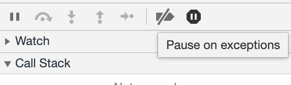

  * 格式化JS资源，便于阅读

  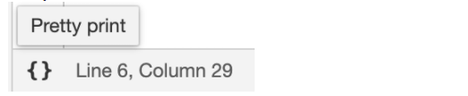

  * 用 react dev tool 等插件，获取组件数据用于辅助定位问题

* 拿到故障上下文后确定问题原因，决定修复策略。

## 29.说下你对可视化开发的理解 

可视化开发可以理解为拖拽形成页面，添加样式，数据源，交互动作。
特点：1.免于开发 2.完全托管 3.样板丰富

诸如 layoutit 布局工具，选择模块叠放或嵌套，即可完成网页样式；
诸如 iH5、兔展 等 **H5制作工具**，选择模块拖拽放置，即可完成网页样式；
诸如 wordpress 建站，不仅是布局工具，还可直接与数据绑定成为动态页面。

可视化开发，即通过交互操作就能完成网页制作的手段。

布局方式上主要是流布局或定位局部两种，牵扯到交互方式和配置数据结构都很大不同；
模块分类上可能会分为：布局（容器）、元素（图文等）、综合模块（九宫格）、数据模块（列表）；
模块配置上可能会分为：样式、资源、交互、动画。

开发简单的可视化开发工具并不复杂，但模块如何快速便捷地拓展才是最难思考的。

## 30.举例缓存头都有哪些？并说明它们的用处

cache-contral：
每个资源都可以通过 Cache-Control HTTP 头部来定义其缓存策略
Cache-Control 指令控制了谁、在什么条件下来缓存响应，以及缓存多久
Cache-control: private, max-age=0, no-cache

Public vs. Private
No-cache
No-store
max-age
s-maxage
Pragma：
expires：
Expires: Sun, 03 May 2015 23:02:37 GMT

validators：
Last-Modified：头部作为一个常见的校验器，指示了文件最后一次改变的时间
[HTTP 缓存头部 - 完全指南](https://juejin.im/post/5a72b7fc6fb9a01cbc6eb9d9#heading-1)

## 31.你有自己写过爬虫的程序吗？说说你对爬虫和反爬虫的理解

爬虫是为了获得网站上的数据而写的程序。会对网站有不同程度的影响。与手动点击的区别在于它是批量操作的。
反爬虫维护安全。

反爬虫机制：
1.基于User-Agent反爬
2.基于IP反爬

User Agent中文名为用户代理，简称 UA，它是一个特殊字符串头，使得服务器能够识别客户使用的操作系统及版本、CPU 类型、浏览器及版本、浏览器渲染引擎、浏览器语言、浏览器插件等。
[参考文档](https://www.cnblogs.com/tulintao/p/11614577.html)

## 32. 你知道什么是ECMAScript吗

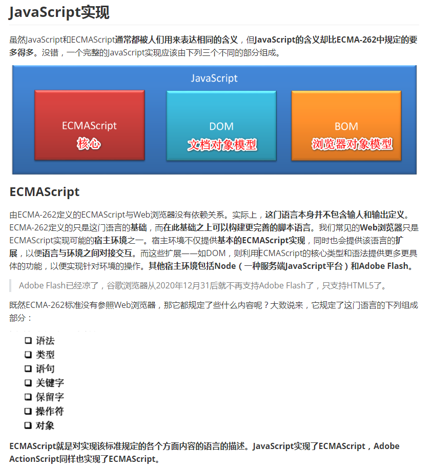

ECMAScript是一份**语言规范**，可以有多种实现，**JavaScript是实现了ECMAScript规范的一种语言**。

1996 年 11 月，JavaScript 的创造者 Netscape 公司，决定将 JavaScript 提交给标准化组织 ECMA，希望这种语言能够成为国际标准。次年，ECMA 发布 262 号标准文件（ECMA-262）的第一版，规定了浏览器脚本语言的标准，并将这种语言称为 ECMAScript，这个版本就是 1.0 版。

该标准从一开始就是针对 JavaScript 语言制定的，但是之所以不叫 JavaScript，有两个原因。一是商标，Java 是 Sun 公司的商标，根据授权协议，只有 Netscape 公司可以合法地使用 JavaScript 这个名字，且 JavaScript 本身也已经被 Netscape 公司注册为商标。二是想体现这门语言的制定者是 ECMA，不是 Netscape，这样有利于保证这门语言的开放性和中立性。

因此，ECMAScript 和 JavaScript 的关系是，前者是后者的规格，后者是前者的一种实现（另外的 ECMAScript 方言还有 JScript 和 ActionScript）。日常场合，这两个词是可以互换的。

## 33.说说你对AMD、CMD和CommonJS的理解

[js模块化编程之彻底弄懂CommonJS和AMD/CMD](https://www.cnblogs.com/chenguangliang/p/5856701.html)

因为有了模块，我们就可以更方便地使用别人的代码，想要什么功能，就加载什么模块。

但是，这样做有一个**前提**，那就是大家必须以同样的方式编写模块，否则你有你的写法，我有我的写法，岂不是乱了套！

于是下面三个模块规范就出来了。

AMD,CMD和CommonJs是ES6之前推出的模块化方案。

* CommonJs用在服务端

* AMD,CMD用在浏览器环境

一、CommonJs是由node推广使用的。
导出module.exports，导入require。

二、AMD是RequireJS在推广过程中对模块定义的规范化
它主要是异步加载模块，模块的加载不影响后面语句的执行；所有依赖这些模块的语句，都定义到一个回调函数中，等依赖模块全部加载完成后，执行回调函数。

```javascript
define(['回调函数的依赖模块'], function() {
    // 回调函数，依赖模块的语句
    ...
})

define(['./a', './b'], function(a, b) { // 依赖刚开始就要去加载，加载依赖是异步加载
  // a b 依赖加载完成后，才去执行回调中语句
  a.doSomething()
  b.doSomething()
  ...
}) 
```

三、CMD是SeaJS在推广过程中对模块定义的规范化
它采用就近依赖，同步加载。即在用到依赖的地方，才去加载依赖。

```javascript
define(function(require, exports, module) {
  var a = require('./a') // 依赖等用的时候才去加载，加载依赖是同步加载
  a.doSomething()

  var b = require('./b') 
  b.doSomething()
  // ... 
})
```

## 34.你上家公司的接口是怎么管理的

用过postman，后面要收费就换成了开源免费的doclever，现在使用的是Yapi。

开发人员自测的话，使用postman；
测试人员搭了个在线自动测试工具；
接口文档通过配置实现自动生成。

推荐一个类似与potman的在线网站：https://github.com/liyasthomas/postwoman

## 35.你知道什么是域名备案吗？备案有什么用？可以不备案吗

当域名解析到**国内**的服务器是需要备案的，如果不进行备案DNS将无法正常解析到页面，别人无法通过域名访问你的网站。域名备案就是将自己的证件信息，网站信息上传到工信部审核登记，域名备案其实是ZF用来管理国内网站的一种方法，这样可以一定程度上防止非法运营网站。

## 36.你知道什么是PDCA吗？要怎么运用好它呢

PDCA 循环的含义是将**质量管理**分为四个阶段，即计划（Plan）、执行（Do）、检查（Check）、处理（Act）。在质量管理活动中，要求把各项工作按照作出计划、计划实施、检查实施效果，然后将成功的纳入标准，不成功的留到下一循环去解决。

美国质量管理专家休哈特博士首先提出的，由戴明采纳、宣传，获得普及，所以又称戴明环。

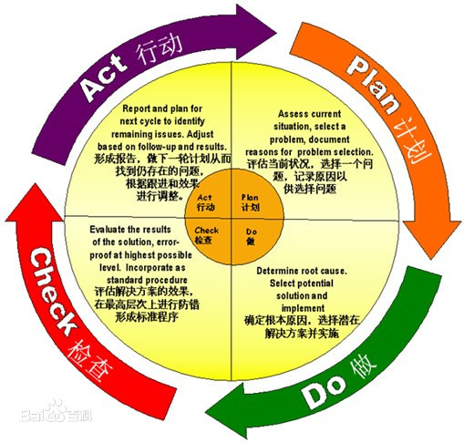

## 37.你知道什么是人工智能和机器学习吗？说说你对它们的理解认知

[人工智能就是if...else...吗？](https://www.zhihu.com/question/287091800/answer/455546621)

机器学习就是建立一个模型，可以想象成一个 function，模型接收对应的输入 input，产生对应的输出output，同时记录一个权重 w，例如：如果多次接收到相同的 input ，则这个 input 的权重就越高。

最后的 output = 输入和权重之间的某种计算结果，每一次计算之后，都会去修改权重 w，相当于学习的过程。当经过大量数据的分析后，权重就几乎能够预测出准确的输出结果。

## 38.你有听说过“分词”吗？说说你对它的理解

中文分词在大数据横行的今天是越来越有用武之地了。它不仅被广泛用于专业的中文搜索引擎中，而且在关键词屏蔽、黑白名单以及文本相似度等方面也能大显身手。中文分词最简单也最常用的方式是基于字典查找的方式，通过遍历待分词字符串并在字典中进行查找匹配以达到分词的目的。

## 39.你觉得该不该写注释？你写注释的原则是什么

注释肯定要写的。

* 方便阅读理解；
* 快速定位问题；
* 有利于代码回滚。

## 40.强类型和弱类型语言的区别是什么

* 强类型要先编译后执行
* 弱类型边解释边执行

* 强类型： 变量需要提前定义并指明其类型，变量必须显示的转换数据类型
* 弱类型：变量可以随用随定，不需要特意指定其类型，变量可以**隐式转换**其数据类型

## 41.你有用记事本来写过代码吗？说说你的感受

有啊，就是缩进贼麻烦。

使用记事本写过，但是一般我认为能用记事本流畅操作的，基本都是大神，需要扎实的基础，没提示哈。

## 42. 你有在Linux下编程过吗？有使用过Mac系统吗？说下它和Windows系统的区别

linux 的终端不是很香 比如复制粘贴需要多按shift键，需要改stty
不支持ctrl + backspace, 并且fish仅仅支持ctrl+字母的映射导致无法实现ctrl + backspace， 改stty也不行

window conemu还是人性化专门单独地实现了这个组合键，瞬间感觉太人性化了

linux会有各种小问题，比如权限问题，比如flutter由于安装到/opt/flutter下面，需要改几个文件权限才正常

linux驱动支持依赖内核，比如cp201x的驱动只能在4.x, 但是现在内核都到了5.x安装不了

linux的搜狗输入法和微信，稳定就不要更新了，更新很多问题，并且找回老版本也麻烦，访问不了archive网站，清华的镜像使用也不是那么舒服。

window 对于用户更多是打包一个易用的工具出来，而linux的大佬，一般是分享思路，比如window调CPU频倍, 有ThrottleStop， 而linux则会告诉你安装msr-tool改寄存器的值就可以了，虽然让人开眼界了，但是感觉没有解决方案封装的感觉，window授鱼，linux授渔的感觉。

linux的字体渲染需要找相关的文章去调，要改参数的地方，并且切换到其他de需要重新搞过，十分不方便

对键盘的自定义上面window有ahk，按键的映射也靠谱，比如xmodmap好。

对于正常的用户来说，还是window会舒服很多，linux 可自定义的地方多，但是不一定能实现想要的组合，小问题多，还是需要不少妥协。

由于笔记本的特殊原因，bios被通过网线口强刷了，导致网卡不能冷启动，需要热启动才正常，而window的设备管理器对网卡的禁用启用相当于热启动，linux的网卡”禁用“则没有这个效果只能进入系统后面点重启。

## 43.在工作中，你对开发环境有什么要求吗

整块显示屏，说真的，我要求不高。

## 44. 你有给自己制定过计划吗？怎么去落实的

了解自己情况，制定合理计划（有进步就好），一定执行的决心，坚持2周的决心，越到后面越简单。后期切记断，不能中断，中断后要找回状态要重新花时间。

## 45.你知道开发好的功能要自测吗？你一般是怎么自测的呢

无论用vue 还是 react 习惯把业务逻辑拆出成单一函数，`.vue文件 / .jsx `都只是负责取到数据结构进行渲染。拆出server只负责取后端数据，中间用vuex/dva 里调用业务函数处理。

换句话说，框架负责渲染，状态管理负责调度，而业务函数抽离可方便测试。

我用的jtest, 对每个业务函数编写`.test.js`文件进行单独测试，可以避免业务逻辑执行上的问题。

在后端开发之前，前端自测阶段，可以通过如下方式对后端数据接口模拟自测。

vue技术栈，用vue-cli3的 devServer配置 before 可以插入自定义的express中间件，用 mockJs 编写请求返回值。

react技术栈，用umi的 可以 用本地Mock功能。

团队用yapi管理接口的就更方便了，直接用proxy代理转发请求到yapi就好了

## 46. 你是计算机专业的吗？你们上学都学了哪些内容

计算机网络，操作系统，数据结构，计算机组成原理，软件工程，数据库，UNIX系统，Java，C/C++

## 47.你有做过Hybrid APP开发吗？说说你的经验

[浅谈Hybrid App开发](https://zhuanlan.zhihu.com/p/54624442)

### 前言

如果我们把Hybrid App理解为运行在android或者ios以及其他移动终端设备上的应用，也可以叫做H5 APP，这种开发应用的模式结合web开发技术与Native开发的部分技术，通常也被称为混合开发模式。

### 移动应用开发的三种方式

- Native App：原生应用，在android端通常使用Java或Kotlin开发，ios端使用OC或者Swift开发
- Hybrid App：混合应用，结合Web与Native技术开发
- Web App：web应用，网页三剑客HTML+CSS+JS

Native App开发依旧是移动应用的主导，但如今的Native App或多或少会嵌入一些web页面，诸如淘宝、京东等APP，所以如今真正意义上的原生应用又该如何去定义呢？Hybrid App受到越来越多开发者的追捧与其开发周期短，开发难度小，跨平台离不开，当然APP的效果也成为大家诟病的话题，如首屏打开缓慢，动画效果不够流畅等。

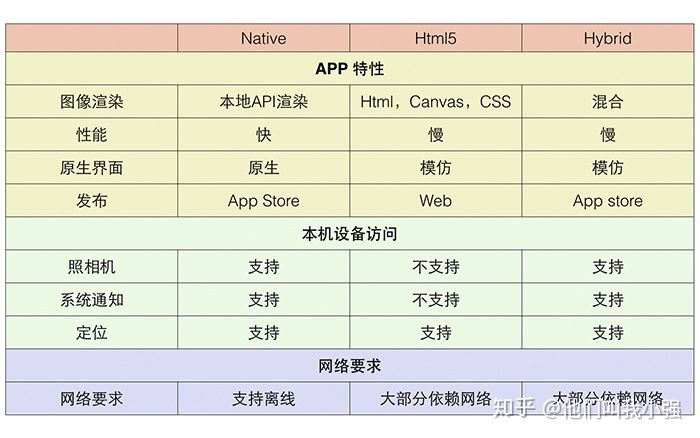

## 48.你有做过H5的游戏开发吗？说说它的开发步骤

- 拆分页面、界面；类似确定路由关系
- 选择框架，或自研框架；比如 three.js pixi.js 等
- 整理素材，写好动画 demo；
- 抽象对象、状态，准备组件化开发；
- 整理全局数据，如各角色配置、总分、组件状态等
- 确定各组件间父子兄弟关系
- 开始开发

可以说，游戏开发不搞组件化很难控制私有数据和业务数据，
比如动画到了第几帧这类数据变为私有的不用去关系多棒。

至于 cocos 等的可视化开发，接触较少就不 BB 了。

## 49.假设有一个场景，需要前端自己计算十万级别或更多的数据，你有解决什么方案呢

异步计算、分块计算、后台（Web Worker）计算、甩锅给后端计算、引入人工智能计算

## 50.你要是在家时，公司网站出问题了你是怎么解决的

我经常不爱上班而调休，所以遇到过挺多次。

第一要务是保持沟通，毕竟是问题，比功能开发稍麻烦；
有时文字会表述不清，或会遇到不必要的卡点。

解决问题的方案挺多，稍作罗列：

1. 提出解决方案，请在司同事帮忙改（小问题或无法提 git 情况）
2. 承认确实是问题，提出半天后再给对方回复（中小问题）
3. 让在司同事帮忙开电脑，远程操作自己的电脑（中小问题）
4. 打飞的去上班吧（大问题或老板生气）

