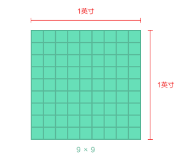
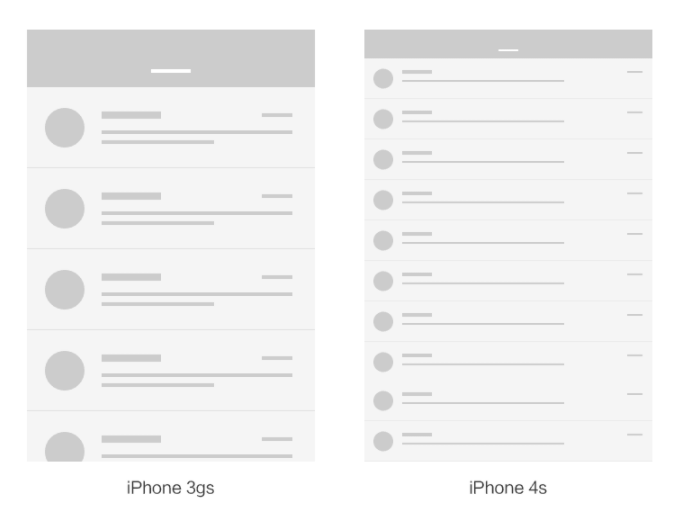
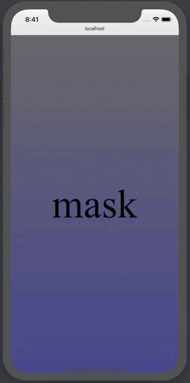
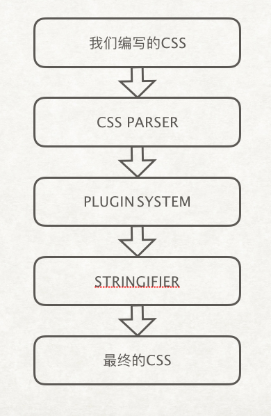
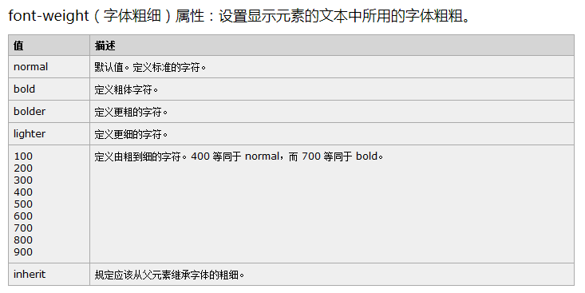
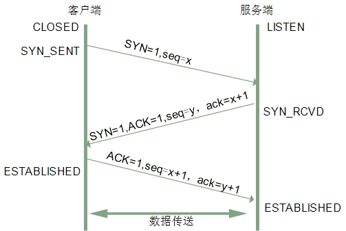
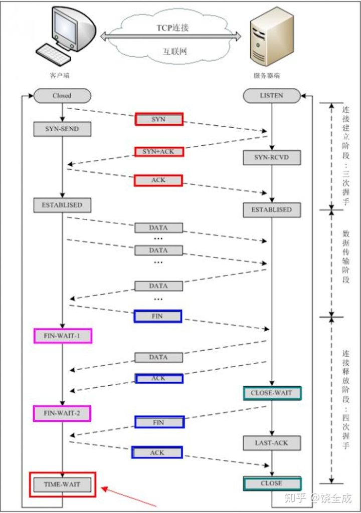

(注1：面试题目来源依旧是[前端面试每日3+1](<https://github.com/haizlin/fe-intervIEw/issues/198>)，因为我是每50题就另外写一篇博文，所以本文第一题算是总题库的第251题)

(注2：因为平时时间有限，我都是在上班的时候抄这些题的，也只能蜻蜓点水般的大体扫一下题目，看一下下面别人的回答，要是没有人回答或者回答我不太满意的话会大体搜一下，有些不会的题目也只能暂且不求甚解了。我还是坚持每天抄下去吧，大概再抄个3,4个月也就能抄完了，抄的目的现在也就是混个脸熟吧，等以后的话自己再进行整理一下，我目前的学习程度，面试官要是问我技术问题我真的是两眼一抹黑啊，简单的题目也许这个知识点还算清楚，但是语言表达不出来；复杂点的完全就是不在我的学习范围之内了，所以还需要再进行精进啊。)

(注3：现在是2020年11月30日，我决定暂时停止抄面试题了，现在的80%的精力都要用在写项目上了，看书什么的做项目做卡壳了我再看吧。)

(注4：现在是2020年12月07日，想了一下还是继续吧，虽然这些题几乎都不会，但是抄一下也花不了太多时间，还是继续抄吧，唉。)

# HTML

## 1.在使用canvas的arc绘制图像时应注意什么

注意要 closePath 

## 2.canvas怎么兼容IE9以下版本

## 3. 如何将图片画到canvas上？都有哪些方法

[将图片画到canvas 上的几种方法](https://blog.csdn.net/qq_15009739/article/details/82809525)

## 4.canvas的应用场景有哪些

* 图片相关：比如生成图片保存或者分享，再比如截图，再比如之前微信的头像加圣诞帽国旗也可以用canvas处理。

* 用于绘制一些线条图画，比如画板工具，比如画笔线条绘制。

* 用于加载文件，比如加载pdf，这个只是看见了react-pdf，没有去研究怎么实现的。

* 游戏

## 5.在svg和canvas中你该如何选择？依据是什么

* svg 的节点多可能影响性能，高保真，方便绑事件，动画也有一套 api，样式还能受 css 控制；
* canvas 性能好，能读写数据（imageData / base64），绘制复杂元素更灵活。

## 6.canvas画出来的图是位图还是矢量图

* canvas画出来的图是位图
* svg是矢量图

## 7.使用canvas生成一张分享图 

[小程序canvas api生成分享海报图 解决方案](https://blog.csdn.net/Ruffaim/article/details/81145263)

## 8.网站上怎么实现分享到各大平台呢

[APP、网页分享功能的实现](https://zhuanlan.zhihu.com/p/52276788)

## 9. HTML5怎样和Native App进行交互

[HTML5怎样和Native App进行交互](https://blog.csdn.net/michael1112/article/details/79805054)

混合开发的App（Hybrid App）就是在一个App中内嵌一个轻量级的浏览器，一部分原生的功能改为Html5来开发，这部分功能不仅能够在不升级App的情况下动态更新，而且可以在Android或iOS的App上同时运行，让用户的体验更好又可以节省开发的资源。

我觉得一个Hybrid开发的App中必须要要有的功能就是Html5页面和Native App怎么进行交互。比如，我点了一个Html 5页面上的一个按钮或链接，我能不能够跳转到Native App的某个页面；比如我点了Html 5页面上的分享按钮，我能不能调用Native App的分享功能；比如Html加载的时候能不能获取Native App的用户信息等等。

一般来讲，我所知道的两种主流的方式就是：

> JS调用Native中的代码 
> Schema：WebView拦截页面跳转

## 10.目前移动端的最小点击区域是多少呢

44pt * 44pt

## 11.你知道移动端的尺寸都有哪些吗

[移动端尺寸基础知识](https://colachan.com/post/3435)

**现象**

首先说现象，大家都知道移动端设备屏幕尺寸非常多，碎片化严重。尤其是Android，你会听到很多种分辨率：480x800, 480x854, 540x960, 720x1280, 1080x1920，而且还有传说中的2K屏。近年来iPhone的碎片化也加剧了：640x960, 640x1136, 750x1334, 1242x2208。

不要被这些尺寸吓倒。实际上大部分的app和移动端网页，在各种尺寸的屏幕上都能正常显示。说明尺寸的问题一定有解决方法，而且有规律可循。

**像素密度**

要知道，屏幕是由很多像素点组成的。之前提到那么多种分辨率，都是手机屏幕的实际像素尺寸。比如480x800的屏幕，就是由800行、480列的像素点组成的。每个点发出不同颜色的光，构成我们所看到的画面。而手机屏幕的物理尺寸，和像素尺寸是不成比例的。最典型的例子，iPhone 3gs的屏幕像素是320x480，iPhone 4s的屏幕像素是640x960。刚好两倍，然而两款手机都是3.5英寸的。

所以，我们要引入最重要的一个概念：**像素密度**，也就是**PPI**（pixels per inch）。**这项指标是连接数字世界与物理世界的桥梁**。



Pixels per inch，准确的说是每英寸的长度上排列的像素点数量。1英寸是一个固定长度，等于2.54厘米，大约是食指最末端那根指节的长度。像素密度越高，代表屏幕显示效果越精细。Retina屏比普通屏清晰很多，就是因为它的像素密度翻了一倍。

**倍率与逻辑像素**



再用iPhone 3gs和4s来举例。假设有个邮件列表界面，我们不妨按照PC端网页设计的思维来想象。3gs上大概只能显示4-5行，4s就能显示9-10行，而且每行会变得特别宽。但两款手机其实是一样大的。如果照这种方式显示，3gs上刚刚好的效果，在4s上就会小到根本看不清字。


在现实中，这两者效果却是一样的。这是因为Retina屏幕把2x2个像素当1个像素使用。比如原本44像素高的顶部导航栏，在Retina屏上用了88个像素的高度来显示。导致界面元素都变成2倍大小，反而和3gs效果一样了。画质却更清晰。

在以前，iOS应用的资源图片中，同一张图通常有两个尺寸。你会看到文件名有的带@2x字样，有的不带。其中不带@2x的用在普通屏上，带@2x的用在Retina屏上。只要图片准备好，iOS会自己判断用哪张，Android道理也一样。

由此可以看出，苹果以普通屏为基准，给Retina屏定义了一个2倍的倍率（iPhone 6plus除外，它达到了3倍）。实际像素除以倍率，就得到逻辑像素尺寸。只要两个屏幕逻辑像素相同，它们的显示效果就是相同的。

## 12. 移动端滚动穿透是什么原因？有哪些解决方案

[解析移动端滚动穿透](https://segmentfault.com/a/1190000020321154)

滚动穿透在移动端开发中是一个很常见的问题，产生诡异的交互行为，影响用户体验，同时也让我们的产品看起来不那么“专业”。虽然不少产品选择容忍了这样的行为，但是作为追求极致的工程师，应该去了解为什么会产生以及如何去解决。

**什么是滚动穿透**

移动端开发中避免不了会在页面上进行弹窗、加浮层等这种操作。一个最常见的场景就是整个页面上有一个遮罩层，上面画着各种各样的东西，具体是什么就不讨论。实现这样一个遮罩层可难不住即使是一个刚开始写前端的小白。但是这里有一个问题就是如果不对遮罩层做任何处理，当用户在上面滑动时会发现遮罩层下方的页面居然也在滚动，这就很 interesting 了。就如下面的例子，一个名为`mask`长宽都是屏幕大小的遮罩层，我们在上面滑动时，下面的内容也在跟随滚动，即滚动“穿透”到了下方，这就是滚动穿透（scroll-chaining）。



上方 demo 的遮罩层底部是一个逐渐变蓝的内容容器，但是滑动上面遮罩层时，底部也跟随滚动了，这只是一个最简单的场景，后面我们会讨论更复杂的情况。

## 13.HTML5怎么判断app是否安装

例如，打开微信 是用了微信自己的 wechat://xxxx 这样类似http/https的协议，来打开。支付宝是alipay，其他的应用都有不同的自己的协议头，通过这样的链接来唤醒APP。如果打不开就能判断是否安装该APP。

个人感觉HTML5是判断不了的。
但是像上面说的，可以直接用协议头来打开。如果是在Android下，协议是在Activity中定义的，直接打开协议的话，部分App如果安装了，是可以直接打开的，否则将会打开指定的页面，比如下载页面之类的。

## 14.举例说明HTML5怎么判断网络状态

 在原生APP中,比如QQ,它可以检测QQ是处于在线还是离线状态,但是在网页中,或者早期web app中,没有检测网络状态的能力,因此在HTML5中出现了网络状态检测API。

~~~javascript
<!--addEventListener() 方法用于向指定元素添加事件句柄。-->
<!DOCTYPE html>
<html lang="en">
<head>
  <meta charset="UTF-8">
  <meta name="viewport" content="width=device-width, initial-scale=1.0">
  <meta http-equiv="X-UA-Compatible" content="ie=edge">
  <title>Document</title>
</head>
<body>
  <script>
    // online 在线
    window.addEventListener("online", function () {
      alert("您的网络状态正常");
    })
    // offline 离线
    window.addEventListener("offline", function () {
      alert("您的网络状态离线");
    })


    // 特殊情况
    // 局域网 显示正常
    // wifi有的时候标志有惊叹号  虽然不能上网 但是这个api也能用
  </script>
</body>
</html>
~~~

## 15.HTML5怎么判断是否在wifi环境

[Network Information API](https://developer.mozilla.org/en-US/docs/Web/API/Network_Information_API)

NetworkInformation 在实验阶段，不可用

## 16. https页面加载http的资源会导致页面报错的原因是什么？怎么解决

https地址中，如果加载了http资源，浏览器将认为这是不安全的资源，将会默认阻止。
解决方法 ：

- h5页面中使用js自己加载协议情况，如在body onload='xx()', 在xx 方法中，根据需求加载资源
- 不写协议头
  例如 //xxx.com/xxx.js 这样的URL去引用静态资源

## 17.关于iframe的跨域你有了解多少？

有两种情况吧。同主域，不同子域跨域；不同主域跨域。

## 18.如果要你实现一个代码（多种语言）高亮的组件，你的思路是什么

* 用正则吧。
* 抽象语法树

## 19.HTML5如何隐藏video元素的控制栏、全屏按钮

有的 webkit 能隐藏，这就很看浏览器支持了，移动端的 video 组件就是雪崩。

将`<video width="800px" height="400px" id="vid" src="a.mp4" controls="controls">`
中的controls="controls"删掉

## 20.HTML5的video怎么取消自动播放

去掉 `autoplay` 属性。

## 21.HTML5的video怎样预加载（支持全量加载）

`preload="auto"`

## 22.移动端如何禁止用户手动缩放页面

~~~css
<meta name="viewport" content="width=device-width,initial-scale=1,maximum-scale=1,minimum-scale=1,user-scalable=no">
~~~

## 23.html中p标签内为何不能嵌套div标签

不利于语义化

## 24. 列举下哪些块元素里面不能放哪些块元素呢

* p、h1-h6等不能嵌套块级元素。
* ul、ol、table、dl等内部必须是固定的元素。

## 25. 网站如何自适应手机屏幕

一种是各种流式布局，另外就是简单粗暴，写两套，一套pc ,一套mobile ,根据设备标识来重定向不同的页面。

## 26. HTML的标签元素分为哪几大类？分别有什么作用

[HTML标签分类总结](https://www.jianshu.com/p/5a78a19f18bf)

## 27.举例说明HTML的修饰元素有哪些

加粗：strong、b
倾斜：i、em
下划线：ins
删除线：del
自带样式：p、ul、ol、li、table、tr、td、thead、tbody等

## 28.如何禁止HTML页面缓存

~~~html
<meta http-equiv="Cache-Control" content="no-cache, no-store, must-revalidate">
<meta http-equiv="Pragma" content="no-cache">
<meta http-equiv="Expires" content="0">
~~~

上面说清楚了如何禁止页面缓存，那我对这几个meta属性进行说明一下：

**Cache-Control**

表示缓存控制，no-cache，no-store，must-revalidate，都表示不缓存的意思。
不过，Cache-Control是http1.1支持的。目前大多数http传输都是1.1的版本。

**Pragma**

值设置为no-cache，和Cache-Control的意义是一样的。
区别：Pragma是http1.0支持的写法，所以这一句是为了兼容老版本的http传输协议。

**Expires**

值设置为0，表示过期时间，不进行缓存。

## 29. canvas有哪些渲染上下文

[Canvas的4个渲染上下文](https://github.com/akira-cn/FE_You_dont_know/issues/16)

## 30.使用递归时应该注意哪些问题

1. 必须要有正确的结束条件
2. 避免占用太多栈而爆掉，可限制最大栈数报警或异步分批
3. 注意类似对象引用自身的无限循环情况
4. 返回值必须是一个函数

## 31.写个布局，当页面高度不够时，底部固定在下面，反之不固定

~~~html
<div class="page">
  <main class="main">
    <button id="add">加高度</button>
    <button id="remove">减高度</button>
    <div id="height"></div>
  </main>
  <footer class="footer">页脚</footer>
</div>
~~~

~~~css
body { margin: 0 }
.page {
  position: absolute;
  top: 0; bottom: 0;
  left: 0; right: 0;
  overflow-y: auto;
  overflow-x: hidden;
  transform: translate3d(0, 0, 0);
  -webkit-overflow-scrolling: touch;
}
.page {
  display: flex;
  flex-direction: column;
}
.main {
  flex-grow: 1;
}
#height {
  background: linear-gradient(red, white);
}
~~~

~~~javascript
let h = 0;

add.addEventListener('click', () => {
  h += 500;
  height.style.height = h + 'px';
});
remove.addEventListener('click', () => {
  h = Math.max(h - 500, 0);
  height.style.height = h + 'px';
});
~~~

用的 `flex: 1 0 auto` 实现的。

## 32.写HTML代码时，如果缺少了结束标签，你如何检测及如何预防

* HTML是一门宽松式语言。即使在语法上出现了错误，浏览器还是会直接解析并显示结果。
* 为了预防类似缺少结束标签这类错误。可以用过由W3C提供的[标记验证服务](https://validator.w3.org/)。通过上传HTML文档至该网页，可运行差错。
* 现在的编辑器如vscode就有语法检测
* 可以装一些代码自动完成插件预防此类事件

## 33.解释下什么是CDATA

CDATA 指的是不由 XML 解析器进行解析的文本数据。

> XML 文档中的所有文本均会被解析器解析。
> 只有 CDATA 区段中的文本会被解析器忽略。

## 34.移动端如何设置页面以全屏模式运行

~~~html
<head>
<meta name="viewport" content="user-scalable=no, width=device-width" />
</head>

~~~

~~~html
<meta name="apple-mobile-web-app-capable" content="yes" />
~~~

## 35. iOS下页面如何启动加载时显示画面图片？如何设置大小？它有什么好处

~~~HTML
<link rel="apple-touch-startup-image" href="start.png" media="(device-width: 1536px) and (orientation: portrait)"/>
~~~

IOS防止白屏

## 36.移动端如何使页面横、竖屏

[移动端如何让页面强制横屏](https://blog.csdn.net/weixin_41190571/article/details/80774474)

## 37.IOS在播放视频时，有可能会出现短暂的黑屏，如何解决呢

[关于 AVPlayer 播放黑屏问题的解决](https://www.jianshu.com/p/fcc7aa2a1490)

## 38.你有了解video的x5-video-player-type这个属性吗？它的作用是什么呢

这个属性是限制微信的X5 内核的自动播放功能。

## 39.移动端如何实现长按保存图片（图片上的二维码是动态的）

html -> canvas -> image -> a[download]

* html2canvas.js：可将 htmldom 转为 canvas 元素。
* canvasAPI：toDataUrl() 可将 canvas 转为 base64 格式
* 创建 a[download] 标签触发 click 事件实现下载

## 40.你知道微信端的浏览器内核是什么吗

X5内核。

## 41.举例说明写一个button的按钮的方法有哪些

利用div来模拟实现，绑定点击事件，并且通过：after等来模拟按钮点击的样式。

## 42.页面上的登录表单记住了密码（显示星号），但我又忘了密码，如何找回这个密码呢

将密码input的type改为text或者为空，则会显示输入框值。

## 43.img中的src加载失败时如何用默认图片来替换呢

[``：图像嵌入元素](https://developer.mozilla.org/zh-CN/docs/Web/HTML/Element/img)

img有onerror属性，加载失败时触发error事件
但是这种解决方法在error里面替换的默认图片也加载失败的时候会导致问题，需要注意

~~~html

~~~

## 44.怎样去除iOS和Android中的输入URL地址的控件条呢

~~~javascript
setTimeout(scrollTo,0,0,0);
~~~

## 45. HTML5中的article和section有什么区别

- `article` 标签定义外部的内容，比如来自 blog 的文本。其内容独立于文档的其余部分。
- `section` 标签定义文档中的节（section、区段）。比如章节、页眉、页脚或文档中的其他部分。

## 46.HTML标签的属性值是否可以省略引号？为什么

HTML5 可以用单引号、双引号、无引号。以前的版本不能无引号。

## 47.举例说明实现文字贯穿线的方法有哪些

~~~html
<del></del>
~~~

## 48.如何在桌面上生成网站的快捷方式图标

## 49.如何在页面上显示Emoji表情

[网页怎么显示emoji表情](https://blog.csdn.net/qq_33679504/article/details/80459605)

暂时只有两个思路，还望各位大佬指教了哟。

* 通过emoji标签的类型去加载不同的图（这种方式比较low了。但也不失为一种方法）
* 通过字符编码的方式解决

## 50. HTML5应该注意哪些安全的问题

[关于HTML5的安全问题开发人员需要牢记的](https://www.jb51.net/html5/55993.html)

# CSS

## 1.你有使用过postCss吗？它和Less/Scss/Stylus有什么区别

[PostCSS 是个什么鬼东西？](https://segmentfault.com/a/1190000003909268)

* PostCSS 可以直观的理解为：它就是一个`平台、平台、平台`，重要的事情来三遍比较爽，哈哈！

> 为什么说它是一个平台呢？因为我们直接用它，感觉不能干什么事情，但是如果让一些插件在它上面跑，那么将会很强大。

* PostCSS 提供了一个解析器，它能够将 CSS 解析成抽象语法树（AST）。

上面两条看完后，我们可以理解为下面这个模型。



所以说，PostCSS 它需要一个插件系统才能够发挥作用。我们可以通过“插件”来传递AST，然后再把AST转换成一个串，最后再输出到目标文件中去。当然，这里是有API可以用，这里先不讲，免得晕了。

## 2. 如何修改美化radio、checkbox的默认样式

* 利用after伪元素自定义radio或者checkbox
* 或是利用图片进行样式修改

## 3.你是如何压缩字体的

压缩字体文件么，有研究过，平时用 font-spider。
webpack 集成没怎么实践过，还只知道 url-loader。

有三种不同的压缩处理策略的，

* 自己决定压缩打包哪些文字，如 FontZip，iconFont
* 自动检测要压缩打包哪些文字，如 font-spider
* 动态生成本页有哪些文字的文件，如有字库[forever-z-133/blogs#3](https://github.com/forever-z-133/blogs/issues/3)

另外值得一提的是**字体分包**是真的棒，比如字体 A 中包含大字，字体 B中包含佬字，然后用 font-family: A B 是可行的。比如压缩后还有 1M 那么大，就可以拆为常见的 6000 个文字，和异步加载的不常用文字。

## 4.如何使用CSS绘制一个汉堡式菜单

比较常见的两种方法：

- 利用元素自身、`::before`和`::after`伪元素绘制3个长宽一致的矩形，然后设定其y偏移值。
- 利用上下`border`和自身元素内容绘制：

```css
.burger {
	--width: 20px;
	--thickness: 4px;
	--color: black;
	
	display: inline-block;
	width: var(--width);
	height: var(--thickness);
	background-color: var(--color);
	background-clip: content-box;
	border-top: solid var(--thickness) var(--color);
	border-bottom: solid var(--thickness) var(--color);
	padding-top: var(--thickness);
	padding-bottom: var(--thickness);
}
```

## 5.说说`display:none`和`visibility:hidden`的区别

`display:none` 隐藏但不占位置,DOM对象不渲染。
`visibility:hidden` 隐藏但占位置，并且DOM对象渲染。

## 6. CSS的`user-select:all`有什么用处

这个属性能够控制用户能否选中文本

* none：文本不能被选择
* text：可以选择文本
* all：当所有内容作为一个整体时可以被选择。如果双击或者在上下文上点击子元素，那么被选择的部分将是以该子元素向上回溯的最高祖先元素。
* element：可以选择文本，但选择范围受元素边界的约束

## 7. 如何让一个块元素绝对居中

~~~css
div{
	position:fixed;
	right:0;
	left:0;
	bottom:0;
	top:0;
	margin: auto auto
}
~~~

## 8. 你知道什么是聚焦环吗？怎么解决呢

[我都知道的CSS](https://juejin.cn/post/6844903880375943175)

当使用按钮或链接标签获得焦点时，会得到一个可见的外边框，这就是聚焦环。它的种类依赖于根据浏览器提供商，但通常会显示一个蓝色的外边框包围在元素的周围，以表明它当前获得了焦点。

在过去，许多人指定outline: 0;来去除元素上的聚焦环。然而，由于不可见会对键盘用户访问性造成困扰。当不指定时，它会形成一个不吸引人的蓝色环显示在元素周围。

然而`:focus-visible`可以很好的解决这个问题，他是非常年轻的一个伪类，目前仅Chrome浏览器标准支持，关于这个伪类具体可看这里[CSS :focus-visible伪类让我感动哭了](https://www.zhangxinxu.com/wordpress/2019/03/css-focus-visible/)

## 9. 你知道什么是CSS-in-JS吗？说说你对它的了解

[CSS in JS简介](https://www.ruanyifeng.com/blog/2017/04/css_in_js.html)

以前，网页开发有一个原则，叫做["关注点分离"](https://en.wikipedia.org/wiki/Separation_of_concerns#HTML.2C_CSS.2C_JavaScript)（separation of concerns）。

它的意思是，各种技术只负责自己的领域，不要混合在一起，形成耦合。对于网页开发来说，主要是三种技术分离。

简单说，就是一句话，不要写"行内样式"（inline style）和"行内脚本"（inline script）。

由于 CSS 的封装非常弱，导致了一系列的第三方库，用来加强 React 的 CSS 操作。它们统称为 CSS in JS，意思就是使用 JS 语言写 CSS。根据不完全统计，各种 CSS in JS 的库至少有[47种](https://github.com/MicheleBertoli/css-in-js)。老实说，现在也看不出来，哪一个库会变成主流。

## 10.分析比较`opacity: 0`、`visibility: hidden`、`display: none`三者的优劣和适用场景

* `opacity 0`: 单纯视觉效果，除了看不见，其他都正常。
* `visibility: hidden`: 可继承也可覆盖。
* `display: none`: 元素不会渲染，不影响布局，不会被css计数，也不支持transition。

## 11.你对伪类了解多少？分为几大类

* `:hover`

* ` ::after`

* ` ::before`

* ` :nth-child `

* `:nth-of-child`

* ` :first-child `

* `:last-child`

总结分为两类：页面节点效果操作和获取指定元素选择器

## 12.为什么要使用sass/less

为了让 CSS 富有逻辑性，短板不那么严重。

为了提示开发效率，使得CSS编写更加灵活

## 13.使用sass的方式有哪些

[SASS简介及使用方法](https://blog.csdn.net/ayxqfmarj86469/article/details/101557833?utm_medium=distribute.pc_relevant.none-task-blog-OPENSEARCH-4.control&depth_1-utm_source=distribute.pc_relevant.none-task-blog-OPENSEARCH-4.control)

## 14. sass是怎么定义变量的

sass变量可以理解为以\$+变量名为键的键值对，例如​`$color-black:#000`

## 15.你认为sass和less的最大区别是什么呢？你喜欢哪个？为什么？

less 没有循环只有递归；
less 没有 if 只有 when；
sass 多个 `@function` 很棒，否则只能堆变量了；
less 拼接类名的字符串需加上 `~`；
应该还有很多内置方法的不同，但现在还没用到。

其实我更青睐 stylus，写 `flex: left center` 这种自定义属性，很简便很舒服，
但这种肯定会被加到全局里，多人合作时就很怕有人会乱玩了。所以用的最多的还是 sass。

另外，不用 mixin 会造成很多废代码，而 scss 需要加 `@include some($x)` 才行，
这个时候就觉得 less 很舒服了，`.some(@x)` 就行。
但是吧，less 的递归和条件玩起来真的不舒服，所以还是选了 sass。

## 16.说说你对sass的嵌套规则的理解

我的理解就是 ，它好像一个个for循环一样。
最上面是猪循环，然后依次分层，而且每一层都有`}`来结束语句
条件层次分明

## 17.检测sass中错误的指令是哪个

`@debug`伪指令检测错误，并将SassScript表达式值显示到标准错误输出流。

## 18.你有用过sass中的Mixin功能吗？它有哪些作用

* 混合用法

  ~~~css
  @mixin ellipsis-one {
    overflow: hidden;
    text-overflow: ellipsis;
    white-space: nowrap;
  }
   .test {
     @inculde ellipsis-one;
   }
  ~~~

* 函数用法

```css
@mixin hoverColor ($color, $deepColor) {
    color: $color;
    cursor: pointer;
    &:hover {
       color: $deepColor;
   }
}
.test {
 @inculde hoverColor(#555, #333);
}
```

## 19.在sass中可以执行布尔运算吗

sass 有 `@if` `@else if` `@else`，这样也算是有并交关系了

## 20.说说sass有哪些你认为很棒的特性

* 预处理
* 嵌套
* 变量
* 模块
* 继承
* 计算

## 21.使用sass里，你是怎么组织你的sass文件的

## 22.sass是如何导入模块的

`@import`

## 23.请使用CSS画一个带锯齿形边框圆圈

[回答](https://stackoverflow.com/questions/51697207/zig-zag-border-for-a-circle)

## 24.CSS如何消除字体的锯齿

~~~css
-webkit-font-smoothing：antialiased;
~~~

## 25.CSS图片缩放失真出现锯齿的如何解决呢

* 换个 2x 图
* 用 AI 修复失真

* -ms-interpolation-mode，这是针对IE的解决方案。其值设置为bicubic。
* image-rendering，这是提供了一个速度VS质量之间做权衡的图像缩放关系。
  额外的思考：
  * 微信上传图片时，服务端会自动把图片做不同尺寸的处理。我们可以采用这个思路来解决图片缩放产生的问题。
  * SVG的技术，是一种矢量图的解决方案，缩放不会产生失真，我们可以把图片转为SVG来展示。
  * canvas技术，也是一种绘图技术，可以把图片转为canvas。

## 26.如何清除在项目中无用的CSS代码呢

* IDE中，会对没有使用到的样式，自己进行检测，删除时候，还需要手动删除。
* webpack中，有基于消除无用css的插件（purifycss-webpack purify-css），不过需要提供html文件的模板，因为需要遍历这个模板，才知道用了哪些css。
* 单页面应用中，由于都是组件化的开发，无法提供一个最终版的html文件，所以不能适用上面2提供的方案。

## 27.一个页面引用多个文件，如何防止样式冲突

**编码层面：**

1、定制规则：不同的样式文件表，增加不同的前缀。
2、按照功能区分文件：不同的文件样式表，针对页面不同的部分写样式，通过样式层级的方式，确认样式的边界。（例如header部分：#header p { }，footer部分：#footer p { }）。

**工具层面：**

1、postCss的使用
2、vue中scoped、react中的css module配置等等

## 28.说说你对CSS的合成与混合模式的理解

[详解CSS中的合成和混合模式-Blend modes](http://www.htmleaf.com/ziliaoku/qianduanjiaocheng/201503171537.html)

合成是使用背景（backdrop）组合成为一个图像。

在CSS中有16种可用的混合模式。`normal` (默认的混合模式), `multiply`, `screen`, `overlay`, `darken`, `lighten`, `color-dodge`, `color-burn`, `hard-light`, `soft-light`, `difference`, `exclusion`, `hue`, `saturation`, `color` 和 `luminosity`。

使用不同的混合模式会得到不同的结果。

## 29.使用CSS将图片转换成黑白的效果

~~~css
filter: grayscale(1);
~~~

~~~css
filter: saturate(0);
~~~

## 30.使用CSS3绘制一个圆形动态的时钟

[如何使用CSS3绘制出圆形动态时钟（详解）](https://blog.csdn.net/qq_42058441/article/details/85321515)

## 31.请使用CSS3来模拟中/英文打字的效果

`:after` 加个竖条闪啊闪，至于文字一个个出现嘛，text-indent 需要知道字数，clip-path 需要知道宽高，好像也没有特别好的办法。当然如果是单行文本的话用 width overflow 也是可以的。

## 32.使用CSS3画一个扇形

[CSS：画扇形](https://blog.csdn.net/Bule_daze/article/details/104062951)

## 33.使用CSS3绘制一个QQ小企鹅的LOGO

[使用CSS3绘制一个QQ小企鹅的LOGO](http://www.alloyteam.com/2012/10/css3-draw-qq-logo/)

## 34.你知道什么是动态伪类吗

锚点伪类（a标签）

* :link 未操作的链接
* :visited 该链接已被访问，一旦:visited，:link/:active不再起作用。

用户行为伪类

* :hover 鼠标悬停该元素
* :active 鼠标点击该元素
* :focus 鼠标在输入框中input

UI元素状态伪类

* :enabled
* :disabled
* :checked

## 35.CSS中的baseline，你知道吗

baseline是西文字体里面的一种定位，vertical-align:baseline是指行内元素里的文字，在垂直方向上，按字体的基线排列，基线就是可以类似我们小学写英文字母时的带线的格子，axec这些字母的底部就是baseline，然后lh的baseline也一样，g的baseline则在于中间，就是西文字体如何在一条看不见的线上排练形成整齐的视觉效果。汉字很少提及baseline的概念，但汉字有中宫的说法。

## 36.使用纯CSS实现一个rate评分的功能

[纯css代码实现rate评分组件](https://www.mybj123.com/4497.html)

## 37.如何将元素的所有CSS属性恢复为初始化状态

例如在某个CSS规则中，a 标签的一系列规则被重新定义了。如何让某个特定的 a 标签无视那些规则？

~~~css
all:upset
~~~

## 38. 移动端1像素的问题及解决方案是什么

[移动端 1px 像素问题及解决办法](https://www.jianshu.com/p/31f8907637a6?tdsourcetag=s_pctim_aiomsg)

## 39.用CSS实现tab切换

* 用label结合单选按钮radio接受切换tab的单击
* 用z-index层级来显示当前tab页对应的内容
* 用css兄弟选择器选中对应的tab页签和内容页，添加相应的样式

## 40.用CSS实现一个轮播图

~~~css
<!DOCTYPE html>
<html lang="en">
<head>
	<meta charset="UTF-8">
	<title>Document</title>
	<style>
		* {
			margin: 0;
			padding: 0;
		}
		
		li {
			list-style: none;
		}
		.tb {
			width: 520px;
			height: 280px;
			background-color: pink;
			margin:100px auto;
            /*如果是绝对定位，margin:100px auto就不起作用了*/
            /*相对定位只要没有边偏移就没有事情*/
			position: relative;   

		}

		.tb a {
            /*左右箭头是24*36规格的*/
			width: 24px;
			height: 36px;
			/*background-color: pink;*/
            /*把超链接转换成块级元素*/
			display: block;
			position: absolute;
            /*让左右箭头居中显示*/
			top: 50%;
			margin-top:-18px;
		}

		.left {
			left: 0;
			background: url(images/left.png) no-repeat;
		}

		.right {
			right: 0;
			background: url(images/right.png) no-repeat;
		}

		.tb ul {
		width: 70px;
		height: 13px;
		background: rgba(255, 255, 255, 0.3);
		position: absolute; /* 加定位*/
		bottom: 18px;
		left: 50%; /*水平走父容器的一半*/
		margin-left: -35px; /*左走自己的一半*/
		border-radius: 8px;
 	}

 	.tb ul li {
 		width: 8px;
 		height: 8px;
 		background-color: #fff;
 		float: left;
 		/*display: inline-block;*/
 		margin: 3px;
 		border-radius: 50%;
 	}

 	.tb .current {  /*前面要加tb,不然优先级不够*/
 		background-color: #f40;
 	}
	</style>
</head>
<body>
	<div class="tb">
		
		<a href="#" class="left"></a>
		<a href="#" class="right"></a>
		<ul>
			<li class="current"></li>          
			<!--5个小点是切换效果，没有链接效果 这是第4个兄弟，并列关系 -->
			<li></li>
			<li></li>
			<li></li>
			<li></li>
		</ul>
	</div>
</body>
</html>
~~~

## 41.字体的粗细的属性是用哪一个？它有哪些属性值

字体粗细：font-weight,值有normal,bold,bolder,lighter,inherit,也可以自己定义100~900之间的某一个值。其中400表示normal，700表示bolder。

## 42.你知道字体所拥有的字重的数量和font-weight的数值字重是什么对应关系吗



## 43.举例说明跟字体相关的属性有哪些

[CSS font 属性](https://www.w3school.com.cn/css/pr_font_font.asp)

- `font-size`：字体大小
- `font-weight`：字体粗细
- `font-family`：字体类型
- `color`：字体颜色
- `font-style`：字体倾斜

## 44.你所理解的CSS高级技巧有哪些

* 各种动画效果，能用CSS的都可以不去用js写的，对我来说就很高级
* 各种伪类的用法吧，还有各种布局的使用和媒体查询自适应

## 45. `body{height:100%}`和`html,body{height:100%}`有什么区别？为什么html要设置`height:100%`呢，html不就是整个窗口吗

html是body的父级，在缺少了父级的宽高之后，如果给body设置一个渐变色背景的话将不会正常显示。

## 46.你有使用过`font-size-adjust`属性吗？说说它的作用是什么

**实际应用场景**

在指定字体时，出于安全考虑，人们通常会为一个元素指定多种字体，希望当首选字体不可用时，让浏览器自动使用备选字体。

如，以下样式将 Verdana 字体作为段落的首选字体，当 Verdana 字体不可用时，则使用 Georgia 字体，当 Georgia 字体不可用时，则使用 Times 字体：

```css
p {
	font-family: Verdana, Georgia，Times;
}
```

由于 Georgia 和 Times 字体比 Verdana 字体的 aspect 值要小，当使用备选字体时，必然会影响文本的易读性，甚至导致页面布局产生混乱。

为了避免这种情况，在CSS3中，新增加了 font-size-adjust属性。实际应用中，只需把 font-size-adjust属性的值，设置为首选字体的 aspect 值，就可以保证使用备选字体后，文本的显示尺寸不发生变化。

## 47.当使用@font-face的时候，为什么src中要加入local呢

网上的说法片面不一，CSDN和掘金都没见到正确回复，然后我在MDN找到了比较明确的说法。

MDN的  [@font-face](https://github.com/font-face)  这是一个CSS @规则 ，它允许网页开发者为其网页指定在线字体。 通过这种作者自备字体的方式，[@font-face](https://github.com/font-face) 可以消除对用户电脑字体的依赖。

src
远程字体文件位置的URL或者用户计算机上的字体名称， 可以使用local语法通过名称指定用户的本地计算机上的字体( i.e. src: local('Arial'); )。 如果找不到该字体，将会尝试其他来源，直到找到它。

代码：

~~~javascript
@font-face {
	font-family: MyHelvetica;
	src: local("Helvetica Neue Bold"),
	local("HelveticaNeue-Bold"),
	url(MgOpenModernaBold.ttf);
	font-weight: bold;
}
~~~

用到了用户本地字体"Helvetica Neue Bold"的备份；如果当前用户(浏览器)未安装该字体(两种可能的字体名都已经试过)，就会用下载的字体"MgOpenModernaBold.ttf"来代替。意味着加入local后，代码加载时会优先采用电脑资源，而不是从网络加载，这个可以加快加载速度，提升用户体验感。

## 48.如何解决CSS加载字体跨域的问题

[css加载字体跨域问题](https://blog.csdn.net/weixin_33953384/article/details/86252975)

## 49.说下你对CSS样式的这几个属性值initial、inherit、unset、revert的理解

initial（初始）、inherit（继承）、unset（未设置）、revert（还原）

* inherit可以继承父级元素的属性，initial则是不继承
* unset - 表示如果该属性默认可继承，则值为inherit，否则值为initial
* revert - 表示样式表中定义的元素属性的默认值。若用户定义样式表中显式设置，则按此设置；否则，按照浏览器定义样式表中的样式设置；否则，等价于unset 。
  来自[简书](https://github.com/haizlin/fe-interview/issues/jianshu.com/p/e8e6f251aeee)

其实前两个我还是理解的 后面两个其实不太理解

## 50.如何取消从父级元素继承下来的CSS样式呢

如果是恢复单个属性样式，例如`font-size`，可以使用

```css
font-size: initial;
```

如果是将所有属性样式恢复为默认状态，可以使用

```css
all: initial;
```

# JS

## 1.举例说明什么是短路求值

短路求值即利用 `||`(逻辑或) 和 `&&`(逻辑与)的短路特性进行赋值：

```javascript
const number = test || 0;
```

> 当`test`值为true时，取`test`的值，否则取`0`。这样可以避免`number`被赋为`NaN`、`null`、`undefined`、`false`等值。

```javascript
const number = test && test.value;
```

> 当`test`值为true时，再去取`test.value`并返回其值，否则返回`false`。这样可以避免`test`为空时，`test.value`报空指针异常。

## 2.使用JS获取鼠标坐标

```javascript
document.body.addEventListener('mousemove', ({ clientX, clientY }) => {
	console.log(clientX, clientY);
});
```

## 3.JS依赖注入的实现思路是什么？它有什么优缺点呢

[JavaScript中实现依赖注入的思路分享](https://www.jb51.net/article/59891.htm)

## 4.用JS实现动态改变根元素字体大小的方法

[JS动态改变根元素字体大小](https://www.cnblogs.com/SunlikeLWL/p/7658126.html)

~~~javascript
/*动态改变根元素字体大小*/
function recalc() {
    var clientWidth = document.documentElement.clientWidth;
    if(!clientWidth) return;
    document.documentElement.style.fontSize = 20 * (clientWidth / 640) + 'px';
}
 
function initRecalc() {
    recalc();
    var resizeEvt = 'osrientationchange' in window ? 'orientationchange' : 'resize';
    if(!document.addEventListener) return;
    window.addEventListener(resizeEvt, recalc, false);
    document.addEventListener('DOMContentLoaded', recalc, false);
}
 
initRecalc();
~~~

## 5.说说你对异常处理和错误处理的理解

* 异常通常指接口、网络、服务器报错、
* 错误通常指程序本身运行时报错

## 6.说说JS跳出循环return、break、continue的区别

* return：在浏览器环境中必须写在函数体内部，其他地方使用会报`illegal return statement`错误，但是在nodejs函数体外使用return则不会报错；
* break:主要用用于循环体内结束循环；
* continue:用于循环体内结束当前循环，进入下一次循环；

## 7.JS事件中currentTarget和target的区别是什么

Event 接口的只读属性 currentTarget 表示的，标识是当事件沿着 DOM 触发时事件的当前目标。它总是指向事件**绑定的元素**，而`Event.target `则是**事件触发的元素**。

## 8.写例子说明JS中自定义事件的使用与触发

```javascript
/* 创建一个事件对象，名字为newEvent，类型为build */
var newEvent = new CustomEvent("build ", {
  detail: {
    dog: "wo",
    cat: "mio"
  },
  bubbles: true,
  cancelable: true,
  composed: true
});
/* 给这个事件对象创建一个属性并赋值 */
newEvent.name = "新的事件！";

/* 将自定义事件绑定在document对象上，这里绑定的事件要和我们创建的事件类型相同，不然无法触发 */
document.addEventListener("build ", function(e) {
  console.log("你触发了自定义事件！" + newEvent.name) 
  console.log(" event.detail.dog:" + event.detail.dog + "\n event.detail.cat:" + event.detail.cat)
},
false)
/* 触发自定义事件 */
document.dispatchEvent(newEvent);
```

[CustomEvent-MDN](https://developer.mozilla.org/zh-CN/docs/Web/API/CustomEvent/CustomEvent)

## 9.你有使用过ExtJs吗？说说它的优缺点是什么

[extjs 值得学习吗？](https://www.zhihu.com/question/23603879)

## 10.你有使用过BackboneJS吗？说说它和vue有什么区别

[我对Backbone.js的一些认识](https://www.cnblogs.com/lyzg/p/5634565.html)

## 11.请比较下for、forEach、for of的性能的性能

* for 循环是性能最好的，没有之一！之前专门测过。
* for of 次之

* forEach 最差的

1.for 最好
2.forEach与for of 相差无几 平均测试下来forEach略高for of
3.forEach 无法通过 break跳出 for of内存占用上有一定的优势

## 12.微任务和宏任务有什么区别

js是单线程的,首先执行的是同步任务,之后再执行异步任务,异步任务中又分为微任务和宏任务。

宏任务：script整体代码、setTimeout、setInterval...
微任务：Promise.then、Object.observe、process.nextTick...
运行机制：当前宏任务执行结束 -> 是否有微任务 --> 执行当前微任务 --> 执行下一个宏任务

## 13.举例说明`Object.freeze`有哪些用途呢

`Object.freeze() `方法可以冻结一个对象或数组。 可以提升性能。
它和const 完全不同

## 14.箭头函数的this值继承于哪里 

[this 指向详细解析（箭头函数）](https://www.cnblogs.com/dongcanliang/p/7054176.html)

由于箭头函数不绑定this， 它会捕获其所在（即定义的位置）上下文的this值， 作为自己的this值。

* 所以`call()` /` apply()` /` bind()` 方法对于箭头函数来说只是传入参数，对它的 this 毫无影响。

* 考虑到 this 是词法层面上的，严格模式中与 this 相关的规则都将被忽略。（可以忽略是否在严格模式下的影响）

## 15. `getElementById`和`querySelect`平时经常使用哪一个？说说你的看法

正常获取某个元素，用`querySelector`比较多，总不能给每个元素都上个id吧。

在操作表格时，用`getElementById`比较好，因为所有input都具有`id`属性，而且性能会比较高。

但两个方法功能和使用的场合不同，不能混为一谈。

还有兼容性的考虑，`querySelect`主要是HTML5新出来的，不兼容以前的IE。

## 16. window.console.log()和console .log()有区别吗？体现在哪里

不一样，`window.console.log`只能在浏览器中使用

`console.log`在浏览器、Node等其他环境中都可以使用

## 17. 用JS实现一个导航吸顶效果

监听页面滚动事件和获取页面各参数实现
获取导航的元素offsetTop值（固定的数值）。在监听页面滚动事件onscroll里判断，`document.documentElement.scrollTop`值是否超过导航元素offsetTop值，超过的话，给导航元素添加新属性`setAttribute`，目的是要求导航元素固定定位。当然固定定位样式要提前在CSS中写好。

## 18.如果让你把HTML页面导出为pdf，不用插件的话，你该怎么做

调用浏览器API截屏

## 19.写一个让一句话随着鼠标移动的小插件

~~~javascript
function mousemoveWithText(text, options) {
  options = options || {};
  const $el = text instanceof HTMLElement ? text : createElement();
  const pos = { x: -9999, y: - 9999 };
  // TODO: 移动后才第一次能显示，有点糟糕
  window.onmousemove = handleMove;

  setTextPosition();
  (function loop() {
    setTextPosition();
    // TODO: 如果需要销毁，需要存变量
    requestAnimationFrame(loop);
  })();

  function createElement() {
    const $el = document.createElement('div');
    $el.innerText = text;
    $el.style.position = 'fixed';
    $el.style.pointerEvents = 'none';
    document.body.appendChild($el);
    return $el;
  }

  function handleMove(e) {
    pos.x = e.clientX;
    pos.y = e.clientY;
    // TODO: 超出屏幕应隐藏，不然会造成比如 scroller-x 超出
  }

  function setTextPosition() {
    const { x, y } = pos;
    $el.style.left = x + 10 + 'px';
    $el.style.top = y - 10 + 'px';
  }
}

mousemoveWithText('xxxx');
~~~

## 20.请分析020-088=?的过程及结果

020 被识别为 8 进制，即 16；
088 不能转为 8 进制，即 88；
然后运行减法，得到 -72。

## 21.请分析!+[]+!![]+!![]+!![]+!![]+!![]的结果

首先出现的运算符包括：一元加、逻辑非、加法（优先级低于前两者）；
所以这表达式简化为：!+[] 和 五个 !![] 相加，其中+[]为0，!+[] 则为 true，!![] 也为true，布尔值相加时，先通过Number () 方法转成数字，Number(true)得1，所以最后表达式简化为六个1相加得6。

## 22.用不同的方法改装下面的代码，使它的结果输出为0-4

~~~javascript
for (var i = 0; i < 5; i++){
     setTimeout(() => {
          console.log(i);
     }, 1000)
 }
~~~

回答1：

~~~javascript
for (let i = 0; i < 5; i++){ setTimeout(() => { console.log(i); }, 1000) }
~~~

回答2：

~~~javascript
for (var i = 0; i < 5; i++) {
  setTimeout(console.log(i), 1000)
}
~~~

回答3：

~~~javascript
for (var i = 0; i < 5; i++) {
  setTimeout(eval('console.log(i)'), 1000)
}
~~~

## 23.JS的sort方法运用场景有哪些

排序和乱序

## 24.你知道JS的可选链是什么吗？说说你对它的理解，它有什么应用场景

可选链是ES2020新引入的功能，目前处于ECMAScript Proposal Stage 4阶段，将陆续登陆各大浏览器（目前可通过勾选chrome的Experimental JavaScript功能体验该功能）。

本人在其Stage 2阶段开始关注，算是最期待的一个新功能之一。

语法如下：

~~~javascript
window?.console?.log?.("Hello");
~~~

该代码可解读为

> 如果`window`存在，则其取`console`属性，如果`console`存在，则取其`log`属性，如果`log`存在，则将其作为方法调用。如果该链任意一环节不存在，则忽略整个链并返回`undefined`。

在ES2020以前若要实现类似逻辑，可以使用以下方式：

~~~javascript
window && window.console && window.console.log && window.console.log("Hello");
~~~

该功能在获取一个多层嵌套对象的属性，并且上层对象可能不存在时非常有用，比如 `user.data?.extraData?.phone`，如果`data`、`extraData`有可能不存在，我们不需要判断其是否存在就可以取其`phone`值，会减少很多逻辑判断和冗余代码。

个人觉得该功能会影响代码的规范性，造成代码的可读性变差，建议只在处理网络传输数据时使用。

## 25.说下你对alert的理解，它有哪些特性呢？及使用它时要注意些什么

alert是window全局对象下面的函数，开发者主要用于调试使用，注意alert方法仅限于浏览器环境中使用，nodejs中没有该全局函数。

alert，浏览器自带的弹窗，用于提示一个文本消息。它的样式，不可以定制，在正式的项目中，大多数的情况下，不使用它。它最常用的场景：在前端开发中，进行js代码调试的时候使用。

## 26.如何在用户刷新、跳转、关闭浏览器时向服务端发送统计的数据

刷新：window.onload事件。
跳转：click事件。
关闭：window.onunload事件。

在这些事件的时机，调用接口，发送数据。
关于数据，一般来说，这些数据会保存在本地的localStorage中，发送完成之后，也必须进行clear或者remove操作。

## 27.页面上的DOM有多个相同的ID，用JS获取时结果会是怎么样的

`document.getElementById()`方法获取到第一个id的dom，`document.querySelectorAll()`方法获取到全部id相同的dom。

## 28.写一个方法判断一个数字是否为整数

~~~javascript
let isInteger=n=>{
    if(typeof(n)!='NAN'&&n%1===0)
        return true;
    return false;
}

// let a=isInteger(5);
// console.log(a);=>true
// let b=isInteger(5.5);
// console.log(b);=>fasle
~~~

## 29. 用代码实现游戏应用中连续按键触发必杀技的监测方法 

假设你在开发一款游戏应用，游戏中如果玩家连续按下“上上下下左右左右BA”，则玩家控制的角色可以发出必杀技能。请用代码实现必杀技监测。

必杀技触发条件：连续按下 “上上下下左右左右BA”
必杀技冷却时间：10秒 （即10秒内无法再次触发）
按键监听：监听 window 上的按键事件即可
触发必杀技：请 console.log("触发必杀技") 示意即可

不同角色必杀技触发条件和冷却时间不同，如果需要根据角色设定动态设定必杀技监测逻辑，又该如何实现呢？

~~~javascript
const skills = [
  {
    keys: ['ArrowUp', 'ArrowUp', 'ArrowDown', 'ArrowDown', 'ArrowLeft', 'ArrowRight', 'ArrowLeft', 'ArrowRight', 'b', 'a'],
    cd: 10,
    skillsCheckProgress: 0,
    skillsLastFire: 0,
  }
]

window.onkeydown = (key) => {
  for (let i = 0; i < skills.length; i++) {
    let skill = skills[i];
    if (key.key === skill.keys[skill.skillsCheckProgress]) {
      skill.skillsCheckProgress++;
    } else {
      skill.skillsCheckProgress = 0;
    }
    let now = new Date().getTime();
    if (skill.skillsCheckProgress === skill.keys.length
      && (now - skill.skillsLastFire) > (skill.cd * 1000)) {
      skills.skillsCheckProgress = 0;
      skills.skillsLastFire = now;
      console.log('fire');
    }
  }
}
~~~

## 30.使用JS写一个计算字符串的字节数的方法

~~~javascript
const computeLens = (s) => {
	return s.split('').length
}

console.log(computeLens('aaacvsa'));
~~~

## 31.写一个任意进制转换的程序

~~~javascript
function numberToString (number, radix = 10) {
  if (typeof radix === 'string') {
    radix = Number(radix)
  }
  const hex = []
  for (let i = 0; i < 26; i++) {
    hex.push(String.fromCharCode(97 + i))
  }
  if (!isNaN(radix) && !isNaN(number)) {
    if (radix >= 2 && radix <= 36) {
      if (radix === 10) {
        return number + ''
      } else {
        let resNum = 0
        let remainder = number
        while (remainder >= radix) {
          resNum++
          remainder = remainder - radix
        }
        let a = resNum >= radix ? numberToString(resNum, radix) : (resNum > 0 ? resNum + '' : '')
        if (radix < 10 || (radix >= 10 && remainder < 10)) {
          return a + remainder
        } else {
          return a + hex[remainder - 10]
        }
      }
    } else {
      return new Error('numberToString() radix argument must be between 2 and 36')
    }
  } else {
    return number + ''
  }
}
~~~

## 32. 使用JS写一个时钟的程序

~~~javascript
<!--标题变成时钟-->
<div id="Header1_HeaderTitle"></div>
<script>
    function get_time() {
        var obj = new Date();
        var hour = obj.getHours();
        var min = obj.getMinutes();
        var seconds = obj.getSeconds();
        if (parseInt(seconds)<10)seconds='0'+seconds;
        if (parseInt(hour)<10)hour='0'+hour;
        if (parseInt(min)<10)min='0'+min;
        var time = hour + '时' + min + '分' + seconds + '秒'
        var title = document.querySelector('#Header1_HeaderTitle')
        title.innerText = time
    }
    setInterval('get_time()',1000)
    setInterval(function () {
        console.log(1)
    },1000)
</script>
~~~

## 33.有了解过`getSelection`API吗？怎么使用，有哪些场景

只有动态复制部分文本时用过。

## 34.写一个方法监听某个div滚动

~~~javascript
div.addEventLisitern("scroll",()=>{},true) 
~~~

## 35.pageshow和pageshide有什么应用场景呢

当我们需要在浏览器前进或后退时执行某个操作时，可监听pageshow和pagehide事件。

## 36.列举下获取指定日期的毫秒数的方法有哪些

[获取日期毫秒值的各种方式](https://blog.csdn.net/weixin_42078450/article/details/82877535)

## 37.写一个汉字与Unicode码的互转的方法

~~~javascript
function encode(string) {
    let result = []
    for(let i = 0; i < string.length; i++) {
        result[i] = ("00" + string.charCodeAt(i).toString(16)).slice(-4);
    }
    return "\\u" + result.join("\\u")
}

function decode(string) {
    return unescape(string)
}
~~~

## 38.用JS封装一个前端分页的库，说说你的思路

[原生js封装分页器(繁琐版)](https://blog.csdn.net/qq_43585322/article/details/98488394)

## 39.说说你对postMessage的理解，它有什么运用场景呢

window.postMessage() 方法可以安全地实现跨源通信。通常，对于两个不同页面的脚本，只有当执行它们的页面位于具有相同的协议（通常为https），端口号（443为https的默认值），以及主机 (两个页面的模数 Document.domain设置为相同的值) 时，这两个脚本才能相互通信。window.postMessage() 方法提供了一种受控机制来规避此限制，只要正确的使用，这种方法就很安全。

从广义上讲，一个窗口可以获得对另一个窗口的引用（比如 targetWindow = window.opener），然后在窗口上调用 targetWindow.postMessage() 方法分发一个 MessageEvent 消息。接收消息的窗口可以根据需要自由处理此事件。传递给 window.postMessage() 的参数（比如 message ）将通过消息事件对象暴露给接收消息的窗口。

资料来自 [MDN](https://developer.mozilla.org/zh-CN/docs/Web/API/Window/postMessage)

## 40.如何判断一个对象是否为空

[js判断一个object对象是否为空](https://www.cnblogs.com/bbcfive/p/10537167.html)

可以使用 JSON.stringify() 方法判断

```javascript
if (JSON.stringify(obj) === '{}') {
    return false
}
return true
```

还有就是使用for in 遍历该对象

```javascript
for (var i in obj) {
    return true;
}
return false;
```

3.ES6 新增的方法 Object.keys():

Object.keys() 方法会返回一个由一个给定对象的自身可枚举属性组成的数组。

如果我们的对象为空，他会返回一个空数组，如下：

```javascript
var a = {}
Object.keys(a) // []
```

## 41. JS对象如何深比较

[js对象Object的深比较方法](https://www.codercto.com/a/83321.html)

## 42.你觉得虚拟DOM快吗？还有没有比它还快的方式

所谓虚拟DOM实际上就是一个js对象，通过操作更新js对象实现批量更新的效率比直接操作DOM效率更高，至于更快的方式的话只有去提高diff算法的执行效率才能达成这个目标。

## 43.阅读下面关于setTimeout和Promise的代码，判断结果会输出什么？为什么？

~~~javascript
setTimeout(function () {
    console.log(1);
})
Promise.resolve(function () {
    console.log(2)
})
new Promise(function (resolve) {
    console.log(3);
    resolve();
}).then(function () {
    console.log(4)
})
console.log(5)
~~~

依次是`3 5 4 undefined 1`，首先确立执行顺序：当前宏任务代码块=>微任务=>第二宏任务，new Promise和console.log(5)同属于当前宏任务，所以先输出3再输出5，new Promise里面的then属于微任务，所以输出4，Promise.resolve只是返回一个fulfilled状态的Promise，然后向下一个链式调用then传递了一个function () {console.log(2)}，所以需要增加链式调用then((value)=>{value()}},这样处理这样才会输出2，所以根本就没有执行不会输出undefined，最后输出下一个宏任务结果1。

## 44. JS如何检测当前页面是否以全屏模式显示

~~~javascript
if (window.document.body.clientWidth === window.screen.width){
		alert('全屏显示'+window.screenLeft)
}
~~~

`document.fullscreenElement?`

## 45. 写一个方法，实现使用canvas播放视频

**canvas draw by argb**

```javascript
// height、height 代表视频宽和高
function drawArgb(argb, width, height, ctx) {
        const imageData = ctx.createImageData(width, height);
        imageData.data.set(realdata);
        ctx.putImageData(imageData, 0, 0, 0, 0, width, height);
}
```

**canvas draw by video**

```javascript
function drawVideo(srcvideo,  width, height, ctx) {
        ctx.drawImage(srcvideo, 0, 0, width, height)
        requestAnimationFrame(() => {
            playCanvas(srcvideo,  width, height, ctx)
        })
}
```

注：没有写fps控制

## 46.setTimeout和setInterval有什么区别呢

- `setTimeout(fn,t)`,超时调用，超过时间t，就执行fn，只调用一次。
- `setInterval(fn,t)`,间歇调用，调用周期t，执行fn，可循环调用多次。

二者调用后，均返回一个**数值ID**，此ID是计划执行代码的唯一标识符，可以通过它来**取消尚未执行的调用**。**`clearTimeout(id)`和`clearInterval(id)`**。**取消间歇调用的重要性要远远高于取消超时调用**，因为在不加干涉的情况下，间歇调用将会一直执行到页面卸载。

## 47.axios如何一次发送多个并发请求

`axios.all()`

## 48.这两种展开运算符的方式有什么区别呢

~~~javascript
const o1 = { ...obj, o3 }

const o2 = { ...obj, o3: { ...o3 } }
~~~

本题在于考察展开运算符...属于浅拷贝。

## 49.据下面代码：说出执行结果，并解释为何是会是这样的结果

~~~javascript
var str = 'abc';
console.log(str[1]);

var num = 123;
console.log(num[1]);
~~~

1.输出b，因为String类型是可迭代类型，可以像数组一样通过for of（es6定义）进行迭代。所以可以通过str[1]获取
2.输出undefined，Number类型不是可迭代类型，num[1]，应该是会去找是否定义了num这个数组，发现并没有，所以num[1]是undefined。我也疑惑，为什么不报错？

## 50.axios为什么能在浏览器中环境运行又能在node中环境运行

源码中`defaults.js`文件里有`getDefaultAdapter`这个方法，用来判断环境。如果是浏览器就实例new XMLHttpRequest()来发送请求响应服务，node环境就引用http和https库处理和响应http服务。

# 软技能

## 1.你有新的想法或者学到了新的技术，你会应用到实际的项目中吗

当然，所以我身上 bug 相对更多了。

比如造个算术计算的轮子，如 countPlus('0.1+(0.1+0.1)') 这样的直接传字符串的，
自己写完后用了半年都没遇到啥问题，膨胀了加到生产，但上线后连番报错，正常操作。

再比如，旧项目用的 React 15，不玩 16 怎么行，
又私下重构了一版，先替换了一些不常用页面，私下自己发现的 bug 还是有。

自己的想法和实践不经历大流量的考验，还是有那么点自嗨的意思。
在不影响主功能的情况下，让组长知悉改动范围与方案，实践一下挺好的。

## 2.你了解你的团队吗？说说你对他们的了解

## 3. 如果你是上级领导，如何让团队中的成员成长起来呢

## 4.你上家公司是做什么的

申请高新技术企业的中介公司

## 5.你是如何看待chrome将在2020年彻底放弃Flash

怎么说呢，当初看到一个网站，大量的 flash 堆动效，很漂亮，
但和现在用 gif 和 css 做动效相比，终究还是太重了。

flash 可以用 ActionScript 来开发，要比 js 能操作的东西更多，
比如很久以前复制到剪贴板就都是 flash 做的，也不知道这样是好是坏，有点担心它的安全性。

flash 是无法查看源码的，有点像现在打包后的 js，不知道当初的开发者是如何调试的。
不太清楚有没有其他场景会使用 flash，它在 web 界的死亡确实是必然的，但其他地方就不见得了。

不得不承认，它的补间动画的概念和 IDE 交互等方面给了我相当多的启示，
虽然 Adobe Animate 接替了 Adobe Flash，但对它的未来其实内心有丢丢迷茫。
但就现在来说，用它制作二维动画依旧还是不错的选择。

## 6.你有开发过chrome插件吗？说说你的开发过程

[一天学会Chrome插件开发](https://zhuanlan.zhihu.com/p/28889449)

## 7. 为什么要在项目中使用CDN

[一篇文读懂CDN历史与现状](https://lmtw.com/mzw/content/detail/id/158653/keyword_id/-1)

[CDN是什么？使用CDN有什么优势？](https://www.zhihu.com/question/36514327/answer/193768864)

CDN是将源站内容分发至最接近用户的节点，使用户可就近取得所需内容，提高用户访问的响应速度和成功率。解决因分布、带宽、服务器性能带来的访问延迟问题，适用于站点加速、点播、直播等场景。

最简单的CDN网络由一个DNS服务器和几台缓存服务器组成

* 当用户点击网站页面上的内容URL，经过本地DNS系统解析，DNS系统会最终将域名的解析权交给CNAME指向的CDN专用DNS服务器。
* CDN的DNS服务器将CDN的全局负载均衡设备IP地址返回用户
* 用户向CDN的全局负载均衡设备发起内容URL访问请求
* CDN全局负载均衡设备根据用户IP地址，以及用户请求的内容URL，选择一台用户所属区域的区域负载均衡设备，告诉用户向这台设备发起请求
* 区域负载均衡设备会为用户选择一台合适的缓存服务器提供服务，选择的依据包括：根据用户IP地址，判断哪一台服务器距用户最近;根据用户所请求的URL中携带的内容名称，判断哪一台服务器上有用户所需内容;查询各个服务器当前的负载情况，判断哪一台服务器尚有服务能力。基于以上这些条件的综合分析之后，区域负载均衡设备会向全局负载均衡设备返回一台缓存服务器的IP地址。
* 全局负载均衡设备把服务器的IP地址返回给用户
* 用户向缓存服务器发起请求，缓存服务器响应用户请求，将用户所需内容传送到用户终端。如果这台缓存服务器上并没有用户想要的内容，而区域均衡设备依然将它分配给了用户，那么这台服务器就要向它的上一级缓存服务器请求内容，直至追溯到网站的源服务器将内容拉到本地。

使用CDN能够减轻前端静态文件的压力，也能够让后端处理的东西不那么多，更加轻松，而且速度快。

## 8.你对算法和数据结构有了解吗？说说看

[学习数据结构有什么用？](https://www.zhihu.com/question/29587605)

## 9.在实际中Git规范有哪些

[项目中的 Git 使用规范](https://jaeger.itscoder.com/dev/2018/09/12/using-git-in-project.html)

**分支说明和操作**

- **main分支**

  - 主分支，永远处于稳定状态，对应当前线上版本
  - 以 tag 标记一个版本，因此在 main分支上看到的每一个 tag 都应该对应一个线上版本
  - 不允许在该分支直接提交代码

- **develop 分支**

  - 开发分支，包含了项目最新的功能和代码，所有开发都依赖 develop 分支进行

  - 小的改动可以直接在 develop 分支进行，改动较多时切出新的 feature 分支进行

    **注：** 更好的做法是 develop 分支作为开发的主分支，也不允许直接提交代码。小改动也应该以 feature 分支提 merge request 合并，目的是保证每个改动都经过了强制代码 review，降低代码风险

- **feature 分支**

  - 功能分支，开发新功能的分支
  - 开发新的功能或者改动较大的调整，从 develop 分支切换出 feature 分支，分支名称为 `feature/xxx`
  - 开发完成后合并回 develop 分支并且删除该 feature/xxx 分支

- **release 分支**

  - 发布分支，新功能合并到 develop 分支，准备发布新版本时使用的分支
  - 当 develop 分支完成功能合并和部分 bug fix，准备发布新版本时，切出一个 release 分支，来做发布前的准备，分支名约定为`release/xxx`
  - 发布之前发现的 bug 就直接在这个分支上修复，确定准备发版本就合并到 master 分支，完成发布，同时合并到 develop 分支

- **hotfix 分支**

  - 紧急修复线上 bug 分支
  - 当线上版本出现 bug 时，从 master 分支切出一个 `hotfix/xxx` 分支，完成 bug 修复，然后将 `hotfix/xxx` 合并到 master 和 develop 分支(如果此时存在 release 分支，则应该合并到 release 分支)，合并完成后删除该 `hotfix/xxx` 分支

以上就是在项目中应该出现的分支以及每个分支功能的说明。 其中稳定长期存在的分支只有 master 和 develop 分支，别的分支在完成对应的使命之后都会合并到这两个分支然后被删除。简单总结如下：

- main 分支: 线上稳定版本分支
- develop 分支: 开发分支，衍生出 feature 分支和 release 分支
- release 分支: 发布分支，准备待发布版本的分支，存在多个，版本发布之后删除
- feature 分支: 功能分支，完成特定功能开发的分支，存在多个，功能合并之后删除
- hotfix 分支: 紧急热修复分支，存在多个，紧急版本发布之后删除

## 10.你开发过程中，都有用过哪些虚拟机

目前在用`VMware Horizon Client`工具连接到Windows的操作系统，称之为VDI。

## 11.你写的前端代码有做过单元测试吗？使用什么工具？怎么测试的

每个项目都写，用过`jest`,`jasmine`等测试工具。纯函数一定会写，有输入得到期望的输出，也会写大多数的组件测试。模版或是页面元素基本都交给 e2e。

## 12.如果有些地区的用户反应网站很卡很慢，可能是什么原因造成的呢？怎么样去解决

* 可能是服务器位置和当地的路由太多层导致延时比较大

* 可能当地网络运营商提供的宽带服务出现问题，导致比较卡

解决：可以考虑选择一个cdn提供商在当地连接比较好的节点创建一个cdn加速服务，缓存我们网站的数据把该地区的用户重定向到cdn缓存

## 13.如何快速定位线上出现的问题

先分析，缩小范围。
然后我也不知道了，debug吧...

## 14.说说你对冒烟测试的理解

1.冒烟测试是什么？
　　针对每个版本或每次需求变更后，在正式测试前，对产品或系统的一次简单的验证性测试。

2.冒烟测试的目的
　　为正式测试前，验证是否产品或系统的主要需求或预置条件是否存在bug。

3.冒烟测试怎么做？
　　最好的方法，设计出自动化测试脚本，每一次版本更新后都可以去执行脚本验证一下。

## 15.说说你对TDD和BDD的理解

TDD（测试驱动开发 Test Driven Development）
BDD（行为驱动开发 Behavior Driven Development）
没有了解过，这是谷歌出来的

## 16. 举例说明IE和chrome有哪些不一样的特性

[IE 与其他浏览器不一样的特性](https://blog.csdn.net/sinat_35656188/article/details/80256970)

## 17. SEO是什么？TDK要怎么写才是最优的呢

[SEO中TDK是什么意思，TDK怎么写标题攻略大全](https://zhuanlan.zhihu.com/p/35982359)

## 18.你认为全栈工程师应该具体什么样的条件（技能、素质等）

全栈不是全能。全栈工程师通常精通前端开发技术，同时熟悉一门后端开发语言，能做一些简单的服务端接口封装，请求合并，独立完成前后端对接。
数据库、网络、系统并发设计等任务通常是由DBA，网络规划师和系统架构师承担。

随着各种 CI/CD 平台越来越多，部署工作会更简单和规范；
随着 serverless 平台也越来越多，非核心功能会慢慢拆分到这些小地方去；
所以留给后端的工作其实就很业务了，但我个人觉得前端没必要去分这杯羹，
比如抢单系统、抽奖系统、权限系统都非常业务，前端能做好前端的部分就不错了。

而另一方面，依旧有很多小地方是前端可以写的微服务，
如微信授权、二维码、图片识别等，谁来写都很轻松，而且不见得有必要加到主业务中，
我觉得全栈工程师做的只是这部分而已，
因为真要讲分库并发和锁等概念和策略时，全栈并不见得做得很好。

说到底，分工才是社会发展的趋势，全栈只是节约成本的需求而已，程序员是真的贵。
个人看法哈，serverless 可能会有机会改变前端的生态。

## 19.请举例说明你对MIME的理解

媒体类型（通常称为 Multipurpose Internet Mail Extensions 或 MIME 类型 ）是一种标准，用来表示文档、文件或字节流的性质和格式。

浏览器通常使用MIME类型（而不是文件扩展名）来确定如何处理URL，因此Web服务器在响应头中添加正确的MIME类型非常重要。如果配置不正确，浏览器可能会曲解文件内容，网站将无法正常工作，并且下载的文件也会被错误处理。

常用类型

* text/plain
* text/html
* application/json
* image/png

## 20.如何让大脑保持高速运行

什么沙雕问题。

## 21.你对“属于自己的时间”这句话是怎么理解的？你有属于自己的时间吗

沙雕问题2。

## 22.备案指的是域名备案还是空间备案呢

空间

## 23.你自己制作过字体吗？你知道字体是怎么制作出来的吗

有试过 Fontlab 但没研究过

## 24.资源加载失败，你是如何排查它的原因并解决呢

这个问题很广，需要从不同的维度去回答！
1、检查本地的html文件，查询资源访问的版本号，打包后的资源文件都会带有hash值的。
如果这个版本号，与服务端部署版本号不一致，证明是本地html缓存问题。（一般是本地用户，没有刷新浏览器，而服务端新发布版本，把旧的资源覆盖导致的）。
2、检查线上部署的版本，是否把该有的静态资源，都部署上去了。可以通过访问部署的文件服务器，查看文件部署的目录结构。
3、确定部署的服务器，有没有访问的前缀，比如/api，如果没有部署在服务器的根目录下，前端代码在打包的时候，一定要注意是绝对路径问题，还是相对路径问题。
4、某些特定的资源，并不是对所有的服务开放，这和服务端的访问权限相关。

## 25.你当初为什么选择了前端

1、当初在入行前端的时候，前端已经慢慢崭露头角，大概在14年左右。
2、相比其他语言，前端入门更友好。容易提起人的兴趣。
3、技术做到一定的程度，才会发现，其实无所谓前端，服务端。都是为了解决问题而存在的。

## 26.说说你对前端架构的理解

哇，涵盖面太广了，只能尽量答。

1. 目录结构（比如 template 和 pages 是否拆分，配置是否分开写等）
2. 公共资源（组件、配置、函数、样式、接口、图片字体、状态管理等）
3. 中间件（接口拦截、路由拦截、权限管理、数据注入等）
4. 代码检查（设定 eslint、prettier、ts、git 规则等）
5. 部署与测试方案（代码测试，测试流程，测试配置，部署流程，缓存策略，跨域策略）
6. 多项目管理（多入口、多出口、多配置等）

以上都还只是基础，其实里面有着相当多的细节，
比如要不要灰度发布，哪些是 runtime 配置，写成了 anyscript，等等。

也可能我对架构的理解是错的哈，架构不应该这么细节的。
但自己每次搭脚手架时就想的这些，是在搭架子规范开发的感觉，所以这么认为了。还请指点。

## 27.你知道TCP和UTP的区别是什么吗？说说你对它们的理解

TCP，面向连接的，提供可靠传输的传输层协议。
UDP，面向无连接，不提供可靠传输，传输的数据量较小的传输层协议。

他们都是传输层的协议。
TCP在传输数据之前，需要有三次握手，四次挥手的过程。UDP只要知道对方的IP地址，并且网络可达啊，就能直接传输。

传输层的协议，一般不会单独使用，因为单独的传输数据，对于应用层来说，是没有意义的。
常用的http就是应用层协议，底层就是通过TCP进行传输。

UDP协议，在实时性要求高，但是不注重数据的小部分丢失的情况下啊，可以使用，比如视屏直播等。

## 28. HTTP的请求除了get和post外还有哪些呢？说下你对它们的理解 

- `get` 只是用来查询数据，不对服务器的数据做任何的修改，新增，删除等操作。(会把请求的参数附加在 URL 后面)
- `post` 一般是对服务器的数据做改变，常用来数据的提交，新增操作。
- `put` 与 post 一样都会改变服务器的数据，但是 put 的侧重点在于对于数据的修改操作，但是 post 侧重于对于数据的增加。
- `delete` 删除服务器的资源。

## 29. HTTP的请求头有什么作用？它的应用场景有哪些

[HTTP请求头有哪些字段](https://blog.csdn.net/melody_day/article/details/53559054)

## 30.请说说协商缓存和强缓存的区别

* 强缓存根据给定的时间来判断是否使用缓存，不够灵活，浏览器有时候会用到过期资源
* 协商缓存根据服务端资源是否更新来确定是否使用缓存，能确保浏览器不会用到过期资源

请求头中

* 强缓存`cache-control`设置`max-age=315360000`
* 协商缓存通过`etag`、`last-modified`判断和服务端交互

## 31.当网站遇到性能问题时，你是如何一步步解决的？说说你的方法

性能问题来源大致有四个方面
1.数据库查询耗时过长、后台服务端程序运行效率低
2.网络带宽不够，延时过长
3.前端资源臃肿，加载慢
性能问题一般都先通过前端定位排查，逐步向网络、后端及数据库延伸

## 32.请描述处TCP的三次握手和四次挥手

[面试官，不要再问我三次握手和四次挥手](https://juejin.cn/post/6844903958624878606)

[“三次握手，四次挥手”你真的懂吗？](https://zhuanlan.zhihu.com/p/53374516)

**三次握手是通信双方建立TCP连接的过程**，作用是明确双方的收、发能力是正常的。

第一次握手：客户端向服务端发送消息，请求连接。此时服务端明白客户端的发送、自己的接收能力没问题。

第二次握手：服务端向客户端返回消息，告知同意连接请求。此时客户端明白自己的发送接收、服务端的发送接收没问题。

第三次握手：客户端返回消息，告知服务端确认建立连接。此时服务端明白自己的发送和客户端的接收没问题。


**四次挥手：这是通信双方断开TCP连接的过程**。

第一次挥手，客户端发送请求，告知服务端自己没有数据可发送了，请求断开连接（这个阶段不再发送数据，但仍能接收数据）。

第二次挥手，服务端接收请求，返回消息告知收到请求，但还没准备好断开连接（这个阶段服务端仍能发送数据，断开连接需要应用层决定）。

第三次挥手，服务端处理完善后事宜，发送消息给客户端，告知同意断开连接（这个阶段服务端不再向客户端发送数据，并等待客户端的最后一次消息）。

第四次挥手，客户端返回确认消息，服务端接收到确认消息，关闭连接。客户端等待一段时间，若没有接收到服务端需要重发确认信息的请求，则认为服务端已经关闭。客户端关闭连接。

**详细版：**

三次握手（Three-way Handshake）其实就是指建立一个TCP连接时，需要客户端和服务器总共发送3个包。进行三次握手的主要作用就是为了确认双方的接收能力和发送能力是否正常、指定自己的初始化序列号为后面的可靠性传送做准备。实质上其实就是连接服务器指定端口，建立TCP连接，并同步连接双方的序列号和确认号，交换`TCP窗口大小`信息。

刚开始客户端处于 Closed 的状态，服务端处于 Listen 状态。 进行三次握手：

- 第一次握手：客户端给服务端发一个 SYN 报文，并指明客户端的初始化序列号 ISN(c)。此时客户端处于 `SYN_SEND` 状态。

  首部的同步位SYN=1，初始序号seq=x，SYN=1的报文段不能携带数据，但要消耗掉一个序号。

- 第二次握手：服务器收到客户端的 SYN 报文之后，会以自己的 SYN 报文作为应答，并且也是指定了自己的初始化序列号 ISN(s)。同时会把客户端的 ISN + 1 作为ACK 的值，表示自己已经收到了客户端的 SYN，此时服务器处于 `SYN_RCVD` 的状态。

  在确认报文段中SYN=1，ACK=1，确认号ack=x+1，初始序号seq=y。

- 第三次握手：客户端收到 SYN 报文之后，会发送一个 ACK 报文，当然，也是一样把服务器的 ISN + 1 作为 ACK 的值，表示已经收到了服务端的 SYN 报文，此时客户端处于 `ESTABLISHED` 状态。服务器收到 ACK 报文之后，也处于 `ESTABLISHED` 状态，此时，双方已建立起了连接。

  确认报文段ACK=1，确认号ack=y+1，序号seq=x+1（初始为seq=x，第二个报文段所以要+1），ACK报文段可以携带数据，不携带数据则不消耗序号。

发送第一个SYN的一端将执行主动打开（active open），接收这个SYN并发回下一个SYN的另一端执行被动打开（passive open）。

在socket编程中，客户端执行connect()时，将触发三次握手。




**什么是“3次握手，4次挥手”**

TCP是一种面向连接的单播协议，在发送数据前，通信双方必须在彼此间建立一条连接。所谓的“连接”，其实是客户端和服务器的内存里保存的一份关于对方的信息，如ip地址、端口号等。

TCP可以看成是一种字节流，它会处理IP层或以下的层的丢包、重复以及错误问题。在连接的建立过程中，双方需要交换一些连接的参数。这些参数可以放在TCP头部。

TCP提供了一种可靠、面向连接、字节流、传输层的服务，采用三次握手建立一个连接。采用4次挥手来关闭一个连接。

**TCP服务模型**

在了解了建立连接、关闭连接的“三次握手和四次挥手”后，我们再来看下TCP相关的东西。

一个TCP连接由一个4元组构成，分别是两个IP地址和两个端口号。一个TCP连接通常分为三个阶段：启动、数据传输、退出（关闭）。

当TCP接收到另一端的数据时，它会发送一个确认，但这个确认不会立即发送，一般会延迟一会儿。ACK是累积的，一个确认字节号N的ACK表示所有直到N的字节（不包括N）已经成功被接收了。这样的好处是如果一个ACK丢失，很可能后续的ACK就足以确认前面的报文段了。

一个完整的TCP连接是双向和对称的，数据可以在两个方向上平等地流动。给上层应用程序提供一种`双工服务`。一旦建立了一个连接，这个连接的一个方向上的每个TCP报文段都包含了相反方向上的报文段的一个ACK。

序列号的作用是使得一个TCP接收端可丢弃重复的报文段，记录以杂乱次序到达的报文段。因为TCP使用IP来传输报文段，而IP不提供重复消除或者保证次序正确的功能。另一方面，TCP是一个字节流协议，绝不会以杂乱的次序给上层程序发送数据。因此TCP接收端会被迫先保持大序列号的数据不交给应用程序，直到缺失的小序列号的报文段被填满。

**为什么需要三次握手，两次不行吗？**

弄清这个问题，我们需要先弄明白三次握手的目的是什么，能不能只用两次握手来达到同样的目的。

- 第一次握手：客户端发送网络包，服务端收到了。 这样服务端就能得出结论：客户端的发送能力、服务端的接收能力是正常的。
- 第二次握手：服务端发包，客户端收到了。 这样客户端就能得出结论：服务端的接收、发送能力，客户端的接收、发送能力是正常的。不过此时服务器并不能确认客户端的接收能力是否正常。
- 第三次握手：客户端发包，服务端收到了。 这样服务端就能得出结论：客户端的接收、发送能力正常，服务器自己的发送、接收能力也正常。

因此，需要三次握手才能确认双方的接收与发送能力是否正常。

试想如果是用两次握手，则会出现下面这种情况：

> 如客户端发出连接请求，但因连接请求报文丢失而未收到确认，于是客户端再重传一次连接请求。后来收到了确认，建立了连接。数据传输完毕后，就释放了连接，客户端共发出了两个连接请求报文段，其中第一个丢失，第二个到达了服务端，但是第一个丢失的报文段只是在**某些网络结点长时间滞留了，延误到连接释放以后的某个时间才到达服务端**，此时服务端误认为客户端又发出一次新的连接请求，于是就向客户端发出确认报文段，同意建立连接，不采用三次握手，只要服务端发出确认，就建立新的连接了，此时客户端忽略服务端发来的确认，也不发送数据，则服务端一致等待客户端发送数据，浪费资源。



**四次挥手**

建立一个连接需要三次握手，而终止一个连接要经过四次挥手（也有将四次挥手叫做四次握手的）。这由TCP的**半关闭**（half-close）造成的。所谓的半关闭，其实就是TCP提供了连接的一端在结束它的发送后还能接收来自另一端数据的能力。

TCP 的连接的拆除需要发送四个包，因此称为四次挥手(Four-way handshake)，客户端或服务器均可主动发起挥手动作。

## 33.说说你对相对路径和绝对路径的理解

[解析绝对路径和相对路径](https://zhuanlan.zhihu.com/p/73578471)

实际工作或生活中，文件夹对我们来说是至关重要的，它能帮助我们快速的来管理各类文件。

当然文件夹不仅仅只有一个层级，打开文件目录的第一层，就是根目录，但根目录中文件比较多，我们通常再新建一个专门存放文件的文件夹，比如专门存放图片的文件夹。这时在指定图片位置的时候，就用到了【路径】这个问题。

相信所有宝宝在学习路径这个概念的时候都会接触到这两个词：“绝对路径”、“相对路径”

字面意思都是指路径，那到底它们有啥区别呢？接下来解析一下：

**绝对路径：**

（1）概念：是以Web站点根目录为参考基础的目录路径。之所以称之为绝对，意指当所有网页引用同一个文件时，所使用的路径都是一样的。

（2）分为两种情况：物理绝对路径、网络绝对路径

物理绝对路径：指电脑磁盘的真实位置（一般带有真实盘符）如：“D:\html\day01\1.jpg”

网络绝对路径：指网络中的完整的地址，例：“[http://www.baidu.com/images/logo.gif](https://link.zhihu.com/?target=http%3A//www.itcast.cn/images/logo.gif)”

**相对路径：**

（1）概念：以引用文件之网页所在的位置为参考基础而建立出的目录路径。所以当保存于不同目录的网页引用同一个文件时所使用的路径将不相同，故称之为相对路径。

（2）相对路径分为三种情况：同一级路径、下一级路径、上一级路径

## 34.做表单验证时主要是验证哪些内容呢

必填、是数字、是整数、是正整数、不大于、不小于、小数不超几位、最大字符串长度、是邮箱、是手机、是身份证、密码强度。

## 35.你知道什么是RSS订阅吗？说说它的原理是什么

看了一部纪录片《互联网之子》，主人公叫Aaron Swartz。RSS就是他规划的，自杀身亡，年仅26岁。

简易信息聚合（也叫聚合内容）是一种RSS基于XML标准，在互联网上被广泛采用的内容包装和投递协议。RSS(Really Simple Syndication)是一种描述和同步网站内容的格式，是使用最广泛的XML应用。RSS搭建了信息迅速传播的一个技术平台，使得每个人都成为潜在的信息提供者。发布一个RSS文件后，这个RSS Feed中包含的信息就能直接被其他站点调用，而且由于这些数据都是标准的XML格式，所以也能在其他的终端和服务中使用，是一种描述和同步网站内容的格式。 [1]  RSS可以是以下三个解释的其中一个： Really Simple Syndication；RDF (Resource Description Framework) Site Summary； Rich Site Summary。但其实这三个解释都是指同一种Syndication的技术。

大约从04年开始，越来越多的网站就开始支持RSS了，但是时至今日，RSS的使用者也只是少数。上大学的时候，看到很多人收藏夹里面有不少网页，但是使用Google Reader的只有我一个。
一开始，我对于网站上面提供的xml橙色按钮很困惑，点进去是一堆无法阅读的页面，后来好多的网站blog开始提供 “订阅到Google Reader 订阅到鲜果 订阅到yahoo”等按钮。

RSS订阅，一开始Google Reader，也尝试过鲜果、QQ邮箱、Foxmail、有道阅读器，后来均放弃，翻墙重回Google Reader，习惯了、简单、高效。

## 36.用户在浏览器中禁用了js脚本时该怎么办

可以使用 noscript标签来提示用户。

## 37.你知道Nginx吗，知道如何利用Nginx反向代理吗

[彻底理解正向代理、反向代理、透明代理](https://zhuanlan.zhihu.com/p/68560128)

[Nginx](https://blog.csdn.net/Ki8Qzvka6Gz4n450m/article/details/103342301)

## 38.有IT行业的实际工作中，有哪些操作是属于违法的呢

* 黑产,灰产,比如做外挂,搜集个人信息,人脸信息

* 删库跑路
* 爬虫是一个，而且在网络上有许多争议的

## 39.举例说明你对前端工程化的理解

[前端工程化的理解](https://www.jianshu.com/p/88ed70476adb)

## 40.举例说明你对前端自动化的理解

[什么是前端自动化](http://me.ivydom.com/archives/什么是前端自动化.html)

前端自动化不是指自动生成代码，而是自动化构建。一般的小项目是不需要自动化构建的。但是总有一天你会写出拥有几十乃至上百文件的项目。这要是放到html里去加载，会消耗大量资源，而且还有很多包需要你去手动下载。这个时候前端自动化工具就应运而生了。

## 41.常遇到的浏览器兼容性有哪些？你是怎样解决的

[经常遇到的浏览器兼容性有哪些？如何解决？](https://www.cnblogs.com/lgmcolin/archive/2013/02/12/2910179.html)

## 42.你认为前端工程师真正的价值体现在哪里

[前端工程师的价值体现在哪里？](https://www.zhihu.com/question/19589966)

## 43.请解释下Expires和Cache-Control有什么区别

都是强缓存，如果都设置的话，cache-control会覆盖expires。

## 44.ETag有什么运用场景呢

与If-None-Match配合实现浏览器缓存。

## 45.说说栈和队列的区别是什么

队列是先进先出，栈是后进先出。

补充一下，还有就是栈和队列在内存中的存储方式不同，栈是一块连续的内存存储，而队列可以不是，队列每项除了值之外，还要存储指向下一项或上一项的指针。栈和队列在内存中的存储方式不同，也就导致了这两者各自的特性和优缺点，比如栈比较节省空间，根据索引查询速度快，队列从中间删除或添加很方便等等。

## 46.请问IE和Chrome可以并行下载多少个资源

* IE6：2个；
* IE7：4个；
* IE8+：6个
* FireFox，Chrome：6个

## 47.说说你对前端架构师职位的理解，你觉得前端架构师应具备什么样的技能呢

架构师是团队的技术核心，必须具备以下能力
1.针对项目需求，提出相应的技术解决方案
2.规划项目架构，项目组织结构、搭建开发环境
3.编写核心业务代码，公共组件和类库
4.指导团队成员的开发工作，协助处理相关问题
5.前期承担项目技术预研工作、中期承担项目技术攻关任务

总而言之，架构师的核心竞争力就是“解决问题”，这是架构师不可替代性的根本保证。

## 48. git pull和git fetch有什么区别呢

* fetch:相当于是从远程获取最新版本到本地，不会自动merge
* pull:相当于是从远程获取最新版本并merge到本地
* git pull origin master //相当于git fetch 和 git merge

## 49.说说你对304缓存的理解

协商缓存，告知浏览器本地缓存与服务器端资源一致，使用本地缓存。

## 50. OSI七层模型指的是哪七层

从上向下依次为:

1. (第七层)应用层
2. (第六层)表示层
3. (第五层)会话层
4. (第四层)传输层
5. (第三层)网络层
6. (第二层)数据链路层
7. (第一层)物理层

对于前端来讲接触最多的就是第七层应用层:

> 应用层（Application Layer）提供为应用软件而设的接口，以设置与另一应用软件之间的通信。例如: HTTP、HTTPS、FTP、TELNET、SSH、SMTP、POP3、HTML等。