(注1：面试题目来源依旧是[前端面试每日3+1](<https://github.com/haizlin/fe-intervIEw/issues/198>)，因为我是每50题就另外写一篇博文，所以本文第一题算是总题库的第101题)

# HTML

## 1.说说你对accesskey的理解，举例说明它有什么运用场景(重复)

accessKey 可以注入到任意的元素中，通过快捷键触发对应元素的绑定事件。

~~~html
<a href="http://www.baidu.com" accesskey="1">快捷键1直接跳转百度</a>
~~~

> mac 快捷键： `control + option + key`

## 2.行内元素、块级元素、空(void)元素分别有哪些

* 行内元素： a span b strong i em
* 块级元素：div ol ul li h1 h2 h3 h4 h5 h6 p
* 空元素：img br hr input

>  空元素是指自闭合的标签 即元素内没有内容:

## 3. 请描述一下cookies、sessionStorage和localStorage的区别

* cookie：存放于浏览器中的数据；常用于会话管理，用户设置，行为跟踪等。在JS中可以通过document.cookie来进行设置，获取或删除等操作；不过cookie有许多明显的缺点：

* * cookie的大小限制在4KB；
  * cookie会伴随http请求一起被发送，会浪费网络带宽
  * cookie的正确操作比较困难

* webStorage：H5新增的API，数据存放于客户端本地内存中；sessionStorage和localStorage操作一致，而sessionStorage的有效期限为一次session会话（即一个tab页从打开到关闭之间的时间段），localStorage是**没有失效时间**的（即永久保存，删除需要手动处理）；

## 4.说说HTML中的`<html>`标签有什么作用

- 它告诉浏览器这是一个HTML文档
- 它标识了文档开始和结束的位置
- 它是最外层的标签

## 5.如何在HTML5页面中嵌入音频和视频

基于`<audio>`和`<video>`两个标签插入，设置src即可。

## 6.除了音频和视频，HTML5还支持哪些媒体标签

| 标签                                                         | 作用                                                         | 应用                                    |
| ------------------------------------------------------------ | ------------------------------------------------------------ | --------------------------------------- |
| embed                                                        | 标签定义嵌入的内容                                           | CodePen等网站的代码编辑器可直接嵌入html |
| [track](https://developer.mozilla.org/en-US/docs/Web/HTML/Element/track) | 为video、audio添加.vtt格式的字幕文件                         |                                         |
| source                                                       | 为媒体元素如video、audio定义不同格式的媒体资源，让浏览器选择其所支持的一个 |                                         |
| canvas                                                       | 定义画布                                                     | web游戏开发                             |
| [picture](https://developer.mozilla.org/zh-CN/docs/Web/HTML/Element/picture) | 响应式处理图片                                               | 适配Retina屏幕                          |
| [marquee](https://developer.mozilla.org/zh-CN/docs/Web/HTML/Element/marquee) | 实现跑马灯效果，现已过时                                     |                                         |

## 7.网站的TDK该怎么设置？它有什么作用

刚一看确实不知道`TDK`是啥，其实就是`title, description, keywords`的简称，这三个常用于网站的`SEO`；

`title`可以在`head`里面使用`<title>`标签设置；而`description`和`keywords`可以通过`meta`标签设置。

##  8.在默认的情况下，使用h1标签呈现出什么效果

~~~css
font-size: 2em;
font-weight: bold;
display:block;
~~~

> 默认：加粗 块状元素
> 字体大小：font-size:2em 未经过调整的浏览器大小是 32px

## 9.有好多网站不常用table和iframe这两个元素，知道原因吗

### iframe

坏处：

* 是一个单独的容器，因此不会应用全局的CSS样式
* 会和网页共用域名连接池，因此可能由于iframe占用了连接数导致加载阻塞
* 搜索引擎爬虫不易爬取，不利于SEO
* 相比直接操作DOM元素，使用iframe更耗费资源

好处：

* 可以用其展示广告，可以避免由于添加广告而网站被爬虫拒绝收录的情况

### table

坏处：

* table的内容会等内部的所有内容加载完成才会显示，比基于div+css实现的表格布局加载速度慢。
* 会导致网页语义发生错误，不利于无障碍功能
* 改动内部内容会造成整个table重绘，消耗更多资源

好处：

* 前期广泛用于后台管理系统，由于普通的后台管理系统大多都是表格布局，基于table编程难度低并且面向内网的管理系统对性能要求没那么高

## 10.什么是svg？说说svg有什么运用场景

[浅谈 SVG](https://zhuanlan.zhihu.com/p/61902340)

### 什么是SVG?

SVG全称Scalable Vector Graphics,指可伸缩矢量图形.

### 什么是矢量图

计算机中显示的图形一般可以分为两大类：位图，矢量图。 平时拍的照片就是位图，它是由一个个像素点组成，放大后就是马赛克。 而矢量图只能靠软件生成，也就是需要设计师来创造出的图像，其元素对象可编辑，图像放大或缩小不影响图像的分辨率， 说白点也就是再怎么放大也不会有马赛克或锯齿。因为它本来就是人用软件创造出的图形。

### SVG优点

SVG 是一种基于 XML 语法的图像格式，其他图像格式都是基于像素处理的， SVG 则是属于对图像的形状描述，所以它本质上是文本文件，体积较小，且不管放大多少倍都不会失真。

### SVG简单的标签及属性

1).SVG 代码都放在顶层标签< svg>之中。

2).< svg>的width和height属性，如果不指定的话默认的是宽300px，高150px;

3).如果只想展示SVG图像的一部分，就要指定viewBox属性。< viewBox>属性的值有四个数字，分别是左上角的横坐标和纵坐标、视口的宽度和高度。

4).< circle>标签的cx、cy、r属性分别为横坐标、纵坐标和半径，单位为像素。坐标都是相对于< svg>画布的左上角原点。

5).SVG 的 CSS 属性与网页元素有所不同。

fill:填充色； stroke:描边色； stroke-width:边框宽度

### 用SVG画简单的图

```html
<svg width="100" height="100" viewBox="50 50 50 50"> 
    <circle id="mycircle" cx="50" cy="50" r="50" />
</svg>
```

上面代码中，SVG 图像是100像素宽 x 100像素高，viewBox属性指定视口从(50, 50)这个点开始。所以，实际看到的是右下角的四分之一圆。

注意，视口必须适配所在的空间。上面代码中，视口的大小是 50 x 50，由于 SVG 图像的大小是 100 x 100，所以视口会放大去适配 SVG图像的大小，即放大了四倍。

需要注意的是如果不指定width属性和height属性，只指定viewBox属性，则相当于只给定 SVG 图像的长宽比。这时，SVG 图像的默认大小将等于所在的 HTML 元素的大小。

## 11.HTML如何创建分区响应图

- 分区响应图：一张图片,分成多个模块,点击模块可以链接到不同的URL地址。
- 实现：使用map,area

```html
  <p>
    
  </p>
  <map name="myMap">
    <area href="http://baidu.com" shape="rect" coords="50,106,220,273" />
    <area href="http://google.com" shape="rect" coords="260,106,430,275" />
    <area href="http://juejin.im" shape="default" />
  </map>
```

## 12.你知道checkbox有几种状态吗？它们分别用来表示什么

影响`checkbox`状态的属性有`checked`，`disabled`和`indeterminate`；

- `checked`：选中/未选中状态；
- `disabled`：禁用/可用状态；
- `indeterminate`：用于表示复选框组介于全部选中或全部未选中之间的状态；

## 13.在HTML5中如何组合标题？用哪个元素？

`<hgroup>` 是H5新增的标签可以用于对各级标题进行组合。

~~~html
<hgroup>
  <h1><a href="/">标题一</a></h1>
  <h2>标题二</h2>
</hgroup>
~~~

但是实际使用中各级标题中会有其他内容，实用性不强，已经W3C被移除。

## 14.举例说明HTML5的Canvas元素有什么用途

- 做页面特效: 粒子效果
- 画常见的图形: 矩形,圆形
- 在画布中插入文字,图片

最常见的就是做**图表**,数据可视化产品如百度的Echarts
做动画特效,在线画图,3D的webgl有threeJs, 2D的有zrender
一般业务有的：web图像处理,在canvas上画图片,进行像素级的修改，如制作灰度图，对用户上传的图进行裁剪,模糊,多图合成等操作

我常用的就是动态在线生成图片,如一般涉及安全的无痕打码,根据登录用户制作一张透明的事件穿透的图片覆盖在网页最上层,防内部截图外泄

## 15.怎样去除HTML标签之间换行产生的空格

* 不换行
* 设置父级font-size为 0
* 设置换行的标签否定边距margin-left;
* 选用浮动属性float
* 利用注释排版

* 使用返回标签

## 16.页面布局中的结构与表现分离，那么什么是结构？什么是表现呢？(重复)

要知道一部分内容属于结构还是表现，有一个简单的测试：如果盲人需要让屏幕阅读器朗读这部分内容，那它就是结构；如果不需要，那它就是表现。

* 结构：HTML文件
* 表现：Css文件

* 行为：JS文件

这是web开发的一种思路这样做便于后期代码的管理、维护。

## 17.frame和iframe有什么区别

[frame 与 iframe 元素的区别是什么？](https://www.zhihu.com/question/19790960)

`frame` 在 HTML5 中已经被废弃。现在比较推荐使用 `iframe` 来代替 `frame`。

两者都可以在一个 HTML 中插入引入另一个 HTML 的文档内容。`frame` 必须要放在 `frameset` 中使用，可以想象把浏览器的窗口进行切割。而 `iframe` 可以想象是浏览器中又开了一个浏览器。

`frame` 不能脱离 `frameset` 使用，并且不能放在 `body` 中，否则不能正常显示，而 `iframe` 则没有这个限制。

参考文章：
[【HTML 初心者入門】frame・iframe の使い方を解説！](https://web-camp.io/magazine/archives/7696)
[frame,iframe,frameset 之间的关系与区别](https://www.cnblogs.com/wennxxin/archive/2008/10/11/1308516.html)

## 18.有使用过HTML5的跟踪元素吗？说说你对它的理解

“跟踪元素”这个名字不是很恰当。虽然“跟踪”和“轨道”都可以体现出其包含的数据随时间变化，但考虑在已有的术语中，"audio track" 被翻译成 “音频轨道”/“音轨”，对于 `` 元素（包含的内容为“text track”）的翻译应该为“轨道元素”/“文字轨道元素”更为恰当（MDN 也采取了“轨道”这个名称）。

跟踪元素向视频和音频提供字幕和说明文字的方法。

## 19.说说你对富文本的理解，你有用过哪些富文本编辑器呢

[为什么都说富文本编辑器是天坑？](https://www.zhihu.com/question/38699645)

富文本是指在提供类似word的文本格式编辑方式的编辑器，可以让不会CSS样式的用户也可以通过简单的按钮点击设置出自己想要的文本格式。
一般现在是出现在留言板或者论坛的发帖和博客的发博文等功能块。
一般会支持图片上传，插入默认表情，设置基本的加粗等文本样式
用过wangEditor

## 20.你知道富文本编辑器的实现原理吗

富文本编辑器基本上都是调用这个指令，完全不需要手动判断选中区域

```
document.execCommand(aCommandName, aShowDefaultUI, aValueArgument)
```

比如

```
document.execCommand('bold',false'); 
//切换选中区域的粗体样式
```

详情可参考 [execCommand](https://developer.mozilla.org/zh-CN/docs/Web/API/Document/execCommand)

## 21.请描述下application cache的更新过程

application cache需要一个manifest attribuate来链接cache manifest文件。这个功能可以离线储存，降低page loading时间。这个cache.manifest文件主要包含三个部分：1.cache需要离线储存的内容 2.network只有online才能看见的内容 3. fallback 知道基本概念以后，更新过程主要分为5步：

1. 当浏览器第一次遇到含有manifest attribuate网页，浏览器会根据cache.manifest下载需要储存的内容生成第一版application cache
2. 之后的浏览加载cache里有的话，浏览器会从application cache里拿，而不是从server里拿。同时浏览器还要去跟window.applicationCache检查自己的文件是否为最新的。
3. 如果是最新的，浏览器就会给application cache发送noupdate，更新完毕。
4. 如果不是，会把新版清单里的所有文件通过 applicationCache.add()放入创建一个临时的cache
5. 检索完毕以后会自动放到application cache

现已不推荐使用application cache。知识点比较冷门。
详细权威介绍：https://developer.mozilla.org/en-US/docs/Web/HTML/Using_the_application_cache
中文大神讲解：https://segmentfault.com/a/1190000000732617
想知道其他离线储存，去第四天有大神们解答。

## 22.form-data、x-www-form-urlencoded、raw、binary的区别是什么

相同点：都是发送请求的方式

不同点：

* multipart/form-data 其请求内容格式为Content-Type: multipart/form-data,用来指定请求内容的数据编码格式，一般用来文件上传。
* application/x-www-form-urlencoded 是post的默认格式，使用js中URLencode转码方法。
* raw 可上传任意格式的文本，可以上传text、json、xml、html等各种文本类型。
* binary 等同于Content-Type:application/octet-stream，只可上传二进制数据。

## 23.使用canvas画出一个矩形 

方法1：

~~~html
<canvas id="canvas" width="300" height="300"></canvas>

<script>
  var canvas = document.getElementById("canvas")
  if(canvas.getContext){
    var ctx = canvas.getContext("2d")
    ctx.fillStyle="rgb(200,0,0)"
    ctx.fillRect(10,10,60,30)
  }
</script>
~~~

方法2：

~~~html
<canvas width="1000" height="500" id="cvs"></canvas>
...
<script>
document.getElementById('cvs').getContext('2d').fillRect(100, 100, 800, 300)
</script>
~~~

> Canvas 中内置的图形只有矩形，其余图形都需要通过路径来进行绘制。可以使用 `canvas` 的 `fillRect` 方法来绘制矩形。
>
> 参考文档：[MDN Canvas 教程](https://developer.mozilla.org/zh-CN/docs/Web/API/Canvas_API)

## 24.HTML5规范将元素分为哪几个大类？分别说说它们的特点


## 25.举例说明table怎么合并行和列的

跨行合并：rowspan 跨列合并：colspan

合并单元格的思想：

将多个内容合并的时候，就会有多余的东西，把它删除。 例如 把 3个 td 合并成一个， 那就多余了2个，需要删除。

公式： 删除的个数 = 合并的个数 - 1

~~~html
<!DOCTYPE HTML>
<HTML lang="en">
<head>
	<meta charset="UTF-8">
	<title>Document</title>
</head>
<body>
	<table width="400" height="100" border="1">
		<tr>
			<td>123</td>
			<td>abc</td>
			<td>abc</td>
		</tr>
		<tr>
			<td colspan="2">123</td>
			<td>测试</td>
		</tr>
		<tr>
			<td>123</td>
			<td>abc</td>
			<td>abc</td>
		</tr>

	</table>
	1. 先确认跨列合并 colspan
	2. 先上后下  先左右后
	3. 删除的个数
	
	<table width="400" height="100" border="1">
		<tr>
			<td>123</td>
			<td>abc</td>
			<td rowspan="3">abc</td>
		</tr>
		<tr>
			<td>123</td>
			<td>123</td>		
		</tr>
		<tr>
			<td>123</td>
			<td>abc</td>	
		</tr>
	</table>
	1. 先确认跨行合并 rowspan
	2. 先上后下  先左右后
	3. 删除的个数 

</body>
</HTML>
~~~

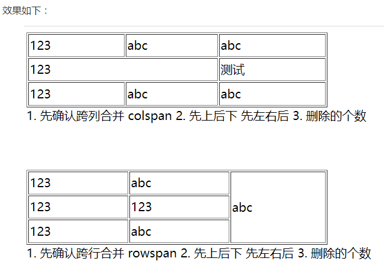

## 26.请说说Canvas和SVG图形的区别是什么

[讲一讲 Canvas 究竟是个啥](https://juejin.im/entry/6844903445820866574)

[Canvas入门到高级详解(上)](https://www.cnblogs.com/fly_dragon/p/10416034.html)

### Canvas

依赖分辨率
不支持事件处理器
弱的文本渲染能力
能够以 .png 或 .jpg 格式保存结果图像
最适合图像密集型的游戏，其中的许多对象会被频繁重绘

### SVG

不依赖分辨率
支持事件处理器
最适合带有大型渲染区域的应用程序（比如谷歌地图）
复杂度高会减慢渲染速度（任何过度使用 DOM 的应用都不快）
不适合游戏应用

## 27.HTML的button中的reset有什么作用

`button.type="reset" `，重置按钮，即**清除表单数据**。与form表单配合使用。

一般用于后台管理系统或者登陆注册页面等包含表单的地方，设为reset的button在点击后会将包含他的表单中的所有用户输入都重置为value指定的默认值。

## 28. 精灵图和base64如何选择呢

**CSS Sprites（雪碧图或CSS精灵）**

* 介绍

  是网页图片处理的一种方式，它允许你将一个页面涉及到的所有零星图片都包含到一张大图中去，这样一来，当访问该页面时，载入的图片就不会像以前那样一幅一幅地慢慢显示出来了。

* 原理：
  将许多的小图片整合到一张大图片中，利用CSS中的`background-image`属性，`background-position`属性定位某个图片位置，来达到在大图片中引用某个部位的小图片的效果。

* 优点：
  减少网页的http请求，提升网页加载速度。
  合并多张小图片成大图，能减少字节总数（大图大小<=多张小图大小）.

* 缺点：
  前期需要处理图片将小图合并，多些许工程量。
  对于需要经常改变的图片维护起来麻烦。

**base64：**

* 介绍

  base64是网络上最常见的用于传输8Bit字节代码的编码方式之一，要求把每三个8Bit的字节转换为四个6Bit的字节，Base64是网络上最常见的用于传输8Bit字节代码的编码方式之一。
  通俗点讲：将资源原本二进制形式转成以64个字符基本单位，所组成的一串字符串。
  比如一张图片转成base64编码后就像这样，图片直接以base64形式嵌入文件中生成base64编码：
  图片生成base64可以用一些工具，如在线工具，但在项目中这样一个图片这样生成是挺繁琐。
  特别说下，webpack中的url-loader可以完成这个工作，可以对限制大小的图片进行base64的转换，非常方便。

* 优点：
  base64的图片会随着html或者css一起下载到浏览器,减少了请求.
  可避免跨域问题

* 缺点：
  低版本的IE浏览器不兼容。
  体积会比原来的图片大一点。
  CSS中过多使用base64图片会使得CSS过大，不利于css的加载。

* 适用场景：
  应用于小的图片几k的，太大的图片会转换后的大小太大，得不偿失。
  用于一些CSS sprites不利处理的小图片，如一些可以通过background-repeat平铺来做成背景的图片

按我来说还是雪碧图见得比较多，如王者荣耀官网英雄联盟官网

## 29.请问Web SQL 是HTML5的一个规范吗

Web SQL 数据库 API 并不是 HTML5 规范的一部分，但是它是一个独立的规范，引入了一组使用 SQL 操作客户端数据库的 APIs。

WebSQL 并不是 HTML5 的规范。可以理解为在浏览器中操作一个 SQL 数据库，在移动端上支持程度会比较好，现在已经不在支持。

现在如果在前端想要进行大数据的存储应该使用 IndexedDB。

> Web SQL 已经渐渐被废弃了，如果要本地缓存，建议使用 IndexedDB 替代 Web SQL.

## 30.你知道什么是锚点吗？它的作用是什么？怎么创建一个锚点

锚点为 HTML 文档中的一个特定的位置。比如小节标题、页首、页尾。锚点可以通过 `a` 标签来实现。

```css
<!-- href 前一定要加 # 号，这样点击时就会跳转到对应 name 所在的 a 标签位置 -->
<a href="#anchor">xxx</a>

<!-- 锚点的位置 -->
<a name="anchor">xxx</a>
```

当然，使用 JavaScript 获取到 DOM 元素之后，也可以根据元素的位置信息，利用 `scrollTop` 来进行页面位置的跳转。

```css
<a href="#ss">   <!--name="ss" 的a标签-->     
<a href="#ss">   <!--id="ss" 的任意标签-->    
```

这里**name="ss" 的a标签**、**id="ss" 的任意标签**都是锚点，简单创建用id就可以，绝大多数标签又可以有id属性，而**name仅在a标签中才可以作为锚点**

## 31.table去除边框的方法有哪些

1. ```css
   border-style: hidden;  
   ```

2. ```css
   border: 0; 
   ```

3. ```css
   border: hidden; 
   ```

4. ```css
   border-width: 0; 
   ```

5. ```css
   border: transparent;
   ```

6. ```css
   border-color: transparent; (可能不合题"去除"之意，当例外，不过效果最好，因为border其实还在，所以对原有布局无丝毫影响
   ```

## 32.触发form表单自动提交的方式有哪些

`form` 本身自带提交表单的方式。在 `form` 上可以定义 `method = get/post`、`action = url`（get 方法时，action 的 URL 后不能带参数）。通过 `input type="submit"` 或者 `button type="submit"` 可以触发 `form` 的提交事件。利用 JavaScript 也可以调用 `form` 对象的 `submit()` 方法来触发提交事件。

使用 `form` 提交表单会重新刷新页面，在网速较差的情况下会有白屏的情况。当服务端进行校验时，再返回一个带错误提示的页面给用户也会影响体验。在 Ajax 流行后，利用原生 `form` 进行提交的情况变少了。

## 33. Canvas默认画布的尺寸是多大？怎样设置才能不会变形

默认画布尺寸为300*150 不加单位。

如果直接在css中设置canvas元素的width和height会导致画面变形。

如果不想画面变形可以直接在标签中设置，或者通过js来设置属性的宽高。

~~~css
<canvas width='300' height='200' id= 'a'>
~~~

```
var can = document.getElementById('a')
can.width ='500';
can.height = '300'
```

## 34. Web Worker线程的限制是什么

[Web Worker 使用教程](http://www.ruanyifeng.com/blog/2018/07/web-worker.html)

（1）同源限制

分配给 Worker 线程运行的脚本文件，必须与主线程的脚本文件同源。

（2）DOM 限制

Worker 线程所在的全局对象，与主线程不一样，无法读取主线程所在网页的 DOM 对象，也无法使用document、window、parent这些对象。但是，Worker 线程可以navigator对象和location对象。

（3）通信联系

Worker 线程和主线程不在同一个上下文环境，它们不能直接通信，必须通过消息完成。

（4）脚本限制

Worker 线程不能执行alert()方法和confirm()方法，但可以使用 XMLHttpRequest 对象发出 AJAX 请求。

（5）文件限制

Worker 线程无法读取本地文件，即不能打开本机的文件系统（file://），它所加载的脚本，必须来自网络。

## 35.如何刷新浏览器的应用缓存

浏览器缓存可分为**强缓存**和**协商缓存**。

* 强缓存指的是设置了expires或者cache-control:max-age的请求，此类缓存在设定的过期时间之前刷新不会再次向浏览器发起请求，直接由客户端决定使用缓存进行页面展示。

* 协商缓存指的是未设置强缓存对应字段的缓存，浏览器会向服务器发送请求，并带IF-Modified-Since和IF-None-Match字段，服务器对应的返回字段为Last-Modified或 Etag，如果在etag未更改 或 last-modified 的时间早于IF-Modified-Since 则服务器不返回文件，使用浏览器本地缓存。

回到问题，如何刷新应用缓存。

当你**直接点击浏览器的刷新按钮**或者**F5刷新**时，浏览器会忽略强缓存，必定向服务器发起请求，但是如果服务器返回304则会继续使用本地缓存。

当点击**Ctrl+F5** 浏览器会忽略一切缓存（cache-control:no-cache），向服务器发起请求，并且一定会使用服务器的返回来渲染页面。

## 36.HTML5的服务器(server-sent event)发送事件有什么应用场景

两种服务端推送技术的简单对比:

| SSE                        | WebSocket                    |
| -------------------------- | ---------------------------- |
| 服务器到浏览器的单向通信   | 两端之间的双向实时通信       |
| 不兼容IE                   | 兼容性更好                   |
| 协议实现断线重连与消息追踪 | 不在协议范围内, 需要手动处理 |
| 实现简单, 复用HTTP         | 独立于Http, 实现较复杂       |

回到问题, 在客户端请求不影响服务端推送数据或客户端请求以及客户端请求不密集的情况下可以考虑使用SSE代替WebSocket.

具体的应用场景有:

1. 邮箱: 实时获取新邮件
2. 后台性能监控: 实时更新监控数据
3. 天气预报: 实时更新天气信息

## 37.如何让textarea高度自适应呢

监听 input 事件，元素高度 = 元素可滚动高度

使用div的contenteditable属性模拟textarea，通过设定min-height 然后用高度慢慢撑高区域。

使用 div contenteditable 模拟的代价实在太大了。

推荐看看 ant-design 和 elementUI 的源码设计即可。

https://github.com/ElemeFE/element/blob/dev/packages/input/src/calcTextareaHeight.js#L73

https://github.com/ant-design/ant-design/blob/master/components/input/calculateNodeHeight.tsx#L88

## 38.请说说应用缓存中的回退和网络分别是什么

应用缓存中的回退帮助你指定在服务器不可访问的时候，将会显示某文件。例如在下面的manifest文件中，我们说如果谁敲击了”/home”同时服务器不可到达的时候，”homeoffline.html”文件应送达

~~~html
FALLBACK:
/home/ /homeoffline.html
~~~

网络命令描述不需要缓存的文件，例如以下代码中，我们说”home.aspx”永远都不应该被缓存或者离线访问。

~~~html
NETWORK:
home.aspx
~~~

## 39.如何让textarea标签中的内容原格式输出

~~~html
<textarea name="demo" id="" cols="30" rows="10">
   <code>
     <span>
       <i></i>
     </span>
     <div></div>
   </code>
 </textarea>
~~~

> 也可以考虑使用`white-space: pre;`

## 40.说说你对HTML5的keygen标签的理解，它的作用是什么

keygen元素是密钥对生成器（key-pair generator）。当提交表单时，会生成两个键，一个是私钥，一个公钥。私钥（private key）存储于客户端，公钥（public key）则被发送到服务器。公钥可用于之后验证用户的客户端证书（client certificate），即实现非对称加密目前，**浏览器支持率极低**。

> 该特性已经从 Web 标准中删除，虽然一些浏览器目前仍然支持它，但也许会在未来的某个时间停止支持，请尽量不要使用该特性。

## 41.form标签定义请求类型和请求地址分别是哪个属性

`method`属性和`action`属性；

## 42.如何实现应用缓存？说说你对manifest的理解

[聊一聊H5应用缓存-Manifest](https://segmentfault.com/a/1190000009047702)

应用缓存：对代码层面通过代码逻辑和缓存策略，实现对页面，图片等资源的缓存。可以将数据存在文件系统或内存中，减少数据库查询和读写瓶颈，提高响应效率。

manifest的理解 : 带有manifest标签的html文档，用于离线浏览。文档缓存manifest的地址可以是一个文件，也可以是一个链接地址。

### 导读

Manifest 是 H5提供的一种应用缓存机制, 基于它web应用可以实现离线访问(offline cache). 为此, 浏览器还提供了应用缓存的api--applicationCache. 虽然**manifest的技术已被web标准废弃**, 但这不影响我们尝试去了解它. 也正是因为manifest的应用缓存机制如此诱人, 饿了么 和 office 365邮箱等都还在使用着它!

### 描述

对manifest熟悉的同学可以跳过此节.

鉴于manifest应用缓存的技术, 我们可以做到:

- 离线访问: 即使服务器挂了, 或者没有网络, 用户依然可以正常浏览网页内容.
- 访问更快: 数据存在于本地, 省去了浏览器发起http请求的时间, 因此访问更快, 移动端效果更为明显.
- 降低负载: 浏览器只在manifest文件改动时才去服务器下载需要缓存的资源, 大大降低了服务器负载.

manifest缓存的过程如下:

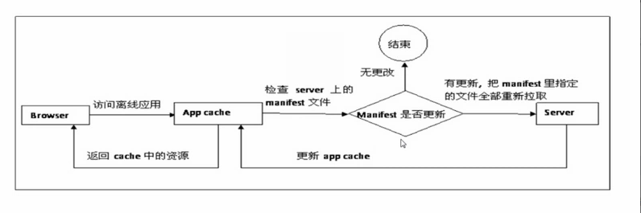

### 如何开启应用缓存

manifest使用缓存清单进行管理, 缓存清单需要与html标签进行关联. 如下:

```html
<html manifest="test.appcache">
  ...
</html>
```

在html标签中指定manifest文件, 便表示该网页使用manifest进行离线缓存. 该网页内需要缓存的文件列表需要在 test.appcache 文本文件中指定.

### manifest缓存清单

就像写作文一样, manifest采用经典的三段式. 分别为: `CACHE`, `NETWORK` 和 `FALLBACK`. 如下, 先看一个栗子?:

```php
CACHE MANIFEST
# v1.0.0
content.css

NETWORK:
app.js

FALLBACK:
/other 404.html
```

其中第一行必须以 `CACHE MANIFEST` 开头, 后可跟若干字符注释, 注释从#号开始. 跟在 `CACHE MANIFEST` 行后的文件, 每行列出一个, 这些文件是需要缓存的文件. 因此 content.css 会被缓存, 不需要访问网络.

第二段内容以 `NETWORK:` 开始, 跟在该行后的文件表示需要访问网络. 如: app.js 将直接从网络上下载, 并不走manifest cache, 如果除了第一段中缓存的文件以外, 其他文件都从网络上获取, 那么此时可将 app.js 改为 * (通配符).

第三段内容以 `FALLBACK:` 开始, 跟在该行后的文件表示会有一个替代方案. 如: 当访问 /other 路径时, 如果访问失败, 那么将自动加载 404.html 作为替代.

### manifest缓存状态

每个manifest缓存都有一个状态, 标示着缓存的情况. 一份缓存清单只有一个缓存状态, 即使它被多个页面引用. 以下是各个缓存状态:

- *UNCACHED*(未缓存): 表明应用缓存对象还没有初始化完成.
- *IDLE*(空闲): 应用缓存并未处于更新状态.
- *CHECKING*(检查): 正在检查是否存在更新.
- *DOWNLOADING*(下载): 清单更新后, 重新下载全部资源到临时缓存中.
- *UPDATEREADY*(更新就绪): 新版本的缓存下载完成, 全部就绪, 随即触发事件 updateready.
- *OBSOLETE*(废弃): 应用缓存已被废弃.

上述缓存状态常量依次取值0, 1, 2, 3, 4, 5.

### applicationCache

applicationCache是操作应用缓存的瑞士军刀, 也是唯一的一把刀.

首先我们来获取该对象.

```javascript
//webview下
var cache = window.applicationCache;
//shared worker中
var cache = self.applicationCache;
```

以下是其属性和方法介绍(大神请绕过):

- status: 返回当前页面的应用缓存的状态, 通常开启应用缓存的页面可能返回1, 其他页面则返回0.
- update(): 手动触发应用缓存的更新.

(1) 若有更新, 则依次触发①检查事件(Checking event), ②下载事件(Downloading event), ③下载进度事件(Progress event), ④更新完成事件(UpdateReady event);

(2) 若无更新, 则依次触发①检查事件(Checking event), ②无更新事件(NoUpdate event);

(3) 在未开启应用缓存的页面调用将抛出`Uncaught DOMException` 错误.

update() 方法通常在长时间不关闭的页面使用, 比如说邮箱应用, 用于定期检测可能的更新.

- abort(): 取消应用缓存的更新. 可用于节省有限的网络带宽.
- swapCache(): 如果存在一个更新版本的应用缓存, 那么它将切换过去, 否则将抛出 `Uncaught DOMException` 错误. 通常, 我们会在updateready事件触发之后手动调用swapCache()方法, swapCache的切换只对后续加载的缓存文件有效, 已经加载成功的资源并不会重新加载.

那么如何利用好上述api更新一个页面的应用缓存呢? 别急, [Beginner's Guide to Using the Application Cache](http://www.html5rocks.com/en/tutorials/appcache/beginner/) 一文中提供了如下的样板方法:

```javascript
// Check if a new cache is available on page load.
window.addEventListener('load', function(e) {
  window.applicationCache.addEventListener('updateready', function(e) {
    if (window.applicationCache.status == window.applicationCache.UPDATEREADY) {
      // Browser downloaded a new app cache.
      // Swap it in and reload the page to get the new hotness.
      window.applicationCache.swapCache();
      if (confirm('A new version of this site is available. Load it?')) {
        window.location.reload();
      }
    } else {
      // Manifest didn't changed. Nothing new to server.
    }
  }, false);
}, false);
```

### manifest缓存独立性

1. manifest的缓存和浏览器默认的缓存是两套机制, 相互独立, 并且不受浏览器缓存大小限制(Chrome下测试结果).
2. 各个manifest文件的缓存相互独立, 各自在独立的区域进行缓存. 即使是缓存同一个文件, 也可能由于缓存的版本不一致, 而造成各个页面资源不一致.

### manifest缓存规则

1. 遵循全量缓存的规律. 即: manifest文件改动后, 将重新缓存一遍所有的文件(包括html本身和动态添加的需要缓存的文件,即使缓存列表中没有该html). 第一次缓存过程中如果出现缓存失败的文件, 那么, 第二访问, 又将重新缓存一遍所有的文件. 以此类推.
2. manifest文件本身不能写进缓存清单, 否则连同html和资源在其缓存失效之前, 将永远不能获得更新.
3. 即使manifest文件丢失, 缓存依然有效. 不过从此以后, 引入该manifest的html, 将永远不能获得更新.

### webview的缓存现象

通常, webview的缓存有如下三种现象:

1. 普通网页(无manifest文件), 不受manifest缓存影响, 缓存只走 http cache.
2. 包含manifest文件的网页, 缓存文件只受manifest缓存影响(只有manifest文件改变时才会更新缓存资源), 缓存资源完全与 http cache 无关, 但是 `NETWORK` 段落后需要访问网络的文件, 将继续走 http cache.
3. webview直接加载manifest缓存过的文件时, 优先加载第一个manifest缓存的该文件, 如果没有找到manifest缓存, 那么它将自动寻找 http cache 或者 在线加载.

### 最佳实践

1. 通常只使用一个manifest文件, 并保证缓存的文件尽可能的少, 以减小manifest每次更新清单中文件所耗费的时间和流量.
2. 如果一定要使用两个及以上manifest文件, 缓存文件请尽量不要相同.
3. 如果以上两条都不能保证, 那么, 请保证尽可能在manifest缓存的状态更新时, 主动去刷新网页.(此时并不能保证不同网页之间同一个缓存文件版本一致)

### 具体落地步骤

1. 如果缓存的文件需要加参数运行, 建议将参数内容加到hash中, 如:cached-page.html#parameterName=value

2. manifest 的引入可以使用绝对路径或者相对路径, 如果你使用的是绝对路径, 那么你的manifest文件必须和你的站点处于同一个域名下.

3. manifest文件你可以保存为任意的扩展名, 但是响应头中以下字段须取以下定值, 以保证manifest文件正确被解析, 并且它没有http缓存.

   ```
   Content-Type: text/cache-manifest
   Cache-Control: max-age=0
   Expires: [CURRENT TIME]
   ```

### 如何更新缓存

1. 更新manifest文件后, webview将自动更新缓存.
2. JS更新缓存(手动触发manifest更新): window.applicationCache.update();

## 43.请说说`<pre>`和`<code>`标签的区别

`<pre>`里的内容会保留换行符和空格，`<code>`里的不会保留。

看了下谷歌浏览器关于这两个标签的用户样式：

- `<code>`：

```
code {
    font-family: monospace;
}
```

- `<pre>`：

```
pre {
    display: block;
    font-family: monospace;
    white-space: pre;
    margin: 1em 0px;
}
```

不难看出`code`标签仅仅是给文字设置了浏览器的默认等宽字体；而`pre`标签默认的`white-space`属性值是`pre`，即保留连续空白符；

## 44.SGML（标准通用标记语言）和HTML（超文本标记语言），XML（可扩展标记语言）和HTML的之间有什么关系

[HTML、XML、XHTML 有什么区别 (SGML、DTD 标准 )](https://blog.csdn.net/weixin_41796631/article/details/89371356)

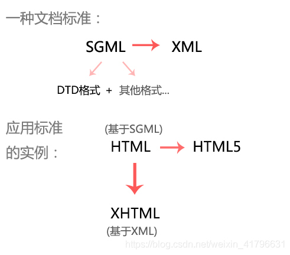

SGML 定义电子文档和内容描述的标准。DTD 标准是SGML 的一部分

XML 是SGML 的子集，优化版

* HTML 是遵循了 DTD 标准的 SGML 的文档，也可以说是 SGML 的一个实例
* XHTML 是遵循了XML标准的 HTML 文档。

* HTML5 是HTML最新的HTML标准。但不基于SGML，所以不遵循 DTD 标准

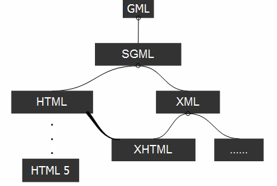


### 1. HTML

> HTML(Hyper Text Mark-up Language)即超文本标记语言或超文本链接标示语言，是目前网络上应用最为广泛的语言，也是构成网页文档的主要语言。它告诉浏览器如何显示内容。

#### 主要特点

1. 简易性：超级文本标记语言版本升级采用超集方式，从而更加灵活方便。
2. 可扩展性：超级文本标记语言的广泛应用带来了加强功能，增加标识符等要求，超级文本标记语言采取子类元素的方式，为系统扩展带来保证。
3. 平台无关性：虽然个人计算机大行其道，但使用MAC等其他机器的大有人在，超级文本标记语言可以使用在广泛的平台上，这也是万维网（WWW）盛行的另一个原因。
   通用性：另外，HTML是网络的通用语言,一种简单、通用的全置标记语言。它允许网页制作人建立文本与图片相结合的复杂页面，这些页面可以被网上任何其他人浏览到，无论使用的是什么类型的电脑或浏览器。

#### HTML 和 SGML 关系：

SGML规定了在文档中嵌入描述标记的标准格式，指定了描述文档结构的标准方法，目前在WEB上使用的HTML格式便是使用固定标签集的一种SGML文档。

HTML是SGML的一个实例，它的DTD作为标准被固定下来

### 2. XML

> XML是可扩展标记语言，（eXtensible Markup Language）, 翻译成中文就是“可扩展标识语言。**XML用于描绘封装数据，而HTML超文本标记语言用于展示数据**，XHTML就是用XML规则规范的HTML，由于XML语法严格，因此，XHTML要求
>
> - 元素被正确嵌套
> - 必须有关闭标签` `，
> - 必须小写
> - 属性必须有值且用双引号,用id代替name。

#### XML与HTML的主要区别

- XML 被设计用来传输和存储数据，其**焦点是数据的内容**。HTML 超文本标记语言被设计用来显示数据，其**焦点是数据的外观**。
- **HTML 旨在显示信息；而XML旨在传输信息**，它是独立于软件和硬件的信息传输工具。

1. **目标 :**HTML的设计目标是显示数据并集中于数据外观，而XML的设计目标是描述数据并集中于数据的内容，它的显示形式靠CSS或XSL帮完成。
2. **语法：**HTML的标记不是所有的都需要成对出现，XML则要求所有的标记必须成对出现；**HTML标记不区分大小写，XML则大小敏感，即区分大小写**。
3. **更新：**XML允许粒度更新，不必在XML文档每次有局部改变时都发送整个文档的内容，只有改变的元素才必须从服务器发送到客户机，而HTML却不支持这样的功能。
4. **可读性：**HTML侧重于网页数据表现形式的定义和描述，欠缺对文档数据含义的确切描述，不能适应对于日益增多的各类信息进行传递与存档的需求。例如`Apple`,在浏览器中显示的Apple，人们并不知道它具体是水果还是一个手机，HTML并不能解释数据Apple的含义；而XML不会给大家这个错觉如果描述的是水果中的苹果的话它会很清楚的这样表示`<水果>Apple`。所以说HTML的可读性相对较差。
5. **XML标记由架构或文档的可自定义：**还有一点就是XML标记由架构或文档的作者定义，并且是无限制的。HTML 标记则是预定义的;HTML 作者只能使用当前 HTML 标准所支持的标记。

### 3. XHTML

> 意义:指扩展超文本标签语言（EXtensible HyperText Markup Language）,目标是取代HTML.

XML是可扩展标记语言，用于描绘封装数据，而HTML超文本标记语言用于展示数据，**XHTML就是用XML规则规范的HTML**，由于XML语法严格，因此，XHTML要求

- 元素被正确嵌套
- 必须有关闭标签` `，
- 必须小写
- 属性必须有值且用双引号,用id代替name。

#### 与HTML的主要区别

1. XHTML是当前HTML版的继承者,由于HTML的语法较为松散,对于许多其他设备的要求较高,因此就出现了由DTD定义规则,语法要求更加严格的XHTML。
2. XHTML与HTML的最大的变化在于所有标签必须闭合。
3. XHTML中所有的标签必须小写。
4. XHTML 元素必须被正确地嵌套。
5. XHTML 文档必须拥有根元素。

### 4.HTML5

> HTML5是最新的HTML标准，他的主要目标是提供所有内容而不需要任何的像flash，silverlight等的额外插件，这些内容来自动画，视频，富GUI等

HTML5没有使用SGML或者XHTML，他是一个全新的东西，因此你不需要参考DTD，对于HTML5，你仅需放置下面的文档类型代码告诉浏览器识别这是HTML5文档

### 5.SGML

SGML( Standard Generalized Markup language 即标准通用标记语言)是一种类XML的语言，甚至是XML的父语言。 SGML通过没有数据类型约定的语法为定义数据提供了一种十分广泛的形式。不同于SGML，XML具有严格且极端简化的语法，且十分易懂。 与SGML不同，XML也具有数据类型定义的特征。 XML中的元素以lambda方式提供名字空间范围，而SGML不支持名称空间。

SGML是国际上定义电子文档和内容描述的标准。它源于1969年IBM公司开发的文档描述语言GML，GML主要用来解决不同系统中文档格式不同的问题。后经过多年发展，1986年经ISO批准为国际标准ISO8897，并被称为SGML。

制定SGML的基本思想是把文档的内容与样式分开。在SGML中，标记分两种：一种用来描述文档显示的样式，称为程序标记；另一种用来描述文档中语句的用途，称为描述标记。

 一个SGML文件通常分三个层次：结构、内容和样式。结构为组织文档的元素提供框架，内容是信息本身，样式控制内容的显示

#### SGML结构

​    **HTML 可以说是SGML 结构里面的一个实例。**

　　为了描述文档的结构，**SGML定义了一个称为“文档类型定义(Document Type Definition，DTD)”的文件(file)**，它为组织文档的文档元素(例如章和章标题，节和主题等)提供了一个框架。此外，DTD还为文档元素之间的相互关系制定了规则。例如，“章的标题必须是在章开始之后的第一个文档元素”，“每个列表至少要有两个项目”等。DTD定义的这些规则可以确保文档的一致性。

#### SGML内容

　　这里指的内容就是信息本身。内容包括信息名称(标题)、段落、项目列表和表格中的具体内容，具体的图形和声音等。确定内容在DTD结构中的位置的方法称为“加标签(tagging)”，而创建SGML文档实际上就是围绕内容插入相应的标签。这些标签就是给结构中的每一部分的开始和结束做标记。

#### SGML 的DTD标准**（Document type definition）**

**SGML是XML的前身**，由于SGML难理解浏览器支持差等原因被放弃，XML和HTML都基于SGML。**SGML的DTD作为标准被固定下来。也就是说，DTD 标准是SGML 的一部分。**所以HTML4.01基于SGML，所以需要对DTD进行引用，才能告知浏览器文档所使用的文档类型。

#### SGML与XML有是什么关系呢?

XML是SGML的一个子集，比SGML要简单，但是能实现SGML的大部分功能。

## 45.说说你对表单属性`type="hidden"`的理解，它的运用场景有哪些？

1.隐藏域在页面中对于用户是不可见的，在表单中插入隐藏域的目的在于收集或发送信息，以利于被处理表单的程序所使用。浏览者单击发送按钮发送表单的时候，隐藏域的信息也被一起发送到服务器。

2.有些时候我们要给用户一信息，让他在提交表单时提交上来以确定用户身份，如sessionkey，等等．当然这些东西也能用cookie实现，但使用隐藏域就简单的多了．而且不会有浏览器不支持，用户禁用cookie的烦恼。

3.有些时候一个form里有多个提交按钮，怎样使程序能够分清楚到底用户是按那一个按钮提交上来的呢？我们就可以写一个隐藏域，然后在每一个按钮处加上οnclick="document.form.command.value="xx""然后我们接到数据后先检查command的值就会知道用户是按的那个按钮提交上来的。

4.有时候一个网页中有多个form，我们知道多个form是不能同时提交的，但有时这些form确实相互作用，我们就可以在form中添加隐藏域来使它们联系起来。

5.javascript不支持全局变量，但有时我们必须用全局变量，我们就可以把值先存在隐藏域里，它的值就不会丢失了。

## 46.请说说viewport是什么？在什么时候下使用？有什么作用

[viewport meta标签控制布局](https://developer.mozilla.org/zh-CN/docs/Mobile/Viewport_meta_tag)

[移动前端开发之viewport的深入理解](https://www.cnblogs.com/2050/p/3877280.html)

[深入viewport](https://segmentfault.com/a/1190000014735646)

[【移动端web开发】（一）基本概念](https://segmentfault.com/a/1190000014725664)

* 是什么：viewport 是用户网页的可视区域

* 什么时候用：多用于移动端，也可以用在支持类似“固定到边缘”等特性的桌面浏览器。

* 什么作用：移动端的浏览器是把页面放在一个虚拟的"窗口"（viewport）中，通常这个虚拟的"窗口"（viewport）比物理屏幕宽，这样就不用把每个网页挤到很小的窗口中（这样会破坏没有针对手机浏览器优化的网页的布局），用户可以通过平移和缩放来看网页的不同部分。


visual viewport尺寸所对应的并不是指屏幕区域里的物理像素，而是CSS 像素。并且它所包含的 CSS 像素的数量也是随着用户缩放而有所改变。

在head加入这行，把默认的layout viewport的宽度设为移动设备的屏幕宽度，也就是把当前的viewport宽度设置为设备物理屏幕的宽度，实现全屏的效果。

`<meta name="viewport" content="width=device-width, initial-scale=1, minimum-scale=1, maximum-scale=1, user-scalable=no">`

一般为了自适应布局，普遍的做法是将width设置为`device-width`

## 47.本地存储的生命周期是什么

* `cookie`: `expire` 和 `max-age` 都能控制数据的存储时间。`expire` 是一个绝对的过期时间，`max-age` 是文档被访问之后的存活时间（是相对时间）。默认是 `session`。
* `sessionStorage`: 当会话被关闭后（浏览器、标签页被关闭），就会被清除。与 `localStorage` 用法一样。
* `localStorage`: 除非被主动清除，不然永久储存在浏览器中。
* `IndexedDB`: 没有过期时间，除非主动清除。

## 48.input的onblur和onchange事件区别是什么

onchange是指值改变并且失去焦点时触发的事件

onblur失去焦点时就触发，不管值有没有改变

* `onblur` 在 `input` 失去焦点时候触发。与之对应的是 `onfocus` 事件。无论 `input` 是否有值、值是否有变化，都会触发。
* `onchange` 在 `input` 发生变化然后在失去焦点的时候触发。且先于 `onblur` 触发。`onchange` 只有在 `input` 的值必须与前一次输入不同才会触发。

## 49.怎样把整个页面中的内容设置成只读，不可编辑的状态

~~~css
body {
  pointer-events: none !important;
}
~~~

## 50.HTML5如何使某个页面元素或整个页面可编辑

* 让某个元素可以编辑，可以使用 `contenteditable` 属性。
* 让整个页面可编辑可以使用 `document.designMode` 属性。

在url栏上输入`data:text/html, <html contenteditable> `使整个页面可以书写

> 我试了好像没反应。

# CSS

## 1.说说你对前端二倍图的理解？移动端使用二倍图比一倍图有什么好处

* 一倍图：当这个比率为1:1时，使用1个设备像素显示1个CSS像素
* 二倍图：当这个比率为2:1时，使用4个设备像素显示1个CSS像素
* 三倍图：当这个比率为3:1时，使用9（3*3）个设备像素显示1个CSS像素。

不同倍图可以在不同机型视网膜屏幕下保真显示

二倍图是指单位面积下设备像素与CSS像素个数之比为 4 的位图。

移动端使用二倍图可以在Retina屏幕下保真展示。

> 你如果用一倍图 在分辨率高的手机上 是卡的

## 2.你是如何规划响应式布局的

从项目角度来讲，
PC 和 Mobile 是一个项目还是两个项目；

从方法流派来讲，
有栅栏布局，固定 viewport，使用 rem/pt/vw 单位，使用定位百分比，修改为 rem/vw 单位，五种；

从文件结构来讲，
是独立为响应布局专用 css 文件，还是跟随组件一起；

其他细节，
用 flex-grow 的地方，用 % 的地方，用 em 的地方

> PC和Mobile分开
>
> 1.PC 采用栅栏式布局
>
> 2.Mobile 基于viewport，采用flex实现

## 3.说说你对低版本IE的盒子模型的理解

一个CSS盒子由四部分组成，由内到外依次是：content、padding、border、margin。

所谓盒子模型定义的是盒子宽高的计算方法，IE盒子模型的宽高为content、padding、border之和。而W3C盒子的宽高仅为content。从页面布局来说前者实际上更实用一点，这也是后来W3C提供box-sizing属性用于切换盒子模型的原因。

盒子模型：content,padding,border,margin

W3C盒子宽高为content的宽高： `box-sizing: content-box;`

IE盒子宽高，content + padding + border： `box-sizing: border-box;`

## 4.行内元素和块级元素有什么区别，如何相互转换

| 块级元素                                        | 行内元素                                                     |
| ----------------------------------------------- | ------------------------------------------------------------ |
| 独占一行,默认情况下，其宽度自动填满其父元素宽度 | 相邻的行内元素会排列在同一行里，直到一行排不下，才会换行，其宽度随元素的内容而变化 |
| 可以设置margin和padding属性                     | 行内元素起边距作用的只有margin-left、margin-right、padding-left、padding-right，其它属性不会起边距效果。 |
| 可以设置width，height属性                       | 行内元素设置width，height属性无效                            |
| 对应于display:block                             | 对应于display:inline；                                       |

发现大家均存在一个误区，能否设置宽高不是行内元素与块级元素的区别。举个例子，``可设置宽高但同时也属于行内元素。

行内元素又分为可置换元素与不可置换元素。可置换元素展示的内容是通过元素的src、value等属性或CSS content属性从外部引用得到的，可被替换的，如``，``, ``等。剩下的就是不可置换元素。

不可置换行内元素不能设置width、height和垂直方向上的margin，而可置换行内元素则可以。

## 5.怎么实现移动端的边框0.5px

* 通过transform中的scale

```css
    border: 1px solid red;
    transform: scaleY(.5);
```

* 通过meta viewport中设置init-scale为0.5

~~~html
<meta name="viewport" content="width=device-width, initial-scale=0.5">
~~~

* 设置hr

```css
border: 0px;
border-bottom: 1px solid red;
```

* 基于背景渐变实现

```css
height: 2px;
background-image: linear-gradient(0deg, red 50%, transparent 50%)
```

## 6.CSS中的calc()有什么作用

calc使得开发者能够使用四则运算表达式来填写CSS属性。

px、%、em等不同单位的数值均可参与计算，浏览器会进行自动转换。

坑： 当使用calc的时候，运算符号 左右需要有空格，否则，属性不生效。例如:`width: calc(100% - 30px);`

[MDN](https://developer.mozilla.org/en-US/docs/Web/CSS/calc)

## 7.过渡和动画的区别是什么

- transition 定义的是元素可动画属性的计算值产生变化时，需要以怎样的方式过渡到目标值。可以定义过渡时间和过渡函数来控制过渡动画的效果，默认行为是瞬间切换成变化后的结果，即无动画。
- animation 使用 [@Keyframes](https://github.com/Keyframes) 预定义一系列动画进程中的关键帧，关键帧中可以指定任意可动画属性的值，然后只需要应用动画到你想要的元素上并指定时间，次数，缓动函数，状态，动画结束后的行为等。

区别：

### 过渡 transition

- transition 是需要事件进行触发的，且只能触发一次
- transition无法定义中间的状态信息，类似Flash的关键帧，中间的补间动画无法详细定义
- 一次性

### 动画 animation

- animation 无需事件触发，并且可以周期性播放。可定义中间状态
- 显示地随着时间的流逝，周期性的改变元素的css属性值。区别于一次性
- 通过百分比来定义过程中的不同形态，可以很细腻

## 8.position的relative和absolute定位原点是哪里

| 值       | 描述                                             |
| -------- | ------------------------------------------------ |
| static   | 自动定位（默认定位方式）                         |
| relative | 相对定位，相对于其原文档流的位置进行定位         |
| absolute | 绝对定位，相对于其上一个已经定位的父元素进行定位 |
| fixed    | 固定定位，相对于浏览器窗口进行定位               |

### 静态定位(static)

静态定位是所有元素的默认定位方式，当position属性的取值为static时，可以将元素定位于静态位置。 **所谓静态位置就是各个元素在HTML文档流中默认的位置。**

上面的话翻译成白话：  就是网页中所有元素都默认的是静态定位哦！ 其实就是标准流的特性。

**在静态定位状态下，无法通过边偏移属性（top、bottom、left或right）来改变元素的位置。**

PS： 静态定位其实没啥可说的。

静态定位唯一的用处：就是取消定位。(我们没有position:none取消定位)

### 相对定位relative(自恋型-停职留薪-占有位置)

相对定位是将元素相对于**它自己(左上角)**在标准流中的位置进行定位，当position属性的取值为relative时，可以将元素定位于相对位置。

对元素设置相对定位后，可以通过边偏移属性改变元素的位置，但是**它在文档流中的位置仍然保留**。如下图所示，即是一个相对定位的效果展示： 

> 相对定位是脱标的，只不过它占有位置而已！！！！！
>
> 相对定位占着茅坑不拉屎。


注意：   

1. 相对定位最重要的一点是，它可以通过边偏移移动位置，但是**原来的所占的位置，继续占有**。
2. 其次，每次移动的位置，是以**自己的左上角为基点移动**（相对于自己来移动位置）

就是说，**相对定位的盒子仍在标准流中**，它后面的盒子仍以标准流方式对待它。（**相对定位不脱标**）

如果说**浮动的主要目的是 让多个块级元素一行显示，那么定位的主要价值就是移动位置， 让盒子到我们想要的位置上去。**

> 第二个盒子开始自恋，以自己左上角为起点开始移动，不过随便你怎么移动，第一和第三个盒子仍旧坚守岗位，一动不动。

### 绝对定位absolute (拼爹型-不占位置)

[注意] 如果文档**可滚动**，绝对定位元素会**随着它滚动**，因为元素最终会**相对于正常流的某一部分定位**。

当position属性的取值为absolute时，可以将元素的定位模式设置为绝对定位。

注意：绝对定位最重要的一点是，**它可以通过边偏移移动位置，但是它完全脱标，完全不占位置。**(和浮动一样，但它比浮动还浮动，跟个鬼狐一样，飘在任何人(标准流，浮动)的上方)

> 我们的盒子分了3个等级，最低级是标准流，在最底层，第二级是浮动，压着标准流的，在它上面。
> 第3级是定位，定位永远飘在任何人(标准流和浮动)的上方。

#### 父级没有定位 

若**所有父元素**都没有定位，以**浏览器当前屏幕为准**对齐(document文档)。


#### 父级有定位

绝对定位是将元素依据**最近的已经定位（绝对、固定或相对定位）的父元素（祖先）**进行定位。


简言之，两者的定位原点都是其**包含块区域**的左上角；只是两种定位元素的包含块有所不同，得出的表明结论就是上述几位所说的。我简单的说一下我对包含块的一些理解：

**包含块**（`containing block`）：用来确定和影响元素的尺寸和位置属性的矩形区域；

> The size and position of an element are often impacted by its **containing block**. Percentage values that are applied to the width, height, padding, margin, and offset properties of an absolutely positioned element (i.e., which has its position set to absolute or fixed) are computed from the element's containing block. ——MDN

一个元素的包含块完全受其`position`属性值的影响：

1. `static`或`relative`：最近的块级（`display`属性值为`block`，`inline-block`或`list-item`）祖先元素的`content-box`区域；或者最近的**建立格式上下文**的祖先元素，比如：`table`容器，`flex`容器，`grid`容器或块级容器。
2. `absolute`：最近的非`static`（fixed, absolute, relative, or sticky）祖先元素的`padding-box`区域。
3. `fixed`：可视窗口`viewport`本身（属于`continuous media`类型时）或页面区域`page area`（属于`paged media`类型时），即**初始包含块**；
4. 当属性值为`fixed`或`absolute`时，其包含块还有可能是最近的含有`transform`或`perspective`值不为`none`的祖先元素的`padding-box`区域。

**注**：`html`元素的包含块叫做**初始包含块**（`initial containing block`），它具有可视窗口（用于连续媒体）或页面区域（用于分页媒体）的尺寸

## 9.说下你对cursor属性的理解

cursor 是鼠标光标的属性。可以给元素设置不同的cursor属性来使鼠标在不同的位置显示不同的形状。

| 值        | 描述                                                         |
| --------- | ------------------------------------------------------------ |
| url       | 需使用的自定义光标的 URL。注释：请在此列表的末端始终定义一种普通的光标，以防没有由 URL 定义的可用光标。 |
| default   | 默认光标（通常是一个箭头）                                   |
| auto      | 默认。浏览器设置的光标。                                     |
| crosshair | 光标呈现为十字线。                                           |
| pointer   | 光标呈现为指示链接的指针（一只手）                           |
| move      | 此光标指示某对象可被移动。                                   |
| e-resize  | 此光标指示矩形框的边缘可被向右（东）移动。                   |
| ne-resize | 此光标指示矩形框的边缘可被向上及向右移动（北/东）。          |
| nw-resize | 此光标指示矩形框的边缘可被向上及向左移动（北/西）。          |
| n-resize  | 此光标指示矩形框的边缘可被向上（北）移动。                   |
| se-resize | 此光标指示矩形框的边缘可被向下及向右移动（南/东）。          |
| sw-resize | 此光标指示矩形框的边缘可被向下及向左移动（南/西）。          |
| s-resize  | 此光标指示矩形框的边缘可被向下移动（南）。                   |
| w-resize  | 此光标指示矩形框的边缘可被向左移动（西）。                   |
| text      | 此光标指示文本。                                             |
| wait      | 此光标指示程序正忙（通常是一只表或沙漏）。                   |
| help      | 此光标指示可用的帮助（通常是一个问号或一个气球）。           |

[CSS cursor 属性](https://www.w3school.com.cn/cssref/pr_class_cursor.asp)

## 10.说说你对设备像素比的理解

[CSS像素、物理像素、逻辑像素、设备像素比、PPI、Viewport](https://zhuanlan.zhihu.com/p/91636704)

[移动Web开发基础-Viewport](https://blog.csdn.net/u013778905/article/details/78073566)

设备像素比(Device Pixel Ratio 简称：DPR)，是指物理像素和CSS像素的比例。

> 导语：移动Web开发自然要从Viewport说起，那什么是Viewport呢？字面意思为视图窗口，在移动设备上就是指用来显示页面的那部分区域。
>
> 用移动设备来访问没有做特殊处理的PC页面，移动设备是显示不下那么宽的内容的，所以移动设备一般会将页面缩小来显示整个页面，用户可以将页面放在来看清楚内容，在做移动Web开发的时候，我们可以手动的设置页面的视窗宽度，页面缩放比例以及是否允许用户缩放等，那具体我们该怎么设置Viewport呢？我们先来了解移动Web开发的其他几个概念。

### 设备像素

对于设备来说，有两个设备像素：物理像素和独立像素。

#### 物理像素：

设备的物理像素是指在设备屏幕上显示的最小的单元，也就是屏幕分辨率，比如iPhone 6的分辨率是750像素*1334像素。每个物理像素可以根据操作系统设置自己的颜色和亮度。正是这些设备像素的微小距离欺骗了我们肉眼看到的图像效果。

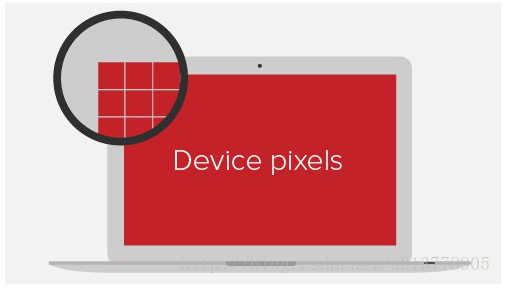

#### 独立像素：

设备独立像素又称CSS像素，这是一个**抽象的概念**，是指Web编程中的逻辑像素。如iPhone 6的CSS像素是375像素*667像素，可以看出来，这**刚好是物理像素的一半**，他们之间的关系后面会讲到。也就是说，如果我们在CSS代码中设置某个div的宽度为375px，在iPhone 6竖屏情况下，刚好能占满屏幕宽度。

### 像素密度（PPI）

每英寸像素（英语：Pixels Per Inch，缩写：PPI），又被称为像素密度，是一个表示打印图像或显示器单位面积上像素数量的指数。一般用来计量电脑显示器，电视机和手持电子设备屏幕的精细程度。通常情况下，每英寸像素值越高，屏幕能显示的图像也越精细。
有研究表明，人类肉眼能够分辨的最高像素点密度是300每英寸像素。[1]超过300每英寸像素的屏幕被常常称为Retina显示屏，这个概念最早由苹果公司于2010年推出iPhone 4手机的时候提出。

#### 屏幕PPI计算公式：

要计算显示器的每英寸像素值，首先要确定**屏幕的尺寸和分辨率**。


其中，

- dp为屏幕对角线的分辨率
- wp为屏幕横向分辨率
- hp为屏幕纵向分辨率
- di为屏幕对角线的长度(单位为英寸)

以屏幕尺寸为4吋的iPhone 5为例，分辨率为1136x640，像素密度为326PPI。而分辨率为1920x1080的家用21.5寸显示器，像素密度为103PPI。

看一下不同PPI的设备显示效果：

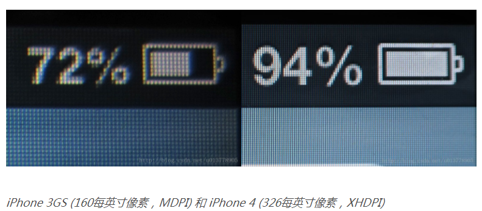

除此之外，我们还可以通过下面的设备像素比（dpr）来判断是不是Retina显示屏。

### 设备像素比（DPR）

设备像素比(Device Pixel Ratio 简称：DPR)，是指物理像素和CSS像素的比例。

**设备像素比（DPR） = 物理像素个数 / CSS像素个数** *（计算公式，前提是缩放比为1）*

对于一般的显示屏设备来说，DPR一般为1：1，但是在Retina屏幕设备中，DPR一般都是大于1：1的，以DPR为2的 iPhone 6 为例。

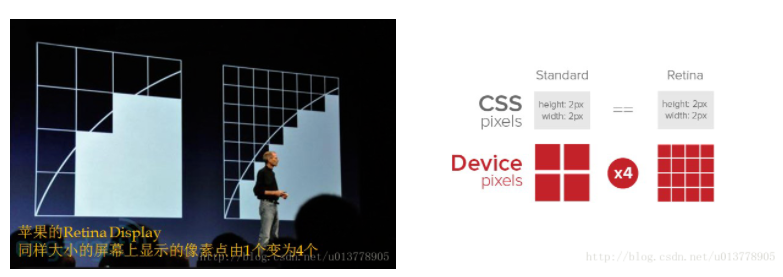

这也就是为什么我们的设计稿一般按手机物理像素的两倍来做的原因，我们移动端的图片也都是按两倍屏或三倍屏要处理，因为如果按一倍来处理的话，我们的图片在手机设备上相当于放大到了两倍，会造成图片的模糊。

目前市场中智能手机的DPR一般都是2或者3，对于iPhone手机来说比较明确，但是对于Android设备，目前各大手机厂商还没有得到很好的统一，有比较多样的比例。

## 11.你有用过table布局吗？说说你的感受 

在 `div + css` 布局成为主流之前，基本都是以 `table` 布局为主。曾经的三剑客，Dreamever 的所见即所得也是利用 `table` 来做布局。

`table` 布局对于排版比较友好，水平居中、垂直居中都可以利用 `table` 的属性来完成。但缺点也是十分明显的。

- `table` 布局往往是 `table` 嵌套 `table`，会有非常多的 DOM 节点，对于性能来说是一个灾难
- 语义化不明，本身就是标签错误的用法。因此对 SEO 不友好。
- DOM 操作是噩梦，无数的 `tr`、`td` 中要寻找到目标 DOM 元素非常困难，代码没有维护性可言。

> 用来做列表排版还是很不错的，但是要想用的好，还是要对table有比较多的了解。
> 比如实现表头固定，表内容超出滚动的效果等。

## 12.举例说明时间、频率、角度、弧度、百分度的单位分别是哪些

- 时间: s, ms
- 频率: Hz
- 角度: deg
- 弧度: rad
- 百分度: grad

## 13.标签、class和id选择器三者的区别是什么？分别在什么时候用

三者的权重不同，都可以作为 CSS 的选择器使用。`id > class > tag`。

不过在一般的使用中，`id` 会留给 JavaScript 使用，用来进行 DOM 的操作并且 `id` 不允许重复。`class` 和 `tag` 一般用在 CSS 上，用来进行样式的编辑。

## 14.为什么要使用CSS Sprites(精灵图)

CSS Sprites指的是将该页面请求的图片资源都拼接到一个图片文件上，通过CSS从拼接好的图片上获取需要的部分。
优点:

* 一个是减少了HTTP请求的发送次数
* 一个是合并后的图片一般小于合并前的图片大小总和
  缺点：
* 如果发生改动需要重新做拼接

> 根据项目具体需求来做选择吧，现在小图片用base64 也是可以的，或者图标字体库。

CSS sprites 把许多小图片 icon 合成一张大图片。利用 `background-position` 来显示对应的图片。这样做的好处就是可以减少 http 请求，提高网页的加载速度。如果有 10 个小图标那就需要请求 10 次，如果合成 CSS sprites 就只需要请求一次。

以前一般使用 Photoshop 进行拼接，现在的话有工具可以直接生成。

> 就像钱不够，省着用，一块搬开两块用。

## 15. Reset CSS和Normalize CSS的区别是什么

- Reset CSS: 将各个浏览器的默认样式重置

- Normalize CSS: 保留各个浏览器的样式,只是让它们更加统一通用了


* Reset：将所有浏览器的默认样式都统一化，注重的是跨浏览器统一样式，用户还要自行添加一些默认样式。

* Normalize：会根据各个浏览器的不同保留有用的浏览器特色样式，修复浏览器的一些BUG，更注重易用性。

## 16.怎么自定义鼠标指针的图案(重复)

和第9题重复

~~~css
cursor: url(),auto
~~~

url是自定义光标图案的绝对路径，auto是默认光标，当我们自定义的光标不起作用时，就用默认光标代替。

## 17.你知道CSS中的字母"C"代表什么吗

CSS(Cascading Style Sheets)。"C" 即为 Cascading 层叠的意思，我们编写 CSS 的时候，写在后面的样式会覆盖前面的样式即层叠。

## 18.说说你对GPU的理解，举例说明哪些元素能触发GPU硬件加速

[CPU 和 GPU 的区别是什么？](https://www.zhihu.com/question/19903344/answer/96081382)

- GPU: 图形处理器,用于处理图形有关的任务,用于渲染页面
- 在CSS中使用 `transform: translateZ(0)`,可以开启GPU硬件加速

## 19. 你有没有自己写过一套UI库？说下遇到哪些难点

[如何基于 Vue 2 写一套 UI 库？](https://blog.csdn.net/GitChat/article/details/79324147)

维护过，碰到的坑主要是

* 同一个UI component在不同地方使用的customization问题。
* 还有如果UI component如果有bug的话会导致所有使用的地方都出现bug
* 改了一个UI component后在A处work，但是在B处因为context不一样导致render出来的效果不一样

## 20.设置字体时为什么建议设置替换字体

这是由于网站用户的浏览设备不同，可能并不支持或没有安装你所设置的字体。
这时候就会自动使用替换字体来对网页进行一个展示。
设置替换字体可以尽可能保证所有用户的浏览体验。

## 21.请举例说明伪元素 (pseudo-elements) 有哪些用途

1. 可以不用再多写一个DOM
2. 可以用 content 搭配出很多效果

例子：

* 固定尺寸 2:1 的容器
* 文本前后增加 icon 或图片
* 使用 `data-* 和 content: attr(data-*) `搭配
* 使用 `:hover 和 content `搭配出很多效果

* 作为**修饰元素**

* 使用 content: counter() 玩有序数字

* 参与 inline-block 垂直居中

## 22.举例说明微信端兼容问题有哪些

* 微信自带的下拉出网站信息，苹果自带的滑动回弹，与 fixed 一起，非常非常酸爽
* 微信视频最好使用全屏模式，否则会有结尾广告、不能被元素覆盖
* 横屏的项目，微信支付时会竖屏，大部分苹果机支付后无法再横屏了

## 23.什么是zoom？它有什么作用

`zoom` 最初是 IE 的私有属性，现在除了 Firefox 之外的浏览器基本都支持 `zoom`。不过，`zoom` 依旧不是正式的属性。与之对应的 `transform` 的 `scale` 属性是正式的 CSS 属性。

`zoom` 主要的作用是用于元素或者页面的缩放；`transform` 的 `scale` 也有同样的作用，两者有如下的区别。

- `zoom` 的缩放点在元素左上角。在 Chrome 下，文字如果缩小后小于 12px 的情况仍然会显示 12px。并且 `zoom` 缩放会影响元素实际的位置，这样就会造成页面的重排和重绘，在性能上会有影响。
- `transform` 的 `scale` 缩放点在元素中心。缩放会对文字有影响，可以利用此属性实现 Chrome 下小于 12px 的字体。但是 `transform` 缩放后不会改变元素的位置，即如果元素原来是 200px 宽，缩小 50% 后虽然看上去只有 100px 宽了，但是仍然占 200px。

示例：https://codepen.io/Konata9/pen/jONrgVg

参考文章：[小tips: zoom和transform:scale的区别](https://www.zhangxinxu.com/wordpress/2015/11/zoom-transform-scale-diff/)

## 24.举例说明伪类`:nth-child、:first-child与:first-of-type`这三者有什么不同？*

~~~html
<div>
   <p>大儿子</p>
   <div>二儿子</div>
   <p>三儿子</p>
</div>

<p>二叔</p>
<div>三叔<div>
~~~

* `div:nth-child（2）` 选中父元素里的第二个子元素div；（即二儿子被选中）
* `p:first-child` 选中父元素里的第一个p元素；（大儿子被选中，二叔没有被选中，因为它不是父元素里的第一个元素）
* `p:first-of-type `选中第一个类型为p的子元素（大儿子、二叔被选中，因为大儿子是父元素div的第一个p元素，二叔是body的一个p元素）
* `：nth-child（n）和：first-child` 是强调父元素里的第n个xx子元素，**首先是第n个，然后才是xx类型**；
* `：first-of-type` 主要强调类型，即一个父元素里，无论我们想选中的那个元素前面有多少个同级元素，都不算，只要找到父元素里的第一个xx子元素就行。

## 25.使用纯CSS代码实现动画的暂停与播放

[如何来控制CSS动画animation的暂停和播放](http://www.vcchar.com/thread-25016-1-1.html)

可以使用`animation-play-state`属性；

- `paused`：暂停动画的运行；
- `running`：恢复动画的播放；如果是恢复一个状态为**已暂停**的动画，则是从**动画暂停的地方**开始进行播放。

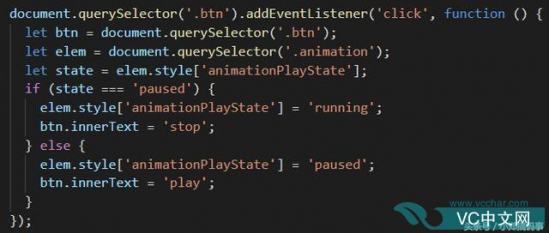

## 26.说说你对hasLayout的理解，触发hasLayout的方式有哪些

[hasLayout到底是何方神圣？](https://www.cnblogs.com/fsjohnhuang/p/5291166.html)

hasLayout可以简单看作是IE5.5/6/7中的BFC(Block Formatting Context)。也就是**一个元素要么自己对自身内容进行组织和尺寸计算(即可通过width/height来设置自身的宽高)，要么由其containing block来组织和尺寸计算。**而IFC（即没有拥有布局）而言，则是**元素无法对自身内容进行组织和尺寸计算，而是由自身内容来决定其尺寸（即仅能通过line-height设置内容行距，通过行距来支撑元素的高度；也无法通过width设置元素宽度，仅能由内容来决定而已）**

当hasLayout为true时(就是所谓的"拥有布局")，相当于元素产生新BFC，元素自己对自身内容进行组织和尺寸计算;

当hasLayout为false时(就是所谓的"不拥有布局")，相当于元素不产生新BFC，元素由其所属的containing block进行组织和尺寸计算。

和产生新BFC的特性一样，hasLayout无法通过CSS属性直接设置，而是通过某些CSS属性间接开启这一特性。不同的是某些CSS属性是以不可逆方式间接开启hasLayout为true。并且默认产生新BFC的只有`html`元素，而默认hasLayout为true的元素就不只有`html`元素了。

另外我们可以通过`object.currentStyle.hasLayout`属性来判断元素是否开启了hasLayout特性。

具体条件可在进行向下兼容时再查阅相关资料，无需过多记忆。

虽然我现在已经不用再适配IE5.5/6/7了，但理解hasLayout还是很有必要的。其实可以理解为从另一个角度学习BFC吧！

## 27.说说你对min-width和max-width的理解，它们有什么运用场景

- `min-width`：设定元素的最小宽度，可以阻止元素的宽度小于该值；
- `max-width`：设定元素的最大宽度，可以阻止元素的宽度大于该值；

这两个属性多用于自适应宽度布局中，希望某些元素的宽度不能小于或大于某个宽度，以免造成难看的布局；如：表格自适应宽度时，当屏幕宽度较小，某一列的内容过多时，就会出现“**一柱擎天**”的现象，此时可以设置该列的`min-width`来避免这种情况。

## 28. 说说visibility属性的collapse属性值有什么作用？在不同浏览器下有什么区别

[CSS visibility 属性](https://www.w3school.com.cn/cssref/pr_class_visibility.asp)

`visibility: collapse`对于表格的**行（组）或列（组）元素**来说就相当于`display: none`，而对于**其它元素**则相当于`visibility: hidden`；

设置`visibility: collapse`后对于普通元素来说跟`visibility: hidden`效果一样，**隐藏元素，且占用空间**
但对于一些**table元素**，比如`row、column、group`，效果则跟`display: none`一样，**隐藏元素，但不占空间**
但这些效果会随着浏览器底层实现不同而改变：

* 在Chrome下，`visibility: collapse`都与`visibility: hidden`没有什么区别，即仍会占用空间

* 在火狐浏览器、Opera里，使用collapse值的效果就如它的字面意思：table的行会消失，它的下面一行会补充它的位置，不占用空间。

* 在IE即使设置了visibility: collapse，还是会显示元素。

## 29.absolute的containing block（容器块）计算方式和正常流有什么区别

[CSS魔法堂：不得不说的Containing Block](https://segmentfault.com/a/1190000004642650)

一个containing block把我问懵了，百度了下原来就是相对父元素怎么定位的。absolute会脱离正常的文档流，去向上找最近的、position属性不为static的父元素，如果找不到就是body，然后根据这个父元素去定位。而relative是不会脱离文档流，只是相对自身原本正常的文档流来定位的。

absolute会先向上找到第一个position不为static或者fixed的祖先元素，然后根据该祖先元素的display属性分类讨论。
如果为块级元素，则为该块级元素的padding box。
如果为行内元素，则为包含该祖先元素内所有行内元素的padding box

如果是正常流，其中元素的containing block是其最近的块级元素的content box

containing block在CSS的visual formatting model中十分重要的理论基础，因为盒子的宽/高度自动值/相对值的计算，相对/浮动/绝对定位，均依赖containing block

### 如何判断盒子的containing block


## 30.有用过SCSS和Sass吗？说说它们之间的区别是什么

> SCSS 是 SASS 3 引入新的语法，其语法完全兼容 CSS3，并且继承了 Sass 的强大功能。也就是说，任何标准的 CSS3 样式表都是具有相同语义的有效的 SCSS 文件。

个人角度来说 `SCSS` 更加像是 CSS 的强化版，除了保留了 CSS 的语法外，增加了许多预处理器的功能。比如变量、mix-in、if 判断等功能。学习 `SCSS` 基本可以认为是零成本。

参考文档：[SASS 中文文档 SCSS 与 SASS 异同](http://sass.bootcss.com/docs/scss-for-sass-users/)

Sass和SCSS其实是一样的CSS预处理语言，其后缀名是分别为 .sass和.scss两种。

Sass版本3.0之前的后缀名为.sass，而版本3.0之后的后缀名.scss。

两者是有不同的，继Sass之后SCSS的编写规范基本和css一致，Sass时代是有严格的缩进规范并且没有‘{}’和‘；’。而SCSS则和CSS的规范是一致的。

## 31.举例说明实现圆角的方式有哪些

* 不使用 `border-radius` 的情况下只能用切图代替。此时非常有局限性，因为必须要定高定宽了。

* 最常用的 `border-radius` 来实现。

~~~css
border-radius: 4px;
border-radius: 4px 8px;: top-left,bottom-right; top-right, bottom-left
border-radius: 4px 8px 4px;: top-left; top-right, bottom-right; bottom-left
border-radius: 4px 4px 8px 8px;: top-left; top-right; bottom-right; bottom-left
~~~

## 32. 有哪些方式可以对一个DOM设置它的CSS样式

1. 行内样式: `<div style="text-align:center;">233</div>`

2. 内连样式:

   ```css
   <head>
   ...
   <style>
   	div{
   		text-align: center;
   	}
   </style>
   ...
   </head>
   <body>
   ...
   </body>
   ```

3. 外链样式:

   ```css
   <head>
   ...
   <link href="..." rel="...">
   ...
   </head>
   ```

## 33.如何使用CSS3实现一个div设置多张背景图片

在 CSS3 中，只要在 `background` 中按顺序添加 `url` 就可以实现多张背景图片。每一个图片用 `,` 分开即可。
需要注意的就是浏览器的兼容问题。

[示例地址](https://codepen.io/Konata9/pen/PoYBPLY)

## 34.transition、animation、transform三者有什么区别

* transition：可以用来设置一个过渡动画效果

~~~css
transition: margin-right 4s ease-in-out 1s;
~~~

* animation：CSS动画效果设置，可以通过指定不同的关键帧设置复杂的动画效果

```css
animation:mymove 5s infinite;
@keyframes mymove
{
from {left:0px;}
to {left:200px;}
}
```

* transform：CSS3新增的一个变形属性，可以对元素做2d或3d旋转，缩放，倾斜的效果

~~~css
transform:rotate(9deg) scale(0.5) ;
~~~

## 35.说说你对CSS的`will-change`属性的理解，它有什么作用呢

告诉浏览器,这个元素的某些属性可能会频繁变动触发回流，要求浏览器给予资源进行优化，一般浏览器会给这个元素单独生成一个图层渲染,gpu加速等提前优化手段。

不应过度使用这个属性，这属性只是性能出现问题的最后手段。

## 36.你有了解CSS计数器（序列数字字符自动递增）吗？如何通过CSS的content属性实现呢

`counter-reset`:设置计数器 `counter-reset: count 0 /* 计数器从1开始 */`
`counter-increment`: 递增数值 `counter-increment: count 2 /* 用于count 每次递增2 */`

```css
<ul>
  <li>Item</li>
  <li>Item</li>
  <ul>
    <li>Item</li>
    <li>Item</li>
  </ul>
</ul>

```

~~~css
ul {
  counter-reset: count;
}
li::before {
  counter-increment: count;
  content: counters(count, '-')'.';
}
~~~

~~~css
1.Item
2.Item
    2-1.Item
    2-2.Item
~~~

## 37.z-index有时不起作用的原因是什么？怎么解决

[z-index失效的原因](https://cloud.tencent.com/developer/article/1148371)

* 可能是没有设置position
  解决方法：设置position为relative,absolute,fixed
* 设置了浮动
  解决方法：清除浮动
* 父元素position为relative
  解决方法：设置为absolute

满足下面任一条件才会形成层叠上下文:

1. 根元素 (HTML),
2. z-index 值不为 "auto"的 绝对/相对定位，
3. 一个 z-index 值不为 "auto"的 flex 项目 (flex item)，即：父元素 display: flex|inline-flex，
4. opacity 属性值小于 1 的元素（参考 the specification for opacity），
5. transform 属性值不为 "none"的元素，
6. mix-blend-mode 属性值不为 "normal"的元素，
7. filter值不为“none”的元素，
8. perspective值不为“none”的元素，
9. isolation 属性被设置为 "isolate"的元素，
10.  position: fixed
11. 在 will-change 中指定了任意 CSS 属性，即便你没有直接指定这些属性的值
12. -webkit-overflow-scrolling 属性被设置 "touch"的元素

## 38.你有用过IE CSS的expression表达式吗？说说你对它的理解和它有什么作用呢

主要用来解决IE 低版本样式自适应的问题。
比如：`height:expression(this.offsetHeight);`
缺点：性能问题，会重复执行，可达 1000次/秒

## 39.说下`background-color:transparents`和`opacity:0`的区别是什么

* `background-color:transparents`是将背景色设置为透明，内容仍可见。
* `opacity:0 `包括内容和背景全部透明。

## 40.CSS3中的transition是否可以过渡opacity和display

`opacity`可以过渡，`display`则不能；

一般情况下线性属性如opacity都是可以被transition所过渡的, 非线性或者离散的值如display不可被过渡。

> opacity可以过度因为有0-1的变化，display没有，我是这么理解的

## 41.说说你对字母"X"在CSS中有什么作用

[张鑫旭: 字母’x’在CSS世界中的角色和故事](https://www.zhangxinxu.com/wordpress/2015/06/about-letter-x-of-css/)

CSS 中 有个`x-height`属性，指的是小写x的高度 也就是等分线的距离

> 我觉的用的最多的就是关闭按钮使用了。

## 42.word-wrap、word-break和white-space有什么区别

[彻底搞懂word-break、word-wrap、white-space](https://juejin.im/post/6844903667863126030)

* white-space，**控制空白字符的显示**，同时还能控制是否自动换行。它有五个值：`normal | nowrap | pre | pre-wrap | pre-line`

* word-break，**控制单词如何被拆分换行**。它有三个值：`normal | break-all | keep-all`

* word-wrap（overflow-wrap）**控制长度超过一行的单词是否被拆分换行**，是`word-break`的补充，它有两个值：`normal | break-word`

  > word-wrap 属性原本属于微软的一个私有属性，在 CSS3 现在的文本规范草案中已经被重名为 overflow-wrap 。 word-wrap 现在被当作 overflow-wrap 的 “别名”。 稳定的谷歌 Chrome 和 Opera 浏览器版本支持这种新语法。

## 43.如何自定义radio按钮的样式

[自定义单选按钮（radio）和自定义复选框（checkbox）](https://blog.csdn.net/tel13259437538/article/details/80504186)

在项目中经常会遇到样式美观的`radio`或者`checkbox`，经过我的观察，发现有两种实现方法：

- 利用点击时切换不同的图片代替`radio`或者`checkbox`，来实现选中或者取消时的样式变换效果。
- 利用`label`标签的特性以及`i`元素搭配伪元素`（:before或者:after）`进行模拟。

> 现在几乎不用原生的radio，一是原生样式改成设计稿的样子太浪费时间，二是不同浏览器对于原生radio的展示还不一样。
>
> 基于状态驱动的思想，用自定义按钮或其他元素来替代radio，很容易实现，也能保证浏览器兼容性。

下面主要说第二种实现方式：

### 实现原理

~~~css
 <!-- 结构：一个 label 标签，其中包含 input 元素和 i 元素 -->
 <label>
    <input type="radio"><i><i>男
 </label>
 <!-- 基本原理： -->
 <!-- 1.首先将 input 元素 “隐藏” 起来；-->
    （1）可以使用  visibility: hidden; opacity: 0;来实现
    （2）也可以使用 display:none;来实现
    （3）或者使用 position:absolute; left:-9999px;来实现，都是可以的
 <!-- 2.然后利用 label 标签的特性，在点击时将 input 元素选中或取消选中。 -->
 <!-- 3.i 元素结合伪类（:before或:after）模拟单选框 radio 和多选框 checkbox 的外观。 -->
~~~

### 具体操作

~~~css
<!DOCTYPE html>
<html lang="en">
<head>
    <meta charset="UTF-8">
    <title>css3美化单选按钮</title>
    <style>
        /*隐藏input*/
        label.bui-radios-label input[type="radio"]{
            position: absolute;
            opacity: 0;
            visibility: hidden;
        }
        /*自定义radio*/
        label.bui-radios-label .bui-radios{
            display: inline-block;
            position: relative;
            width: 13px;
            height: 13px;
            background-color: #fff;
            border: 1px solid #979797;
            border-radius: 50%;
            vertical-align: -2px;
            margin-right: 5px;
        }
        /*单选框选中后，自定义radio的样式*/
        label.bui-radios-label input[type="radio"]:checked + .bui-radios:after{
            position: absolute;
            content: "";
            width: 7px;
            height: 7px;
            background-color: #fff;
            border-radius: 50%;
            top: 3px;
            left: 3px;
        }
        label.bui-radios-label input[type="radio"]:checked + .bui-radios{
            background-color: #00B066;
            border:1px solid #00B066;
        }
        label.bui-radios-label input[type="radio"]:disabled + .bui-radios{
            background-color: #e8e8e8;
            border:1px solid #979797;
        }
        label.bui-radios-label input[type="radio"]:disabled:checked + .bui-radios:after{
            background-color: #c1c1c1;
        }
        /*自定义radio的过渡效果*/
        label.bui-radios-label.bui-radios-anim .bui-radios{
            -webkit-transition:background-color ease-out .5s;
            transition:background-color ease-out .5s;
        }
    </style>
</head>
<body>
    <h4>有简单的背景动画：</h4>
    <label class="bui-radios-label bui-radios-anim">
        <input type="radio" name="sex"><i class="bui-radios"></i>男
    </label>
    <label class="bui-radios-label bui-radios-anim">
        <input type="radio" name="sex"><i class="bui-radios"></i>女
    </label>
    <h4>无背景动画：</h4>
    <label class="bui-radios-label">
        <input type="radio" name="sex"><i class="bui-radios"></i>男
    </label>
    <label class="bui-radios-label">
        <input type="radio" name="sex"><i class="bui-radios"></i>女
    </label>
    <h4>禁用状态（disabled）：</h4>
    <label class="bui-radios-label">
        <input type="radio" name="sex" disabled="disabled"><i class="bui-radios"></i>男
    </label>
    <label class="bui-radios-label">
        <input type="radio" name="sex" disabled="" checked=""><i class="bui-radios"></i>女
    </label>
</body>
</html>
~~~

## 44.说下你对`background-size`的理解，它有什么运用场景

[background-size](https://developer.mozilla.org/zh-CN/docs/Web/CSS/background-size)

`background-size` 设置背景图片大小。图片可以保有其原有的尺寸，或者拉伸到新的尺寸，或者在保持其原有比例的同时缩放到元素的可用空间的尺寸。

### 语法

单张图片的背景大小可以使用以下三种方法中的一种来规定：

- 使用关键词 `contain`
- 使用关键词 `cover`
- 设定宽度和高度值

当通过宽度和高度值来设定尺寸时，你可以提供一或者两个数值:

- 如果仅有一个数值被给定，这个数值将作为宽度值大小，高度值将被设定为`auto。`
- 如果有两个数值被给定，第一个将作为宽度值大小，第二个作为高度值大小。

每个值可以是`<length>`, 是 `<percentage>`, 或者 `auto`。

## 45.CSS怎样使每个字符宽度一样

[等宽字体在web布局中应用](https://www.zhangxinxu.com/wordpress/2016/07/monospaced-font-css3-ch-unit/)

所谓等宽字体，一般是针对英文字体而言的。东亚字体，据我所知，应该都是等宽的，就是每个字符在同等`font-size`下占据的宽度是一样的。但是英文字体就不一定了，我随便写一个单词，什么呢，就iMac吧，大家打开自己的像素眼，就会很明显地发现这个字符’i’要比其他字符，例如’M’占据的宽度要小。

## 46.移动页面底部工具条有3个图标，如何平分？在设置边框后最后一个图标掉下去了怎么办

用flex不知道是不是差不多，如果掉下去的话就设置一下 box-sizing : border-box。或者是在设置时，设置四个div，将第四个设置为空div。

flex以后,space-around 或者space-between,再加个左右padding,设置border-box应该就不会掉下去了

## 47.请问`background-attachment`属性有什么用途

`background-attachment: fixed / scroll / local`： 设置背景图像是否固定或者随着页面的其余部分滚动。

* `fixed`: 背景图片不会随着页面的滚动而滚动。
* `scroll`: 背景图片随着页面的滚动而滚动，这是默认的。
* `local`: 背景图片会随着元素内容的滚动而滚动。
* `inherit`: 指定 background-attachment 的设置应该从父元素继承。

## 48. 什么是脱离文档流？有什么办法可以让元素脱离标准的文档流

W3C中没有文档流`document flow`的说法，只有`normal flow`的概念。

`normal flow`中的盒子，构成结构化文本，其中包括block和inline，两者不可同时存在，非block即inline，元素按照其在HTML中的位置顺序决定排列的过程。

脱离普通流的三种方法：`float，position，fixed`。

## 49.说说响应式设计和自适应设计的区别

响应式设计(responsive design)：是通过视口分辨率识别不同客户端展现不同的布局和内容，一套代码。

自适应设计(adaptive design)：是通过识别时候分辨率针对不同设备返回不同的页面，多套代码。

## 50.请说说在什么时候用transition？什么时候使用animation

* `transition` 相当于是个过渡动画，需要用过渡效果才会触发。一般用来做元素的放大缩小、平移旋转等简单的操作。`transition` 只执行一次，当需要执行多次时，一般会利用 `:hover` 等时机或者使用 `javaScript` 改变类名进行控制。
* `animation` 需要自己设定关键帧，可以做相对复杂的操作，比如延迟、循环播放等。一般在需要比较复杂的情况才会使用 `animation`。

# JS

## 1.不依赖第三方库，说下如何使用JS读取pdf

读取还是读取并解析和展示？

这个题目有两种解读：

1. 前端不使用第三方库，如何将 PDF 文件显示在网页上。
   * 现代桌面浏览器都自带 PDF viewer 插件的，用 `<iframe src="file.pdf"> `就能显示。（embed应该也可以）
2. 前端不使用第三方库，如何读取并解析 PDF 格式，利用 HTML 技术渲染 PDF 文件内容？
   * 这个就是 pdf.JS 干的事情。思路是使用 FileReader API 读取文件二进制内容，根据 PDF 文件规范解析内容（PDF 是开源格式），根据 PDF 文件描述的文档内容和布局，用 canvas 或者 DOM 展现出来。内嵌的 font 或图片可以提取二进制然后用 blob URL 搞定，难点是如何用 DOM 实现 PDF 格式描述的布局 (不清楚 PDF 是如何描述布局的)。

## 2.准确说出`'1,2,3,4'.split()`的结果是什么（包括类型和值）

运行结果为 `["1,2,3,4"]`，是一个长度为1的Array，元素类型为String。
关于`split`函数，其可以接受两个参数，第一个参数是字符串或正则表达式，从该参数指定的地方分割 stringObject；但是第二个参数并不是说限制分割次数，而是**\*限制返回Array的最大长度***，举个例子：

```javascript
let a = '1,2,3,4,5,6';
a.split(',', 3);  // 返回的结果为 ["1", "2", "3"]
a.split(',', 5);  // 返回的结果为 ["1", "2", "3", "4", "5"]
```

如果说split内没有参数值的话，就默认将整个字符串作为一个元素返回一个长度为1的Array。

## 3.你是如何更好地处理Async/Await的异常的

我一般直接在`await`后面的`Promise`对象上使用`catch`方法；不过更优雅的方式应该是对`promise`对象进行一层包装，通过返回值判断是否有异常，如：

```javascript
// 对Promise对象进行一层包装，将异常值和成功结果一起返回
function wrapper(promise) {
  return promise
    .then(res => [null, res])
    .catch(err => [err, null])
}

function sleep(t) {
  return new Promise((resolve, reject) => {
    if (t < 1000) {
      reject('123')
    } else {
      setTimeout(() => {
        resolve()
      }, t)
    }
  })
}

async function delay() {
  let [err, res] = await wrapper(sleep(100))
  if (err) {
    console.log(`error: ${err}`)
  }
}

delay();
```

参考文档：[async/await 优雅的错误处理方法 - 掘金](https://juejin.im/post/5c49eb28f265da613a545a4b)

## 4.请说说JSON和JSONP的区别

- JSON: 轻量级的数据格式，一般前后端之间传递数据是通过JSON类型来实现的。
- JSONP: 解决跨域的一种方式，JSONP可以跨域的原因大致如下：script标签可以实现跨域，而且可以跨域执行JS文件，因此可以插入script标签来引入JS文件，通过动态生成JS文件，客户端通过执行JS文件中的函数，获取返回值来得到需要的数据。

## 5.写个方法，找出指定字符串中重复最多的字符及其长度

> 找出重复次数最多的**字符**，及其所组成的**子序列**的长度。

方法1：

~~~javascript
let cfStr = str => {
    let num = 0;
    let cfs = str[0];
    for (var i = 0; i < str.length; i++) {
        num = num > str.split(str[i]).length - 1 ? num : str.split(str[i]).length - 1
        cfs = num > str.split(str[i]).length - 1 ? cfs : str[i]
    }
    return '重复次数:' + num + '重复字符串:' + cfs
}
~~~

方法2：

~~~javascript
function findMaxLetter (str) {
  let maxLetter = ''
  let maxLen = 0
  let key = {}
  str.split('').forEach(item => {
    if (key[item] === undefined) {
      key[item] = 1
    } else {
      key[item]++
    }
    if (key[item] > maxLen) {
      maxLen = key[item]
      maxLetter = item
    }
  })

  return [maxLetter, maxLen]
}
~~~

方法3：

~~~javascript
function test (str) {
  let maxLen = 0;
  let char = '';

  for (let i = 0; i < str.length; i++) {
    const d = str[i];
    const len = str.split(d).length - 1;

    if (len > maxLen) {
      maxLen = len;
      char = d;
    }
  }

  return [char, maxLen];
}
~~~

> str 要是全部都是相同字符，比如 1 万个 a，那性能要爆炸啊。还是最朴素的用字符当 key 进行统计的方法比较稳定。扫一遍 string，再遍历一遍得到的 map，O(n) 的复杂度。split 操作隐含了 O(n) 复杂度。

## 6.说说你对作用域链的理解

作用域链指的是代码执行时,
查找变量的规则,
先在当前自身的作用域查找,
找不到在往上级作用域查找,
查不到的话直至全局环境,
当然全局环境不能访问局部作用域的变量

引擎初始化时首先会创建一个上下文环境作为初始全局执行上下文（global execution context), top level 的代码将在这个上下文中执行。 执行到函数调用时，引擎会创建新的执行上下文（每次调用都会产生新的执行上下文）。 执行上下文包含一张变量映射表（variable object）、this 指针、激活对象（全局执行上下文没有）和作用域链。 变量表记录着在该上下文执行环境下创建的局部变量和函数，函数调用生成的执行上下文额外包含由函数的参数构成的激活对象 (activation object)，this 指针根据函数的调用方式不同而不同，而作用域链由当前作用域，即变量表和激活对象（函数参数），以及父作用域的引用构成。全局执行上下文是初始上下文，因此其作用域中没有父作用域引用，只包含变量表。而对于函数调用产生的执行上下文，函数在创建时（声明时），会记录下当时执行上下文中的作用域（ chrome console 中以 [[scopes]] 形式展示），保存其引用，等到函数调用并创建执行上下文构造新的作用域时，便以此作用域作为父作用域。由一级级父作用域构成一个链式引用，此即称之为作用域链。链的顶端即全局作用域。

在上下文中读取变量时，引擎会先在当前作用域中查找，即先查找激活对象，然后查找变量表，如果未找到，则通过作用域链中父作用域的引用，在父域中查找，依此类推，直到查找到全局上下文中的作用域。如果仍未找到则返回 undefined 。

闭包：在某执行上下文中创建了一个函数，函数会引用当前上下文的作用域以备后续调用时创建新的执行上下文使用。一般地，在执行结束后（函数调用结束后），执行上下文会被销毁，其变量表，激活对象和作用域都将被销毁。但如果此次执行结束后，期间创建的函数仍在其他地方存在引用，则意味着该执行上下文中的作用域并不会被销毁，其变量表或激活对象中的变量引用也仍然存在。JS 引擎在处理函数声明对所处上下文作用域的引用时，并不会简单地引用整个作用域链，而会智能分析函数内部用到了当前作用域链上的哪些变量，然后创建一个作用域副本，并把这些变量放入其中。这一步称之为函数捕获了当前作用域中的某些变量，这些变量被关在了这个副本作用域中。直到这个函数的所有引用置空，函数被销毁，这个副本作用域才会被销毁，被捕获的变量才能得以释放。此即闭包。

ES6 的块也会生成新的作用域，进入块时创建新的作用域并压入链顶，退出块时弹出作用域，但不产生新的执行上下文。

## 7.写一个方法判断给定的字符串是否同态(isomorphic)

[同构和同态有什么区别，它们可以用在哪些方面？](https://www.zhihu.com/question/301173742/answer/526247988)

好吧，首先要知道什么是**同态**：

> 两个字符串，如果A字符串中的每一个字符都可以在B字符串中找到唯一对应，并且**顺序一一对应**；如果存在这样的函数，那么A和B同态。

言之，字符串同态就是字符串拥有**同样的字符结构**；

~~~javascript
function isomorphic(str1, str2) {
        if(str1.length != str2.length){
                return false;
        }
        let result = true; 
        let map = {}
        for(var i=0; i<str1.length; i++){
                var code1 = str1.charCodeAt(i);
                var code2 = str2.charCodeAt(i);
                var dif = code1 - code2;
                if (map.hasOwnProperty(str1[i])) {
                        return dif === map[str1[i]]
                } else {
                        map[str1[i]] = dif
                }
        }
        return result;
}
console.log(isomorphic('add', 'egg')) // true
console.log(isomorphic('paper', 'title')) // true
console.log(isomorphic('xyxx', 'xztt')) // false
console.log(isomorphic('error', 'xxccc')) // false
console.log(isomorphic('aaaaa', 'abcda')) // false
~~~

>  此方法判断了每个字母 的 unicode 编码的差值是否相同。

## 8.请描述下JS的原型和原型链的理解以及它们之间的关系

### 原型

Prototype 里面存储了该对象的内部属性。一般是不可见的，变量的原型可以在Chrome浏览器的调试窗口通过`__proto__`查看。函数的原型可以通过prototype查看。

原型的作用：可以通过设置原型给对象添加自定义的方法以供后续调用。

### 原型链

原型链是指，每个对象都有自己的`__proto__`指向自己构造函数的原型，且该构造函数也有自己的原型对象，一直向上直到原型对象为null。至此构成了一个原型链。

原型链的作用：可以通过原型链实现继承。

### 关系

原型是原型链的组成部分。

## 9.请描述下什么是原型模式？它主要运用在哪些场景

原型模式是一种设计模式，就是创建一个共享的原型实例，通过拷贝这些原型创建新的对象，也就是创建一个对象作为另一个对象的Prototype属性。

优点：用于创建重复的对象，可以提升性能。

结合优点，可以运用在以下几种场景：

* 类初始化需要消耗很多资源
* 有多个调用者调用且每个调用者会修改其值，相当于保存一份原有的对象拷贝相同对象进行修改，即保护性拷贝
* 通过new对象时需要很多繁琐的准备或访问权限

大体上有两种使用场景（通俗理解就是，把new Object的方式变成拷贝一个对象，new比较占资源）

* 在需要一个类的大量对象的时候，使用原型模式是最佳选择，因为原型模式是在内存中对这个对象进行拷贝，要比直接new这个对象性能要好很多，在这种情况下，需要的对象越多，原型模式体现出的优点越明显。

* 如果一个对象的初始化需要很多其他对象的数据准备或其他资源的繁琐计算，那么可以使用原型模式。

* 当需要一个对象的大量公共信息，少量字段进行个性化设置的时候，也可以使用原型模式拷贝出现有对象的副本进行加工处理。

## 10. 请详细描述AJAX的工作原理 

AJAX即Asynchronous JavaScript and XML（异步的JavaScript与XML技术）。

它可以在在不重新加载整个页面的情况下，与服务器交换数据并更新部分网页。

使用AJAX的过程可以类比平常我们访问网页过程。

~~~javascript
//1，创建一个XMLHttpRequest类型的对象——相当于打开了一个浏览器
//xhr是请求代理对象，就是帮我们发请求的对象
var xhr = new XMLHttpRequest();
//2，打开与一个网址之间的连接——相当于在地址栏输入访问地址
//调用open()方法并不会真正发送请求，而只是启动一个请求以备发送。
xhr.open('GET'，'./time.php');
//3，通过连接发送一次请求——相当于回车或者点击访问发送请求
xhr.send(null);
//4，指定xhr状态变化事件处理函数——相当于处理网页呈现后的操作
xhr.onreadystatechange=function(){
//通过xhr的readystate判断此次请求的响应是否接收完成
  if（this.readyState === 4）{
//通过xhr的responseText获取到响应的响应体
    console.1og(this);
}
~~~

AJAX是用于网页和服务器进行异步通信的技术。
基本原理是，通过XMLHttpRequest向服务器发送异步请求，获得服务器返回的数据，利用JS更新页面。
其核心功能在于XMLHttpRequest对象。
创建一个ajax的步骤大致可以分为以下几步

- 创建XHMHttpRequest对象
- 打开链接 （指定请求类型，需要请求数据在服务器的地址，是否异步请求）
- 向服务器发送请求（get类型直接发送请求，post类型需要设置请求头）
- 接收服务器的响应数据（需根据XMLHttpRequest的readyState属性判定调用哪个回调函数）
- 更新页面

## 11.请用JS编写一个红绿灯程序

方法1：

~~~javascript
function sleep (t) {
  return new Promise((resolve, reject) => {
    setTimeout(() => {
      resolve()
    }, t)
  })
}

/**
 * 循环显示红绿灯
 * @param {number} green 绿灯显示毫秒数
 * @param {number} yellow 黄灯显示毫秒数
 * @param {number} red 红灯显示毫秒数
 */
async function light (green = 15000, yellow = 3000, red = 10000) {
  let status = 'green'
  while (true) {
    await sleep(green).then(() => {
      status = 'yellow'
      console.log(status)
    })
    await sleep(yellow).then(() => {
      status = 'red'
      console.log(status)
    })
    await sleep(red).then(() => {
      status = 'green'
      console.log(status)
    })
  }
}

light(3000, 1000, 1000);
~~~

方法2：

~~~javascript
  function ryg(color, duration) {
    return new Promise(function (resolve) {
      setTimeout(resolve.bind(this, color), duration);
    })
  }

  async function run() {
    let light;
    while (true) {
      light = await ryg('red', 1000)
      console.log(light)
      light = await ryg('yellow', 2000)
      console.log(light)
      light = await ryg('green', 200)
      console.log(light)

    }
  }
  run();
~~~

## 12.函数声明与函数表达式有什么区别

### 函数声明

~~~javascript
function fn() {
	//...
}
~~~

### 函数表达式

~~~javascript
const aa = function() {
	//...
}
~~~

区别：

* 函数声明，函数名必须有，在函数表达式中可以省略函数名
* 函数声明会被预解析，函数表达式不会

> 最大的区别就是函数声明会提升至作用域的顶端，函数表达式则只能在赋值之后能调用。

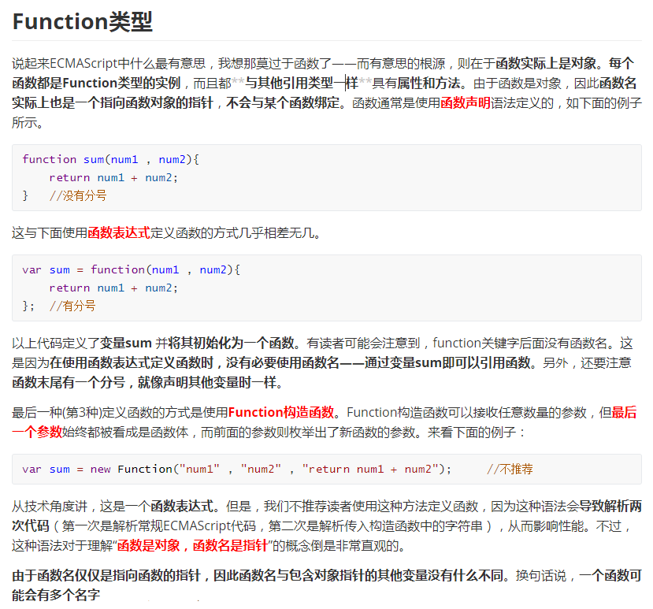

## 13.用JS写一个事件侦听器的方法

~~~javascript
/**
 * 一个简单的发布订阅者模式
 */

interface IHandler {
  fn: Function,
  type: string,
  name: string
}

export default class EventUtils {
  /**
   * 键值对 对应事件名称以及数组的值
   */
  static handler = {}

  /**
   * on 方法 添加监听事件
   */
  static on (name: string, handler: Function): EventUtils {
    const i:IHandler = {
      fn: handler,
      type: 'on',
      name: name
    }
    if (Object.keys(EventUtils.handler).includes(name)) {
      EventUtils.handler[name].push(i)
      return EventUtils
    }
    EventUtils.handler[name] = [].concat(i)
    return EventUtils
  }

  /**
   * off 方法 移除监听事件
   */
  static off (name: string, handler: Function): EventUtils {
    const event: any[] = EventUtils.handler[name]
    if (event) {
      for (let i = event.length - 1; i >= 0; i--) {
        if (event[i].fn === handler) {
          event.splice(i, 1)
        }
      }
    }
    return EventUtils
  }

  /**
   * emit 方法 触发监听的事件
   */
  static emit (name: string, ...args: any): EventUtils {
    const event = EventUtils.handler[name]
    let newEvent = []
    event && event.length && event.forEach((item: IHandler, index: number) => {
      item.fn.call(this, ...args)

      // 如果有只监听一次的事件
      if (item.type !== 'once') {
        newEvent.push(event.slice(index, index + 1))
      }
    })

    const hasOnce = event && event.length && event.some((item: IHandler) => {
      return item.type === 'once'
    })

    if (hasOnce) {
      EventUtils.handler[name] = newEvent
    }

    // 这里做一个执行完成之后的 once代码 off 的操作
    return EventUtils
  }

  /**
   * once 方法 添加事件 只会被执行一次
   */
  static once (name: string, handler: Function): void {
    EventUtils.on(name, handler)
    EventUtils.handler[name][0]['type'] = 'once'
  }
}
~~~

## 14.写一个把数字转成中文的方法，例如：101转成一百零一

~~~javascript
const digitChar = ['', ...'一二三四五六七八九']
const posChar = ['', ...'十百千万   亿']
const placeholder = '零'

function toChineseNumeralUnder万(digits) {
    let revDigits = digits.split('').reverse()
    let result = ''
    for (let pos = 0; pos < revDigits.length; pos++) {
        const digit = Number(revDigits[pos])
        if (digit)
            { result = posChar[pos] + result }
        if (digit !== 1 || pos !== 1)
            { result = digitChar[digit] + result }
        if (!digit && pos && result && !result.startsWith(placeholder))
            { result = placeholder + result }
    }
    return result
}

function toChineseNumeralUnder亿(digits) {
    let highPart = toChineseNumeralUnder万(digits.slice(-8, -4))
    if (highPart)
        { highPart += posChar[4] }
    let lowPart = toChineseNumeralUnder万(digits.slice(-4))
    return highPart + lowPart
}

function toChineseNumeral(digits) {
    let fragment = ''
    const result = []
    for (const digit of digits.split('').reverse()) {
        if (fragment.length === 8) {
            result.unshift(toChineseNumeralUnder亿(fragment))
            fragment = ''
        }
        fragment = digit + fragment
    }
    result.unshift(toChineseNumeralUnder亿(fragment))
    if (result[0].startsWith(placeholder))
        { result[0] = result[0].slice(1) }
    return result.join(posChar[8]) || placeholder
}
toChineseNumeral('0')
// => '零'
toChineseNumeral('101')
// => '一百零一'
toChineseNumeral('1000001')
// => '一百万零一'
toChineseNumeral('123456708')
// => '一亿二千三百四十五万六千七百零八'
toChineseNumeral('3274823947329471041041234567080')
// => '三百二十七万四千八百二十三亿九千四百七十三万二千九百四十七亿一千零四十一万零四百一十二亿三千四百五十六万七千零八十'
~~~

## 15.分别写出防抖和节流的两个函数，并描述它们分别有什么运用场景

[浅谈JS防抖和节流](https://segmentfault.com/a/1190000018428170)

方法1：

~~~javascript
type Timeout = number // browser
// type Timeout = NodeJS.Timeout // node

/**
 * 防抖：生成一个函数，它在被调用后会等待一段时间再执行。
 * 如果在等待期间再次调用，之前还未执行的调用会被取消。
 * @param fn 要防抖的函数
 * @param timeout 超时时间
 */
function debounce(fn: (...args: any[]) => any, timeout: number) {
    let time: Timeout = null
    return function _debounced(...args: any[]) {
        if (time !== null)
            { clearTimeout(time) }
        time = setTimeout(() => {
            fn(...args)
            time = null
        }, timeout)
    }
}

/**
 * 节流：生成一个函数，它在被调用后一段时间内再次被调用不起作用。
 * @param fn 要节流的函数
 * @param timeout 超时时间
 */
function throttle(fn: (...args: any[]) => any, timeout: number) {
    let time: Timeout = null
    return function _throttled(...args: any[]) {
        if (time === null) {
            fn(...args)
            time = setTimeout(() => time = null, timeout)
        }
    }
}
~~~

方法2：

~~~javascript
/**
* 节流
*/
let throttling = () => {
    let e = true
    return event = () => {
        if (e) {
            e = false
            setTimeout(function () { e = true, console.log(1) }, 5000)
        }
    }
}
/**
 * 防抖 
 */
let antiShake = () => {
    let e = true
    return event = () => {
        if (!e) {
            { clearTimeout(time) }
        } 
        e = false
        time = setTimeout(function () { e = true, console.log(1) }, 5000)
    }
}
~~~

> 看看楼上大佬代码，看看自己代码，啊！我真菜。

## 16.如何使用JS来截图？怎样截可见区域和整个页面

可以基于html2canvas 和 canvas2image 两个第三方类实现截图。

如果打算截取整个页面 可以直接设定

```javascript
html2canvas(document.body).then(function (canvas) {
        document.body.appendChild(canvas);
});
```

如果打算截取可见区域 额外设置一下宽高即可

```javascript
width: document.documentElement.clientWidth,
height: document.documentElement.clientHeight,
y: document.documentElement.scrollTop
```

这种东西太hack了...browser 上搞纯属自虐

nodejs 可以考虑一系列 headless 库，例如 puppeteer 和 phantomjs

> 更推荐用puppeteer，phantomjs已经停止维护了，在一些比较新的ES的语法上会出现一些问题

## 17.document.write和innerHTML有什么区别

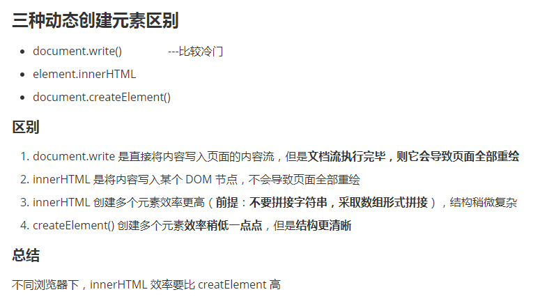

`document.write()` 将需要展示的内容添加到 HTML 文档流中。对于一个已经加载完成的页面，`document.write()` 会重新绘制整个页面。自然其性能就不是很好。

`innerHTML` 是替换某个元素中的内容，简单地认为是 `<div>` 标签中间的内容。也即只会影响到所指定的元素。

参考文章：[document.write 和 innerHTML 的区别](http://www.fly63.com/article/detial/2163)

## 18.使用正则去掉html中标签与标签之间的空格

方法1：

~~~javascript
const html = `
<div>
   <span>      我两边怎么有空格？  </span>
</div>
`
console.log(html.replace(/>\s*(\S*)\s*</g, ">$1<"));
~~~

方法2：

~~~javascript
htmlStr.replace(/>\s+</g, '><')
~~~

## 19. 写一个方法把多维数组降维

方法1：

~~~javascript
const arr = [1, 2, [3, 4, [5, 6]]]
arr.flat(Infinity)
// [1, 2, 3, 4, 5, 6]
~~~

方法2：

~~~javascript
function flattenDeep(arr) {
   return arr.reduce((acc, val) => Array.isArray(val) ? acc.concat(flattenDeep(val)) : acc.concat(val), []);
}
~~~

> 抄MDN上的，会把空项过滤。

方法3：

~~~javascript
let arr = [1, 2, {}, 3, [4, {}, 5], [6, 7, [8, null, 9]]];
//递归
function flat (arr) {
  let ret = []
  for (let i = 0; i < arr.length; i++) {
    if (arr[i] instanceof (Array)) {
      ret = ret.concat(flat(arr[i]))
    }
    else {
      ret.push(arr[i])
    }
  }
  return ret
}
console.log(flat(arr))

//ES10新增的内置方法
arr.flat(Infinity)
~~~

## 20.如何终止WebWork

[Web Worker 使用教程](http://www.ruanyifeng.com/blog/2018/07/web-worker.html)

~~~javascript
// 主线程
worker.terminate();

// Worker 线程
self.close();
~~~

## 21.请说说escape、encodeURI、decodeURI、encodeURIComponent和decodeURIComponent的区别

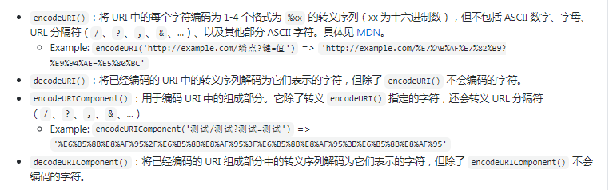

另外， `escape()` 将会把字符串中除了字母、数字以及一部分符号以外的所有转义为 `%XX` 格式的转义序列，可以通过 `unescape()` 转回。它们是已经被弃用的方法，不建议使用。

## 22.能否正确获取本地上传的文件路径？如果可以怎么做？如果不可以解释下为什么

无法获取,客户端js脚本没有文件访问权限,只能由浏览器代为操作,可以通过BOM-api获取由浏览器转义的文件路径

~~~html
<input type="file" id="file">
~~~

~~~css
  file.addEventListener('change', () => {
    var reader = new FileReader();
    reader.readAsDataURL(file.files[0]);
    reader.onload = function (e) {
      console.log(e.target.result);//也许是base64数据  也许是虚拟路径  取决于浏览器的实现
    }
  })
~~~

## 23. 分析`('b' + 'a' + +'a' + 'a').toLowerCase()`返回的结果

~~~javascript
’b‘ + =>'b'
'b' + 'a' => 'ba'
'ba' + (+'a') => 'ba' + (Number('a')) => 'baNaN'
'baNaN' + 'a' =>'baNaNa'
'baNaNa' .toLowerCase() =>'banana'
~~~

## 24.如何实现文件拖动上传

[走进HTML5-实现网站中常见的拖拽上传文件](https://juejin.im/post/6844903959031873549)

利用 HTML5 的 `drag & drop` API 来实现。需要注意的是，必须要设置 `dragover` 事件，不然不会触发 `drop` 事件。

## 25.你有用过webRTC吗？它有什么运用场景

[WebRTC API](https://developer.mozilla.org/zh-CN/docs/Web/API/WebRTC_API)

**WebRTC** (Web Real-Time Communications) 是一项实时通讯技术，它允许网络应用或者站点，在不借助中间媒介的情况下，建立浏览器之间点对点（Peer-to-Peer）的连接，实现视频流和（或）音频流或者其他任意数据的传输。WebRTC包含的这些标准使用户在无需安装任何插件或者第三方的软件的情况下，创建点对点（Peer-to-Peer）的数据分享和电话会议成为可能。

WebRTC代表“Web实时通信”。这基本上允许在浏览器中进行语音、视频聊天和P2P共享（实时通信）
实际应用的要求来源[可以用WebRTC来做视频直播吗？](https://www.zhihu.com/question/25497090/answer/43395462)

用WebRTC来做**视频直播**
一个实现了WebRTC相关协议的客户端。比如Chrome浏览器
架设一个类似MCU系统的服务器

* 第一步，直播的客户端，比如Chrome浏览器，通过WebRTC相关的媒体API获取图像及声音信源，再用WebRTC中的通信API将图像和声音数据发送到MCU服务器。
* 第二步，MCU服务器根据需求对图像和声音数据进行必要的处理，比如压缩、混音等。
* 第三步，需要看直播的用户，通过他们的Chrome浏览器，链接上MCU服务器，并收取服务器转发来的图像和声音流。
  入门https://zhuanlan.zhihu.com/p/59520779

## 26.保护JS代码的方式有哪些？分别说说他们的原理是什么

**压缩：**通过替换变量名等对代码进行压缩，但是不会改变代码结构。主要目的是压缩体积。

**混淆：**降低代码的可读性，可以通过增加无用代码，删除注释缩进，对代码进行转义。

**加密：**使用加密插件对代码进行可逆的加密操作，后续可通过使用密钥对密文进行解密。

**编译成字节码:**火狐spidermoney 和谷歌v8 可以将JS文件编译成字节码，二进制文件，根本看不懂，不过一般用来做软件的JS绑定和app游戏。

## 27.JavaScript有几种类型值？能否画出它们的内存图

* 基本类型：Number Boolean Null Undefined String Symbol BigInt
* 引用类型：Object

你们从哪里 copy 的 JS 原始数据类型存放在栈上的？好奇去搜索了一下，发现果然各种 CSDN 博客乱说一气。

如果 JS 基本类型都保存在栈上，那怎么解释调用栈弹出后，局部变量仍然可以被闭包访问？还有说 JS string 也是在栈内存的，又说栈上的变量都是固定分配大小的，are you sure? 从 HTTP response 获得的一段字符串会在栈上？从 Blob / ArrayBuffer 里读到的字符串怎么固定分配大小？

你讲值类型和引用类型可以，但是不要讲堆内存和栈内存。很反感把堆内存和栈内存的概念引入 JS 中，因为这些概念在 JS 中根本不适用。C/C++有这种概念，因为他们直接在操作系统中运行，操作系统给程序分配内存的时候确实是分栈内存还是堆内存的，他们标准就有 sizeof 这种求变量大小的操作符，有分配 / 释放内存的 API。Java 语言虽然也有 GC ，但也分这两种内存，但这个时候，对于 Java 程序本身来说内存是 JVM 来管理的，所谓的栈内存堆内存是 JVM 定义下的，并不是操作系统管理下的概念。

回头说 JS 的情况，ES 标准从来没有提到 JS 中哪些数据类型要以栈内存的形式存储，哪些是堆内存存储。ES6 标准里提到的是执行上下文（execution context）、词法环境（Lexical Environment）、变量环境（Variable Environment）、环境记录（Environment Records）。环境记录就是那个用来保存标识符和变量值的映射。那请问这个变量值是堆内存还是栈内存呢？你说 string 是基本类型所以是分配在栈上的，你去了解一下 V8 对 string 的优化，你的内存图恐怕没那么简单能画对。原始数据类型还包括一个 Symbol 吧，那请问一个 symbol 变量在栈上的内存是怎样的？占几个字节？

总结：你根本不需要去探究 JS 中的变量是保存在堆里还是栈里，非要说那就是全部都是在堆里。

## 28.说说你对JS包装对象的理解

包装对象是用来处理基础类型数据的对象，使得字符串、布尔值等变量可以直接调用方法，在对字符串、布尔值进行方法调用的时候，js引擎会自动创建一个包装对象，将操作的值作为原始值，这一过程是隐式的。但是数字类型除外，想要调用数字对象的方法必须显示创建一个Number对象，否则报类型错误。 例如 "a".slice(0) 可以，但是 10.toString(2) 不可以，应该写成`new Number(10).toString(2)`

10.toString(2)报的是`Uncaught SyntaxError: Invalid or unexpected token`，这是词法分析出错而不是类型错误。错误原因在于js编译器将`.`视为小数点而非点运算符，由于小数点后出现了非数字字符故而被视为无效的token。

更深层的原因在于js中只存在`IEEE 754`规范的双精度数字，并没有整数这一类型，出现在数字之后的第一个`.`会被看作是小数点。

**Workaround**

1. `10..toString(2)`
2. `10 .toString(2)`
3. `(10).toString(2) `  // recommended

## 29.举例说明JS关闭当前窗口有哪些方法

目前想到的是 `window.close()` 其他的方法需要查一下资料。似乎没有其他方法了……

> This method can only be called on windows that were opened by a script using the Window.open() method. If the window was not opened by a script, an error similar to this one appears in the console: Scripts may not close windows that were not opened by script.

引用 MDN 的解释，`window.close` 只能关闭由 `window.open` 方法打开的页面。网上说在 FireFox 下直接使用 `window.close` 可能会有问题。最好先执行一下 `window.open('', '_self')` 后再执行 `window.close`

另外直接指向一个空白页并且让后退失效也是一种代替方案

## 30.如何实现一个全屏的功能

Chrome下：

```javascript
// 针对某一元素进行全屏，其他元素都被屏蔽。有点类似聚焦的效果。
document.querySelector(".js-issue-title").requestFullscreen();
// 全屏聚焦document元素
document.documentElement.requestFullscreen();
```

生产环境：
不同浏览器的实现方案不同，没有形成统一的标准。可以交由专门的类库———— [screenFull](https://github.com/sindresorhus/screenfull.js)实现。

~~~html
<!DOCTYPE html>
<html lang="en">
<head>
    <meta charset="UTF-8">
    <meta name="viewport" content="width= , initial-scale=1.0">
    <meta http-equiv="X-UA-Compatible" content="ie=edge">
    <title>Document</title>
</head>
<body>
    <div>
        
        <input type="button" id="full" value="全屏">
        <input type="button" id="cancelFull" value="退出全屏">
        <input type="button" id="isFull" value="是否全屏">
    </div>
    <script>
        // 全屏操作的主要方法和属性
        // 1.requestFullScreen():开启全屏显示
        // 不同浏览器需要添加不同的前缀
        // chrome:webkit | firefox:moz | ie:ms | opera:o
        // 2.cancelFullScreen():退出全屏状态，退出全屏只能使用document来实现
        // 3.fullScreenElement:是否全屏状态，只能使用document来判断
        //因为不是某一个元素退出全屏显示，而是整个文档退出全屏显示，所以用document
        window.onload = function(){
            var div = document.querySelector("div");
            // 添加三个按钮的点击事件
            // 全屏操作
            document.querySelector("#full").onclick = function(){
                // div.requestFullscreen();
                // div.webkitRequestFullScreen();
                // div.mozRequestFullScreen();
                // 使用能力测试添加不同浏览器下的前缀
                if(div.requestFullScreen){
                    div.requestFullScreen();
                }else if(div.webkitRequestFullScreen){
                    div.webkitRequestFullScreen();
                } else if(div.msRequestFullScreen){
                    div.msRequestFullScreen();
                }
            };
            
            // 退出全屏
            document.querySelector("#cancelFull").onclick = function () { 
                if(document.cancelFullScreen){
                    document.cancelFullScreen();
                }else if(document.webkitCancelFullscreen){
                    document.webkitCancelFullScreen();
                } else if(document.msCancelFullScreen){
                    document.msCancelFullScreen();
                }
            }

            // 判断是否是全屏状态
            document.querySelector("#isFull").onclick = function () { 
                // 使用document来判断，能力测试
                if(document.fullscreenElement || document.webkitFullscreenElement ||
                 document.mozFullScreenElement || document.msFullscreenElement){
                    alert(true);
                }else{
                    alert(false);
                }
            }
        };
    </script>
</body>
</html>
~~~

## 31.JSON.stringify有什么局限性和哪些技巧

[JSON.stringify()](https://developer.mozilla.org/zh-CN/docs/Web/JavaScript/Reference/Global_Objects/JSON/stringify)

`JSON.stringify(value[, replacer[, space]])`;

* replacer:可选。用于转换结果的函数或数组。

  如果 replacer 为函数，则 JSON.stringify 将调用该函数，并传入每个成员的键和值。使用返回值而不是原始值。如果此函数返回 undefined，则排除成员。根对象的键是一个空字符串：""。

  如果 replacer 是一个数组，则仅转换该数组中具有键值的成员。成员的转换顺序与键在数组中的顺序一样。当 value 参数也为数组时，将忽略 replacer 数组。

* space:可选，文本添加缩进、空格和换行符，如果 space 是一个数字，则返回值文本在每个级别缩进指定数目的空格，如果 space 大于 10，则文本缩进 10 个空格。space 也可以使用非数字，如：\t

**局限性**：会忽略`undefined`，`function`，`Symbol`，不能正确处理`NaN`，`Infinity`，循环引用。

**技巧**：可以和`JSON.parse`实现深度拷贝

## 32.原生的字符串操作方法有哪些？请列举并描述其功能

[字符串](https://developer.mozilla.org/zh-CN/docs/Web/JavaScript/Reference/Global_Objects/String/prototype)
一般这种就是看官方最简单了。

`charAt`、`charCodeAt`、`codePointAt`、`concat`、`includes`、`endsWith`、`indexOf`、`lastIndexOf`、`localeCompare`、`match`、`normalize`、`padEnd`、`padStart`、`repeat`、`replace`、`search`、`slice`、`split`、`startsWith`、`substr`、`substring`、`toLocaleLowerCase`、`toLocaleUpperCase`、`toLowerCase`、`toUpperCase`、`trim`

## 33.写一个方法，将字符串中的单词倒转后输出，如：my love -> ym evol

方法1：

~~~javascript
(text)=>{ let arr= [...text]; return arr.reverse().join(''); }
~~~

方法2：

~~~javascript
let b = "my love"
function fn(b){
	return b.split(" ").map(val => val.split("").reverse().join("")).join(" ")
}
console.log(fn(b)) //ym evol
~~~

## 34.请写出如下代码运行的结果并解释为什么？

代码如下：

~~~javascript
var type = 'images';
var size = {width: 800, height: 600};
var format = ['jpg', 'png'];

function change(type, size, format){
    type = 'video';
    size = {width: 1024, height: 768};
    format.push('map');
}

change(type, size, format);
console.log(type, size, format);
~~~

答案1：

~~~javascript
type = 'images';
size = {width: 800, height: 600};
format = ['jpg', 'png', 'map'];
~~~

format : push会改变原数组;
type, size : 函数内部（函数声明是一个独立的代码块）改变的只是函数的参数值，不会影响到外部声明的变量。

答案2：

这题与函数参数定义、传值、引用类型、作用域有关。

~~~javascript
var type = 'images'; // 基础类型
var size = {width: 800, height: 600}; // 引用类型
var format = ['jpg', 'png']; // 引用类型

// js 以函数作为作用域，定义在函数内部的变量与外部的变量相互不影响
function change(type, size, format){
// 函数接受了三个参数，在函数生成上下文的时候，会先进行变量的声明和提升
// 尽管与全局变量名称相同，但是是互不影响的

	// var type = type;
	// var size = size;
	// var format = format;

	// 对变量进行赋值
	// 由于作用域的关系，会先找到定义在 change 中的 type，而非全局的 type
	// 如果在 change 中没有定义过 type 即没有作为参数的话，则这么赋值会影响全局的 type
	type = 'video';

	// 同样对 change 内的 size 进行赋值，这里赋的是 size 的引用地址，实际与全局的 size 指向同一个对象
	// 所以如果进行了 size.dpi = 666 类似的操作，就会影响到全局的 size
	size = {width: 1024, height: 768};

	// format 是引用类型，因此指向的内存引用与全局的相同
	// 所以 push 方法会对全局的 format 产生影响
	format.push('map');
}

change(type, size, format);

console.log(type, size, format);

// 'images', {width:800, height:600}, ['jpg', 'png', 'map']
~~~

## 35.请解释下`NaN === NaN`的结果

```javascript
NaN === NaN
// false
```

NaN不等于任何数包括他自己。

由于NaN 是not a number的缩写，其实不是指一个值，所有不属于数字的数据都可以归类于NaN。因此NaN不能等于自身。

```javascript
Number('A')//NaN
Number('B')//NaN
```

表示是否属于number类型的一种**状态**: 是或否，而不是一个确切的值。

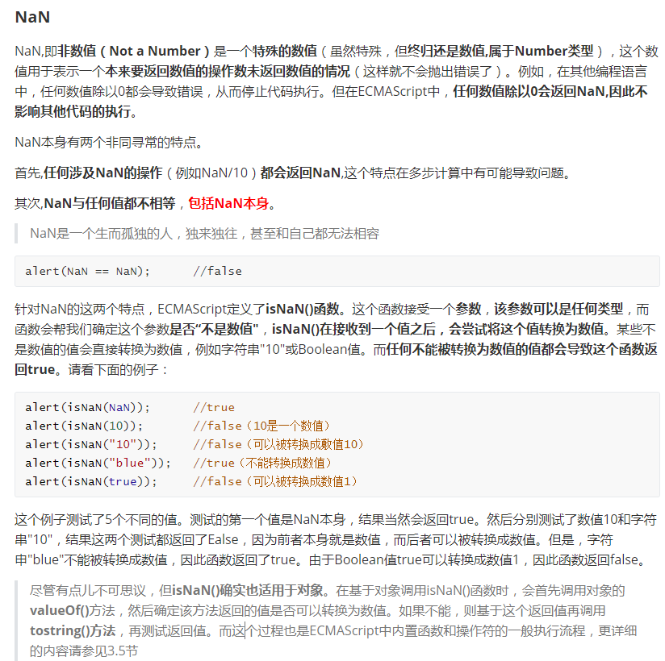

## 36.用JS实现小写金额转大写的方法(重复)

~~~javascript
function digitUppercase(price) {
  const fraction = ['角', '分'];
  const digit = ['零', '壹', '贰', '叁', '肆', '伍', '陆', '柒', '捌', '玖'];
  const unit = [
    ['元', '万', '亿'],
    ['', '拾', '佰', '仟'],
  ];
  let num = Math.abs(price);
  let s = '';
  fraction.forEach((item, index) => {
    s += (digit[Math.floor(num * 10 * (10 ** index)) % 10] + item).replace(/零./, '');
  });
  s = s || '整';
  num = Math.floor(num);
  for (let i = 0; i < unit[0].length && num > 0; i += 1) {
    let p = '';
    for (let j = 0; j < unit[1].length && num > 0; j += 1) {
      p = digit[num % 10] + unit[1][j] + p;
      num = Math.floor(num / 10);
    }
    s = p.replace(/(零.)*零$/, '').replace(/^$/, '零') + unit[0][i] + s;
  }

  return s.replace(/(零.)*零元/, '元').replace(/(零.)+/g, '零').replace(/^整$/, '零
~~~

## 37.用js实现页面局部打印和预览原理是什么呢？同时在IE上有什么不同

~~~css
<h1>这块内容不需要打印1</h1>
<!--startprint-->
<div class="content">
    这里是需要打印的内容
    .....
</div>
<!--endprint-->
<h1>这块内容不需要打印2</h1>
<button onclick="doPrint()">打印按钮</button>
~~~

~~~javascript
function doPrint() {
    bdhtml = window.document.body.innerHTML;
    sprnstr = "<!--startprint-->";
    eprnstr = "<!--endprint-->";
    prnhtml = bdhtml.substr(bdhtml.indexOf(sprnstr) + 17);
    prnhtml = prnhtml.substring(0, prnhtml.indexOf(eprnstr));
    window.document.body.innerHTML = prnhtml;
    window.print();
}
~~~

## 38.请描述下AJAX的请求都有哪些步骤

* 创建 XMLHttpRequest 对象, 也就是创建一个异步调用对象

* 设置响应 HTTP 请求状态变化的函数

* 打开新的一个 HTTP 请求, 并指定该 HTTP 请求的方法、URL 及验证信息.

* 发送 HTTP 请求

* 在响应回调函数中, 根据改变状态和请求状态码, 获取异步请求返回的数据.

* 渲染返回的数据

使用AJAX的过程可以类比平常我们访问网页过程。

~~~javascript
//1，创建一个XMLHttpRequest类型的对象——相当于打开了一个浏览器
//xhr是请求代理对象，就是帮我们发请求的对象
var xhr = new XMLHttpRequest();
//2，打开与一个网址之间的连接——相当于在地址栏输入访问地址
//调用open()方法并不会真正发送请求，而只是启动一个请求以备发送。
xhr.open('GET'，'./time.php');
//3，通过连接发送一次请求——相当于回车或者点击访问发送请求
xhr.send(null);
//4，指定xhr状态变化事件处理函数——相当于处理网页呈现后的操作
xhr.onreadystatechange=function(){
//通过xhr的readystate判断此次请求的响应是否接收完成
  if（this.readyState === 4）{
//通过xhr的responseText获取到响应的响应体
    console.1og(this);
}
~~~

## 39.说下你对柯里化函数(currying)的理解，它有什么运用场景

柯里化指的是将一个接受多个参数的函数转为一次只接受一个参数的函数，将已接受的参数保存起来，返回接受剩余参数的新函数，当传入参数个数之和等于被柯里化的原函数的参数个数，返回计算结果。

这样可以使得函数变成只接受一个参数，返回一个值的状态，降低了编程复杂性。

~~~javascript
function curry (fn) {
  const ctx = this;
  function inner (...args) {
    if (args.length === fn.length) 
    {
        return fn.call(ctx, ...args);
    }
    return (...innerArgs) => inner.call(ctx, ...args, ...innerArgs);
  }
  return inner;
}
~~~

> 不是降低复杂性哦. 最早Curry是为了解决多参数函数在lamda演算里面表达问题。现在JS里面使用主要是为了函数复用.

## 40.说说用原生JS实现封装一个选项卡的功能

[使用原生js实现选项卡功能实例教程](https://www.hellojava.com/a/89339.html)

### Tab栏切换(重点)

这是一个重点案例，是前端人员的必备技能！！你必须要把这个案例给写会！！！！

> 案例分析
>
> ①Tab栏切换有2个大的模块
>
> ②上的模块选项卡，点击某一个，当前这一个底色会是红色，其余不变（排他思想） 修改类名的方式
>
> ③下面的模块内容，会跟随上面的选项卡变化。所以下面模块变化写到点击事件里面。
>
> ④规律：下面的模块**显示内容**和上面的**选项卡**一一对应，相匹配。
>
> ⑤核心思路： 给上面的tab_list 里面的所有小li 添加**自定义属性**，属性值从0开始编号。
>
> （这个案例里面用到了自定义属性！！！！！！！！！！！！！！）
>
> ⑥ 当我们点击tab_list 里面的某个小li，让tab_con 里面对应序号的 内容显示，其余隐藏（排他思想）

~~~html
<script>
       var tab_list = document.querySelector('.tab_list');
       var lis = tab_list.querySelectorAll('li');

       for(var i = 0; i < lis.length; i++){
            lis[i].onclick = function(){
                for(var j = 0; j < lis.length; j++){
                    lis[j].className = '';
                }
                this.className = 'current';
            }
       }
    </script>
~~~

> 这个是做上面的模块所用的样式代码

~~~html
<!DOCTYPE html>
<html lang="en">

<head>
    <meta charset="UTF-8">
    <title>Document</title>
    <style>
        * {
            margin: 0;
            padding: 0;
        }
        
        li {
            list-style-type: none;
        }
        
        .tab {
            /*这个是最大的盒子*/
            width: 978px;
            margin: 100px auto;
        }
        
        /*大盒子里的上盒子*/
        .tab_list {
            /*没给宽，默认和父亲一样宽*/
            height: 39px;
            border: 1px solid #ccc;
            background-color: #f1f1f1;
        }
        
        .tab_list li {
            float: left;
            height: 39px;
            line-height: 39px;
            padding: 0 20px;
            text-align: center;
            cursor: pointer;
        }
        
        .tab_list .current {
            background-color: #c81623;
            color: #fff;
        }

        .item {
            /*也不保留位置*/
            display: none;
        }
    </style>
</head>

<body>
  	<!--大盒子叫tab,里面有上下2个盒子，一个叫tab_list，一个叫tab_con-->
  	<!--tab_list里面有5个li-->
    <!--tab_con里面有5个div-->
  	<!--5个li和5个div是一一对应的关系-->
    <div class="tab">
        <div class="tab_list">
            <ul>
                <li class="current">商品介绍</li>
                <li>规格与包装</li>
                <li>售后保障</li>
                <li>商品评价（50000）</li>
                <li>手机社区</li>
            </ul>
        </div>
        
        <div class="tab_con">
            <!-- block除了有转为块级元素以外，还有显示的意思 -->
            <!-- 行内元素层级高，把上面的display:none给覆盖了 -->
            <div class="item" style="display: block;">
                商品介绍模块内容
            </div>
            <div class="item">
                规格与包装模块内容
            </div>
            <div class="item">
                售后保障模块内容
            </div>
            <div class="item">
                商品评价（50000）模块内容
            </div>
            <div class="item">
                手机社区模块内容
            </div>
        </div>
        
    </div>
    <script>
        //1. 上的模块选项卡:点击某一个,当前这一个底色会是红色,其余不变(排他思想) 修改类名的方式
        // 获取元素
        var tab_list = document.querySelector('.tab_list');
        /*5个li对应的是5个item*/
        var lis = tab_list.querySelectorAll('li');
        var items = document.querySelectorAll('.item');
       
      	//里面有5个小li,必定要用循环
        //for循环绑定点击事件
        for(var i = 0; i < lis.length; i++){
            //开始给5个小li设置一个自定义属性：索引号index
            lis[i].setAttribute('index',i)
          	//所有的孩子都要有onclick绑定事件
            lis[i].onclick = function(){
                //排他思想：干掉所有人，其余的li清除class这个类
                for(var i = 0; i < lis.length; i++){
                    lis[i].className = '';
                }
                //留下我自己
                this.className = 'current';
                
                //2.下面的显示内容模块
              	//得到当前的属性的值
                var index = this.getAttribute('index');
                // console.log(index);
                //再用一次排他思想：干掉所有人，让其余的item 这些div隐藏
                for(var j = 0; j < items.length; j++){
                    items[j].style.display = 'none';
                }
                //留下我自己 让对应的item显示出来
                items[index].style.display = 'block';
            }
        }
    </script>
</body>

</html>
~~~

> 这个是2个模块都完成的最终代码。(这个我独立写我也写不出来)

## 41.写一个洗扑克牌的方法 

~~~javascript
let Shuffle = () =>  
    [...'A23456789JQK',10]
    .reduce( (arr, e) => arr.concat([`♥${e}`,`♠${e}`,`♣${e}`,`♦${e}`]), ['带🃏','小🃏'])
    .sort( () => Math.floor(Math.random()*2-Math.random()*2))
~~~

## 42.请描述下函数的执行过程

函数创建的时候会保存父级变量对象到自己的scope属性下，函数执行不代表立即执行

函数会创建一个执行上下文，执行上下文的作用是:

* 确定this指向
*  创建词法变量
*  创建变量环境组件 -- 全局变量

大致过程如下:

1. 函数执行，创建一个执行上下文，将函数压入调用栈，确定this指向，复制[[scope]]属性创建作用域链
2. 利用arguments一个活动对象，里面具有形参定义，函数声明，变量声明
3. 将活动对象添加到作用域链的最顶端，作用域链此时由当前函数作用域以及父级作用域组成
4. 执行函数，若函数在当前作用域下找不到变量，则会沿着作用域链网往上找
5. 执行完后函数后，会将函数弹出调用栈

## 43.自己实现数组的 `forEach`、`map`、`filter`、`every`、`some` 、`find`方法

[实现 map, reduce, filter, find 方法](http://objcer.com/2017/03/11/implement-the-array-map-reduce-filter-find-method/)

[js数组中filter、map、reduce、find等方法实现的原理](https://juejin.im/post/6844903797496479758)

### forEach()方法的实现

> forEach()：无返回值，单纯的遍历数组。

```javascript
Array.prototype.myForEach = function(cb){ // 在Array对象的原型上添加 myForEach()方法， 接受一个回调函数
	for(let i=0; i<this.length; i++){ // this指的是当前实例化的数组对象
		let item = this[i]; // 定义回调函数接受的三个参数
		let index = i;
		let array = this;
		cb(item,index,array) // 调用
	}
}
```

### map()方法的实现

> map()：有返回值，无论返回什么都添加到新数组中。

```javascript
Array.prototype.myMap = function(cb) {
	let newArr = []; // 定义一个新的数组，用来接受返回值
	for (let i = 0; i < this.length; i++) {
		let item = this[i];
		let index = i;
		let array = this;
		let result = cb(item, index, array);
		newArr.push(result) // 将回到函数的结果push到新的数组中
	}
	return newArr // 返回这个新的数组
}
```

### filter()方法的实现

> filter(): 有返回值，将返回结果为true的每一项push到一个新的数组中。

```javascript
Array.prototype.myFilter = function(cb) {  // 实现方法和map()方法差不多
	let newArr = [];
	for (var i = 0; i < this.length; i++) {
		let item = this[i];
		let index = i;
		let array = this;
		let result = cb(item, index, array); 
		if (result) { // 判断回调函数的结果否为true，为true则将 该项的item push到新的数组中
			newArr.push(item);
		}
	}
	return newArr; // 返回新的数组
}
```

### every()方法的实现

> every(): 有返回值，如果数组中的每一项都通过了测试，则返回true;反之返回false.

```javascript
Array.prototype.myEvery = function(cb){
	for (var i = 0; i < this.length; i++) {
		let item = this[i];
		let index = i;
		let array = this;
		let result = cb(item, index, array);
		if (!result) { // 当返回false时，怎停止遍历，返回false。
			return false; 
		}
	}
	return true;
}
```

### some()方法的实现

```javascript
Array.prototype.mySome = function() {
	for (var i = 0; i < this.length; i++) {
		let item = this[i];
		let index = i;
		let array = this;
		let result = cb(item, index, array);
		if (result) {
			return true; // 有一个通过了测试 则终止遍历，返回true
		}
	}
	return false; // 一个都没有通过测试，返回false
}
```

### find()方法的实现

~~~javascript
Array.prototype.newFind = function(fn, context) {
    let str;
    if(typeof fn !== "function") {
        throw new TypeError(fn + "is not a function");
    }
    var context = arguments[1];
    for (var i = 0; i < this.length; i++) {
        if(fn.call(context, this[i], i, this)) {
            str = this[i];
            break; 
        }
    }
    return str
}
~~~

## 44.什么是词法分析？请描述下JS词法分析的过程

词法分析指的是JS引擎在执行前的编译过程之一。
词法分析和分词其实都是对JS代码分割的一个过程。
词法分析大概分为三步骤，分析参数，分析变量声明，分析函数声明。

* 首先如果存在函数，分析函数的参数分别是什么。

* 其次分析每一个变量声明，如果是全局变量，进行变量提升。

* 再次分析函数声明，再次进行变量提升

## 45.原生Math的方法有哪些？请列举并描述其功能

```javascript
Math.abs(num) 						// num绝对值
Math.ceil(num) 						// num向上取整
Math.floor(num) 					// num向下取整
Math.max(num1, num2 ...) 	// 取较大值
Math.min(num1, num2 ...) 	// 取较小值
Math.pow(num1, num2) 			// num1的num2次幂
Math.random() 						// 0-1间伪随机数
Math.sqrt(num) 						// num的平方根
```

## 46.请举例说明动态操作DOM的方法有哪些

创建一个元素`createElement()`

向元素末尾添加一个子节点`appendChild()`

将新的元素插入到指定元素的前面`insertBefore(new,old);`

删除一个子节点
`removeChild() `     //接收一个节点类型的；参数是要删除的这个元素；

替换子节点`replaceChild(new,old); `    //用新的元素替换原有的元素,

克隆元素`cloneChild()`
​					//接收一个布尔类型的参数 true,false
//如果不传参数，默认是false；

```javascript
console.log(box.cloneNode(true)); //浅克隆
a.appendChild(box.cloneNode(true))//深克隆
```

## 47.阻止事件的默认行为有哪些？说说它们之间的区别是什么

[JS阻止冒泡和取消默认事件(默认行为)](http://caibaojian.com/javascript-stoppropagation-preventdefault.html)

JS冒泡和捕获是事件的两种行为，使用`event.stopPropagation()`起到阻止捕获和冒泡阶段中当前事件的进一步传播。(IE的做法是`e.cancelBubble = true`)使用`event.preventDefault()`可以取消默认事件。

## 48.请使用原生的JS实现斐波那契数列

~~~javascript
function Fibonacci (n) {
  let arr = [1, 1]
  for (let i = 2; i < n + 1; i++) {
    arr[i] = arr[i - 1] + arr[i - 2]
  }
  return arr
 //return arr[n]
}
~~~

## 49.使用JS实现摩斯密码的加密和解密

~~~javascript
var utils = utils || {};

utils.isArray = function(value) {
    return Object.prototype.toString.apply(value) === '[object Array]';
}

utils.trim = function(value) {
    return value.trim ? value.trim() : value.replace(/^\s+|\s+$|/g,'');
}

// 解决IE不兼容console问题
var console = console || {};
console.log = console.log || function(){};
console.error = console.error || function(){};

// 使用字典存储摩斯码对照关系
function Dictionary() {
    this.datasource = {};
    this.rdatasource = {};
}

Dictionary.prototype.add = function(keys, values) {
    if(typeof keys === 'undefined' || typeof values === 'undefined') {
        console.error('Illegal arguments');
        return ;
    }
    if(utils.isArray(keys) && utils.isArray(values)) {
        if(keys.length != values.length) {
            console.error('keys length not equals values length');
            return ;
        }
        for(var i = 0; i < keys.length; i++) {
            this.datasource[keys[i]] = values[i];
        }
        return ;
    }
    this.datasource[keys] = values;
}

Dictionary.prototype.reversal = function(){
    var tempData = this.datasource;
    for(var i in tempData) {
        if(tempData.hasOwnProperty(i)) {
            this.rdatasource[tempData[i]] = i;
        }
    }
}

Dictionary.prototype.showAll = function(values) {
    var count = 0;
    console.log('-----------morse code mapping-----------');
    for(var i in values) {
        if(values.hasOwnProperty(i)) {
            count++;
            console.log(i + '\t > ' + values[i]);
        }
    }
    console.log('total count: ' + count);
}

// morse code library
var morse = (function(global){
    var mcode = {},
        r_special = /\<\w+\>/g,
        r_find = /^\<(\w+)\>$/;

    // store datas mapping
    mcode.mdatas = (function(){
        var dictionaryDS = new Dictionary();
        // initial mappping
        dictionaryDS.add(
            [
                'A','B','C','D','E','F','G','H','I','J','K','L','M','N','O','P','Q','R','S','T','U','V','W','X','Y','Z',
                '1','2','3','4','5','6','7','8','9','0',
                'AA','AR','AS','BK','BT','CT','SK','SOS',
                '.',':',',',';','?','=',"'",'/','!','-','_','"','(',')','$','&','@','+'
            ],
            [
                // letter
                '.-','-...','-.-.','-..','.','..-.','--.','....','..','.---','-.-','.-..','--','-.','---','.--.','--.-','.-.','...','-','..-','...-','.--','-..-','-.--','--..',
                // number 
                '.----','..---','...--','....-','.....','-....','--...','---..','----.','-----',
                // special charactor
                '.-.-','.-.-.','.-...','-...-.-','-...-','-.-.-','...-.-','...---...',
                // punctuation
                '.-.-.-','---...','--..--','-.-.-.','..--..','-...-','.----.','-..-.','-.-.--','-....-','..--.-','.-..-.','-.--.','-.--.-','...-..-','.-...','.--.-.','.-.-.'
            ]
        );
        return dictionaryDS;
    }());
    
    // error flag
    mcode.error_flag = false;

    // 将字符串转换为摩斯码
    mcode.parse = function(values) {
        // console.log('input: ' + values);
        this.error_flag = false;

        var _datasource = this.mdatas.datasource,
            item = '',
            a_special = [],
            a_temp = [],
            a_value = [],
            count = 0,
            result = '';
        values = values.toUpperCase();
        a_special = values.match(r_special);
        a_temp = values.split(r_special);

        // 将用户输入的字符串转换成数组
        for(var i=0; i<a_temp.length; i++) {
            item = a_temp[i];
            if(item !== '') {
                // IE无法通过下标来索引字符串
                if(!item[0]){
                    item = item.split('');
                }
                for(var j=0; j<item.length; j++) {
                    a_value[count++] = item[j];
                }
            }

            // 当前字符串为<AS>形式，提取AS字符
            if(i !== a_temp.length - 1){
                a_value[count++] = a_special[i].match(r_find)[1];
            }
        }

        // 将解析数组形式的用户输入值
        for(var i=0; i<a_value.length; i++) {
            item = a_value[i];

            if(item === ' ') {
                result += '/ ';
            } else if(typeof _datasource[item] === 'undefined') {
                this.error_flag = true;
                // console.error('Invalid characters in input.')
                result += '? ';
            }else {
                result += _datasource[item] + ' ';
            }
        }
        return utils.trim(result);
    }

    //将摩斯码转换成字符串
    mcode.decode = function(values) {
        // console.log('input: ' + values);
        this.error_flag = false;

        this.mdatas.reversal();
        var _rdatasource = this.mdatas.rdatasource,
            a_input = values.split(' '),
            result = '',
            item = '',
            c_result = '';

        for(var i=0; i<a_input.length; i++) {
            item = a_input[i];
            if(item === '/') {
                result += ' ';
            }else {
                c_result = _rdatasource[item];
                if(typeof c_result === 'undefined') {
                    this.error_flag = true;
                    // console.error('Invalid characters in input.')
                    result += '?';
                } else {
                    if(c_result.length > 1){
                        result += '<' + c_result + '>';
                    } else {
                        result += c_result;
                    }
                }
            }
        }
        return result;
    }

    return mcode;
}(this));
~~~

## 50.为什么说JS是单线程，而不是多线程呢

[JavaScript 运行机制详解：再谈Event Loop](http://www.ruanyifeng.com/blog/2014/10/event-loop.html)

JavaScript语言的一大特点就是单线程，也就是说，同一个时间只能做一件事。那么，为什么JavaScript不能有多个线程呢？这样能提高效率啊。

JavaScript的单线程，与它的用途有关。作为浏览器脚本语言，JavaScript的主要用途是与用户互动，以及操作DOM。这决定了它只能是单线程，否则会带来很复杂的同步问题。比如，假定JavaScript同时有两个线程，一个线程在某个DOM节点上添加内容，另一个线程删除了这个节点，这时浏览器应该以哪个线程为准？

所以，为了避免复杂性，从一诞生，JavaScript就是单线程，这已经成了这门语言的核心特征，将来也不会改变。

为了利用多核CPU的计算能力，HTML5提出Web Worker标准，允许JavaScript脚本创建多个线程，但是子线程完全受主线程控制，且不得操作DOM。所以，这个新标准并没有改变JavaScript单线程的本质。

参考文章：[为什么 javascript 是单线程？](https://blog.csdn.net/baidu_24024601/article/details/51861792)

> JS是单线程这句话有歧义。如果深入了解一下，其实nodejs不是单线程的，只不过我们能操作的只有一个线程而已。

# 软技能

## 1.你有自己买过服务器和域名用来搭建博客或者网站吗

现在的国内的云服务器都有点贵；我的hexo博客直接使用的是`coding`的托管服务，也买过腾讯的云服务器搭建wordpress；

## 2.进程与线程有什么区别？JS的单线程带来哪些好处

一个程序必定包含>=1个进程，
一个进程必定包含>=1个线程，
进程之间不共享内存，每多一个进程就要多分配一定的内存。
多个线程共享内存，因此多线程可以提高程序的并发性。

JS单线程带来的好处：

JS主要是面向浏览器的，因此是和用户实时交互的，如果多线程执行的话，你无法确定同时开始的任务哪个会先结束，以网页加载为例，可能导致网页HTML结构已经加载好，但是CSS样式还未加载完成，导致用户浏览体验差。或者两个线程同时对一个DOM结点进行修改和删除操作，则无法判断以哪个线程为准。

## 3.请列举出多种减少页面加载时间的方法

* 缓存利用： 缓存 Ajax，使用 CDN、外部 JavaScript 和 css 文件缓存，添加 Expires 头，在服务器端配置 Etag，减少 DNS 查找等。
* 请求数量．合并样式和脚本，使用 css 图片精灵，初始首屏之外的图片资源按需加载，静态资源延迟加载。
* 请求带宽：压缩文件，开启 GZIP 。
* CSS 代码：避免使用 CSS表达式、高级选择器、通配选择器 。
* JavaScript 代码：用散列表来优化查找，少用全局变量，用 innerHTML 代替 DOM 操作，减少 DOM 操作次数，优化 JavaScript 性能，用 setTimeout 避免页面失去响应，缓 存 DOM 节点查找的结果，避免使用 with (with 会创建自己的作用域， 增加作用域链的 长度），多个变量声明合并。
* HTML 代码：避免图片和 iFrame 等 src 属性为空 。 src 属性为空，会重新加载当前页面 ， 影响速度和效率 ，尽量避免在 HTML 标签中写 Style 属性。

## 4.描述下什么是域名解析？简述它的基本过程

域名解析一般是发生在用户在浏览器输入一个网址，然后浏览器会调用DNS域名解析对该网址进行解析，得到真实IP并发送访问请求。

具体的解析过程，一般首先是在当前主机对应的域名服务器的数据库中查找是否存在该域名，若不存在，依次向上级域名服务器进行查找，直到根域名服务器或者查找到域名对应的IP。

然后服务器将获取到的真实IP返回给主机。

## 5. 域名解析它有哪几种方式

域名的解析也分很多种，以下列出的是我用的比较多的几种类型。

### A类型

`A`类型可以将主机记录（二级域名）指向一个`ipv4`类型的`ip`地址；但是需要注意的是，该类型**不能在`ip`地址后加上端口**；比如：

```
主机记录：xx.test.com
记录值：aa.bb.cc.dd
```

上述记录的意思就是访问`xx.test.com`的时候实际上是访问`ip`地址为`aa.bb.cc.dd`的主机；但是如果在`ip`地址后加上端口号：

```
记录值：aa.bb.cc.dd:port
```

以上的记录值是**非法**的；其实我就是想将**某个二级域名直接解析到主机的某个端口**，然后尝试无果……

### CNAME类型

`CNAME`类型的记录可以将当前记录指向另一个域名；需要注意的是**仅仅是域名，不能在域名的后面添加路径或参数**！！！

合法记录值：

```
xx.test.com
test.com
www.test.com
```

**非法**记录值：

```
test.com/path/
test.com/123.html
test.com?a=b
```

### URL转发

`URL`转发就是将当前记录跳转到另一个`url`地址，因此只要是`url`地址可以访问的，都可以用来转发；不过`URL`转发还分为显性`URL`转发和隐性`URL`转发，它们的区别在于：

显性`URL`转发使用`301`**永久重定向**，即地址栏上的`url`地址会换成转发后的`url`地址，而非当前记录使用的`url`地址；而隐性`URL`转发使用的是`302`**临时重定向**，访问时浏览器地址栏依然是当前记录使用的`url`地址，但是**实际访问**的是转发的`url`地址。

## 6.Web安全色所能够显示的颜色种类有多少种

* 概念：所谓web安全色，在不同的平台展示的效果和预期一致。举个例子，在mac和window展示的效果一致。

* 公式：WEB安全色的RGB值均为51的倍数。举个例子，rgb(0,0,51),rgb(0,0,102), rgb(0,0,153) 都是web安全色。

* 种类：216，某些平台只支持216种颜色。

为什么是51倍数，为什么某些平台只支持216种颜色，有空再研究。

[WEB安全色](https://www.bootcss.com/p/websafecolors/)

## 7.你上家公司前端团队有多少人？是怎么分工的

就两人，一人负责移动，一人负责PC。

三个人，每个人都是全干，至于干的好坏，快慢，随便，因为在三个业务线部门。

技术预研 1，主框架 1，主样式 1，业务 3，全干 1。

## 8.要你做一个国外的web页面，你需要考虑哪些问题

需求范围，词条翻译，工期，目标用户群用户行为习惯，交付方式和验收标准，最后一点，也是精髓——报价。

- Time Zone
- Translation
- Formatting ( Date, Time, Currency... )

## 9.你知道什么是图床吗？它有什么好处

[图床有什么用，图片放自己的服务器上不可以吗？](https://www.zhihu.com/question/41646507)

概念：管理图片的服务器。
好处：可以上传图片并且可以分享图片。

一般需要插入图片的网站都会配备一个图床。
图床用于存储需要用到的图片，可以用于上传下载图片。

对于一些博客网站来说，从图床引用图片会比直接将图片转码插入文中阅读体验和加载速度都有一个较大的提升。

## 10.前端页面有哪三层构成？分别有什么作用

三层即结构层、表示层、行为层。

- 结构层为页面的骨架，由 HTML 或 XHTML 标记语言创建，用于搭建文档的结构。
- 表示层为页面的样式，由 CSS （层叠样式表）负责创建，用于设置文档的呈现效果。
- 行为层为页面的行为，由 JavaScript 语言创建，用于实现文档的行为。

不过，在这三种技术之间存在着一些潜在的重叠区域，如：DOM 技术可以用来改变网页的结构。在 CSS 身上也可以找到这种技术相互重叠的例子。诸如 :hover 和 :focus 之类的预定义符号（伪 class 属性） 使我们可以根据用户触发事件来改变呈现效果。改变元素的呈现效果当然是表示层的“势力范围”，但对用户触发事件做出反应却是行为层的领地。表示层和行为层 的这种重叠形成了一个灰色地带。

## 11.淘宝、京东、百度他们的网站首页秒开是如何做到的呢

[什么是懒加载和预加载](https://blog.csdn.net/cyn01/article/details/78471455)

主要是通过懒加载的方式。

## 12.在实际工作中，要是你的想法被反对时你该怎么办

先听他反对的理由是什么，听完之后在考虑是否继续坚持自己的观点。

反对就要有反对的理由，
如果理由充足，确实是自己考虑不周，会一起探讨共同改进，
如果是因为对方的原因，不理解或不懂，那就解释自己的想法。
如果真的存在那种，你的想法就是不行，就要听我的，类似这种情况，看价给多少。

## 13.shim和polyfill有什么区别？它们分别有什么用？

[shim和polyfill有什么区别?](https://www.zhihu.com/question/22129715)

在 javascript 的世界里，我们经常会遇到`shim`和`polyfill`两个术语，那么它们之间到底有什么区别呢？

### Shim

Shim 通常是一个代码库，它给旧环境（并不一定特指浏览器环境）带来的往往是全新的 api，而且这些 api 只能在这个环境当中运行。

### Polyfill

在 2010年10月，Remy Sharp在他的博客中对 [polyfill](https://remysharp.com/2010/10/08/what-is-a-polyfill/) 做了如下定义：

> Polyfill 就是一系列的代码或者插件，它为开发者提供的技术特性，都是希望浏览器本就应该原生支持的，并且抹平了 api 之间的使用差异。

因此，一个 polyfill 就是一个浏览器层面的 shim。典型地像检测浏览器是否支持某一个 api，如果不支持就加载一个 polyfill，这样就可以让开发者在任何情况下无缝的使用那些 api 了。Polyfill 这个术语其实来自于一款家居装修产品：

> Polyfilla 是英国生产的一种用来抹泥修墙的膏状物，它因能够很好地修复墙壁上的裂纹而被人们所熟知。所以，试想浏览器就相当于一堵有裂纹的墙，这些 polyfill 能够抹平墙壁上的裂纹，也就是浏览器之间的 api 差异，使开发者能够正常的在浏览器上使用这些技术特性。


举两个非常著名的例子：

一个是爱尔兰的 Paul 发布的 [html5 跨浏览器 polyfills](https://github.com/Modernizr/Modernizr/wiki/HTML5-Cross-browser-Polyfills)，里面收集了所有能够给浏览器植入 html5 功能的 polyfills 和 shims。

另一个是 [es5-shim](https://github.com/es-shims/es5-shim)，它在 ES3 引擎的基础上对 ES5 的很多特性进行了改进，因为纯粹是语言相关的，所以很多在 nodejs 上才能使用的特性在浏览器端同样能够运行。

原文链接：http://2ality.com/2011/12/shim-vs-polyfill.html

## 14.你知道什么是B/S和C/S架构吗？说说它们的区别

- B/S 即 Browser-Server 架构。用了浏览器代替了传统的客户端，优点在于可以跨平台使用。Windows、Linux、Mac 只要有浏览器（和网）就行。但是在功能上就会受限于浏览器，比如跨域问题以及本地文件访问问题，并且程序的性能也依赖于浏览器。(受同源策略限制)
- C/S 即 Client-Server 架构。传统的架构，对平台有限制。如果是用 C# 开发的应用就无法在 Linux 和 Mac 上运行。但优点在于可以调用本地资源（权限比较大）。(不受同源策略限制)

## 15.说下你是如何从PS切出图的，有什么技巧

一般当你在切图的过程中，**你就会知道你该怎么布局了**，我的团队里，我都是要求成员自己搞定，不需要用UI人员帮忙，因为他们不知道我们想要啥样的，然后还要跟他们沟通，成本很大……（还有UI请假了，UI离职了，事情还得继续做啊，这点技能必备）

其实切图花不了太多的时间，不复杂的图也就一会的事。

还有个好处就是，自己切图，我们可以在用切片的时候，就给图片命好名字了，导出来后就能直接用，非常方便！
综上，前端人员必须掌握点PS技巧！——切片的使用

## 16.对于前后端分离，你是怎么理解的

前后端分离模式分化了开发职责，使得前后端开发人员能各司其职，降低了对单一开发人员的技术栈要求，加速项目迭代，但同时也增加了项目协调成本以及带来跨域等一系列技术问题。

- 后端只有 API负责返回数据
- 展示方式由前端决定，和后端无关
- 基本上，前端能做的都交给前端
- 因此，耦合性很低，任何正确使用/实现 api 的前后端都可以随时替换

## 17.你今年多大了？请说说看你认为你的程序员生涯能做到多少岁

我今年(2020年)26了。

## 18.你有做过骨架屏吗？它的原理是什么知道吗

[认识Skeleton Screen【屏幕加载骨架】](https://juejin.im/post/6844903505958813710)

[Vue项目骨架屏注入实践](https://juejin.im/post/6844903661726859272)

没有，据了解骨架屏为解决首屏加载导致白屏时间过长的一种优化方案。它可以理解为是当数据还未加载进来前，页面的一个空白版本，一个简单的关键渲染路径。具体的实现方式可以是手写html、css，待数据请求回来再以真是数据替换。还可以使用图片来作为骨架屏。

骨架屏的目的和Loading是一样的，安抚用户，最速响应
一般情况下是服务端渲染好html 直接把骨架屏结构先写在html里，用户打开直接先看到页面结构优化了白屏体验,后续js等资源加载完了才渲染出页面，本质和Loading是一样的
难点就在于通用的自构件产出骨架屏，因为每个入口页面结构都是不一样的不像Loading样式一致
有方案是通过webpack打包编写插件,自构结构插入到输出的html文件里
reference:[Jocs/jocs.github.io#22](https://github.com/Jocs/jocs.github.io/issues/22)

## 19.你对JSFUCK有了解吗？它的原理是什么？请举例说明

JSFuck（或为了避讳脏话Fuck写作 JSF*ck ）是一种深奥的 JavaScript 编程风格。以这种风格写成的代码中仅使用  `[`、`]`、`(`、`)`、`!` 和 `+` 六种字符。此编程风格的名字派生自仅使用较少符号写代码的Brainfuck语言。与其他深奥的编程语言不同，以JSFuck风格写出的代码不需要另外的编译器或解释器来执行，无论浏览器或JavaScript引擎中的原生 JavaScript 解释器皆可直接运行。鉴于 JavaScript 是弱类型语言，编写者可以用数量有限的字符重写 JavaScript 中的所有功能，且可以用这种方式执行任何类型的表达式。

## 20.你有签过保密协议吗？说说你对保密协议的理解

听公司已离职小伙伴说的，公司会让签，但是不给钱，所以就有人不签。

我公司的电脑上装了加密软件。

## 21.用哪种格式可以存储包含Alpha通道的图像？Alpha通道是指什么？

PSD、TIF、TAG、PNG；

Alpha通道通俗来讲就是指图片的透明度信息。

## 22.如果一个项目要你重构成前后端分离，你的方法论是什么

这个视情况而定,一般有两种情况:

**如果原项目只是一个普通的老项目**

- 无需考虑SEO问题,如果项目较复杂,可以直接上SPA框架,优先考虑vue和react
- 数据库和取数逻辑保持不变,提供api

**如果原项目是为了SEO,渲染速度等因素而使用服务端渲染**

- 需要保证原有的需求被满足
- 将渲染逻辑从后台剥离,后台只提供api
- 如果项目较简单,加载和渲染可以完全放在客户端,jquery大法
- 如果项目比较复杂,考虑SPA框架的服务端预加载方案,首屏右后台加载,后续由前台加载和渲染,兼顾性能和可维护性

## 23.你了解雅虎前端优化的35条军规吗？你能说上几条

[前端性能优化之雅虎35条军规](https://juejin.im/post/6844903657318645767)

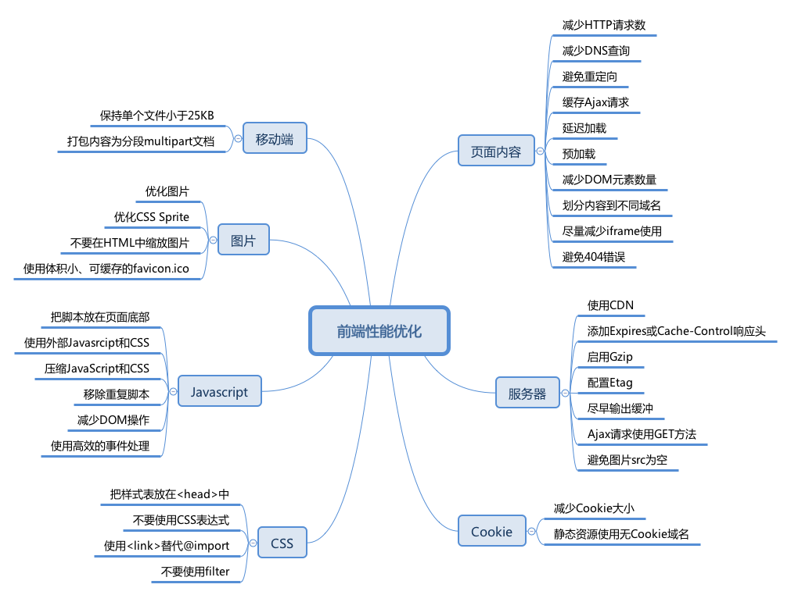

前端性能的一个重要指标是页面加载时间，不仅事关用户体验，也是搜索引擎排名考虑的一个因素。

- 来自Google的数据表明，一个有10条数据0.4秒能加载完的页面，变成30条数据0.9秒加载完之后，流量和广告收入下降90%。
- Google Map 首页文件大小从100KB减小到70-80KB后，流量在第一周涨了10%，接下来的三周涨了25%。
- 亚马逊的数据表明：加载时间增加100毫秒，销量就下降1%。

以上数据更说明「加载时间就是金钱」，前端优化主要围绕提高加载速度进行。

### 页面内容

#### 减少HTTP请求数

Web 前端 80% 的响应时间花在图片、样式、脚本等资源下载上。最直接的方式是减少页面所需资源，但并不现实。所以，减少HTTP请求数主要的途径是：

> 合并JS/CSS文件。服务器端（CDN）自动合并，基于Node.js的文件合并工具，通过把所有脚本放在一个文件中的方式来减少请求数。

> 使用**CSS Sprite**将背景图片合并成一个文件，通过`background-image` 和 `background-position` 控制显示

> **行内图片**（Base64编码）。使用Data URI scheme将图片嵌入HTML或者CSS中；或者将CSS、JS、图片直接嵌入HTML中，会增加文件大小，也可能产生浏览器兼容及其他性能问题。

减少页面的HTTP请求数是个起点，这是提升站点首次访问速度的重要指导原则。

#### 减少DNS查询

用户输入URL以后，浏览器首先要查询域名（hostname）对应服务器的IP地址，一般需要耗费20-120毫秒时间。DNS查询完成之前，浏览器无法从服务器下载任何数据。

基于性能考虑，ISP、局域网、操作系统、浏览器都会有相应的DNS缓存机制。

- IE缓存30分钟，可以通过注册表中DnsCacheTimeout项设置；
- Firefox缓存1分钟，通过network.dnsCacheExpiration配置；

另外减少不同的主机名可减少DNS查找，减少不同主机名的数量同时也减少了页面能够并行下载的组件数量，避免DNS查找削减了响应时间，而减少并行下载数量却增加了响应时间。原则是把组件分散在2到4个主机名下，这是同时减少DNS查找和允许高并发下载的折中方案。

#### 避免重定向

HTTP重定向通过`301/302`状态码实现。下面是一个有301状态码的HTTP头

```
 HTTP/1.1 301 Moved Permanently 
 Location: http://example.com/newuri
 Content-Type: text/html
```

浏览器会自动跳转到Location域指明的URL。重定向需要的所有信息都在HTTP头部，而响应体一般是空的。其实额外的HTTP头，比如Expires和Cache-Control也表示重定向。除此之外还有别的跳转方式：refresh元标签和JavaScript，但如果你必须得做重定向，最好用标准的3xxHTTP状态码，主要是为了让返回按钮能正常使用。

客户端收到服务器的重定向响应后，会根据响应头中Location的地址再次发送请求。重定向会影响用户体验，尤其是多次重定向时，用户在一段时间内看不到任何内容，只看到浏览器进度条一直在刷新。

- 最浪费的重定向经常发生、而且很容易被忽略：URL 末尾应该添加`/`但未添加。比如，访问`http://astrology.yahoo.com/astrology`将被`301`重定向到 `http://astrology.yahoo.com/astrology/`（注意末尾的 /）。如果使用 Apache，可以通过Alias或mod_rewrite或DirectorySlash解决这个问题。
- 网站域名变更：CNAME结合Alias或mod_rewrite或者其他服务器类似功能实现跳转。

#### 缓存Ajax请求

最重要的的优化方式是缓存响应结果。有尚未过期的Expires或者Cache-Control HTTP头，那么之前的资源就可以从缓存中读出。必须通知浏览器，应该继续使用之前缓存的资源响应，还是去请求一个新的。可以通过给资源的Ajax URL里添加一个表明用户资源最后修改时间的时间戳来实现。如果资源从上一次下载之后再没有被修改过，时间戳不变，资源就将从浏览器缓存中直接读出，从而避免一次额外的HTTP往返消耗。详见`服务器-添加Expires或Cache响应头`。

#### 延迟加载

页面初始加载时哪些内容是绝对必需的？不在答案之列的资源都可以延迟加载。比如：

- 非首屏使用的数据、样式、脚本、图片等；
- 用户交互时才会显示的内容。

遵循「渐进增强」理念开发的网站：JavaScript用于增强用用户体验，但没有（不支持） JavaScript也能正常工作，完全可以延迟加载JavaScript。

> 将首屏以外的HTML放在不渲染的元素中，如隐藏的``，或者type属性为非执行脚本的``标签中，减少初始渲染的DOM元素数量，提高速度。等首屏加载完成或者用户操作时，再去渲染剩余的页面内容。

#### 预加载

预先加载利用浏览器空闲时间请求将来要使用的资源，以便用户访问下一页面时更快地响应。

- 无条件预先加载：页面加载完成（load）后，马上获取其他资源。以 [google.com](http://google.com) 为例，首页加载完成后会立即下载一个 Sprite 图片，此图首页不需要，但是搜索结果页要用到。
- 有条件预先加载：根据用户行为预判用户去向，预载相关资源。比如search.yahoo.com开始输入时会有额外的资源加载。Chrome 等浏览器的地址栏也有类似的机制。
- 有「阴谋」的预先加载：页面即将上线新版前预先加载新版内容。网站改版后由于缓存、使用习惯等原因，会有旧版的网站更快更流畅的反馈。为缓解这一问题，在新版上线之前，旧版可以利用空闲提前加载一些新版的资源缓存到客户端，以便新版正式上线后更快的载入。

#### 减少DOM元素数量

复杂的页面不仅下载的字节更多，JavaScript DOM操作也更慢。例如，同是添加一个事件处理器，500个元素和5000个元素的页面速度上会有很大区别。

从以下几个角度考虑移除不必要的标记：

- 是否还在使用表格布局？
- 塞进去更多的``仅为了处理布局问题？也许有更好、更语义化的标记。
- 能通过伪元素实现的功能，就没必要添加额外元素，如清除浮动。

浏览器控制台中输入以下代码可以计算出页面中有多少 DOM 元素：

> document.getElementsByTagName('*').length;

为什么不使用表格布局？

- 更多的标签，增加文件大小；
- 不易维护，无法适应响应式设计；
- 性能考量，默认的表格布局算法会产生大量重绘

#### 划分内容到不同域名

浏览器一般会限制每个域的并行线程（一般为6个，甚至更少），使用不同的域名可以最大化下载线程，但注意保持在2-4个域名内，以避免DNS查询损耗。

例如，动态内容放在`csspod.com`上，静态资源放在`static.csspod.com`上。这样还可以禁用静态资源域下的Cookie，减少数据传输，详见`Cookie 优化`。

#### 尽量减少iframe的使用

用iframe可以把一个HTML文档插入到父文档里，重要的是明白iframe是如何工作的并高效地使用它。

`<iframe>`的优点：

- 可以用来加载速度较慢的第三方资源，如广告、徽章；
- 可用作安全沙箱；
- 可以并行下载脚本。

`<iframe>`的缺点：

- 加载代价昂贵，即使是空的页面；
- 阻塞页面 load 事件触发；

> Iframe 完全加载以后，父页面才会触发 load 事件。 Safari、Chrome 中通过 JavaScript 动态设置 iframe src 可以避免这个问题。

- 缺乏语义。

#### 避免404错误

HTTP请求很昂贵，返回无效的响应（如404未找到）完全没必要，降低用户体验而且毫无益处。 一些网站设计很酷炫、有提示信息的404页面，有助于提高用户体验，但还是浪费服务器资源。尤其糟糕的是外部脚本返回404，不仅阻塞其他资源下载，浏览器还会尝试把404页面内容当作JavaScript解析，消耗更多资源。

### 服务器

#### 使用CDN

用户与服务器的物理距离对响应时间也有影响。把内容部署在多个地理位置分散的服务器上能让用户更快地载入页面。但具体要怎么做呢？

网站80-90%响应时间消耗在资源下载上，减少资源下载时间是性能优化的黄金法则。相比分布式架构的复杂和巨大投入，静态内容分发网络（CDN）可以以较低的投入，获得加载速度有效提升。

内容分发网络（CDN）是一组分散在不同地理位置的web服务器，用来给用户更高效地发送内容。典型地，选择用来发送内容的服务器是基于网络距离的衡量标准的。例如：选跳数（hop）最少的或者响应时间最快的服务器。

#### 添加Expires或Cache-Control响应头

- 静态内容：将 Expires 响应头设置为将来很远的时间，实现「永不过期」策略；
- 动态内容：设置合适的 Cache-Control 响应头，让浏览器有条件地发起请求。

> Cache-Control头在HTTP/1.1规范中定义，取代了之前用来定义响应缓存策略的头（例如 Expires、Pragma）。当前的所有浏览器都支持Cache-Control，因此，使用它就够了。

#### 启用Gzip

前端工程师可以想办法明显地缩短通过网络传输HTTP请求和响应的时间。毫无疑问，终端用户的带宽速度，网络服务商，对等交换点的距离等等，都是开发团队所无法控制的。但还有别的能够影响响应时间的因素，压缩可以通过减少HTTP响应的大小来缩短响应时间。

Gzip压缩通常可以减少70%的响应大小，对某些文件更可能高达90%，比Deflate更高效。主流 Web 服务器都有相应模块，而且绝大多数浏览器支持gzip解码。所以，应该对HTML、CSS、JS、XML、JSON等文本类型的内容启用压缩。

> **注意!!!** 图片和 PDF 文件不要使用 gzip。它们本身已经压缩过，再使用 gzip 压缩不仅浪费 CPU 资源，而且还可能增加文件体积。

从HTTP/1.1开始，**web客户端**就有了支持压缩的Accept-Encoding HTTP请求头。

> Accept-Encoding: gzip, deflate

如果web服务器看到这个请求头，它就会用客户端列出的一种方式来压缩响应。**web服务器**通过Content-Encoding响应头来通知客户端。

> Content-Encoding: gzip

#### 配置 Etag

实体标签（ETags），是服务器和浏览器用来决定浏览器缓存中组件与源服务器中的组件是否匹配的一种机制（“实体”也就是组件：图片，脚本，样式表等等）。添加ETags可以提供一种实体验证机制，比最后修改日期更加灵活。一个ETag是一个字符串，作为一个组件某一具体版本的唯一标识符。唯一的格式约束是字符串必须用引号括起来，源服务器用相应头中的ETag来指定组件的ETag。

```
HTTP/1.1 200 OK
      Last-Modified: Tue, 12 Dec 2006 03:03:59 GMT
      ETag: "10c24bc-4ab-457e1c1f"
      Content-Length: 12195
```

然后，如果浏览器必须验证一个组件，它用If-None-Match请求头来把ETag传回源服务器。如果ETags匹配成功，会返回一个304状态码，这样就减少了12195个字节的响应体。Etag 通过文件版本标识，方便服务器判断请求的内容是否有更新，如果没有就响应 304，避免重新下载。

```
GET /i/yahoo.gif HTTP/1.1
      Host: us.yimg.com
      If-Modified-Since: Tue, 12 Dec 2006 03:03:59 GMT
      If-None-Match: "10c24bc-4ab-457e1c1f"
      HTTP/1.1 304 Not Modified
```

#### 尽早输出（flush）缓冲

用户请求页面时，服务器通常需要花费200 ~ 500毫秒来组合 HTML 页面。在此期间，浏览器处于空闲、等待数据状态。使用PHP中的flush()函数，可以发送部分已经准备好的 HTML到浏览器，以便服务器还在忙于处理剩余页面时，浏览器可以提前开始获取资源。

可以考虑在``之后输出一次缓冲，HTML head一般比较容易生成，先发送以便浏览器开始获取``里引用的CSS等资源。

Example:

```
<!-- css, js -->
</head>
<?php flush(); ?>
<body>
<!-- content -->
```

#### Ajax请求使用GET方法

浏览器执行XMLHttpRequest POST请求时分成两步，先发送Http Header，再发送data。而GET只使用一个TCP数据包（Http Header与data）发送数据，所以首选GET方法。

根据HTTP规范，GET用于获取数据，POST则用于向服务器发送数据，所以Ajax请求数据时使用GET更符合规范。

#### 避免图片src为空

图片src属性值为空字符串可能以下面两种形式出现：

HTML:

```

```

JavaScript：

```
var img = new Image(); 
img.src = "";
```

虽然src属性为空字符串，但浏览器仍然会向服务器发起一个HTTP请求：

- IE 向页面所在的目录发送请求；
- Safari、Chrome、Firefox向页面本身发送请求；
- Opera不执行任何操作。

空src产生请求的后果不容小觑：

- 给服务器造成意外的流量负担，尤其时日 PV 较大时；
- 浪费服务器计算资源；
- 可能产生报错。

> 空的href属性也存在类似问题。用户点击空链接时，浏览器也会向服务器发送HTTP请求，可以通过JavaScript阻止空链接的默认的行为。

### Cookie

#### 减少 Cookie 大小

Cookie被用于身份认证、个性化设置等诸多用途。Cookie通过HTTP头在服务器和浏览器间来回传送，减少Cookie大小可以降低其对响应速度的影响。

- 去除不必要的 Cookie；
- 尽量压缩 Cookie 大小；
- 注意设置 Cookie 的 domain 级别，如无必要，不要影响到 sub-domain；
- 设置合适的过期时间。

#### 静态资源使用无Cookie域名

静态资源一般无需使用Cookie，可以把它们放在使用二级域名或者专门域名的无Cookie服务器上，降低Cookie传送的造成的流量浪费，提高响应速度。

### CSS

#### 把样式表放在`<head>`中

把样式表放在`<head>`中可以让页面渐进渲染，尽早呈现视觉反馈，给用户加载速度很快的感觉。

这对内容比较多的页面尤为重要，用户可以先查看已经下载渲染的内容，而不是盯着白屏等待。

如果把样式表放在页面底部，一些浏览器为减少重绘，会在 CSS 加载完成以后才渲染页面，用户只能对着白屏干瞪眼，用户体验极差。把样式表放到文档的HEAD部分能让页面看起来加载地更快。

#### 不要使用CSS表达式

CSS表达式可以在CSS里执行JavaScript，仅IE5-IE7支持，IE8标准模式已经废弃。 CSS表达式超出预期的频繁执行，页面滚动、鼠标移动时都会不断执行，带来很大的性能损耗。

#### 使用`<link>`替代`@import`

对于IE某些版本，@import的行为和放在页面底部一样。所以，不要用它。

#### 不要使用 filter

AlphaImageLoader为IE5.5-IE8专有的技术，和CSS表达式一样，放进博物馆吧。IE专有的AlphaImageLoader滤镜可以用来修复IE7之前的版本中半透明PNG图片的问题。在图片加载过程中，这个滤镜会阻塞渲染，卡住浏览器，还会增加内存消耗而且是被应用到每个元素的，而不是每个图片，所以会存在一大堆问题。

> 注意！！！这里所说的不是 CSS3 Filter

### JavaScript

#### 把脚本放在页面底部

浏览器下载脚本时，会阻塞其他资源并行下载，即使是来自不同域名的资源。因此，最好将脚本放在底部，以提高页面加载速度。

一些特殊场景无法将脚本放到页面底部的，可以考虑``的以下属性：

- defer 属性；
- HTML5 新增的async属性。

#### 使用外部JavaScript和CSS

外部JavaScript和CSS文件可以被浏览器缓存，在不同页面间重用，也能降低页面大小。

当然，实际中也需要考虑代码的重用程度。如果仅仅是某个页面使用到的代码，可以考虑内嵌在页面中，减少HTTP请求数。另外，可以在首页加载完成以后，预先加载子页面的资源。

#### 压缩JavaScript和CSS

压缩代码可以移除非功能性的字符（注释、空格、空行等），减少文件大小，提高载入速度。

> 得益于Node.js的流行，开源社区涌现出许多高效、易用的前端优化工具，JavaScript 和CSS压缩类的，不敢说多如牛毛，多入鸡毛倒是一点不夸张，如[UglifyJS 2] ([github.com/mishoo/Ugli…](https://github.com/mishoo/UglifyJS2))、csso、cssnano 等。

> 对于内嵌的CSS和JavaScript，也可以通过htmlmin等工具压缩。

> 这些项目都有Gulp、Webpack等流行构建工具的配套版本。

#### 移除重复脚本

重复的脚本不仅产生不必要的HTTP请求，而且重复解析执行浪费时间和计算资源。

#### 减少DOM操作

JavaScript 操作 DOM 很慢，尤其是 DOM 节点很多时。

使用时应该注意：

- 缓存已经访问过的元素；
- 使用DocumentFragment暂存DOM，整理好以后再插入DOM树；
- 操作className，而不是多次读写style；
- 避免使用JavaScript修复布局。

#### 使用高效的事件处理

- 减少绑定事件监听的节点，如通过事件委托；
- 尽早处理事件，在DOMContentLoaded即可进行，不用等到load以后。

### 图片

#### 优化图片

尝试把GIF格式转换成PNG格式，看看是否节省空间。在所有的PNG图片上运行pngcrush（或者其它PNG优化工具）。

> YDN[列出的相关工具](https://developer.yahoo.com/performance/rules.html#opt_images)缺乏易用性，建议参考以下工具

- [imagemin](https://github.com/imagemin/imagemin)
- [imageoptim.com](https://imageoptim.com/mac)

> TODO:

- PNG 终极优化；
- Webp 相关内容；
- SVG 相关内容。

PNG终极优化

- [Most Effective Method to Reduce and Optimize PNG Images](https://www.queness.com/post/2507/most-effective-method-to-reduce-and-optimize-png-images)
- [Clever PNG Optimization Techniques](https://www.smashingmagazine.com/2009/07/clever-png-optimization-techniques/)

#### 优化CSS Sprite

- 水平排列Sprite中的图片，垂直排列会增加图片大小；
- Spirite中把颜色较近的组合在一起可以降低颜色数，理想状况是低于256色以适用PNG8格式；
- 不要在Spirite的图像中间留有较大空隙。减少空隙虽然不太影响文件大小，但可以降低用户代理把图片解压为像素图的内存消耗，对移动设备更友好。

#### 不要在HTML中缩放图片

不要使用``的width、height缩放图片，如果用到小图片，就使用相应大小的图片。如果需要


那么图片本身（mycat.jpg）应该是100x100px的，而不是去缩小500x500px的图片。

> 很多 CMS 和 CDN 都提供图片裁切功能。

**补充**：设置图片的宽和高，以免浏览器按照「猜」的宽高给图片保留的区域和实际宽高差异，产生重绘。

#### 使用体积小、可缓存的favicon.ico

Favicon.ico一般存放在网站根目录下，无论是否在页面中设置，浏览器都会尝试请求这个文件。

所以确保这个图标：

- 存在（避免 404）；
- 尽量小，最好小于 1K；
- 设置较长的过期时间。

> 对于较新的浏览器，可以使用PNG格式的favicon。

### 移动端

#### 保证所有组件都小于25K

这个限制是因为iPhone不能缓存大于25K的组件，注意这里指的是未压缩的大小。这就是为什么缩减内容本身也很重要，因为单纯的gzip可能不够。

[保证所有组件都小于25K](https://developer.yahoo.com/performance/rules.html#under25)

#### 打包内容为分段（multipart）文档

把各个组件打包成一个像有附件的电子邮件一样的复合文档里，可以用一个HTTP请求获取多个组件（记住一点：HTTP请求是代价高昂的）。用这种方式的时候，要先检查用户代理是否支持（iPhone就不支持）。

### 总结

写到这里，雅虎的35条军规算是介绍完了。条目虽然很多，但经过分类，可以发现，性能优化主要切入点可以从以下几个方面去考虑：

- 资源本身大小的压缩优化（想办法减少资源的体积）
- 网络请求的全过程（从url地址栏输入发送请求开始到返回响应包的每个环节）
- 浏览器渲染的全过程（拿到资源后浏览器渲染的每个环节）

因此，要彻底掌握优化的方法，必须对http请求的全过程以及浏览器的渲染全过程都有深入的理解。

## 24.你有开发过弹幕吗？知道它的原理吗？说说看

[弹幕建议接口规范](https://w3c.github.io/danmaku/api.zh.html)

[前端实现弹幕效果的方法总结(包含css3和canvas的实现方式)](https://segmentfault.com/a/1190000015582928)

没有开发过，如果要我来开发的话我会这样做：

- 在video上方设置一个弹幕container，设置相对定位。子元素都是绝对定位并设置z-index。
- 生成一个dom将弹幕内容填充进去，在container中append
- 设置dom的animation动画，从右到左划过整个video
- 将带有时间戳信息的弹幕内容通过规定好的格式发送给后端
- 弹幕出屏幕之后要销毁。

PS：

- 顺序可以调换，一般是确定后台接收到数据了再生成dom
- 没了解过如何实现弹幕防挡。

> 似乎移动端浏览器 视频会处于层级最高状态。弹幕实现不了。。未来好像有弹幕标签

## 25.说说你对Web App 、Hybrid App和Native App这三者的理解

[Web App Hybrid App和 Native App的区别](http://www.ionic.wang/article-index-id-58.html)

[浅谈Hybrid App开发](https://zhuanlan.zhihu.com/p/54624442)

[Web*在继续离我们远去](https://zhuanlan.zhihu.com/p/22561084)

### 三者纵向对比

目前主流应用程序大体分为三类：Web App、Hybrid App、 Native App。

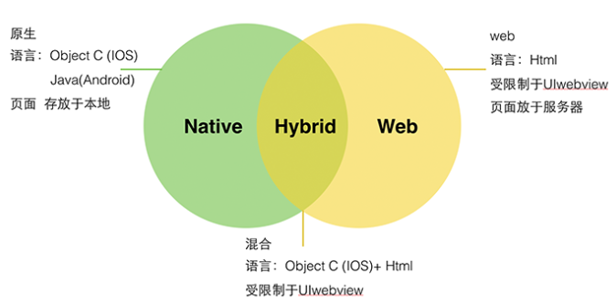

- Native App：原生应用，在android端通常使用Java或Kotlin开发，ios端使用OC或者Swift开发
- Hybrid App：混合应用，结合Web与Native技术开发
- Web App：web应用，网页三剑客HTML+CSS+JS

首先，我们来看看什么是 Web App、Hybrid App、 Native App。

#### Web APP

Web App 指采用Html5语言写出的App，不需要下载安装。类似于现在所说的轻应用。生存在浏览器中的应用，基本上可以说是触屏版的网页应用。

优点

（1）开发成本低，
（2）更新快，
（3）更新无需通知用户，不需要手动升级，
（4）能够跨多个平台和终端。

缺点：

（1）临时性的入口
（2）无法获取系统级别的通知，提醒，动效等等
（3）用户留存率低
（4）设计受限制诸多
（5）体验较差

#### Hybrid App

Hybrid APP指的是半原生半Web的混合类App。需要下载安装，看上去类似Native App，但只有很少的UI Web View，访问的内容是 Web 。

例如Store里的新闻类APP，视频类APP普遍采取的是Native的框架，Web的内容。

Hybrid App 极力去打造类似于Native App 的体验，但仍受限于技术，网速，等等很多因素。尚不完美。

#### Native App

Native APP 指的是原生程序，一般依托于操作系统，有很强的交互，是一个完整的App，可拓展性强。需要用户下载安装使用。

优点：

（1）打造完美的用户体验
（2）性能稳定
（3）操作速度快，上手流畅
（4）访问本地资源（通讯录，相册）
（5）设计出色的动效，转场，
（6）拥有系统级别的贴心通知或提醒
（7）用户留存率高

缺点：

（1）分发成本高（不同平台有不同的开发语言和界面适配）
（2）维护成本高（例如一款App已更新至V5版本，但仍有用户在使用V2， V3， V4版本，需要更多的开发人员维护之前的版本）
（3）更新缓慢，根据不同平台，提交–审核–上线 等等不同的流程，需要经过的流程较复杂

Native App开发依旧是**移动应用**的主导，但如今的Native App或多或少会嵌入一些web页面，诸如淘宝、京东等APP，所以如今真正意义上的原生应用又该如何去定义呢？Hybrid App受到越来越多开发者的追捧与其开发周期短，开发难度小，跨平台离不开，当然APP的效果也成为大家诟病的话题，如首屏打开缓慢，动画效果不够流畅等。

### 三者技术特征


由上图可见，Web APP 的开发基于Html5语言。而Html5语言本身又有着不可避免的局限性。正是这些局限性的存在，使得Web App在体验中要逊于Native App。

## 26.你有了解OpenGL吗？它有哪些作用

OpenGL（英语：Open Graphics Library，译名：开放图形库或者“开放式图形库”）是用于渲染2D、3D矢量图形的跨语言、跨平台的应用程序编程接口（API），属于图形学内容。

WebGl 定义了一套API, 能够允许在网页中使用类似于Open GL，实际上是一套基于OpenGL ES 2.0的3d图形API。这些API是通过HTML 5的canvas标签来使用的。

## 27.说说你对移动端和Web前端开发的主要区别是什么

题目有歧义，移动端与web前端开发这两个概念交叉了。

软件开发按设备类型可分为移动端与PC端等，按开发技术可以分为**Web、原生、hybird三种**。Web前端包括了Web移动端与web PC端，题目应该问的是**移动端下**原生开发和Web开发的区别。

1. 原生开发能使用设备硬件的更多能力，能带来更好的使用体验
2. Web开发具有优秀的跨平台能力
3. 原生应用更新需要经过应用商店审核发布，用户手动下载更新；Web应用更新则无这些繁琐的流程

## 28.知道为何有些网站访不需要端口号？说说你对端口的理解

所有使用tcp/ip协议的网络应用，**都需要**端口。
IP只能帮你找到哪一台主机，端口的作用就是帮你找到该主机所对应的的程序。
不加端口号，是因为一些常用的都**默认了**端口号，如浏览器默认访问80端口。

## 29.关于重复造轮子这件事你是怎么理解的

不重复造轮子怎么造更好的轮子

- 借鉴思路
- 装逼
- 扩展原方法
- 遇到更多的坑

## 30.说说你对重构的理解

换一种方式实现与原来相同的功能，从而改善系统代码质量，提高可重用性和可扩展性。

再次审视代码，可能之前写的代码有冗余，提取公共组件，精简代码，统一规范。

## 31.你知道产品经理一般画的原型是用什么工具吗？有没有自己玩过

墨刀、Axure、 processon
其中墨刀、processon 自己有玩过

## 32.你会Node.js吗？说说你运用它的场景

会。一般会用 Node 做一些小工具，比如 excel 的导入导出、简单的爬虫、数据清洗的脚本；还有就是上 express/koa 做服务器，自己写前后端。

node 好像就被我拿来瞎玩了：

1. 有个网址妹子图多，就做了个简单爬虫
2. 想下视频，结果是 m3u8 格式，就写了个转 MP4 的
3. 番号的文件名不统一，那就统一下吧
4. 小项目懒得写公共的首位，就用 `` 写了个模板插入
   之类的...

其实大多时候都是基于已有的插件了，比如 anywhere、now 等

## 33.说说你是怎么安排你工作外的时间的

下班，买菜，做饭，吃饭，刷碗，洗澡，打游戏，睡觉。通勤时间背单词，周内中午/周末不定时看书。最近再看 《JS忍者秘籍》和《代码整洁之道》。

下班 > 饭 > 健身 > 洗澡 > 听音乐 > 睡觉

## 34. 你在工作中有用到过Websocket吗？用它来解决什么问题

没有。

只知道websocket是一种基于tcp的通信协议，实现了客户端和服务端的双向推送消息，不存在同源限制，在握手阶段会采用http协议，和http协议具有良好兼容性，也可以加上tls加密来实现更安全的传输

实时推动消息，例如弹幕需要用到，后端自动推送弹幕数据，前端实时展示

## 35.你了解什么是微前端吗？说说你对它的理解

微前端的出现是为了解决单体应用无限扩展成为一个难以部署与维护的巨石应用的现状, 它旨在将前端应用进行拆分, 带来应用自治, 单一职责, 技术栈无关等好处。

随着业务的增长，小项目发展成了一个巨型项目,不好维护也不好部署
于是就拆分成一个容器项目以及多个子项目
子项目之间独立部署和开发
用容器来动态注册和卸载子项目

简单的就是用iframe操作
一个门户网站,内嵌一个Iframe动态切换Url加载子项目

现在要求用户体验高以及资源高效利用则开始微前端技术方案，如single-spa,umi-qiankun等
一个总的SPA页面动态加载子项目线上的js进行注册模块,路由跳转等。

## 36.你知道什么是微格式(microformat)吗？说说你的理解，它有什么运用场景

[microformats官方定义](http://microformats.org/)

微格式，利用 HTML 的 `class` 属性来对网页添加附加信息。

- vCard（电子名片）
- iCalendar（日历数据交换）

应用举例：当你用手机浏览某公司的网站时，手机浏览器识别出了网页中的 `hCard` 信息。这个 `hCard` 标记了该公司的多种联络方式，手机浏览器很聪明地提示你“是否保存到通讯录”，于是你可以很经松地保存所需要的信息。

```
<div class="vcard">
    <div class="fn">Joe</div>
    <div class="org">Company A</div>
    <div class="tel">400-800-12345</div>
    <a href="http://companyA.com" class="url">http://companyA.com</a>
</div>
```

> 这里，正式名称 `class=”fn”`，组织 `class=”org”`，电话号码 `class=”tel”` 和 url `class=”url”` 分别用相应的 `class` 标示；同时，所有内容都包含在 `class="vcard"` 里。

## 37.你有玩过Docker吗？你知道它有哪些运用场景吗

[如何通俗解释Docker是什么？](https://www.zhihu.com/question/28300645)

作者：刘允鹏
链接：https://www.zhihu.com/question/28300645/answer/67707287
来源：知乎
著作权归作者所有。商业转载请联系作者获得授权，非商业转载请注明出处。


Docker的思想来自于集装箱，集装箱解决了什么问题？在一艘大船上，可以把货物规整的摆放起来。并且各种各样的货物被集装箱标准化了，集装箱和集装箱之间不会互相影响。那么我就不需要专门运送水果的船和专门运送化学品的船了。只要这些货物在集装箱里封装的好好的，那我就可以用一艘大船把他们都运走。

docker就是类似的理念。现在都流行云计算了，云计算就好比大货轮。docker就是集装箱。

1.不同的应用程序可能会有不同的应用环境，比如.net开发的网站和php开发的网站依赖的软件就不一样，如果把他们依赖的软件都安装在一个服务器上就要调试很久，而且很麻烦，还会造成一些冲突。比如IIS和Apache访问端口冲突。这个时候你就要隔离.net开发的网站和php开发的网站。常规来讲，我们可以在服务器上创建不同的虚拟机在不同的虚拟机上放置不同的应用，但是虚拟机开销比较高。docker可以实现虚拟机隔离应用环境的功能，并且开销比虚拟机小，小就意味着省钱了。

2.你开发软件的时候用的是Ubuntu，但是运维管理的都是centos，运维在把你的软件从开发环境转移到生产环境的时候就会遇到一些Ubuntu转centos的问题，比如：有个特殊版本的数据库，只有Ubuntu支持，centos不支持，在转移的过程当中运维就得想办法解决这样的问题。这时候要是有docker你就可以把开发环境直接封装转移给运维，运维直接部署你给他的docker就可以了。而且部署速度快。

3.在服务器负载方面，如果你单独开一个虚拟机，那么虚拟机会占用空闲内存的，docker部署的话，这些内存就会利用起来。

总之docker就是集装箱原理。

1. 可以配置一个自定义的前端开发环境。在任何一台有docker环境的集群都可以开发。
2. 利用阿里云镜像仓库实现CICD。

## 38.你期望的薪资是多少呢

薪资要分两部分来看

企业给出的薪资，取决于当前市场需求，随着市场变化而变化。
求职者给出的薪资，可能是听人说的应该那么多，可能是基于相对客观的自我实力的认知。

我的期望薪资是当前能力阶段的max，我始终对 IT 行业保持感恩和敬畏，并且我一直为这个max不懈努力。这种精神，是我一个大学同学教会我的，受益匪浅。

## 39.你知道Jenkins吗？有没有用过？说说你对它的理解

[Jenkins+github 前端自动化部署](https://segmentfault.com/a/1190000010200161)

之前用jenkins打包部署小程序；在我看来：是用来构建打包、部署流程的；不知道还有啥其他用途。

没有用过，我们是基于 gitlab CI 和 容器来部署的，不过看起来Jenkins很好用的样子。

一般看见后台，运维再用。我不咋用。

## 40.你会PHP、JAVA、Python或GO吗？都有做过哪些应用呢

JAVA ，做过Android应用。

其实很迷茫，现在年纪越来越大，要不要再考虑攻一门新的语言。计算机语言有其互通性和差异性，困扰。

最开始学过`PHP`，然后做了个人网站；Python以前学机器学习和图像视觉的时候用过，现在也忘得差不多了……

## 41.你觉得你上家公司的前端开发流程有什么地方要优化的吗？怎么优化呢

最明显的就是代码管理的工具和流程吧，上家公司用的代码管理工具是SVN，问题是有时候很容易冲突，人员对版本管理的理解程度不一。

建议采用Git分布式管理代码，选择GitFlow类似的流程来版本控制，给团队人员统一培训和制定执行规范，严格控制版本上线流程，降低发布事故。

别说上一家了,就现在的单位挑几个重要的需要改进的吧:

1. Code Review 这个没有做.
2. 代码测试.
3. 代码在GIT上的版本划分和流程管理.

任凭有多少大拿或者虾米写代码,放一起不成团队的话永远是一盘散沙,你写你的我写我的. 不过现在好像很多企业其实做的也都并不好。

## 42.在选择框架时应该考虑哪些因素

1.开荒项目
最活跃的框架+前沿技术

2.重构
代码复用性（对代码质量还可以的老项目）
团队水平和学习能力

都要考虑的是，框架生态，社区活跃度，择优选择。

## 43.你有自己的博客吗？维护的频率是多久呢

[有了docsify神器，从此爱上看文档](https://www.jianshu.com/p/4883e95aa903)

有，用Hexo + GithubPage搭建的，基本上现在天天写内容。

##  44.W3C是什么？请说说你对它的理解

[W3C标准](https://www.chinaw3c.org/standards.html)

万维网联盟（World Wide Web Consortium），一个组织，制定一套 Web 标准。

## 45.为什么提倡利用多个域名来存储网站的资源

1. 分别部署，区分影响范围
2. 合理分配资源，如图片服务更要求带宽以及 CDN

## 46.移动端的用户体验有哪些优化的方法

### 响应快

一方面是代码和请求的优化，一方面是更多过场动画。

### 易理解

界面上，屏幕大小有限，且精力有限，所以不宜所有功能都展示，仅突出核心功能。
文案上，核心功能一定要配有文字，附属功能可图标代替，空状态也可更多样化。
流程上，移动端用户相较更能容忍较长流程，但一定要主体清晰，比如先手机号再验证，不一定要在同个界面中。

### 容易操作

比如规则按钮放在左上角，一返回就是首页，弹起键盘就挡住内容，这些就很恶心。

## 47.前端的性能统计有哪些指标

白屏时间、首屏时间、用户可操作时间、总下载时间。
了解和合理运用 `window.chrome` 和 `window.performance.timing` 来进行获取。

首次渲染期间： 白屏、首屏、首次可交互时间、FMP(主要内容加载时间)、speed index(应该知道用户渲染分布区间)、自定义指标（mark & measure， 用于对性能做到更细力度的把控）
运行期间：主线程最大等待延时，long tasks，资源加载及ajax(分析哪些是应该采取缓存而没有的，哪些是应该压缩而未做的)

数据分析：

1. 性能分布区间， 这是提现站点性能的重要指标
2. 性能地区分布，有可能某些区域cdn失效？
3. 页面加载瀑布图， 助力我们对站点加载的全局了解及优化

## 48. 你知道什么是AST吗？说说你对AST的理解，它的运用场景有哪些

[聊一聊 Javascript 中的 AST](https://juejin.im/post/6844903960650711054)

[AST 抽象语法树](http://jartto.wang/2018/11/17/about-ast/)

在计算机科学中，抽象语法树（`abstract syntax tree` 或者缩写为 `AST`），或者语法树（`syntax tree`），是源代码的抽象语法结构的树状表现形式，这里特指编程语言的源代码。树上的每个节点都表示源代码中的一种结构。

听起来还是很绕，没关系，你可以简单理解为 **它就是你所写代码的的树状结构化表现形式**。

有了这棵树，我们就可以通过操纵这颗树，精准的定位到声明语句、赋值语句、运算语句等等，实现对代码的分析、优化、变更等操作。

AST在日常业务中也许很难涉及到，有可能你还没有听过，但其实很多时候你已经在使用它了，只是没有太多关注而已，现在流行的 `webpack`，`eslint` 等很多插件或者包都有涉及。

> 之所以说语法是「抽象」的，是因为这里的语法并不会表示出真实语法中出现的每个细节。

### 抽象语法树能做什么？

聊到`AST`的用途，其应用非常广泛，下面我简单罗列了一些：

* `IDE`的错误提示、代码格式化、代码高亮、代码自动补全等
* `JSLint`、`JSHint`对代码错误或风格的检查等
* `webpack`、`rollup`进行代码打包等
* `CoffeeScript`、`TypeScript`、`JSX`等转化为原生`Javascript`

其实它的用途，还不止这些，如果说你已经不满足于实现枯燥的业务功能，想写出类似`react`、`vue`这样的牛逼框架，或者想自己搞一套类似`webpack`、`rollup`这样的前端自动化打包工具，那你就必须弄懂`AST`。

## 49.说说你对矢量图和位图的理解，它们分别有什么运用场景

[位图和矢量图的区别 你知道吗？](https://www.coreldrawchina.com/xinshourumen/weitu-shiliangtu.html)

[既然矢量图放大缩小都不失真，为什么还要使用位图？](https://www.zhihu.com/question/21283005)

[位图和矢量图区别](https://www.cnblogs.com/areliang/archive/2006/04/29/388769.html)

位图和矢量图是计算机图形中的两大概念，这两种图形都被广泛应用到出版，印刷，互联网[如flash和svg]等各个方面，他们各有优缺点，两者各自的好处几乎是无法相互替代的，所以，长久以来，矢量跟位图在应用中一直是平分秋色。

位图[bitmap]，也叫做点阵图，删格图象，像素图，简单的说，就是最小单位由象素构成的图，缩放会失真。构成位图的最小单位是象素，位图就是由象素阵列的排列来实现其显示效果的，每个象素有自己的颜色信息，在对位图图像进行编辑操作的时候，可操作的对象是每个象素，我们可以改变图像的色相、饱和度、明度，从而改变图像的显示效果。举个例子来说，位图图像就好比在巨大的沙盘上画好的画，当你从远处看的时候，画面细腻多彩，但是当你靠的非常近的时候，你就能看到组成画面的每粒沙子以及每个沙粒单纯的不可变化颜色。

矢量图[vector]，也叫做向量图，简单的说，就是缩放不失真的图像格式。矢量图是通过多个对象的组合生成的，对其中的每一个对象的纪录方式，都是以数学函数来实现的，也就是说，矢量图实际上并不是象位图那样纪录画面上每一点的信息，而是纪录了元素形状及颜色的算法，当你打开一付矢量图的时候，软件对图形象对应的函数进行运算，将运算结果[图形的形状和颜色]显示给你看。无论显示画面是大还是小，画面上的对象对应的算法是不变的，所以，即使对画面进行倍数相当大的缩放，其显示效果仍然相同[不失真]。举例来说，矢量图就好比画在质量非常好的橡胶膜上的图，不管对橡胶膜怎样的常宽等比成倍拉伸，画面依然清晰，不管你离得多么近去看，也不会看到图形的最小单位。

位图的好处是，色彩变化丰富，编辑上，可以改变任何形状的区域的色彩显示效果，相应的，要实现的效果越复杂，需要的象素数越多，图像文件的大小[长宽]和体积[存储空间]越大。

矢量的好处是，轮廓的形状更容易修改和控制，但是对于单独的对象，色彩上变化的实现不如位图来的方便直接。另外，支持矢量格式的应用程序也远远没有支持位图的多，很多矢量图形都需要专门设计的程序才能打开浏览和编辑。

矢量图可以很容易的转化成位图，但是位图转化为矢量图却并不简单，往往需要比较复杂的运算和手工调节。

矢量和位图在应用上也是可以相互结合的，比如在矢量文件中嵌入位图实现特别的效果，再比如在三维影象中用矢量建模和位图贴图实现逼真的视觉效果等等。

## 50.说说你对堆和栈的理解，它们之间有什么区别

js中堆里存的是Object类型的值，栈里存的是基本数据类型的值和Object类型的指针