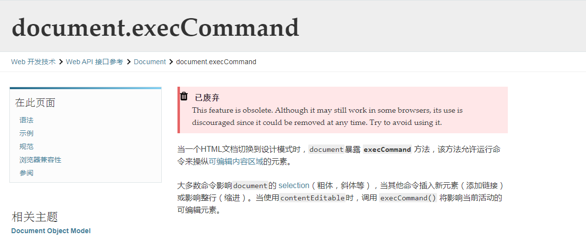
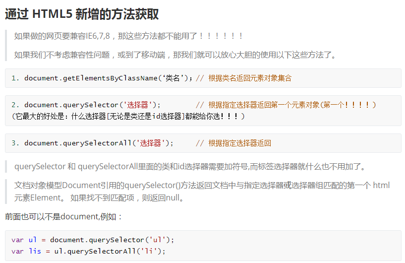
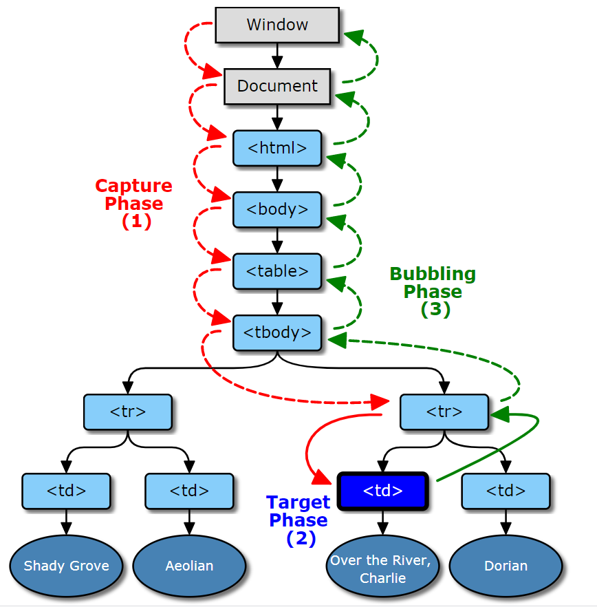
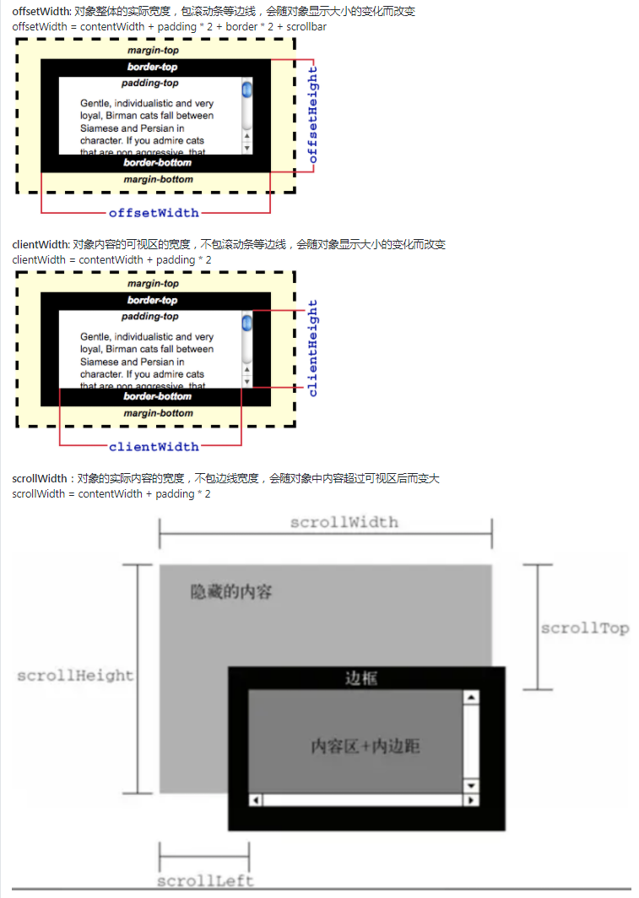
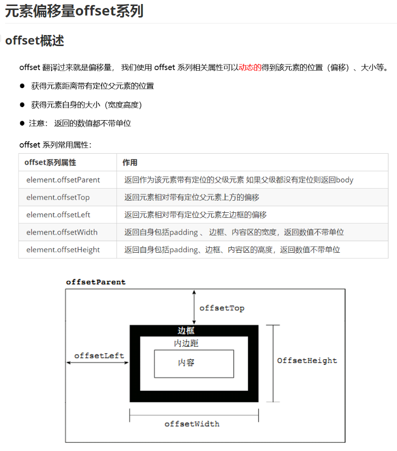
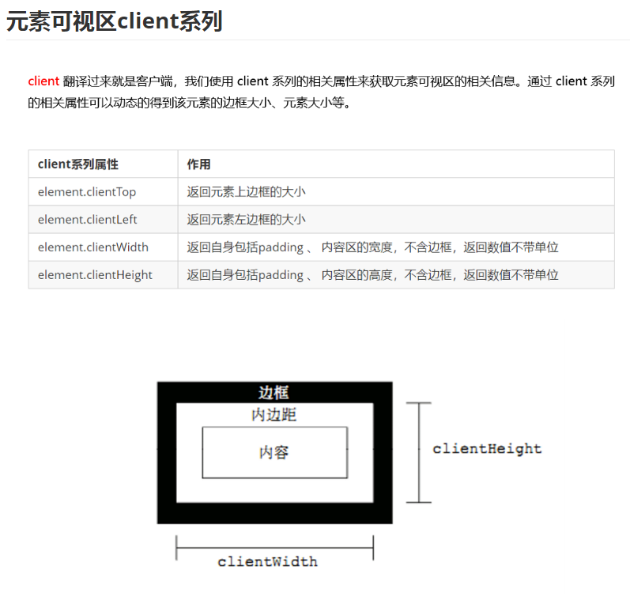
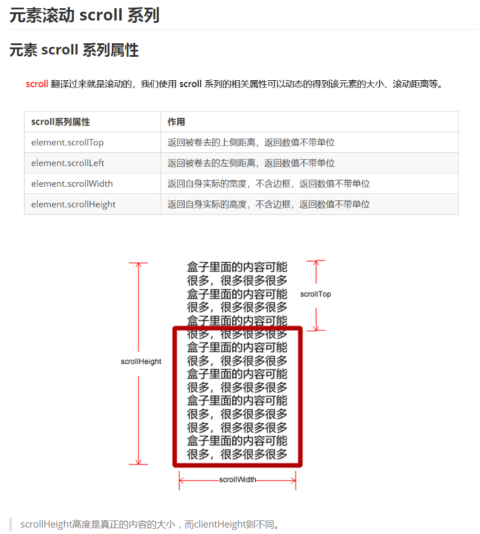
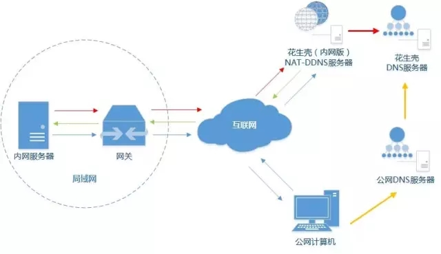

(注1：面试题目来源依旧是[前端面试每日3+1](<https://github.com/haizlin/fe-intervIEw/issues/198>)，因为我是每50题就另外写一篇博文，所以本文第一题算是总题库的第201题)

(注2：现在是2020年11月18日，50题抄完了，突然不想再抄下面的题目了。唉，还是抄下去吧，就先混个脸熟吧)

# HTML

## 1.解释下为什么`<p> </p>`会换两行？

~~~css
p {
	display: block;
	margin-block-start: 1em;
	margin-block-end: 1em;
	margin-inline-start: 0px;
	margin-inline-end: 0px;
}
/*查阅p标签的用户代理可知，默认上下margin为1em，所以等效于两行字那么高。*/
margin-block-start /end等效于上下外边距
margin-inline-start/end等效于左右外边距
~~~

## 2.你有使用过HTML5的`dialog`标签吗？说说看，它有什么特点

dialog是HTML5.2的规范，浏览器兼容性比较差，常用的特性就这些，具体可以看看[这里](https://juejin.im/entry/5b34a26e51882574dd4ae3b1)

~~~html
<!DOCTYPE html>
<html lang="en">

<head>
    <meta charset="UTF-8">
    <meta name="viewport" content="width=device-width, initial-scale=1.0">
    <meta http-equiv="X-UA-Compatible" content="ie=edge">
    <title>Document</title>
    <style>
        dialog {
            border-color: red;
        }

        dialog::backdrop {
            background: rgba(0, 0, 0, 0.3);
        }
    </style>
</head>

<body>
    <button id="btn">TEST</button>
    <dialog id="dialog">12
        <button id="close">close</button>
    </dialog>
    <script>
        var dialogEl = document.querySelector('#dialog');
        var btnEl = document.querySelector('#btn');
        var closeEl = document.querySelector('#close');

        btnEl.addEventListener('click', e => {
            // dialogEl.show(); // 打开dialog
            dialogEl.showModal(); // 打开dialog，有蒙版
        });

        closeEl.addEventListener('click', e => {
            dialogEl.close('testValue');
            console.log(dialogEl.returnValue) // 'testValue'
        });

        dialogEl.addEventListener('close', e => {
            console.log('close event')
        });

        dialogEl.addEventListener('cancel', e => {
            // 按下ESC同时也会触发close事件
            console.log('enter ESC key event')
            // 以下可选代码
            dialogEl.close('testValue2'); // 
            console.log(e.target.returnValue); // 'testValue2'
        });

    </script>
</body>

</html>
~~~

## 3. canvas的width与height属性的值可不可以带单位

经测试，width/height的属性值可以带单位且不会报错，但是无论是px还是em、rem，表现都和px一致，所以带单位没什么意义。

## 4.说下你对DOM树的理解

[你真的理解DOM了吗？](https://zhuanlan.zhihu.com/p/22184194)

DOM 是英文Document Object Model的缩写，即文档对象模型。它是一种跨平台的、独立于编程语言的API，它把HTML、XHTML或XML文档当作一个树结构，而每个节点视为一个对象，这些对象可以被编程语言操作，进而改变文档的结构，映射到文档的显示。

简单来说，DOM就是我们为了方便编程语言对HTML等文档进行操作，所以啊，把HTML文档中的节点全部视为一个个的对象，然后这些对象依照层级关系形成一棵树，这棵树就命名为DOM树。有了对象，编程就方便多了，只要一层层拿到对象就可以优雅地改变对象的属性进而动态地改变HTML等文档的展示。

## 5.你有使用过picture标签吗？说说它有哪些运用场景

运用场景：

* 针对不同的media条件裁剪或修改图像
* 遇到浏览器不支持的特定格式时，提供不同的图像格式。

## 6.移动端点击300ms的延迟出现的原因是什么？你的解决方案是什么

原因：早期IOS为了区分用户是双击缩放还是点击链接行为，于是就有了300ms延迟，其他浏览器就效仿了。
解决办法：

* 引入fastclick，一了百了；
* 在meta禁用浏览器缩放；
* touch事件模拟

## 7.你是如何组织HTML代码的

按照 HTML5 语义话结构

```html
<!DOCTYPE html>
<html lang="zh-Hans">
<head>
    <meta charset="UTF-8">
    <meta name="viewport" content="width=device-width, initial-scale=1.0">
    <meta http-equiv="X-UA-Compatible" content="ie=edge">
    <title></title>
</head>
<body>
    <header>
        <h1>title</h1>
    </header>
    <main>
        <section>
            <a href="https://feiqa.xgqfrms.xyz/index.html"></a>
        </section>
        <article></article>
    </main>
    <footer>
      <p>copyriht &copy; xgqfrms 2019</p>
    </footer>
</body>
</html>
```

## 8.举例说明表格中如何再嵌套表格

可以在td里面嵌套里一个table。

## 9.如果在写HTML时漏写了闭合标签，怎么办呢

非自闭合标签必须有开始标签和结束标签，而自闭合标签无需闭合标签。在w3c不同的规范中，对标签的闭合检查也是不一样的。XHTML最为严格，必须在自闭合标签中添加"/"。在HTML4.01中，不推荐在自闭合标签中添加“/”。而HTML5最宽松，填不添加都符合规范。有些标签是可闭合也可以不闭合，但是这些最好还是闭合，虽然代码简化了，但是可读性会变的很差。

## 10. HTML的标签这么多，我要全部记住吗？如果不要怎么办

我觉得有些标签类似nav footer之类的h5标签 记住不记住并不重要，常用的记住就好了。

这个问题和 TS全都写 any 异曲同工，就看目的性吧。

## 11.如何防止他人窃取我的源代码或图片

已经加载到客户端的资源，感觉基本上没有办法完全让用户下载不下来。只不过可以对资源进行一些处理，让用户下载的资源不那么好用。比如js加密，图片用base64或css sprint等方式，使得资源即使要用也要费一番精力。

对于图片这些静态资源：可以使用nginx对来路进行判断，不在白名单的url直接404；
对于前端代码吧：HTML、CSS好像没什么好方法。核心JS倒是可以混淆加密；

## 12.如何自动转移到新的页面

在`<head>`内引入

```html
<meta http-equiv="refresh" content="0; url=http://example.com/">
```

`content`内第一个参数是延迟，单位秒，0为立即跳转，参数`url`是跳转地址

## 13.给单个表格的单元格设置背景色有什么方法

~~~css
<td bgcolor="e91e6f"></td>
~~~

## 14. HTML5中required属性有什么应用场景

required是input 中的属性，用来规定提交前必须填入字段的功能，所以可以运用在某些注册的必填或者问卷调查的必填项内。

## 15.你有使用过marquee吗

https://developer.mozilla.org/zh-CN/docs/Web/HTML/Element/marquee
已经废弃

## 16.你有了解过Applet（Java小程序）吗

[Java applet为什么被弃用？](https://www.zhihu.com/question/43558335)

这是挖坟题么？还是20年前的老坟！ Flash 都化成白骨了，Applet 恐怕已经轮回了好几次了？

> 我最近在客户那里就有遇到过（内部系统），就当作是了解下历史吧

## 17.页面加载后，表单的第一个文本框如何自动获得焦点

方法一：

```html
<input type="text" autofocus/>
```

方法二、

```html
<input id="input" type="text"/>
document.getElementById('input').focus();
```

## 18. canvas怎么解决图片和文字模糊的问题

* 模糊问题的根源是dpr的不同导致

* 解决思路: canvas视图尺寸相同的情况下，canvas画布放大dpr倍，最终画出来的图片相当于缩小了dpr倍，然后通过`ctx.scale(dpr,dpr)`还原大小

## 19. HTML5相比于HTML4有哪些优势

* 更强的语义化
* 更丰富的功能，比如`canvas` `video` `audio`
* 更简洁的模板语法

## 20. 在使用HTML5时有哪些规则需要遵守

[使用HTML5需要遵守哪些规则？](https://developer.aliyun.com/ask/258241)

- 新的特性应该基于HTML、CSS、DOM和JavaScript
- 减少对外部插件的需求（如Flash）
- 更好的错误处理
- 更多的替换脚本的标记
- HTML5应与设备无关
- 开发过程必须可视化

## 21. wbr和br标签的区别是什么

html4中wbr 表示软换行，br表示必须换行。wbr意思是在浏览器窗口或父级窗口宽度足够的情况下，不换行；在宽度不足的情况下，在加了wbr处主动换行。

## 22.HTML5对元素内容进行拼写检查用的是什么属性呢

使用的是：`spellcheck` 属性
内容可编辑可以使用：`contenteditable` 属性

## 23.适配刘海屏的方案有哪些呢

我能想到的：

* 使用margin绕过
* 使用空白定高div
* 刘海中填充背景色

## 24.关于缓存你了解多少

HTTP缓存机制

* 强缓存：浏览器直接从本地缓存获取数据，不与服务器进行交互
* 协商缓存：浏览器发送请求到服务器，服务器判断是否可以使用本地缓存

## 25.用一句话来描述下你对HTML的理解

如果把网页比作一个人，HTML的作用是用来构造“骨架”。

HTML是一种用户描述网页结构的标记语言，他是XML的一个子集，通过标签构造网页，通过属性为标签赋能。

## 26.当写一个复杂页面的时候，你是怎么布局的？有什么方法论吗

以前通常使用浮动布局，现在基本都是用flex布局，常用的几个css属性也就那几个，相比于浮动布局更加简单易懂。

自顶向下，逐步细化
先确定整体框架及各组成部分，再分而治之

## 27.说说你认为HTML在前端的地位怎么样

HTML在前端的地位相当于数字对于数学，JavaScript相当于加减乘除。可以觉得他简单，不重要，但是你永远无法回避他。

## 28.你觉得HTML简单吗？说说你的理由 

HTML可以很简单，其实就是一个特殊化的XML子集，但是也可以很复杂，比如说前些日子提到的：href,src等的区别。

## 29. 如果让你带一个什么都不懂的人入门学前端，你应该怎么带他

这种可能几乎没有，除非他是老板的小舅子。

1. 如何下载 IDE，如何新建HTML文件，以及关键文件目录梳理
2. html 的基础语法，并以 style 的方式教授CSS 基础
3. 独立 CSS文件，讲解层叠样式，给予三两个例子进行尝试
4. 讲解编程语言基础，变量函数分支循环等
5. 讲解事件延时请求等 BOM，带着各写几个案例
6. 独立 JS文件，讲解布局渲染缓存等概念
7. 写个网页版计算器，前端速成

## 30.说出至少十条你理解的HTML规范 

1. 标签名和属性推荐用小写
2. 标签都需闭合，不管是单标签还是双标签
3. 双标签不宜使用单标签闭合方式
4. 属性值需双引号
5. img 标签需加上 alt
6. img 标签推荐加上固定宽高
7. html 和 body 标签最好不好
8. 部分字符推荐转义，比如 `<`
9. link 写在 head 内，script 写在 body 内最末
10. 不推荐使用已废弃的标签和属性名，比如 `marquee` `center` 
11. 推荐使用语义化标签
12. meta里设置有意义的title，keyword，description，方便更好的SEO

## 31. 解释下为什么说HTML嵌套级别不宜过多

* 影响代码阅读性。
* 降低浏览器渲染性能。
* 不利于维护。

## 32.网站的响应式和自适应有什么区别

* 响应式：有多套UI,不同大小的设备加载不同的UI。
* 自适应：一套UI,根据屏幕大小缩放尺寸。

## 33.说说你是怎么实现页面阻尼效果的

[H5页面滚动阻尼效果实现](https://juejin.im/post/6844903621339906055)

## 34.怎样实现每次页面打开时都清除本页缓存

页面分为html请求和静态资源JS、CSS、图片请求。如果全部要清除缓存，得看上一次的请求缓存策略。可以对所有请求增加时间戳参数从而向服务器拉取最新资源，但是一旦回到原url请求还是读的缓存。

题目表述的不是很清楚，是清楚本地缓存还是禁用缓存？

这样的吗？

```javascript
window.onload = function() {
   localStorage.clear()
}
```

## 35.请解释下`href="javascript:void(0)"`和`href="#"`的区别是什么

一个是执行函数，一个是跳转链接，执行函数的可以return一个false 使跳转或者其他事件被阻止。

"#" 包含了一个位置信息，默认的锚是#top 也就是网页的上端。
而`javascript:void(0)`, 仅仅表示一个死链接。
在页面很长的时候会使用 # 来定位页面的具体位置，格式为：`# + id`。
如果你要定义一个死链接请使用`javascript:void(0) `。

## 36.说说你对iframe属性sandbox的理解，它有什么作用呢

用于限制iframe的跨域行为

sandbox是HTML5的新属性，主要是提高iframe安全系数。iframes因安全问题而臭名昭著，这主要是因为iframes常常被用于嵌入第三方内容，而后者则可能会执行某些恶意操作。这样可以有效防止iframe对父页面进行攻击（禁用插件，禁止其他浏览上下文的导航，禁止弹出窗口和模式对话框）。sandbox通过限制被嵌入内容所允许的操作而提升iFrames的安全性。这种方式将sandbox内容与父页面进行了分离，因此限制了被嵌入内容的权限。它可以防止如下操作：

* 访问父页面的DOM（从技术角度来说，这是因为相对于父页面iframe已经成为不同的源了）
* 执行脚本
* 通过脚本嵌入自己的表单或是操纵表单

## 37.说说你对IE特有的数据存储userData的理解

这个接口已经废弃了额。

## 38.浏览器怪异模式的怪异主要体现在哪方面呢

页面渲染方式不同， 怪异模式的盒模型width和height包括了padding和border。inline元素和`table-cell`的垂直对齐方式默认值是bottom不是baseline，**图片底部会出现缝隙**。怪异模式可以给inline元素定义宽高

## 39.table由哪几部分组成

自己的答案：

```html
<table></table>
<tbody></tbody>
<th></th>
<tr></tr>
<td></td>
```

看文档后发现漏掉的：

```html
<caption></caption> // 定义表格的标题
<tfoot></tfoot> // 定义表格的页脚
<thead></thead> // 定义表格的页眉
<col></col> // 定义用于表格列的属性
<colgroup></colgroup> // 定义表格列的组
```

## 40. 请说说什么是分区响应图

简而言之就是点击一张图片中的不同区域进行相应的跳转。

## 41.html的标签`<a>`除了用作跳转链接外，还有哪些用途

只知道下载(download)和锚点定位(name)……

看了文档之后，发现还有：

media属性，是为特殊设备（比如 iPhone）、语音或打印媒介设计的，比较常用的估计有打印预览模式/打印页面吧。

## 42.如何防止cookie被盗用

1. 禁止第三方网站带cookie(same-site属性)
2. 每次请求需要输入图形验证码
3. 使用Token验证
4. 为cookie设置HttpOnly
5. 设置CSP
6. 使用Referer验证
7. 禁止网页内嵌
8. 使用https
9. cookie带上用户ip加密

## 43.用什么代替HTML5中不再支持table的cellspacing和cellpadding属性

`border-spacing`和`padding`替代

## 44. HTML5图像相关的标签有哪些

最常用的就是 img 标签了。
map 和 area 创建点击热点，可参考张鑫旭老师的文章: https://www.zhangxinxu.com/wordpress/2017/05/html-area-map/

audio 音频标签，video 媒体播放器，track 作为前面两个元素的子元素，处理字幕，支持的格式 .vtt

还有大部分标签可以使用background-img也可以设置背景图片；

## 45.如何能防止网页禁止被iframe嵌入呢

~~~javascript
if(self != top) { 
    top.location = self.location
 }
~~~

HTTP响应头信息中的X-Frame-Options，可以指示浏览器是否应该加载一个iframe中的页面。如果服务器响应头信息中没有X-Frame-Options，则该网站存在ClickJacking攻击风险。网站可以通过设置X-Frame-Options阻止站点内的页面被其他页面嵌入从而防止点击劫持。

[解决方案](https://developer.mozilla.org/zh-CN/docs/Web/HTTP/X-Frame-Options)

1. deny：表示该页面不允许在 frame 中展示，即便是在相同域名的页面中嵌套也不允许
2. sameorigin：表示该页面可以在相同域名页面的 frame 中展示
3. allow-from *uri*：表示该页面可以在指定来源的 frame 中展示

## 46.怎么让table的thead 不动，tbody出现滚动条呢

~~~html
position : sticky;
~~~

## 47.怎么让整个页面从iframe中跳出来

~~~javascript
 window.onload = function(){
      document.querySelector('button').addEventListener('click',()=>{
          window.location.href = document.querySelector('iframe').src
      })      
 }
~~~

## 48.canvas有哪些可以提升性能的优化方法

一般画下一帧会 clearRect，但当本帧绘制情况很复杂，会造成一定的白屏或黑屏，所以会有一个临时 canvas 保留上一帧，因为直接 draw 不怎么消耗计算资源，在发现绘制未完成时，用临时 canvas 显示。

在 IOS中绘制 3d canvas 的时候会有一些奇怪的模糊，后来看别人的源码发现，如果用 2d canvas 承接 3d canvas 绘制的内容，可以避免这个问题，非常奇妙。

## 49.在开发canvas时，你知道什么是非零环绕原则(nonzZero rule) 吗

[Canvas中的非零环绕规则原理](https://blog.csdn.net/itpinpai/article/details/50412260)

非零环绕规则：对于路径中指定范围区域，从该区域内部画一条足够长的线段，使此线段的完全落在路径范围之外。

## 50.请说说canvas的`closePath()`与`lineTo()`的区别是什么

- `closePath()`：创建从当前点到开始点的路径。
- `lineTo()`：添加一个新点，然后创建从该点到画布中最后指定点的线条（该方法并不会创建线条）。

```javascript
var c=document.getElementById("myCanvas");
var ctx=c.getContext("2d");
ctx.beginPath();
ctx.moveTo(20,20);
ctx.lineTo(20,100);
ctx.lineTo(70,100);
ctx.closePath();
ctx.stroke();
```

# CSS

## 1.举例说明伪类`:focus-within`的用法

[神奇的选择器 :focus-within](https://www.cnblogs.com/coco1s/p/9406413.html)

它表示一个元素获得焦点，或，该元素的后代元素获得焦点。划重点，它或它的后代获得焦点。

这也就意味着，它或它的后代获得焦点，都可以触发 `:focus-within`。

这个属性有点类似 Javascript 的事件冒泡，从可获焦元素开始一直冒泡到根元素 `html`，都可以接收触发 `:focus-within` 事件，类似下面这个简单的例子这样：

~~~html
<div class="g-father">
    <div class="g-children">
        <input type="button" value="Button">
    </div>
</div>
~~~

~~~css
html,
body,
.g-father,
.g-children {
    padding: 30px;
    border:1px solid #999;
}
 
input {
    ...
    &:focus {
        background: #00bcd4;
    }
}
 
html:focus-within {
    background: #e91e63;
}
body:focus-within {
    background: #ff5722;
}
.g-father:focus-within {
    background: #ffeb3b;
}
.g-children:focus-within {
    background: #4caf50;
}
~~~

这个选择器的存在，让 CSS 有了进一步的让元素持久停留在一种新状态的的能力。

## 2.请用CSS写一个扫码的加载动画图

~~~css
@Keyframes donut-spin {
	0% {
		transform: rotate(0deg);
	}
	100% {
	transform: rotate(360deg);
	}
}

.donut {
display: inline-block;
border: 4px solid rgba(0, 0, 0, 0.1);
border-left-color: #7983ff;
border-radius: 50%;
width: 30px;
height: 30px;
animation: donut-spin 1.2s linear infinite;
}
~~~

## 3.height和line-height的区别是什么呢

- `height`：元素content area的高度
- `line-height`：元素中，多行文字基线的距离

## 4.手写一个使用CSS3旋转硬币的效果

~~~html
 <div class="coin"></div>
~~~

~~~css
 .coin {
    width: 100px;
    height: 100px;
    margin: 100px;
    animation: rotate 5s linear;
    background-color: goldenrod;
    border-radius: 50%;
  }

  .coin:hover {
    animation-play-state: paused;
  }

  @keyframes rotate {
    0% {
      transform: rotateY(0deg);
    }

    100% {
      transform: rotateY(360deg);
    }
  }
~~~

## 5.使用CSS3做一个魔方旋转的效果

~~~css
$order: 3;
$width: 90px;
$speed: 1;

@mixin pieces() {
  $mid-z: $order / 2 + 0.5;
  @for $x from 1 through $order {
    @for $y from 1 through $order {
      @for $z from 1 through $order {
        .piece-#{$x}-#{$y}-#{$z} {
          transform: translate3d(($x - 1) * $width, ($y - 1) * $width, ($z - $mid-z) * $width);
        }
      }
    }
  }
}

@mixin rotate($x) {
  @keyframes rotate-#{$x} {
    0% {
      transform: unquote("rotate#{$x}(0)");
    }
    33.3% {
      transform: unquote("rotate#{$x}(360deg)");
    }
    100% {
      transform: unquote("rotate#{$x}(360deg)");
    }
  }
}

@keyframes circle {
  0% {
    transform: rotate3d(1, 0, 1, 0);
  }
  100% {
    transform: rotate3d(1, 1, 0, 360deg);
  }
}

@include rotate('x')
@include rotate('y')
@include rotate('z')

@keyframes rotate-x-y {
  0% {
    transform: rotateX(0) rotateY(0);
  }
  33.3% {
    transform: rotateX(360deg) rotateY(0);
  }
  66.7% {
    transform: rotateX(360deg) rotateY(360deg);
  }
  100% {
    transform: rotateX(360deg) rotateY(360deg);
  }
}

@keyframes rotate-y-z {
  0% {
    transform: rotateY(0) rotateZ(0);
  }
  33.3% {
    transform: rotateY(0) rotateZ(0);
  }
  66.7% {
    transform: rotateY(360deg) rotateZ(0);
  }
  100% {
    transform: rotateY(360deg) rotateZ(360deg);
  }
}

@keyframes rotate-x-z {
  0% {
    transform: rotateX(0) rotateZ(0);
  }
  33.3% {
    transform: rotateX(360deg) rotateZ(0);
  }
  66.7% {
    transform: rotateX(360deg) rotateZ(0);
  }
  100% {
    transform: rotateX(360deg) rotateZ(360deg);
  }
}

.cube-container {
  position: relative;
  margin: 30px auto;
  height: 600px;
  display: flex;
  justify-content: center;
  align-items: center;
  perspective: 1500px;
  backface-visibility: hidden;
}

.cube {
  position: absolute;
  width: $width * $order;
  height: $width * $order;
  animation: circle 9s linear infinite;
  transform-style: preserve-3d;
  transform: rotate3d(1, 1, 1, 30deg);
}

.piece-container {
  position: absolute;
  width: 100%;
  height: 100%;
  transform-style: preserve-3d;
  transition: all linear 1s;

  &.x-2 {
    animation: rotate-x #{9s * $speed} ease #{0s * $speed} infinite;
  }

  &.y-2 {
    animation: rotate-y #{9s * $speed} ease #{3s * $speed} infinite;

    &.x-2 {
      animation: rotate-x-y #{9s * $speed} ease infinite;
    }
  }

  &.z-2 {
    animation: rotate-z #{9s * $speed} ease #{6s * $speed} infinite;

    &.x-2 {
      animation: rotate-x-z #{9s * $speed} ease infinite;
    }

    &.y-2 {
      animation: rotate-y-z #{9s * $speed} ease infinite;
    }
  }
}

.piece {
  width: $width;
  height: $width;
  transform-style: preserve-3d;
}

@include pieces()

.face {
  position: absolute;
  width: $width - 8;
  height: $width - 8;
  border: 4px solid #888;
  border-radius: 8px;
  transform-style: preserve-3d;
  opacity: 0.8;

  &.face-up {
    transform: rotateX(90deg) translateZ($width / 2);
    background-color: yellow;
  }

  &.face-down {
    transform: rotateX(-90deg) translateZ($width / 2);
    background-color: white;
  }

  &.face-left {
    transform: rotateY(-90deg) translateZ($width / 2);
    background-color: red;
  }

  &.face-right {
    transform: rotateY(90deg) translateZ($width / 2);
    background-color: orange;
  }

  &.face-front {
    transform: translateZ($width / 2);
    background-color: green;
  }

  &.face-back {
    transform: rotateX(180deg) translateZ($width / 2);
    background-color: blue;
  }

  &.face-inside {
    background-color: #fff;
    opacity: 0.2;
  }
}

.form {
  display: flex;
  justify-content: center;
  align-items: center;

  input {
    width: 600px;
    height: 40px;
    border: 0;
    border-bottom: 1px solid green;
    font-size: 2em;
    font-family: monospace, "Courier New", Courier;;
    text-align: center;
    outline: none;
  }
}
~~~

总的来说，用了一些 3D 效果的样式，如 `translate3d`，`rotate3d`，`perspective`，`transform-style: preserve-3d;`

## 6.如果给一个元素设置`background-color`,它的颜色会填充哪些区域呢

`background`填充区域默认为content、padding和border区域。
然而该行为由`background-clip`属性决定，默认为`border-box`。

该属性对应的 `background` 填充对应区域如下：

| background-clip   | margin | border | padding | content | text |
| ----------------- | ------ | ------ | ------- | ------- | ---- |
| border-box (默认) | ×      | √      | √       | √       | -    |
| padding-box       | ×      | ×      | √       | √       | -    |
| content-box       | ×      | ×      | ×       | √       | -    |
| text (webkit)     | ×      | ×      | ×       | ×       | √    |

## 7.当全国哀悼日时，怎么让整个网站变成灰色呢

~~~css
body{
  -webkit-filter: grayscale(1);
  filter: grayscale(1);
}

/* OR */

body{
  -webkit-filter: grayscale(100%);
  filter: grayscale(100%);
}
~~~

## 8.怎样用纯CSS实现禁止鼠标点击事件

[pointer-events](https://developer.mozilla.org/en-US/docs/Web/CSS/pointer-events)

~~~css
.btn{
  pointer-events: none;
  cursor: not-allowed;
}
~~~

## 9.实现一个上下固定，中间自动填满的布局

* 使用定位的方法，上下定高，中间内容使用top:200px;bottom:200px;撑开

* 利用flex布局，flex-direction:column 定义排列方向为竖排。header footer 定高，中间部分flex:1; 一样可以实现。需要注意的是body和container容器需要设置高度100%;

## 10.`:link`、`:visited`、`:hover`、`:active`执行顺序

- `:link`：未访问链接
- `:visited`：已访问的链接
- `:hover`：鼠标悬停
- `:active`：鼠标按下

> 记忆法1：爱恨原则，LoVe HAte
>
> 记忆法2：LV包包，好(HAo)。

顺带一提，可交互式的组件还有一个

- `:focus`：选中状态（鼠标点击、TAB键）

- 上述那样的执行顺序，**其实本质还是“同等优先权的样式，写在后边的会覆盖前边”，a标签的伪类只不过是又结合了不同的动作顺序，动作的触发顺序决定了伪类的顺序必须按lvha来写。**
- 因为前2者两种状态是常态，而后2者是即时状态，当即时状态触发时，要覆盖常态，所以2个即时状态要放在后边；
- 因为在常态下：如果a标签被访问过后，就要呈现被访问过的状态，所以visited 要放在link后边；
- 因为鼠标按下时，伴随着悬停的a标签上，所以要想active覆盖hover，就必须把active放后边；
- **另外 :link 和 a 的样式有可能会冲突**
- **注意：** 当 标签的 href 属性为空的时候，:link样式不会生效；当 标签的 href 属性不为空的时候，:link 样式才会生效，这时候，如果 标签正常样式 和 a：link 冲突了的话，以写在后面的那个为准；

## 11.举例说明clear取值有哪些

- none 默认值。允许浮动元素出现在两侧。
- left 在左侧不允许浮动元素。
- right 在右侧不允许浮动元素。
- both 在左右两侧均不允许浮动元素。
- inherit 从父元素继承 clear 属性的值。

## 12.举例说明常用的cursor取值有哪些

| 值          | 描述                                                         |
| :---------- | :----------------------------------------------------------- |
| url         | 需使用的自定义光标的 URL。注释：请在此列表的末端始终定义一种普通的光标，以防没有由 URL 定义的可用光标。 |
| default     | 默认光标（通常是一个箭头）                                   |
| auto        | 默认。浏览器设置的光标。                                     |
| crosshair   | 光标呈现为十字线。                                           |
| pointer     | 光标呈现为指示链接的指针（一只手）                           |
| not-allowed | 禁用                                                         |
| move        | 此光标指示某对象可被移动。                                   |
| e-resize    | 此光标指示矩形框的边缘可被向右（东）移动。                   |
| ne-resize   | 此光标指示矩形框的边缘可被向上及向右移动（北/东）。          |
| nw-resize   | 此光标指示矩形框的边缘可被向上及向左移动（北/西）。          |
| n-resize    | 此光标指示矩形框的边缘可被向上（北）移动。                   |
| se-resize   | 此光标指示矩形框的边缘可被向下及向右移动（南/东）。          |
| sw-resize   | 此光标指示矩形框的边缘可被向下及向左移动（南/西）。          |
| s-resize    | 此光标指示矩形框的边缘可被向下移动（南）。                   |
| w-resize    | 此光标指示矩形框的边缘可被向左移动（西）。                   |
| text        | 此光标指示文本。                                             |
| wait        | 此光标指示程序正忙（通常是一只表或沙漏）。                   |
| help        | 此光标指示可用的帮助（通常是一个问号或一个气球）。           |

## 13.你有用过vw布局吗？和使用rem有什么区别

* vw/vh 是屏幕视图的百分比，
* rem 是根据 html的font-size 来设置的相对值。
* 结果效果是近似的，但 vw 不改动根节点字体大小，还有 vh 和 vmin 等其他策略，
  意味着 [@media](https://github.com/media) 这个场景上，vw 能比 rem 玩出更多花样。

## 14.实现文本的竖向排版

```css
.text{
    word-wrap: break-word;
    width: 0px;
}
```

~~~css
.text{
    writing-mode: vertical-lr;
    direction: rtl;
}
~~~

~~~css
.text{
    transform:rotate(90deg);
}
~~~

## 15.怎么使图片宽度自适应呢

`object-fit: contain;`

## 16.怎么让div中的图片和文字同时上下居中

~~~html
<div>
  
 <label>文字内容</label>
</div>
~~~


```css
<style>
 img {
    vertical-align: middle;
}
</style>
```

给 img 设置 `vertical-align: middle;` 并且 `vertical-align` 只对行内元素，还有表格内的单元格有效，对块级元素的垂直居中是没有任何效果的
[MDN 文档说明](https://developer.mozilla.org/zh-CN/docs/Web/CSS/vertical-align)

是 `flex` 不好用吗，哈哈`vertical-align: middle;` 好像没有做到完全垂直居中吧

## 17.举例说明:not()的使用场景有哪些

`:not` 伪类，匹配到不符合条件一组选择器

~~~css
:not(p) {
color: wheat; // 除了 p 选择器之外，其他的元素的字体颜色都设置为小麦色
}
~~~

~~~css
/* 子级之间留 10px 空隙 */
.gap-right-10 > :not(:last-child) {
  margin-right: 10px;
}

/* 有数据时加上标题 */
.list-wrap:not(:empty):before {
  content: attr(data-title);
}

/* flex 容器中都不压缩宽度 */
.flex-row {
  display: flex;
  align-items: center;
  & > .grow { flex-grow: 1; }
  & > :not(.grow) { flex-shrink: 0 }
}
~~~

## 18.使用CSS写一个水平翻转文字的效果

[水平翻转](https://www.zhangxinxu.com/wordpress/2011/05/css实现各个浏览器兼容的垂直翻转水平翻转效果/)

~~~css
/*水平翻转*/
.flipx {
    -moz-transform:scaleX(-1);
    -webkit-transform:scaleX(-1);
    -o-transform:scaleX(-1);
    transform:scaleX(-1);
    /*IE*/
    filter:FlipH;
}

/*垂直翻转*/
.flipy {
    -moz-transform:scaleY(-1);
    -webkit-transform:scaleY(-1);
    -o-transform:scaleY(-1);
    transform:scaleY(-1);
    /*IE*/
    filter:FlipV;
}
~~~

```css
transform: rotateX(180deg);
```

```CSS
transform: scaleX(-1);
```

## 19.你有使用`:valid`和`:invalid`来校验表单吗

简单用过，发现实际操作不是特别好用，坑还多，就放弃使用了；未来某个阶段应该可以。

很不好控制，拿必填来举例，`:invalid `标红。
初始时就红的，那 `:focus:invalid `吧，`blur `就不标了；
刚 focus 就标红，不见得是设计想要的，`:placeholder-shown `能解决一点。
后来还是加上了一些 js，因为需求变化得比解决它的坑要快。

## 20.举例说明`attr()`的使用场景

CSS Content 的` attr() `呀，开始还以为是 jquery 的 `attr()`

* 可以用于 tooltips

* 可以用于多个内容文本替换，比如菜单效果

* 存放 i18n 信息

总的来说，是将一些文本存在 HTML中，在 CSS中可以被使用。

## 21.怎么使用纯CSS实现左右拉伸拖动

核心属性`resize:horizontal`

## 22.用CSS实现饼图效果

方法一：使用伪元素 + transform + css渐变实现

```css
    .pie {
            width: 100px;
            height: 100px;
            border-radius: 50%;
            background: yellowgreen;
            background-image: linear-gradient(to right, transparent 50%, #655 0);
        }
        
        .pie::before {
            content: '';
            display: block;
            margin-left: 50%;
            height: 100%;
            border-radius: 0 100% 100% 0 / 50%;
            background-color: inherit;
            transform-origin: left;
            transform: rotate(.3turn);
        }
```

方法二：svg解决方案

```css
 <svg width="100" height="100">
        <circle r="25" cx="50" cy="50"/>
 </svg>
   circle {
            fill: yellowgreen;
            stroke: #655;
            stroke-width: 50;
            stroke-dasharray: 60 158;
       }
        
        svg {
            transform: rotate(-90deg);
            background: yellowgreen;
            border-radius: 50%;
       }
```

## 23.用CSS实现倒影的效果

`box-reflect`

## 24.请说下你对CSS对象模型(CSSOM)的理解

CSSOM 是一组允许 JavaScript 操作 CSS 的 API。它非常类似于 DOM，但是用于 CSS 而不是 HTML。它允许用户动态读取和修改 CSS 样式。

## 25.使用`overflow: scroll`时不能平滑滚动怎样解决

```css
scroll-behavior: smooth;
```

## 26.使用CSS画出一个五角星 

~~~css
#star-five {
      margin: 50px 0;
      position: absolute;
      display: block;
      color: red;
      width: 0;
      height: 0;
      border-right: 100px solid transparent;
      border-bottom: 70px solid red;
      border-left: 100px solid transparent;
      transform: rotate(35deg);
      left: 200px;
    }
#star-five:before {
      border-bottom: 80px solid red;
      border-left: 30px solid transparent;
      border-right: 30px solid transparent;
      position: absolute;
      height: 0;
      width: 0;
      top: -45px;
      left: -65px;
      display: block;
      content: '';
      transform: rotate(-35deg);
    }
#star-five:after {
      position: absolute;
      display: block;
      color: red;
      top: 3px;
      left: -105px;
      width: 0px;
      height: 0px;
      border-right: 100px solid transparent;
      border-bottom: 70px solid red;
      border-left: 100px solid transparent;
      transform: rotate(-70deg);
      content: '';
    }
~~~

## 27.说出至少十条你理解的CSS规范

1. 命名规范（连字符`-`分隔的字符串）
2. 文件宽度限制（每行80个字符）
3. 加注释
4. 编写选择器应有助于重用
5. 尽量不要加 `!important`
6. 避免使用CSS表达式
7. 选择`` 舍弃 `@import`
8. 避免使用滤镜（IE 专有的 AlphaImageLoader 滤镜）
9. 把样式表放在顶部 / 把CSS放在外部文件
10. 压缩CSS

## 28.写一个动画，向上匀速移动100px，向下以1.5倍速度移动200px，一直反复循环

~~~javascript
    .animation-block {
        width: 50px;
        height: 50px;
        background: red;
        margin-top: 200px;
        animation: up 1s linear, down 1.5s linear 1s;
    }

    @keyframes up {
        0% {
            transform: translateY(0px);
        }

        50% {
            transform: translateY(-100px);
        }

        100% {
            transform: translateY(0px);
        }
    }

    @keyframes down {
        0% {
            transform: translateY(0px);
        }

        50% {
            transform: translateY(100px);
        }

        100% {
            transform: translateY(0px);
        }
    }

<div class="animation-block"></div>


var box = document.querySelector('.animation-block');
var i = 0
box.addEventListener("webkitAnimationEnd", function() {  
    i++
    if (i == 2) {
        i = 0
        box.classList.remove('animation-block');
        setTimeout(function() {
            box.classList.add('animation-block');
        }, 0)
    }
}, false);
~~~

## 29.在CSS中为什么说不建议使用@import

@import属于 CSS，所以导入语句应写在 CSS 中，要注意的是导入语句应写在样式表的开头，否则无法正确导入外部文件；

@import是 CSS2.1 才出现的概念，所以如果浏览器版本较低，无法正确导入外部样式文件；

当 HTML 文件被加载时，link 引用的文件会同时被加载，而 @import引用的文件则会等页面全部下载完毕再被加载；

## 30.当使用opacity时会使得元素的子元素也透明，此时不想要子元素也跟着透明怎么办

使用背景颜色`background-color:rgba(r,g,b,a);`
在IE8下有兼容问题，添加`filter:progid:DXImageTransform.Microsoft.gradient(startColorstr=#7f000000,endColorstr=#7f000000);`

> 当父元素使用opacity时，子元素也会继承该透明度，即使重新设置透明度也不行。楼上的两种方法要么是放弃使用opacity，要么是放弃使用父子关系。但这都不符合和题意。按照题意，既要使用opacity又要父子关系，暂时无解。

## 31.CSS中padding和margin是相对于父元素还是子元素呢

* padding就是往自己身体里塞东西（盒子里面）

* margin就是穿衣服（盒子外面）。

所以padding相对于子元素，margin相对于父元素

当padding和margin被设置为百分比的时候，这个百分比是相对于它们的**包含块**元素的**宽度**
至于什么是包含块请看[我了解的CSS包含块](https://segmentfault.com/a/1190000015653589)

百分比的时候，是相对于父元素的宽度来计算的。

## 32.使用CSS实现彩虹的效果

使用`box-shadow` 或 `radial-gradient` 或 svg

方法1：使用radial-gradient径向渐变实现

```css
<div class="rainbow"></div>

.rainbow{
     width: 300px;
     height: 150px;
     background: -webkit-radial-gradient(50% 100%,white 0px, white 20px, red 40px, orange 60px,yellow 80px, green 100px,  blue 120px, purple 140px, white 150px);
     border-radius: 100% 100% 0 0;
}
```

方法2：

~~~css
<!DOCTYPE html>
<html lang="en">
<head>
  <meta charset="UTF-8">
  <title>彩虹</title>
  <style>
    .rainbow-wrap {
      width: 500px;
      height: 500px;
      background-color: red;
      position: relative;
      left: 20px;
      top: 20px;
      border-radius: 100%;
    }
    .rainbow-wrap::after {
      content: '';
      width: 500px;
      height: 250px;
      background-color: white;
      position: absolute;
      bottom: 0;
    }
    .rainbow-wrap::before {
      content: '';
      width: 200px;
      height: 200px;
      background-color: white;
      position: absolute;
      bottom: 0;
      border-radius: 100%;
      top: 150px;
      z-index: 10;
      left: 150px;
    }
    .rainbow-wrap .rainbow-item {
      position: absolute;
      width: 400px;
      height: 400px;
      border-radius: 100%;
      background-color: yellow;
      top: 50%;
      left: 50%;
      transform: translate(-50%, -50%);
    }
    .rainbow-item:nth-child(2) {
      background-color: blue;
      width: 300px;
      height: 300px;
    }
    .rainbow-item:nth-child(3) {
      background-color: green;
      width: 200px;
      height: 200px;
    }
  </style>
</head>
<body>
<div class="rainbow-wrap">
  <div class="rainbow-item"></div>
  <div class="rainbow-item"></div>
  <div class="rainbow-item"></div>
</div>
</body>
</html>
~~~

## 33.怎么IE6下在使用`margin:0 auto;`无法使其居中

浏览器解析的问题，IE6下需要对居中的元素设置`text-align:center`属性使其`margin:0 auto;`生效。

## 34.如何使用CSS3的属性设置模拟边框跟border效果一样

* outline
* 伪元素
* box-shadow

~~~css
<!DOCTYPE html>
<html lang="en">
<head>
  <meta charset="UTF-8">
  <title>Title</title>
  <style>
    .box {
      width: 200px;
      height: 200px;
      background-color: #000;
      position: relative;
    }
    .box:after {
      content: '';
      width: 204px;
      height: 204px;
      background-color: red;
      position: absolute;
      top: 50%;
      left: 50%;
      transform: translate(-50%, -50%);
      z-index: -1;
    }
  </style>
</head>
<body>
<div class="box">
</div>
</body>
</html>
~~~

## 35.写一个高度从0到auto的transition动画

写不了吧，`max-height` 定值倒是可以。

## 36.移动端页面不满一屏时如何实现满屏背景

~~~css
body {
  min-height: 100vh;
}
~~~

## 37.CSS中class和id选择器有什么区别

id具有唯一性，导致样式不能重用，且权重大，容易导致权重问题。不过用id来选择元素的效率比class高。

* id 在部分浏览器的 js 中会直接生成同名变量；
* id 的唯一性，获取该 id 的 dom 时，会取同名 id 的前者；
* id 层叠权重非常高，1000 个 class 也覆盖不了 id 的样式；
* class 可以用空格给同个元素设置多个 class，id 用空格会让 id 失效；
* id 可以和链接锚点一起玩耍。

## 38.请问触发hasLayout的后果是什么

继承父元素的布局。（打扰了，兼容IE7的需求拒接）

可以看做是触发BFC，在IE7以下版本

## 39. CSS中兼容IE浏览器的前缀是什么

-webkit- 谷歌
-moz- 火狐
-o- opera
-ms- ie

## 40.如何设置背景图片不随着文本内容的滚动而滚动

可以用position做，最简单的方法直接用background的属性：`background-attachment: fixed;`

## 41.你有使用过vmax和vmin吗？说说你对它们的理解

* `vmax`和`vmin`都是相对于窗口大小的长度单位。
* `100vmax`相当于100%当前窗口长或者宽的长度，取其中最大值，`vmin`反之。
* 如果css函数`max()`和`min()`普及后，`100vmax`相当于`max(100vw, 100vh)`

个人最常用的是`vmin`，可以在确保在保持宽高比的情况下，不论窗口如何缩放都可以不让元素超出窗口范围。

暂时没用过，最多只用过vw、vh。

了解了下，vmin是vw和vh中较小的那个；vmax是vw和vh中较大的那个。

比如视口宽1000px，高800px，则1vw = 10px，1vh = 8px，1vmax = 1vm = 10px，1vmin = 1vh = 8px。

## 42.解释下CSS3的flexbox（弹性盒布局模型），以及它应用场景有哪些

手机端中比较常用的三段式布局, 头尾固定高度，中间自适应，它可以修改父元素下所有子元素的位置，和排序方式 相对于浮动，更加强大。

要注意的是指定flex之后,子元素的float、clear和vertical-align属性将失效。

## 43. 使用rem布局时怎样合理设置根标签字体大小

[Rem 布局](https://www.jianshu.com/p/edfa5f8368a7)

[设备像素、设备独立像素、CSS 像素](https://www.jianshu.com/p/93ffb715aeff)

[桌面浏览器上的 viewport](https://www.jianshu.com/p/ea73007fe15d)

UI出2倍高，然后用JS计算当前设备和UI设计稿之间的比例关系，通过resize实时计算根标签字体大小，即可。

## 44.使用rem时应该注意什么

设置根元素的字体大小。

em 是相对元素本身的 font-size 的相对单位，比如元素本身的 font-size 是 14px，那么 1.2em = 1.2 * 14px = 16.8px。注意，是相对元素本身的 font-size，会随着元素的 font-size 的改变而改变。

rem 是 root em 的缩写，相对根元素的 font-size 相对单位，比如根元素的 font-size 是 14px，那么 1.2rem = 1.2 * 14px = 16.8px。注意，是相对根元素的 font-size，不论元素处于什么位置，乘法的基数都是 14px(根元素的 font-size)。

em 一半用于设置元素的 padding, margin, border-radius 等。
rem 一半用于设置元素的 font-size。
px 一半用于设置 border。

如果用 em 设置 font-size 很容易会出现意想不到的问题。比如嵌套的 div。

```css
// css
div {
  font-size: 0.8em;
}
```

~~~html
<!--html-->
<div>
div1
<div>div2</div>
</div>
~~~

上面的代码，假设根元素用的是默认值 16px，那么第一个 div 的字体是 0.8 * 16px = 12.8px，第二个 div 的字体会先继承第一个 div 的 font-size = 12.8px，然后再乘以 0.8，0.8 * 12.8px = 10.24px，就会导致两个 div 的字体不一样大。

如果使用的是 rem，那么基数都是 16px，两个 div 的大小都是 12.8px。

## 45. 当页面采用rem布局时，如何解决用户设置字体大小造成的页面布局错位

禁止用户缩放页面。

## 46.使用rem的优缺点是什么？和使用百分比有什么区别

rem在处理小数的时候会有误差，百分比要按照父级的尺寸去计算，不灵活。

## 47. rem是如何实现自适应布局的

其大小与设置的HTML根大小相对
通过JS获取当前页面的宽度，动态的调整

~~~css
html{
	font-size: 5px;
}
~~~

来改变整个页面对应的字体大小

## 48. 在rem下如何实现1像素

先用px开发，最后把px转换成rem。

## 49.头部设置meta也可以做到自适应为啥还要用rem

媒体查询如果需要适应的情况比较多 就得写多个条件的代码 代码太多太繁琐 rem只用判断是几倍图 就可以做出调整。

## 50.解释下什么是PPI和DP

- PPI（pixel per inch）：像素密度，1英寸屏幕上显示的像素量。值越高，屏幕越细腻。
- DP（Density-independent pixel）：安卓开发用的长度单位。

1dp 等于屏幕像素密度为 160ppi 时 1px 的长度，因此 dp 在整个系统大小是固定的。
公式：`1dp=（屏幕ppi / 160）px`。

# JS

## 1.你有用过哪些3D渲染的库

[有哪些值得推荐的绘制3D的JS库？](https://www.zhihu.com/question/46283964/answer/818137630)

* 百度大佬的 [pissang/claygl](https://link.zhihu.com/?target=https%3A//github.com/pissang/claygl), 色彩调教很好

*  一个韩国人写的[RedGL](https://link.zhihu.com/?target=https%3A//github.com/redcamel/RedGL2), 特效系统非常棒

* [filament.js](https://link.zhihu.com/?target=https%3A//github.com/google/filament) (实际上是WASM,Google的跨平台PBR渲染引擎, 很逼真)

* 微软的 [Babylon.js](https://link.zhihu.com/?target=https%3A//github.com/BabylonJS/Babylon.js), TS写的, 应该是首个支持WebGPU的引擎了

## 2.如何使用JS获取当前的url和来源的url

* `window.location.href`
* `document.referrer`

## 3.你平时是怎么调试JS的？会断点调试吗？断点调试有什么技巧呢

用的最多的还是`console.log`，因为现在的代码几乎都有sourceMap的原因，有时候断点调试并不友好(代码跳到底层源码、压缩前后的变量名不一致导致看到的变量名和实际变量名不一致，断点处不能显示真实值)；形成断点有两种方式，一是在代码中写`debugger`，而是在devTools中的source面板打断点，平时用的最多的就是hover查看变量值，还有断点所到的作用域都会在console上，所以可以在console中打印局部变量进行查看等等功能。

jquery 时代还能通过绑定事件的元素找到相应代码，后来就哦豁了，
现在要么改代码书写 debugger 或者用 vscode 的调试方案。

F8 跳到下个断点，F10 跳到下一行，
到达一个方法后还能向方法内部跳，
看 scope 可以看到各变量的情况，Call Stack 即调用栈，
其实在 dom 上也可以打断点，类似使用 MutationObserver，
在本地调试时还能直接在面板中修改代码，其他就不知道了。

当然 console 和 alert 调试法也是非常不错的。
还有种我个人用来处理不知道哪里出错（比如事件异步太复杂）的办法就是注释法，
一段段地去注释掉，直到发现注释掉哪里后正常或异常时，慢慢就能找到问题所在了。

## 4.举例说明`document.execCommand`有哪些用途

> 该功能已废弃。

说一个很常见的功能，复制：在一些博客系统中，会让你复制代码

其中使用了 `document.execCommand('copy')`，会复制内容至系统剪切板



## 5. `getElementById`和`querySelector`方法的区别是什么

`getElementByXXX `获取的是动态集合，`querySelecto或querySelectorAll`获取的是静态集合。



## 6.用原生JS获取DOM元素的方法有哪些

- document.getElementById
- document.getElementsByName
- document.getElementsByClassName
- document.getElementsByTagName
- document.querySelector
- document.querySelectorAll
- document.body
- document.documentElement

## 7.平时调试用`console.log`的输出结果可信吗？为什么

`console.log()`打印出来的内容并不是一定百分百可信的内容。一般对于基本类型number、string、boolean、null、undefined的输出是可信的。但对于Object等引用类型来说，则就会出现上述异常打印输出。

不展开对象看时，`console.log()`是按照代码执行顺序，同步地输出了对象当时的快照。所以我们看到的是预期的值。

展开对象时，它其实是重新去内存中读取对象的属性值，此时对象属性已被更改，所以展开对象后，可能看到的不是预期值了。

## 8. JS的控制台输出，平时除了用`console.log`外，你还知道哪些？使用`console.log`应该注意什么

 info，error，warn，dir，assert，group，groupEnd，time，timeEnd，profile，profileEnd，dir：

* 针对一个json对象而言，差别不大；2)针对html来说。console.log()打印的是body的内容树，而console.dir()打印的是body树种的所有属性和方法。
* IE浏览器下默认是不支持`console.log`，只有在开启调试窗口(F12)的时候，console.log 才能出结果，不然就报错。（在谷歌、火狐、IE8、IE10、IE11下都没有问题，但是在IE9下就是不可用）

## 9.你知道什么是PAJAX吗？它和AJAX有什么区别？它的应用场景有哪些？

* Pajax是jQuery的一个插件，Pjax即pushState + Ajax，是实现无刷新Ajax加载并解决浏览器前进和后退问题的一个开源实现。
* pajax结合pushState和ajax技术， 不需要重新加载整个页面就能从服务器加载Html到你当前页面，这个ajax请求会有永久链接、title并支持浏览器的回退/前进按钮。
* 当你点击一个站内的链接的时候， 不是做页面跳转， 而是只是站内页面刷新。 刷新页面的同时， 浏览器地址栏位上面的地址也是会更改， 用浏览器的回退功能也能够回退到上一个页面。

## 10.写一个方法，传入数字x，从一个一维数组里找到两个数字符合`“n1 + n2 ＝ x”`

方法1：

~~~javascript
const findSum = (array, sum) => [
	array.find((a, i) => (b = array.lastIndexOf(sum - a)) >= 0 && b > i), 
	array[b]
];

findSum([2, 4, 8, 6, 10, 9, 7], 16);	// [6, 10]
~~~

方法2：

~~~javascript
/*方法说明
 *@method arrFindSum
 *@for 所属类名
 *@param 
 *        arr{arr} 目标数组
 *        sum{num} 目标数字
 *@return {arr} 返回数组中符合的项
 */
let arrFindSum = function (arr, sum) {
    if(!Array.isArray(arr) || !Number.isFinite(sum)) return alert('请输入符合条件的参数')
    let arrSum = []
    arr.map((e, index1) => {
        arr.forEach((ele, index2) => {
            if( index1<index2 && (e + ele == sum)){
                arrSum.push({'key1': index1, 'val1': arr[index1], 'key2':index2, 'val2' : arr[index2]})
            }
        })
    })
    return arrSum
}
arrFindSum([1,2,3,7,5,9,7,8,9,6,5,4,1], 10)
~~~

## 11.写个方法判断当前脚本运行在浏览器还是node环境中

```javascript
const isBrowser = () => typeof window === 'object' && (42, eval)('this') === window;
const isNode = () => typeof global === 'object' && (1337, eval)('this') === global;
```

## 12.举例说明常用的BOM属性和方法有哪些

window(浏览器窗口)
主要属性有：

- name：浏览器窗口的名字
- top：代表最顶层窗口
- parent：代表父级窗口
- self：代表当前窗口
- innerWidth：指浏览器窗口的内宽（不含菜单栏、地址栏、工具栏、状况栏）

在 IE 下使用

```javascript
document.getElement.clientWidth 
// 代替 window.innerWidth
```

- innerHeight：指浏览器窗口的内高（不含菜单栏、工具栏、地址栏、状态栏）

window 方法：

- alert()：弹出一个警告对话框
- prompt()；弹出一个输入对话框
- confirm()；弹出一个确定对话框
- close()；关闭窗口
- open()；打开一个新窗口
- 延时器：window.setTimeout('code', 1000)
- 定时器：window.stInterval('code', 1000)

## 13.写一个方法检测页面中的所有标签是否正确闭合

可以使用`template`对该HTML进行编译，然后对比两者是否一致，如果不一致表示有未闭合的标签/不符合规范的语法，被编译器自动修正了。

```javascript
const areAllTagsClosed = html => {
	const template = document.createElement('template');
	template.innerHTML = html;
	return template.innerHTML === html;
}

areAllTagsClosed(`<div><span></div>`);	// false
areAllTagsClosed(`<div><br></div>`);	// true
```

`template` 内的html编译后在未挂载dom前不会触发事件以及javascript，可以在其挂载dom之前对其进行消毒处理，该手段也是防XSS的主要方法之一。

## 14. JS如何实现打印指定的区域

**CSS**

1. setting `@media` query print `print.css`, hidden unwanted print DOM;
2. call `window.print();`, OR using Chrome right-click menu `Print...`

```css
<link media="print" href="./print.css" />
```

**JS**

```javascript
const btn = document.querySelector(`[data-uid="btn"]`);
const dom = document.querySelector(`[data-uid="print"]`);
btn.addEventListener(`click`, () => {
     printDOM(dom);
});
const printDOM = (dom) => {
     // debugger;
const html = dom.innerHTML;
     // about:blank
const newBlankWindow = window.open("", "_blank");
newBlankWindow.document.write(html);
newBlankWindow.document.close();
newBlankWindow.print();
newBlankWindow.close();
}
```

[@media](https://developer.mozilla.org/en-US/docs/Web/CSS/@media#print)

## 15.用JS实现最大化和最小化窗口 

~~~javascript
<!DOCTYPE html>
<html lang="en">
<head>
    <meta charset="UTF-8">
    <meta name="viewport" content="width= , initial-scale=1.0">
    <meta http-equiv="X-UA-Compatible" content="ie=edge">
    <title>Document</title>
</head>
<body>
    <div>
        
        <input type="button" id="full" value="全屏">
        <input type="button" id="cancelFull" value="退出全屏">
        <input type="button" id="isFull" value="是否全屏">
    </div>
    <script>
        // 全屏操作的主要方法和属性
        // 1.requestFullScreen():开启全屏显示
        // 不同浏览器需要添加不同的前缀
        // chrome:webkit | firefox:moz | ie:ms | opera:o
        // 2.cancelFullScreen():退出全屏状态，退出全屏只能使用document来实现
        // 3.fullScreenElement:是否全屏状态，只能使用document来判断
        //因为不是某一个元素退出全屏显示，而是整个文档退出全屏显示，所以用document
        window.onload = function(){
            var div = document.querySelector("div");
            // 添加三个按钮的点击事件
            // 全屏操作
            document.querySelector("#full").onclick = function(){
                // div.requestFullscreen();
                // div.webkitRequestFullScreen();
                // div.mozRequestFullScreen();
                // 使用能力测试添加不同浏览器下的前缀
                if(div.requestFullScreen){
                    div.requestFullScreen();
                }else if(div.webkitRequestFullScreen){
                    div.webkitRequestFullScreen();
                } else if(div.msRequestFullScreen){
                    div.msRequestFullScreen();
                }
            };
            
            // 退出全屏
            document.querySelector("#cancelFull").onclick = function () { 
                if(document.cancelFullScreen){
                    document.cancelFullScreen();
                }else if(document.webkitCancelFullscreen){
                    document.webkitCancelFullScreen();
                } else if(document.msCancelFullScreen){
                    document.msCancelFullScreen();
                }
            }

            // 判断是否是全屏状态
            document.querySelector("#isFull").onclick = function () { 
                // 使用document来判断，能力测试
                if(document.fullscreenElement || document.webkitFullscreenElement ||
                 document.mozFullScreenElement || document.msFullscreenElement){
                    alert(true);
                }else{
                    alert(false);
                }
            }
        };
    </script>
</body>
</html>
~~~

## 16.举例说明什么是匿名函数？它有什么优缺点呢

匿名函数：没有名字的函数
调用方式：

* 自执行
* 赋值给一个变量，通过变量调用（需要在函数定义之后调用）

匿名函数最大的用途是创建闭包（这是JavaScript语言的特性之一），并且还可以构建命名空间，以减少全局变量的使用。

优点：不用为函数名烦恼。 创建闭包，减少全局变量的使用。
缺点：当循环引用时， 可能造成内存的泄漏

在浏览器里匿名函数的this指向window

## 17.举例说明JS创建数组有哪些方法

数组字面量法：

```javascript
let arr = []
```

new 构造函数方法：

```javascript
let arr = new Array();
```

还有`Array.of()`方法和`Array.from()`方法

来点歪门邪道，`JSON.parse('[]')`

## 18.用JS封装一个对cookie操作的方法

```javascript
// getCookie 两种方法，一种正则，一种for循环
function getCookie (name) {
    let cookieArr = document.cookie.split('; ');
    let len = cookieArr.length;

    for (let i = 0; i < len; i++) {
        let item = cookieArr[i].split('=');
        if (name === item[0]) {
            return decodeURIComponent(item[1]);
        }
    }
    return '';
}
function getCookie2 (name) {
    let reg = new RegExp('(^| )' + name + '=([^;]*)(;|$)');
    let arr = document.cookie.match(reg);
    if (arr) {
        return decodeURIComponent(arr[2]);
    } else {
        return '';
    }
}
```

> `unescape` 已经废弃，不建议使用

## 19.写一个网络不通时则提醒用户的方法 

> 检测是否处于在线状态，如何判断在线状态（onLine）？通俗的讲可能就是是否联网，然而有可能是处于局域网，虽然没有连接万维网，如果服务可达也可称为onLine状 态。因而，单纯的判断网络是否联通并不能完整的检测onLine状态，故增加XHR请求来协助判断。

```javascript
/**
 * @description: 检测当前url主机地址是否可达
 * @return: true 服务器可达（online） false 服务器不可达(offline)
 */
function serverReachable() {
    let xhr = new(window.ActiveXObject || XMLHttpRequest)("Microsoft.XMLHTTP");
    xhr.open("HEAD", "//" + window.location.hostname + "/?rand=" + Math.random(), false);
    try {
        xhr.send();
        status = xhr.status;
        return status >= 200 && status < 300 || status === 304
    } catch (error) {
        return false
    }
}

/**
 * @description: 检测浏览器是否处于联网状态
 * @return: true 联网 false 没有联网
 */
function networkReachable() {
    return navigator.onLine
}

/**
 * @description: 检测数据是否是布尔类型
 * @param {type} 数据
 * @return: true: 是布尔类型 false: 不是布尔类型
 */
function isBoolean(value) {
    return Object.prototype.toString.call(value) === "[object Boolean]"
}

/**
 * @description: 检测是否处于在线状态
 * @return: true: 在线（onLine） false: 非在线（offLine）
 */
export default function checkIsOnLine() {
    let networkStatus = networkReachable();
    if (isBoolean(networkStatus)) {
        if (networkStatus) {
            return true
        } else if (serverReachable()) {
            return true
        } else {
            return false
        }
    } else {
        // 浏览器不支持onLine属性，降级使用服务是否可达来判断
        return serverReachable()
    }
}
```

## 20.你对window的属性devicePixelRatio有了解吗？说说它有什么实际应用场景

返回设备物理像素分辨率与CSS像素分辨率的比值

* 可以知道窗口缩放比例，然后提示请使用正常缩放比例

* 可以知道 dpr 的大致可能性，进行最佳 dpr 处理

## 21.JS垃圾回收的方式有哪些

* 标记清除
* 引用计数

从2012年起，所有现代浏览器都使用了标记——清除垃圾回收算法。所有对JavaScript垃圾回收算法的改进都是基于标记-清除算法的改进，并没有改进标记-清除算法本身和它对“对象是否不再需要”的简化定义。

## 22.异步加载和延迟加载有什么区别

- 异步加载：`async`

> 浏览器会在解析HTML的同时进行加载javascript，一旦该javascript加载完毕，浏览器会暂停HTML的加载并执行javascript，之后继续HTML的加载。

- 延迟加载： `defer`

> 同样是解析HTML的同时进行加载javascript，但是浏览器会等待HTML全部解析完毕后再进行执行已加载的javascript。

* async:谁先加载完谁就立即执行，无先后顺序
* defer:先等HTML解析完成，之后按顺序执行

## 23. 举例说明你对事件代理的理解

**示例**

有一个列表 ul，列表里面的每一项 li 是通过 js 动态生成到 html 中，在列表数据还没有获取到的时候，需要先注册列表项的点击事件，这时候使用事件代理，将列表项 li（children）的点击事件代理给父级列表 ul（parent）

```javascript
<ul id="J_list"></ul>
const listDom = document.getElementById('J_list');
// 事件代理
listDom.addEventListener('click', e => {
  if (e.target.nodeName.toLowerCase() === 'li') {
    const li = e.target;
    console.log(li.getAttribute('data-id'));
  }
});

// 模拟异步获取数据
const getListData = () => {
  return new Promise((resove, reject) => {
    setTimeout(() => {
      resove([
        {
          id: 0,
          name: 'zhangsan',
          age: 18
        },
        {
          id: 1,
          name: 'lisi',
          age: 19
        },
        {
          id: 2,
          name: 'wangwu',
          age: 17
        }
      ]);
    }, 2000);
  });
};

getListData().then(list => {
  // 生成list
  list.forEach(({ id, name, age }) => {
    let li = document.createElement('li');
    li.setAttribute('data-id', id);
    li.innerText = `${name}: ${age}`;
    listDom.appendChild(li);
  });
});
```

这里只是举了一个我平常用到的最多的场景，没有经过严格测试，希望对你理解事件代理有帮助。

**总结**



## 24. 请解释下NaN表示什么呢？typeof NaN结果是什么

NaN:: not number, ECMA中规定了 NaN 是Number类型。
`typeof NaN === 'number'`

**判断一个值是否是NaN**

等号运算符（== 和 ===） 不能被用来判断一个值是否是 NaN。必须使用 Number.isNaN() 或 isNaN() 函数。在执行自比较之中：NaN，也只有NaN，比较之中不等于它自己。

```javascript
NaN === NaN;        // false
Number.NaN === NaN; // false
isNaN(NaN);         // true
isNaN(Number.NaN);  // true

function valueIsNaN(v) { return v !== v; }
valueIsNaN(1);          // false
valueIsNaN(NaN);        // true
valueIsNaN(Number.NaN); // true
```

## 25.`offsetWidth`、`clientWidth`、`scrollWidth`这三者的区别是什么(不熟)





> 只有offsetTop和offsetLeft,没有offsetRight和offsetBottom。
>
> offsetTop和offsetLeft功能：得到元素的**位置！！！**
>
> offsetWidth和offsetHeight功能：得到元素的**大小！！！**
>
> offsetParent功能：得到**带有定位**的父级元素(如果父级都没有定位则返回body)，比较势力，父亲必须要有钱(定位)，没钱的话再往上面找有钱的干爹,干爹一个都找不到就只能找老实人body了。而parentNode比较善良，只要亲爸爸(只能是爸爸，不能是爷爷)，不管爸爸有没有钱(有无定位)。

~~~javascript
<!DOCTYPE html>
<html lang="en">
<head>
    <meta charset="UTF-8">
    <title>Document</title>
    <style>
        * {
            margin: 0;
            padding: 0;
        }
        
        .father {
            /* position: relative; */
            width: 200px;
            height: 200px;
            background-color: pink;
            margin: 150px;
        }
        
        .son {
            width: 100px;
            height: 100px;
            background-color: purple;
            margin-left: 45px;
        }
        
        .w {
            /*width: 200px;*/
            height: 200px;
            background-color: skyblue;
            margin: 0 auto 200px;
            padding: 10px;
            border: 15px solid red;
        }
    </style>
</head>

<body>
    <div class="father">
        <div class="son"></div>
    </div>
    
    <div class="w"></div>
    
    <script>
        // offset 系列
        var father = document.querySelector('.father');
        var son = document.querySelector('.son');
        // 1.可以得到元素的偏移 位置 返回的不带单位的数值  
        console.log(father.offsetTop);
       //150
        console.log(father.offsetLeft);
      	//150
      
        // 它以带有定位的父亲为准  如果没有父亲或者虽然有父亲但没有定位 则以 body 为准
      	//有父亲但没定位，则为150+45=195，有父亲且父亲有定位则为45。
        console.log(son.offsetLeft);
     

        // 2.可以得到元素的大小 宽度和高度 是包含padding + border + width 
        var w = document.querySelector('.w');
        console.log(w.offsetWidth);
        console.log(w.offsetHeight);

        // 3. 返回带有定位的父亲 否则返回的是body
        console.log(son.offsetParent); // 返回带有定位的父亲 否则返回的是body
        console.log(son.parentNode);  // 返回父亲 是最近一级的父亲 亲爸爸 不管父亲有没有定位
    </script>
</body>
</html>
~~~





## 26.各浏览器的事件机制有什么不同？ 如何阻止事件冒泡

阻止冒泡

* IE仅支持e.cancelBubble();
* chrome/firefox/opera等支持`e.stopPropagation();`也支持`e.cancelBubble();`

## 27.如何禁止IOS移动端网页橡皮筋的效果

[iOS safari 如何阻止“橡皮筋效果”？](https://www.zhihu.com/question/22256539)

~~~javascript
document.body.addEventListener('touchmove', function (e) {
  e.preventDefault(); //阻止默认的处理方式(阻止下拉滑动的效果)
}, {passive: false}); //passive 参数不能省略，用来兼容ios和android
~~~

## 28.说出至少十条你理解的JS规范

1.尽量使用const去定义常量，且采用大写加_，如 MAX_COUNT = 10
2.尽量写代码注释；
3.try catch不确定的代码块；
4.Promise的reject处理；
5.及时清理不用的变量、定时器；
6.switch 语句应使用break中断，而不是return；
7.命名语义化；
8.尽量减少对闭包的使用
9.尽可能使用if判断做容错处理；
10.尽量避免使用内置方法或属性名字去定义，如var self = this;

## 29.前端异步的使用场景有哪些

AJAX请求 , 各种事件 , 定时器 延时器

## 30.写一个方法判断页面滚动方向

方法1：

~~~javascript
if (window.onwheel) {
  scroller.addEventListener("wheel", function(e) {
    console.log(e.deltaY > 0 ? '向下滚' : '向上滚');
  });
} else if (window.onmousewheel) {
  scroller.addEventListener("mousewheel", function(e) {
    console.log(e.wheelDelta < 0 ? '向下滚' : '向上滚');
  });
} else if (window.MouseScrollEvent) {
  scroller.addEventListener("DOMMouseScroll", function(e) { // Firefox
    console.log(e.detail > 0 ? '向下滚' : '向上滚');
  });
}
~~~

方法2：

~~~javascript
var lastScrollTop = 0, lastScrollDirection;
var event = new Event('scroll-direction-change');

scroller.addEventListener("scroll", function(e) {
  var scrollTop = e.target.scrollTop;
  var direction = scrollTop - lastScrollTop > 0 ? 1 : -1;
  if (lastScrollDirection !== direction) {
    event.direction = direction;
    scroller.dispatchEvent(event);
    lastScrollDirection = direction;
  }
  lastScrollTop = scrollTop;
});

scroller.addEventListener("scroll-direction-change", function(e) {
  console.log(e.direction > 0 ? '向下滚' : '向上滚', e);
});
~~~

方法3：

~~~javascript
  function debounce(fn, wait) {
    let timeout = null;
    return function() {
      if(timeout !== null)
        clearTimeout(timeout);
      timeout = setTimeout(fn, wait);
    }
  }
  const $wrapper = document.getElementById('wrapper')
  let [x,y] = [0, 0]
  const halfHeight = ($wrapper.offsetHeight / 2) + 17
  const halfWidth = ($wrapper.offsetWidth / 2) + 17
  const handle = () => {
    const scrollTop = document.documentElement.scrollTop || document.body.scrollTop
    const scrollLeft = document.documentElement.scrollLeft || document.body.scrollLeft
    if (scrollLeft > x) {
      if (scrollLeft === halfWidth) console.log('向右滚动到底')
      else console.log('向右滚动')
    } else if (scrollLeft < x) {
      console.log('向左滚动')
    }
    if (scrollTop > y) {
      if (scrollTop === halfHeight) console.log('向下滚动到底')
      else console.log('向下滚动')
    } else if (scrollTop < y) {
      console.log('向上滚动')
    }
    x = scrollLeft
    y = scrollTop
  }
  window.addEventListener('scroll', debounce(handle, 200))
~~~

## 31.写一个方法来获取div到浏览器窗口的高度 

~~~javascript
element.getBoundingClientRect().y
~~~

## 32.举例说明constructor和instanceof的区别是什么

- `constructor` 是 `object` 的属性之一，`instanceof` 是运算符
- `constructor` 的结果是方法，`instanceof` 的结果是布尔值
- `constructor` 获取的是原型链的最顶层，`instanceof` 可以判断是否属于原型链的任意一层

## 33.写一个方法获取div的宽高

~~~javascript
const getElementWidthAndHeight = (el) => {
    const {width, height} = el.getBoundingClientRect();
    return {width,height};
}
~~~

## 34.你知道JS的函数重载是什么吗

[JavaScript函数重载](https://blog.fundebug.com/2017/07/24/javascript_metho_overloading/)

所谓函数重载就是具有相同的名字但是参数数量不一样的函数。

JS中的函数重载，主要说的是类中方法的重载，或者说，函数内部函数的重载，这意味着多个函数是可以有相同的名字的，只要参数的个数不同，那么就可以认为是不同的函数。

主要的实现原理为`fn.length`，就是每一个函数对象中的`length`参数，用于表示函数定义中的参数个数。

但是与传统的面向对象的重载有所不同的是，参数类型的不同并不能构成重载，TS的扩展可以实现，但是如果编译为JS后，仍然会丢失这一特性。

函数的重载可能会造成一丢丢的性能问题，可以将其定义为一个函数，然后通过`arguments.length`来判断参数个数，做出不同的处理。

## 35.请写出几种匿名自执行的写法（至少三种）

~~~javascript
(function () { console.log('自执行函数1'); })();
(function () { console.log('自执行函数2'); }());
!function () { console.log('自执行函数3'); }();
+ function () {
    console.log('自执行函数4');
}();
- function () {
    console.log('自执行函数5');
}();
~function () {
    console.log('自执行函数6');
}();
!function () {
    console.log('自执行函数7');
}();
~~function () {
    console.log('自执行函数8');
}();
!!function () {
    console.log('自执行函数9');
}();
~~~

## 36.写一个方法找出指定一维数组所有不重复的元素和个数

~~~javascript
const setArray = arr => {
	return arr.filter(v => arr.indexOf(v) === arr.lastIndexOf(v));
};
~~~

## 37.举例说明这三种方法map、reduce和filter的区别是什么

- map

> 根据已有数组的每个元素生成一个长度相同的另一个元素。

```javascript
[1, 2, 3].map(e => e * 2);	// [2, 4, 6]
```

- reduce

> 遍历一个数组的所有元素与上一次遍历的结果，最终生成一个对象。

```javascript
[1, 2, 3].reduce((acc = 0, e) => acc + e);	// 6
```

- filter

> 根据条件过滤一个数组，将满足条件的元素存入一个新的数组中。

```javascript
[1, 2, 3].filter(e => e % 2 === 1);	// [1, 3]
```

## 38.遍历数组和对象的方法都有哪些

* for
* for of
* for in
* forEach

## 39.写一个方法从数组中随机抽取N个不重复的元素

~~~javascript
const nCArr = (arr, n) => {
    let newArr = [];
    while ( newArr.length < n) {
        let num = Math.floor(Math.random() * (arr.length))
        if (newArr.indexOf(arr[num]) === -1) {
            newArr.push(arr[num])
        }
    }
    return newArr
}
nCArr([1, 2, 3, 4, 5, 6, 7, 89, 1, 2, 4, 5], 5)
~~~

## 40.请实现一个计算器的功能

方法1：

~~~javascript
<!DOCTYPE html>
<html lang="en">

<head>
    <meta charset="UTF-8">
    <meta name="viewport" content="width=device-width, initial-scale=1.0">
    <meta http-equiv="X-UA-Compatible" content="ie=edge">
    <title>计算器</title>
    <style>
        .box {
            width: 400px;
            display: flex;
            margin: 0 auto;
            flex-flow: column nowrap;
            align-items: center;
        }

        .row {
            display: flex;
            flex-flow: row wrap;
        }

        .column {
            display: flex;
            flex-flow: column nowrap;
        }

        .row-1 {
            justify-content: flex-end;
        }

        .row-2>div {
            width: 300px;
        }

        .row-3>div {
            width: 300px;
        }

        .show {
            width: 400px;
            height: 100px;
            border: 1px solid;
            margin-bottom: 10px;
            margin-top: 10px;
            text-align: right;
        }

        .show-1 {
            font-size: 30px;
            line-height: 35px;
        }

        .show-2 {
            font-size: 40px;
            line-height: 45px;
        }

        button {
            width: 100px;
            height: 100px;
            font-size: 30px;
        }

        .width-2 {
            width: 200px;
        }

        .height-2 {
            height: 200px;
        }
    </style>
</head>

<body>
    <div class='box'>
        <div class="show">
            <div class="show-1">0</div>
            <div class="show-2">0</div>
        </div>
        <div class="num-button">
            <div class="row row-1">
                <button>/</button>
                <button>*</button>
                <button>-</button>
            </div>
            <div class="row row-2">
                <div class="row">
                    <button>7</button>
                    <button>8</button>
                    <button>9</button>
                    <button>4</button>
                    <button>5</button>
                    <button>6</button>
                </div>
                <button class="height-2">+</button>
            </div>
            <div class="row row-3">
                <div class="row">
                    <button>1</button>
                    <button>2</button>
                    <button>3</button>
                    <button class="width-2">0</button>
                    <button>.</button>
                </div>
                <button class="height-2">Enter</button>
            </div>
        </div>
    </div>
    <script>
        let elementHeight = function (e) {
            return `height: ${e.offsetHeight}, width: ${e.offsetWidth}`
        }
        let show1 = document.getElementsByClassName('show-1')[0]
        let show2 = document.getElementsByClassName('show-2')[0]
        let oc = 1
        let button = document.getElementsByClassName('box')[0].addEventListener('click', function (e) {
            if (!oc) {
                show1.innerHTML = 0
                oc = 1
            }
            if (e.target.innerText == 'Enter') {
                show2.innerHTML = eval(show1.innerHTML)
                oc = 0
            } else {
                if (show1.innerHTML == 0 && isNaN(e.target.innerText)) return
                show1.innerHTML = show1.innerHTML == 0 ? e.target.innerText : (show1.innerHTML + e.target.innerText)
            }
        })
    </script>
</body>

</html>
~~~

方法2：那我就来个vue版本的吧，无限接近原生苹果计算器APP哦。

~~~javascript
<template>
  <div id="test-wrap">
    <div class="calculator">
      <div class="result-area">
        <span class="show-number">
          {{ number }}
        </span>
      </div>
      <div class="btn-area">
        <div class="computed-box">
          <div v-for="(item, index) in computedList" :key="index" class="computed-btn" @click="handleClickComputed(item.type)">
            {{ item.text }}
          </div>
        </div>
        <div class="number-box">
          <div v-for="(item, index) in numberList" :key="index" class="number-btn" @click="handleClickNumber(item.text)">{{ item.text }}</div>
          <div class="number-btn" @click="handleClear">AC</div>
          <div class="result-btn" @click="handleComputedResult">＝</div>
        </div>
      </div>
    </div>
  </div>
</template>

<script>
export default {
  data() {
    return {
      number: '0',
      calculation: '',
      calculationNumber: 0,
      computedRule: '',
      hasCalculation: false,
      awaitNumber: '',
      lastCalculation: '',
      computedList: [
        {
          text: '+',
          type: '+'
        },
        {
          text: '-',
          type: '-'
        },
        {
          text: '×',
          type: '*'
        },
        {
          text: '÷',
          type: '/'
        }
      ],
      numberList: [
        {
          text: '0'
        },
        {
          text: '1'
        },
        {
          text: '2'
        },
        {
          text: '3'
        },
        {
          text: '4'
        },
        {
          text: '5'
        },
        {
          text: '6'
        },
        {
          text: '7'
        },
        {
          text: '8'
        },
        {
          text: '9'
        }
      ]
    }
  },
  watch: {
    'computedRule'(newVal) {
      console.log(newVal)
    }
  },
  methods: {
    handleClickNumber(number) {
      if (this.number === '0') {
        this.number = number
      } else {
        if (this.hasCalculation) {
          this.number = number
          this.hasCalculation = false
        } else {
          this.number = `${this.number}` + number
        }
      }
      this.computedRule = `${this.computedRule}${number}`
    },
    handleClickComputed(type) {
      this.hasCalculation = true
      if (!this.lastCalculation) {
        this.lastCalculation = type
      } else {
        this.getComputedResult()
      }
      this.computedRule = `${this.computedRule}${type}`
    },
    getComputedResult() {
      try {
        // eslint-disable-next-line no-eval
        this.number = eval(this.computedRule)
      } catch (e) {
        this.computedRule = this.computedRule.substr(0, this.computedRule.length - 1)
        console.warn(e)
      }
    },
    handleComputedResult() {
      this.getComputedResult()
    },
    handleClear() {
      this.computedRule = ''
      this.number = '0'
      this.hasCalculation = false
    }
  }
}
</script>

<style lang="scss">
  #test-wrap {
    .calculator {
      width: 312px;
      padding: 20px;
      border-radius: 16px;
      background-color: #000;
      position: absolute;
      top: 50%;
      left: 50%;
      transform: translate(-50%, -50%);
      .result-area {
        height: 100px;
        width: 100%;
        padding: 10px;
        margin-bottom: 20px;
        position: relative;
        .show-number {
          word-break: break-all;
          position: absolute;
          text-align: right;
          bottom: 0;
          right: 10px;
          width: 100%;
          color: white;
          font-size: 40px;
        }
      }
      .btn-area {
        .computed-box {
          display: flex;
          align-items: center;
          .computed-btn {
            width: 48px;
            height: 48px;
            border-radius: 100%;
            background-color: orange;
            text-align: center;
            color: white;
            line-height: 48px;
            font-size: 36px;
            margin: 0 10px;
            cursor: pointer;
            transition: .2s linear background-color;
            &:active {
              background-color: #FFD689;
            }
          }
        }
        .number-box {
          display: flex;
          flex-wrap: wrap;
          .number-btn {
            width: 48px;
            height: 48px;
            border-radius: 100%;
            background-color: #333333;
            text-align: center;
            color: white;
            line-height: 48px;
            font-size: 36px;
            margin: 10px 10px 0 10px;
            cursor: pointer;
            transition: .2s linear background-color;
            &:active {
              background-color: #909399;
            }
            &:nth-child(11) {
              font-size: 20px;
              background-color: #909399;
              &:active {
                background-color: #C4C9CE;
              }
            }
          }
          .result-btn {
            @extend .number-btn;
            background-color: orange;
          }
        }
      }
    }
  }
</style>
~~~

## 41.请说说你对try/catch的理解，平时有在哪些场景会用到呢

说实话try/catch用的并不多，虽然也明白它很重要，知道它只能捕捉非异步异常，平常也就在处理async/await异常时会用到……
我一定会好好补充这块儿漏洞的

## 42.说说你对JS排序的理解，你有了解哪些算法呢

[十大经典排序算法总结（JavaScript描述）](https://juejin.im/post/6844903444365443080)

## 43. 写一个方法实现“选择排序算法”，并解释下时间复杂度和空间复杂度

> 在进行算法分析时，**语句总的执行次数T(n)是关于问题规模n的函数**，进而分析T(n)随n的变化情况并**确定T(n)的数量级**。算法的时间复杂度，也就是算法的时间量度，记作：`T(n)=O(f(n))`。它表示**随问题规模n**的增大，**算法执行时间**的**增长率**和f(n)的增长率相同，称作算法的渐近时间复杂度，**简称为时间复杂度**。其中f(n)是问题规模n的某个函数。

**这样用大写O()来体现算法时间复杂度的记法，我们称之为大O记法**。

**一般情况下，随着n的增大，T(n)增长最慢的算法为最优算法**。

大O表示法是一种特殊的表示法，**指出了算法的速度有多快**。

例如，假设列表包含n个元素。简单查找需要检查每个元素，因此需要执行n次操作。使用大O表示法，这个运行时间为O(n)。**单位秒呢？没有**——**大O表示法指的并非以秒为单位的速度。大O表示法让你能够比较操作数**，它指出了算法运行时间的**增速(加速度)**。

我们在写代码时，完全可以**用空间来换取时间**，比如说，要判断某某年是不是闻年，你可能会花一点心思写了一个算法，而且由于是一个算法，也就意味着，每次给一个年份，都是要通过计算得到是否是闰年的结果。还有另一个办法就是，事先建立一个有2050个元素的数组（年数略比现实多一点），然后把所有的年份按下标的数字对应，如果是闰年，此数组项的值就是1，如果不是值为0。这样，所谓的判断某一年是否是闰年，就变成了查找这个数组的某一项的值是多少的问题。此时，我们的运算是最小化了，但是硬盘上或者内存中需要存储这2050个0和1。

这是通过一笔空间上的开销来换取计算时间的小技巧。到底哪一个好，其实要看你用在什么地方。

**算法的空间复杂度通过计算算法所需的存储空间实现，算法空间复杂度的计算公式记作：S(n)=O(f(n)），其中，n为问题的规模，f(n)为语句关于n所占存储空间的函数。**

一般情况下，一个程序在机器上执行时，除了需要存储程序本身的指令、常数、变量和输入数据外，还需要存储对数据操作的存储单元。若输入数据所占空间只取决于问题本身，和算法无关，这样只需要分析该算法在实现时所需的辅助单元即可。若算法执行时所需的辅助空间相对于输入数据量而言是个常数，则称此算法为原地工作，空间复杂度为0(1)。

通常，我们都使用“时间复杂度”来指运行时间的需求，使用“空间复杂度”指空间需求。当不用限定词地使用“复杂度”时，通常都是指时间复杂度。显然我们这本书重点要讲的还是算法的时间复杂度的问题。

[六种排序算法的JavaScript实现以及总结](https://juejin.im/post/6844903609885261832)

选择排序是一种原址比较排序法，大致思路：

找到数组中的最小（大）值，并将其放到第一位，然后找到第二小的值放到第二位……以此类推。

JavaScript实现（从小到大排序）：

```javascript
function selectionSort(arr) {
    //console.time('SelectionSort');
    // 获取数组长度，确保每一项都被排序。
    let len = arr.length;
    // 遍历数组的每一项。
    for(let i=0; i<len; i++) {
        // 从数组的当前项开始，因为左边部分的数组项已经被排序。
        let min = i;
        for(let j=i; j<len; j++) {
            if(arr[j] < arr[min]) {
                min = j;
            }
        }
        if(min !== i) {
            [arr[min], arr[i]] = [arr[i], arr[min]];
        }
    }
    //console.timeEnd('SelectionSort');
    return arr;
}
```

由于嵌套了两层循环，其时间复杂度也是O(n^2^)。

## 44.写一个方法实现“交换排序算法”，并解释下时间复杂度和空间复杂度

~~~javascript
 const swapSort = function (arr, sign) {
      if (!Array.isArray(arr)) return new Error('请输入一个数组')
      for (let i = 0; i < arr.length; i++) {
              for (let j = i + 1; j < arr.length; j++) {
                   if (sign) {
                       if (arr[i] < arr[j]) {
                           let num = arr[i]
                           arr[i] = arr[j]
                           arr[j] = num
                       }
                   } else {
                       if (arr[i] > arr[j]) {
                           let num = arr[i]
                           arr[i] = arr[j]
                           arr[j] = num
                       }
                   }
              }
       }
       return arr
 }
~~~

[排序算法之交换排序](https://www.jianshu.com/p/07a9229a6294)

利用交换数据元素的位置进行排序的方法称为交换排序。常见的交换排序方法有**冒泡排序**和**快速排序**。

冒泡排序1.0

~~~javascript
void BuddleSort() {
    int arr[] = {9, 3, 1, 4, 2, 7, 8, 6, 5};
    int len = sizeof(arr) / sizeof(arr[0]);
    for (int i = 0; i < len; ++i) {
        for (int j = 0; j < len - i - 1; ++j) {
            if (arr[j] > arr[j + 1]) {
                int temp = arr[j];
                arr[j] = arr[j + 1];
                arr[j + 1] = temp;
            }
        }
    }
    for (int k = 0; k < len; ++k) {
        printf("%d ", arr[k]);
    }
}
~~~

冒泡排序优化2.0

有时，待排序的数据元素序列已经基本排序，这样实际上并不需要全部执行完外部循环的n-1次循环过程，数据元素就已经全部排序就绪。那么就可以定义一个变量flag充当标记，用于标记本次交换排序过程中是否有交换动作。若本次交换排序过程没有交换东西，即本次交换排序过程后，flag不等于1，则说明数据元素集合已经全部排序，就可以提前结束排序过程。优化后的代码如下：

~~~javascript
void BuddleSort() {
    int arr[] = {9, 3, 1, 4, 2, 7, 8, 6, 5};
    int len = sizeof(arr) / sizeof(arr[0]);
    for (int i = 0; i < len; ++i) {
        int flag = 0;//设置标记
        for (int j = 0; j < len - i - 1; ++j) {
            if (arr[j] > arr[j + 1]) {
                flag = 1;//有数据交换修改标记flag的值
                int temp = arr[j];
                arr[j] = arr[j + 1];
                arr[j + 1] = temp;
            }
        }
        //当标记变量的值为0时，表明待排序列已经排序，结束排序过程。
        if (flag == 0) {
            break;
        }
    }
    for (int k = 0; k < len; ++k) {
        printf("%d ", arr[k]);
    }
}
~~~


## 45.写一个方法实现“插入排序算法”，并解释下时间复杂度和空间复杂度

[排序：插入排序（算法）](https://www.jianshu.com/p/c49884d8805e)

插入排序（Insertion Sort）算法是一个对少量元素进行排序的有效算法。插入排序是稳定的（即：两个相等的数不会交换位置）。

分类：直接插入排序，二分插入排序（又称折半插入排序），链表插入排序，希尔排序（又称缩小增量排序）。

插入排序的代码实现虽然没有冒泡排序和选择排序那么简单粗暴，但它的原理应该是最容易理解的了，因为只要打过扑克牌的人都应该能够秒懂。当然，如果你说你打扑克牌摸牌的时候从来不按牌的大小整理牌，那估计这辈子你对插入排序的算法都不会产生任何兴趣了.....

~~~javascript
function insertionSort(array) {
    if (Object.prototype.toString.call(array).slice(8, -1) === 'Array') {
        console.time('插入排序耗时：');
        for (var i = 1; i < array.length; i++) {
            var key = array[i];
            var j = i - 1;
            while (j >= 0 && array[j] > key) {
                array[j + 1] = array[j];
                j--;
            }
            array[j + 1] = key;
        }
        console.timeEnd('插入排序耗时：');
        return array;
    } else {
        return 'array is not an Array!';
    }
}
~~~

**改进插入排序：** 查找插入位置时使用二分查找的方式

~~~javascript
function binaryInsertionSort(array) {
    if (Object.prototype.toString.call(array).slice(8, -1) === 'Array') {
        console.time('二分插入排序耗时：');

        for (var i = 1; i < array.length; i++) {
            var key = array[i], left = 0, right = i - 1;
            while (left <= right) {
                var middle = parseInt((left + right) / 2);
                if (key < array[middle]) {
                    right = middle - 1;
                } else {
                    left = middle + 1;
                }
            }
            for (var j = i - 1; j >= left; j--) {
                array[j + 1] = array[j];
            }
            array[left] = key;
        }
        console.timeEnd('二分插入排序耗时：');

        return array;
    } else {
        return 'array is not an Array!';
    }
}
var arr=[3,44,38,5,47,15,36,26,27,2,46,4,19,50,48];
console.log(binaryInsertionSort(arr));//[2, 3, 4, 5, 15, 19, 26, 27, 36, 38, 44, 46, 47, 48, 50]
~~~

## 46.写一个方法实现“归并排序算法”，并解释下时间复杂度和空间复杂度

归并排序的主要思想是分治法。主要过程是：

* 将n个元素从中间切开，分成两部分。（左边可能比右边多1个数）
* 将步骤1分成的两部分，再分别进行递归分解。直到所有部分的元素个数都为1。

* 从最底层开始逐步合并两个排好序的数列。

~~~javascript
function mergeSort(arr) {  //采用自上而下的递归方法
    var len = arr.length;
    if(len < 2) {
        return arr;
    }
    var middle = Math.floor(len / 2),
        left = arr.slice(0, middle),
        right = arr.slice(middle);
    return merge(mergeSort(left), mergeSort(right));
}

function merge(left, right)
{
    var result = [];
    console.time('归并排序耗时');
    while (left.length && right.length) {
        if (left[0] <= right[0]) {
            result.push(left.shift());
        } else {
            result.push(right.shift());
        }
    }

    while (left.length)
        result.push(left.shift());

    while (right.length)
        result.push(right.shift());
    console.timeEnd('归并排序耗时');
    return result;
}
var arr=[3,44,38,5,47,15,36,26,27,2,46,4,19,50,48];
console.log(mergeSort(arr));
~~~

## 47.写一个方法实现“桶排序算法”，并解释下时间复杂度和空间复杂度

[桶排序（箱排序）原理及其时间复杂度详解](http://data.biancheng.net/view/115.html)

桶排序是计数排序的升级版。它利用了函数的映射关系，高效与否的关键就在于这个映射函数的确定。

桶排序，也叫作箱排序，是一个排序算法，也是所有排序算法中最快、最简单的排序算法。其中的思想是我们首先需要知道所有待排序元素的范围，然后需要有在这个范围内的同样数量的桶，接着把元素放到对应的桶中，最后按顺序输出。

这实际上是简易版的桶排序，我们想象一下，如果考试分数的范围是 0～100 万该怎么办？弄 100 万个桶吗？

实际上在这种情况下，一个桶并不总是放同一个元素，在很多时候一个桶里可能会放多个元素，这是不是与[散列表](http://data.biancheng.net/view/63.html)有点相似呢？其实真正的桶排序和散列表有一样的原理。

除了对一个桶内的元素做[链表](http://data.biancheng.net/view/160.html)存储，我们也有可能对每个桶中的元素继续使用其他排序算法进行排序，所以更多时候，桶排序会结合其他排序算法一起使用。

~~~javascript
/*方法说明：桶排序
@param  array 数组
@param  num   桶的数量*/
function bucketSort(array, num) {
    if (array.length <= 1) {
        return array;
    }
    var len = array.length, buckets = [], result = [], min = max = array[0], regex = '/^[1-9]+[0-9]*$/', space, n = 0;
    num = num || ((num > 1 && regex.test(num)) ? num : 10);
    console.time('桶排序耗时');
    for (var i = 1; i < len; i++) {
        min = min <= array[i] ? min : array[i];
        max = max >= array[i] ? max : array[i];
    }
    space = (max - min + 1) / num;
    for (var j = 0; j < len; j++) {
        var index = Math.floor((array[j] - min) / space);
        if (buckets[index]) {   //  非空桶，插入排序
            var k = buckets[index].length - 1;
            while (k >= 0 && buckets[index][k] > array[j]) {
                buckets[index][k + 1] = buckets[index][k];
                k--;
            }
            buckets[index][k + 1] = array[j];
        } else {    //空桶，初始化
            buckets[index] = [];
            buckets[index].push(array[j]);
        }
    }
    while (n < num) {
        result = result.concat(buckets[n]);
        n++;
    }
    console.timeEnd('桶排序耗时');
    return result;
}
var arr=[3,44,38,5,47,15,36,26,27,2,46,4,19,50,48];
console.log(bucketSort(arr,4));//[2, 3, 4, 5, 15, 19, 26, 27, 36, 38, 44, 46, 47, 48, 50]
~~~

## 48.写一个方法实现“基数排序算法”，并解释下时间复杂度和空间复杂度

基数排序也是非比较的排序算法，对每一位进行排序，从最低位开始排序，复杂度为O(kn),为数组长度，k为数组中的数的最大的位数；

基数排序是按照低位先排序，然后收集；再按照高位排序，然后再收集；依次类推，直到最高位。有时候有些属性是有优先级顺序的，先按低优先级排序，再按高优先级排序。最后的次序就是高优先级高的在前，高优先级相同的低优先级高的在前。基数排序基于分别排序，分别收集，所以是稳定的。

~~~javascript
/**
 * 基数排序适用于：
 *  (1)数据范围较小，建议在小于1000
 *  (2)每个数值都要大于等于0
 * @author xiazdong
 * @param  arr 待排序数组
 * @param  maxDigit 最大位数
 */
//LSD Radix Sort

function radixSort(arr, maxDigit) {
    var mod = 10;
    var dev = 1;
    var counter = [];
    console.time('基数排序耗时');
    for (var i = 0; i < maxDigit; i++, dev *= 10, mod *= 10) {
        for(var j = 0; j < arr.length; j++) {
            var bucket = parseInt((arr[j] % mod) / dev);
            if(counter[bucket]== null) {
                counter[bucket] = [];
            }
            counter[bucket].push(arr[j]);
        }
        var pos = 0;
        for(var j = 0; j < counter.length; j++) {
            var value = null;
            if(counter[j]!=null) {
                while ((value = counter[j].shift()) != null) {
                      arr[pos++] = value;
                }
          }
        }
    }
    console.timeEnd('基数排序耗时');
    return arr;
}
var arr = [3, 44, 38, 5, 47, 15, 36, 26, 27, 2, 46, 4, 19, 50, 48];
console.log(radixSort(arr,2)); //[2, 3, 4, 5, 15, 19, 26, 27, 36, 38, 44, 46, 47, 48, 50]
~~~

## 49.从一个无序的整数数组中，找出最小和最大数之间缺失的数字，要求最小的时间复杂度

~~~javascript
const findNum = function(arr) {
    let newArr = new Array()
    let maxNum = Math.max(...arr)
    let minNum = Math.min(...arr)
    for(let i = minNum; i < maxNum; i++){
        if(!arr.find(e => e == i)){
            newArr.push(i)
        }
    }
    return newArr
}
~~~

## 50.写一个方法判断大括号{}是否闭合

```javascript
var isClosed = function(str, tag = ['{', '}']) {
  const stack = [];
  for (let i in str) {
    const val = str[i];
    if (tag[0] === val) {
      stack.push(val);
    } else if (tag[1] === val) {
      if (stack.length === 0) {
        return false;
      } else {
        stack.pop();
      }
    }
  }
  return stack.length === 0;
};
```

采取的是遍历字符串str，判断左括号{则入栈，匹配右括号}出栈。
不过需要确认`isClosed('')` 返回结果和 `isCLosed('{}{}')` 是否属于题目中的闭合

# 软技能

## 1.你知道什么是内网穿透吗？有没有玩过

[内网穿透是什么意思？](https://www.zhihu.com/question/63098230)

[内网穿透](https://link.zhihu.com/?target=https%3A//www.baidu.com/s%3Fwd%3D%E5%86%85%E7%BD%91%E7%A9%BF%E9%80%8F%26tn%3DSE_PcZhidaonwhc_ngpagmjz%26rsv_dl%3Dgh_pc_zhidao)其实就是两台计算机都处于不同的局域网之中，外网与内网的计算机节点需要连接通信，那么就需要借助[内网穿透](https://link.zhihu.com/?target=https%3A//www.baidu.com/s%3Fwd%3D%E5%86%85%E7%BD%91%E7%A9%BF%E9%80%8F%26tn%3DSE_PcZhidaonwhc_ngpagmjz%26rsv_dl%3Dgh_pc_zhidao)技术来解决这个问题，也叫NAT穿透。

通俗点将，其实就是在公司或者是家庭内部，建立的一种局域网络或者是[办公网络](https://link.zhihu.com/?target=https%3A//www.baidu.com/s%3Fwd%3D%E5%8A%9E%E5%85%AC%E7%BD%91%E7%BB%9C%26tn%3DSE_PcZhidaonwhc_ngpagmjz%26rsv_dl%3Dgh_pc_zhidao)，从而实现多台电脑之间可以进行资源的共享，但是一般人并不会弄[内网穿透](https://link.zhihu.com/?target=https%3A//www.baidu.com/s%3Fwd%3D%E5%86%85%E7%BD%91%E7%A9%BF%E9%80%8F%26tn%3DSE_PcZhidaonwhc_ngpagmjz%26rsv_dl%3Dgh_pc_zhidao)，那么就可能就要借助第三方软件或是硬件来解决这个问题了。

最常见的就是qq远程了，不过这个有点太业余，而且很多时候网络连接特别卡顿。

所以就出现了很多专业的第三方软件或硬件，比如ddns、零遁穿透盒等等

### 什么是内网穿透?

之前提到的内网，其是就是在公司或者是家庭内部，建立的一种局域网络或者是办公网络，从而实现多台电脑之间可以进行资源的共享，包括设备、资料、数据等。而外网则是由一个网关与其它的网络系统连接，相对于内网而言，这种网络系统称之为外部网络，也就是我们经常说到的互联网。


### **内网穿透的原理**

内网穿透是我们在进行网络连接时的一种术语，也叫做NAT穿透，即在计算机是局域网内的时候，外网与内网的计算机的节点进行连接时所需要的连接通信，有时候就会出现内网穿透不支的情况。内网穿透的功能就是，当我们在[端口映射](https://link.zhihu.com/?target=https%3A//hsk.oray.com/)时设置时，内网穿透起到了地址转换的功能，也就是把公网的地址进行翻译，转成为一种私有的地址，然后再采用路由的方式ADSL的宽带路由器，具有一个动态或者是固定的公网IP，最后ADSL直接在交换机上，这样所有的电脑都可以共享上网。内网穿透除了可以实现内网之间机器的网络通信功通之外，还可以解决UDP中出现的数据传输不稳定问题。



## 2. 你有想过创业的打算吗

目前没有，加油，打工人。

## 3.前端如何防止XSS攻击

* 对前端输入内容进行转译，如<,>,sprit
* 对添加到页面的内容也进行转译，
* 禁用eval函数
* 说下框架层面，例如在vue中，避免使用`v-html`，如果一定好使用，配合[_.template](https://lodash.com/docs/4.17.15#template)做一层字符串逃逸操作

## 4.你知道什么是区块链吗

[区块链是什么，如何简单易懂地介绍区块链？](https://www.zhihu.com/question/37290469)

　　区块链起源于中本聪的比特币，作为比特币的底层技术，本质上是一个去中心化的数据库。是指通过去中心化和去信任的方式集体维护一个可靠数据库的技术方案。

　　区块链技术是一种不依赖第三方、通过自身分布式节点进行网络数据的存储、验证、传递和交流的一种技术方案。因此，有人从金融会计的角度，把区块链技术看成是一种分布式开放性去中心化的大型网络记账薄，任何人任何时间都可以采用相同的技术标准加入自己的信息，延伸区块链，持续满足各种需求带来的数据录入需要。

　　通俗一点说，区块链技术就指一种全民参与记账的方式。所有的系统背后都有一个数据库，你可以把数据库看成是就是一个大账本。那么谁来记这个账本就变得很重要。目前就是谁的系统谁来记账，微信的账本就是腾讯在记，淘宝的账本就是阿里在记。但现在区块链系统中，系统中的每个人都可以有机会参与记账。在一定时间段内如果有任何数据变化，系统中每个人都可以来进行记账，系统会评判这段时间内记账最快最好的人，把他记录的内容写到账本，并将这段时间内账本内容发给系统内所有的其他人进行备份。这样系统中的每个人都了一本完整的账本。这种方式，我们就称它为区块链技术。

　　区块链技术被认为是互联网发明以来最具颠覆性的技术创新，它依靠密码学和数学巧妙的分布式算法，在无法建立信任关系的互联网上，无需借助任何第三方中心的介入就可以使参与者达成共识，以极低的成本解决了信任与价值的可靠传递难题。

　　比特币点对点网络将所有的交易历史都储存在“区块链”中。区块链在持续延长，而且新区块一旦加入到区块链中，就不会再被移走。区块链实际上是一群分散的用户端节点，并由所有参与者组成的分布式数据库，是对所有比特币交易历史的记录。比特币的交易数据被打包到一个“数据块”或 “区块”(block)中后，交易就算初步确认了。当区块链接到前一个区块之后，交易会得到进一步的确认。在连续得到6个区块确认之后，这笔交易基本上就不可逆转地得到确认了。

　　区块链在网络上是公开的，可以在每一个离线比特币钱包数据中查询。轻量级比特币钱包使用在线确认，即不会下载区块链数据到设备存储中。

　　数字货币容易被传统金融机构视做一种新的货币，但实际上其底层技术的意义和价值远远大于其货币属性。以比特币为例，一般意义上它被当作一种点对点形式的数字货币，但从技术层面来说，它实际上是一个点对点的去中心化网络平台，这样一个网络平台依托的正是区块链技术。数字货币是依靠区块链技术搭建的全球点对点网络平台。以比特币为代表的，区块链在数字货币领域的应用，也被称为Blockchain 1.0。

## 5. 前端如何预防SQL注入

[前端如何预防SQL注入](https://blog.csdn.net/evilcry2012/article/details/79064553)

SQL注入并不是一个在SQL内不可解决的问题，这种攻击方式的存在也不能完全归咎于SQL这种语言，因为注入的问题而放弃SQL这种方式也是因噎废食。首先先说一个我在其他回答中也曾提到过的观点：没有（运行时）编译，就没有注入。

SQL注入产生的原因，和栈溢出、XSS等很多其他的攻击方法类似，就是未经检查或者未经充分检查的用户输入数据，意外变成了代码被执行。针对于SQL注入，则是用户提交的数据，被数据库系统编译而产生了开发者预期之外的动作。也就是，SQL注入是用户输入的数据，在拼接SQL语句的过程中，超越了数据本身，成为了SQL语句查询逻辑的一部分，然后这样被拼接出来的SQL语句被数据库执行，产生了开发者预期之外的动作。

所以从根本上防止上述类型攻击的手段，还是避免数据变成代码被执行，时刻分清代码和数据的界限。而具体到SQL注入来说，被执行的恶意代码是通过数据库的SQL解释引擎编译得到的，所以只要避免用户输入的数据被数据库系统编译就可以了。

##  6.你平时熬夜吗

熬。

## 7.你平时有玩游戏吗？都玩什么游戏呢？玩得如何

王者荣耀：星耀

英雄联盟：黄铜

## 8.说说你对绩效的理解

绩效是员工在公司的部分价值体现，绩效高并不代表员工产出价值高，绩效低也不代表员工价值就不高，具体需要按照公司的绩效考核标准进行评测。

## 9.在平时开发的时候，你有考虑过边界问题吗？说说你对边界的理解

惭愧，代码的时候没有，但是拿到设计稿的时候会看有没有漏状态，交互稿有没有漏路径。

## 10.说说你对自我认识边界的理解

你走吧，你走不出自己的皮肤。

## 11. 除了前端以外还了解什么其它技术么？你自己最最厉害的技能是什么

nothing

## 12.你所在的公司里的项目有用过敏捷开发吗？请说说你对敏捷开发的理解

就是把一个大项目分为多个相互联系，但也可独立运行的小项目，并分别完成。

## 13.你知道二进制、八进制、十进制、十六进制的区别吗？它们分别有什么应用场景

[二进制/八进制/十进制/十六进制 怎么学会？是怎么算的方式？](https://www.zhihu.com/question/23131605/answer/142989017)

## 14.你了解我们公司吗？说说你对我们公司的了解

去面试之前要大体查一下这家公司，起码要知道这家公司主要是做什么的。

## 15.我们公司平时有组织羽毛球活动，你喜欢打羽毛球吗？打得如何

很少打羽毛球，平时比较喜欢休闲一点的户外运动，不过公司响应的活动，一般会乐于参与，比赛第二友谊第一嘛，哈哈。

## 16.如果你来后接手的项目有很多问题，你该怎么办

先把问题收集起来评估维护的成本，再根据项目的架构和规模评估是否可重构。最后听从领导的安排。

* 目前在线上的，能不能就先不动
* 原来的逻辑需求，尽量怼回去，只微调样式，不改逻辑，保证目前还能运行，不至于瘫痪
* 分模块进行重构

## 17.你对工作环境有什么要求吗

无烟环境和厕所多一点、干净一点。之前那家大概100多个人，厕所2个坑位。

深圳腾讯大楼，一层四个厕所坑位。

## 18.你之前的工作有出过差吗？如果公司要求出差，你该怎么办

差补给够，出差出到公司破产。

回归问题，如果出差，发票收集是关键！

出去吃个饭还要发票的么.事实上没发票的地方吃的便宜,,,,车费有车票,酒店也有,难道吃要专门选有发票的比较贵的才对嘛

出差两个月，最长21天连着上班，然后去问hr，告知出差周末加班没有倒休假，没有加班工资；出差15天才有1天出差假，每天8:30上班21:00下班，更别说通宵了。导致我现在决定跳槽的最重也是最后一根稻草

出差可以，没这样使唤人的

## 19.你喜欢什么样的领导

自己不是奋斗逼，也不强迫我们成为奋斗逼。

## 20. 如果我们决定录用你，但薪资达不到你的要求，你愿意吗？最大幅度能接受降多少

不能达到的原因是什么？有没有加班？首先加班是一个工资标准，不加班是另一个工资标准，如果我给的是加班的工资要求，然后该公司不加班，可以接受降一点。否则，换下一家。

## 21. 你觉得影响团队的战斗力有哪些方面的因素

沟通、氛围。

## 22.如果一个团队里勾心斗角比较严重，你该怎么办？如果你是管理层你又该怎么办

坐山观虎斗，任务完成就可以了

## 23.你上家公司的工资是多少呢

3000/月，不交五险一金。

## 24.你现在手头上有其他公司的offer吗

逼不得已不会说有。

## 25.让你去攻破一个难题，你愿意接受挑战吗

花工作时间去挑战，没问题啊，工作时间人家是花钱买的你的时间。
先判断有没必要做，比如根据用户手机壳颜色自适应样式
后搜看有没前辈做过，有就研究前辈怎么做的，在前辈肩膀上深入，解决一点点问题都是不错的进步，这不就是开源的思想么
没有就蛋疼了，自己从0开始是最难也是最刺激的，做好了开个源你就是这方向的尖端，做不好没问题，没有别人做好，你难过什么？

## 26.你最期望公司给你什么样的福利

足额交纳五险一金，加班有调休/加班费。

## 27. 在工作中，你会有犹豫的时候吗？举个例子说明下

## 28.你心中认为最成功（最认可）的一个人是谁？说说你对他的评价 

毛泽东

## 29.你最喜欢什么样的团队及团队氛围

## 30.上级领导安排的任务过多无法完成，这时你该怎么办

给领导说清楚无法完成的具体原因，请求任务重新规划下。

## 31.现在公司有好几个侯选人，用一句话突出你的竞争力吧

H5，电商，后台，游戏，IDE 都有实践，也做过产品，也运营过公众号，学得快，干得稳

前端问题能一个人独挡，后端问题也能一起沟通，不做API使用者，争做API制造者

## 32.你是怎么理解团队合作的

分工明确，各司其职，把握全局观

好比打王者，注意英雄搭配，各负责分路，偶尔抓人，注意小地图

## 33.现在前后端分离，作为前端的你是怎么与其它部门合作的

* yapi 自己部署
* apizza 极客api

* postman 英文版

* easy-mock 接口模拟

文档尽量清晰

## 34.你觉得你每天最佳的工作时间是什么时候

任何没有人打扰的时间都是最佳工作时间。任何时间只要有人打扰，就不是最佳工作时间。

## 35.在你专心写代码时，经常会有人在聊天工具上打扰你怎么办

找不到你人，会被Ding， 普通Ding 变为 电话DING 萝莉音

## 36.上班时你会经常看手机吗

不会。上班不会登录个人微信。一般都是完成一个小功能再看下手机，看下有没有什么遗漏的信息之类的。

## 37.你是如何与空降领导相处的

正常相处

## 38.说下你对感染力的理解

要有亲和力，平易近人。

## 39.你有参加过技术讨论会或者座谈会相关的活动吗

emmm。参加过一次，全程都在推销主办方/赞助方公司的开源库。

## 40.你之前的公司有组织过分享会或者知识讲堂的活动吗？你有没有给同事分享过

我选择保持沉默。

我们用语雀记录，每周五一次。

三个组长也刚好是三个风格，虽然组员就两人

* 一个讲未来趋势，比如 serveless/后端云 之类的；
* 一个讲基础原理，比如 垃圾回收/加载顺序/设计模式 之类的；
* 一个打酱油，对，就是我，讲 动画/布局/交互 跳脱于代码的东西比较多。

## 41.说说你对开源项目的理解，它的意义何在？你有参与过开源项目吗

没有参加过。

## 42.你有女朋友吗？你结婚了吗？有小孩吗

否认三连

* 我不是

* 我没有

* 别瞎说

## 43.你怎么和你身边的急性子或慢性子同事沟通

正常沟通

## 44.有回老家发展的打算吗

老家十八线小山村，落魄前端，在线炒面。

估计回去就是修电脑牵网线这样了。

## 45.说下你对程序员中年危机的理解

程序员不是挑大粪的，不靠力气生存。
用年龄根本无法界定一个人的价值、更何况是程序员。
只要你愿意，程序员是可以干一辈子事业。

## 46.跟你聊了这么多，觉得挺投缘的，那你来说说你对我的初步认识吧

英吹思婷，有点像苏格拉底的反问式哲学，你会吗，你会什么，可以不断警醒自己懂得太少。

## 47. 你是如何管理你的下属的

## 48.如果你是上级领导，你底下有个兄弟工作状态不是很好，你该怎么办

首先要考虑你是不是上级领导, 如果不是,你就不需要考虑怎么办了。

## 49. 举例说明你都会哪些与人沟通的技巧？

我觉得沟通分两个方面，

* 工作上，前端跟后端的沟通是http,json
* 生活上，游戏呀，去哪儿玩，哪儿吃，‘咖啡多做一杯’
  最重要的是人与人的真诚，别老是看网上那些自黑，黑暗的互联网人员关系一面

## 50.如果你是上级领导，有人不服你，你该怎么办

比如张小龙，就不参加马化腾的晨会，你能怎么着？牛逼人物不服你，那是理所应当的。不服高人有罪。

