(注1：现在是2021年1月12日了，我真的是必须要开始做找工作的准备了。接下来要做的事情真的是挺多的，首先梳理一下自己这一年半以来的学习过程，把自己以前写的博文系统复习一下，进行查漏补缺和知识点的深入理解。其次要开始尽可能的多做项目了，通过项目将所学的这些知识点融会贯通。最后还要进行新知识的学习：小程序一定要学完，并且做一个项目；uni-app框架、Element-UI框架；TypeScript和Vue3.0起码要有点印象，快速过一遍，我学了一点TypeScript，感觉真的挺好的，语言更加的规范了，比较适合大型项目使用；React入门；大体就这些了。)

(注2：这些面试题是自己搜集整理汇总的，是自己感觉属于初级前端必备的知识点，里面不弄偏难怪题，主要考察基本功。所以这些题自己每一道都要会，这个就属于精华题集了。)

(注3：现在是2021年2月23日，我自己注册了个喜马拉雅FM的主播，刚开始是想着锻炼一下自己的口语表达能力，平时播一下有声小说什么的，现在可以也把前端面试题给播一下了，**从明天开始，每天播10道题，然后睡觉听**，就算背不下来也起码有个印象吧。今天正式辞职了，加油吧！！！)

(注4：[我准备的面试题有声版-我自己录的音](https://www.ximalaya.com/jiaoyupeixun/46744064/))

(注5：现在是2021年3月7日，就目前情况来说，每天复习10道题纯属扯淡，我现在一天一道题都没准备了。。。)

# 题目来源：

[我掘金上的收藏集：自学前端面试题](https://juejin.cn/collection/6933357886261166094)

[霖呆呆的近期面试128题汇总(含超详细答案)](https://juejin.cn/post/6844904151369908232)

[写给初级前端的面试经验](https://juejin.cn/post/6844903797848981512)

一部分是群里面人的面试经历，我记下来了。(后面标★的就是)

还有一些是我自己面试面试官问过我的题目(后面标**我**的就是)

# HTML、CSS

## 用CSS画一个三角形(我)

## display的属性和作用(★)

## CSS的div布局比table布局有什么优点(★)

## 介绍一下你对浏览器内核的理解？常见的浏览器内核有哪些？

## `<image>`标签上title属性与alt属性的区别是什么？

* title表示**鼠标悬停时**显示的内容。
* alt表示**图像不能显示时**的替换文本。

## 简述一下src与href的区别？

* src用于替换当前元素；href用于在当前文档和引用资源之间确立联系。

* src是source的缩写，指向外部资源的位置，指向的内容将会嵌入到文档中当前标签所在位置。

* href是Hypertext Reference的缩写，指向网络资源所在位置，建立和当前元素（锚点）或当前文档（链接）之间的链接。

## 为何img、input等内联元素可以设置宽、高？

[为何img、input等内联元素可以设置宽、高](https://www.cnblogs.com/lzijian/p/5817069.html)

从元素本身的特点来讲，可以分为替换和不可替换元素。

**替换元素一般有内在尺寸，所以具有width和height**，可以设定。例如你不指定img的width和height时，就按其内在尺寸显示，也就是图片被保存的时候的宽度和高度。

## 常见的块级元素与行内元素有哪些？

* 常见的块级元素(block-level)有`<h1>~<h6>、
、
、<ul>、<ol>、<li>`等，其中`
`标签是最典型的块元素。
* 常见的行内元素(inline-level)有`<a>、<strong>、<b>、<em>、<i>、<del>、<s>、<ins>、<u>、`等，其中``标签最典型的行内元素。

## ul,li,dl,dt,dd是块级元素还是行内元素还是行内块元素？

## 块级元素、行内元素、行内块元素的区别？

**块级元素的特点**：

* 总是从新行开始

* 高度，行高、外边距以及内边距都可以控制。

* 宽度默认是容器的100%

* 可以容纳内联元素和其他块元素。

**行内元素的特点**：

* 和相邻行内元素**在一行上**。

* **高、宽**无效，但**水平方向的padding和margin可以设置，垂直方向的无效**。

* **默认宽度就是它本身内容的宽度。**

* **行内元素只能容纳文本或则其他行内元素**。（a特殊，a里面可以放块级元素 ）

​       注意：

* 只有文字才能组成段落，因此**p里面不能放块级元素**，同理还有这些标签`h1-h6`，`dt`，**他们都是文字类块级标签，里面不能放其他块级元素**。
* 链接里面不能再放链接。
* a里面可以放块级元素。

**行内块元素的特点**：

* 和相邻行内元素（行内块）在一行上,但是**之间会有空白缝隙**。
* **默认宽度就是它本身内容的宽度**。
* 高度，行高、外边距以及内边距都可以控制。
* 行内块元素一行可以放多个，**行内块的宽度和高度与内容有关系**。

## 为什么要清除浮动？清除浮动的方式有哪些？

由于浮动元素不再占用原文档流的位置，所以它会对后面的元素排版产生影响，为了解决这些问题，此时就需要在该元素中清除浮动。

准确地说，并不是清除浮动，而是**清除浮动后造成的影响。**

**清除浮动主要为了解决父级元素因为子级元素浮动引起内部高度为0的问题。**

## @import和link的区别？(★●)

[由link和@import的区别引发的CSS渲染杂谈](http://www.cnblogs.com/KilerMino/p/6115803.html)

首先，我们来说一下CSS的引入方式，主要有以下4种：

* **内联**：`style` 属性（`style="color: red"`）
* **内嵌**：`style` 标签（``） 
* **导入**：`@import`（`@import url('index.css')` 或者 `@import 'index.css'`）
* **外链**：`link` 标签（`<link href="index.css">`）

  `@import` 和`link`区别：

* **从属关系区别**：`@import`是**CSS提供**的**语法规则**，只有**导入样式表**的作用；`link`是**HTML提供**的**标签**，不仅可以加载 CSS 文件，还可以定义 RSS、rel 连接属性等。

* **加载顺序区别**：加载页面时，`@import`引入的 CSS 将在**页面加载完毕后**被加载，而`link`标签引入的 CSS 则被同时加载。

  > `@import`一定要写在除`@charset`外的其他任何 CSS 规则之前，如果置于其它位置将会被浏览器忽略，而且，在`@import`之后如果**存在其它样式**，则`@import`之后的**分号**是必须书写，不可省略的。

* **兼容性区别**：`@import`是 CSS2.1才有的语法，故只可在 **IE5+** 才能识别；`link`标签作为 HTML 元素，**不存在兼容性问题**。

* **DOM可控性区别**：可以通过JS操作DOM ，插入`link`标签来改变样式；由于DOM方法是**基于文档**的，无法使用`@import`的方式插入样式。

就结论而言，强烈建议使用`link`标签，慎用`@import`方式。这样可以避免考虑`@import`的语法规则和注意事项，避免产生**资源文件下载顺序混乱**和**http请求过多**的烦恼。

## CSS选择器及样式优先级？

CSS 选择器及样式优先级：

* 在属性后面使用 `!important` 会覆盖页面任意位置定义的元素样式
* 作为 `style` 属性写在元素内的样式（行内样式）
* `id` 选择器
* 类选择器 | 伪类选择器 | 属性选择器（后面样式覆盖前面样式）
* 标签选择器
* 通配符选择器
* 浏览器自定义样式

## 什么是外边距塌陷(★)

当上下相邻的两个**块级元素**相遇时，如果上面的元素有下外边距`margin-bottom`，下面的元素有上外边距`margin-top`，则他们之间的垂直间距不是`margin-bottom`与`margin-top`**之和**，**而是两者中的较大者**。这种现象被称为**相邻块元素垂直外边距的合并**(也称**外边距塌陷**)。

## `overflow:hidden`几种使用方法？(★)

[关于overflow:hidden的作用（溢出隐藏、清除浮动、解决外边距塌陷等等）](https://blog.csdn.net/qq_41638795/article/details/83304388)

[神奇的overflow:hidden及其背后的原理](https://blog.csdn.net/zjxin000/article/details/46369867/)

### 溢出隐藏

给一个元素中设置`overflow:hidden`，那么**该元素的内容若超出了给定的宽度和高度属性**，**那么超出的部分将会被隐藏，不占位**。

~~~css
/*css样式*/

 
/*html*/

    今天天气很好！ 今天天气很好！ 
    今天天气很好！ 今天天气很好！ 

~~~

效果如下：

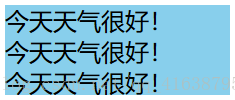

一般情况下，在页面中，一般溢出后会显示省略号，比如，当一行文本超出固定宽度就隐藏超出的内容显示省略号。

~~~css
/*只适用于单行文本*/
div{ 
    width: 150px;
    background: skyblue;
    overflow: hidden;      /*溢出隐藏*/
    white-space: nowrap;	/*规定文本不进行换行*/
    text-overflow: ellipsis;	/*当对象内文本溢出时显示省略标记（...）*/
}
~~~

效果如下：

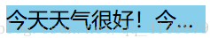

### 清除浮动

一般而言，**父级元素不设置高度时，高度由随内容增加自适应高度**。当父级元素内部的子元素全部都设置浮动float之后，**子元素会脱离标准流，不占位**，**父级元素检测不到子元素的高度，父级元素高度为0**。那么问题来了，如下：

~~~css
/*css样式*/

 
/*html*/
<body>
    

        
子元素1

		
子元素2

    

    
其他部分

</body>
~~~

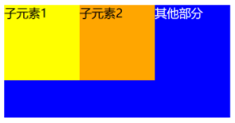

如上，由于父级元素没有高度，下面的元素会顶上去，造成页面的塌陷。因此，需要给父级加个`overflow:hidden`属性，这样**父级的高度就随子级容器及子级内容的高度而自适应**。(讲的不好，只讲了解决方法，没讲为什么要这样做，它是如何起效果的。)

由于在IE比较低版本的浏览器中使用`overflow：hidden;`是不能达到这样的效果，因此需要再加上`zoom:1;`

所以为了让兼容性更好的话，如果需要使用`overflow:hidden`来清除浮动，那么最好加上`zoom:1;`

~~~css
/*css样式*/

 
/*html*/
<body>
    

        
子元素1

		
子元素2

    

    
其他部分

</body>
~~~

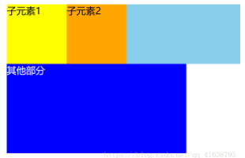

### 解决外边距塌陷

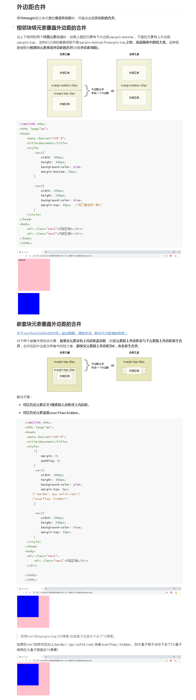

## 模态框拖拽思路(★)

## 0.5边框(★)

## 伪类有哪些？(我)

## 请介绍一下BFC(块级格式化上下文)？

[CSS 概念-BFC 深入浅出](http://obkoro1.com/web_accumulate/accumulate/CSS/CSS%E6%A6%82%E5%BF%B5-BFC%E6%B7%B1%E5%85%A5%E6%B5%85%E5%87%BA.html#bfc-%E6%98%AF%E4%BB%80%E4%B9%88%E9%AC%BC%EF%BC%9F)

## 怎么实现三列布局（左侧和右侧宽度固定，中间自适应）

- 绝对定位 + 中间版块不给宽度
- 两侧浮动 + 中间自动撑开（使用 calc 动态计算宽度，设置对应宽度的 margin）
- flex，左右设置 flex-basis，中间设置 flex-grow

## 移动端开发 rem 布局的原理（rem 单位换算）

## 什么是媒体查询(★)

## 如何在页面上画一个椭圆

~~~css

~~~

# HTML5、CSS3

## H5常用语法，CSS3常用语法(我)

## 请说出至少5个HTML5新增的标签，并说明其语义和应用场景？(我)

## 请说出你常用的CSS3样式(我)

## CSS3中的阴影(文本阴影、盒子阴影)简要介绍一下(我)

## 请说说你对标签语义化的理解？

# CSS布局

## 响应式布局应该怎么处理(★)

## DIV+CSS布局的好处

- 代码精简，且**结构与样式分离**，**易于维护**
- 代码量减少了，减少了大量的带宽，**页面加载的也更快**，提升了用户的体验
- 对**SEO**搜索引擎更加友好，且H5又新增了许多语义化标签更是如此
- 允许更多炫酷的页面效果，**丰富了页面**
- **符合W3C标准**，保证网站不会因为网络应用的升级而被淘汰

> 缺点: 不同浏览器对web标准默认值不同，所以更容易出现对浏览器的兼容性问题。

## 垂直水平居中方法(★)

## 如何居中div？如何居中一个浮动元素？如何让绝对定位的div居中？

## 谈谈你对CSS布局的理解？

## 你常用哪些布局方式(我)

## Flex垂直居中(我)

# JavaScript

## 数组去重方法(我)

## 数组有哪些常用方法(我)

## 对象如何转字符串(我)

## for循环有哪些方法(我)

## 手写数组排序(★)

## null和undefined的区别(★)

- `null`表示一个`"无"`的对象，也就是该处不应该有值；而`undefined`表示**未定义**。
- 在转换为数字时结果不同，`Number(null)`为`0`，而`undefined`为`NaN`。

使用场景上：

`null`：

- 作为函数的参数，表示该函数的参数不是对象
- 作为对象原型链的终点

`undefined`:

- 变量被声明了，但没有赋值时，就等于undefined
- 调用函数时，应该提供的参数没有提供，该参数等于undefined
- 对象没有赋值属性，该属性的值为undefined
- 函数没有返回值时，默认返回undefined

## BOM和DOM是什么(★)

## script 标签的属性有哪些

## script 标签的 defer 和 async 标签的作用与区别

## JS数据类型有哪些，如何对它们进行检测？

* 基本数据类型
  * **String**：字符串型
  * **Number**：数值型
  * **Boolean**：布尔型
  * **Null**：空值型
  * **Undefined**：未定义型
  * **Symbol(ES6)**：Symbol型
  * **BigInit(ES10)**：大数型
* 引用数据类型
  * Object：对象型
* 检测方法
  * typeof
  * instanceof

## 请说出10个数组的常用方法

[substring和substr以及slice和splice的用法和区别。](https://www.cnblogs.com/echolun/p/7646025.html)

* push：可向数组的末尾添加一个或多个元素，并返回新的长度。
* pop：用于删除并返回数组的最后一个元素。
* shift：用于把数组的第一个元素从其中删除，并返回第一个元素的值。
* unshift：可向数组的**开头**添加一个或更多元素，并返回新的长度。
* sort：用于对数组的元素进行排序。
* reverse：用于颠倒数组中元素的顺序。
* join：使用不同的分隔符来构建字符串。
* substring：可以用来截取一个字符串，和slice()类似。
* substr：用来截取字符串(截取开始位置的索引,截取的长度)
* slice：可以从字符串中截取指定的内容。
* **splice**：向/从数组中添加/删除项目，然后返回被删除的项目。
* split：可以将一个字符串拆分为一个数组。
* charAt：可以返回字符串指定位置的字符。
* concat：可以用来连接2个或多个字符串，作用和`+`一样。
* indexOf：该方法可以检索一个字符串中是否含有指定内容,如果字符串中含有该内容，则会返回其第一次出现的索引（第二次出现不管）,如果没有找到指定的内容，则返回-1。

## 请列举字符串操作的方法？

## 说说你对 this的理解

## 介绍一下JS有哪些内置对象？

## 什么是闭包？

## 什么是promise？它解决了哪些问题

## 在没有 promise 之前，怎么解决异步回调

[Javascript异步编程的4种方法](http://www.ruanyifeng.com/blog/2012/12/asynchronous%EF%BC%BFjavascript.html)

## 原型和原型链？(★★★★★●)

[我自己的博客-构造函数和原型章节-黑马程序员视频](https://lm1018.top/2020/08/22/JavaScript%E9%AB%98%E7%BA%A7/)

[2020面试收获 - js原型及原型链-感觉也是抄的黑马视频](https://juejin.cn/post/6844904093828251662#heading-1)

原型是什么？它是一个对象，我们也称prototype为**原型对象**；原型的作用是什么？**共享方法**

**ES6之前**，我们面向对象是通过**构造函数**来实现的，但是**构造函数有一个缺点**，**我们以前把我们的方法放到构造函数里面**，这样就会有一个问题，当我们创建**实例**的时候，每创建一个实例，都会为我们这个方法**单独开辟一个内存空间**，来存放同一个函数，这样就比较**浪费内存**，这个时候我们想到了一个**解决方案**，我们**把这些公共的方法定义到了构造函数的原型对象身上，这样就可以实现了我们这个方法的共享，所有的实例都可以使用这个方法了**。

**原型是一个对象，每一个构造函数系统都为我们定义好了这一个对象，那么原型对象的主要作用就是实现了我们方法的共享，不必再开辟内存空间，所有的实例都可以使用这个方法，这就是原型最伟大的地方了**。

### 概述

在典型的面向对象的语言中（如Java），都存在类的概念，**类就是对象的模板，对象就是类的实例**，但在**ES6之前**JS中并没用引入类的概念。

在ES6之前，**对象不是基于类创建的**，而是用一种称为**构造函数**的**特殊函数**来定义对象和它们的特征。

创建对象可以通过以下三种方式：

**1.new Object()**

**2.对象字面量**

**3.自定义构造函数**

~~~javascript
<!DOCTYPE html>
<html lang="en">

<head>
    <meta charset="UTF-8">
    <meta name="viewport" content="width=device-width, initial-scale=1.0">
    <meta http-equiv="X-UA-Compatible" content="ie=edge">
    <title>Document</title>
</head>

<body>
    
</body>

</html>
~~~

### 构造函数

讲原型则离不开**构造函数**，让我们先来认识下构造函数。

**构造函数**是一种特殊的函数，主要用来**初始化对象**，即为对象**成员变量**赋**初始值**，**它总与new一起使用**。我们可以把对象中一些**公共的属性和方法**抽取出来，然后封装到这个函数里面。

在JS中，使用构造函数时要注意以下两点：

- 构造函数用于创建**某一类对象**，其**首字母要大写(约定速成，利于辨认)**
- 构造函数要**和new一起使用**才有意义(**new让普通函数升华为构造函数**)

**new在执行时会做五件事情**：

①在内存中**创建一个新的空对象**，如`ldh{}`。

②为`ldh`准备**原型链连接**：`ldh.__proto__ = Star.prototype`

③**重新绑定this，使构造函数的this指向新对象**。

④**执行构造函数里面的代码**，给这个**新对象**添加属性和方法。

⑤**返回这个新对象**，此时的新对象就拥有了构造函数的方法和属性了（所以**构造函数里面不需要return**）。

#### 静态成员和实例成员

Javascript的构造函数中的**属性和方法**我们称为**成员**, 成员可以**添加**。可以在**构造函数本身**上添加，也可以在**构造函数内部的this**上添加。通过这两种方式添加的成员，就分别称为**静态成员**和**实例成员**。

- **静态成员**：在**构造函数本身**上添加的成员称为**静态成员**，**只能由构造函数本身来访问**
- **实例成员**：在**构造函数内部**通过**this**添加的成员称为**实例成员**，**只能由实例化的对象来访问**

~~~javascript
<!DOCTYPE html>
<html lang="en">

<head>
    <meta charset="UTF-8">
    <meta name="viewport" content="width=device-width, initial-scale=1.0">
    <meta http-equiv="X-UA-Compatible" content="ie=edge">
    <title>Document</title>
</head>

<body>
    
</body>

</html>
~~~

### 构造函数的问题

构造函数方法很好用，但是存在**浪费内存**的问题。你创建2个对象，就开辟了2个内存空间来存放同一个函数；如果有100个对象，那就要开辟100个内存空间来存放同一个函数，所以比较浪费内存空间。

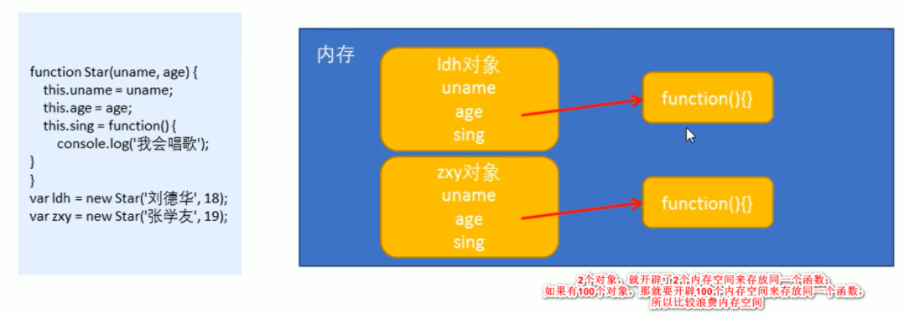

~~~javascript
<!DOCTYPE html>
<html lang="en">

<head>
    <meta charset="UTF-8">
    <meta name="viewport" content="width=device-width, initial-scale=1.0">
    <meta http-equiv="X-UA-Compatible" content="ie=edge">
    <title>Document</title>
</head>

<body>
    
</body>

</html>
~~~

### 构造函数原型prototype

在构造函数上**直接定义**的方法(函数)是**不共享**的，而构造函数**通过原型分配**的函数是所有对象所**共享**的。

JavaScript规定，**每一个构造函数都有一个prototype属性(这个属性也是一个对象)**，**指向另一个对象**。注意**这个prototype就是一个对象**(**prototype既是属性，也是对象**)，这个对象(指prototype)的**所有属性和方法**，都会**被构造函数所拥有**。

> 其实不止构造函数有prototype属性(这个属性也是对象)，普通函数也有，更进一步的说，对象也有prototype属性。(我按F12输入`console.log(Object.prototype)会有东西显示出来。`)

**我们可以把那些不变的方法，直接定义在prototype对象(属性)上，这样所有对象的实例就可以共享这些方法。**

~~~javascript
<!DOCTYPE html>
<html lang="en">

<head>
    <meta charset="UTF-8">
    <meta name="viewport" content="width=device-width, initial-scale=1.0">
    <meta http-equiv="X-UA-Compatible" content="ie=edge">
    <title>Document</title>
</head>

<body>
    
</body>

</html>
~~~

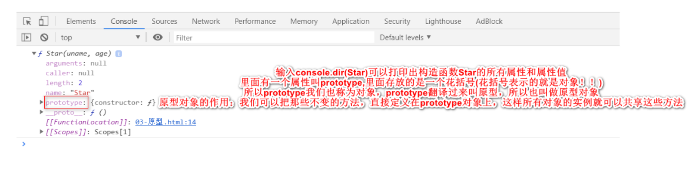

### 对象原型	`__proto__`	

可能有些同学还会有一些疑惑：老师呀，**我们sing这个方法是定义给了Star这个构造函数的原型对象身上，为什么我刘德华(ldh)这个对象就可以使用这个方法呢？那刘德华身上也没有sing这个方法呀！**要想解决这个问题，就是接下来我要给你们讲的：在我们**实例对象**身上，**也有一个原型**，叫做`__proto__`,那么**这个属性指向了构造函数的prototype原型对象**。

**对象**都会有一个属性`__proto__`**指向构造函数的prototype原型对象**，之所以我们对象可以使用构造函数prototype原型对象的属性和方法，就是因为对象有`__proto__`原型的存在。

* `__proto__`**对象原型**和**原型对象**prototype是等价的
* `__proto__`**对象原型**的意义就在于为**对象的查找机制提供一个方向**，或者说一条路线，但是它是一个**非标准属性**，因此**实际开发**中，不可以使用这个属性，它只是**内部指向原型对象prototype**。

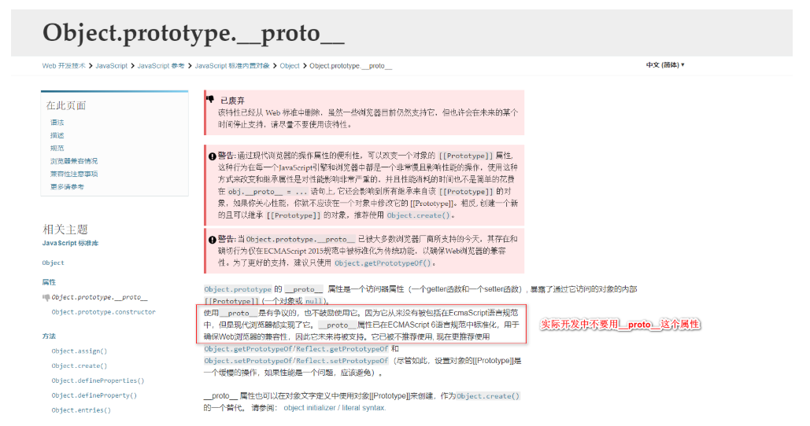

~~~javascript
<!DOCTYPE html>
<html lang="en">

<head>
    <meta charset="UTF-8">
    <meta name="viewport" content="width=device-width, initial-scale=1.0">
    <meta http-equiv="X-UA-Compatible" content="ie=edge">
    <title>Document</title>
</head>

<body>
    
</body>

</html>
~~~

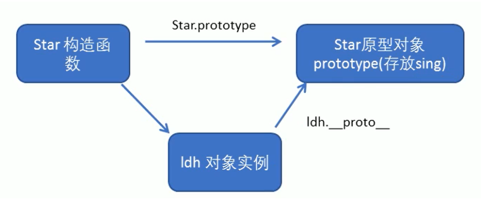

> 为了方便区分，我们把**prototype称为原型对象**，`__proto__`称为**对象原型**，不要搞晕了啊。

### constructor构造函数

[JavaScript中constructor属性](https://segmentfault.com/a/1190000013245739)

对象原型（`__proto__`）和构造函数（prototype）**原型对象**里面**都有**一个属性**constructor属性**，**constructor我们称为构造函数**，因为它**指回构造函数本身**。

constructor主要用于**记录该对象引用于哪个构造函数**，**它可以让原型对象重新指向原来的构造函数**。

> 作用1：记录该对象引用于哪个构造函数(找谁是它的妈)。
>
> 作用2：让原型对象**重新指向**原来的构造函数。

~~~javascript
<!DOCTYPE html>
<html lang="en">

<head>
    <meta charset="UTF-8">
    <meta name="viewport" content="width=device-width, initial-scale=1.0">
    <meta http-equiv="X-UA-Compatible" content="ie=edge">
    <title>Document</title>
</head>

<body>
    
</body>

</html>
~~~

### 构造函数、实例、原型对象三者之间的关系

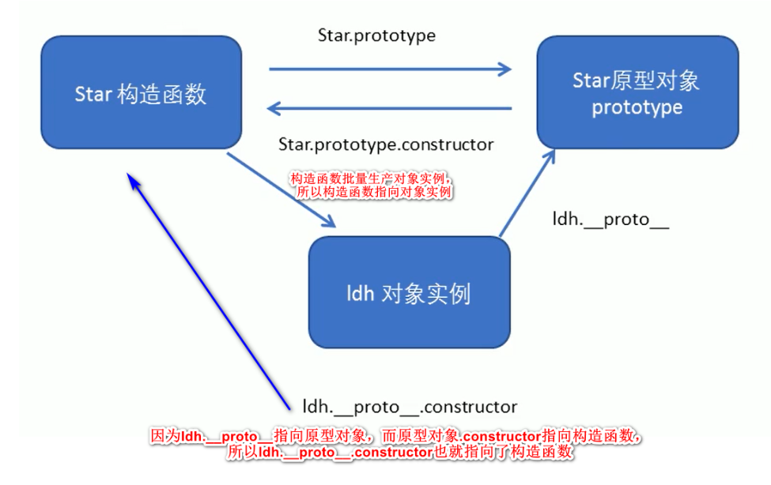

### 原型链

**原型对象**也是对象，**只要是对象，就有原型**(`__proto__`,这个原型指向的是**它的构造函数的prototype原型对象**)。**原型与原型层层相链接的过程即为原型链**。对象可以使用构造函数prototype原型对象的属性和方法，就是因为对象有`__proto__`原型的存在，并且每个对象都有`__proto__`原型的存在。

~~~javascript
<!DOCTYPE html>
<html lang="en">

<head>
    <meta charset="UTF-8">
    <meta name="viewport" content="width=device-width, initial-scale=1.0">
    <meta http-equiv="X-UA-Compatible" content="ie=edge">
    <title>Document</title>
</head>

<body>
    
</body>

</html>
~~~

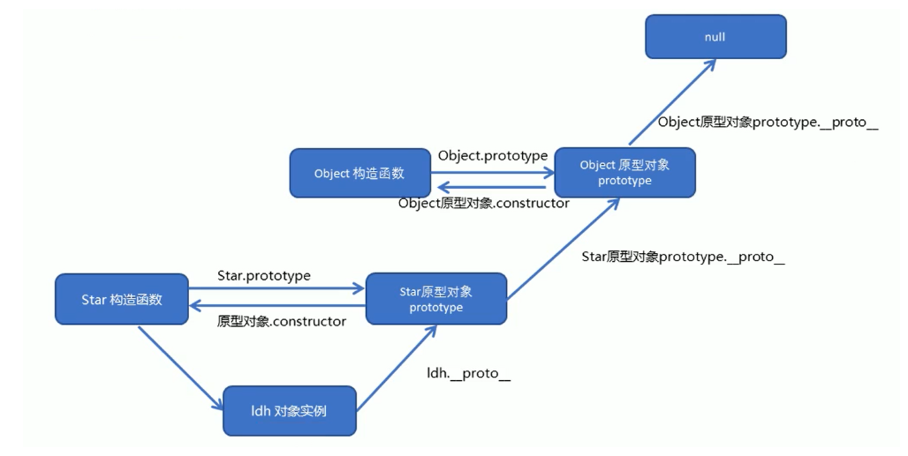

### JavaScript的成员查找机制（规则）

①当**访问一个对象的属性（包括方法）时**，首先查找这个**对象自身**有没有该属性。

②如果没有就查找它的原型（也就是`__proto__`指向的**prototype原型对象**）。

③如果还没有就查找**原型对象**的原型（**Object的原型对象**）。

④依此类推一直找到Object为止（null）。

~~~javascript
<!DOCTYPE html>
<html lang="en">

<head>
    <meta charset="UTF-8">
    <meta name="viewport" content="width=device-width, initial-scale=1.0">
    <meta http-equiv="X-UA-Compatible" content="ie=edge">
    <title>Document</title>
</head>

<body>
    
</body>

</html>
~~~

### 原型对象this指向

~~~javascript
<!DOCTYPE html>
<html lang="en">

<head>
    <meta charset="UTF-8">
    <meta name="viewport" content="width=device-width, initial-scale=1.0">
    <meta http-equiv="X-UA-Compatible" content="ie=edge">
    <title>Document</title>
</head>

<body>
    
</body>

</html>
~~~

### 扩展内置对象

可以通过原型对象，对原来的内置对象进行扩展自定义的方法。比如给数组增加自定义求偶数和的功能。

注意：数组和字符串内置对象不能给原型对象覆盖操作`Array.prototype = {}`，只能是`Array.prototype.xxx= function(){}`的方式。

~~~javascript
<!DOCTYPE html>
<html lang="en">

<head>
    <meta charset="UTF-8">
    <meta name="viewport" content="width=device-width, initial-scale=1.0">
    <meta http-equiv="X-UA-Compatible" content="ie=edge">
    <title>Document</title>
</head>

<body>
    
</body>

</html>
~~~

## `prototype`和`__proto__`的区别

## 什么是事件循环(eventloop)？(★)

## 原始数据类型和引用类型的区别

在内存中的存储方式不同，原始数据类型在内存中是栈存储，引用类型是堆存储 栈（stack）为自动分配的内存空间，它由系统自动释放；而堆（heap）则是动态分配的内存，大小不定也不会自动释放。

在内存中存储方式的不同导致了原始数据类型不可变 原始数据类型和引用数据类型做赋值操作一个是传值一个是传址。

## 深拷贝和浅拷贝的区别及其实现(★我)

### 浅拷贝

- ES6：object.assign()
- 展开运算符…
- 自己封装函数实现

### 深拷贝

* JSON.parse() (但是如果里面有 function 和 undefined 不可用)
* lodash
* 自己封装函数实现

## 面向对象和面向过程的区别

# ES6

[前端笔试题面试题记录（下）](https://juejin.cn/post/6844903588817289224)

## var,let和const的区别(★)

**let**

* 在同一个作用域里面：var可以**重复声明变量**，**let不能重复声明同一个变量**。

  ES5是**函数作用域**，即**一个函数里面才是一个作用域**，ES6是**块级作用域**（花括号'{这里面是一个作用域}'），如：if、for花括号里面都是一个作用域。

* var有**变量提升**，可以在变量声明之前使用，**let不存在变量提升，在变量之前使用会报错**。

* **let有暂时性死区**，[阮一峰大佬ES6入门文档](http://es6.ruanyifeng.com/#docs/let)解释如下：

  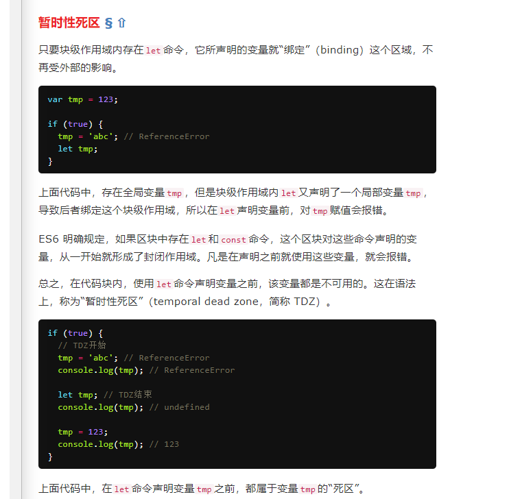

**const**

* const的很多特性跟let的特性一样，都有：**不可重复声明**，**不存在变量提升**，有**暂时性死区**，都是**块级作用域**。

* 还有一些跟let命令不一样的地方：**const必须在声明的时候同时赋值**，不然就会报错。const声明的是变量是常量，不能更改。

  这里的常量指的是：数值、字符串、布尔值，对于引用类型（数组和对象），const只能保证指针是固定的，至于数组和对象内部有没有改变就是const不能控制的地方

## filter的用法(★)

# 计算机网络及数据交互

## 常见的状态码(★)

## sessionStorage、localStorage和cookie的区别(★●我)

[Window.sessionStorage](https://developer.mozilla.org/zh-CN/docs/Web/API/Window/sessionStorage)

[localStorage和sessionStorage区别](https://juejin.cn/post/6844903631091662855)

[localStorage 存满了怎么办？](https://www.cnblogs.com/kidney/p/9058352.html)

[如何获得浏览器localStorage的剩余容量](https://www.cnblogs.com/MonkeyKingK/p/5499831.html)

[细说localStorage, sessionStorage, Cookie, Session-这个好](https://juejin.cn/post/6844903587764502536)

### sessionStorage和localStorage

**两者的共同点在于：**

* 语法相同：都是`setItem('key','value')`来保存数据，`getItem('key')`来获取数据，`removeItem('key')`删除保存的数据，`clear()`删除所有保存的数据。
* 存储大小均为5M左右
* 都有同源策略限制
* 仅在客户端中保存，**不参与和服务器的通信**

**两者的不同点在于：**

* 生命周期—数据可以存储多长时间
  * `localStorage`: 存储的数据是永久性的，除非用户人为删除，否则会一直存在。
  * `sessionStorage`: 与**存储数据的脚本**所在的标签页的有效期是相同的。一旦窗口或者标签页被关闭，那么所有通过 sessionStorage 存储的数据也会被删除。
* 作用域—谁拥有数据的访问权
  * `localStorage`: 在**同一个浏览器内**，**同源文档**之间共享 localStorage 数据，可以互相读取、覆盖。(**同一浏览器+同源文档**)
  * `sessionStorage`: 与 localStorage 一样需要**同一浏览器，同源文档**这一条件。不仅如此，sessionStorage 的作用域还被限定在了**窗口**中，也就是说，只有同一浏览器、同一窗口的同源文档才能共享数据。(**同一浏览器+同源文档+同一窗口**)

### cookie

Cookie是小甜饼的意思，主要有以下特点：

* 顾名思义，Cookie 确实非常小，它的大小限制为4KB左右
* 一般由**服务器生成**，可**设置失效时间**。如果**在浏览器端生成**Cookie，默认是**关闭浏览器**后失效
* 每次都会**携带在HTTP头中**，如果使用cookie保存过多数据会带来性能问题
* **原生API**不如storage友好，需要自己封装函数。
* 主要用途是**保存登录信息**和**标记用户**(比如购物车)等，不过随着`localStorage`的出现，现在购物车的工作Cookie承担的较少了。

## session和cookie的区别(★)

## Axios拦截器用法

## WebSocket的请求(★)

## 简述三次握手和四次挥手？

## GET和POST的区别？

## AJAX请求的步骤是什么？

## 什么是跨域？如何实现跨域？(★)

## 介绍一下JSONP，他的优缺点是什么？

## 介绍一下JSON(我)

## 浏览器执行过程

浏览器执行过程可以简单分为**加载**、**解析**、**渲染**，这三个步骤。

**加载**：根据请求的URL进行域名解析，向服务器发送请求，接收响应文件（如 HTML、JS、CSS、图片等）。

**解析**：对加载到的资源（HTML、JS、CSS等）进行语法解析，构建相应的内部数据结构（比如HTML的DOM树，JS对象的属性表，CSS的样式规则等）。

**渲染**：构建渲染树，对各个元素进行位置计算、样式计算等，然后根据渲染树完成页面布局及绘制的过程（可以理解为“画”页面元素）。实际上，渲染的动作一般都会执行多次，最后一次渲染，一定是依据之前加载过的所有样式整合后的渲染树进行绘制页面的，已经被渲染过的页面元素，也会被重新渲染。

这几个过程不是完全孤立的，会有交叉，比如HTML加载后就会进行解析，然后拉取HTML中指定的CSS、JS等。

## 如何从后台获取数据(我)

# 手写代码

## 手写Promise(★)

## 手写深拷贝、浅拷贝(我)

## 手写一个hash模式的简易路由

[你好，谈谈你对前端路由的理解](https://juejin.cn/post/6917523941435113486#heading-0)

~~~javascript
<!DOCTYPE html>
<html lang="en">
<head>
  <meta charset="UTF-8">
  <meta name="viewport" content="width=device-width, initial-scale=1.0">
  <title>Hash 模式</title>
</head>
  <body>
    

      <ul>
        <li><a href="#/page1">page1</a></li>
        <li><a href="#/page2">page2</a></li>
      </ul>
      <!--渲染对应组件的地方-->
      

    

  
  </body>
</html>
~~~

## 手写一个简单的history模式的简单路由

[你好，谈谈你对前端路由的理解](https://juejin.cn/post/6917523941435113486#heading-0)

~~~javascript
<!DOCTYPE html>
<html lang="en">
<head>
  <meta charset="UTF-8">
  <meta name="viewport" content="width=device-width, initial-scale=1.0">
  <title>History 模式</title>
</head>
<body>
  

    <ul>
      <li><a href="/page1">page1</a></li>
      <li><a href="/page2">page2</a></li>
    </ul>
    

  

  
</body>
</html>
~~~

## 手写一个节流和防抖功能(★)

[天哪！搞懂节流与防抖竟简单如斯](https://juejin.cn/post/6916386899678461960)

# Vue框架问题

## vue-router如何实现路由跳转(我)

首先vue-router是基于**路由和组件**的。

* 路由用于设定**访问路径**，将路径和组件映射起来
* 在vue-router的单页面应用中，页面的**路径的改变**就是**组件的切换**

使用vue-router主要有以下三步：

* 先创建路由组件
* 然后配置路由映射：组件和路径映射关系
* 最后使用路由：通过`<router-link>`和`<router-view>`

## 路由守卫的使用场景以及参数(★)

## 为什么v-if和v-for不建议同时使用(★)

## jQuery和Vue的区别(★)

##  $route和 $router的区别是什么？

## Vue生命周期？(★我)

## 小程序生命周期和Vue生命周期的区别(我)

## created和mounted有什么区别(我)

## 模块化和组件化的区别(★)

## Vue中你使用过哪些懒加载工具，是如何使用的(我)

## computed和watch的区别(★)

[面试题： Vue中的 computed 和 watch的区别](https://juejin.cn/post/6844903807592169486)

## 三大框架解决了传统JQuery开发的哪些问题？

使前端不用再操纵 DOM,数据驱动，通过数据的改变直接改变 DOM。

## Vue对对象进行操作没有响应式，该怎么办？除了`Vue.set`还有什么方法?(★)

##  Vue2.0 怎么实现双向绑定的

##  Vue3.0 怎么实现双向绑定的

## Object.defineProperty() 和proxy的区别？

##  你使用过哪些 Vue/React 全家桶，分别解决了什么问题？

## Vue hash 路由和 history 路由的区别？

## Vue 的 nexttick 实现的原理？

## 你对Vue3.0了解吗？(★)

## 如果有2个父子组件，经历了哪些生命周期函数(★)

## 虚拟DOM？(★)

## `v-for`的key的作用

## 简单介绍一下MVVM架构

[vue面试题之二：路由 vue-router 面试题](https://juejin.cn/post/6844903945530245133)

MVVM是`Model-View-ViewModel`的缩写，MVVM的设计原理是基于MVC的。

Model代表**数据模型**负责业务逻辑和数据封装，View代表**UI组件**负责界面和显示，ViewModel**监听模型数据改变和控制视图行为，处理用户交互**，简单来说就是通过**双向数据**绑定把View层和Model层**连接**起来。在MVVM架构下，View和Model没有直接联系，而是**通过ViewModel进行交互**，我们只关注业务逻辑，不需要手动操作DOM，不需要关注View和Model的同步工作。

# UI库

## 如何导入和使用`Element UI`？(★)

# 小程序

## H5页面中如何打开一个微信小程序

# 打包工具

## 为什么要用打包工具，它的作用是什么?(★)

## webpack 相关，是否自己配置过？

## webpack 和其他自动化构建工具（gulp、grunt、rollup）有哪些区别？

## 模块化解决了前端的哪些痛点

* 命名冲突
* 文件依赖
* 代码复用

## webpack 的 loader 和 plugin 区别，举几个常用的 loader 和 plugin 并说出作用？

## webpack 打包的过程

- 读取文件，分析模块依赖
- 对模块进行解析执行（深度遍历）
- 针对不同的模块使用不同的 loader
- 编译模块，生成抽象语法树（AST）
- 遍历 AST，输出 JS

## webpack 打包之后生成哪些文件？

## webpack 打包出来的文件体积过大怎么办？

## webpack 热部署的原理？

# 项目实际问题

## 页面加载白屏的原因有哪些，以及如何监控白屏时间，如何优化

## 通信的要点和目的

* 要点：1. 发送者和接收者 2. 传输媒介 3. 传输的数据 4. 传输格式（协议）
* 目的：1. 同步数据 2. 传递指令(执行的方法)

## 哪个项目让你最满意、代表你的最高水平？如何做的？

## 让你印象最深刻的一个（技术）难点，害的你搞了很久，最后怎么解的，有什么心得？

## 你做的时间最久的一个项目（或产品），你看到这个项目有哪些问题，你能做什么？

## 你能给我们团队或者产品带来什么？

# 基础算法题

## 数组求最大最小值(我)

# 性能优化和浏览器原理

## 前端性能优化方案(★)

## 内存泄露的原因(★)

## 为什么将资源分发到不同的域名会更高效(★)

## 前端回流和重绘(★)

# 非技术部分

## 请你自我介绍一下你自己？(★)

一般人回答这个问题过于平常，只说姓名、年龄、爱好、工作经验，这些在简历上都有。其实，企业最希望知道的是求职者能否胜任工作，包括：最强的技能、最深入研究的知识领域、个性中最积极的部分、做过的最成功的事，主要的成就等，这些都可以和学习无关，也可以和学习有关，但要突出积极的个性和做事的能力，说得合情合理企业才会相信。企业很重视一个人的礼貌，求职者要尊重考官，在回答每个问题之后都说一句“谢谢”，企业喜欢有礼貌的求职者。

一般面试当中自我介绍不能太长，也不能过短，**3分钟左右**最合适。

我的自我介绍如下：

面试官好，我叫李明，94年生人，今年27岁，来自于安徽芜湖。

2017年毕业于铜陵学院，本科学历，金融学专业。

毕业后做了4年的财务工作，包括会计、审计等。

2018年8月在学习Excel VBA的时候偶然接触了一些编程知识，然后仔细考虑了一下自己的未来和职业规划，产生了转行的想法，在网上看了一系列视频：C语言、Java、数据库、计算机网络、计算机组成原理等，因为非科班出生，所以这些课程对我来说十分晦涩难懂，**2018年8月-2019年1月**就处于一种瞎学乱学的阶段，一直到**2019年8月份**才真正开始决定学习前端作为自己今后的职业发展方向，然后就开始一边上班一边自学的生涯，一直到现在。

经过1年半的学习，感觉前端的基本知识已经差不多都过了一遍，于是21年2月23日正式离职，准备转行了。

我上家公司是一家科技型中介，主要给一些科技公司申报高新技术企业，软件著作权，注册商标等。我主要负责做审计报告，也兼任了一些出纳工作，因为工作比较轻松，朝九晚五，做五休二，所以我有比较充足的时间学习。

我的博客地址：www.lm1024.top

我的大体学习时间线是这样的：

19年8-9月，学习HTML、CSS；

9-11月，学习JS；

其中11月初的时候开始写博客，一直到现在。我的博客里也详细记录了我的学习轨迹和心路历程，如果您想了解更多的话可以访问一下我的博客。www.lm1024.top。

19年11月-20年2月，主要是看书《JavaScript高级程序设计》第3版和和复习以前学过的东西。期间也尝试过学习Vue，后来发现基础知识没打牢，时机没到，于是后面没学了。

20年2-3月，学习DOM、BOM、PHP、JQuery；

20年4-6月，感觉学习前端出现了瓶颈，于是学了一些网络安全和Linux；

20年6-8月，重新学习DOM、BOM、PHP、JQuery、Bootstrap、AJAX；

20年8-9月，学习JavaScript高级、H5C3、Flex布局、Node.js(学了一半没学完)

20年9-11月，再次学习Vue，花了2个半月时间，又把Vue基础知识点认认真真学了一遍，比2020年元旦第一次学效果好多了。

20年11月-21年1月，跟着视频做了一个Vue实战商城项目。

21年1月-2月，做了一个Vue后台管理系统，UI框架是Element UI。

21年1-2月，还学习完了小程序，做了一个小程序项目。

21年2月-现在，辞职后主要是准备面试题，还有对以前所学的知识点进行查漏补缺，深入理解，还有准备再做几个项目，把TS和Vue 3.0学一下。

以上就是我的基本情况了，谢谢。 

(更加详细学习时间线请见我的另一篇博客[前端学习历程](https://lm1024.top/2021/01/10/%E5%89%8D%E7%AB%AF%E5%AD%A6%E4%B9%A0%E5%8E%86%E7%A8%8B/#more))

