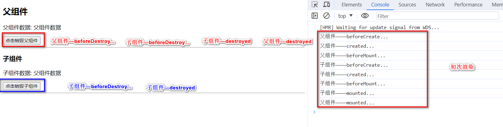
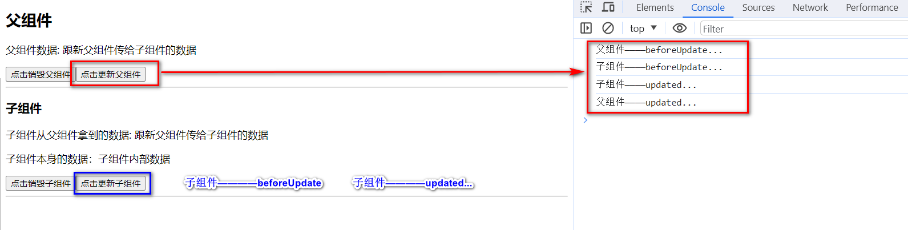

# 2023年9月前端面试

## 电话面试

> 2023年9月19日16:32:26

### 父子组件生命周期执行顺序

[Vue中父子组件生命周期执行顺序回顾](https://juejin.cn/post/6844904113914773518)

#### 初次渲染与销毁(父组件/子组件)：

#### 更新(父组件/子组件)

### 跨域问题

[如何解决前后端跨域问题（详细）](https://juejin.cn/post/7006320955316240415)

* 前端做代理服务器

  vue.config.js ==> 配置文件

  ~~~
  // 配置代理
      devServer: {
          port: 9086,
          open: false,
          overlay: {
              warnings: false,
              errors: true
          },
          proxy: {
              "/dev_api": {
                  target: "http://11.111.111.11:8000/", ==》 此处写明自己应该访问的代码
                  changeOrigin: true,
                  pathRewrite: {
                      "^/dev_api": ""
                  }
              }
          }
      },
  
  ~~~

  request.js 中配置baseUrl

  ~~~
  let instance = axios.create({
      baseURL: "/dev_api",
      withCredentials: true, // send cookies when cross-domain requests
      timeout:5000,
  })
  // 注意： dev_api 之前的 “/” 一定不可省略 别问我为啥知道的
  // 此处的dev_api 要与上面的相对应 当然 也可以起自己的名字
  ~~~

* 跨域技术-`CORS` （`CrossOrigin Resources Sharing`，跨源资源共享）  **（推荐）**

  - `CORS`，是 `HTML5` 的一项特性，它定义了一种浏览器和服务器交互的方式来确定是否允许跨域请求。
  - 使用原理：浏览器一旦发现 axios 请求跨域，就会自动添加一些附加的头信息，有时还会多出一次附加的请求，但用户不会有感知。 服务器根据这些附加的值，决定是否同意此次请求。

* JSONP(只能适用于get请求)

### CSS布局：两边固定，中间灵活

[css三列布局--两边固定中间自适应和中间固定两边自适应](https://blog.csdn.net/a18792627168/article/details/79686746)

## 太极

### 自我介绍

### 说一下自己的项目

最近做的谷粒学苑项目——前端和后台管理系统。

前端部分，使用主流的前端框架Vue，使用Es6的开发规范，采用模块化的开发模式。
后端部分，使用目前流行的SpringBoot+SpringCloud进行微服务架构，使用Feign、Gateway、Hystrix，以及阿里巴巴的Nacos等组件搭建了项目的基础环境。

普通用户-前台系统

* 前端开发(nuxt)
* 后端开发

管理员-后台管理系统

* 前端开发
* 后端开发

### 如何实现桌面文件拖拽式上传

[HTML5-拖拽上传文件](https://juejin.cn/post/7045934677667872805)

1、利用H5的`拖拽`事件，获取到拖进我们特定区域的文件数据（或者通过`input`元素获取文件）。
2、通过`FileReader对象`FileList对象读取文件的文件流数据。

主要用到的事件有：`drop`、`dragenter`、`dragover`、`dragleave`四个事件。

- `drop`：当一个元素或是选中的文字被拖拽释放到一个有效的释放目标位置时，`drop` 事件被抛出。
- `dragenter`：当拖动的元素或被选择的文本进入有效的放置目标时， `dragenter` 事件被触发。
- `dragover`：当元素或者选择的文本被拖拽到一个有效的放置目标上时，触发 `dragover `事件(每几百毫秒触发一次)。
- `dragleave`：当一个被拖动的元素或者被选择的文本离开一个有效的拖放目标时，将会触发`dragleave` 事件。

### 如何实现大文件断点续传

[【面试至少多加3k】基于原生js和node实现文件上传和大文件切片上传](https://www.bilibili.com/video/BV1zS4y1B7Eg?p=1)

其实断点续传的原理就是在Http的请求上多定义了断点续传相关的HTTP头 Range和Content-Range字段（Range和Content-Range是 HTTP/1.1中新增的HTTP头字段。它用于从服务器中获取一个大文件的某一部分内容，这极大地提高了HTTP的运行效率，很适合下载软件进行多线程下载和断点续传。）