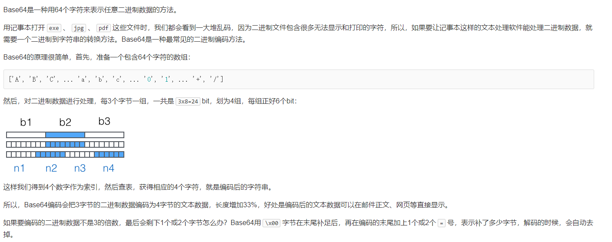

# 查漏补缺笔记

## 使用base64上传图片需要注意的点

使用Base64编码上传图片时，需要注意以下几点：

1. 编码过程：首先要对图片进行Base64编码，编码后的字符串通常是一串以“data:image/jpeg;base64,”或“data:image/png;base64,”等开头的字符串，也就是在HTTP header中以数据URL的形式表示。
2. 数据URL：编码后的图片数据以数据URL的形式存储在内存中，而不是存储为文件。因此，解码后可以直接使用这些数据来生成图像，无需进行文件操作。
3. 数据大小：Base64编码会比原始数据大约33%，因此，如果上传的图片较大，使用Base64编码会导致数据量变大，可能会超出服务器的限制。
4. 安全性：虽然使用Base64编码上传图片不会比直接上传图片更不安全，但需要注意的是，Base64编码会将特殊字符（如空格、换行符等）转换为不可见字符。因此，在向服务器提交Base64参数时，应避免误操作加入空格或换行符等，否则会导致解码错误。
5. 服务器端处理：服务器端需要对Base64编码进行解码，并将解码后的数据写入磁盘或内存中。不同的编程语言和框架有不同的处理方式，例如在Node.js中可以使用内置的`fs`模块来写入文件；在Python中可以使用`base64`模块进行解码。

总之，使用Base64编码上传图片需要注意编码过程、数据大小、安全性以及服务器端处理等方面的问题。

## 什么是base64

Base64是一种基于**64个可打印字符**来**表示二进制数据**的方法。它广泛应用于网络传输8Bit字节码，任何符号都可以转换成这个字符集中的字符，这个转换过程就叫做base64编码。Base64包括小写字母a-z、大写字母A-Z、数字0-9、符号"+"和"/"，一共64个字符。

用记事本打开`exe`、`jpg`、`pdf`这些文件时，我们都会看到一大堆乱码，因为二进制文件包含很多无法显示和打印的字符，所以，如果要让记事本这样的文本处理软件能处理二进制数据，就需要一个二进制到字符串的转换方法。Base64是一种最常见的二进制编码方法。

### 编码尺寸增加

每一个 Base64 字符实际上代表着 6 比特位。因此，3 字节（一字节是 8 比特，3 字节也就是 24 比特）的字符串/二进制文件可以转换成 4 个 Base64 字符（4x6 = 24 比特）。

这意味着 Base64 格式的字符串或文件的尺寸约是原始尺寸的 133%（增加了大约 33%）。如果编码的数据很少，增加的比例可能会更高。例如：长度为 1 的字符串 `"a"` 进行 Base64 编码后是 `"YQ=="`，长度为 4，尺寸增加了 3 倍。

## File API 与 Blob API

Web 应用程序的一个主要的痛点是无法操作用户计算机上的文件。2000 年之前，处理文件的唯一方
式是把 <input type="file"> 放到一个表单里，仅此而已。File API 与 Blob API 是为了让 Web 开发者
能以安全的方式访问客户端机器上的文件，从而更好地与这些文件交互而设计的。

### File 类型

File API 仍然以表单中的文件输入字段为基础，但是增加了直接访问文件信息的能力。HTML5 在
DOM 上为文件输入元素添加了 files 集合。当用户在文件字段中选择一个或多个文件时，这个 files
集合中会包含一组 File 对象，表示被选中的文件。每个 File 对象都有一些只读属性。
 name ：本地系统中的文件名。
 size ：以字节计的文件大小。
 type ：包含文件 MIME 类型的字符串。
 lastModifiedDate ：表示文件最后修改时间的字符串。这个属性只有 Chome 实现了。
例如，通过监听 change 事件然后遍历 files 集合可以取得每个选中文件的信息：

~~~javascript
let filesList = document.getElementById("files-list");
filesList.addEventListener("change", (event) => {
let files = event.target.files,
i = 0,
len = files.length;
while (i < len) {
const f = files[i];
console.log(`${f.name} (${f.type}, ${f.size} bytes)`);
i++;
}
});
~~~

这个例子简单地在控制台输出了每个文件的信息。仅就这个能力而言，已经可以说是 Web 应用向
前迈进的一大步了。不过，File API 还提供了 FileReader 类型，让我们可以实际从文件中读取数据。

### FileReader 类型

FileReader 类型表示一种异步文件读取机制。可以把 FileReader 想象成类似于 XMLHttpRequest ，
只不过是用于从文件系统读取文件，而不是从服务器读取数据。 FileReader 类型提供了几个读取文件
数据的方法。
 readAsText(file, encoding) ：从文件中读取纯文本内容并保存在 result 属性中。第二个
参数表示编码，是可选的。

 readAsDataURL(file) ：读取文件并将内容的数据 URI 保存在 result 属性中。
 readAsBinaryString(file) ：读取文件并将每个字符的二进制数据保存在 result 属性中。
 readAsArrayBuffer(file) ：读取文件并将文件内容以 ArrayBuffer 形式保存在 result 属性。
这些读取数据的方法为处理文件数据提供了极大的灵活性。例如，为了向用户显示图片，可以将图
片读取为数据 URI，而为了解析文件内容，可以将文件读取为文本。
因为这些读取方法是异步的，所以每个 FileReader 会发布几个事件，其中 3 个最有用的事件是
progress 、 error 和 load ，分别表示还有更多数据、发生了错误和读取完成。
progress 事件每 50 毫秒就会触发一次，其与 XHR 的 progress 事件具有相同的信息：
lengthComputable 、 loaded 和 total 。此外，在 progress 事件中可以读取 FileReader 的 result
属性，即使其中尚未包含全部数据。
error 事件会在由于某种原因无法读取文件时触发。触发 error 事件时， FileReader 的 error
属性会包含错误信息。这个属性是一个对象，只包含一个属性： code 。这个错误码的值可能是 1（未找
到文件）、2（安全错误）、3（读取被中断）、4（文件不可读）或 5（编码错误）。
load 事件会在文件成功加载后触发。如果 error 事件被触发，则不会再触发 load 事件。下面的
例子演示了所有这 3 个事件：

~~~javascript
let filesList = document.getElementById("files-list");
filesList.addEventListener("change", (event) => {
let info = "",
output = document.getElementById("output"),
progress = document.getElementById("progress"),
files = event.target.files,
type = "default",
reader = new FileReader();
if (/image/.test(files[0].type)) {
reader.readAsDataURL(files[0]);
type = "image";
} else {
reader.readAsText(files[0]);
type = "text";
}
reader.onerror = function() {
output.innerHTML = "Could not read file, error code is " +
reader.error.code;
};
reader.onprogress = function(event) {
if (event.lengthComputable) {
progress.innerHTML = `${event.loaded}/${event.total}`;
}
};
reader.onload = function() {
let html = "";
switch(type) {
case "image":
html = ``;
break;
        case "text":
html = reader.result;
break;
}
output.innerHTML = html;
};
});
~~~

以上代码从表单字段中读取一个文件，并将其内容显示在了网页上。如果文件的 MIME 类型表示它
是一个图片，那么就将其读取后保存为数据 URI，在 load 事件触发时将数据 URI 作为图片插入页面中。
如果文件不是图片，则读取后将其保存为文本并原样输出到网页上。 progress 事件用于跟踪和显示读
取文件的进度，而 error 事件用于监控错误。
如果想提前结束文件读取，则可以在过程中调用 abort() 方法，从而触发 abort 事件。在 load 、
error 和 abort 事件触发后，还会触发 loadend 事件。 loadend 事件表示在上述 3 种情况下，所有读
取操作都已经结束。 readAsText() 和 readAsDataURL() 方法已经得到了所有主流浏览器支持。

## 如何实现大文件上传和断点续传

前端面试中可以这样回答大文件上传和断点续传的问题：

1. 实现大文件上传

对于大文件上传，前端可以使用HTML5的File API，将文件分块并逐个发送到服务器。具体来说，可以使用Blob对象的slice方法对文件进行分块，然后使用XMLHttpRequest或Fetch API发送请求，将每一块数据发送到服务器。

在后端，服务器需要接收并存储每一块数据。通常使用多线程或异步处理来接收和存储数据。当所有数据块都上传完毕后，服务器需要对这些数据块进行合并，以生成完整的文件。

2. 实现断点续传

断点续传是指当文件上传中断时，可以从中断点重新开始上传，而不是重新上传整个文件。实现断点续传需要使用HTTP的Range请求头，指定要上传的文件的范围。

在前端，可以使用XMLHttpRequest或Fetch API发送请求，并在请求中包含Range请求头。在后端，服务器需要接收并处理Range请求头，并从指定的位置开始接收数据。如果上传过程中出现了中断，可以从中断的位置继续上传，而不是重新上传整个文件。

另外，为了实现断点续传，还需要将上传的文件信息保存在服务器端，包括文件的大小、已经上传的大小等。当重新上传时，可以检查这些信息，确定上传的位置，并从该位置开始接收数据。

需要注意的是，实现断点续传需要在服务器端对文件进行合并，以生成完整的文件。如果文件比较大，这个过程可能会占用一定的时间和资源。