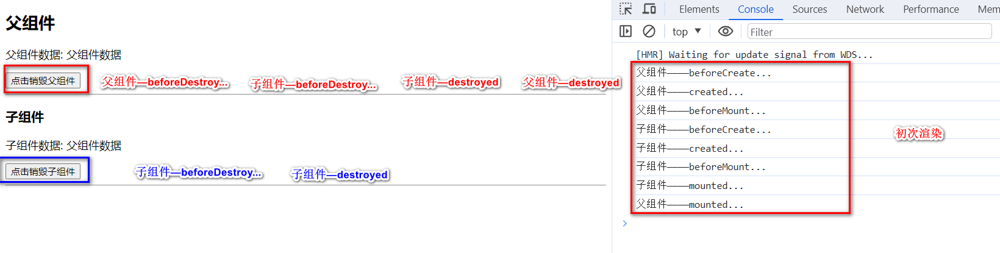
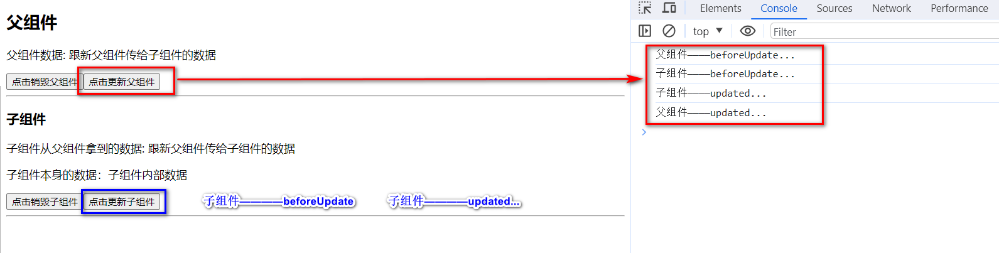

# 2023年9月前端面试

## 电话面试

> 2023年9月19日16:32:26

### 父子组件生命周期执行顺序

[Vue中父子组件生命周期执行顺序回顾](https://juejin.cn/post/6844904113914773518)

#### 初次渲染与销毁(父组件/子组件)：

#### 更新(父组件/子组件)

### 跨域问题

[如何解决前后端跨域问题（详细）](https://juejin.cn/post/7006320955316240415)

* 前端做代理服务器

  vue.config.js ==> 配置文件

  ~~~
  // 配置代理
      devServer: {
          port: 9086,
          open: false,
          overlay: {
              warnings: false,
              errors: true
          },
          proxy: {
              "/dev_api": {
                  target: "http://11.111.111.11:8000/", ==》 此处写明自己应该访问的代码
                  changeOrigin: true,
                  pathRewrite: {
                      "^/dev_api": ""
                  }
              }
          }
      },
  
  ~~~

  request.js 中配置baseUrl

  ~~~
  let instance = axios.create({
      baseURL: "/dev_api",
      withCredentials: true, // send cookies when cross-domain requests
      timeout:5000,
  })
  // 注意： dev_api 之前的 “/” 一定不可省略 别问我为啥知道的
  // 此处的dev_api 要与上面的相对应 当然 也可以起自己的名字
  
  ~~~

* 跨域技术-`CORS` （`CrossOrigin Resources Sharing`，跨源资源共享）  **（推荐）**

  - `CORS`，是 `HTML5` 的一项特性，它定义了一种浏览器和服务器交互的方式来确定是否允许跨域请求。
  - 使用原理：浏览器一旦发现 axios 请求跨域，就会自动添加一些附加的头信息，有时还会多出一次附加的请求，但用户不会有感知。 服务器根据这些附加的值，决定是否同意此次请求。

* JSONP(只能适用于get请求)

### CSS布局：两边固定，中间灵活

[css三列布局--两边固定中间自适应和中间固定两边自适应](https://blog.csdn.net/a18792627168/article/details/79686746)

